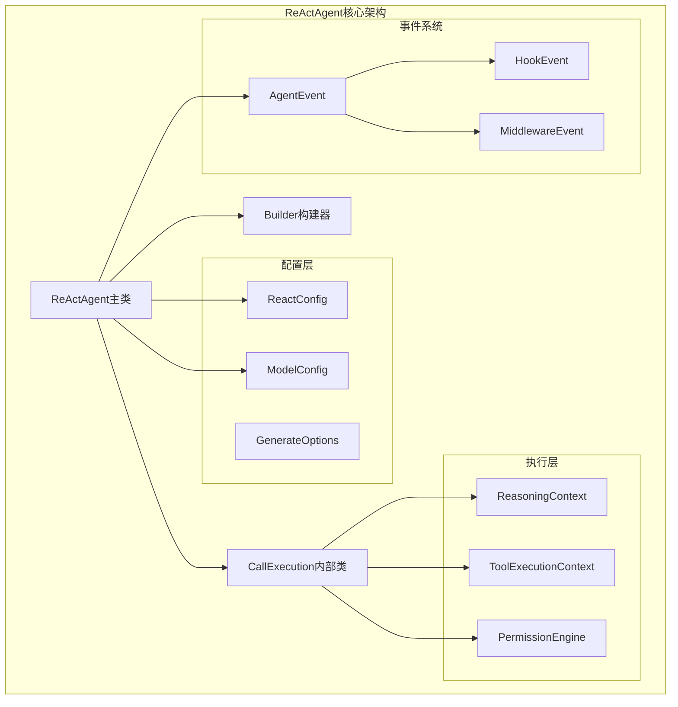
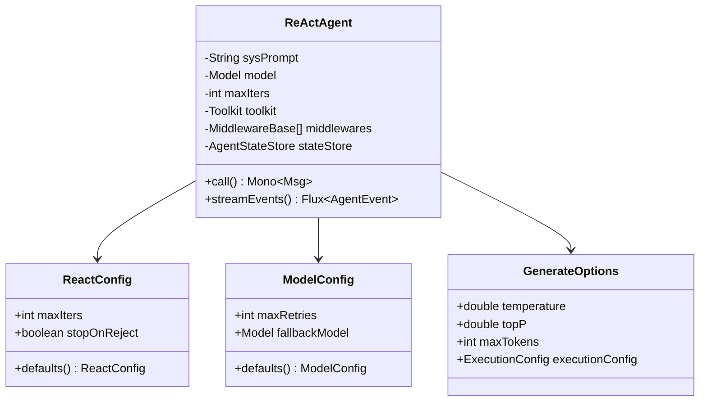
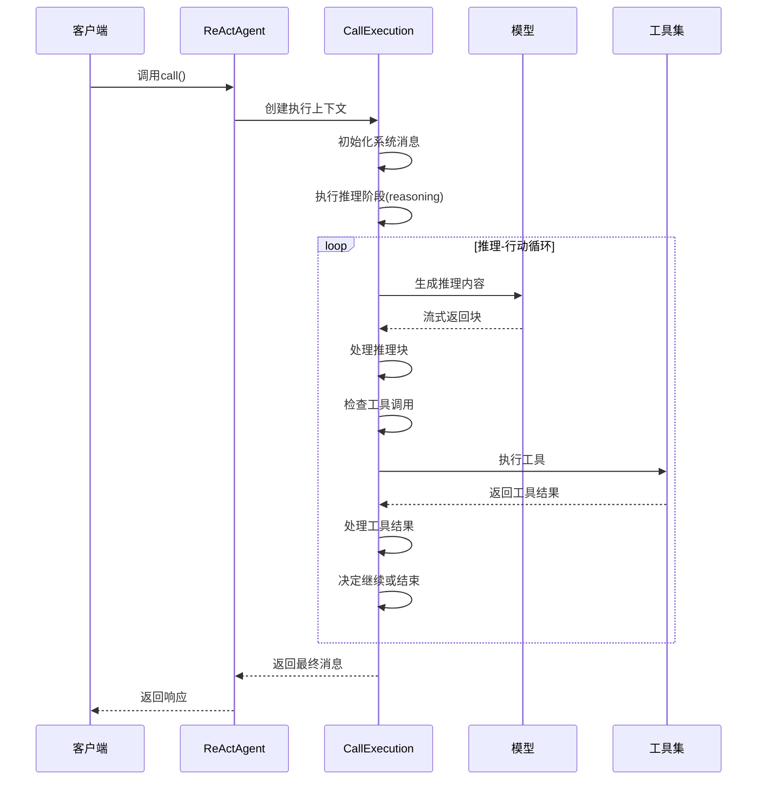
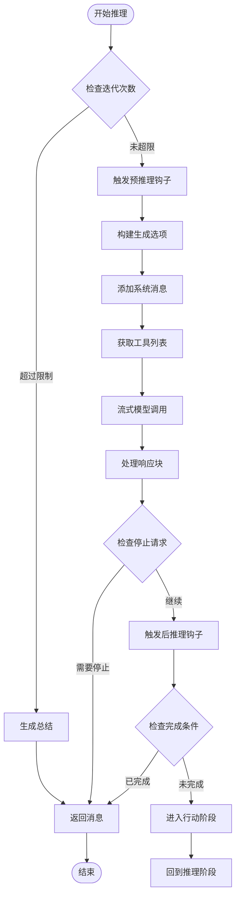
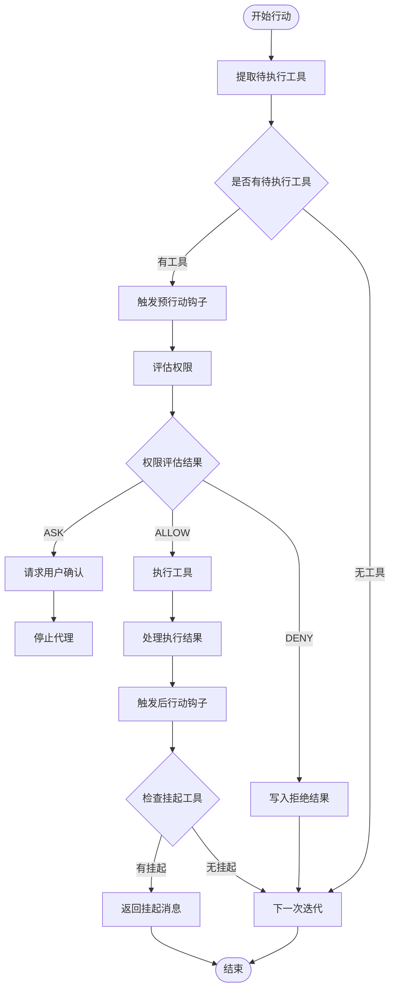
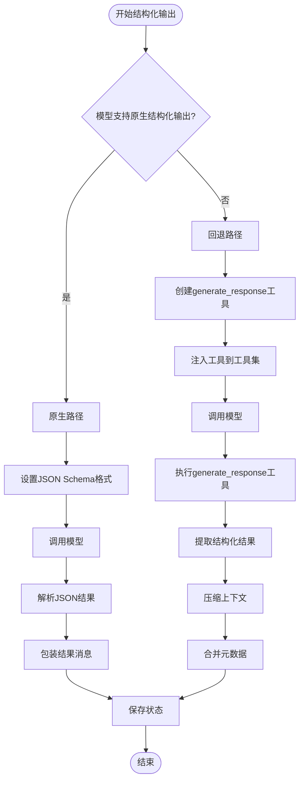
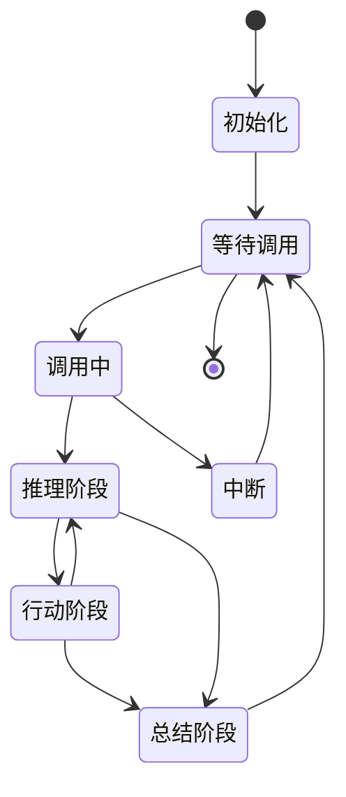
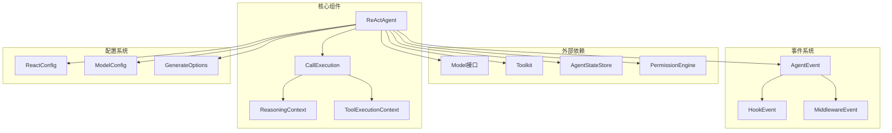
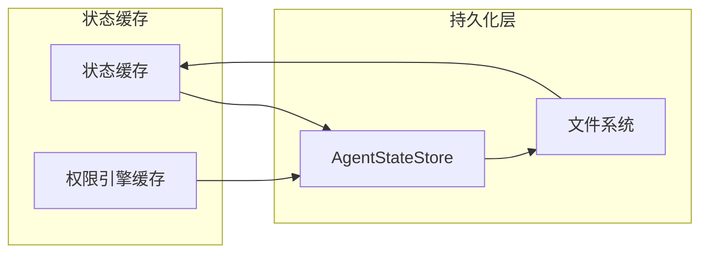

# ReActAgent核心实现

<cite>
**本文档引用的文件**
- [ReActAgent.java](file://agentscope-core/src/main/java/io/agentscope/core/ReActAgent.java)
- [ReactConfig.java](file://agentscope-core/src/main/java/io/agentscope/core/agent/config/ReactConfig.java)
- [ModelConfig.java](file://agentscope-core/src/main/java/io/agentscope/core/agent/config/ModelConfig.java)
</cite>

## 目录
1. [引言](#引言)
2. [项目结构](#项目结构)
3. [核心组件](#核心组件)
4. [架构概览](#架构概览)
5. [详细组件分析](#详细组件分析)
6. [依赖分析](#依赖分析)
7. [性能考虑](#性能考虑)
8. [故障排除指南](#故障排除指南)
9. [结论](#结论)

## 引言

ReActAgent是Agentscope框架中的核心智能体实现，基于ReAct（Reasoning and Acting）推理-行动循环模式。该实现结合了先进的语言模型推理能力和工具执行能力，通过迭代的推理-行动循环来解决复杂任务。

ReActAgent的核心特性包括：
- 响应式流式处理：使用Project Reactor实现非阻塞执行
- 可扩展钩子系统：支持监控和拦截代理执行
- 人机协作支持：通过stopAgent()在推理阶段进行人工干预
- 结构化输出：每调用一次的generate_response工具提供类型安全的输出

## 项目结构

ReActAgent位于agentscope-core模块中，采用清晰的分层架构设计：

**图表来源**
- [ReActAgent.java:148-200](file://agentscope-core/src/main/java/io/agentscope/core/ReActAgent.java#L148-L200)
- [ReactConfig.java:22-56](file://agentscope-core/src/main/java/io/agentscope/core/agent/config/ReactConfig.java#L22-L56)
- [ModelConfig.java:21-45](file://agentscope-core/src/main/java/io/agentscope/core/agent/config/ModelConfig.java#L21-L45)

**章节来源**
- [ReActAgent.java:148-200](file://agentscope-core/src/main/java/io/agentscope/core/ReActAgent.java#L148-L200)
- [ReactConfig.java:22-56](file://agentscope-core/src/main/java/io/agentscope/core/agent/config/ReactConfig.java#L22-L56)
- [ModelConfig.java:21-45](file://agentscope-core/src/main/java/io/agentscope/core/agent/config/ModelConfig.java#L21-L45)

## 核心组件

### ReActAgent主类

ReActAgent继承自AgentBase，实现了完整的推理-行动循环逻辑。其核心字段包括：

- **系统提示词(sysPrompt)**：定义代理的行为准则
- **模型(model)**：语言模型实例，负责推理生成
- **最大迭代次数(maxIters)**：控制推理-行动循环的上限
- **工具包(toolkit)**：可用工具的集合
- **中间件列表(middlewares)**：执行拦截和扩展功能
- **状态存储(stateStore)**：持久化代理状态

### CallExecution执行上下文

每个代理调用都会创建一个独立的CallExecution实例，包含：
- 当前会话的状态(AgentState)
- 权限引擎(PermissionEngine)
- 事件发射器(FluxSink)
- 结构化输出工具(soTool)

### 配置系统

ReActAgent采用分层配置设计：

**图表来源**
- [ReActAgent.java:218-272](file://agentscope-core/src/main/java/io/agentscope/core/ReActAgent.java#L218-L272)
- [ReactConfig.java:29-55](file://agentscope-core/src/main/java/io/agentscope/core/agent/config/ReactConfig.java#L29-L55)
- [ModelConfig.java:30-44](file://agentscope-core/src/main/java/io/agentscope/core/agent/config/ModelConfig.java#L30-L44)

**章节来源**
- [ReActAgent.java:218-272](file://agentscope-core/src/main/java/io/agentscope/core/ReActAgent.java#L218-L272)
- [ReactConfig.java:29-55](file://agentscope-core/src/main/java/io/agentscope/core/agent/config/ReactConfig.java#L29-L55)
- [ModelConfig.java:30-44](file://agentscope-core/src/main/java/io/agentscope/core/agent/config/ModelConfig.java#L30-L44)

## 架构概览

ReActAgent采用事件驱动的响应式架构，通过Project Reactor实现非阻塞异步处理：

**图表来源**
- [ReActAgent.java:1821-2005](file://agentscope-core/src/main/java/io/agentscope/core/ReActAgent.java#L1821-L2005)
- [ReActAgent.java:2167-2248](file://agentscope-core/src/main/java/io/agentscope/core/ReActAgent.java#L2167-L2248)

## 详细组件分析

### 推理阶段(Reasoning)

推理阶段负责语言模型的对话生成和思考过程：

**图表来源**
- [ReActAgent.java:1835-1962](file://agentscope-core/src/main/java/io/agentscope/core/ReActAgent.java#L1835-L1962)
- [ReActAgent.java:2020-2098](file://agentscope-core/src/main/java/io/agentscope/core/ReActAgent.java#L2020-L2098)

推理阶段的关键特性：
- **流式处理**：实时接收和处理模型响应块
- **钩子系统**：支持中间件拦截和修改推理过程
- **权限检查**：集成权限引擎确保安全执行
- **中断处理**：支持系统级和用户级中断信号

**章节来源**
- [ReActAgent.java:1835-1962](file://agentscope-core/src/main/java/io/agentscope/core/ReActAgent.java#L1835-L1962)
- [ReActAgent.java:2020-2098](file://agentscope-core/src/main/java/io/agentscope/core/ReActAgent.java#L2020-L2098)

### 行动阶段(Acting)

行动阶段负责工具执行和外部交互：

**图表来源**
- [ReActAgent.java:2167-2323](file://agentscope-core/src/main/java/io/agentscope/core/ReActAgent.java#L2167-L2323)
- [ReActAgent.java:2519-2583](file://agentscope-core/src/main/java/io/agentscope/core/ReActAgent.java#L2519-L2583)

行动阶段的核心功能：
- **权限管理**：集成PermissionEngine进行细粒度控制
- **批量执行**：支持多个工具的并发执行
- **错误恢复**：自动处理工具执行失败情况
- **挂起机制**：支持长时间运行工具的挂起和恢复

**章节来源**
- [ReActAgent.java:2167-2323](file://agentscope-core/src/main/java/io/agentscope/core/ReActAgent.java#L2167-L2323)
- [ReActAgent.java:2519-2583](file://agentscope-core/src/main/java/io/agentscope/core/ReActAgent.java#L2519-L2583)

### 结构化输出机制

ReActAgent支持两种结构化输出路径：

**图表来源**
- [ReActAgent.java:968-1078](file://agentscope-core/src/main/java/io/agentscope/core/ReActAgent.java#L968-L1078)
- [ReActAgent.java:1182-1253](file://agentscope-core/src/main/java/io/agentscope/core/ReActAgent.java#L1182-L1253)

**章节来源**
- [ReActAgent.java:968-1078](file://agentscope-core/src/main/java/io/agentscope/core/ReActAgent.java#L968-L1078)
- [ReActAgent.java:1182-1253](file://agentscope-core/src/main/java/io/agentscope/core/ReActAgent.java#L1182-L1253)

### 生命周期管理

ReActAgent实现了完整的生命周期管理：

**图表来源**
- [ReActAgent.java:511-536](file://agentscope-core/src/main/java/io/agentscope/core/ReActAgent.java#L511-L536)
- [ReActAgent.java:2838-2908](file://agentscope-core/src/main/java/io/agentscope/core/ReActAgent.java#L2838-L2908)

## 依赖分析

ReActAgent的依赖关系体现了清晰的关注点分离：

**图表来源**
- [ReActAgent.java:18-125](file://agentscope-core/src/main/java/io/agentscope/core/ReActAgent.java#L18-L125)
- [ReActAgent.java:218-272](file://agentscope-core/src/main/java/io/agentscope/core/ReActAgent.java#L218-L272)

**章节来源**
- [ReActAgent.java:18-125](file://agentscope-core/src/main/java/io/agentscope/core/ReActAgent.java#L18-L125)
- [ReActAgent.java:218-272](file://agentscope-core/src/main/java/io/agentscope/core/ReActAgent.java#L218-L272)

## 性能考虑

### 并发处理

ReActAgent采用以下并发策略：
- **会话级序列化**：同一会话内的调用按序列执行，避免竞态条件
- **工具批处理**：支持多个工具的并发执行以提高吞吐量
- **内存优化**：使用ConcurrentHashMap缓存状态，减少锁竞争

### 缓存策略

**图表来源**
- [ReActAgent.java:262-269](file://agentscope-core/src/main/java/io/agentscope/core/ReActAgent.java#L262-L269)
- [ReActAgent.java:412-422](file://agentscope-core/src/main/java/io/agentscope/core/ReActAgent.java#L412-L422)

### 错误处理和恢复

ReActAgent实现了多层次的错误处理机制：
- **工具执行恢复**：自动检测并修复挂起的工具调用
- **模型调用重试**：基于ModelConfig配置的重试机制
- **优雅关闭**：支持服务优雅关闭时的状态保存

## 故障排除指南

### 常见问题诊断

1. **代理不响应**：检查是否达到最大迭代次数限制
2. **工具执行失败**：验证工具权限配置和输入参数
3. **内存泄漏**：确认AgentStateStore正确配置和清理
4. **并发冲突**：避免对单个ReActAgent实例的并发调用

### 调试技巧

- 使用streamEvents()方法获取详细的执行事件流
- 启用适当的日志级别以捕获调试信息
- 利用RuntimeContext传递调试上下文信息

**章节来源**
- [ReActAgent.java:2838-2908](file://agentscope-core/src/main/java/io/agentscope/core/ReActAgent.java#L2838-L2908)
- [ReActAgent.java:3196-3205](file://agentscope-core/src/main/java/io/agentscope/core/ReActAgent.java#L3196-L3205)

## 结论

ReActAgent展现了现代智能体系统的最佳实践，通过精心设计的架构实现了推理-行动循环的高效执行。其关键优势包括：

- **模块化设计**：清晰的职责分离和可扩展性
- **响应式编程**：利用Project Reactor实现高性能异步处理
- **安全控制**：集成权限引擎确保工具执行的安全性
- **可观测性**：完整的事件系统支持调试和监控

该实现为构建复杂的AI应用提供了坚实的基础，支持从简单对话到复杂任务执行的各种场景。