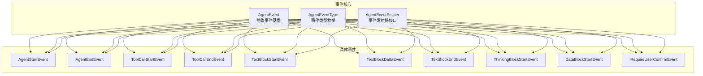
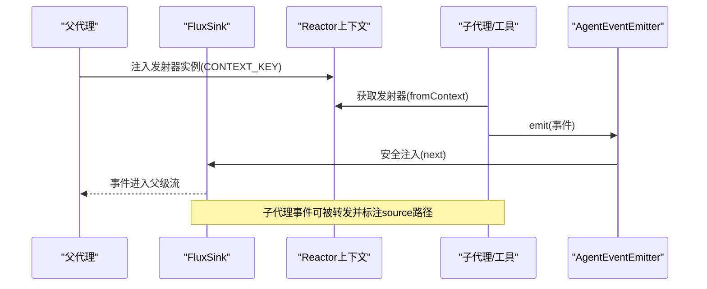
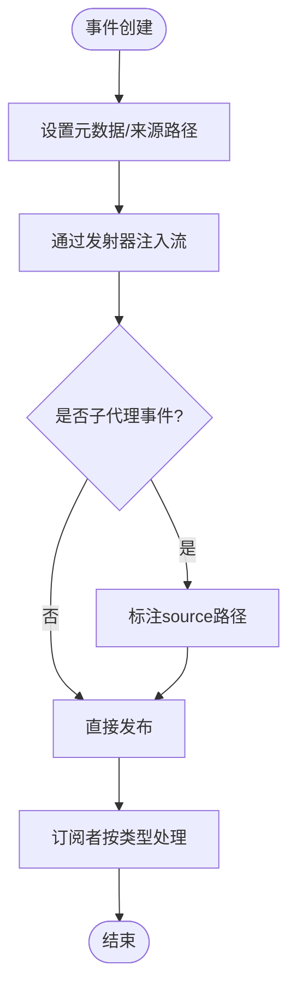
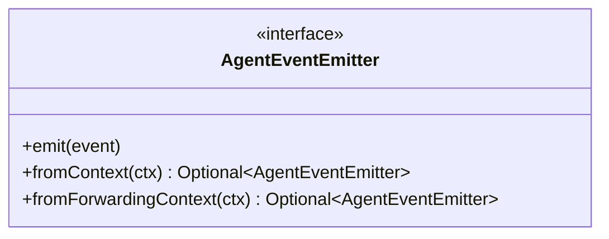
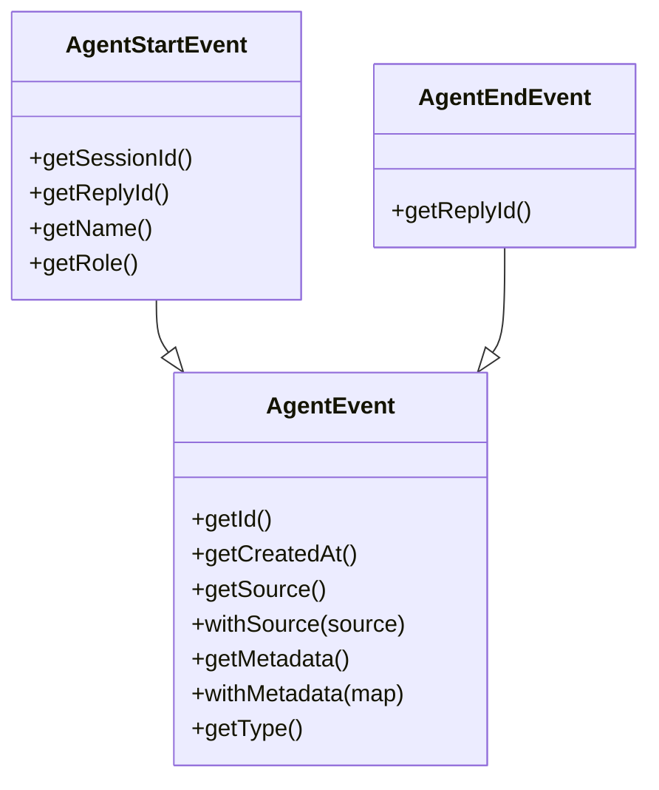
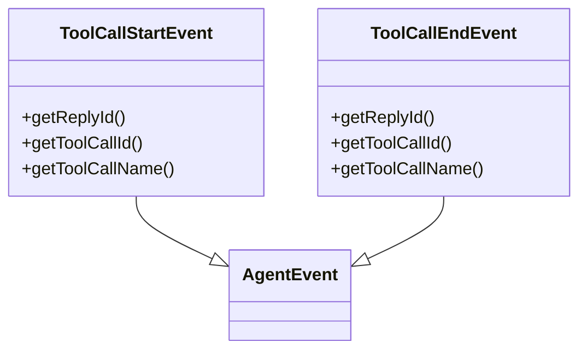
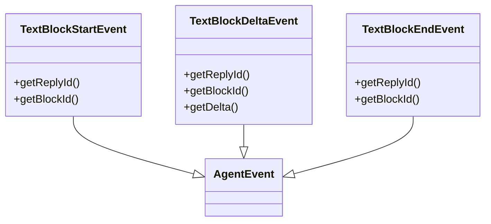
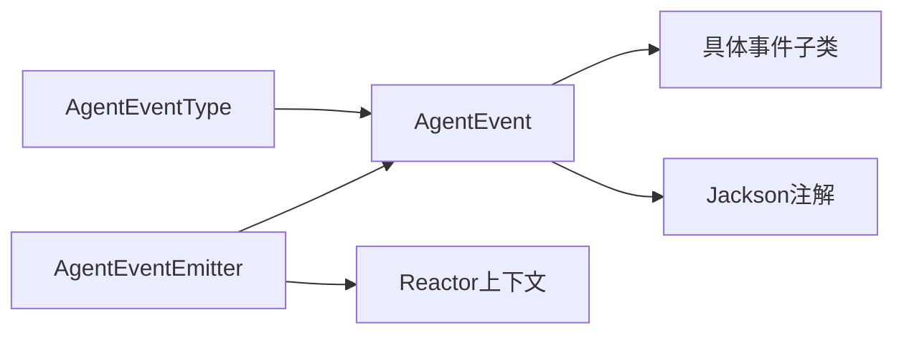

# 事件系统架构

<cite>
**本文引用的文件**   
- [AgentEvent.java](file://agentscope-core/src/main/java/io/agentscope/core/event/AgentEvent.java)
- [AgentEventType.java](file://agentscope-core/src/main/java/io/agentscope/core/event/AgentEventType.java)
- [AgentEventEmitter.java](file://agentscope-core/src/main/java/io/agentscope/core/event/AgentEventEmitter.java)
- [AgentStartEvent.java](file://agentscope-core/src/main/java/io/agentscope/core/event/AgentStartEvent.java)
- [AgentEndEvent.java](file://agentscope-core/src/main/java/io/agentscope/core/event/AgentEndEvent.java)
- [ToolCallStartEvent.java](file://agentscope-core/src/main/java/io/agentscope/core/event/ToolCallStartEvent.java)
- [ToolCallEndEvent.java](file://agentscope-core/src/main/java/io/agentscope/core/event/ToolCallEndEvent.java)
- [TextBlockStartEvent.java](file://agentscope-core/src/main/java/io/agentscope/core/event/TextBlockStartEvent.java)
- [TextBlockDeltaEvent.java](file://agentscope-core/src/main/java/io/agentscope/core/event/TextBlockDeltaEvent.java)
- [TextBlockEndEvent.java](file://agentscope-core/src/main/java/io/agentscope/core/event/TextBlockEndEvent.java)
- [ThinkingBlockStartEvent.java](file://agentscope-core/src/main/java/io/agentscope/core/event/ThinkingBlockStartEvent.java)
- [DataBlockStartEvent.java](file://agentscope-core/src/main/java/io/agentscope/core/event/DataBlockStartEvent.java)
- [RequireUserConfirmEvent.java](file://agentscope-core/src/main/java/io/agentscope/core/event/RequireUserConfirmEvent.java)
</cite>

## 目录
1. [引言](#引言)
2. [项目结构](#项目结构)
3. [核心组件](#核心组件)
4. [架构总览](#架构总览)
5. [详细组件分析](#详细组件分析)
6. [依赖分析](#依赖分析)
7. [性能考虑](#性能考虑)
8. [故障排查指南](#故障排查指南)
9. [结论](#结论)
10. [附录：扩展与最佳实践](#附录扩展与最佳实践)

## 引言
本技术文档围绕事件系统架构展开，重点阐述事件模型设计、事件类型体系、事件生命周期以及事件发射与监听机制。通过对 AgentEvent 抽象基类、AgentEventType 枚举、AgentEventEmitter 接口及其具体事件子类（如 AgentStartEvent、AgentEndEvent、ToolCallStartEvent 等）的深入分析，帮助读者理解事件驱动在代理执行过程中的作用与实现方式，并提供可操作的扩展与定制建议。

## 项目结构
事件系统位于 agentscope-core 模块的 event 包中，采用“抽象基类 + 具体事件子类 + 类型枚举 + 发射器接口”的分层组织方式，配合 Jackson 注解实现事件的序列化与多态反序列化，结合 Reactor 上下文实现事件在流式执行中的注入与转发。

图表来源
- [AgentEvent.java:1-139](file://agentscope-core/src/main/java/io/agentscope/core/event/AgentEvent.java#L1-L139)
- [AgentEventType.java:1-137](file://agentscope-core/src/main/java/io/agentscope/core/event/AgentEventType.java#L1-L137)
- [AgentEventEmitter.java:1-98](file://agentscope-core/src/main/java/io/agentscope/core/event/AgentEventEmitter.java#L1-L98)
- [AgentStartEvent.java:1-74](file://agentscope-core/src/main/java/io/agentscope/core/event/AgentStartEvent.java#L1-L74)
- [AgentEndEvent.java:1-50](file://agentscope-core/src/main/java/io/agentscope/core/event/AgentEndEvent.java#L1-L50)
- [ToolCallStartEvent.java:1-63](file://agentscope-core/src/main/java/io/agentscope/core/event/ToolCallStartEvent.java#L1-L63)
- [ToolCallEndEvent.java:1-63](file://agentscope-core/src/main/java/io/agentscope/core/event/ToolCallEndEvent.java#L1-L63)
- [TextBlockStartEvent.java:1-55](file://agentscope-core/src/main/java/io/agentscope/core/event/TextBlockStartEvent.java#L1-L55)
- [TextBlockDeltaEvent.java:1-63](file://agentscope-core/src/main/java/io/agentscope/core/event/TextBlockDeltaEvent.java#L1-L63)
- [TextBlockEndEvent.java:1-55](file://agentscope-core/src/main/java/io/agentscope/core/event/TextBlockEndEvent.java#L1-L55)
- [ThinkingBlockStartEvent.java:1-55](file://agentscope-core/src/main/java/io/agentscope/core/event/ThinkingBlockStartEvent.java#L1-L55)
- [DataBlockStartEvent.java:1-55](file://agentscope-core/src/main/java/io/agentscope/core/event/DataBlockStartEvent.java#L1-L55)
- [RequireUserConfirmEvent.java:1-60](file://agentscope-core/src/main/java/io/agentscope/core/event/RequireUserConfirmEvent.java#L1-L60)

章节来源
- [AgentEvent.java:1-139](file://agentscope-core/src/main/java/io/agentscope/core/event/AgentEvent.java#L1-L139)
- [AgentEventType.java:1-137](file://agentscope-core/src/main/java/io/agentscope/core/event/AgentEventType.java#L1-L137)
- [AgentEventEmitter.java:1-98](file://agentscope-core/src/main/java/io/agentscope/core/event/AgentEventEmitter.java#L1-L98)

## 核心组件
- 事件抽象基类：统一携带唯一标识、创建时间、来源路径与元数据；通过 Jackson 多态注解支持序列化/反序列化与类型分发。
- 事件类型枚举：定义所有细粒度事件类型，提供规范化的字符串值与历史别名映射，确保向后兼容。
- 事件发射器接口：在 Reactor 上下文中暴露安全的线程安全事件注入能力，支持父子代理事件转发与源路径标注。

章节来源
- [AgentEvent.java:72-139](file://agentscope-core/src/main/java/io/agentscope/core/event/AgentEvent.java#L72-L139)
- [AgentEventType.java:40-137](file://agentscope-core/src/main/java/io/agentscope/core/event/AgentEventType.java#L40-L137)
- [AgentEventEmitter.java:38-98](file://agentscope-core/src/main/java/io/agentscope/core/event/AgentEventEmitter.java#L38-L98)

## 架构总览
事件系统以“事件模型 + 类型体系 + 发射器 + 流式上下文”为核心，形成从代理内部到父级流的事件传播闭环。父代理在流式执行时注入发射器实例到 Reactor Context，子代理或工具可在其上下文中获取发射器，向父级流注入事件；同时，父代理可对子代理事件进行源路径标注与转发，保证事件溯源与聚合。

图表来源
- [AgentEventEmitter.java:77-96](file://agentscope-core/src/main/java/io/agentscope/core/event/AgentEventEmitter.java#L77-L96)
- [AgentEvent.java:106-117](file://agentscope-core/src/main/java/io/agentscope/core/event/AgentEvent.java#L106-L117)

## 详细组件分析

### 事件接口与生命周期
- 设计要点
  - 统一标识与时间戳：每个事件具备唯一 ID 与创建时间，便于追踪与去重。
  - 来源路径与元数据：支持 source 字段用于子代理事件的路径标注，metadata 支持附加键值信息。
  - 多态序列化：通过 Jackson 注解声明类型字段与子类型映射，确保跨进程/存储的可解析性。
- 生命周期阶段
  - 创建：由事件构造函数生成 ID 与时间戳；可通过 withSource/withMetadata 进行增强。
  - 发射：通过 AgentEventEmitter 在 Reactor 上下文中注入到父级事件流。
  - 转发：子代理事件在进入父流前可被包装为带 source 的转发事件。
  - 消费：父级流订阅者按类型处理事件，完成可观测与可观测性记录。

图表来源
- [AgentEvent.java:81-132](file://agentscope-core/src/main/java/io/agentscope/core/event/AgentEvent.java#L81-L132)
- [AgentEventEmitter.java:77-96](file://agentscope-core/src/main/java/io/agentscope/core/event/AgentEventEmitter.java#L77-L96)

章节来源
- [AgentEvent.java:72-139](file://agentscope-core/src/main/java/io/agentscope/core/event/AgentEvent.java#L72-L139)

### 事件类型枚举与分类
- 分类维度
  - 代理生命周期：AGENT_START、AGENT_END、AGENT_RESULT
  - 模型调用：MODEL_CALL_START、MODEL_CALL_END
  - 文本/思考/数据块：TEXT_BLOCK_*、THINKING_BLOCK_*、DATA_BLOCK_*
  - 工具调用：TOOL_CALL_START、TOOL_CALL_DELTA、TOOL_CALL_END
  - 工具结果：TOOL_RESULT_START、TOOL_RESULT_TEXT_DELTA、TOOL_RESULT_DATA_DELTA、TOOL_RESULT_END
  - 控制与交互：EXCEED_MAX_ITERS、REQUIRE_USER_CONFIRM、USER_CONFIRM_RESULT、REQUIRE_EXTERNAL_EXECUTION、EXTERNAL_EXECUTION_RESULT、REQUEST_STOP
  - 子代理：SUBAGENT_EXPOSED
  - 其他：HINT_BLOCK、CUSTOM
- 兼容性
  - 提供历史别名映射，保证旧版 JSON 反序列化兼容。

章节来源
- [AgentEventType.java:40-137](file://agentscope-core/src/main/java/io/agentscope/core/event/AgentEventType.java#L40-L137)

### AgentEventEmitter 实现与使用
- 上下文键位
  - CONTEXT_KEY：父代理注入的发射器实例键位。
  - FORWARDING_CONTEXT_KEY：子代理内部事件转发时使用的带 source 标注的包装发射器键位。
- 线程安全
  - 发射器接口方法为线程安全，底层基于 Reactor 的 FluxSink 实现。
- 使用场景
  - 工具方法在流式管道内通过 fromContext 获取发射器，向父级流注入自定义事件（如 SubagentExposedEvent）。
  - 非流式调用（call）时，上下文无发射器，返回空值，调用方需优雅降级。

图表来源
- [AgentEventEmitter.java:38-98](file://agentscope-core/src/main/java/io/agentscope/core/event/AgentEventEmitter.java#L38-L98)

章节来源
- [AgentEventEmitter.java:38-98](file://agentscope-core/src/main/java/io/agentscope/core/event/AgentEventEmitter.java#L38-L98)

### 代理事件：AgentStartEvent 与 AgentEndEvent
- AgentStartEvent
  - 触发时机：代理开始处理一次调用时。
  - 关键字段：会话 ID、回复 ID、代理名称、角色（默认 assistant）。
- AgentEndEvent
  - 触发时机：代理完成一次调用处理时。
  - 关键字段：回复 ID。

图表来源
- [AgentEvent.java:72-139](file://agentscope-core/src/main/java/io/agentscope/core/event/AgentEvent.java#L72-L139)
- [AgentStartEvent.java:24-74](file://agentscope-core/src/main/java/io/agentscope/core/event/AgentStartEvent.java#L24-L74)
- [AgentEndEvent.java:24-50](file://agentscope-core/src/main/java/io/agentscope/core/event/AgentEndEvent.java#L24-L50)

章节来源
- [AgentStartEvent.java:24-74](file://agentscope-core/src/main/java/io/agentscope/core/event/AgentStartEvent.java#L24-L74)
- [AgentEndEvent.java:24-50](file://agentscope-core/src/main/java/io/agentscope/core/event/AgentEndEvent.java#L24-L50)

### 工具调用事件：ToolCallStartEvent 与 ToolCallEndEvent
- 触发时机
  - ToolCallStartEvent：工具调用开始时。
  - ToolCallEndEvent：工具调用结束时。
- 关键字段：回复 ID、工具调用 ID、工具调用名称。

图表来源
- [ToolCallStartEvent.java:21-63](file://agentscope-core/src/main/java/io/agentscope/core/event/ToolCallStartEvent.java#L21-L63)
- [ToolCallEndEvent.java:21-63](file://agentscope-core/src/main/java/io/agentscope/core/event/ToolCallEndEvent.java#L21-L63)

章节来源
- [ToolCallStartEvent.java:21-63](file://agentscope-core/src/main/java/io/agentscope/core/event/ToolCallStartEvent.java#L21-L63)
- [ToolCallEndEvent.java:21-63](file://agentscope-core/src/main/java/io/agentscope/core/event/ToolCallEndEvent.java#L21-L63)

### 文本块事件：TextBlockStartEvent、TextBlockDeltaEvent、TextBlockEndEvent
- 触发时机
  - TextBlockStartEvent：文本块开始输出时。
  - TextBlockDeltaEvent：文本块增量输出时。
  - TextBlockEndEvent：文本块结束输出时。
- 关键字段：回复 ID、块 ID、增量内容（delta）。

图表来源
- [TextBlockStartEvent.java:21-55](file://agentscope-core/src/main/java/io/agentscope/core/event/TextBlockStartEvent.java#L21-L55)
- [TextBlockDeltaEvent.java:21-63](file://agentscope-core/src/main/java/io/agentscope/core/event/TextBlockDeltaEvent.java#L21-L63)
- [TextBlockEndEvent.java:21-55](file://agentscope-core/src/main/java/io/agentscope/core/event/TextBlockEndEvent.java#L21-L55)

章节来源
- [TextBlockStartEvent.java:21-55](file://agentscope-core/src/main/java/io/agentscope/core/event/TextBlockStartEvent.java#L21-L55)
- [TextBlockDeltaEvent.java:21-63](file://agentscope-core/src/main/java/io/agentscope/core/event/TextBlockDeltaEvent.java#L21-L63)
- [TextBlockEndEvent.java:21-55](file://agentscope-core/src/main/java/io/agentscope/core/event/TextBlockEndEvent.java#L21-L55)

### 思考块事件：ThinkingBlockStartEvent
- 触发时机：思考块开始输出时。
- 关键字段：回复 ID、块 ID。

章节来源
- [ThinkingBlockStartEvent.java:21-55](file://agentscope-core/src/main/java/io/agentscope/core/event/ThinkingBlockStartEvent.java#L21-L55)

### 数据块事件：DataBlockStartEvent
- 触发时机：数据块开始输出时。
- 关键字段：回复 ID、块 ID。

章节来源
- [DataBlockStartEvent.java:21-55](file://agentscope-core/src/main/java/io/agentscope/core/event/DataBlockStartEvent.java#L21-L55)

### 用户确认事件：RequireUserConfirmEvent
- 触发时机：代理需要人工确认（HITL）后再执行工具调用时。
- 关键字段：回复 ID、待确认的工具调用列表。

章节来源
- [RequireUserConfirmEvent.java:26-60](file://agentscope-core/src/main/java/io/agentscope/core/event/RequireUserConfirmEvent.java#L26-L60)

## 依赖分析
- 组件耦合
  - AgentEvent 作为抽象基类，被所有具体事件继承，形成稳定的多态结构。
  - AgentEventType 与 AgentEvent 通过 getType() 建立类型关联，Jackson 注解负责序列化/反序列化。
  - AgentEventEmitter 通过 Reactor Context 与父级流耦合，避免直接依赖，降低侵入性。
- 外部依赖
  - Jackson：用于事件的多态序列化与历史别名反序列化。
  - Reactor：用于事件注入与上下文传递。

图表来源
- [AgentEvent.java:35-71](file://agentscope-core/src/main/java/io/agentscope/core/event/AgentEvent.java#L35-L71)
- [AgentEventType.java:40-137](file://agentscope-core/src/main/java/io/agentscope/core/event/AgentEventType.java#L40-L137)
- [AgentEventEmitter.java:38-98](file://agentscope-core/src/main/java/io/agentscope/core/event/AgentEventEmitter.java#L38-L98)

章节来源
- [AgentEvent.java:35-71](file://agentscope-core/src/main/java/io/agentscope/core/event/AgentEvent.java#L35-L71)
- [AgentEventType.java:40-137](file://agentscope-core/src/main/java/io/agentscope/core/event/AgentEventType.java#L40-L137)
- [AgentEventEmitter.java:38-98](file://agentscope-core/src/main/java/io/agentscope/core/event/AgentEventEmitter.java#L38-L98)

## 性能考虑
- 序列化开销：事件对象包含元数据与来源路径，建议仅在必要时添加元数据，避免冗余字段。
- 线程安全：发射器方法为线程安全，适合在多线程工具执行中并发注入事件。
- 上下文查找：fromContext/fromForwardingContext 为常量时间查找，频繁调用成本低。
- 流式背压：事件注入依赖 Reactor 的背压策略，建议在订阅端合理配置缓冲与限速。

## 故障排查指南
- 事件未到达父流
  - 检查是否处于流式执行上下文；非流式调用时 fromContext 返回空值。
  - 确认上下文键位是否正确注入与读取。
- 事件类型识别失败
  - 检查事件 type 字段与 Jackson 注解配置是否一致。
  - 对于历史别名，确认 AgentEventType.fromValue 是否覆盖相应映射。
- 事件丢失或重复
  - 核对事件 ID 与时间戳，确保唯一性与顺序一致性。
  - 检查转发链路中是否重复标注 source 或重复注入。

章节来源
- [AgentEventEmitter.java:77-96](file://agentscope-core/src/main/java/io/agentscope/core/event/AgentEventEmitter.java#L77-L96)
- [AgentEventType.java:112-135](file://agentscope-core/src/main/java/io/agentscope/core/event/AgentEventType.java#L112-L135)

## 结论
事件系统通过清晰的抽象与严格的类型体系，实现了代理执行过程的可观测与可追溯。借助 Reactor 上下文与线程安全的发射器，系统在复杂流式执行中保持了良好的扩展性与稳定性。推荐在工具与子代理中遵循统一的事件注入规范，并在订阅端按类型进行差异化处理，以获得最佳的可观测性与用户体验。

## 附录：扩展与最佳实践
- 自定义事件
  - 新建事件类继承 AgentEvent，实现 getType() 并在 AgentEvent 的 @JsonSubTypes 中注册。
  - 在 AgentEventType 中新增对应枚举值，并在 fromValue 中补充历史别名映射（如需兼容旧版本）。
- 订阅与处理
  - 在父代理的事件流订阅端按类型分支处理，避免阻塞主执行路径。
  - 对于长耗时处理，建议异步化并在事件中携带必要的上下文标识（如 replyId、blockId）。
- 异步事件处理
  - 使用发射器在任意线程安全注入事件，订阅端通过 Reactor 的调度策略控制处理线程池。
- 最佳实践
  - 事件命名与字段设计保持一致风格，避免歧义。
  - 严格区分生命周期事件、交互事件与控制事件，便于监控与告警。
  - 对关键事件建立契约文档，约束字段语义与流转规则。