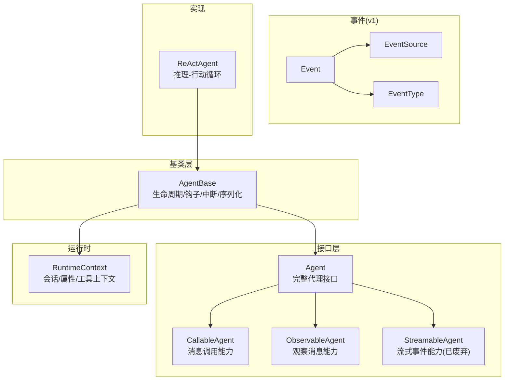
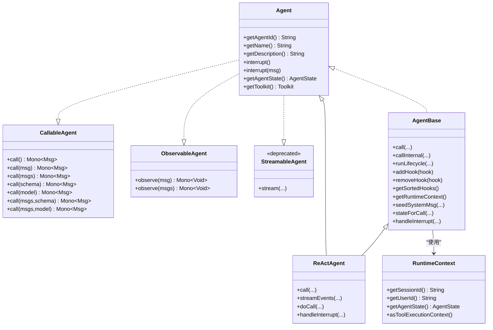
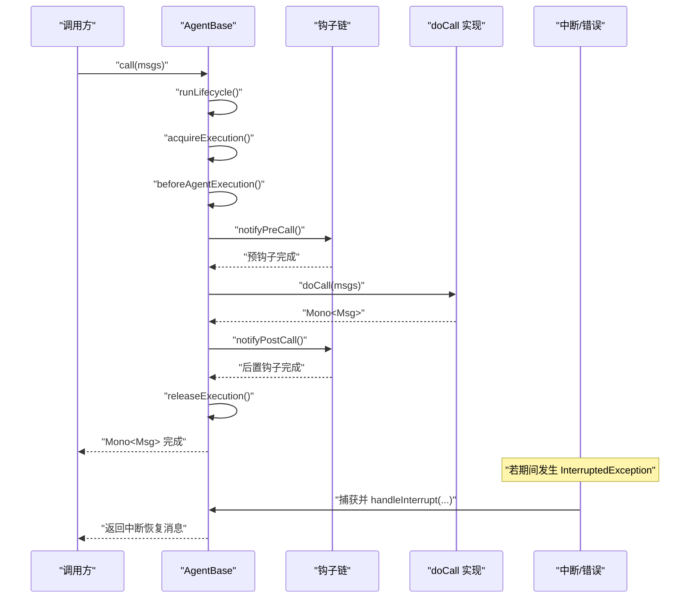
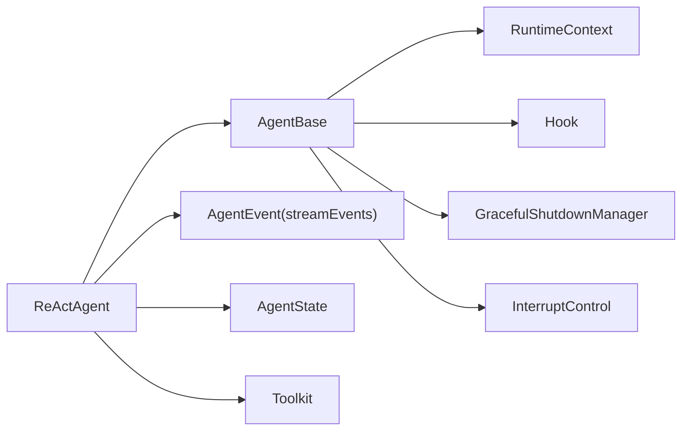

# 代理接口设计

<cite>
**本文引用的文件**
- [Agent.java](file://agentscope-core/src/main/java/io/agentscope/core/agent/Agent.java)
- [CallableAgent.java](file://agentscope-core/src/main/java/io/agentscope/core/agent/CallableAgent.java)
- [ObservableAgent.java](file://agentscope-core/src/main/java/io/agentscope/core/agent/ObservableAgent.java)
- [StreamableAgent.java](file://agentscope-core/src/main/java/io/agentscope/core/agent/StreamableAgent.java)
- [AgentBase.java](file://agentscope-core/src/main/java/io/agentscope/core/agent/AgentBase.java)
- [RuntimeContext.java](file://agentscope-core/src/main/java/io/agentscope/core/agent/RuntimeContext.java)
- [Event.java](file://agentscope-core/src/main/java/io/agentscope/core/agent/Event.java)
- [EventSource.java](file://agentscope-core/src/main/java/io/agentscope/core/agent/EventSource.java)
- [EventType.java](file://agentscope-core/src/main/java/io/agentscope/core/agent/EventType.java)
- [ReActAgent.java](file://agentscope-core/src/main/java/io/agentscope/core/ReActAgent.java)
</cite>

## 目录
1. [引言](#引言)
2. [项目结构](#项目结构)
3. [核心组件](#核心组件)
4. [架构总览](#架构总览)
5. [详细组件分析](#详细组件分析)
6. [依赖分析](#依赖分析)
7. [性能考虑](#性能考虑)
8. [故障排查指南](#故障排查指南)
9. [结论](#结论)
10. [附录：自定义代理实现指南](#附录自定义代理实现指南)

## 引言
本文件面向“代理接口设计”的技术文档，系统阐述 Agent 接口体系的设计理念、核心方法定义（尤其是 call() 的签名与返回值规范）、AgentBase 基类的通用能力（序列化、生命周期管理、错误处理、钩子与运行时上下文），以及 CallableAgent、ObservableAgent 的职责边界与典型使用场景。同时给出基于 ReActAgent 的实现示例路径，帮助读者快速理解如何在该框架下扩展与定制代理。

## 项目结构
围绕代理接口设计的核心代码位于 agentscope-core 模块的 agent 包中，主要由以下层次构成：
- 接口层：定义代理能力边界的最小契约（CallableAgent、ObservableAgent、StreamableAgent、Agent）
- 基类层：AgentBase 提供统一的生命周期、钩子、中断、序列化、运行时上下文等基础设施
- 运行时上下文：RuntimeContext 提供会话级元数据与工具执行上下文桥接
- 事件模型：Event/EventSource/EventType 用于 v1 流式输出（已标记为过时，新版本请使用 ReActAgent 的细粒度 AgentEvent）
- 典型实现：ReActAgent 展示了如何在 AgentBase 基础上完成完整的推理-行动循环与事件流

图表来源
- [Agent.java:47-114](file://agentscope-core/src/main/java/io/agentscope/core/agent/Agent.java#L47-L114)
- [CallableAgent.java:35-139](file://agentscope-core/src/main/java/io/agentscope/core/agent/CallableAgent.java#L35-L139)
- [ObservableAgent.java:36-53](file://agentscope-core/src/main/java/io/agentscope/core/agent/ObservableAgent.java#L36-L53)
- [StreamableAgent.java:44-193](file://agentscope-core/src/main/java/io/agentscope/core/agent/StreamableAgent.java#L44-L193)
- [AgentBase.java:92-1036](file://agentscope-core/src/main/java/io/agentscope/core/agent/AgentBase.java#L92-L1036)
- [RuntimeContext.java:33-386](file://agentscope-core/src/main/java/io/agentscope/core/agent/RuntimeContext.java#L33-L386)
- [Event.java:60-220](file://agentscope-core/src/main/java/io/agentscope/core/agent/Event.java#L60-L220)
- [EventSource.java:113-274](file://agentscope-core/src/main/java/io/agentscope/core/agent/EventSource.java#L113-L274)
- [EventType.java:28-100](file://agentscope-core/src/main/java/io/agentscope/core/agent/EventType.java#L28-L100)
- [ReActAgent.java:148-200](file://agentscope-core/src/main/java/io/agentscope/core/ReActAgent.java#L148-L200)

章节来源
- [Agent.java:21-46](file://agentscope-core/src/main/java/io/agentscope/core/agent/Agent.java#L21-L46)
- [AgentBase.java:47-90](file://agentscope-core/src/main/java/io/agentscope/core/agent/AgentBase.java#L47-L90)

## 核心组件
- Agent 接口：聚合了可调用、可观测、流式事件三大能力，并补充标识符、描述、中断、状态与工具包访问等通用能力。其设计哲学强调“内存管理不属于核心接口”，结构化输出是特定代理的能力，观察模式支持多智能体协作。
- CallableAgent 接口：定义 call(...) 多重重载，覆盖单消息、列表消息、带结构化输出（类或 JSON Schema）的调用方式；所有默认实现均委托到核心 call(List<Msg>)。
- ObservableAgent 接口：定义 observe(...) 方法族，允许代理在不生成回复的前提下接收消息，常用于多智能体协作与共享上下文。
- StreamableAgent 接口：提供流式事件输出能力，但已在 2.0 起标记为废弃，推荐使用 ReActAgent 的细粒度 AgentEvent 流。
- AgentBase 抽象类：提供统一的生命周期 runLifecycle、钩子链路、运行时上下文绑定、调用序列化门禁、优雅关停跟踪、中断处理与错误分发等基础设施。
- RuntimeContext：会话级运行时上下文，承载 sessionId/userId、可变属性、工具执行上下文视图等，确保并发安全与中间件/工具正确解析状态。
- Event/EventSource/EventType：v1 事件模型（已废弃），用于标注事件类型、消息归属与最终结果标记。

章节来源
- [Agent.java:47-114](file://agentscope-core/src/main/java/io/agentscope/core/agent/Agent.java#L47-L114)
- [CallableAgent.java:35-139](file://agentscope-core/src/main/java/io/agentscope/core/agent/CallableAgent.java#L35-L139)
- [ObservableAgent.java:36-53](file://agentscope-core/src/main/java/io/agentscope/core/agent/ObservableAgent.java#L36-L53)
- [StreamableAgent.java:44-193](file://agentscope-core/src/main/java/io/agentscope/core/agent/StreamableAgent.java#L44-L193)
- [AgentBase.java:92-1036](file://agentscope-core/src/main/java/io/agentscope/core/agent/AgentBase.java#L92-L1036)
- [RuntimeContext.java:33-386](file://agentscope-core/src/main/java/io/agentscope/core/agent/RuntimeContext.java#L33-L386)
- [Event.java:60-220](file://agentscope-core/src/main/java/io/agentscope/core/agent/Event.java#L60-L220)
- [EventSource.java:113-274](file://agentscope-core/src/main/java/io/agentscope/core/agent/EventSource.java#L113-L274)
- [EventType.java:28-100](file://agentscope-core/src/main/java/io/agentscope/core/agent/EventType.java#L28-L100)

## 架构总览
AgentBase 将“调用生命周期”“钩子通知”“运行时上下文”“调用序列化”“中断与错误处理”“优雅关停”等横切关注点集中实现，具体代理只需聚焦领域逻辑（例如 ReActAgent 的推理-行动循环）。ReActAgent 在此基础上实现了完整的事件流与状态管理。

图表来源
- [Agent.java:47-114](file://agentscope-core/src/main/java/io/agentscope/core/agent/Agent.java#L47-L114)
- [CallableAgent.java:35-139](file://agentscope-core/src/main/java/io/agentscope/core/agent/CallableAgent.java#L35-L139)
- [ObservableAgent.java:36-53](file://agentscope-core/src/main/java/io/agentscope/core/agent/ObservableAgent.java#L36-L53)
- [StreamableAgent.java:44-193](file://agentscope-core/src/main/java/io/agentscope/core/agent/StreamableAgent.java#L44-L193)
- [AgentBase.java:92-1036](file://agentscope-core/src/main/java/io/agentscope/core/agent/AgentBase.java#L92-L1036)
- [ReActAgent.java:148-200](file://agentscope-core/src/main/java/io/agentscope/core/ReActAgent.java#L148-L200)
- [RuntimeContext.java:33-386](file://agentscope-core/src/main/java/io/agentscope/core/agent/RuntimeContext.java#L33-L386)

## 详细组件分析

### Agent 接口与设计理念
- 设计目标：以最小接口表达代理的核心能力，通过组合实现复杂行为；明确“内存管理”“结构化输出”“观察模式”等职责边界。
- 关键约定：
  - 单次 call(...) 返回一个“终端 Msg”，流式变体（见 StreamableAgent）可能发出多个事件，但最终收敛为单一终端 Msg。
  - 中断语义：提供用户级中断与携带用户消息的中断，采用协作式中断策略。
  - 状态与工具：提供运行时 AgentState 与 Toolkit 访问器，便于工具注入与动态注册。

章节来源
- [Agent.java:21-46](file://agentscope-core/src/main/java/io/agentscope/core/agent/Agent.java#L21-L46)
- [Agent.java:47-114](file://agentscope-core/src/main/java/io/agentscope/core/agent/Agent.java#L47-L114)

### CallableAgent：call() 方法签名与返回值规范
- 方法族覆盖：
  - 无参、单参（Msg/List<Msg>）、可选结构化输出（Class/JsonNode）四种变体。
  - 所有便捷方法均委托至核心 call(List<Msg>) 或带结构化参数的重载。
- 返回值规范：
  - 统一返回 Mono<Msg>，保证单次调用产生一个终端消息；结构化输出通过消息元数据承载结构化数据。
- 使用建议：
  - 优先使用 List<Msg> 版本以获得一致的生命周期与钩子行为。
  - 结构化输出仅在需要强约束输出格式时启用。

章节来源
- [CallableAgent.java:35-139](file://agentscope-core/src/main/java/io/agentscope/core/agent/CallableAgent.java#L35-L139)

### ObservableAgent：观察模式与协作场景
- 观察语义：接收消息但不生成回复，适合多智能体协作、共享上下文与被动监控。
- 实现要点：
  - 无状态代理可为空实现；有状态代理应将观察到的消息存入内存或上下文，供后续 call(...) 使用。
  - 建议在 handleInterrupt 与 doCall 之间保持一致性，避免竞态。

章节来源
- [ObservableAgent.java:22-53](file://agentscope-core/src/main/java/io/agentscope/core/agent/ObservableAgent.java#L22-L53)

### StreamableAgent：流式事件（已废弃）
- 能力概述：提供多种 stream(...) 变体，支持结构化输出与选项配置；但自 2.0 起标记为废弃。
- 迁移建议：使用 ReActAgent 的 streamEvents(...) 获取细粒度 AgentEvent 流（包含 28 种事件类型与 HITL 支持）。

章节来源
- [StreamableAgent.java:44-193](file://agentscope-core/src/main/java/io/agentscope/core/agent/StreamableAgent.java#L44-L193)

### AgentBase：生命周期、钩子、序列化与中断
- 生命周期 runLifecycle：
  - 统一入口 call(...) 通过 runLifecycle 包裹：acquireExecution → beforeAgentExecution → 预钩子 → doCall → 后置钩子 → 错误处理 → releaseExecution。
  - 支持 per-call RuntimeContext 注入与追踪，确保并发安全。
- 钩子系统：
  - 支持动态增删钩子，按优先级排序；提供 RuntimeContextAware 钩子自动绑定/解绑。
  - 预钩子阶段可注入系统消息，后置钩子阶段可广播消息给订阅者。
- 调用序列化：
  - 通过 callSerializationKey 与 serializeOnKey 实现“同键串行、异键并行”的调用门禁，典型用于同一会话内的串行化。
- 中断与错误处理：
  - 协作式中断：在合适检查点调用 checkInterruptedAsync，异常被捕获后委派 handleInterrupt。
  - 错误分发：InterruptedException 特判并走中断恢复流程，其他错误通过 notifyError 传播。
- 优雅关停：
  - 为每次 call 注册独立的 shutdownRequestId，确保并发调用各自被中断/保存/注销。

图表来源
- [AgentBase.java:252-322](file://agentscope-core/src/main/java/io/agentscope/core/agent/AgentBase.java#L252-L322)
- [AgentBase.java:494-502](file://agentscope-core/src/main/java/io/agentscope/core/agent/AgentBase.java#L494-L502)
- [AgentBase.java:551](file://agentscope-core/src/main/java/io/agentscope/core/agent/AgentBase.java#L551)

章节来源
- [AgentBase.java:252-322](file://agentscope-core/src/main/java/io/agentscope/core/agent/AgentBase.java#L252-L322)
- [AgentBase.java:334-365](file://agentscope-core/src/main/java/io/agentscope/core/agent/AgentBase.java#L334-L365)
- [AgentBase.java:494-502](file://agentscope-core/src/main/java/io/agentscope/core/agent/AgentBase.java#L494-L502)
- [AgentBase.java:551](file://agentscope-core/src/main/java/io/agentscope/core/agent/AgentBase.java#L551)

### RuntimeContext：会话与工具上下文
- 字段与语义：
  - sessionId/userId：标识一次会话与用户。
  - agentState：本次调用的实时 AgentState，优先于实例级状态。
  - typed/string attributes：键控存储，支持类型化与字符串键。
  - toolExecutionContext：工具执行上下文视图，合并运行时属性与嵌套工具上下文。
- 使用建议：
  - 中间件与工具应优先从 RuntimeContext 解析状态，避免直接访问实例级状态导致并发问题。
  - asToolExecutionContext() 用于将运行时上下文投影为工具栈可用的上下文视图。

章节来源
- [RuntimeContext.java:33-386](file://agentscope-core/src/main/java/io/agentscope/core/agent/RuntimeContext.java#L33-L386)

### v1 事件模型（已废弃）：Event/EventSource/EventType
- Event：封装事件类型、消息内容与是否为最后一部分；支持 withSource 附加子代理来源。
- EventSource：记录子代理的逻辑路径、深度与会话标识，便于 UI/适配器区分层级。
- EventType：粗粒度事件类型枚举（推理、工具结果、提示、最终结果、摘要等）。
- 迁移提示：新代码请使用 ReActAgent 的 streamEvents(...) 与细粒度 AgentEvent。

章节来源
- [Event.java:60-220](file://agentscope-core/src/main/java/io/agentscope/core/agent/Event.java#L60-L220)
- [EventSource.java:113-274](file://agentscope-core/src/main/java/io/agentscope/core/agent/EventSource.java#L113-L274)
- [EventType.java:28-100](file://agentscope-core/src/main/java/io/agentscope/core/agent/EventType.java#L28-L100)

### ReActAgent：完整实现示例
- 能力概览：结合推理与行动的迭代循环，支持结构化输出、人类在环（HITL）、长程记忆、权限控制、RAG、技能加载、工具执行等。
- 关键点：
  - 继承 AgentBase 并实现 doCall 与 handleInterrupt，遵循统一生命周期。
  - 提供 streamEvents(...) 输出细粒度 AgentEvent，替代已废弃的 stream(...)。
  - 通过 RuntimeContext 与 AgentState 管理会话状态，确保并发安全。
- 使用参考：可在 ReActAgent 的构造与调用示例中学习如何装配模型、工具包与会话上下文。

章节来源
- [ReActAgent.java:148-200](file://agentscope-core/src/main/java/io/agentscope/core/ReActAgent.java#L148-L200)

## 依赖分析
- 组件耦合：
  - AgentBase 对钩子、运行时上下文、优雅关停、中断控制存在强内聚；对外通过接口暴露能力，降低具体代理实现的耦合度。
  - ReActAgent 作为典型实现，依赖 AgentBase 的生命周期与钩子机制，同时扩展事件流与状态管理。
- 外部依赖：
  - Reactor（Mono/Flux/Sinks）用于非阻塞响应式编程。
  - Jackson（JsonNode）用于结构化输出的 JSON Schema 支持。
  - SLF4J 用于日志记录。

图表来源
- [AgentBase.java:92-1036](file://agentscope-core/src/main/java/io/agentscope/core/agent/AgentBase.java#L92-L1036)
- [ReActAgent.java:148-200](file://agentscope-core/src/main/java/io/agentscope/core/ReActAgent.java#L148-L200)

章节来源
- [AgentBase.java:92-1036](file://agentscope-core/src/main/java/io/agentscope/core/agent/AgentBase.java#L92-L1036)
- [ReActAgent.java:148-200](file://agentscope-core/src/main/java/io/agentscope/core/ReActAgent.java#L148-L200)

## 性能考虑
- 非阻塞执行：基于 Reactor 的 Mono/Flux 链路，避免线程阻塞，提升吞吐。
- 调用序列化：通过 callSerializationKey 与 serializeOnKey 控制并发调用的串行化，防止会话状态竞争。
- 钩子排序：按优先级排序减少不必要的遍历开销；动态增删钩子需注意线程安全与顺序稳定性。
- 优雅关停：为每个 call 注册独立请求 ID，避免全局锁争用，提高关停效率。
- 建议：
  - 避免在钩子中进行重型同步操作；必要时使用异步调度。
  - 对高频调用场景，合理设置最大迭代次数与超时策略。

## 故障排查指南
- 中断未生效：
  - 确认在 doCall 的关键检查点调用了中断检查；检查 handleInterrupt 的实现是否正确返回恢复消息。
- 错误未被钩子感知：
  - 确认错误链路经过 createErrorHandler；非 InterruptedException 将通过 notifyError 分发。
- 并发调用异常：
  - 单个 AgentBase 实例不应并发调用；如需并发，请使用工厂方法为每个请求创建独立实例。
- 会话状态错乱：
  - 确保中间件/工具从 RuntimeContext 解析状态，而非直接访问实例级 AgentState。
- 结构化输出失败：
  - 确认传入的 Class/JsonNode 与模型支持的结构化输出能力匹配；必要时在 doCall 内捕获并转换异常。

章节来源
- [AgentBase.java:494-502](file://agentscope-core/src/main/java/io/agentscope/core/agent/AgentBase.java#L494-L502)
- [AgentBase.java:551](file://agentscope-core/src/main/java/io/agentscope/core/agent/AgentBase.java#L551)
- [RuntimeContext.java:121-127](file://agentscope-core/src/main/java/io/agentscope/core/agent/RuntimeContext.java#L121-L127)

## 结论
Agent 接口体系通过“接口聚合 + 基类基础设施 + 运行时上下文 + 事件模型”的分层设计，既保证了代理能力的可插拔性，又提供了统一的生命周期与可观测性。AgentBase 将横切关注点抽象为可复用的基础设施，ReActAgent 则展示了如何在该框架下构建复杂的推理-行动代理。对于新项目，建议优先采用 ReActAgent 与细粒度 AgentEvent 流，逐步迁移废弃的 v1 事件模型。

## 附录：自定义代理实现指南
- 继承 AgentBase 并实现：
  - doCall(List<Msg>)：核心推理/行动逻辑。
  - handleInterrupt(InterruptContext, Msg...)：中断恢复策略（可生成摘要或确认消息）。
  - 可选：callSerializationKey(RuntimeContext)、seedSystemMsg(...)、stateForCall(...) 等扩展点。
- 使用 RuntimeContext：
  - 在 beforeAgentExecution 中激活会话槽位，返回 per-call scope；在 doCall 中读取会话状态。
  - 通过 getRuntimeContext() 与 asToolExecutionContext() 为中间件/工具提供上下文。
- 钩子集成：
  - 在构造函数中注入系统钩子；运行期通过 addHook/removeHook 动态管理。
  - 遵循钩子优先级与不可注入 SYSTEM 消息的约束（针对 ReActAgent）。
- 结构化输出：
  - 如需结构化输出，重写 doCall(List<Msg>, Class/JsonNode)，并在消息元数据中承载结构化数据。
- 示例参考：
  - ReActAgent 的构造与调用示例展示了模型、工具包、会话上下文的装配方式。

章节来源
- [AgentBase.java:210-216](file://agentscope-core/src/main/java/io/agentscope/core/agent/AgentBase.java#L210-L216)
- [AgentBase.java:334-336](file://agentscope-core/src/main/java/io/agentscope/core/agent/AgentBase.java#L334-L336)
- [AgentBase.java:681-720](file://agentscope-core/src/main/java/io/agentscope/core/agent/AgentBase.java#L681-L720)
- [ReActAgent.java:148-200](file://agentscope-core/src/main/java/io/agentscope/core/ReActAgent.java#L148-L200)