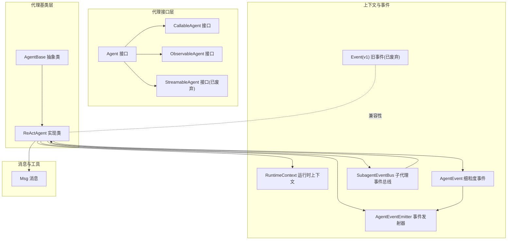
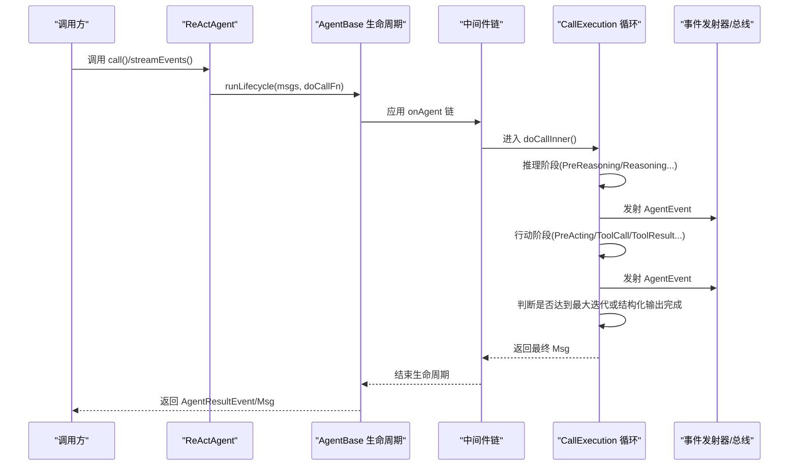
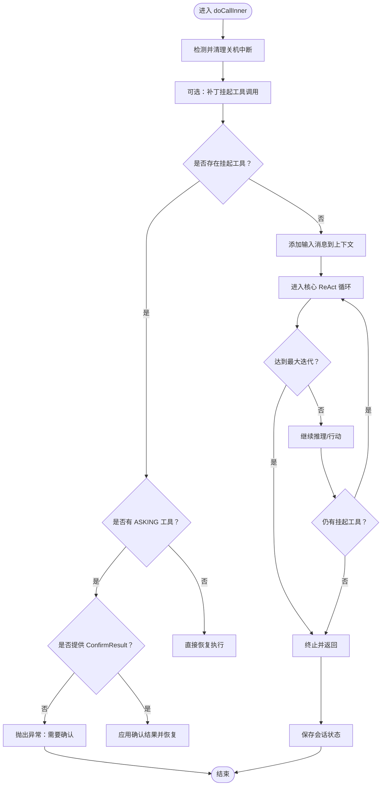
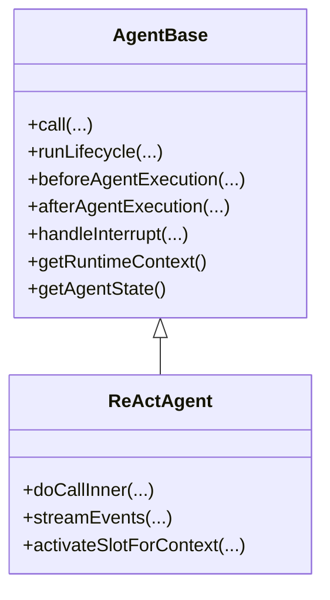
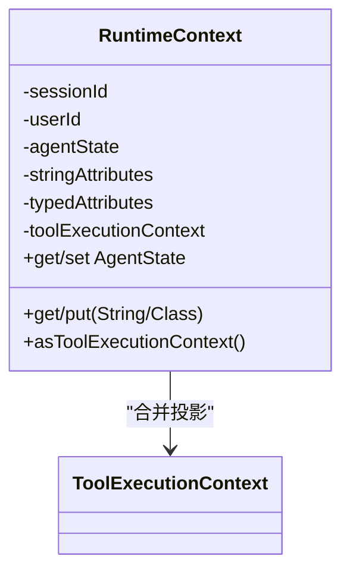
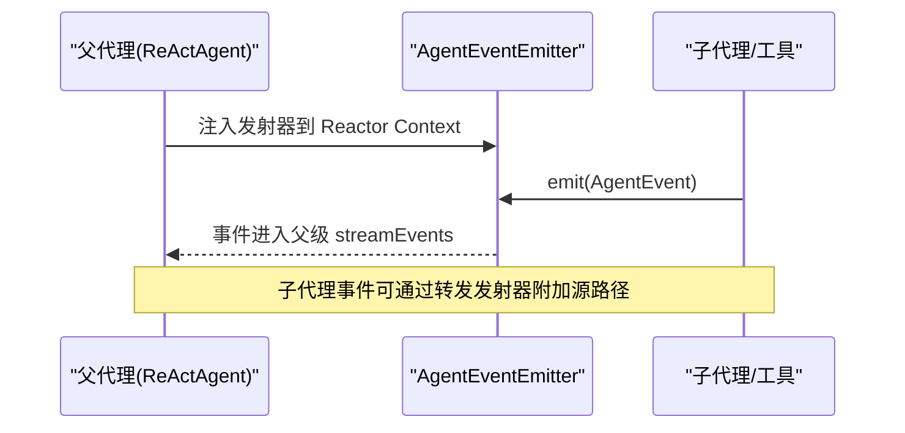
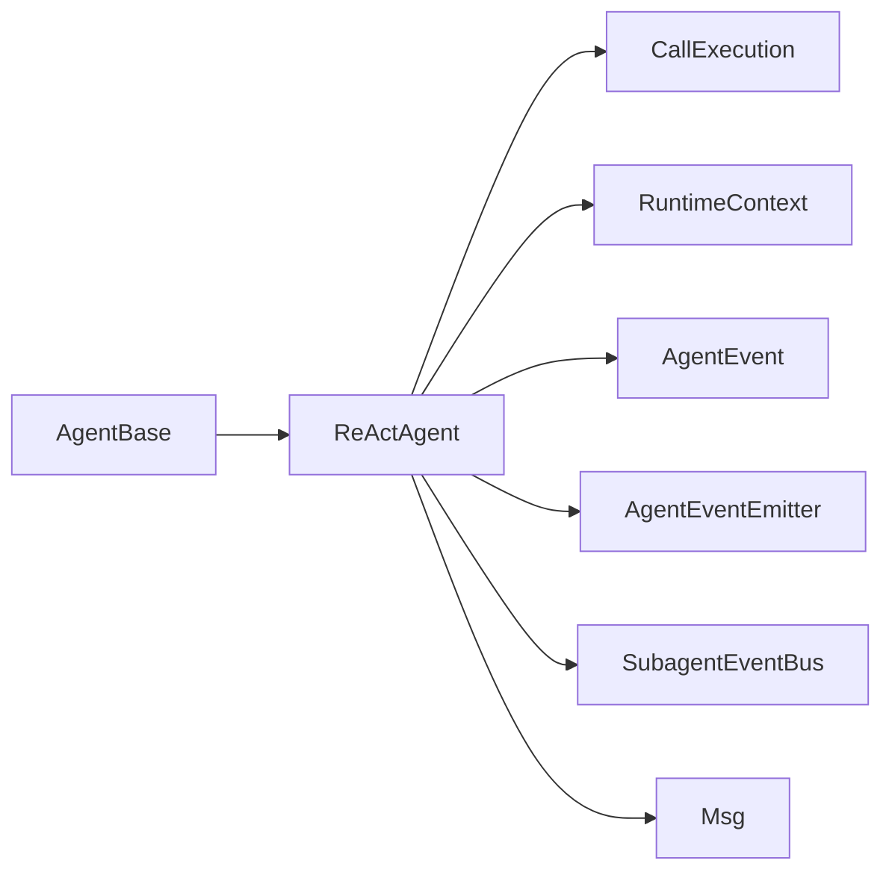

# 代理系统

<cite>
**本文引用的文件**
- [ReActAgent.java](file://agentscope-core/src/main/java/io/agentscope/core/ReActAgent.java)
- [Agent.java](file://agentscope-core/src/main/java/io/agentscope/core/agent/Agent.java)
- [AgentBase.java](file://agentscope-core/src/main/java/io/agentscope/core/agent/AgentBase.java)
- [ObservableAgent.java](file://agentscope-core/src/main/java/io/agentscope/core/agent/ObservableAgent.java)
- [RuntimeContext.java](file://agentscope-core/src/main/java/io/agentscope/core/agent/RuntimeContext.java)
- [Event.java](file://agentscope-core/src/main/java/io/agentscope/core/agent/Event.java)
- [AgentEvent.java](file://agentscope-core/src/main/java/io/agentscope/core/event/AgentEvent.java)
- [AgentEventEmitter.java](file://agentscope-core/src/main/java/io/agentscope/core/event/AgentEventEmitter.java)
- [SubagentEventBus.java](file://agentscope-core/src/main/java/io/agentscope/core/agent/SubagentEventBus.java)
- [CallableAgent.java](file://agentscope-core/src/main/java/io/agentscope/core/agent/CallableAgent.java)
- [StreamableAgent.java](file://agentscope-core/src/main/java/io/agentscope/core/agent/StreamableAgent.java)
- [Hook.java](file://agentscope-core/src/main/java/io/agentscope/core/hook/Hook.java)
- [Msg.java](file://agentscope-core/src/main/java/io/agentscope/core/message/Msg.java)
</cite>

## 目录
1. [简介](#简介)
2. [项目结构](#项目结构)
3. [核心组件](#核心组件)
4. [架构总览](#架构总览)
5. [详细组件分析](#详细组件分析)
6. [依赖分析](#依赖分析)
7. [性能考虑](#性能考虑)
8. [故障排查指南](#故障排查指南)
9. [结论](#结论)
10. [附录：使用示例与最佳实践](#附录使用示例与最佳实践)

## 简介
本技术文档围绕 AgentScope Java 的代理系统，聚焦 ReActAgent 的核心实现原理与运行机制，系统阐述以下主题：
- 推理-行动（ReAct）循环机制与迭代终止策略
- 代理生命周期管理（调用序列化、钩子链、中断控制）
- 事件驱动架构（细粒度 AgentEvent 流与子代理事件总线）
- Agent 接口设计理念、AgentBase 基类能力、ObservableAgent 观察者模式
- RuntimeContext 的作用与上下文传递机制
- 事件系统（AgentEvent 及其子类型）、事件发射器与转发机制
- 扩展点与自定义开发方法、性能优化建议与最佳实践

## 项目结构
AgentScope Java 的核心位于 agentscope-core 模块，代理系统的关键类集中在 io.agentscope.core 包下，按职责划分为：
- agent：代理接口与基础设施（Agent、AgentBase、ObservableAgent、CallableAgent、StreamableAgent、RuntimeContext、Event、SubagentEventBus）
- event：细粒度事件模型（AgentEvent 及其子类型）
- hook：旧版钩子系统（兼容性保留）
- message：消息与内容块（Msg 及其角色与内容类型）



图示来源
- [Agent.java:47-114](file://agentscope-core/src/main/java/io/agentscope/core/agent/Agent.java#L47-L114)
- [AgentBase.java:92-1036](file://agentscope-core/src/main/java/io/agentscope/core/agent/AgentBase.java#L92-L1036)
- [ReActAgent.java:200-4305](file://agentscope-core/src/main/java/io/agentscope/core/ReActAgent.java#L200-L4305)
- [RuntimeContext.java:33-386](file://agentscope-core/src/main/java/io/agentscope/core/agent/RuntimeContext.java#L33-L386)
- [AgentEvent.java:72-139](file://agentscope-core/src/main/java/io/agentscope/core/event/AgentEvent.java#L72-L139)
- [AgentEventEmitter.java:39-98](file://agentscope-core/src/main/java/io/agentscope/core/event/AgentEventEmitter.java#L39-L98)
- [SubagentEventBus.java:37-70](file://agentscope-core/src/main/java/io/agentscope/core/agent/SubagentEventBus.java#L37-L70)
- [Event.java:60-220](file://agentscope-core/src/main/java/io/agentscope/core/agent/Event.java#L60-L220)
- [Msg.java:67-843](file://agentscope-core/src/main/java/io/agentscope/core/message/Msg.java#L67-L843)

章节来源
- [Agent.java:21-114](file://agentscope-core/src/main/java/io/agentscope/core/agent/Agent.java#L21-L114)
- [AgentBase.java:47-1036](file://agentscope-core/src/main/java/io/agentscope/core/agent/AgentBase.java#L47-L1036)
- [ReActAgent.java:148-4305](file://agentscope-core/src/main/java/io/agentscope/core/ReActAgent.java#L148-L4305)
- [RuntimeContext.java:26-386](file://agentscope-core/src/main/java/io/agentscope/core/agent/RuntimeContext.java#L26-L386)
- [AgentEvent.java:27-139](file://agentscope-core/src/main/java/io/agentscope/core/event/AgentEvent.java#L27-L139)
- [AgentEventEmitter.java:21-98](file://agentscope-core/src/main/java/io/agentscope/core/event/AgentEventEmitter.java#L21-L98)
- [SubagentEventBus.java:21-70](file://agentscope-core/src/main/java/io/agentscope/core/agent/SubagentEventBus.java#L21-L70)
- [Event.java:24-220](file://agentscope-core/src/main/java/io/agentscope/core/agent/Event.java#L24-L220)
- [Msg.java:40-843](file://agentscope-core/src/main/java/io/agentscope/core/message/Msg.java#L40-L843)

## 核心组件
- Agent 接口：统一聚合可调用、可流式、可观察能力，强调“回复契约”（单次调用产生单一终端消息），并提供中断与状态访问约定。
- AgentBase 抽象类：提供钩子集成、订阅管理、中断处理、追踪与状态管理等通用能力；不包含记忆管理，交由具体代理实现（如 ReActAgent）。
- ReActAgent：ReAct（推理+行动）代理实现，基于 Project Reactor 提供非阻塞执行，支持结构化输出、权限 HITL、长程记忆与中间件链。
- RuntimeContext：每调用一次的元数据载体，包含会话标识、用户标识、工具执行上下文、Typed/String 属性存储与工具上下文投影。
- 事件系统：v2 使用细粒度 AgentEvent（28 种类型）替代 v1 的粗粒度 Event；支持事件发射器与子代理事件总线，便于父子代理协作。

章节来源
- [Agent.java:21-114](file://agentscope-core/src/main/java/io/agentscope/core/agent/Agent.java#L21-L114)
- [AgentBase.java:47-1036](file://agentscope-core/src/main/java/io/agentscope/core/agent/AgentBase.java#L47-L1036)
- [ReActAgent.java:148-4305](file://agentscope-core/src/main/java/io/agentscope/core/ReActAgent.java#L148-L4305)
- [RuntimeContext.java:26-386](file://agentscope-core/src/main/java/io/agentscope/core/agent/RuntimeContext.java#L26-L386)
- [AgentEvent.java:27-139](file://agentscope-core/src/main/java/io/agentscope/core/event/AgentEvent.java#L27-L139)
- [Event.java:24-220](file://agentscope-core/src/main/java/io/agentscope/core/agent/Event.java#L24-L220)

## 架构总览
ReActAgent 的核心架构围绕“推理-行动”循环展开，结合中间件链、事件发射器、权限引擎与状态槽位，形成可扩展、可观测、可中断的执行框架。



图示来源
- [ReActAgent.java:795-850](file://agentscope-core/src/main/java/io/agentscope/core/ReActAgent.java#L795-L850)
- [AgentBase.java:252-322](file://agentscope-core/src/main/java/io/agentscope/core/agent/AgentBase.java#L252-L322)
- [AgentEventEmitter.java:38-98](file://agentscope-core/src/main/java/io/agentscope/core/event/AgentEventEmitter.java#L38-L98)

## 详细组件分析

### ReActAgent：推理-行动循环与生命周期
- 推理-行动循环
  - 推理阶段：构建系统提示、注入思维/思考块、模型调用、流式输出（文本/思维/数据块）。
  - 行动阶段：解析工具调用、执行工具、生成工具结果、写回上下文。
  - 终止条件：达到最大迭代次数、满足停止条件（stopAgent）、结构化输出完成、外部中断。
- 生命周期管理
  - 调用序列化：基于 (userId, sessionId) 槽位串行化同会话并发，不同会话并行。
  - 钩子链：统一的 onAgent 中间件链贯穿 call 与 streamEvents，保证一致性。
  - 中断控制：每个会话拥有独立的 InterruptControl，支持优雅关闭与恢复。
  - 状态持久化：通过 AgentStateStore 将会话状态保存到外部存储，支持分布式部署。
- 结构化输出
  - 原生路径：利用模型原生 response_format，直接获得结构化 JSON 文本。
  - 回退路径：注入 generate_response 合成工具，借助 PostActingEvent.stopAgent() 自然终止。
- 权限 HITL
  - 对于 ASKING 工具调用，需要用户提供 ConfirmResult 才能继续；否则抛出异常提示。
- 事件发射
  - 通过 AgentEventEmitter 将事件注入父级 streamEvents；子代理事件通过 SubagentEventBus 或转发发射器进行源标记后注入。



图示来源
- [ReActAgent.java:1408-1599](file://agentscope-core/src/main/java/io/agentscope/core/ReActAgent.java#L1408-L1599)

章节来源
- [ReActAgent.java:795-850](file://agentscope-core/src/main/java/io/agentscope/core/ReActAgent.java#L795-L850)
- [ReActAgent.java:1408-1599](file://agentscope-core/src/main/java/io/agentscope/core/ReActAgent.java#L1408-L1599)

### AgentBase：生命周期、钩子与中断
- 生命周期
  - runLifecycle：注册请求、序列化门禁、前置通知、doCall、后置通知、错误处理、释放资源。
  - beforeAgentExecution/afterAgentExecution：在调用前后绑定/解绑 per-call scope 与 RuntimeContext。
- 钩子系统
  - Hook（已废弃）：统一 onEvent 处理，按优先级排序；推荐使用 MiddlewareBase。
  - Hook 与 RuntimeContextAware：动态绑定/解绑 RuntimeContext 到钩子。
- 中断机制
  - 通过 InterruptControl 在会话维度检查中断标志，抛出 InterruptedException 并由 handleInterrupt 恢复。



图示来源
- [AgentBase.java:252-621](file://agentscope-core/src/main/java/io/agentscope/core/agent/AgentBase.java#L252-L621)
- [ReActAgent.java:924-949](file://agentscope-core/src/main/java/io/agentscope/core/ReActAgent.java#L924-L949)

章节来源
- [AgentBase.java:252-621](file://agentscope-core/src/main/java/io/agentscope/core/agent/AgentBase.java#L252-L621)

### Agent 接口与基类设计
- Agent 接口：统一三能力（可调用、可流式、可观测），强调“单次调用产生单一终端消息”的回复契约。
- AgentBase：抽象出钩子、订阅、中断、追踪、状态等基础设施，具体代理实现负责领域逻辑（如 ReActAgent 的记忆与循环）。
- ObservableAgent：允许代理接收消息而不生成回复，用于多智能体协作与共享上下文。

```mermaid
classDiagram
class Agent {
+getAgentId()
+getName()
+getDescription()
+interrupt()
+getAgentState()
+getToolkit()
}
class CallableAgent {
+call(...)
}
class ObservableAgent {
+observe(...)
}
class StreamableAgent(已废弃)
class AgentBase
class ReActAgent
Agent <|.. CallableAgent
Agent <|.. ObservableAgent
Agent <|.. StreamableAgent
AgentBase <|-- ReActAgent
```

图示来源
- [Agent.java:47-114](file://agentscope-core/src/main/java/io/agentscope/core/agent/Agent.java#L47-L114)
- [CallableAgent.java:35-140](file://agentscope-core/src/main/java/io/agentscope/core/agent/CallableAgent.java#L35-L140)
- [ObservableAgent.java:22-54](file://agentscope-core/src/main/java/io/agentscope/core/agent/ObservableAgent.java#L22-L54)
- [StreamableAgent.java:23-194](file://agentscope-core/src/main/java/io/agentscope/core/agent/StreamableAgent.java#L23-L194)
- [AgentBase.java:92-1036](file://agentscope-core/src/main/java/io/agentscope/core/agent/AgentBase.java#L92-L1036)
- [ReActAgent.java:200-4305](file://agentscope-core/src/main/java/io/agentscope/core/ReActAgent.java#L200-L4305)

章节来源
- [Agent.java:21-114](file://agentscope-core/src/main/java/io/agentscope/core/agent/Agent.java#L21-L114)
- [ObservableAgent.java:22-54](file://agentscope-core/src/main/java/io/agentscope/core/agent/ObservableAgent.java#L22-L54)
- [CallableAgent.java:23-140](file://agentscope-core/src/main/java/io/agentscope/core/agent/CallableAgent.java#L23-L140)
- [StreamableAgent.java:23-194](file://agentscope-core/src/main/java/io/agentscope/core/agent/StreamableAgent.java#L23-L194)

### RuntimeContext：上下文传递与工具上下文投影
- 作用
  - 每次调用携带的元数据：sessionId、userId、call-scoped AgentState、Typed/String 属性、工具执行上下文。
  - 作为 Reactor Context 键值传递，避免共享实例字段引发竞态。
- 特性
  - Typed 层：以 Class->key->value 的映射提供强类型访问。
  - asToolExecutionContext：将 RuntimeContext 与嵌套 ToolExecutionContext 合并，优先级明确。
  - resolveAgentState：优先使用 call-scoped AgentState，确保并发安全。



图示来源
- [RuntimeContext.java:33-386](file://agentscope-core/src/main/java/io/agentscope/core/agent/RuntimeContext.java#L33-L386)

章节来源
- [RuntimeContext.java:26-386](file://agentscope-core/src/main/java/io/agentscope/core/agent/RuntimeContext.java#L26-L386)

### 事件系统：AgentEvent 与发射器/总线
- AgentEvent：细粒度事件模型，覆盖 AgentStart/End、ModelCall、TextBlock/ThinkingBlock/DataBlock、ToolCall/Result、HITL、外部执行等 28 种类型。
- AgentEventEmitter：在工具执行期间向父级 streamEvents 注入自定义事件；支持转发发射器对子代理事件进行源标记。
- SubagentEventBus：v1 通道，允许同步调用的子代理将事件推送到父级 Flux<Event>；v2 中由 AgentEventEmitter 替代。



图示来源
- [AgentEventEmitter.java:38-98](file://agentscope-core/src/main/java/io/agentscope/core/event/AgentEventEmitter.java#L38-L98)
- [SubagentEventBus.java:21-70](file://agentscope-core/src/main/java/io/agentscope/core/agent/SubagentEventBus.java#L21-L70)
- [AgentEvent.java:27-139](file://agentscope-core/src/main/java/io/agentscope/core/event/AgentEvent.java#L27-L139)

章节来源
- [AgentEvent.java:27-139](file://agentscope-core/src/main/java/io/agentscope/core/event/AgentEvent.java#L27-L139)
- [AgentEventEmitter.java:21-98](file://agentscope-core/src/main/java/io/agentscope/core/event/AgentEventEmitter.java#L21-L98)
- [SubagentEventBus.java:21-70](file://agentscope-core/src/main/java/io/agentscope/core/agent/SubagentEventBus.java#L21-L70)

### 消息模型：Msg 与内容块
- Msg：统一的消息载体，包含角色、内容块列表、元数据、时间戳、用量统计等。
- 内容块：TextBlock、ThinkingBlock、DataBlock、ToolUseBlock、ToolResultBlock 等，支持类型安全访问与转换。
- 结构化数据：支持从元数据提取结构化输出，并提供强类型与 Map 两种读取方式。

章节来源
- [Msg.java:40-843](file://agentscope-core/src/main/java/io/agentscope/core/message/Msg.java#L40-L843)

## 依赖分析
- ReActAgent 依赖 AgentBase 提供生命周期与钩子；依赖中间件链（MiddlewareChain）与 Reactor 上下文键（RUNTIME_CONTEXT_KEY、EVENT_SINK_KEY）。
- ReActAgent 通过 CallExecution 持有 per-call 的 AgentState、PermissionEngine、事件发射器与 RuntimeContext，确保并发安全。
- RuntimeContext 与 ToolExecutionContext 合并，为工具执行提供统一上下文视图。
- 事件系统通过 AgentEventEmitter 与 SubagentEventBus 解耦父子代理事件流。



图示来源
- [AgentBase.java:252-322](file://agentscope-core/src/main/java/io/agentscope/core/agent/AgentBase.java#L252-L322)
- [ReActAgent.java:924-949](file://agentscope-core/src/main/java/io/agentscope/core/ReActAgent.java#L924-L949)
- [RuntimeContext.java:26-386](file://agentscope-core/src/main/java/io/agentscope/core/agent/RuntimeContext.java#L26-L386)
- [AgentEventEmitter.java:38-98](file://agentscope-core/src/main/java/io/agentscope/core/event/AgentEventEmitter.java#L38-L98)
- [SubagentEventBus.java:21-70](file://agentscope-core/src/main/java/io/agentscope/core/agent/SubagentEventBus.java#L21-L70)
- [Msg.java:40-843](file://agentscope-core/src/main/java/io/agentscope/core/message/Msg.java#L40-L843)

章节来源
- [AgentBase.java:252-322](file://agentscope-core/src/main/java/io/agentscope/core/agent/AgentBase.java#L252-L322)
- [ReActAgent.java:924-949](file://agentscope-core/src/main/java/io/agentscope/core/ReActAgent.java#L924-L949)

## 性能考虑
- 非阻塞执行：ReActAgent 基于 Project Reactor，避免阻塞线程，提升吞吐。
- 调用序列化：同一 (userId, sessionId) 槽位串行化，避免并发写入导致的状态不一致，同时允许多会话并行。
- 状态持久化：通过 AgentStateStore 异步保存，使用 boundedElastic Scheduler，降低对主线程影响。
- 中间件链：合理组织中间件优先级，减少不必要的链路开销；仅在必要时构建响应式链。
- 结构化输出：优先使用模型原生 response_format，减少合成工具带来的额外往返。

## 故障排查指南
- 中断未生效
  - 确认使用 per-session 的 interrupt(userId, sessionId)，并在合适检查点调用中断检查。
  - 检查 handleInterrupt 的实现是否正确返回恢复消息。
- 权限 HITL 无法继续
  - 确保提供 ConfirmResult 列表并包含 ASKING 工具调用的 ID；否则抛出异常提示。
- 事件未到达父级
  - 若使用工具内发射，请确认处于 streamEvents 生命周期中；否则 AgentEventEmitter 不可用。
  - 子代理事件需通过转发发射器附加源路径，避免被过滤。
- 结构化输出异常
  - 检查模型是否支持原生结构化输出；若不支持，确认 generate_response 合成工具已注入且 PostActingEvent 正确触发 stopAgent。

章节来源
- [AgentBase.java:494-502](file://agentscope-core/src/main/java/io/agentscope/core/agent/AgentBase.java#L494-L502)
- [ReActAgent.java:1437-1495](file://agentscope-core/src/main/java/io/agentscope/core/ReActAgent.java#L1437-L1495)
- [AgentEventEmitter.java:77-96](file://agentscope-core/src/main/java/io/agentscope/core/event/AgentEventEmitter.java#L77-L96)

## 结论
ReActAgent 通过清晰的生命周期、事件驱动与中间件体系，实现了可扩展、可观测、可中断的推理-行动代理。RuntimeContext 提供了线程安全的上下文传递，CallExecution 将会话状态与事件发射器隔离，确保并发安全与可维护性。配合细粒度事件模型与工具上下文投影，开发者可以快速构建复杂多智能体协作场景下的高性能代理系统。

## 附录：使用示例与最佳实践
- 创建与配置代理
  - 使用 ReActAgent.Builder 设置名称、系统提示、模型、工具箱、最大迭代次数、执行配置等。
  - 通过 RuntimeContext 传入 sessionId/userId、工具上下文与属性，确保事件与状态的会话隔离。
- 初始化与参数设置
  - 初始化时注册必要的中间件（如任务提醒、权限校验）与工具；根据模型能力选择原生结构化输出或回退路径。
- 事件监听
  - 使用 streamEvents 获取细粒度 AgentEvent 流；在工具中通过 AgentEventEmitter 注入自定义事件；子代理事件通过转发发射器标记源路径。
- 扩展点与自定义
  - 通过 MiddlewareBase 定义 onAgent/onReasoning/onActing/onModelCall/onSystemPrompt 等钩点，替代旧版 Hook。
  - 自定义工具时，使用 ToolExecutionContext 读取 RuntimeContext 中的 Typed/String 属性，保持松耦合。
- 最佳实践
  - 严格遵循“单次调用产生单一终端消息”的契约；在并发服务中为每个请求创建独立代理实例。
  - 合理设置 maxIters 与 stop 条件，避免无限循环；启用权限 HITL 时提供明确的 ConfirmResult。
  - 使用结构化输出时优先原生路径，减少合成工具的额外成本；必要时压缩上下文以降低 token 消耗。

章节来源
- [ReActAgent.java:148-4305](file://agentscope-core/src/main/java/io/agentscope/core/ReActAgent.java#L148-L4305)
- [AgentBase.java:190-216](file://agentscope-core/src/main/java/io/agentscope/core/agent/AgentBase.java#L190-L216)
- [RuntimeContext.java:266-331](file://agentscope-core/src/main/java/io/agentscope/core/agent/RuntimeContext.java#L266-L331)
- [AgentEventEmitter.java:77-96](file://agentscope-core/src/main/java/io/agentscope/core/event/AgentEventEmitter.java#L77-L96)
- [Hook.java:121-192](file://agentscope-core/src/main/java/io/agentscope/core/hook/Hook.java#L121-L192)