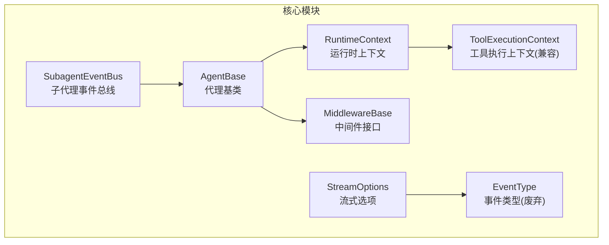
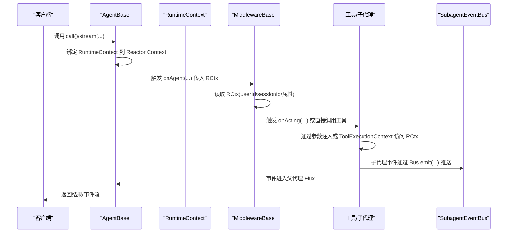
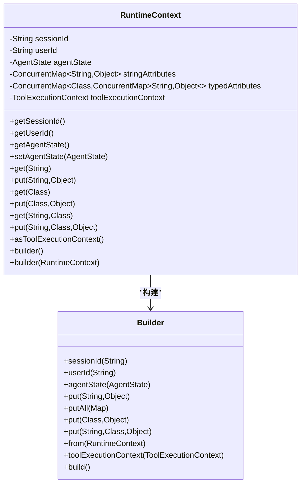
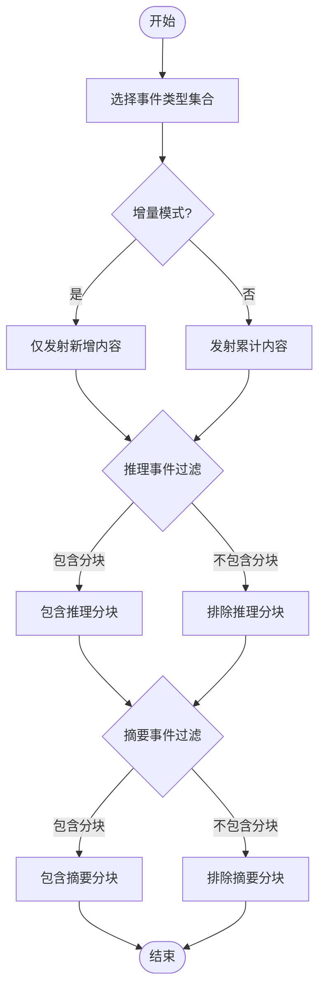
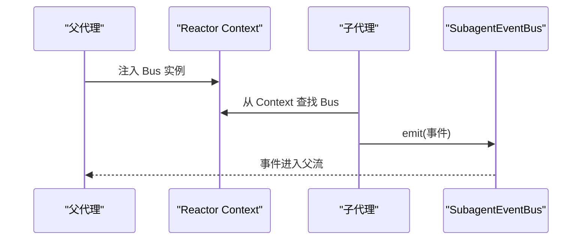
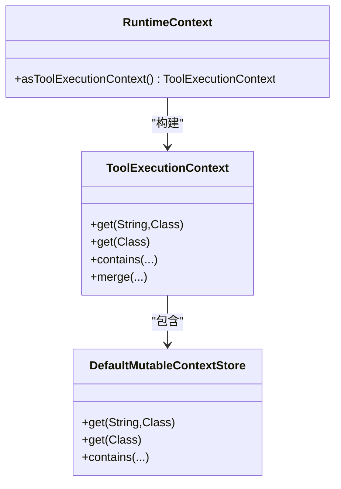
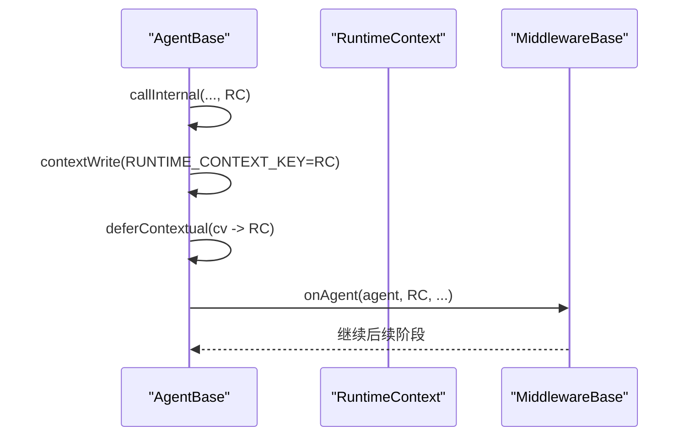
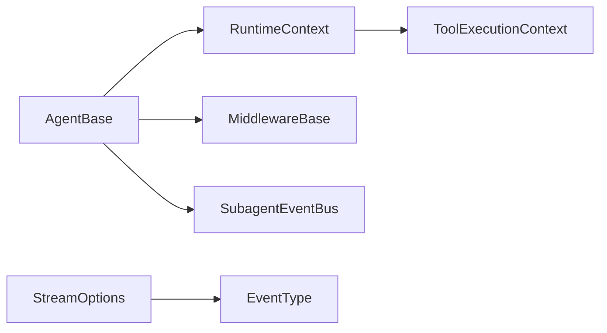

# 运行时上下文系统

<cite>
**本文引用的文件**
- [RuntimeContext.java](file://agentscope-core/src/main/java/io/agentscope/core/agent/RuntimeContext.java)
- [StreamOptions.java](file://agentscope-core/src/main/java/io/agentscope/core/agent/StreamOptions.java)
- [SubagentEventBus.java](file://agentscope-core/src/main/java/io/agentscope/core/agent/SubagentEventBus.java)
- [ToolExecutionContext.java](file://agentscope-core/src/main/java/io/agentscope/core/tool/ToolExecutionContext.java)
- [MiddlewareBase.java](file://agentscope-core/src/main/java/io/agentscope/core/middleware/MiddlewareBase.java)
- [AgentBase.java](file://agentscope-core/src/main/java/io/agentscope/core/agent/AgentBase.java)
- [EventType.java](file://agentscope-core/src/main/java/io/agentscope/core/agent/EventType.java)
- [tool.md](file://docs/v2/en/docs/building-blocks/tool.md)
- [going-to-production.md](file://docs/v2/en/docs/others/going-to-production.md)
- [AguiAgentAdapterTest.java](file://agentscope-extensions/agentscope-extensions-protocol/agentscope-extensions-agui/src/test/java/io/agentscope/core/agui/adapter/AguiAgentAdapterTest.java)
</cite>

## 目录
1. [简介](#简介)
2. [项目结构](#项目结构)
3. [核心组件](#核心组件)
4. [架构总览](#架构总览)
5. [详细组件分析](#详细组件分析)
6. [依赖关系分析](#依赖关系分析)
7. [性能考量](#性能考量)
8. [故障排查指南](#故障排查指南)
9. [结论](#结论)
10. [附录：最佳实践与示例路径](#附录最佳实践与示例路径)

## 简介
本文件系统性阐述 AgentScope 运行时上下文系统的设计与实现，重点覆盖以下主题：
- RuntimeContext 的职责与设计目标：会话标识、用户信息、工具执行上下文、调用期状态解析与作用域管理
- 上下文传递机制与中间件访问：call() 中的上下文绑定、Reactor Context 传播、中间件链路中的可访问性
- StreamOptions 的配置项与流式处理支持：事件类型过滤、增量/累积模式、推理/摘要事件的分块与最终结果控制
- SubagentEventBus 的事件总线机制与子代理通信：在 Reactor Pipeline 中桥接子代理事件到父流
- 实战示例路径：如何在代理中使用 RuntimeContext 创建、设置属性、访问工具与中间件
- 最佳实践与性能建议：并发隔离、键控序列化、内存与线程安全注意事项

## 项目结构
围绕运行时上下文系统的关键源码位于 agentscope-core 模块的 agent、middleware、tool 包中，并通过文档与测试用例提供了使用范式与验证。

图表来源
- [RuntimeContext.java:33-449](file://agentscope-core/src/main/java/io/agentscope/core/agent/RuntimeContext.java#L33-L449)
- [StreamOptions.java:62-371](file://agentscope-core/src/main/java/io/agentscope/core/agent/StreamOptions.java#L62-L371)
- [SubagentEventBus.java:37-70](file://agentscope-core/src/main/java/io/agentscope/core/agent/SubagentEventBus.java#L37-L70)
- [ToolExecutionContext.java:51-311](file://agentscope-core/src/main/java/io/agentscope/core/tool/ToolExecutionContext.java#L51-L311)
- [MiddlewareBase.java:59-144](file://agentscope-core/src/main/java/io/agentscope/core/middleware/MiddlewareBase.java#L59-L144)
- [AgentBase.java:211-298](file://agentscope-core/src/main/java/io/agentscope/core/agent/AgentBase.java#L211-L298)
- [EventType.java:28-100](file://agentscope-core/src/main/java/io/agentscope/core/agent/EventType.java#L28-L100)

章节来源
- [RuntimeContext.java:26-32](file://agentscope-core/src/main/java/io/agentscope/core/agent/RuntimeContext.java#L26-L32)
- [AgentBase.java:16-91](file://agentscope-core/src/main/java/io/agentscope/core/agent/AgentBase.java#L16-L91)

## 核心组件
- RuntimeContext：单次调用的会话级元数据载体，包含 sessionId、userId、调用期 AgentState、字符串与类型化属性层、工具执行上下文桥接器。其设计强调“调用期作用域”与并发安全，避免共享实例导致的状态污染。
- StreamOptions：用于 Agent#stream API 的配置对象，控制事件类型、增量/累积模式，以及推理/摘要事件的分块与最终结果是否纳入流。
- SubagentEventBus：轻量事件总线，允许同步触发的子代理将事件推送到父代理的 Flux 流中；通过 Reactor Context 注入并在工具方法中检索。
- ToolExecutionContext：面向工具注入的上下文门面（已标记为兼容性），推荐使用 RuntimeContext 替代。
- MiddlewareBase：中间件拦截点（onAgent/onReasoning/onActing/onModelCall/onSystemPrompt），统一接收 RuntimeContext 并参与调用期上下文传递。
- AgentBase：负责将 RuntimeContext 绑定到 Reactor Context，确保每个订阅独立持有上下文，避免并发共享状态。

章节来源
- [RuntimeContext.java:33-134](file://agentscope-core/src/main/java/io/agentscope/core/agent/RuntimeContext.java#L33-L134)
- [StreamOptions.java:62-251](file://agentscope-core/src/main/java/io/agentscope/core/agent/StreamOptions.java#L62-L251)
- [SubagentEventBus.java:37-68](file://agentscope-core/src/main/java/io/agentscope/core/agent/SubagentEventBus.java#L37-L68)
- [ToolExecutionContext.java:51-184](file://agentscope-core/src/main/java/io/agentscope/core/tool/ToolExecutionContext.java#L51-L184)
- [MiddlewareBase.java:59-144](file://agentscope-core/src/main/java/io/agentscope/core/middleware/MiddlewareBase.java#L59-L144)
- [AgentBase.java:211-298](file://agentscope-core/src/main/java/io/agentscope/core/agent/AgentBase.java#L211-L298)

## 架构总览
下图展示了从调用入口到中间件、工具与事件流的上下文传递路径，以及子代理事件回传至父流的机制。

图表来源
- [AgentBase.java:211-298](file://agentscope-core/src/main/java/io/agentscope/core/agent/AgentBase.java#L211-L298)
- [MiddlewareBase.java:70-127](file://agentscope-core/src/main/java/io/agentscope/core/middleware/MiddlewareBase.java#L70-L127)
- [RuntimeContext.java:308-319](file://agentscope-core/src/main/java/io/agentscope/core/agent/RuntimeContext.java#L308-L319)
- [SubagentEventBus.java:54-68](file://agentscope-core/src/main/java/io/agentscope/core/agent/SubagentEventBus.java#L54-L68)

## 详细组件分析

### RuntimeContext：会话与调用期上下文
- 设计要点
  - 会话标识：sessionId、userId 提供并发隔离与多租户区分
  - 调用期状态：agentState 仅在 call() 生命周期内有效，避免并发下的状态错配
  - 双层属性存储：字符串键值与类型化映射，支持默认键与可赋值类型的降级查找
  - 工具上下文桥接：asToolExecutionContext() 将 RuntimeContext 作为最高优先级的 ContextStore 注入工具栈
- 关键行为
  - 解析调用期 AgentState：resolveAgentState() 优先使用上下文内的 call-scoped 状态
  - 构建器模式：支持从现有上下文复制、批量放入字符串与类型化属性
- 并发与作用域
  - 通过 Reactor Context 保证每个订阅持有独立上下文，避免共享字段引发竞态

图表来源
- [RuntimeContext.java:33-412](file://agentscope-core/src/main/java/io/agentscope/core/agent/RuntimeContext.java#L33-L412)

章节来源
- [RuntimeContext.java:33-134](file://agentscope-core/src/main/java/io/agentscope/core/agent/RuntimeContext.java#L33-L134)
- [RuntimeContext.java:308-319](file://agentscope-core/src/main/java/io/agentscope/core/agent/RuntimeContext.java#L308-L319)
- [RuntimeContext.java:325-412](file://agentscope-core/src/main/java/io/agentscope/core/agent/RuntimeContext.java#L325-L412)

### StreamOptions：流式配置与事件过滤
- 功能概览
  - 事件类型集合：支持按 EventType 过滤，或使用 ALL 通配
  - 增量/累积模式：控制每次发射的新内容或累计内容
  - 推理/摘要事件细分：分别控制分块与最终结果是否进入流
- 使用场景
  - 仅需推理过程：启用 REASONING，关闭中间分块
  - 仅需最终摘要：启用 SUMMARY，仅保留最终结果
  - 多类型组合：同时监听推理与工具结果

图表来源
- [StreamOptions.java:62-251](file://agentscope-core/src/main/java/io/agentscope/core/agent/StreamOptions.java#L62-L251)

章节来源
- [StreamOptions.java:62-251](file://agentscope-core/src/main/java/io/agentscope/core/agent/StreamOptions.java#L62-L251)
- [EventType.java:28-100](file://agentscope-core/src/main/java/io/agentscope/core/agent/EventType.java#L28-L100)

### SubagentEventBus：子代理事件总线
- 机制说明
  - 在 AgentBase.createEventStream 中创建并存入 Reactor Context（键名固定）
  - 工具方法可通过 SubagentEventBus.fromContext(ctx) 获取总线实例
  - emit(event) 线程安全地将子代理事件转发至父代理的 Flux
  - 非流式 call() 场景返回空值，允许回退到阻塞路径
- 应用场景
  - 子代理同步调用 spawn 等操作后，将事件无缝合并进主流程

图表来源
- [SubagentEventBus.java:37-68](file://agentscope-core/src/main/java/io/agentscope/core/agent/SubagentEventBus.java#L37-L68)
- [AgentBase.java:211-298](file://agentscope-core/src/main/java/io/agentscope/core/agent/AgentBase.java#L211-L298)

章节来源
- [SubagentEventBus.java:37-68](file://agentscope-core/src/main/java/io/agentscope/core/agent/SubagentEventBus.java#L37-L68)

### 工具执行上下文桥接：RuntimeContext → ToolExecutionContext
- 机制说明
  - RuntimeContext.asToolExecutionContext() 将自身注册为最高优先级的 ContextStore
  - 若存在嵌套的 ToolExecutionContext，则将其 Store 顺序置于较低优先级
  - 工具注入时优先解析类型化与字符串键值，再回退到委托 Store
- 迁移建议
  - 新代码优先使用 RuntimeContext.builder().put(...) 注册 POJO，替代已废弃的 ToolExecutionContext

图表来源
- [RuntimeContext.java:308-319](file://agentscope-core/src/main/java/io/agentscope/core/agent/RuntimeContext.java#L308-L319)
- [ToolExecutionContext.java:51-184](file://agentscope-core/src/main/java/io/agentscope/core/tool/ToolExecutionContext.java#L51-L184)

章节来源
- [RuntimeContext.java:308-319](file://agentscope-core/src/main/java/io/agentscope/core/agent/RuntimeContext.java#L308-L319)
- [ToolExecutionContext.java:51-184](file://agentscope-core/src/main/java/io/agentscope/core/tool/ToolExecutionContext.java#L51-L184)

### 中间件访问与上下文绑定：call() 与 Reactor Context
- 绑定机制
  - AgentBase.callInternal() 将 RuntimeContext 通过 contextWrite 绑定到 Reactor Context 键
  - runLifecycle() 在 deferContextual 回调中读取上下文，确保每个订阅持有独立上下文
- 中间件链路
  - MiddlewareBase 的五个拦截点均接收 RuntimeContext，便于在推理、行动、模型调用阶段读取会话与属性
- 并发与序列化
  - callSerializationKey() 支持基于 (userId, sessionId) 的串行化，避免并发同一会话的冲突

图表来源
- [AgentBase.java:211-298](file://agentscope-core/src/main/java/io/agentscope/core/agent/AgentBase.java#L211-L298)
- [MiddlewareBase.java:70-127](file://agentscope-core/src/main/java/io/agentscope/core/middleware/MiddlewareBase.java#L70-L127)

章节来源
- [AgentBase.java:211-298](file://agentscope-core/src/main/java/io/agentscope/core/agent/AgentBase.java#L211-L298)
- [MiddlewareBase.java:59-144](file://agentscope-core/src/main/java/io/agentscope/core/middleware/MiddlewareBase.java#L59-L144)

## 依赖关系分析
- 组件耦合
  - AgentBase 依赖 RuntimeContext 完成上下文绑定与生命周期管理
  - RuntimeContext 与 ToolExecutionContext 存在兼容性桥接，但推荐直接使用 RuntimeContext
  - SubagentEventBus 与 Reactor Context 强关联，用于子代理事件回传
  - MiddlewareBase 通过接口契约消费 RuntimeContext，贯穿调用期
- 外部依赖
  - Reactor Context/Flux/Sinks 用于上下文传播与事件流
  - 并发容器（ConcurrentHashMap）保障线程安全

图表来源
- [AgentBase.java:211-298](file://agentscope-core/src/main/java/io/agentscope/core/agent/AgentBase.java#L211-L298)
- [RuntimeContext.java:308-319](file://agentscope-core/src/main/java/io/agentscope/core/agent/RuntimeContext.java#L308-L319)
- [ToolExecutionContext.java:51-184](file://agentscope-core/src/main/java/io/agentscope/core/tool/ToolExecutionContext.java#L51-L184)
- [SubagentEventBus.java:37-68](file://agentscope-core/src/main/java/io/agentscope/core/agent/SubagentEventBus.java#L37-L68)
- [StreamOptions.java:62-251](file://agentscope-core/src/main/java/io/agentscope/core/agent/StreamOptions.java#L62-L251)
- [EventType.java:28-100](file://agentscope-core/src/main/java/io/agentscope/core/agent/EventType.java#L28-L100)

章节来源
- [AgentBase.java:211-298](file://agentscope-core/src/main/java/io/agentscope/core/agent/AgentBase.java#L211-L298)
- [RuntimeContext.java:308-319](file://agentscope-core/src/main/java/io/agentscope/core/agent/RuntimeContext.java#L308-L319)
- [ToolExecutionContext.java:51-184](file://agentscope-core/src/main/java/io/agentscope/core/tool/ToolExecutionContext.java#L51-L184)
- [SubagentEventBus.java:37-68](file://agentscope-core/src/main/java/io/agentscope/core/agent/SubagentEventBus.java#L37-L68)
- [StreamOptions.java:62-251](file://agentscope-core/src/main/java/io/agentscope/core/agent/StreamOptions.java#L62-L251)
- [EventType.java:28-100](file://agentscope-core/src/main/java/io/agentscope/core/agent/EventType.java#L28-L100)

## 性能考量
- 并发隔离
  - 通过 Reactor Context 为每个订阅绑定独立 RuntimeContext，避免共享状态带来的锁竞争与上下文污染
- 键控序列化
  - 基于 (userId, sessionId) 的 callSerializationKey() 可串行化同一会话的多次调用，降低状态冲突风险
- 线程安全
  - 字符串与类型化属性采用并发容器，减少锁粒度；工具注入解析按优先级短路，避免全量扫描
- 流式开销
  - 合理配置 StreamOptions 的事件类型与增量模式，避免不必要的事件发射与内容拼接

## 故障排查指南
- 问题：不同会话混用状态
  - 现象：并发调用同一 Agent 实例时出现状态错乱
  - 排查：确认 RuntimeContext 是否正确传入 call()，并检查 Reactor Context 是否按订阅绑定
  - 参考：[AgentBase.java:211-298](file://agentscope-core/src/main/java/io/agentscope/core/agent/AgentBase.java#L211-L298)
- 问题：工具无法读取上下文属性
  - 现象：工具注入失败或属性为空
  - 排查：确认 RuntimeContext.builder().put(...) 是否在调用前完成；工具方法是否通过参数注入或 ToolExecutionContext 解析
  - 参考：[tool.md:218-233](file://docs/v2/en/docs/building-blocks/tool.md#L218-L233)
- 问题：子代理事件未进入父流
  - 现象：非流式调用或工具中未正确获取 Bus
  - 排查：确认 SubagentEventBus.fromContext(ctx) 是否在 Reactor Pipeline 内调用；emit() 是否携带 EventSource
  - 参考：[SubagentEventBus.java:54-68](file://agentscope-core/src/main/java/io/agentscope/core/agent/SubagentEventBus.java#L54-L68)
- 问题：流式事件过多或过少
  - 现象：事件风暴或关键事件缺失
  - 排查：调整 StreamOptions 的事件类型集合与增量模式；针对推理/摘要事件分别控制分块与最终结果
  - 参考：[StreamOptions.java:226-251](file://agentscope-core/src/main/java/io/agentscope/core/agent/StreamOptions.java#L226-L251)

章节来源
- [AgentBase.java:211-298](file://agentscope-core/src/main/java/io/agentscope/core/agent/AgentBase.java#L211-L298)
- [tool.md:218-233](file://docs/v2/en/docs/building-blocks/tool.md#L218-L233)
- [SubagentEventBus.java:54-68](file://agentscope-core/src/main/java/io/agentscope/core/agent/SubagentEventBus.java#L54-L68)
- [StreamOptions.java:226-251](file://agentscope-core/src/main/java/io/agentscope/core/agent/StreamOptions.java#L226-L251)

## 结论
RuntimeContext 是 AgentScope 运行时上下文系统的核心，它以“调用期作用域”和“并发安全”为设计基石，结合 Reactor Context 与中间件链路，实现了会话隔离、工具注入与事件流的统一管理。配合 StreamOptions 的细粒度控制与 SubagentEventBus 的子代理桥接，系统在复杂交互场景下仍保持清晰的边界与良好的可维护性。建议在新项目中优先使用 RuntimeContext 替代已废弃的 ToolExecutionContext，并通过合理的键控序列化与流式配置获得更优的性能与可观测性。

## 附录：最佳实践与示例路径
- 最佳实践
  - 在 HTTP 入口处通过 RuntimeContext.builder().userId(...).sessionId(...) 显式传入会话标识，确保并发隔离
  - 使用类型化属性（如 put(Class, Object)）承载跨阶段共享的配置对象，避免字符串键的脆弱性
  - 在中间件 onReasoning/onActing 中读取 RuntimeContext，进行权限校验、日志记录或上下文注入
  - 对长耗时工具启用增量流式输出，合理配置 StreamOptions 的 includeActingChunk 与增量模式
  - 子代理事件必须携带 EventSource，以便下游识别来源
- 示例路径
  - 在 HTTP 处理器中传入 RuntimeContext：[going-to-production.md:449-457](file://docs/v2/en/docs/others/going-to-production.md#L449-L457)
  - 工具方法中注入 RuntimeContext 并读取类型化属性：[tool.md:269-308](file://docs/v2/en/docs/building-blocks/tool.md#L269-L308)
  - Agui 适配器将输入注入 RuntimeContext 的测试用例：[AguiAgentAdapterTest.java:73-116](file://agentscope-extensions/agentscope-extensions-protocol/agentscope-extensions-agui/src/test/java/io/agentscope/core/agui/adapter/AguiAgentAdapterTest.java#L73-L116)