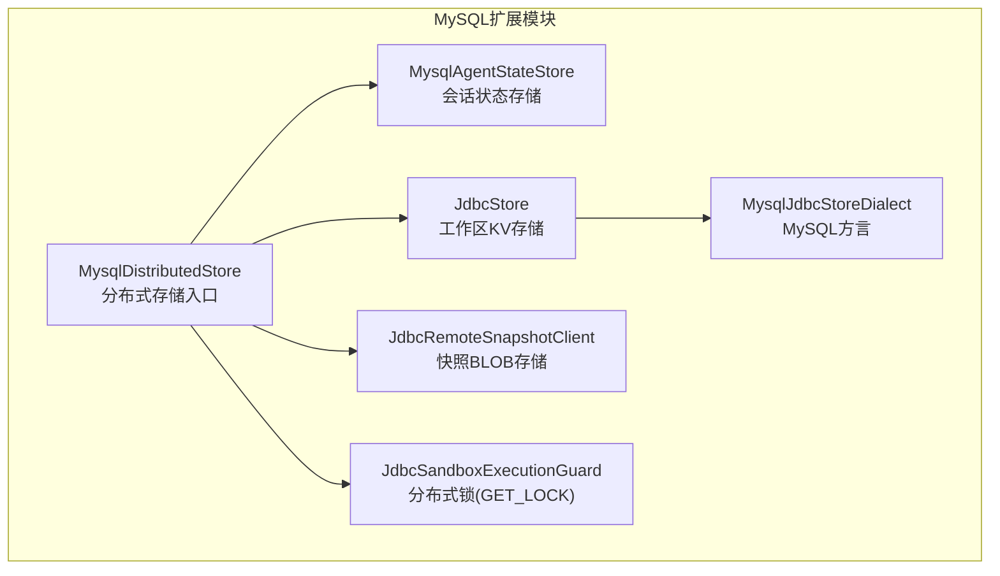
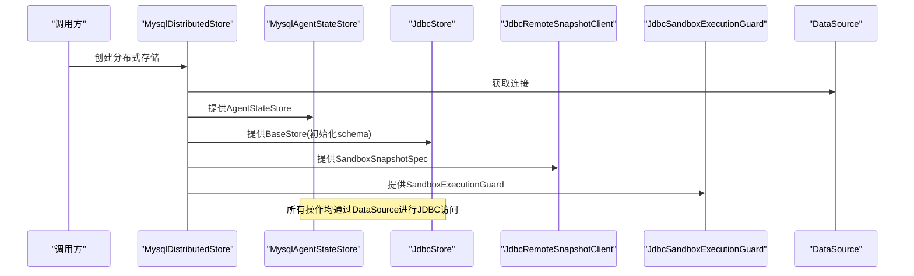
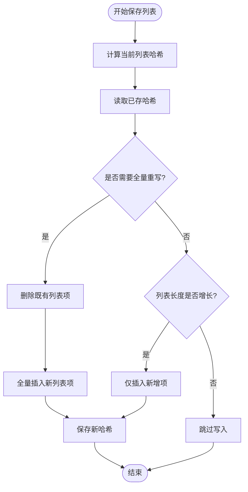
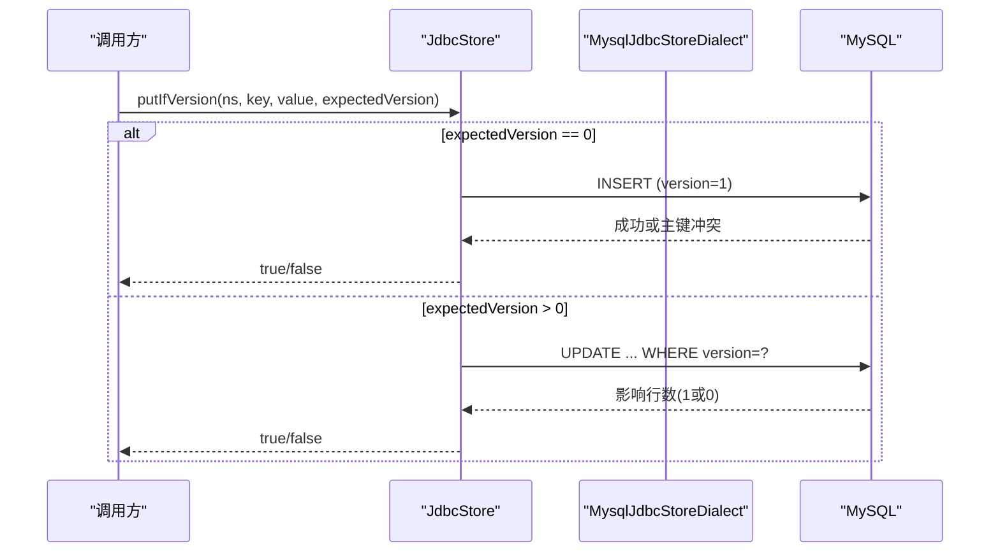
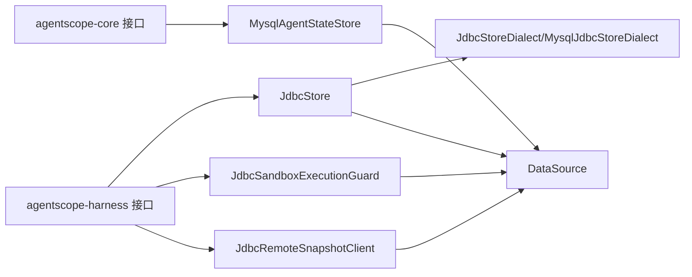

# MySQL分布式存储

<cite>
**本文档引用的文件**
- [MysqlDistributedStore.java](file://agentscope-extensions/agentscope-extensions-mysql/src/main/java/io/agentscope/extensions/mysql/MysqlDistributedStore.java)
- [MysqlAgentStateStore.java](file://agentscope-extensions/agentscope-extensions-mysql/src/main/java/io/agentscope/extensions/mysql/state/MysqlAgentStateStore.java)
- [MysqlJdbcStoreDialect.java](file://agentscope-extensions/agentscope-extensions-mysql/src/main/java/io/agentscope/extensions/mysql/store/MysqlJdbcStoreDialect.java)
- [JdbcStoreDialect.java](file://agentscope-extensions/agentscope-extensions-mysql/src/main/java/io/agentscope/extensions/mysql/store/JdbcStoreDialect.java)
- [JdbcSandboxExecutionGuard.java](file://agentscope-extensions/agentscope-extensions-mysql/src/main/java/io/agentscope/extensions/mysql/sandbox/JdbcSandboxExecutionGuard.java)
- [JdbcRemoteSnapshotClient.java](file://agentscope-extensions/agentscope-extensions-mysql/src/main/java/io/agentscope/extensions/mysql/snapshot/JdbcRemoteSnapshotClient.java)
- [JdbcStore.java](file://agentscope-extensions/agentscope-extensions-mysql/src/main/java/io/agentscope/extensions/mysql/store/JdbcStore.java)
- [MysqlJdbcStoreDialectTest.java](file://agentscope-extensions/agentscope-extensions-mysql/src/test/java/io/agentscope/extensions/mysql/store/MysqlJdbcStoreDialectTest.java)
- [application-jdbc.yml](file://agentscope-examples/agents/agentscope-dataagent/src/main/resources/application-jdbc.yml)
- [pom.xml](file://agentscope-extensions/agentscope-extensions-mysql/pom.xml)
</cite>

## 目录
1. [简介](#简介)
2. [项目结构](#项目结构)
3. [核心组件](#核心组件)
4. [架构总览](#架构总览)
5. [详细组件分析](#详细组件分析)
6. [依赖关系分析](#依赖关系分析)
7. [性能考虑](#性能考虑)
8. [故障排查指南](#故障排查指南)
9. [结论](#结论)
10. [附录](#附录)

## 简介
本文件面向MySQL分布式存储组件，围绕MysqlDistributedStore展开，系统性阐述其数据库架构设计、JDBC连接配置、表结构设计、事务管理机制；深入解析MysqlAgentStateStore的状态持久化策略、MysqlJdbcStoreDialect的SQL方言适配、分布式锁实现；并提供数据库初始化脚本、连接池配置、主从复制部署方案，以及MySQL在ACID特性、成熟生态、备份恢复机制方面的优势。同时给出性能优化策略、索引设计建议、监控告警配置与运维最佳实践。

## 项目结构
MySQL扩展模块位于agentscope-extensions子工程中，核心类包括：
- 分布式存储入口：MysqlDistributedStore
- 会话状态存储：MysqlAgentStateStore（基于MySQL表）
- 工作区键值存储：JdbcStore + MysqlJdbcStoreDialect（MySQL方言）
- 沙箱快照存储：JdbcRemoteSnapshotClient（BLOB列）
- 分布式锁：JdbcSandboxExecutionGuard（基于MySQL命名锁GET_LOCK）

图表来源
- [MysqlDistributedStore.java:54-91](file://agentscope-extensions/agentscope-extensions-mysql/src/main/java/io/agentscope/extensions/mysql/MysqlDistributedStore.java#L54-L91)
- [MysqlAgentStateStore.java:68-751](file://agentscope-extensions/agentscope-extensions-mysql/src/main/java/io/agentscope/extensions/mysql/state/MysqlAgentStateStore.java#L68-L751)
- [JdbcStore.java:74-418](file://agentscope-extensions/agentscope-extensions-mysql/src/main/java/io/agentscope/extensions/mysql/store/JdbcStore.java#L74-L418)
- [MysqlJdbcStoreDialect.java:19-55](file://agentscope-extensions/agentscope-extensions-mysql/src/main/java/io/agentscope/extensions/mysql/store/MysqlJdbcStoreDialect.java#L19-L55)
- [JdbcRemoteSnapshotClient.java:39-122](file://agentscope-extensions/agentscope-extensions-mysql/src/main/java/io/agentscope/extensions/mysql/snapshot/JdbcRemoteSnapshotClient.java#L39-L122)
- [JdbcSandboxExecutionGuard.java:45-176](file://agentscope-extensions/agentscope-extensions-mysql/src/main/java/io/agentscope/extensions/mysql/sandbox/JdbcSandboxExecutionGuard.java#L45-L176)

章节来源
- [MysqlDistributedStore.java:54-91](file://agentscope-extensions/agentscope-extensions-mysql/src/main/java/io/agentscope/extensions/mysql/MysqlDistributedStore.java#L54-L91)

## 核心组件
- MysqlDistributedStore：统一装配MySQL后端的分布式存储，提供AgentStateStore、BaseStore、SandboxSnapshotSpec、SandboxExecutionGuard四个组件。
- MysqlAgentStateStore：将Agent会话状态以JSON形式存入MySQL表，支持单值与列表状态的增量写入，具备自动建表、参数化查询、事务控制与SQL注入防护。
- JdbcStore + MysqlJdbcStoreDialect：提供命名空间路径的键值存储，支持CAS（Compare-And-Swap）写入，MySQL方言通过UPSERT与版本号递增实现乐观并发控制。
- JdbcRemoteSnapshotClient：将沙箱工作区快照以BLOB形式存储于MySQL表，支持上传、下载与存在性检查。
- JdbcSandboxExecutionGuard：基于MySQL命名锁GET_LOCK()/RELEASE_LOCK()实现分布式互斥，确保沙箱执行隔离。

章节来源
- [MysqlDistributedStore.java:54-91](file://agentscope-extensions/agentscope-extensions-mysql/src/main/java/io/agentscope/extensions/mysql/MysqlDistributedStore.java#L54-L91)
- [MysqlAgentStateStore.java:34-67](file://agentscope-extensions/agentscope-extensions-mysql/src/main/java/io/agentscope/extensions/mysql/state/MysqlAgentStateStore.java#L34-L67)
- [JdbcStoreDialect.java:26-49](file://agentscope-extensions/agentscope-extensions-mysql/src/main/java/io/agentscope/extensions/mysql/store/JdbcStoreDialect.java#L26-L49)
- [MysqlJdbcStoreDialect.java:19-55](file://agentscope-extensions/agentscope-extensions-mysql/src/main/java/io/agentscope/extensions/mysql/store/MysqlJdbcStoreDialect.java#L19-L55)
- [JdbcRemoteSnapshotClient.java:31-38](file://agentscope-extensions/agentscope-extensions-mysql/src/main/java/io/agentscope/extensions/mysql/snapshot/JdbcRemoteSnapshotClient.java#L31-L38)
- [JdbcSandboxExecutionGuard.java:31-44](file://agentscope-extensions/agentscope-extensions-mysql/src/main/java/io/agentscope/extensions/mysql/sandbox/JdbcSandboxExecutionGuard.java#L31-L44)

## 架构总览
下图展示MysqlDistributedStore如何组合各子组件，并通过DataSource提供JDBC连接：

图表来源
- [MysqlDistributedStore.java:72-90](file://agentscope-extensions/agentscope-extensions-mysql/src/main/java/io/agentscope/extensions/mysql/MysqlDistributedStore.java#L72-L90)
- [JdbcStore.java:124-133](file://agentscope-extensions/agentscope-extensions-mysql/src/main/java/io/agentscope/extensions/mysql/store/JdbcStore.java#L124-L133)

## 详细组件分析

### MysqlDistributedStore：统一装配与职责边界
- 职责：作为工厂，返回四个子组件：Agent状态存储、工作区KV存储、沙箱快照存储、分布式锁。
- 设计要点：所有组件共享同一DataSource，确保连接复用与一致性；通过builder模式或静态工厂方法创建实例。

章节来源
- [MysqlDistributedStore.java:54-91](file://agentscope-extensions/agentscope-extensions-mysql/src/main/java/io/agentscope/extensions/mysql/MysqlDistributedStore.java#L54-L91)

### MysqlAgentStateStore：会话状态持久化策略
- 表结构与字段
  - 主键：(session_id, state_key, item_index)，其中单值状态item_index=0，列表状态按顺序递增。
  - 字段：session_id、state_key、item_index、state_data(JSON)、created_at、updated_at。
- 存储语义
  - 单值状态：使用UPSERT更新，避免读改写。
  - 列表状态：采用哈希变更检测，支持追加写入与全量重写两种策略，保证列表的可变性与幂等性。
- 安全与健壮性
  - 参数化查询防止SQL注入。
  - 自动建库建表或存在性校验，支持自定义数据库名与表名。
  - 事务封装：每个写操作在显式事务中执行，失败回滚并恢复原始autoCommit状态。
  - 标识符安全：对数据库名、表名进行正则校验与反引号转义。
- 关键流程（保存列表状态）

图表来源
- [MysqlAgentStateStore.java:375-411](file://agentscope-extensions/agentscope-extensions-mysql/src/main/java/io/agentscope/extensions/mysql/state/MysqlAgentStateStore.java#L375-L411)
- [MysqlAgentStateStore.java:390-407](file://agentscope-extensions/agentscope-extensions-mysql/src/main/java/io/agentscope/extensions/mysql/state/MysqlAgentStateStore.java#L390-L407)

章节来源
- [MysqlAgentStateStore.java:34-67](file://agentscope-extensions/agentscope-extensions-mysql/src/main/java/io/agentscope/extensions/mysql/state/MysqlAgentStateStore.java#L34-L67)
- [MysqlAgentStateStore.java:178-223](file://agentscope-extensions/agentscope-extensions-mysql/src/main/java/io/agentscope/extensions/mysql/state/MysqlAgentStateStore.java#L178-L223)
- [MysqlAgentStateStore.java:293-323](file://agentscope-extensions/agentscope-extensions-mysql/src/main/java/io/agentscope/extensions/mysql/state/MysqlAgentStateStore.java#L293-L323)
- [MysqlAgentStateStore.java:325-411](file://agentscope-extensions/agentscope-extensions-mysql/src/main/java/io/agentscope/extensions/mysql/state/MysqlAgentStateStore.java#L325-L411)

### JdbcStore与MysqlJdbcStoreDialect：键值存储与乐观并发
- 设计目标：提供跨数据库兼容的键值存储，通过方言适配MySQL/PostgreSQL/SQLite/H2。
- 核心SQL模板
  - 建表：复合主键(namespace_path, item_key)，版本号version(BIGINT)，updated_at(Epoch毫秒)。
  - UPSERT：插入时version=1，更新时version递增。
  - CAS：条件更新，期望version匹配才成功。
- MySQL方言要点
  - 使用LONGTEXT存储JSON，InnoDB引擎，utf8mb4字符集。
  - 严格控制VARCHAR长度以满足InnoDB utf8mb4联合索引限制（测试保障）。
- CAS流程

图表来源
- [JdbcStore.java:177-219](file://agentscope-extensions/agentscope-extensions-mysql/src/main/java/io/agentscope/extensions/mysql/store/JdbcStore.java#L177-L219)
- [MysqlJdbcStoreDialect.java:22-54](file://agentscope-extensions/agentscope-extensions-mysql/src/main/java/io/agentscope/extensions/mysql/store/MysqlJdbcStoreDialect.java#L22-L54)

章节来源
- [JdbcStoreDialect.java:26-49](file://agentscope-extensions/agentscope-extensions-mysql/src/main/java/io/agentscope/extensions/mysql/store/JdbcStoreDialect.java#L26-L49)
- [JdbcStore.java:38-73](file://agentscope-extensions/agentscope-extensions-mysql/src/main/java/io/agentscope/extensions/mysql/store/JdbcStore.java#L38-L73)
- [MysqlJdbcStoreDialectTest.java:29-45](file://agentscope-extensions/agentscope-extensions-mysql/src/test/java/io/agentscope/extensions/mysql/store/MysqlJdbcStoreDialectTest.java#L29-L45)

### JdbcRemoteSnapshotClient：快照BLOB存储
- 表结构：snapshot_id(VARCHAR PK)、data(LONGBLOB)、created_at(TIMESTAMP)。
- 功能：上传（ON DUPLICATE KEY UPDATE）、下载、存在性检查。
- 初始化：可选自动建表。

章节来源
- [JdbcRemoteSnapshotClient.java:31-76](file://agentscope-extensions/agentscope-extensions-mysql/src/main/java/io/agentscope/extensions/mysql/snapshot/JdbcRemoteSnapshotClient.java#L31-L76)
- [JdbcRemoteSnapshotClient.java:78-121](file://agentscope-extensions/agentscope-extensions-mysql/src/main/java/io/agentscope/extensions/mysql/snapshot/JdbcRemoteSnapshotClient.java#L78-L121)

### JdbcSandboxExecutionGuard：分布式锁实现
- 锁机制：基于MySQL命名锁GET_LOCK()/RELEASE_LOCK()，锁名由前缀+作用域+值组成，超长时进行哈希截断。
- 生命周期：获取到锁后返回SandboxLease，lease关闭时自动释放锁并关闭连接。
- 并发模型：阻塞等待直至超时，避免竞争条件。

章节来源
- [JdbcSandboxExecutionGuard.java:31-44](file://agentscope-extensions/agentscope-extensions-mysql/src/main/java/io/agentscope/extensions/mysql/sandbox/JdbcSandboxExecutionGuard.java#L31-L44)
- [JdbcSandboxExecutionGuard.java:65-97](file://agentscope-extensions/agentscope-extensions-mysql/src/main/java/io/agentscope/extensions/mysql/sandbox/JdbcSandboxExecutionGuard.java#L65-L97)
- [JdbcSandboxExecutionGuard.java:109-141](file://agentscope-extensions/agentscope-extensions-mysql/src/main/java/io/agentscope/extensions/mysql/sandbox/JdbcSandboxExecutionGuard.java#L109-L141)

## 依赖关系分析
- 组件耦合
  - MysqlDistributedStore聚合多个子组件，低耦合高内聚。
  - 各组件均通过DataSource获取连接，避免重复管理连接。
- 外部依赖
  - 依赖agentscope-core与agentscope-harness提供的接口契约。
  - MySQL驱动由上层应用提供（示例配置文件中使用了MySQL驱动）。

图表来源
- [MysqlDistributedStore.java:18-27](file://agentscope-extensions/agentscope-extensions-mysql/src/main/java/io/agentscope/extensions/mysql/MysqlDistributedStore.java#L18-L27)
- [JdbcStore.java:18-36](file://agentscope-extensions/agentscope-extensions-mysql/src/main/java/io/agentscope/extensions/mysql/store/JdbcStore.java#L18-L36)
- [JdbcStoreDialect.java:16-25](file://agentscope-extensions/agentscope-extensions-mysql/src/main/java/io/agentscope/extensions/mysql/store/JdbcStoreDialect.java#L16-L25)

章节来源
- [pom.xml:33-53](file://agentscope-extensions/agentscope-extensions-mysql/pom.xml#L33-L53)

## 性能考虑
- 连接池配置（建议）
  - 连接池选择：HikariCP/Druid/C3P0，推荐HikariCP。
  - 关键参数：最小空闲连接、最大连接数、连接超时、空闲超时、最大生命周期。
  - 验证SQL：设置validationTimeout与connectionTestQuery。
- 写入优化
  - 批量插入：JdbcStore在插入时使用addBatch提升吞吐。
  - 列表增量写：MysqlAgentStateStore根据哈希与长度判断，尽量减少全量重写。
  - UPSERT与版本号：JdbcStore通过ON DUPLICATE KEY UPDATE与version递增降低锁竞争。
- 读取优化
  - 索引设计：MysqlAgentStateStore主键覆盖session_id、state_key、item_index；JdbcStore主键覆盖namespace_path、item_key。
  - 查询过滤：JdbcStore使用LIKE ESCAPE进行前缀匹配，注意转义字符。
- 事务与并发
  - 显式事务：MysqlAgentStateStore在写操作中开启事务，失败回滚，避免部分写入。
  - 分布式锁：JdbcSandboxExecutionGuard使用GET_LOCK()阻塞等待，避免并发冲突。
- 监控与告警
  - 连接池指标：活跃连接数、等待时间、拒绝次数。
  - SQL指标：慢查询阈值、执行耗时分布、错误率。
  - 数据库层面：锁等待、死锁次数、缓冲池命中率、磁盘I/O。

## 故障排查指南
- 常见问题与定位
  - 连接失败：检查DataSource配置、网络连通性、驱动类名与URL格式。
  - 权限不足：确认用户具备DDL/DML权限，特别是TRUNCATE（清理会话时）。
  - SQL异常：核对参数绑定顺序与类型，关注主键冲突与完整性约束。
  - 锁超时：调整JdbcSandboxExecutionGuard的lockTimeout，避免过短导致频繁中断。
- 日志与诊断
  - 开启DEBUG日志观察SQL执行与参数。
  - 记录慢查询与异常堆栈，定位热点表与瓶颈SQL。
- 快速修复
  - 重建表结构：使用initializeSchema(true)或手动执行DDL。
  - 清理数据：谨慎使用TRUNCATE或DELETE，注意备份与权限。

章节来源
- [MysqlAgentStateStore.java:780-800](file://agentscope-extensions/agentscope-extensions-mysql/src/main/java/io/agentscope/extensions/mysql/state/MysqlAgentStateStore.java#L780-L800)
- [JdbcSandboxExecutionGuard.java:86-96](file://agentscope-extensions/agentscope-extensions-mysql/src/main/java/io/agentscope/extensions/mysql/sandbox/JdbcSandboxExecutionGuard.java#L86-L96)

## 结论
MySQL分布式存储组件通过MysqlDistributedStore统一装配，结合MysqlAgentStateStore、JdbcStore、JdbcRemoteSnapshotClient与JdbcSandboxExecutionGuard，实现了会话状态、工作区KV、快照与分布式锁的完整闭环。其设计强调安全性（参数化查询、标识符校验、事务封装）、可扩展性（方言抽象、连接池解耦）与可观测性（日志与指标）。配合合理的连接池配置、索引设计与监控告警，可在生产环境中稳定支撑多节点Agent协作场景。

## 附录

### 数据库初始化脚本（建议）
- 会话状态表（agentscope_sessions）
  - 字段：session_id、state_key、item_index、state_data、created_at、updated_at
  - 主键：(session_id, state_key, item_index)
  - 引擎：InnoDB，字符集utf8mb4
- 工作区KV表（agentscope_store）
  - 字段：namespace_path、item_key、value_json、version、updated_at
  - 主键：(namespace_path, item_key)
  - 引擎：InnoDB，字符集utf8mb4
- 快照表（agentscope_snapshots）
  - 字段：snapshot_id、data(LONGBLOB)、created_at
  - 主键：snapshot_id

说明：上述表结构与字段定义可参考各组件源码中的DDL生成逻辑与注释说明。

章节来源
- [MysqlAgentStateStore.java:45-57](file://agentscope-extensions/agentscope-extensions-mysql/src/main/java/io/agentscope/extensions/mysql/state/MysqlAgentStateStore.java#L45-L57)
- [MysqlJdbcStoreDialect.java:22-32](file://agentscope-extensions/agentscope-extensions-mysql/src/main/java/io/agentscope/extensions/mysql/store/MysqlJdbcStoreDialect.java#L22-L32)
- [JdbcRemoteSnapshotClient.java:61-76](file://agentscope-extensions/agentscope-extensions-mysql/src/main/java/io/agentscope/extensions/mysql/snapshot/JdbcRemoteSnapshotClient.java#L61-L76)

### JDBC连接配置（示例）
- 示例配置文件展示了Spring Boot下的JDBC配置，包括URL、用户名、密码、驱动类名与Hibernate DDL行为。
- 可直接用于本地开发或CI环境，生产环境建议通过环境变量注入敏感信息。

章节来源
- [application-jdbc.yml:18-45](file://agentscope-examples/agents/agentscope-dataagent/src/main/resources/application-jdbc.yml#L18-L45)

### 主从复制部署方案（建议）
- 角色划分：一主多从，读写分离（写入主库，读取从库）。
- 配置要点：binlog启用、GTID一致性、半同步复制、心跳与延迟监控。
- 应用侧：通过DataSource路由写/读流量，或使用中间件（如MyCat/ProxySQL）实现透明读写分离。
- 注意：分布式锁依赖MySQL命名锁，需确保锁资源在同一实例上可用；若使用代理层，需评估锁传播与可见性。

[本节为通用运维建议，不直接分析具体源码文件]

### MySQL优势概述
- ACID特性：强一致事务、原子性与持久性保障，适合状态持久化与并发控制。
- 成熟生态：驱动完善、工具链丰富、社区支持广泛。
- 备份恢复：支持物理/逻辑备份、增量备份、在线热备与快速恢复。
- 企业级能力：分区、只读副本、审计、加密等。

[本节为概念性总结，不直接分析具体源码文件]