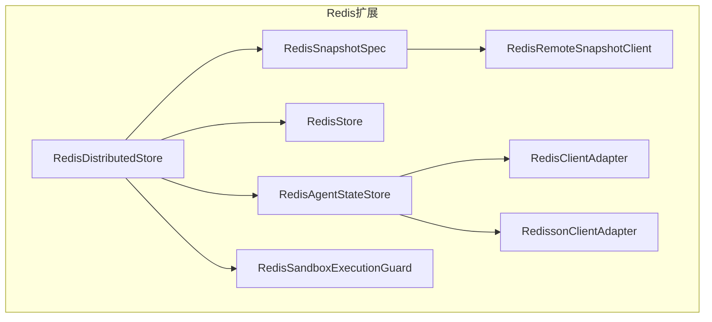
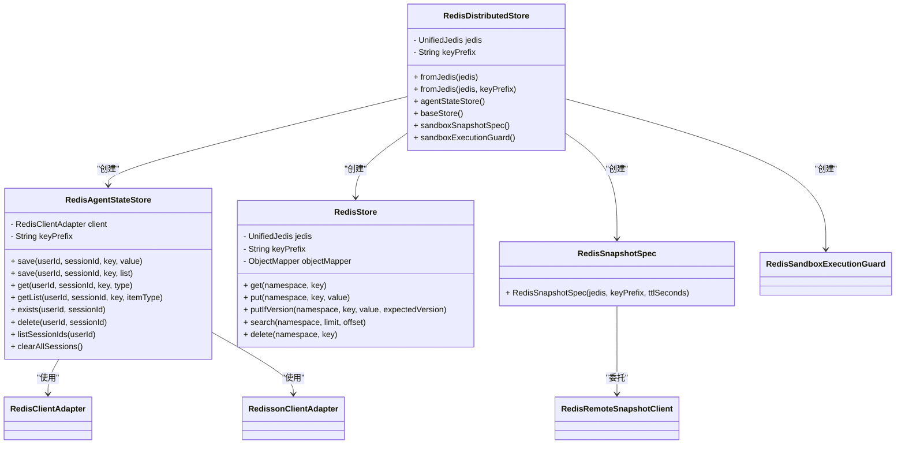
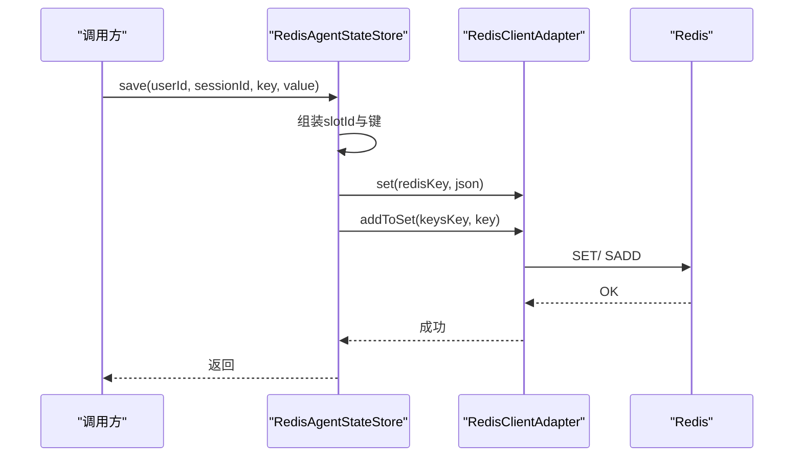
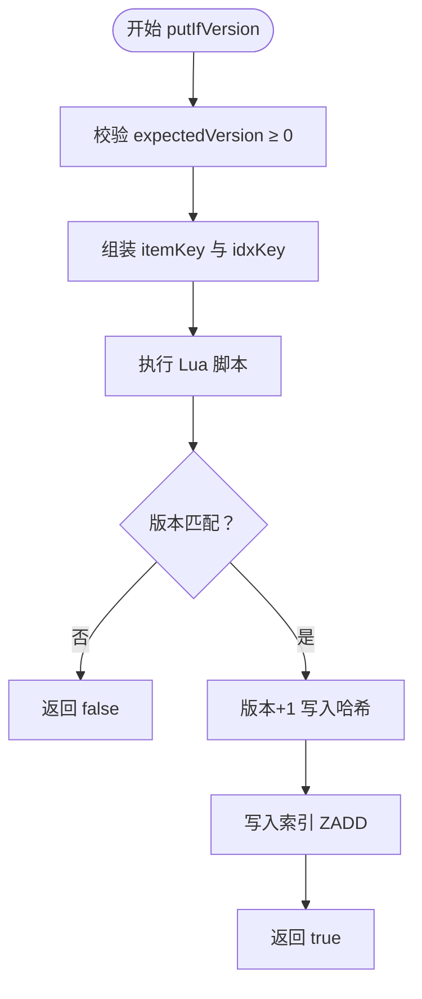
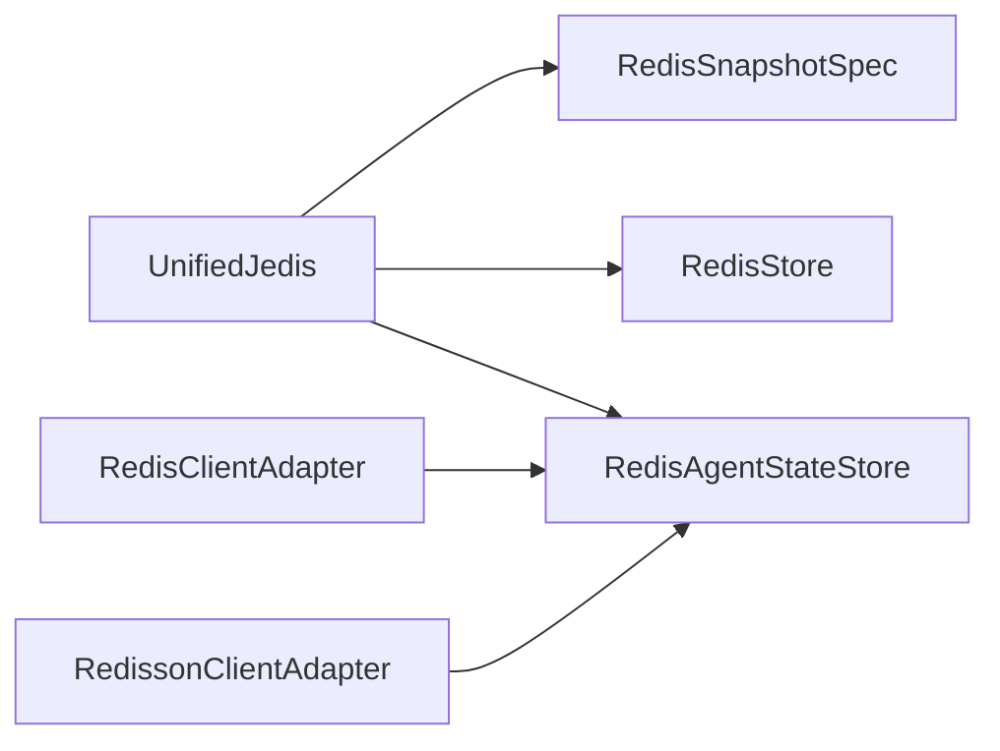

# Redis分布式存储

<cite>
**本文引用的文件**
- [RedisDistributedStore.java](file://agentscope-extensions/agentscope-extensions-redis/src/main/java/io/agentscope/extensions/redis/RedisDistributedStore.java)
- [RedisAgentStateStore.java](file://agentscope-extensions/agentscope-extensions-redis/src/main/java/io/agentscope/extensions/redis/state/RedisAgentStateStore.java)
- [RedisStore.java](file://agentscope-extensions/agentscope-extensions-redis/src/main/java/io/agentscope/extensions/redis/store/RedisStore.java)
- [RedisSnapshotSpec.java](file://agentscope-extensions/agentscope-extensions-redis/src/main/java/io/agentscope/extensions/redis/snapshot/RedisSnapshotSpec.java)
- [RedisClientAdapter.java](file://agentscope-extensions/agentscope-extensions-redis/src/main/java/io/agentscope/extensions/redis/state/RedisClientAdapter.java)
- [RedissonClientAdapter.java](file://agentscope-extensions/agentscope-extensions-redis/src/main/java/io/agentscope/extensions/redis/state/redisson/RedissonClientAdapter.java)
- [RedisRemoteSnapshotClient.java](file://agentscope-extensions/agentscope-extensions-redis/src/main/java/io/agentscope/extensions/redis/snapshot/RedisRemoteSnapshotClient.java)
- [RedisSandboxExecutionGuard.java](file://agentscope-extensions/agentscope-extensions-redis/src/main/java/io/agentscope/extensions/redis/sandbox/RedisSandboxExecutionGuard.java)
</cite>

## 目录
1. [简介](#简介)
2. [项目结构](#项目结构)
3. [核心组件](#核心组件)
4. [架构总览](#架构总览)
5. [组件详解](#组件详解)
6. [依赖关系分析](#依赖关系分析)
7. [性能与优化](#性能与优化)
8. [故障排查指南](#故障排查指南)
9. [结论](#结论)
10. [附录：配置与部署示例](#附录配置与部署示例)

## 简介
本技术文档围绕Redis分布式存储组件展开，重点介绍以下能力与实现：
- RedisDistributedStore的整体架构与统一客户端配置（基于UnifiedJedis）
- 键空间管理策略（键前缀、命名规范、索引与集合）
- 连接池与客户端选择（Jedis/Lettuce/Redisson多客户端适配）
- RedisAgentStateStore的状态存储机制（单值、列表、变更检测、会话枚举）
- RedisStore的工作区文件系统KV存储（原子写入、CAS、版本控制、有序索引）
- RedisSnapshotSpec的沙箱快照存储（基于RedisRemoteSnapshotClient）
- 部署与配置要点（连接参数、键前缀、集群模式）
- Redis特性优势（高性能、原子Lua脚本、持久化选项）
- 故障处理、监控指标与性能调优建议

## 项目结构
Redis相关实现位于agentscope-extensions模块下的redis扩展包中，核心类如下：
- 分布式存储入口：RedisDistributedStore
- 会话状态存储：RedisAgentStateStore
- 工作区KV存储：RedisStore
- 沙箱快照存储：RedisSnapshotSpec（配合RedisRemoteSnapshotClient）
- 客户端适配层：RedisClientAdapter、RedissonClientAdapter
- 并发保护：RedisSandboxExecutionGuard

图示来源
- [RedisDistributedStore.java:56-108](file://agentscope-extensions/agentscope-extensions-redis/src/main/java/io/agentscope/extensions/redis/RedisDistributedStore.java#L56-L108)
- [RedisAgentStateStore.java:177-493](file://agentscope-extensions/agentscope-extensions-redis/src/main/java/io/agentscope/extensions/redis/state/RedisAgentStateStore.java#L177-L493)
- [RedisStore.java:57-283](file://agentscope-extensions/agentscope-redis/src/main/java/io/agentscope/extensions/redis/store/RedisStore.java#L57-L283)
- [RedisSnapshotSpec.java:25-37](file://agentscope-extensions/agentscope-extensions-redis/src/main/java/io/agentscope/extensions/redis/snapshot/RedisSnapshotSpec.java#L25-L37)
- [RedisRemoteSnapshotClient.java](file://agentscope-extensions/agentscope-extensions-redis/src/main/java/io/agentscope/extensions/redis/snapshot/RedisRemoteSnapshotClient.java)
- [RedisSandboxExecutionGuard.java](file://agentscope-extensions/agentscope-extensions-redis/src/main/java/io/agentscope/extensions/redis/sandbox/RedisSandboxExecutionGuard.java)
- [RedisClientAdapter.java](file://agentscope-extensions/agentscope-extensions-redis/src/main/java/io/agentscope/extensions/redis/state/RedisClientAdapter.java)
- [RedissonClientAdapter.java](file://agentscope-extensions/agentscope-extensions-redis/src/main/java/io/agentscope/extensions/redis/state/redisson/RedissonClientAdapter.java)

章节来源
- [RedisDistributedStore.java:56-108](file://agentscope-extensions/agentscope-extensions-redis/src/main/java/io/agentscope/extensions/redis/RedisDistributedStore.java#L56-L108)
- [RedisAgentStateStore.java:177-493](file://agentscope-extensions/agentscope-extensions-redis/src/main/java/io/agentscope/extensions/redis/state/RedisAgentStateStore.java#L177-L493)
- [RedisStore.java:57-283](file://agentscope-extensions/agentscope-extensions-redis/src/main/java/io/agentscope/extensions/redis/store/RedisStore.java#L57-L283)
- [RedisSnapshotSpec.java:25-37](file://agentscope-extensions/agentscope-extensions-redis/src/main/java/io/agentscope/extensions/redis/snapshot/RedisSnapshotSpec.java#L25-L37)

## 核心组件
- RedisDistributedStore：统一分布式存储入口，负责装配Agent状态、工作区KV、沙箱快照与并发保护组件，并通过统一的键前缀进行隔离。
- RedisAgentStateStore：支持多种Redis客户端（Jedis/Lettuce/Redisson），提供会话状态的单值与列表存储、变更检测、会话枚举与清理。
- RedisStore：基于Redis的KV存储，使用Lua脚本保证原子性，提供版本控制、CAS、有序索引与批量检索。
- RedisSnapshotSpec：沙箱快照的远程存储规格，委托RedisRemoteSnapshotClient完成持久化与TTL控制。
- RedisClientAdapter/RedissonClientAdapter：对不同Redis客户端的抽象适配，屏蔽底层差异。
- RedisSandboxExecutionGuard：沙箱执行并发锁，保障多实例下的互斥访问。

章节来源
- [RedisDistributedStore.java:56-108](file://agentscope-extensions/agentscope-extensions-redis/src/main/java/io/agentscope/extensions/redis/RedisDistributedStore.java#L56-L108)
- [RedisAgentStateStore.java:177-493](file://agentscope-extensions/agentscope-extensions-redis/src/main/java/io/agentscope/extensions/redis/state/RedisAgentStateStore.java#L177-L493)
- [RedisStore.java:57-283](file://agentscope-extensions/agentscope-extensions-redis/src/main/java/io/agentscope/extensions/redis/store/RedisStore.java#L57-L283)
- [RedisSnapshotSpec.java:25-37](file://agentscope-extensions/agentscope-extensions-redis/src/main/java/io/agentscope/extensions/redis/snapshot/RedisSnapshotSpec.java#L25-L37)
- [RedisClientAdapter.java](file://agentscope-extensions/agentscope-extensions-redis/src/main/java/io/agentscope/extensions/redis/state/RedisClientAdapter.java)
- [RedissonClientAdapter.java](file://agentscope-extensions/agentscope-extensions-redis/src/main/java/io/agentscope/extensions/redis/state/redisson/RedissonClientAdapter.java)
- [RedisSandboxExecutionGuard.java](file://agentscope-extensions/agentscope-extensions-redis/src/main/java/io/agentscope/extensions/redis/sandbox/RedisSandboxExecutionGuard.java)

## 架构总览
RedisDistributedStore作为装配中心，将各子组件与统一的UnifiedJedis客户端绑定，并按约定生成键前缀，确保命名空间隔离与可维护性。

图示来源
- [RedisDistributedStore.java:56-108](file://agentscope-extensions/agentscope-extensions-redis/src/main/java/io/agentscope/extensions/redis/RedisDistributedStore.java#L56-L108)
- [RedisAgentStateStore.java:177-493](file://agentscope-extensions/agentscope-extensions-redis/src/main/java/io/agentscope/extensions/redis/state/RedisAgentStateStore.java#L177-L493)
- [RedisStore.java:57-283](file://agentscope-extensions/agentscope-extensions-redis/src/main/java/io/agentscope/extensions/redis/store/RedisStore.java#L57-L283)
- [RedisSnapshotSpec.java:25-37](file://agentscope-extensions/agentscope-extensions-redis/src/main/java/io/agentscope/extensions/redis/snapshot/RedisSnapshotSpec.java#L25-L37)
- [RedisRemoteSnapshotClient.java](file://agentscope-extensions/agentscope-extensions-redis/src/main/java/io/agentscope/extensions/redis/snapshot/RedisRemoteSnapshotClient.java)
- [RedisSandboxExecutionGuard.java](file://agentscope-extensions/agentscope-extensions-redis/src/main/java/io/agentscope/extensions/redis/sandbox/RedisSandboxExecutionGuard.java)
- [RedisClientAdapter.java](file://agentscope-extensions/agentscope-extensions-redis/src/main/java/io/agentscope/extensions/redis/state/RedisClientAdapter.java)
- [RedissonClientAdapter.java](file://agentscope-extensions/agentscope-extensions-redis/src/main/java/io/agentscope/extensions/redis/state/redisson/RedissonClientAdapter.java)

## 组件详解

### RedisDistributedStore：统一装配与键空间
- 统一客户端：持有UnifiedJedis实例，避免在各子组件中重复管理连接。
- 键前缀策略：默认“agentscope:”，可通过构造方法自定义；子组件按需追加“session:”、“store:”、“snapshot:”、“guard:”等子前缀，形成清晰的命名空间分层。
- 装配职责：
  - agentStateStore：返回RedisAgentStateStore，用于会话状态持久化。
  - baseStore：返回RedisStore，用于工作区文件系统KV存储。
  - sandboxSnapshotSpec：返回RedisSnapshotSpec，用于沙箱快照。
  - sandboxExecutionGuard：返回RedisSandboxExecutionGuard，用于并发控制。

章节来源
- [RedisDistributedStore.java:56-108](file://agentscope-extensions/agentscope-extensions-redis/src/main/java/io/agentscope/extensions/redis/RedisDistributedStore.java#L56-L108)

### RedisAgentStateStore：会话状态存储
- 支持多客户端：Jedis（Standalone/Cluster/Sentinel）、Lettuce（Standalone/Cluster/Sentinel）、Redisson（Standalone/Cluster/Sentinel/Master/Slave）。
- 数据模型与键布局：
  - 单值状态：{prefix}{slotId}:{stateKey}
  - 列表状态：{prefix}{slotId}:{stateKey}:list
  - 列表哈希：{prefix}{slotId}:{stateKey}:list:_hash（用于变更检测）
  - 会话键集合：{prefix}{slotId}:_keys（Set，记录该会话下所有键）
- 关键流程：
  - 保存单值：写入JSON字符串，同时将键加入会话集合。
  - 保存列表：计算当前哈希，判断是否需要全量重写或增量追加，更新哈希与集合。
  - 读取：单值直接JSON反序列化；列表遍历范围读取后逐项反序列化。
  - 删除：先读取会话集合，再删除对应键（含列表哈希）。
  - 会话枚举：通过模式匹配“*_keys”收集所有会话ID。
- 特性：
  - 变更检测：通过列表哈希快速判断是否需要重写，减少不必要的写放大。
  - 匿名用户：当userId为空时归一化为“__anon__”，保证键空间一致性。
  - 清理工具：提供clearAllSessions异步清理（测试/运维场景）。

图示来源
- [RedisAgentStateStore.java:211-224](file://agentscope-extensions/agentscope-extensions-redis/src/main/java/io/agentscope/extensions/redis/state/RedisAgentStateStore.java#L211-L224)
- [RedisAgentStateStore.java:453-492](file://agentscope-extensions/agentscope-extensions-redis/src/main/java/io/agentscope/extensions/redis/state/RedisAgentStateStore.java#L453-L492)

章节来源
- [RedisAgentStateStore.java:177-493](file://agentscope-extensions/agentscope-extensions-redis/src/main/java/io/agentscope/extensions/redis/state/RedisAgentStateStore.java#L177-L493)

### RedisStore：工作区文件系统KV存储
- 键布局：
  - Item哈希：{prefix}item:{ns}\0{key}（字段：value、version）
  - 命名空间索引：{prefix}idx:{ns}（Sorted Set，score=0，成员为key，支持ZRANGEBYLEX）
- 原子性保障：
  - put：Lua脚本一次性完成版本递增、哈希写入与索引更新。
  - putIfVersion：CAS写入，仅当版本匹配时更新，否则返回“0”。
  - delete：Lua脚本删除哈希与索引条目。
- 查询：
  - search：基于ZRANGEBYLEX获取键名列表，再批量读取哈希，跳过缺失项（容忍短暂不一致窗口）。
- 序列化：
  - 使用Jackson ObjectMapper进行Map<String,Object>的JSON编解码。

图示来源
- [RedisStore.java:148-164](file://agentscope-extensions/agentscope-extensions-redis/src/main/java/io/agentscope/extensions/redis/store/RedisStore.java#L148-L164)
- [RedisStore.java:79-85](file://agentscope-extensions/agentscope-extensions-redis/src/main/java/io/agentscope/extensions/redis/store/RedisStore.java#L79-L85)

章节来源
- [RedisStore.java:57-283](file://agentscope-extensions/agentscope-extensions-redis/src/main/java/io/agentscope/extensions/redis/store/RedisStore.java#L57-L283)

### RedisSnapshotSpec：沙箱快照存储
- 角色定位：作为SandboxSnapshotSpec的远程实现，委托RedisRemoteSnapshotClient完成快照数据的存取与TTL控制。
- 参数：
  - jedis：统一客户端
  - keyPrefix：可选键前缀
  - ttlSeconds：可选TTL（null或负数表示不过期）

章节来源
- [RedisSnapshotSpec.java:25-37](file://agentscope-extensions/agentscope-extensions-redis/src/main/java/io/agentscope/extensions/redis/snapshot/RedisSnapshotSpec.java#L25-L37)
- [RedisRemoteSnapshotClient.java](file://agentscope-extensions/agentscope-extensions-redis/src/main/java/io/agentscope/extensions/redis/snapshot/RedisRemoteSnapshotClient.java)

### 并发保护：RedisSandboxExecutionGuard
- 作用：在沙箱模式下提供并发锁，避免多实例同时执行同一沙箱任务导致的竞争条件。
- 实现：基于Redis的原子操作（如SET NX EX或RedLock策略）实现互斥锁，具体细节由RedisSandboxExecutionGuard封装。

章节来源
- [RedisSandboxExecutionGuard.java](file://agentscope-extensions/agentscope-extensions-redis/src/main/java/io/agentscope/extensions/redis/sandbox/RedisSandboxExecutionGuard.java)

## 依赖关系分析
- 组件耦合：
  - RedisDistributedStore低耦合地装配各子组件，通过统一的UnifiedJedis与键前缀降低跨模块耦合。
  - RedisAgentStateStore与RedisStore均依赖UnifiedJedis，但通过适配层（RedisClientAdapter/RedissonClientAdapter）支持多客户端。
- 外部依赖：
  - Jedis（UnifiedJedis）
  - Lettuce（RedisClient/RedisClusterClient）
  - Redisson（RedissonClient）
- 潜在循环依赖：无直接循环；适配层与具体实现分离，避免环状依赖。

图示来源
- [RedisStore.java:91-93](file://agentscope-extensions/agentscope-extensions-redis/src/main/java/io/agentscope/extensions/redis/store/RedisStore.java#L91-L93)
- [RedisAgentStateStore.java:187-199](file://agentscope-extensions/agentscope-extensions-redis/src/main/java/io/agentscope/extensions/redis/state/RedisAgentStateStore.java#L187-L199)
- [RedisClientAdapter.java](file://agentscope-extensions/agentscope-extensions-redis/src/main/java/io/agentscope/extensions/redis/state/RedisClientAdapter.java)
- [RedissonClientAdapter.java](file://agentscope-extensions/agentscope-extensions-redis/src/main/java/io/agentscope/extensions/redis/state/redisson/RedissonClientAdapter.java)

章节来源
- [RedisStore.java:57-283](file://agentscope-extensions/agentscope-extensions-redis/src/main/java/io/agentscope/extensions/redis/store/RedisStore.java#L57-L283)
- [RedisAgentStateStore.java:177-493](file://agentscope-extensions/agentscope-extensions-redis/src/main/java/io/agentscope/extensions/redis/state/RedisAgentStateStore.java#L177-L493)

## 性能与优化
- 连接与池化
  - 使用UnifiedJedis统一客户端，便于复用连接与配置连接池参数（超时、最大连接数、空闲回收等）。
  - 在高并发场景下，建议结合连接池与合理的超时设置，避免阻塞。
- 键空间与内存
  - 合理设置键前缀，避免与其他应用冲突；定期清理过期会话与无用键。
  - 对大列表采用增量写入与哈希检测，减少全量重写带来的写放大。
- 原子性与Lua脚本
  - RedisStore的CAS与批量操作通过Lua脚本保证原子性，降低竞争条件与一致性问题。
- 持久化与可靠性
  - 根据业务需求选择RDB/AOF策略，平衡性能与数据安全。
  - 对关键数据开启AOF fsync策略以提升可靠性。
- 监控与指标
  - 关注命令耗时分布、内存使用、连接数、命中率、慢查询日志。
  - 结合Redis自带INFO与慢查询功能定位热点键与异常操作。

## 故障排查指南
- 常见问题
  - 连接失败：检查Redis地址、认证、网络连通性与连接池配置。
  - 键冲突：确认键前缀唯一性，避免与其他应用共享相同前缀。
  - 列表不一致：列表写入采用增量与哈希检测，若出现异常，检查哈希计算与写入顺序。
  - CAS失败：expectedVersion不匹配通常意味着并发写入，应重试或采用幂等策略。
- 排查步骤
  - 使用SCAN/PFCOUNT等命令扫描键空间，确认命名规范与前缀。
  - 通过LRU/内存统计定位热点键与异常增长。
  - 开启慢查询日志，定位耗时命令。
- 临时修复
  - 使用RedisAgentStateStore提供的clearAllSessions进行清理（仅限测试/运维场景）。
  - 对于工作区KV，检查命名空间与键合法性，避免NUL字符与空键。

章节来源
- [RedisAgentStateStore.java:391-405](file://agentscope-extensions/agentscope-extensions-redis/src/main/java/io/agentscope/extensions/redis/state/RedisAgentStateStore.java#L391-L405)
- [RedisStore.java:258-265](file://agentscope-extensions/agentscope-extensions-redis/src/main/java/io/agentscope/extensions/redis/store/RedisStore.java#L258-L265)

## 结论
Redis分布式存储组件通过统一客户端与键前缀策略，实现了会话状态、工作区KV与沙箱快照的一体化管理。借助多客户端适配与原子Lua脚本，系统在性能与一致性之间取得良好平衡。结合合理的连接池配置、键空间治理与监控体系，可在生产环境中稳定支撑多实例协作与高并发访问。

## 附录：配置与部署示例
- 连接参数设置
  - 使用UnifiedJedis初始化客户端，设置超时、连接池大小、重试策略等参数。
  - 集群/哨兵模式下，根据部署形态选择对应的客户端类型（Standalone/Cluster/Sentinel）。
- 键前缀配置
  - 默认前缀为“agentscope:”，可通过RedisDistributedStore构造函数自定义。
  - 子组件自动追加“session:”、“store:”、“snapshot:”、“guard:”等子前缀，确保命名空间隔离。
- 集群模式部署
  - Jedis/Lettuce/Redisson均支持Cluster与Sentinel部署形态，按需选择客户端类型。
  - 注意键空间分布与槽位迁移期间的数据一致性。
- Redis特性优势
  - 高性能：内存存储与单线程事件循环。
  - 原子操作：Lua脚本与事务保证一致性。
  - 持久化选项：RDB/AOF满足不同可靠性需求。
- 最佳实践
  - 明确键前缀与命名规范，避免冲突。
  - 对大对象与长列表采用分片或压缩策略。
  - 定期清理过期键与无用数据，保持内存健康。
  - 配置慢查询与告警，持续优化热点键。