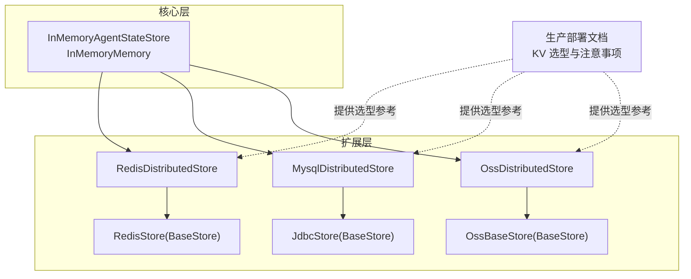
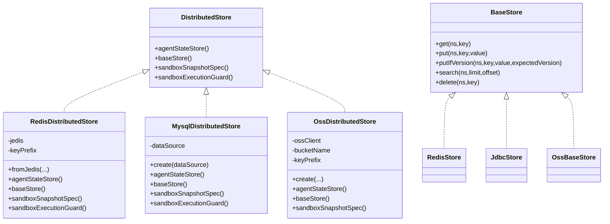
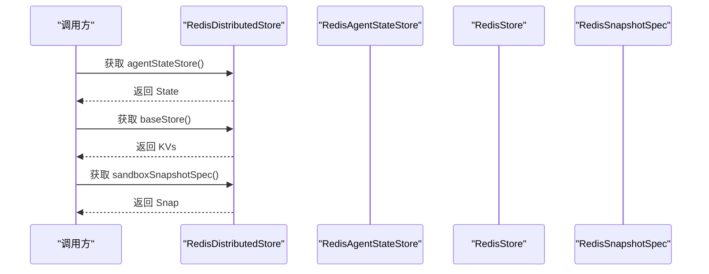
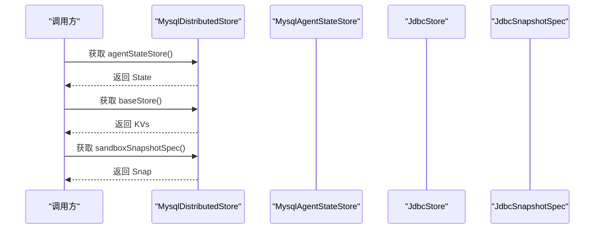
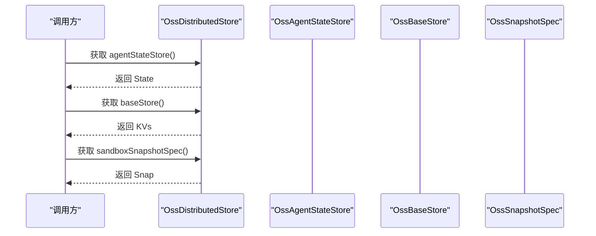
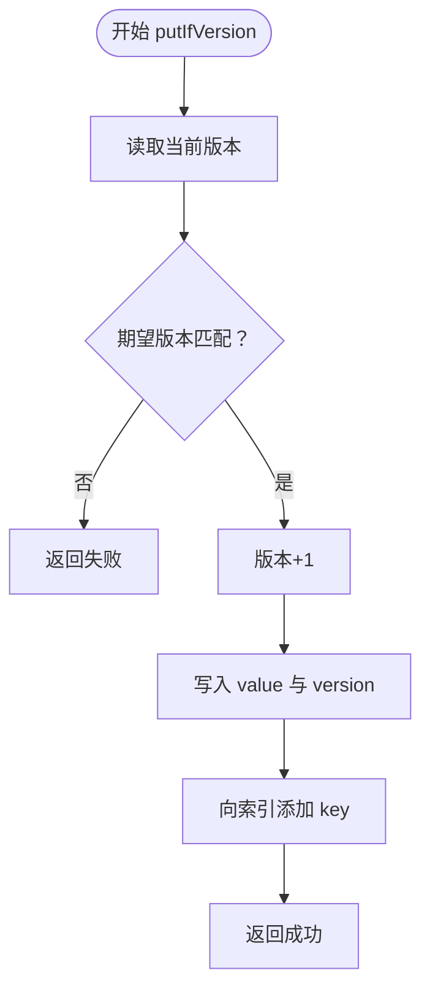
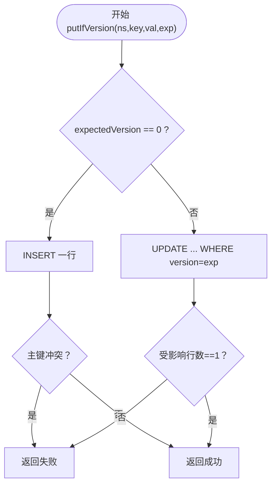
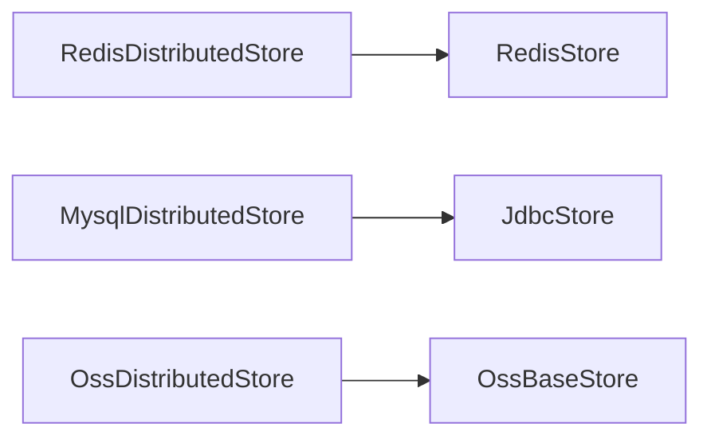

# 内存后端

<cite>
**本文引用的文件**
- [RedisDistributedStore.java](file://agentscope-extensions/agentscope-extensions-redis/src/main/java/io/agentscope/extensions/redis/RedisDistributedStore.java)
- [MysqlDistributedStore.java](file://agentscope-extensions/agentscope-extensions-mysql/src/main/java/io/agentscope/extensions/mysql/MysqlDistributedStore.java)
- [OssDistributedStore.java](file://agentscope-extensions/agentscope-extensions-oss/src/main/java/io/agentscope/extensions/oss/OssDistributedStore.java)
- [RedisStore.java](file://agentscope-extensions/agentscope-extensions-redis/src/main/java/io/agentscope/extensions/redis/store/RedisStore.java)
- [JdbcStore.java](file://agentscope-extensions/agentscope-extensions-mysql/src/main/java/io/agentscope/extensions/mysql/store/JdbcStore.java)
- [OssBaseStore.java](file://agentscope-extensions/agentscope-extensions-oss/src/main/java/io/agentscope/extensions/oss/OssBaseStore.java)
- [InMemoryAgentStateStore.java](file://agentscope-core/src/main/java/io/agentscope/core/state/InMemoryAgentStateStore.java)
- [InMemoryMemory.java](file://agentscope-core/src/main/java/io/agentscope/core/memory/InMemoryMemory.java)
- [going-to-production.md](file://docs/v2/zh/docs/others/going-to-production.md)
</cite>

## 目录
1. [引言](#引言)
2. [项目结构](#项目结构)
3. [核心组件](#核心组件)
4. [架构总览](#架构总览)
5. [详细组件分析](#详细组件分析)
6. [依赖分析](#依赖分析)
7. [性能考量](#性能考量)
8. [故障排查指南](#故障排查指南)
9. [结论](#结论)
10. [附录](#附录)

## 引言
本文件面向 AgentScope Java 的“内存后端”体系，系统性梳理分布式存储后端的架构设计与实现要点，覆盖以下三类后端：
- RedisDistributedStore：基于 Redis 的缓存集群，适合高并发、低延迟的会话状态与共享 KV 存储。
- MysqlDistributedStore：基于关系型数据库的持久化方案，适合已有 RDBMS 基础设施与需要联表/审计的场景。
- OssDistributedStore：基于对象存储的快照与状态持久化，适合大对象与跨节点共享卷。

文档重点解释各后端的适用场景、性能特征、扩展性考虑，并给出连接管理、事务与一致性保障、配置示例、监控指标、故障转移与运维最佳实践。

## 项目结构
围绕内存后端的核心模块分布如下：
- 核心状态与内存接口位于 agentscope-core，包含内存态与消息记忆的实现。
- 分布式存储后端位于 agentscope-extensions 下的 redis、mysql、oss 三个子模块，分别提供分布式存储装配器与具体存储实现。
- 生产部署与 KV 选型建议位于 docs 文档。

图表来源
- [RedisDistributedStore.java:56-109](file://agentscope-extensions/agentscope-extensions-redis/src/main/java/io/agentscope/extensions/redis/RedisDistributedStore.java#L56-L109)
- [MysqlDistributedStore.java:54-91](file://agentscope-extensions/agentscope-extensions-mysql/src/main/java/io/agentscope/extensions/mysql/MysqlDistributedStore.java#L54-L91)
- [OssDistributedStore.java:39-85](file://agentscope-extensions/agentscope-extensions-oss/src/main/java/io/agentscope/extensions/oss/OssDistributedStore.java#L39-L85)
- [RedisStore.java:57-284](file://agentscope-extensions/agentscope-extensions-redis/src/main/java/io/agentscope/extensions/redis/store/RedisStore.java#L57-L284)
- [JdbcStore.java:74-419](file://agentscope-extensions/agentscope-extensions-mysql/src/main/java/io/agentscope/extensions/mysql/store/JdbcStore.java#L74-L419)
- [OssBaseStore.java:62-298](file://agentscope-extensions/agentscope-extensions-oss/src/main/java/io/agentscope/extensions/oss/OssBaseStore.java#L62-L298)
- [InMemoryAgentStateStore.java:46-195](file://agentscope-core/src/main/java/io/agentscope/core/state/InMemoryAgentStateStore.java#L46-L195)
- [InMemoryMemory.java:37-135](file://agentscope-core/src/main/java/io/agentscope/core/memory/InMemoryMemory.java#L37-L135)
- [going-to-production.md:46-61](file://docs/v2/zh/docs/others/going-to-production.md#L46-L61)

章节来源
- [RedisDistributedStore.java:56-109](file://agentscope-extensions/agentscope-extensions-redis/src/main/java/io/agentscope/extensions/redis/RedisDistributedStore.java#L56-L109)
- [MysqlDistributedStore.java:54-91](file://agentscope-extensions/agentscope-extensions-mysql/src/main/java/io/agentscope/extensions/mysql/MysqlDistributedStore.java#L54-L91)
- [OssDistributedStore.java:39-85](file://agentscope-extensions/agentscope-extensions-oss/src/main/java/io/agentscope/extensions/oss/OssDistributedStore.java#L39-L85)
- [going-to-production.md:32-61](file://docs/v2/zh/docs/others/going-to-production.md#L32-L61)

## 核心组件
- 分布式存储装配器
  - RedisDistributedStore：统一注入 AgentStateStore、BaseStore、SandboxSnapshotSpec、SandboxExecutionGuard。
  - MysqlDistributedStore：统一注入 AgentStateStore、BaseStore、SandboxSnapshotSpec、SandboxExecutionGuard。
  - OssDistributedStore：统一注入 AgentStateStore、BaseStore、SandboxSnapshotSpec。
- BaseStore 实现
  - RedisStore：基于 Redis Hash + Sorted Set 的 KV 存储，Lua 原子 CAS，支持前缀搜索。
  - JdbcStore：基于关系型数据库的 KV 存储，单语句 CAS UPDATE，自动方言识别。
  - OssBaseStore：基于对象存储的 KV 存储，对象键与版本对象分离，支持分页列举。
- 内存态与记忆
  - InMemoryAgentStateStore：单机内存态存储，线程安全，适合测试与单机开发。
  - InMemoryMemory：消息记忆的内存实现（已标记弃用，保留兼容）。

章节来源
- [RedisDistributedStore.java:56-109](file://agentscope-extensions/agentscope-extensions-redis/src/main/java/io/agentscope/extensions/redis/RedisDistributedStore.java#L56-L109)
- [MysqlDistributedStore.java:54-91](file://agentscope-extensions/agentscope-extensions-mysql/src/main/java/io/agentscope/extensions/mysql/MysqlDistributedStore.java#L54-L91)
- [OssDistributedStore.java:39-85](file://agentscope-extensions/agentscope-extensions-oss/src/main/java/io/agentscope/extensions/oss/OssDistributedStore.java#L39-L85)
- [RedisStore.java:57-284](file://agentscope-extensions/agentscope-extensions-redis/src/main/java/io/agentscope/extensions/redis/store/RedisStore.java#L57-L284)
- [JdbcStore.java:74-419](file://agentscope-extensions/agentscope-extensions-mysql/src/main/java/io/agentscope/extensions/mysql/store/JdbcStore.java#L74-L419)
- [OssBaseStore.java:62-298](file://agentscope-extensions/agentscope-extensions-oss/src/main/java/io/agentscope/extensions/oss/OssBaseStore.java#L62-L298)
- [InMemoryAgentStateStore.java:46-195](file://agentscope-core/src/main/java/io/agentscope/core/state/InMemoryAgentStateStore.java#L46-L195)
- [InMemoryMemory.java:37-135](file://agentscope-core/src/main/java/io/agentscope/core/memory/InMemoryMemory.java#L37-L135)

## 架构总览
分布式存储装配器将“会话状态”“共享 KV 文件系统”“沙箱快照”“沙箱并发控制”等能力统一注入到 HarnessAgent 中，形成可插拔的后端组合。

图表来源
- [RedisDistributedStore.java:56-109](file://agentscope-extensions/agentscope-extensions-redis/src/main/java/io/agentscope/extensions/redis/RedisDistributedStore.java#L56-L109)
- [MysqlDistributedStore.java:54-91](file://agentscope-extensions/agentscope-extensions-mysql/src/main/java/io/agentscope/extensions/mysql/MysqlDistributedStore.java#L54-L91)
- [OssDistributedStore.java:39-85](file://agentscope-extensions/agentscope-extensions-oss/src/main/java/io/agentscope/extensions/oss/OssDistributedStore.java#L39-L85)
- [RedisStore.java:57-284](file://agentscope-extensions/agentscope-extensions-redis/src/main/java/io/agentscope/extensions/redis/store/RedisStore.java#L57-L284)
- [JdbcStore.java:74-419](file://agentscope-extensions/agentscope-extensions-mysql/src/main/java/io/agentscope/extensions/mysql/store/JdbcStore.java#L74-L419)
- [OssBaseStore.java:62-298](file://agentscope-extensions/agentscope-extensions-oss/src/main/java/io/agentscope/extensions/oss/OssBaseStore.java#L62-L298)

## 详细组件分析

### RedisDistributedStore：缓存集群后端
- 角色与职责
  - 提供 RedisAgentStateStore（会话状态）、RedisStore（共享 KV）、RedisSnapshotSpec（沙箱快照）、RedisSandboxExecutionGuard（并发控制）。
- 连接与键空间
  - 使用单一 Jedis 客户端，支持自定义 keyPrefix，默认以“agentscope:”开头，避免与其他应用冲突。
- 一致性与并发
  - BaseStore 采用 Lua 原子脚本实现 CAS（compare-and-swap），确保 putIfVersion 的原子性；前缀搜索使用 ZRANGEBYLEX，避免全量扫描。
- 适用场景
  - 多副本共享、高并发读写、低延迟要求；推荐用于生产默认后端。
- 配置示例
  - 参考生产文档中的示例，通过 fromJedis(...) 传入 JedisPooled，再注入到 HarnessAgent 的 distributedStore。

图表来源
- [RedisDistributedStore.java:87-108](file://agentscope-extensions/agentscope-extensions-redis/src/main/java/io/agentscope/extensions/redis/RedisDistributedStore.java#L87-L108)
- [RedisStore.java:57-284](file://agentscope-extensions/agentscope-extensions-redis/src/main/java/io/agentscope/extensions/redis/store/RedisStore.java#L57-L284)

章节来源
- [RedisDistributedStore.java:56-109](file://agentscope-extensions/agentscope-extensions-redis/src/main/java/io/agentscope/extensions/redis/RedisDistributedStore.java#L56-L109)
- [RedisStore.java:57-284](file://agentscope-extensions/agentscope-extensions-redis/src/main/java/io/agentscope/extensions/redis/store/RedisStore.java#L57-L284)
- [going-to-production.md:143-170](file://docs/v2/zh/docs/others/going-to-production.md#L143-L170)

### MysqlDistributedStore：关系数据库后端
- 角色与职责
  - 提供 MysqlAgentStateStore、JdbcStore、JdbcSnapshotSpec、JdbcSandboxExecutionGuard。
- 连接与事务
  - 基于 DataSource，支持多种连接池；JdbcStore 的 CAS 通过单语句条件 UPDATE 实现，create-if-absent 通过主键冲突检测。
- 适用场景
  - 已有 RDBMS 基础设施、需要联表查询、审计与报表；对高并发 KV 场景可配合连接池与索引优化。
- 配置示例
  - 通过 create(dataSource) 创建，再注入到 HarnessAgent 的 distributedStore。

图表来源
- [MysqlDistributedStore.java:54-91](file://agentscope-extensions/agentscope-extensions-mysql/src/main/java/io/agentscope/extensions/mysql/MysqlDistributedStore.java#L54-L91)
- [JdbcStore.java:74-419](file://agentscope-extensions/agentscope-extensions-mysql/src/main/java/io/agentscope/extensions/mysql/store/JdbcStore.java#L74-L419)

章节来源
- [MysqlDistributedStore.java:54-91](file://agentscope-extensions/agentscope-extensions-mysql/src/main/java/io/agentscope/extensions/mysql/MysqlDistributedStore.java#L54-L91)
- [JdbcStore.java:74-419](file://agentscope-extensions/agentscope-extensions-mysql/src/main/java/io/agentscope/extensions/mysql/store/JdbcStore.java#L74-L419)
- [going-to-production.md:143-170](file://docs/v2/zh/docs/others/going-to-production.md#L143-L170)

### OssDistributedStore：对象存储后端
- 角色与职责
  - 提供 OssAgentStateStore、OssBaseStore、OssSnapshotSpec；不提供 SandboxExecutionGuard（对象存储不适合作分布式锁）。
- 存储布局
  - 对象键以 {keyPrefix}namespace/key.json 与 {keyPrefix}namespace/key.version 分离存储，版本号自增。
- 适用场景
  - 大对象（如沙箱 workspace 快照）与跨节点共享卷；高频小 KV 不建议直接用 OSS。
- 配置示例
  - 通过 create(ossClient, bucketName, keyPrefix) 创建，再注入到 HarnessAgent 的 distributedStore。

图表来源
- [OssDistributedStore.java:39-85](file://agentscope-extensions/agentscope-extensions-oss/src/main/java/io/agentscope/extensions/oss/OssDistributedStore.java#L39-L85)
- [OssBaseStore.java:62-298](file://agentscope-extensions/agentscope-extensions-oss/src/main/java/io/agentscope/extensions/oss/OssBaseStore.java#L62-L298)

章节来源
- [OssDistributedStore.java:39-85](file://agentscope-extensions/agentscope-extensions-oss/src/main/java/io/agentscope/extensions/oss/OssDistributedStore.java#L39-L85)
- [OssBaseStore.java:62-298](file://agentscope-extensions/agentscope-extensions-oss/src/main/java/io/agentscope/extensions/oss/OssBaseStore.java#L62-L298)
- [going-to-production.md:172-181](file://docs/v2/zh/docs/others/going-to-production.md#L172-L181)

### BaseStore：KV 存储实现细节

#### RedisStore：Lua 原子 CAS 与前缀搜索
- 键布局
  - Item Hash：item:{ns}\0{k}，字段 value（JSON）与 version（字符串长整型）。
  - Namespace Index：idx:{ns}，Sorted Set，成员为 key，分数为 0，支持 ZRANGEBYLEX 前缀搜索。
- 原子操作
  - put/putIfVersion/delete 通过 Lua 脚本在 Redis 中原子执行，保证版本读取、哈希写入与索引更新的一致性。
- 搜索行为
  - search 使用 ZRANGEBYLEX 获取 key 列表，再回查哈希；容忍短暂的索引漂移（未落盘或已被删除的条目）。

图表来源
- [RedisStore.java:68-89](file://agentscope-extensions/agentscope-extensions-redis/src/main/java/io/agentscope/extensions/redis/store/RedisStore.java#L68-L89)
- [RedisStore.java:148-164](file://agentscope-extensions/agentscope-extensions-redis/src/main/java/io/agentscope/extensions/redis/store/RedisStore.java#L148-L164)

章节来源
- [RedisStore.java:57-284](file://agentscope-extensions/agentscope-extensions-redis/src/main/java/io/agentscope/extensions/redis/store/RedisStore.java#L57-L284)

#### JdbcStore：单语句 CAS 与方言适配
- 表结构
  - namespace_path、item_key、value_json、version、updated_at；主键（namespace_path, item_key）。
- CAS 实现
  - expectedVersion==0 时走 INSERT，利用主键冲突判断；否则走条件 UPDATE，影响行数为 1 则成功。
- 方言与搜索
  - 自动识别 MySQL/PostgreSQL/SQLite/H2，namespacePath 以 U+001F 分隔并转义 LIKE 模式，支持前缀搜索。
- 初始化模式
  - 支持 initializeSchema(true) 在构建时创建表，生产通常由迁移工具管理。

图表来源
- [JdbcStore.java:177-219](file://agentscope-extensions/agentscope-extensions-mysql/src/main/java/io/agentscope/extensions/mysql/store/JdbcStore.java#L177-L219)

章节来源
- [JdbcStore.java:74-419](file://agentscope-extensions/agentscope-extensions-mysql/src/main/java/io/agentscope/extensions/mysql/store/JdbcStore.java#L74-L419)

#### OssBaseStore：对象键与版本对象分离
- 键布局
  - 数据对象：{keyPrefix}{namespace[0]}/{...}/{key}.json
  - 版本对象：{keyPrefix}{namespace[0]}/{...}/{key}.version
- 操作模型
  - get：读取数据对象与版本对象，返回 StoreItem。
  - put：写入数据对象，版本自增。
  - putIfVersion：先读取当前版本，若匹配则写入并递增。
  - search：列举前缀对象，过滤 .json 且非 .version，分页返回。
  - delete：删除数据对象与版本对象。
- 注意事项
  - 不提供 CAS 原子性保证；适合大对象与快照场景，不适合高频小 KV。

章节来源
- [OssBaseStore.java:62-298](file://agentscope-extensions/agentscope-extensions-oss/src/main/java/io/agentscope/extensions/oss/OssBaseStore.java#L62-L298)

### 内存态与记忆：单机开发与测试
- InMemoryAgentStateStore
  - 使用 ConcurrentHashMap 存储会话状态，线程安全；匿名用户使用特殊桶隔离；适合单元测试与单机开发。
- InMemoryMemory
  - 已标记弃用，保留兼容；消息列表使用 CopyOnWriteArrayList，适合只读场景。

章节来源
- [InMemoryAgentStateStore.java:46-195](file://agentscope-core/src/main/java/io/agentscope/core/state/InMemoryAgentStateStore.java#L46-L195)
- [InMemoryMemory.java:37-135](file://agentscope-core/src/main/java/io/agentscope/core/memory/InMemoryMemory.java#L37-L135)

## 依赖分析
- 组件耦合
  - DistributedStore 是装配入口，向下依赖各自后端的具体实现；BaseStore 作为共享 KV 接口，被 Redis/JDBC/OSS 各自实现。
- 外部依赖
  - Redis：UnifiedJedis 客户端；MySQL：DataSource；OSS：OSS 客户端。
- 可能的循环依赖
  - 当前结构清晰，装配器仅持有客户端/数据源，未见循环依赖迹象。

图表来源
- [RedisDistributedStore.java:56-109](file://agentscope-extensions/agentscope-extensions-redis/src/main/java/io/agentscope/extensions/redis/RedisDistributedStore.java#L56-L109)
- [MysqlDistributedStore.java:54-91](file://agentscope-extensions/agentscope-extensions-mysql/src/main/java/io/agentscope/extensions/mysql/MysqlDistributedStore.java#L54-L91)
- [OssDistributedStore.java:39-85](file://agentscope-extensions/agentscope-extensions-oss/src/main/java/io/agentscope/extensions/oss/OssDistributedStore.java#L39-L85)

章节来源
- [RedisDistributedStore.java:56-109](file://agentscope-extensions/agentscope-extensions-redis/src/main/java/io/agentscope/extensions/redis/RedisDistributedStore.java#L56-L109)
- [MysqlDistributedStore.java:54-91](file://agentscope-extensions/agentscope-extensions-mysql/src/main/java/io/agentscope/extensions/mysql/MysqlDistributedStore.java#L54-L91)
- [OssDistributedStore.java:39-85](file://agentscope-extensions/agentscope-extensions-oss/src/main/java/io/agentscope/extensions/oss/OssDistributedStore.java#L39-L85)

## 性能考量
- RedisStore
  - 优点：Lua 原子 CAS、Sorted Set 前缀搜索、低延迟；适合高并发小 KV。
  - 注意：大量小对象写入会放大索引开销；建议合理设置 keyPrefix 与命名空间。
- JdbcStore
  - 优点：单语句 CAS、自动方言识别、可与现有数据库生态集成。
  - 注意：高并发下需配合连接池与索引优化；INSERT/UPDATE 路径的锁竞争需关注。
- OssBaseStore
  - 优点：天然适合大对象与跨节点共享；OSS 伸缩性强。
  - 注意：无原生 CAS，频繁小对象写入成本高；建议结合快照与增量策略。

[本节为通用指导，无需列出具体文件来源]

## 故障排查指南
- 常见问题定位
  - BaseStore 操作异常：检查序列化/反序列化是否抛出异常（JSON 编解码错误）。
  - Redis CAS 失败：确认 expectedVersion 是否与当前一致；检查 Lua 脚本执行结果。
  - MySQL CAS 失败：确认主键冲突或条件更新未命中；检查 SQLSTATE 与驱动差异。
  - OSS 搜索为空：确认对象键前缀与后缀是否正确；检查分页与过滤逻辑。
- 建议日志
  - 记录 put/get/search/delete 的关键参数与耗时；区分业务异常与系统异常。
- 修复建议
  - Redis：调整 keyPrefix 避免冲突；优化命名空间层级减少索引膨胀。
  - MySQL：为 namespace_path、item_key 建立合适索引；控制批量操作粒度。
  - OSS：合并小对象写入；使用快照替代频繁小写。

章节来源
- [RedisStore.java:200-232](file://agentscope-extensions/agentscope-extensions-redis/src/main/java/io/agentscope/extensions/redis/store/RedisStore.java#L200-L232)
- [JdbcStore.java:266-283](file://agentscope-extensions/agentscope-extensions-mysql/src/main/java/io/agentscope/extensions/mysql/store/JdbcStore.java#L266-L283)
- [OssBaseStore.java:241-256](file://agentscope-extensions/agentscope-extensions-oss/src/main/java/io/agentscope/extensions/oss/OssBaseStore.java#L241-L256)

## 结论
- 选型建议
  - 高并发小 KV 与多副本共享：优先 RedisDistributedStore。
  - 已有 RDBMS 基础设施与审计需求：选择 MysqlDistributedStore。
  - 大对象与跨节点共享：选择 OssDistributedStore，并避免将 OSS 用作高频小 KV。
- 部署与运维
  - 明确命名空间与 keyPrefix，避免冲突。
  - 配置连接池与超时重试策略，保障高可用。
  - 结合监控指标与告警，持续评估性能瓶颈。

[本节为总结性内容，无需列出具体文件来源]

## 附录

### 配置示例与最佳实践
- RedisDistributedStore
  - 使用 fromJedis(...) 注入 JedisPooled，再设置到 HarnessAgent 的 distributedStore。
  - 建议开启连接池与健康检查，合理设置 keyPrefix。
- MysqlDistributedStore
  - 使用 create(dataSource) 注入 DataSource，建议启用 initializeSchema(false)，由迁移工具管理表结构。
  - 为 namespace_path、item_key 建立索引，优化前缀搜索。
- OssDistributedStore
  - 使用 create(ossClient, bucketName, keyPrefix) 注入 OSS 客户端。
  - 将高频小 KV 与大对象分离，避免 OSS 请求与成本激增。

章节来源
- [going-to-production.md:143-170](file://docs/v2/zh/docs/others/going-to-production.md#L143-L170)

### 监控指标与告警建议
- RedisStore
  - QPS、P95/P99 延迟、Lua 脚本执行次数、Sorted Set 成员数量、CAS 成功率。
- JdbcStore
  - 连接池活跃数与等待时间、INSERT/UPDATE 成功率、前缀搜索耗时、SQLSTATE 统计。
- OssBaseStore
  - Put/Get/Delete 成功率、列举对象耗时、版本对象读写次数、网络往返时间。

[本节为通用指导，无需列出具体文件来源]