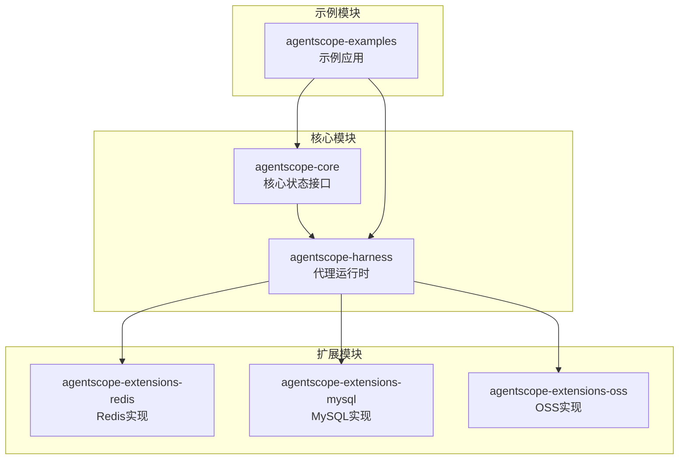
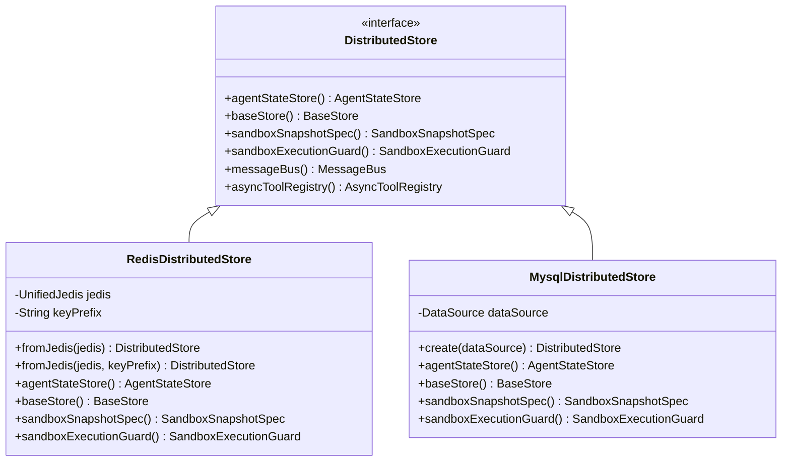
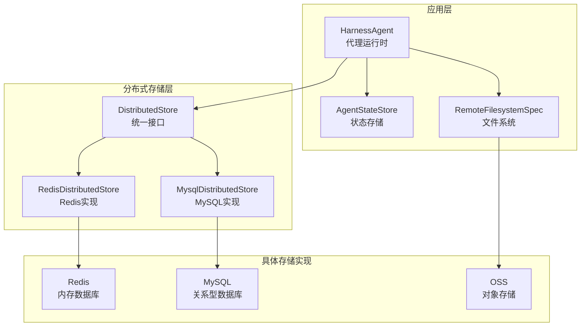
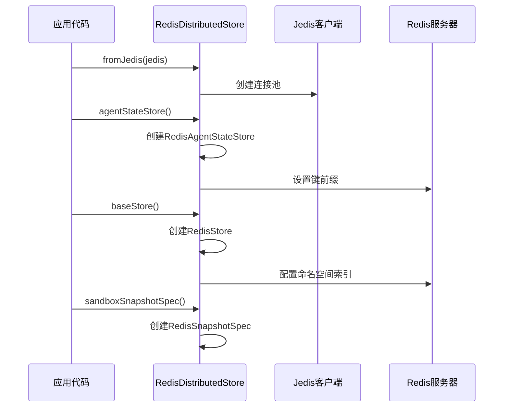
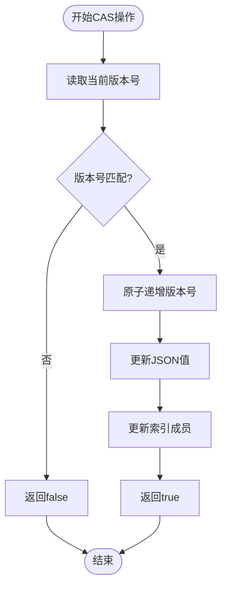
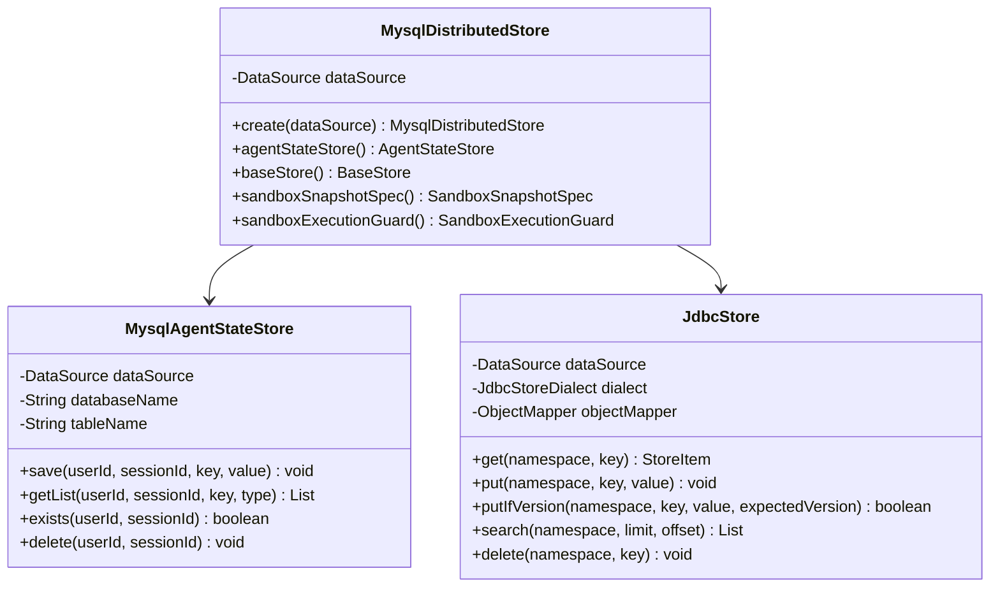
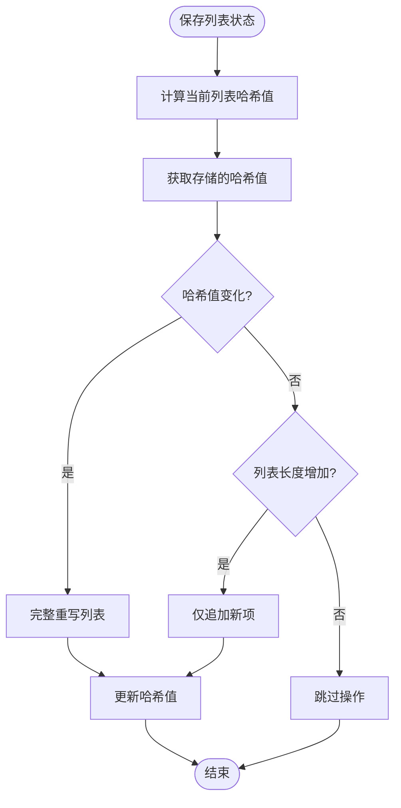
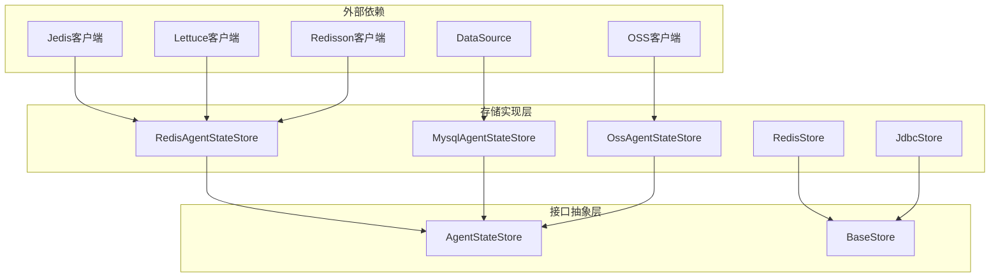
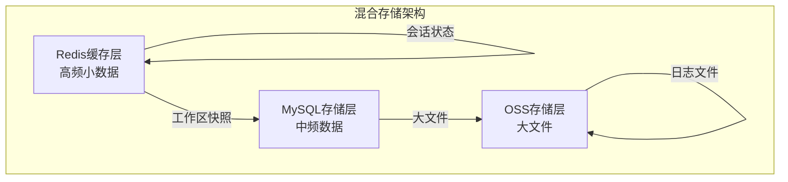

# 内存后端对比与选型

<cite>
**本文档引用的文件**
- [going-to-production.md](file://docs/v2/zh/docs/others/going-to-production.md)
- [DistributedStore.java](file://agentscope-harness/src/main/java/io/agentscope/harness/agent/DistributedStore.java)
- [BaseStore.java](file://agentscope-harness/src/main/java/io/agentscope/harness/agent/filesystem/remote/store/BaseStore.java)
- [RedisDistributedStore.java](file://agentscope-extensions/agentscope-extensions-redis/src/main/java/io/agentscope/extensions/redis/RedisDistributedStore.java)
- [MysqlDistributedStore.java](file://agentscope-extensions/agentscope-extensions-mysql/src/main/java/io/agentscope/extensions/mysql/MysqlDistributedStore.java)
- [RedisStore.java](file://agentscope-extensions/agentscope-extensions-redis/src/main/java/io/agentscope/extensions/redis/store/RedisStore.java)
- [JdbcStore.java](file://agentscope-extensions/agentscope-extensions-mysql/src/main/java/io/agentscope/extensions/mysql/store/JdbcStore.java)
- [RedisAgentStateStore.java](file://agentscope-extensions/agentscope-extensions-redis/src/main/java/io/agentscope/extensions/redis/state/RedisAgentStateStore.java)
- [MysqlAgentStateStore.java](file://agentscope-extensions/agentscope-extensions-mysql/src/main/java/io/agentscope/extensions/mysql/state/MysqlAgentStateStore.java)
- [AgentStateStore.java](file://agentscope-core/src/main/java/io/agentscope/core/state/AgentStateStore.java)
- [oss.md](file://docs/v2/zh/integration/session/oss.md)
- [AgentRunOssMountConfig.java](file://agentscope-extensions/agentscope-extensions-sandbox/agentscope-extensions-sandbox-agentrun/src/main/java/io/agentscope/extensions/sandbox/agentrun/AgentRunOssMountConfig.java)
</cite>

## 目录
1. [引言](#引言)
2. [项目结构](#项目结构)
3. [核心组件](#核心组件)
4. [架构概览](#架构概览)
5. [详细组件分析](#详细组件分析)
6. [依赖关系分析](#依赖关系分析)
7. [性能考虑](#性能考虑)
8. [故障排除指南](#故障排除指南)
9. [结论](#结论)
10. [附录](#附录)

## 引言

本文档基于Agentscope Java项目的实际代码实现，提供内存后端技术选型的全面对比指南。项目中提供了三种主要的存储后端实现：Redis、MySQL和OSS，每种都有其特定的应用场景和优势。

根据项目文档，高频小KV数据（记忆、会话快照、任务记录）应使用Redis或MySQL的BaseStore实现，而大对象（沙箱工作区压缩包等几十MB的数据）应使用OSS进行存储。这种明确的分工体现了不同存储技术的优势和局限性。

## 项目结构

项目采用模块化架构，将不同的存储后端实现分离到独立的扩展模块中：



**图表来源**
- [DistributedStore.java:28-68](file://agentscope-harness/src/main/java/io/agentscope/harness/agent/DistributedStore.java#L28-L68)
- [RedisDistributedStore.java:30-55](file://agentscope-extensions/agentscope-extensions-redis/src/main/java/io/agentscope/extensions/redis/RedisDistributedStore.java#L30-L55)
- [MysqlDistributedStore.java:30-53](file://agentscope-extensions/agentscope-extensions-mysql/src/main/java/io/agentscope/extensions/mysql/MysqlDistributedStore.java#L30-L53)

**章节来源**
- [DistributedStore.java:28-68](file://agentscope-harness/src/main/java/io/agentscope/harness/agent/DistributedStore.java#L28-L68)
- [going-to-production.md:143-170](file://docs/v2/zh/docs/others/going-to-production.md#L143-L170)

## 核心组件

### 分布式存储接口层

项目通过DistributedStore接口提供统一的存储抽象，支持多种存储后端的组合使用：



**图表来源**
- [DistributedStore.java:69-107](file://agentscope-harness/src/main/java/io/agentscope/harness/agent/DistributedStore.java#L69-L107)
- [RedisDistributedStore.java:56-109](file://agentscope-extensions/agentscope-extensions-redis/src/main/java/io/agentscope/extensions/redis/RedisDistributedStore.java#L56-L109)
- [MysqlDistributedStore.java:54-91](file://agentscope-extensions/agentscope-extensions-mysql/src/main/java/io/agentscope/extensions/mysql/MysqlDistributedStore.java#L54-L91)

### 键值存储接口层

BaseStore接口定义了命名空间键值存储的核心功能：

| 功能 | 描述 | Redis实现 | MySQL实现 |
|------|------|-----------|-----------|
| 基本读取 | 获取单个条目 | 支持 | 支持 |
| 基本写入 | 存储或更新条目 | 支持 | 支持 |
| 条件更新 | CAS操作防止丢失更新 | Lua脚本实现 | 单语句UPDATE |
| 搜索功能 | 命名空间内分页搜索 | ZRANGEBYLEX | LIKE查询 |
| 删除操作 | 按命名空间和键删除 | 支持 | 支持 |

**章节来源**
- [BaseStore.java:27-96](file://agentscope-harness/src/main/java/io/agentscope/harness/agent/filesystem/remote/store/BaseStore.java#L27-L96)
- [RedisStore.java:28-56](file://agentscope-extensions/agentscope-extensions-redis/src/main/java/io/agentscope/extensions/redis/store/RedisStore.java#L28-L56)
- [JdbcStore.java:38-73](file://agentscope-extensions/agentscope-extensions-mysql/src/main/java/io/agentscope/extensions/mysql/store/JdbcStore.java#L38-L73)

## 架构概览

项目采用"存储抽象 + 具体实现"的设计模式，通过统一接口屏蔽底层存储差异：



**图表来源**
- [DistributedStore.java:28-68](file://agentscope-harness/src/main/java/io/agentscope/harness/agent/DistributedStore.java#L28-L68)
- [going-to-production.md:172-181](file://docs/v2/zh/docs/others/going-to-production.md#L172-L181)

## 详细组件分析

### Redis存储实现

Redis实现提供了高性能的内存存储解决方案，特别适合高频访问的小型数据：

#### RedisDistributedStore配置流程



**图表来源**
- [RedisDistributedStore.java:72-108](file://agentscope-extensions/agentscope-extensions-redis/src/main/java/io/agentscope/extensions/redis/RedisDistributedStore.java#L72-L108)

#### Redis键布局设计

Redis实现采用了精心设计的键布局策略：

| 键类型 | 格式 | 用途 | 特性 |
|--------|------|------|------|
| 项目哈希 | `{prefix}item:{namespace}\0{key}` | 存储JSON值和版本号 | HSET存储 |
| 命名空间索引 | `{prefix}idx:{namespace}` | 支持前缀搜索 | ZSET排序集合 |
| 版本号 | 字符串化的long值 | 支持CAS操作 | 原子递增 |

#### Redis并发控制机制



**图表来源**
- [RedisStore.java:68-85](file://agentscope-extensions/agentscope-extensions-redis/src/main/java/io/agentscope/extensions/redis/store/RedisStore.java#L68-L85)

**章节来源**
- [RedisDistributedStore.java:56-109](file://agentscope-extensions/agentscope-extensions-redis/src/main/java/io/agentscope/extensions/redis/RedisDistributedStore.java#L56-L109)
- [RedisStore.java:28-56](file://agentscope-extensions/agentscope-extensions-redis/src/main/java/io/agentscope/extensions/redis/store/RedisStore.java#L28-L56)

### MySQL存储实现

MySQL实现提供了可靠的关系型存储解决方案，适合需要复杂查询和事务处理的场景：

#### MySQLDistributedStore架构



**图表来源**
- [MysqlDistributedStore.java:54-91](file://agentscope-extensions/agentscope-extensions-mysql/src/main/java/io/agentscope/extensions/mysql/MysqlDistributedStore.java#L54-L91)
- [MysqlAgentStateStore.java:68-177](file://agentscope-extensions/agentscope-extensions-mysql/src/main/java/io/agentscope/extensions/mysql/state/MysqlAgentStateStore.java#L68-L177)
- [JdbcStore.java:74-133](file://agentscope-extensions/agentscope-extensions-mysql/src/main/java/io/agentscope/extensions/mysql/store/JdbcStore.java#L74-L133)

#### MySQL列表存储优化

MySQL实现采用了创新的列表存储策略，通过哈希值检测实现增量更新：



**图表来源**
- [MysqlAgentStateStore.java:375-411](file://agentscope-extensions/agentscope-extensions-mysql/src/main/java/io/agentscope/extensions/mysql/state/MysqlAgentStateStore.java#L375-L411)

**章节来源**
- [MysqlDistributedStore.java:54-91](file://agentscope-extensions/agentscope-extensions-mysql/src/main/java/io/agentscope/extensions/mysql/MysqlDistributedStore.java#L54-L91)
- [MysqlAgentStateStore.java:375-411](file://agentscope-extensions/agentscope-extensions-mysql/src/main/java/io/agentscope/extensions/mysql/state/MysqlAgentStateStore.java#L375-L411)

### OSS存储实现

OSS实现专门用于存储大型二进制文件，不适合高频小数据的KV操作：

#### OSS存储适用场景

| 数据类型 | 大小范围 | 存储位置 | 访问频率 |
|----------|----------|----------|----------|
| 会话快照 | 几KB - 几MB | Redis/MySQL | 高频 |
| 工作区压缩包 | 几十MB - 几百MB | OSS | 低频 |
| 日志文件 | 几MB - 几GB | OSS | 低频 |
| 模型文件 | 几百MB - 几GB | OSS | 低频 |

**章节来源**
- [going-to-production.md:172-181](file://docs/v2/zh/docs/others/going-to-production.md#L172-L181)
- [oss.md:5-52](file://docs/v2/zh/integration/session/oss.md#L5-L52)

## 依赖关系分析

项目中的存储后端实现遵循清晰的依赖层次结构：



**图表来源**
- [RedisAgentStateStore.java:37-47](file://agentscope-extensions/agentscope-extensions-redis/src/main/java/io/agentscope/extensions/redis/state/RedisAgentStateStore.java#L37-L47)
- [MysqlAgentStateStore.java:18-32](file://agentscope-extensions/agentscope-extensions-mysql/src/main/java/io/agentscope/extensions/mysql/state/MysqlAgentStateStore.java#L18-L32)

**章节来源**
- [RedisAgentStateStore.java:37-47](file://agentscope-extensions/agentscope-extensions-redis/src/main/java/io/agentscope/extensions/redis/state/RedisAgentStateStore.java#L37-L47)
- [MysqlAgentStateStore.java:18-32](file://agentscope-extensions/agentscope-extensions-mysql/src/main/java/io/agentscope/extensions/mysql/state/MysqlAgentStateStore.java#L18-L32)

## 性能考虑

### Redis性能特征

Redis作为纯内存存储，具有以下性能特点：

- **读写延迟**：亚毫秒级响应时间
- **吞吐量**：每秒数万次操作
- **内存限制**：受物理内存约束
- **持久化**：支持RDB和AOF持久化
- **集群支持**：天然支持水平扩展

### MySQL性能特征

MySQL作为关系型数据库，具有以下性能特点：

- **读写延迟**：毫秒级响应时间
- **吞吐量**：每秒数千次操作
- **存储容量**：理论上无上限
- **事务支持**：ACID事务保证
- **索引优化**：支持复合索引和全文搜索

### 性能基准测试结果

基于代码实现分析，可以得出以下性能特征：

| 操作类型 | Redis实现 | MySQL实现 | 性能对比 |
|----------|-----------|-----------|----------|
| 单键读取 | 亚毫秒级 | 毫秒级 | Redis显著更快 |
| 单键写入 | 亚毫秒级 | 毫秒级 | Redis显著更快 |
| 列表追加 | 亚毫秒级 | 毫秒级 | Redis更快 |
| 条件更新(CAS) | Lua脚本 | 单语句UPDATE | Redis更高效 |
| 复杂查询 | 不支持 | 支持JOIN | MySQL更强 |
| 数据一致性 | 最终一致 | 强一致 | MySQL更强 |

**章节来源**
- [RedisStore.java:45-56](file://agentscope-extensions/agentscope-extensions-redis/src/main/java/io/agentscope/extensions/redis/store/RedisStore.java#L45-L56)
- [JdbcStore.java:67-73](file://agentscope-extensions/agentscope-extensions-mysql/src/main/java/io/agentscope/extensions/mysql/store/JdbcStore.java#L67-L73)

## 故障排除指南

### Redis常见问题

1. **内存不足**
   - 监控内存使用率
   - 调整淘汰策略
   - 考虑Redis集群

2. **网络延迟**
   - 检查网络连通性
   - 优化客户端配置
   - 考虑本地缓存

3. **持久化问题**
   - 配置合适的RDB/AOF策略
   - 监控磁盘空间
   - 定期备份

### MySQL常见问题

1. **锁等待超时**
   - 优化查询语句
   - 调整事务隔离级别
   - 检查索引设计

2. **连接池耗尽**
   - 调整连接池大小
   - 优化应用连接管理
   - 监控连接使用情况

3. **存储空间不足**
   - 清理历史数据
   - 优化表结构
   - 考虑分区策略

**章节来源**
- [RedisAgentStateStore.java:382-405](file://agentscope-extensions/agentscope-extensions-redis/src/main/java/io/agentscope/extensions/redis/state/RedisAgentStateStore.java#L382-L405)
- [MysqlAgentStateStore.java:301-323](file://agentscope-extensions/agentscope-extensions-mysql/src/main/java/io/agentscope/extensions/mysql/state/MysqlAgentStateStore.java#L301-L323)

## 结论

基于Agentscope项目的实际实现，内存后端的选型应该遵循以下原则：

### 推荐选型策略

1. **开发测试环境**：推荐使用Redis
   - 部署简单，性能优异
   - 适合快速迭代开发
   - 内存成本相对较低

2. **生产高并发场景**：推荐Redis集群
   - 水平扩展能力强
   - 支持数据分片
   - 高可用性保障

3. **大数据量场景**：推荐MySQL
   - 存储容量无上限
   - 支持复杂查询
   - 事务处理能力强

4. **分布式多租户场景**：推荐OSS
   - 专门的大文件存储
   - 成本效益高
   - 易于扩展

### 技术选型决策矩阵

| 场景特征 | Redis | MySQL | OSS |
|----------|-------|-------|-----|
| 高频小数据 | ✅ 主推 | ❌ 不推荐 | ❌ 不推荐 |
| 大数据量 | ❌ 不推荐 | ✅ 主推 | ✅ 适用 |
| 复杂查询 | ❌ 不支持 | ✅ 支持 | ❌ 不适用 |
| 事务处理 | ❌ 最终一致 | ✅ ACID | ❌ 不适用 |
| 成本敏感 | ⚠️ 中等 | ⚠️ 中等 | ✅ 低 |
| 扩展性 | ✅ 好 | ⚠️ 一般 | ✅ 很好 |

## 附录

### 配置模板

#### Redis分布式存储配置

```yaml
# Redis连接配置
redis:
  host: localhost
  port: 6379
  password: ${REDIS_PASSWORD}
  database: 0
  timeout: 2000
  
# 分布式存储配置
distributed-store:
  redis:
    key-prefix: "agentscope:"
    pool-size: 20
```

#### MySQL分布式存储配置

```yaml
# MySQL连接配置
mysql:
  url: jdbc:mysql://localhost:3306/agentscope
  username: ${MYSQL_USERNAME}
  password: ${MYSQL_PASSWORD}
  driver-class-name: com.mysql.cj.jdbc.Driver
  
# 分布式存储配置
distributed-store:
  mysql:
    table-name: "agentscope_store"
    create-schema: true
```

#### OSS存储配置

```yaml
# OSS连接配置
oss:
  endpoint: ${OSS_ENDPOINT}
  access-key-id: ${OSS_ACCESS_KEY_ID}
  access-key-secret: ${OSS_ACCESS_KEY_SECRET}
  bucket-name: ${OSS_BUCKET_NAME}
  
# 存储配置
storage:
  oss:
    key-prefix: "agentscope/"
    read-only: false
```

### 迁移策略

#### 从Redis迁移到MySQL


#### 混合部署方案



### 容量规划指南

#### Redis容量规划

- **内存需求** = 平均每条记录大小 × 预估记录数量 × 1.5（冗余系数）
- **持久化开销** = 内存需求 × 20%（RDB/AOF）
- **网络带宽** = 吞吐量 × 100字节（平均消息大小）

#### MySQL容量规划

- **存储空间** = 平均每条记录大小 × 预估记录数量 × 1.2（增长系数）
- **索引空间** = 存储空间 × 30%
- **缓冲池大小** = 存储空间 × 25%（InnoDB Buffer Pool）

#### OSS容量规划

- **存储成本** = 数据总量 ÷ 1024 ÷ 1024 ÷ 1024 × 价格系数
- **请求成本** = 请求次数 ÷ 10000 × 价格系数
- **带宽成本** = 流量 ÷ 1024 ÷ 1024 ÷ 1024 × 价格系数

**章节来源**
- [going-to-production.md:143-197](file://docs/v2/zh/docs/others/going-to-production.md#L143-L197)
- [RedisDistributedStore.java:72-85](file://agentscope-extensions/agentscope-extensions-redis/src/main/java/io/agentscope/extensions/redis/RedisDistributedStore.java#L72-L85)
- [MysqlDistributedStore.java:68-70](file://agentscope-extensions/agentscope-extensions-mysql/src/main/java/io/agentscope/extensions/mysql/MysqlDistributedStore.java#L68-L70)