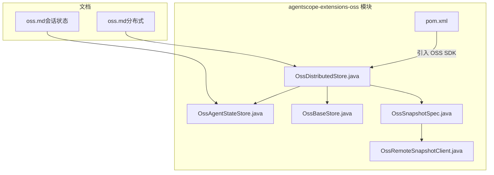
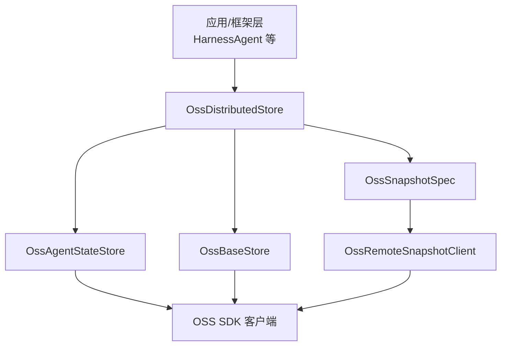
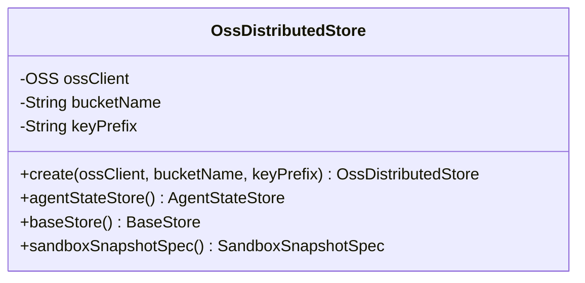
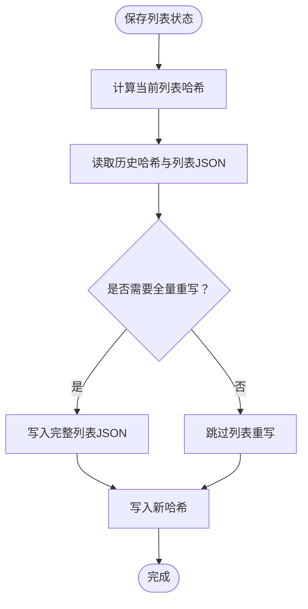
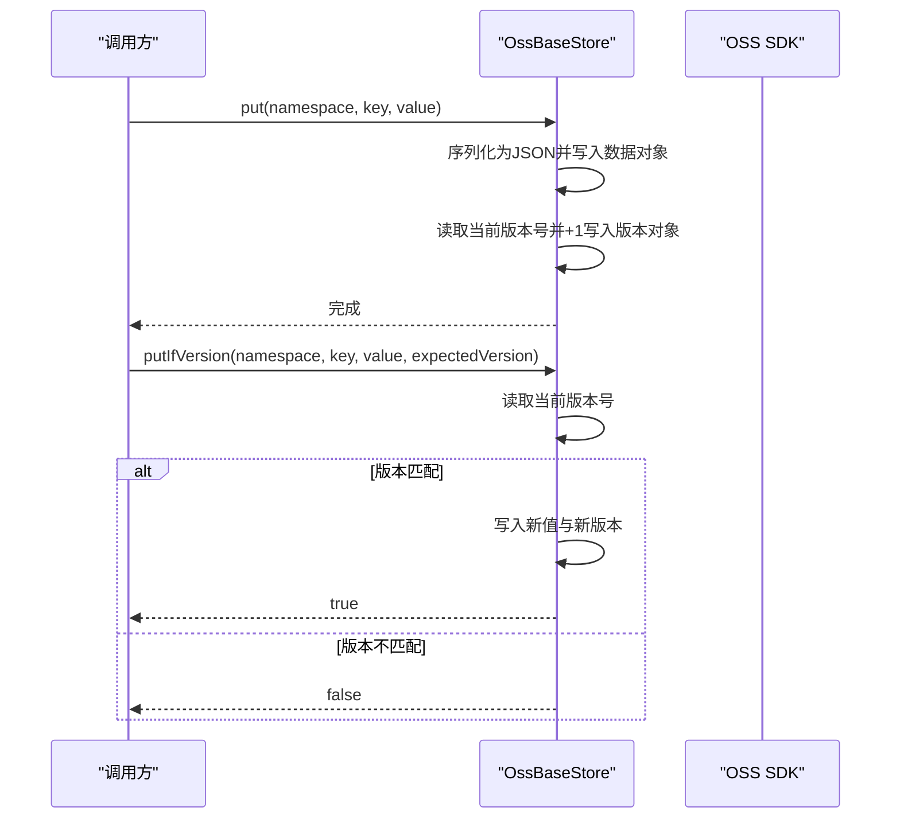
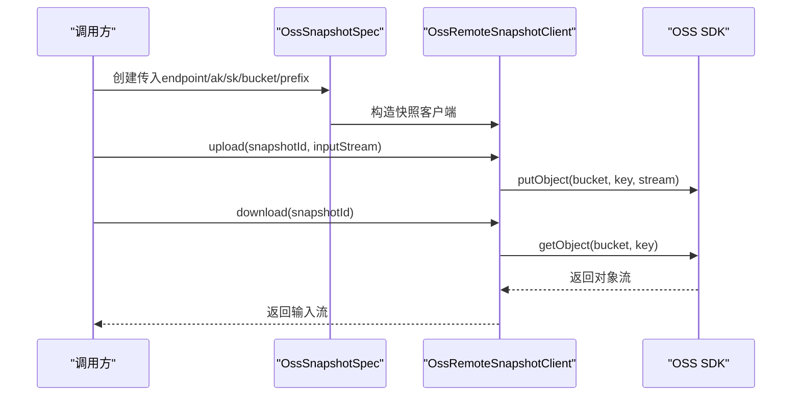
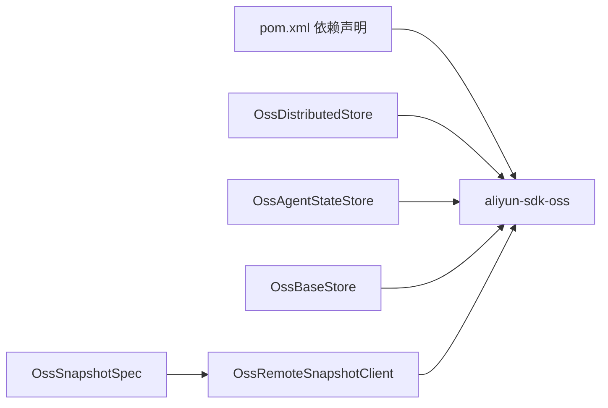

# 对象存储分布式存储

<cite>
**本文引用的文件**   
- [OssDistributedStore.java](file://agentscope-extensions/agentscope-extensions-oss/src/main/java/io/agentscope/extensions/oss/OssDistributedStore.java)
- [OssAgentStateStore.java](file://agentscope-extensions/agentscope-extensions-oss/src/main/java/io/agentscope/extensions/oss/OssAgentStateStore.java)
- [OssBaseStore.java](file://agentscope-extensions/agentscope-extensions-oss/src/main/java/io/agentscope/extensions/oss/OssBaseStore.java)
- [OssRemoteSnapshotClient.java](file://agentscope-extensions/agentscope-extensions-oss/src/main/java/io/agentscope/extensions/oss/OssRemoteSnapshotClient.java)
- [OssSnapshotSpec.java](file://agentscope-extensions/agentscope-extensions-oss/src/main/java/io/agentscope/extensions/oss/OssSnapshotSpec.java)
- [pom.xml](file://agentscope-extensions/agentscope-extensions-oss/pom.xml)
- [oss.md（分布式）](file://docs/v2/zh/integration/distributed/oss.md)
- [oss.md（会话状态）](file://docs/v2/zh/integration/session/oss.md)
- [OssAgentStateStoreTest.java](file://agentscope-extensions/agentscope-extensions-oss/src/test/java/io/agentscope/extensions/oss/OssAgentStateStoreTest.java)
</cite>

## 目录
1. [简介](#简介)
2. [项目结构](#项目结构)
3. [核心组件](#核心组件)
4. [架构总览](#架构总览)
5. [详细组件分析](#详细组件分析)
6. [依赖分析](#依赖分析)
7. [性能考虑](#性能考虑)
8. [故障排查指南](#故障排查指南)
9. [结论](#结论)
10. [附录](#附录)

## 简介
本文件面向对象存储分布式存储组件的技术文档，聚焦于基于阿里云 OSS 的分布式能力在 AgentScope 中的应用与集成。内容涵盖：
- OSS SDK 配置与客户端初始化
- Bucket 管理与命名规范
- 访问权限控制与安全建议
- 状态存储策略（OssAgentStateStore）
- 远程快照管理（OssRemoteSnapshotClient、OssSnapshotSpec）
- 分布式文件系统集成（OssBaseStore）
- 云存储配置示例与最佳实践（含阿里云 OSS、AWS S3 的对接思路）
- 数据加密、跨区域复制、成本优化与云原生部署建议

## 项目结构
该模块位于 agentscope-extensions 子工程下，核心类围绕 OSS 实现了分布式存储、状态存储、快照与远程文件系统基座能力。

图表来源
- [OssDistributedStore.java:1-86](file://agentscope-extensions/agentscope-extensions-oss/src/main/java/io/agentscope/extensions/oss/OssDistributedStore.java#L1-L86)
- [OssAgentStateStore.java:1-350](file://agentscope-extensions/agentscope-extensions-oss/src/main/java/io/agentscope/extensions/oss/OssAgentStateStore.java#L1-L350)
- [OssBaseStore.java:1-298](file://agentscope-extensions/agentscope-extensions-oss/src/main/java/io/agentscope/extensions/oss/OssBaseStore.java#L1-L298)
- [OssRemoteSnapshotClient.java:1-91](file://agentscope-extensions/agentscope-extensions-oss/src/main/java/io/agentscope/extensions/oss/OssRemoteSnapshotClient.java#L1-L91)
- [OssSnapshotSpec.java:1-60](file://agentscope-extensions/agentscope-extensions-oss/src/main/java/io/agentscope/extensions/oss/OssSnapshotSpec.java#L1-L60)
- [pom.xml:48-53](file://agentscope-extensions/agentscope-extensions-oss/pom.xml#L48-L53)
- [oss.md（分布式）:1-105](file://docs/v2/zh/integration/distributed/oss.md#L1-L105)
- [oss.md（会话状态）:1-66](file://docs/v2/zh/integration/session/oss.md#L1-L66)

章节来源
- [pom.xml:1-56](file://agentscope-extensions/agentscope-extensions-oss/pom.xml#L1-L56)
- [oss.md（分布式）:1-105](file://docs/v2/zh/integration/distributed/oss.md#L1-L105)
- [oss.md（会话状态）:1-66](file://docs/v2/zh/integration/session/oss.md#L1-L66)

## 核心组件
- OssDistributedStore：统一的分布式存储入口，组合状态存储、基础存储与快照规范。
- OssAgentStateStore：将 Agent 状态以 JSON 形式持久化到 OSS，支持单值、列表与增量哈希校验。
- OssBaseStore：为远程文件系统提供键值存储，支持版本号递增与分页检索。
- OssRemoteSnapshotClient：对快照进行上传、下载与存在性检查。
- OssSnapshotSpec：快照存储的便捷规格，支持直接传入 OSS 客户端或凭凭据创建。

章节来源
- [OssDistributedStore.java:25-86](file://agentscope-extensions/agentscope-extensions-oss/src/main/java/io/agentscope/extensions/oss/OssDistributedStore.java#L25-L86)
- [OssAgentStateStore.java:39-350](file://agentscope-extensions/agentscope-extensions-oss/src/main/java/io/agentscope/extensions/oss/OssAgentStateStore.java#L39-L350)
- [OssBaseStore.java:36-298](file://agentscope-extensions/agentscope-extensions-oss/src/main/java/io/agentscope/extensions/oss/OssBaseStore.java#L36-L298)
- [OssRemoteSnapshotClient.java:25-91](file://agentscope-extensions/agentscope-extensions-oss/src/main/java/io/agentscope/extensions/oss/OssRemoteSnapshotClient.java#L25-L91)
- [OssSnapshotSpec.java:23-60](file://agentscope-extensions/agentscope-extensions-oss/src/main/java/io/agentscope/extensions/oss/OssSnapshotSpec.java#L23-L60)

## 架构总览
下图展示分布式存储在 AgentScope 中的装配与调用关系：

图表来源
- [OssDistributedStore.java:63-84](file://agentscope-extensions/agentscope-extensions-oss/src/main/java/io/agentscope/extensions/oss/OssDistributedStore.java#L63-L84)
- [OssAgentStateStore.java:91-132](file://agentscope-extensions/agentscope-extensions-oss/src/main/java/io/agentscope/extensions/oss/OssAgentStateStore.java#L91-L132)
- [OssBaseStore.java:85-134](file://agentscope-extensions/agentscope-extensions-oss/src/main/java/io/agentscope/extensions/oss/OssBaseStore.java#L85-L134)
- [OssRemoteSnapshotClient.java:50-68](file://agentscope-extensions/agentscope-extensions-oss/src/main/java/io/agentscope/extensions/oss/OssRemoteSnapshotClient.java#L50-L68)
- [OssSnapshotSpec.java:35-58](file://agentscope-extensions/agentscope-extensions-oss/src/main/java/io/agentscope/extensions/oss/OssSnapshotSpec.java#L35-L58)

## 详细组件分析

### OssDistributedStore：分布式存储聚合器
- 职责：提供统一的分布式存储入口，按需返回状态存储、基础存储与快照规范。
- 关键点：
  - 使用 OSS 客户端、Bucket 名称与 key 前缀进行实例化。
  - 将 key 前缀分别派发给状态存储、基础存储与快照规范，形成清晰的命名空间隔离。
- 典型用法：通过工厂方法创建，注入到 HarnessAgent 构建器中。

图表来源
- [OssDistributedStore.java:39-85](file://agentscope-extensions/agentscope-extensions-oss/src/main/java/io/agentscope/extensions/oss/OssDistributedStore.java#L39-L85)

章节来源
- [OssDistributedStore.java:25-86](file://agentscope-extensions/agentscope-extensions-oss/src/main/java/io/agentscope/extensions/oss/OssDistributedStore.java#L25-L86)
- [oss.md（分布式）:15-29](file://docs/v2/zh/integration/distributed/oss.md#L15-L29)

### OssAgentStateStore：状态存储策略
- 数据模型与键布局：
  - 单值状态：{keyPrefix}{userId}/{sessionId}/{stateKey}.json
  - 列表状态：{keyPrefix}{userId}/{sessionId}/{stateKey}.list.json
  - 列表哈希：{keyPrefix}{userId}/{sessionId}/{stateKey}.list.hash（用于增量写入与冲突检测）
- 行为特性：
  - 支持保存单值与列表；列表写入采用哈希与现有长度判断是否需要全量重写。
  - 会话存在性检查、删除、列出会话 ID 等操作均基于前缀扫描与对象存在性判断。
  - 匿名用户（userId 为空）以 __anon__ 代替，确保键空间一致性。
- 错误处理：所有 IO 异常封装为运行时异常，便于上层统一处理。

图表来源
- [OssAgentStateStore.java:103-132](file://agentscope-extensions/agentscope-extensions-oss/src/main/java/io/agentscope/extensions/oss/OssAgentStateStore.java#L103-L132)

章节来源
- [OssAgentStateStore.java:39-195](file://agentscope-extensions/agentscope-extensions-oss/src/main/java/io/agentscope/extensions/oss/OssAgentStateStore.java#L39-L195)
- [oss.md（会话状态）:42-52](file://docs/v2/zh/integration/session/oss.md#L42-L52)

### OssBaseStore：分布式文件系统基座
- 数据模型与键布局：
  - 数据对象：{keyPrefix}{namespace...}/{key}.json
  - 版本对象：{keyPrefix}{namespace...}/{key}.version
- 行为特性：
  - put/putIfVersion：写入 JSON 数据并递增版本号；条件写入基于期望版本号。
  - search：按命名空间前缀列举 JSON 对象，排除版本对象后分页返回。
  - delete：删除数据与版本对象。
- 错误处理：IO 异常统一包装为运行时异常。

图表来源
- [OssBaseStore.java:103-134](file://agentscope-extensions/agentscope-extensions-oss/src/main/java/io/agentscope/extensions/oss/OssBaseStore.java#L103-L134)

章节来源
- [OssBaseStore.java:36-198](file://agentscope-extensions/agentscope-extensions-oss/src/main/java/io/agentscope/extensions/oss/OssBaseStore.java#L36-L198)

### OssRemoteSnapshotClient 与 OssSnapshotSpec：远程快照管理
- OssRemoteSnapshotClient：
  - 上传：将快照流以 {keyPrefix}{snapshotId}.tar 写入 OSS。
  - 下载：若对象不存在抛出文件未找到异常。
  - 存在性检查：基于对象存在性判断。
- OssSnapshotSpec：
  - 支持直接传入已初始化的 OSS 客户端或凭据创建快照规范。
  - 作为 RemoteSnapshotSpec 的具体实现，适配沙箱快照流程。

图表来源
- [OssSnapshotSpec.java:35-58](file://agentscope-extensions/agentscope-extensions-oss/src/main/java/io/agentscope/extensions/oss/OssSnapshotSpec.java#L35-L58)
- [OssRemoteSnapshotClient.java:50-68](file://agentscope-extensions/agentscope-extensions-oss/src/main/java/io/agentscope/extensions/oss/OssRemoteSnapshotClient.java#L50-L68)

章节来源
- [OssRemoteSnapshotClient.java:25-91](file://agentscope-extensions/agentscope-extensions-oss/src/main/java/io/agentscope/extensions/oss/OssRemoteSnapshotClient.java#L25-L91)
- [OssSnapshotSpec.java:23-60](file://agentscope-extensions/agentscope-extensions-oss/src/main/java/io/agentscope/extensions/oss/OssSnapshotSpec.java#L23-L60)
- [oss.md（分布式）:61-75](file://docs/v2/zh/integration/distributed/oss.md#L61-L75)

## 依赖分析
- 外部依赖：阿里云 OSS SDK（aliyun-sdk-oss）。
- 模块内依赖：各组件均依赖 OSS SDK 客户端进行对象存取；OssDistributedStore 组合多个子存储；OssSnapshotSpec 组合 OssRemoteSnapshotClient。

图表来源
- [pom.xml:48-53](file://agentscope-extensions/agentscope-extensions-oss/pom.xml#L48-L53)
- [OssDistributedStore.java:18-22](file://agentscope-extensions/agentscope-extensions-oss/src/main/java/io/agentscope/extensions/oss/OssDistributedStore.java#L18-L22)
- [OssAgentStateStore.java:18-28](file://agentscope-extensions/agentscope-extensions-oss/src/main/java/io/agentscope/extensions/oss/OssAgentStateStore.java#L18-L28)
- [OssBaseStore.java:18-26](file://agentscope-extensions/agentscope-extensions-oss/src/main/java/io/agentscope/extensions/oss/OssBaseStore.java#L18-L26)
- [OssRemoteSnapshotClient.java:18-23](file://agentscope-extensions/agentscope-extensions-oss/src/main/java/io/agentscope/extensions/oss/OssRemoteSnapshotClient.java#L18-L23)
- [OssSnapshotSpec.java:18-21](file://agentscope-extensions/agentscope-extensions-oss/src/main/java/io/agentscope/extensions/oss/OssSnapshotSpec.java#L18-L21)

章节来源
- [pom.xml:33-53](file://agentscope-extensions/agentscope-extensions-oss/pom.xml#L33-L53)

## 性能考虑
- 列表写入的增量策略：通过哈希与现有长度判断减少全量重写，降低网络与存储开销。
- 分页列举：使用 ListObjectsV2 并设置每页大小上限，避免一次性拉取过多对象。
- 批量删除：按批（例如 1000 个）删除对象，提升大规模清理效率。
- 前缀规范化：统一斜杠处理与默认前缀，避免键冲突与查询性能波动。
- 快照存储优势：对象存储天然适合大体积二进制快照，上传/下载具备良好的吞吐与扩展性。

章节来源
- [OssAgentStateStore.java:120-132](file://agentscope-extensions/agentscope-extensions-oss/src/main/java/io/agentscope/extensions/oss/OssAgentStateStore.java#L120-L132)
- [OssAgentStateStore.java:283-308](file://agentscope-extensions/agentscope-extensions-oss/src/main/java/io/agentscope/extensions/oss/OssAgentStateStore.java#L283-L308)
- [OssBaseStore.java:137-184](file://agentscope-extensions/agentscope-extensions-oss/src/main/java/io/agentscope/extensions/oss/OssBaseStore.java#L137-L184)
- [OssBaseStore.java:302-308](file://agentscope-extensions/agentscope-extensions-oss/src/main/java/io/agentscope/extensions/oss/OssBaseStore.java#L302-L308)

## 故障排查指南
- 常见问题与定位：
  - 初始化失败：确认 OSS 客户端、Bucket 名称与 key 前缀非空；检查 endpoint、AK/SK 权限。
  - 读取异常：检查对象是否存在、键路径是否符合规范；关注 IO 异常并记录对象键。
  - 列表写入未生效：核对哈希计算与增量判断逻辑；确认旧列表与哈希是否一致。
  - 删除不彻底：确认批量删除批次与 Quiet 模式配置。
- 单元测试参考：
  - 测试覆盖了构建器参数校验、保存/获取、存在性检查、会话 ID 列举与关闭行为。

章节来源
- [OssAgentStateStoreTest.java:59-155](file://agentscope-extensions/agentscope-extensions-oss/src/test/java/io/agentscope/extensions/oss/OssAgentStateStoreTest.java#L59-L155)
- [OssAgentStateStore.java:91-132](file://agentscope-extensions/agentscope-extensions-oss/src/main/java/io/agentscope/extensions/oss/OssAgentStateStore.java#L91-L132)
- [OssBaseStore.java:186-198](file://agentscope-extensions/agentscope-extensions-oss/src/main/java/io/agentscope/extensions/oss/OssBaseStore.java#L186-L198)

## 结论
- 该 OSS 分布式存储模块以清晰的键空间设计与增量优化策略，满足 Agent 状态、远程文件系统与快照的大规模存储需求。
- 在阿里云生态中具备天然优势，结合文档提供的快速配置与安全建议，可快速落地生产级分布式存储方案。
- 对于需要并发控制的场景，建议与 Redis 等组件混合使用，以获得更全面的分布式能力。

## 附录

### 云存储配置示例与最佳实践
- 阿里云 OSS
  - 依赖与快速配置参见文档：[分布式 OSS 文档:5-29](file://docs/v2/zh/integration/distributed/oss.md#L5-L29)
  - 状态存储键布局与 Builder 参数参见文档：[会话状态 OSS 文档:42-65](file://docs/v2/zh/integration/session/oss.md#L42-L65)
  - 安全提示（RAM Role + STS、生命周期规则）参见文档：[分布式 OSS 安全提示:101-105](file://docs/v2/zh/integration/distributed/oss.md#L101-L105)
- AWS S3（对接思路）
  - 选择兼容 S3 API 的 OSS 兼容网关或直接使用 AWS SDK（非本模块内置依赖）。
  - 保持相同的键空间设计与前缀规范化策略，即可复用状态存储、基础存储与快照客户端的通用逻辑。
  - 建议启用服务端加密（SSE）、版本控制与生命周期规则，以满足合规与成本优化目标。
- 数据加密
  - 服务端加密（SSE-KMS/SSE-C）与传输加密（TLS）应开启。
  - 对敏感元数据与密钥，建议使用 KMS 密钥管理与最小权限原则。
- 跨区域复制
  - 启用多区域复制，保障高可用与就近访问。
  - 对快照与状态数据设定不同生命周期策略，平衡成本与恢复时间。
- 成本优化
  - 使用分层存储（标准/低频/归档）与智能分层。
  - 对快照设置短期生命周期（如 7 天），定期清理。
- 云原生部署最佳实践
  - 使用 Pod 中的环境变量或 Secret 注入 AK/SK，避免硬编码。
  - 通过 RBAC 限制对 OSS 的访问范围，优先使用 RAM Role + STS 临时凭证。
  - 在容器中复用 OSS 客户端连接池，减少握手开销。

章节来源
- [oss.md（分布式）:1-105](file://docs/v2/zh/integration/distributed/oss.md#L1-L105)
- [oss.md（会话状态）:1-66](file://docs/v2/zh/integration/session/oss.md#L1-L66)