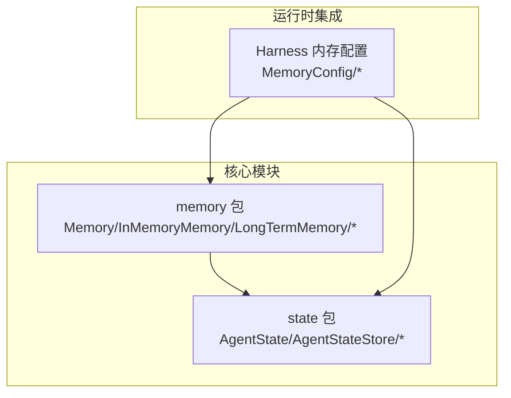
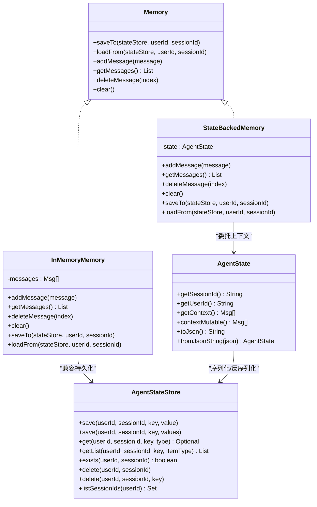
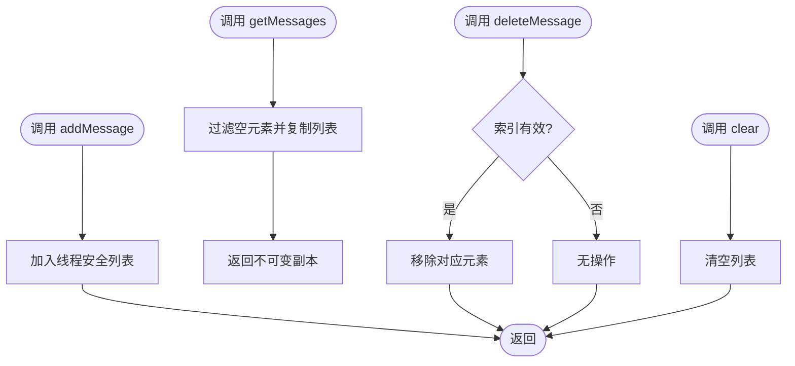
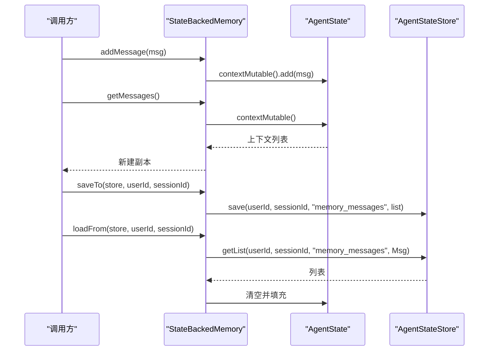
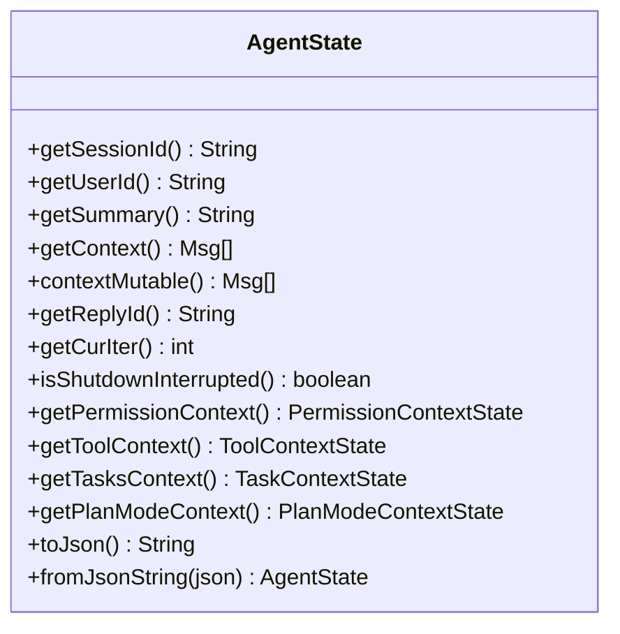
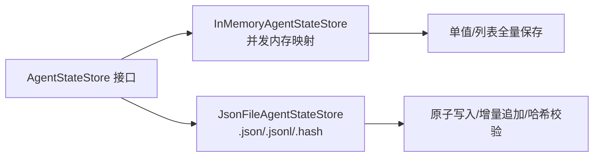
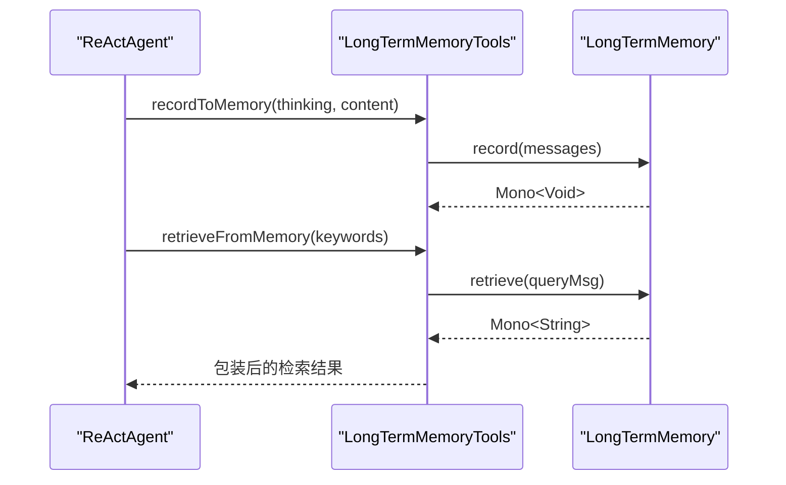
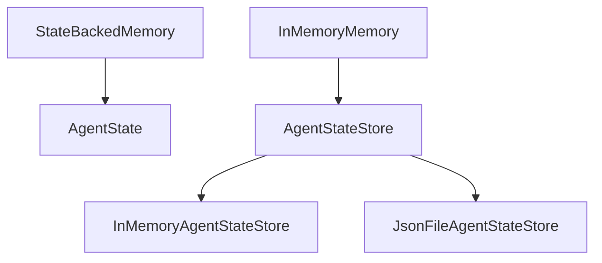

# 内存管理

<cite>
**本文引用的文件**
- [Memory.java](file://agentscope-core/src/main/java/io/agentscope/core/memory/Memory.java)
- [InMemoryMemory.java](file://agentscope-core/src/main/java/io/agentscope/core/memory/InMemoryMemory.java)
- [LongTermMemory.java](file://agentscope-core/src/main/java/io/agentscope/core/memory/LongTermMemory.java)
- [LongTermMemoryMode.java](file://agentscope-core/src/main/java/io/agentscope/core/memory/LongTermMemoryMode.java)
- [LongTermMemoryTools.java](file://agentscope-core/src/main/java/io/agentscope/core/memory/LongTermMemoryTools.java)
- [StateBackedMemory.java](file://agentscope-core/src/main/java/io/agentscope/core/memory/StateBackedMemory.java)
- [AgentState.java](file://agentscope-core/src/main/java/io/agentscope/core/state/AgentState.java)
- [AgentStateStore.java](file://agentscope-core/src/main/java/io/agentscope/core/state/AgentStateStore.java)
- [InMemoryAgentStateStore.java](file://agentscope-core/src/main/java/io/agentscope/core/state/InMemoryAgentStateStore.java)
- [JsonFileAgentStateStore.java](file://agentscope-core/src/main/java/io/agentscope/core/state/JsonFileAgentStateStore.java)
- [InMemoryMemoryTest.java](file://agentscope-core/src/test/java/io/agentscope/core/legacy/memory/InMemoryMemoryTest.java)
- [AgentStateTest.java](file://agentscope-core/src/test/java/io/agentscope/core/state/AgentStateTest.java)
- [MemoryConfigTest.java](file://agentscope-harness/src/test/java/io/agentscope/harness/agent/memory/MemoryConfigTest.java)
</cite>

## 目录
1. [简介](#简介)
2. [项目结构](#项目结构)
3. [核心组件](#核心组件)
4. [架构总览](#架构总览)
5. [详细组件分析](#详细组件分析)
6. [依赖分析](#依赖分析)
7. [性能考虑](#性能考虑)
8. [故障排除指南](#故障排除指南)
9. [结论](#结论)
10. [附录](#附录)

## 简介
本文件系统性阐述 AgentScope Java 的内存管理体系，覆盖短期对话记忆、状态持久化与长期记忆（已弃用）三大部分。重点包括：
- Memory 接口的设计理念与统一抽象
- InMemoryMemory 的内存存储实现
- StateBackedMemory 的状态后端机制
- AgentState 的数据结构与状态管理
- AgentStateStore 的存储策略与实现
- 长期记忆接口与工具适配（已弃用）
- 不同类型内存的适用场景、性能特征与最佳实践
- 内存清理策略、数据序列化、并发访问控制与性能优化
- 具体使用示例路径与故障排除建议

## 项目结构
围绕内存管理的核心代码位于 agentscope-core 模块的 memory 与 state 包中，并通过 harness 提供的内存配置与压缩能力在运行时进行整合。

图表来源
- [Memory.java:1-79](file://agentscope-core/src/main/java/io/agentscope/core/memory/Memory.java#L1-L79)
- [AgentState.java:1-424](file://agentscope-core/src/main/java/io/agentscope/core/state/AgentState.java#L1-L424)
- [AgentStateStore.java:1-167](file://agentscope-core/src/main/java/io/agentscope/core/state/AgentStateStore.java#L1-L167)
- [MemoryConfigTest.java:1-162](file://agentscope-harness/src/test/java/io/agentscope/harness/agent/memory/MemoryConfigTest.java#L1-L162)

章节来源
- [Memory.java:1-79](file://agentscope-core/src/main/java/io/agentscope/core/memory/Memory.java#L1-L79)
- [AgentState.java:1-424](file://agentscope-core/src/main/java/io/agentscope/core/state/AgentState.java#L1-L424)
- [AgentStateStore.java:1-167](file://agentscope-core/src/main/java/io/agentscope/core/state/AgentStateStore.java#L1-L167)
- [MemoryConfigTest.java:1-162](file://agentscope-harness/src/test/java/io/agentscope/harness/agent/memory/MemoryConfigTest.java#L1-L162)

## 核心组件
- Memory 接口：定义短期对话记忆的统一抽象，提供保存/加载、添加消息、获取消息列表、删除指定索引消息、清空等操作；同时保留对旧版本 v1 的兼容写入入口。
- InMemoryMemory 实现：基于线程安全集合的内存存储，支持消息列表的并发读写与持久化（通过 AgentStateStore）。
- StateBackedMemory 实现：将 Memory 调用委托给 AgentState 的上下文列表，作为 v1 到 v2 的兼容层。
- AgentState：承载每个智能体的运行时状态，包括会话标识、用户标识、上下文消息列表、摘要、权限/工具/任务/计划模式上下文等。
- AgentStateStore 接口及其实现：提供按 (userId, sessionId) 维度的键控持久化能力，支持单值与列表两类状态的保存/读取/删除/列举。
- 长期记忆相关（已弃用）：LongTermMemory 接口、LongTermMemoryMode 枚举、LongTermMemoryTools 工具适配器，用于框架或代理控制的记忆记录与检索。

章节来源
- [Memory.java:22-79](file://agentscope-core/src/main/java/io/agentscope/core/memory/Memory.java#L22-L79)
- [InMemoryMemory.java:26-135](file://agentscope-core/src/main/java/io/agentscope/core/memory/InMemoryMemory.java#L26-L135)
- [StateBackedMemory.java:24-80](file://agentscope-core/src/main/java/io/agentscope/core/memory/StateBackedMemory.java#L24-L80)
- [AgentState.java:31-424](file://agentscope-core/src/main/java/io/agentscope/core/state/AgentState.java#L31-L424)
- [AgentStateStore.java:22-167](file://agentscope-core/src/main/java/io/agentscope/core/state/AgentStateStore.java#L22-L167)
- [LongTermMemory.java:22-112](file://agentscope-core/src/main/java/io/agentscope/core/memory/LongTermMemory.java#L22-L112)
- [LongTermMemoryMode.java:18-71](file://agentscope-core/src/main/java/io/agentscope/core/memory/LongTermMemoryMode.java#L18-L71)
- [LongTermMemoryTools.java:27-216](file://agentscope-core/src/main/java/io/agentscope/core/memory/LongTermMemoryTools.java#L27-L216)

## 架构总览
下图展示了 v2 中短期记忆与状态持久化的统一架构：Memory 抽象被 StateBackedMemory 委托至 AgentState 的上下文列表；InMemoryMemory 作为兼容实现仍可直接使用；AgentStateStore 提供多后端持久化能力。

图表来源
- [Memory.java:35-79](file://agentscope-core/src/main/java/io/agentscope/core/memory/Memory.java#L35-L79)
- [StateBackedMemory.java:36-80](file://agentscope-core/src/main/java/io/agentscope/core/memory/StateBackedMemory.java#L36-L80)
- [InMemoryMemory.java:37-135](file://agentscope-core/src/main/java/io/agentscope/core/memory/InMemoryMemory.java#L37-L135)
- [AgentState.java:59-424](file://agentscope-core/src/main/java/io/agentscope/core/state/AgentState.java#L59-L424)
- [AgentStateStore.java:61-167](file://agentscope-core/src/main/java/io/agentscope/core/state/AgentStateStore.java#L61-L167)

## 详细组件分析

### Memory 接口与 InMemoryMemory 实现
- 设计理念
  - 统一短期对话记忆的增删查改与持久化入口，兼容 v1 的“保存/加载”语义。
  - 通过 saveTo/loadFrom 将消息缓冲区写入/读取到 AgentStateStore，便于会话间恢复。
- InMemoryMemory 特性
  - 使用线程安全的并发列表以支持高并发读写。
  - getMessages 返回非空过滤后的消息副本，避免外部修改影响内部状态。
  - deleteMessage 对越界索引采用无操作策略，提升安全性。
  - clear 清空消息列表，配合持久化确保状态一致性。

图表来源
- [InMemoryMemory.java:85-133](file://agentscope-core/src/main/java/io/agentscope/core/memory/InMemoryMemory.java#L85-L133)

章节来源
- [Memory.java:22-79](file://agentscope-core/src/main/java/io/agentscope/core/memory/Memory.java#L22-L79)
- [InMemoryMemory.java:26-135](file://agentscope-core/src/main/java/io/agentscope/core/memory/InMemoryMemory.java#L26-L135)
- [InMemoryMemoryTest.java:38-177](file://agentscope-core/src/test/java/io/agentscope/core/legacy/memory/InMemoryMemoryTest.java#L38-L177)

### StateBackedMemory 的状态后端机制
- 作用
  - 将 Memory 的所有操作委托给 AgentState.contextMutable()，实现 v1 代码对 v2 的无缝兼容。
  - 同时提供 saveTo/loadFrom，将上下文写入/读取到 AgentStateStore。
- 适用场景
  - 从 v1 升级到 v2 的过渡阶段，快速替换现有调用点而无需重构业务逻辑。

图表来源
- [StateBackedMemory.java:44-78](file://agentscope-core/src/main/java/io/agentscope/core/memory/StateBackedMemory.java#L44-L78)
- [AgentStateStore.java:73-117](file://agentscope-core/src/main/java/io/agentscope/core/state/AgentStateStore.java#L73-L117)

章节来源
- [StateBackedMemory.java:24-80](file://agentscope-core/src/main/java/io/agentscope/core/memory/StateBackedMemory.java#L24-L80)

### AgentState 数据结构与状态管理
- 关键字段
  - 会话标识、用户标识、摘要、上下文消息列表、回复标识、当前推理迭代次数、是否由关机中断、权限/工具/任务/计划模式上下文。
- 并发与可见性
  - 上下文列表通过 contextMutable() 暴露可变句柄，适合框架内部高效追加/替换；通过 getContext() 返回防御性副本，防止外部修改。
  - 中断控制对象为运行时专用，不参与序列化。
- 序列化
  - 支持 JSON 序列化/反序列化，便于落盘或网络传输。
- 测试要点
  - 默认值校验、setter 行为、上下文不可变副本保护、构建器辅助方法、JSON 往返一致性。

图表来源
- [AgentState.java:59-424](file://agentscope-core/src/main/java/io/agentscope/core/state/AgentState.java#L59-L424)

章节来源
- [AgentState.java:31-424](file://agentscope-core/src/main/java/io/agentscope/core/state/AgentState.java#L31-L424)
- [AgentStateTest.java:35-168](file://agentscope-core/src/test/java/io/agentscope/core/state/AgentStateTest.java#L35-L168)

### AgentStateStore 存储策略与实现
- 接口职责
  - 提供按 (userId, sessionId, key) 的键控持久化，支持单值与列表两类状态。
  - 支持存在性检查、删除整会话/单键、枚举会话 ID、关闭资源等。
- InMemoryAgentStateStore
  - 基于并发映射的内存实现，适合单进程应用；匿名用户归入特定命名空间，避免冲突。
  - 列表状态采用全量替换策略，适合小规模/低频更新场景。
- JsonFileAgentStateStore
  - 基于 JSON 文件的磁盘实现，支持原子写入、UTF-8 编码、哈希校验与增量追加，降低 I/O 开销。
  - 列表状态通过 .jsonl 文本行与 .hash 校验文件实现增量写入与全量回写决策。

图表来源
- [AgentStateStore.java:61-167](file://agentscope-core/src/main/java/io/agentscope/core/state/AgentStateStore.java#L61-L167)
- [InMemoryAgentStateStore.java:26-195](file://agentscope-core/src/main/java/io/agentscope/core/state/InMemoryAgentStateStore.java#L26-L195)
- [JsonFileAgentStateStore.java:41-397](file://agentscope-core/src/main/java/io/agentscope/core/state/JsonFileAgentStateStore.java#L41-L397)

章节来源
- [AgentStateStore.java:22-167](file://agentscope-core/src/main/java/io/agentscope/core/state/AgentStateStore.java#L22-L167)
- [InMemoryAgentStateStore.java:26-195](file://agentscope-core/src/main/java/io/agentscope/core/state/InMemoryAgentStateStore.java#L26-L195)
- [JsonFileAgentStateStore.java:41-397](file://agentscope-core/src/main/java/io/agentscope/core/state/JsonFileAgentStateStore.java#L41-L397)

### 长期记忆（已弃用）与工具适配
- LongTermMemory 接口
  - 定义 record(List<Msg>) 与 retrieve(Msg) 两个异步方法，分别用于记录与检索长期记忆。
  - 该接口与工具适配器在 v2 中已标记弃用，跨会话持久化应由应用层在 AgentStateStore 中自行实现。
- LongTermMemoryMode 枚举
  - AGENT_CONTROL/STATIC_CONTROL/BOTH 三种模式用于控制记忆管理的自动化程度。
- LongTermMemoryTools 工具适配器
  - 将核心 API 适配为代理可调用的工具函数，便于在 AGENT_CONTROL 模式下由代理自主管理记忆。

图表来源
- [LongTermMemoryTools.java:103-214](file://agentscope-core/src/main/java/io/agentscope/core/memory/LongTermMemoryTools.java#L103-L214)
- [LongTermMemory.java:73-111](file://agentscope-core/src/main/java/io/agentscope/core/memory/LongTermMemory.java#L73-L111)
- [LongTermMemoryMode.java:54-71](file://agentscope-core/src/main/java/io/agentscope/core/memory/LongTermMemoryMode.java#L54-L71)

章节来源
- [LongTermMemory.java:22-112](file://agentscope-core/src/main/java/io/agentscope/core/memory/LongTermMemory.java#L22-L112)
- [LongTermMemoryMode.java:18-71](file://agentscope-core/src/main/java/io/agentscope/core/memory/LongTermMemoryMode.java#L18-L71)
- [LongTermMemoryTools.java:27-216](file://agentscope-core/src/main/java/io/agentscope/core/memory/LongTermMemoryTools.java#L27-L216)

## 依赖分析
- 组件耦合
  - StateBackedMemory 强依赖 AgentState；InMemoryMemory 在兼容模式下依赖 AgentStateStore。
  - AgentStateStore 的具体实现（内存/文件）与上层调用解耦，便于切换存储后端。
- 外部依赖
  - JsonFileAgentStateStore 依赖文件系统与原子移动操作；InMemoryAgentStateStore 依赖并发容器。
- 可能的循环依赖
  - 当前设计未见循环依赖；若自定义 AgentStateStore 实现中引入外部状态组件，需避免反向依赖。

图表来源
- [StateBackedMemory.java:36-80](file://agentscope-core/src/main/java/io/agentscope/core/memory/StateBackedMemory.java#L36-L80)
- [InMemoryMemory.java:62-81](file://agentscope-core/src/main/java/io/agentscope/core/memory/InMemoryMemory.java#L62-L81)
- [AgentStateStore.java:61-167](file://agentscope-core/src/main/java/io/agentscope/core/state/AgentStateStore.java#L61-L167)
- [InMemoryAgentStateStore.java:46-195](file://agentscope-core/src/main/java/io/agentscope/core/state/InMemoryAgentStateStore.java#L46-L195)
- [JsonFileAgentStateStore.java:66-397](file://agentscope-core/src/main/java/io/agentscope/core/state/JsonFileAgentStateStore.java#L66-L397)

章节来源
- [StateBackedMemory.java:24-80](file://agentscope-core/src/main/java/io/agentscope/core/memory/StateBackedMemory.java#L24-L80)
- [InMemoryMemory.java:26-135](file://agentscope-core/src/main/java/io/agentscope/core/memory/InMemoryMemory.java#L26-L135)
- [AgentStateStore.java:22-167](file://agentscope-core/src/main/java/io/agentscope/core/state/AgentStateStore.java#L22-L167)
- [InMemoryAgentStateStore.java:26-195](file://agentscope-core/src/main/java/io/agentscope/core/state/InMemoryAgentStateStore.java#L26-L195)
- [JsonFileAgentStateStore.java:41-397](file://agentscope-core/src/main/java/io/agentscope/core/state/JsonFileAgentStateStore.java#L41-L397)

## 性能考虑
- 并发与线程安全
  - InMemoryMemory 使用线程安全列表，读多写少场景表现良好；频繁删除中间元素可能带来额外开销。
  - StateBackedMemory 委托 AgentState 的上下文列表，适合框架内部高效操作。
- 序列化与 I/O
  - JsonFileAgentStateStore 采用增量追加与哈希校验，减少重复写入；列表全量回写仅在哈希不一致时触发。
  - InMemoryAgentStateStore 无磁盘 I/O，但 JVM 退出即丢失，适合临时/测试场景。
- 内存占用
  - 长期记忆（已弃用）接口不再提供；如需跨会话持久化，建议在应用层通过 AgentStateStore 扩展实现，避免将大量历史消息常驻内存。
- 运行时压缩（Harness）
  - MemoryConfig 提供刷新提示词、合并阈值、最小间隔、保留天数等参数，有助于在 Token 超阈时进行历史精炼与持久化。

章节来源
- [InMemoryMemory.java:29-35](file://agentscope-core/src/main/java/io/agentscope/core/memory/InMemoryMemory.java#L29-L35)
- [JsonFileAgentStateStore.java:110-133](file://agentscope-core/src/main/java/io/agentscope/core/state/JsonFileAgentStateStore.java#L110-L133)
- [MemoryConfigTest.java:29-161](file://agentscope-harness/src/test/java/io/agentscope/harness/agent/memory/MemoryConfigTest.java#L29-L161)

## 故障排除指南
- getMessages 返回空列表
  - 确认是否已调用 addMessage 或通过 loadFrom 成功恢复；InMemoryMemoryTest 验证了空列表的正确行为。
- 删除越界索引无效
  - deleteMessage 对负数或超出范围的索引不做任何操作，属预期行为；请在调用前校验索引。
- 线程安全问题
  - 若出现并发读写异常，请确认使用的是线程安全集合或受控并发；InMemoryMemoryTest 展示了并发添加/删除/清空的正确性。
- 序列化失败
  - 检查 JSON 序列化/反序列化链路；AgentStateTest 验证了 JSON 往返与默认值回退。
- 长期记忆相关
  - LongTermMemory 接口与工具适配器已弃用；如需长期记忆功能，请在应用层自行实现或选择扩展模块。

章节来源
- [InMemoryMemoryTest.java:108-133](file://agentscope-core/src/test/java/io/agentscope/core/legacy/memory/InMemoryMemoryTest.java#L108-L133)
- [InMemoryMemoryTest.java:156-177](file://agentscope-core/src/test/java/io/agentscope/core/legacy/memory/InMemoryMemoryTest.java#L156-L177)
- [AgentStateTest.java:133-168](file://agentscope-core/src/test/java/io/agentscope/core/state/AgentStateTest.java#L133-L168)

## 结论
AgentScope Java 的内存管理在 v2 中实现了“短期对话记忆 + 状态持久化”的统一抽象：Memory 接口与 StateBackedMemory 保证了向后兼容；AgentState 作为单一事实源承载上下文与各类子状态；AgentStateStore 提供灵活的多后端持久化能力。长期记忆接口已弃用，跨会话持久化应由应用层在 AgentStateStore 中实现。通过合理的存储策略、序列化与并发控制，可在不同场景下取得良好的性能与可靠性。

## 附录

### 适用场景与性能特点
- InMemoryMemory
  - 场景：开发/原型、短生命周期会话
  - 特点：进程内、重启丢失、简单易用
- StateBackedMemory
  - 场景：v1 到 v2 迁移期间的兼容层
  - 特点：与 AgentState 紧密耦合、无需额外持久化
- JsonFileAgentStateStore
  - 场景：单机生产、需要跨进程重启恢复
  - 特点：原子写入、增量追加、哈希校验
- InMemoryAgentStateStore
  - 场景：单进程应用、测试环境
  - 特点：无磁盘 I/O、易失性

章节来源
- [InMemoryMemory.java:26-35](file://agentscope-core/src/main/java/io/agentscope/core/memory/InMemoryMemory.java#L26-L35)
- [StateBackedMemory.java:24-35](file://agentscope-core/src/main/java/io/agentscope/core/memory/StateBackedMemory.java#L24-L35)
- [JsonFileAgentStateStore.java:41-66](file://agentscope-core/src/main/java/io/agentscope/core/state/JsonFileAgentStateStore.java#L41-L66)
- [InMemoryAgentStateStore.java:26-45](file://agentscope-core/src/main/java/io/agentscope/core/state/InMemoryAgentStateStore.java#L26-L45)

### 配置与使用示例（路径）
- 配置内存后端（兼容 v1）
  - 示例路径：[InMemoryMemoryTest.java:38-86](file://agentscope-core/src/test/java/io/agentscope/core/legacy/memory/InMemoryMemoryTest.java#L38-L86)
- 管理记忆内容（添加/获取/删除/清空）
  - 示例路径：[InMemoryMemoryTest.java:88-177](file://agentscope-core/src/test/java/io/agentscope/core/legacy/memory/InMemoryMemoryTest.java#L88-L177)
- 状态恢复（保存/加载）
  - 示例路径：[InMemoryMemory.java:62-81](file://agentscope-core/src/main/java/io/agentscope/core/memory/InMemoryMemory.java#L62-L81)
- AgentState 序列化/反序列化
  - 示例路径：[AgentStateTest.java:133-168](file://agentscope-core/src/test/java/io/agentscope/core/state/AgentStateTest.java#L133-L168)
- 内存压缩与刷新配置（Harness）
  - 示例路径：[MemoryConfigTest.java:29-161](file://agentscope-harness/src/test/java/io/agentscope/harness/agent/memory/MemoryConfigTest.java#L29-L161)