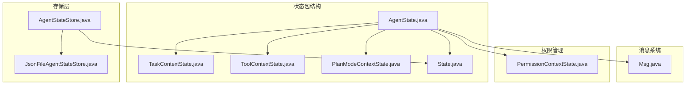
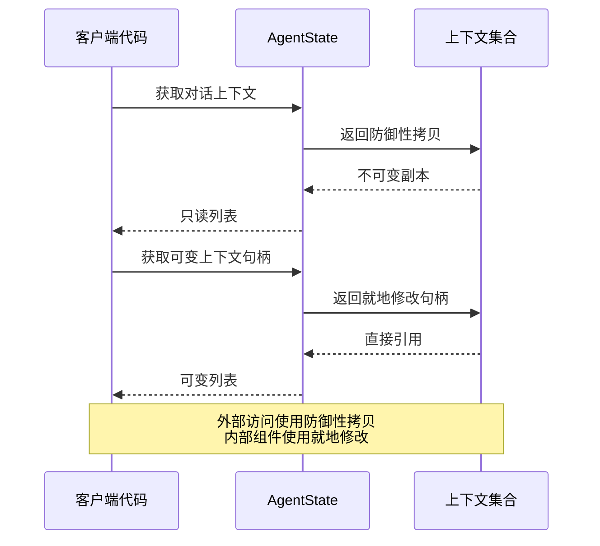
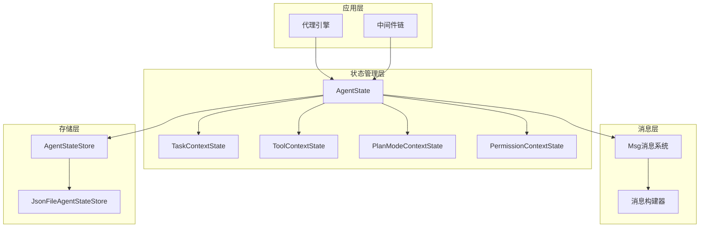
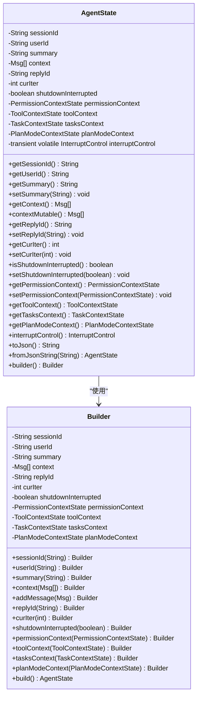
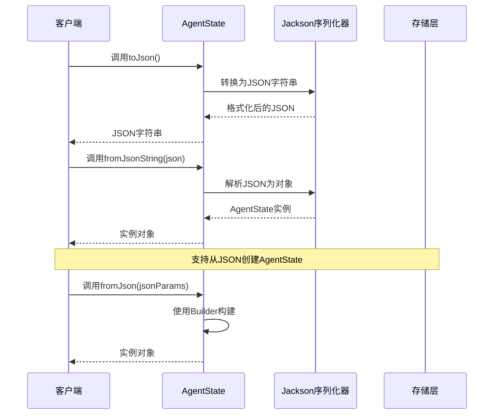
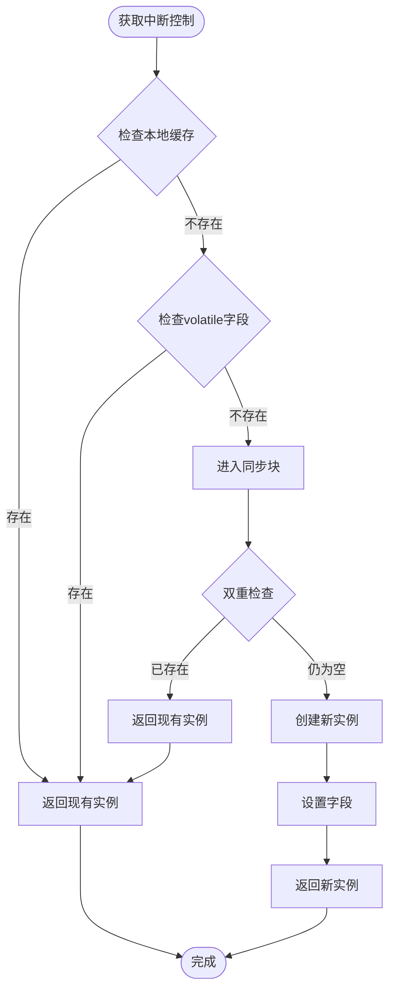
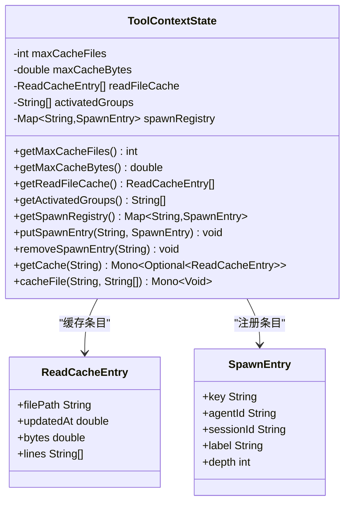
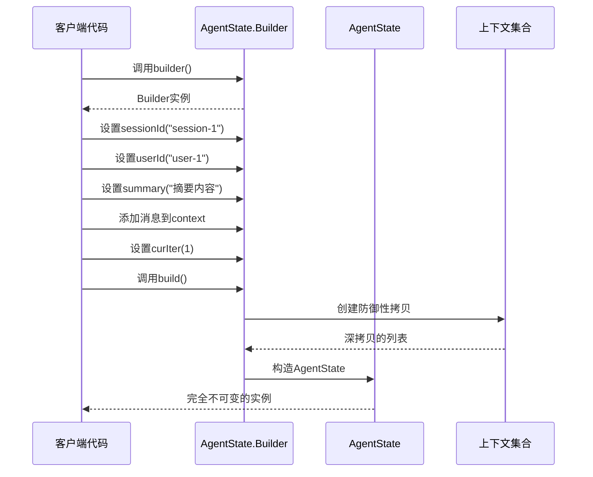
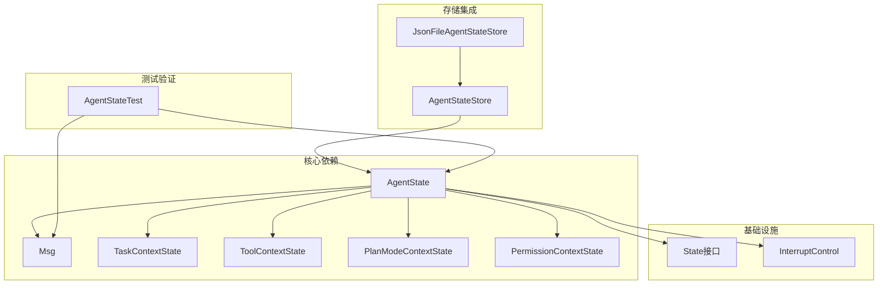

# AgentState数据结构

<cite>
**本文档引用的文件**
- [AgentState.java](file://agentscope-core/src/main/java/io/agentscope/core/state/AgentState.java)
- [TaskContextState.java](file://agentscope-core/src/main/java/io/agentscope/core/state/TaskContextState.java)
- [ToolContextState.java](file://agentscope-core/src/main/java/io/agentscope/core/state/ToolContextState.java)
- [PlanModeContextState.java](file://agentscope-core/src/main/java/io/agentscope/core/state/PlanModeContextState.java)
- [State.java](file://agentscope-core/src/main/java/io/agentscope/core/state/State.java)
- [Msg.java](file://agentscope-core/src/main/java/io/agentscope/core/message/Msg.java)
- [AgentStateTest.java](file://agentscope-core/src/test/java/io/agentscope/core/state/AgentStateTest.java)
- [AgentStateStore.java](file://agentscope-core/src/main/java/io/agentscope/core/state/AgentStateStore.java)
- [JsonFileAgentStateStore.java](file://agentscope-core/src/main/java/io/agentscope/core/state/JsonFileAgentStateStore.java)
- [PermissionContextState.java](file://agentscope-core/src/main/java/io/agentscope/core/permission/PermissionContextState.java)
</cite>

## 目录
1. [简介](#简介)
2. [项目结构](#项目结构)
3. [核心组件](#核心组件)
4. [架构概览](#架构概览)
5. [详细组件分析](#详细组件分析)
6. [依赖关系分析](#依赖关系分析)
7. [性能考虑](#性能考虑)
8. [故障排除指南](#故障排除指南)
9. [结论](#结论)

## 简介

AgentState是AgentScope Java框架中的核心数据结构，用于表示单个代理的运行时状态。该类实现了完全的不可变性设计，同时通过双重访问模式平衡了安全性与性能需求。AgentState承载着代理在会话中恢复对话所需的所有信息，包括对话缓冲区、滚动摘要、每轮回复标识符、权限/工具/任务子上下文，以及当前推理迭代计数器。

该设计的核心理念是"安全的默认值"：所有字段都采用防御性拷贝保护，确保外部修改不会影响内部状态。同时，为了优化性能，某些关键集合提供了就地修改的访问方式，允许内部组件直接操作而不必重建整个对象。

## 项目结构

AgentState位于agentscope-core模块的状态包中，与消息系统、权限管理和存储层紧密集成：



**图表来源**
- [AgentState.java:1-424](file://agentscope-core/src/main/java/io/agentscope/core/state/AgentState.java#L1-L424)
- [Msg.java:1-843](file://agentscope-core/src/main/java/io/agentscope/core/message/Msg.java#L1-L843)

**章节来源**
- [AgentState.java:16-58](file://agentscope-core/src/main/java/io/agentscope/core/state/AgentState.java#L16-L58)
- [State.java:18-30](file://agentscope-core/src/main/java/io/agentscope/core/state/State.java#L18-L30)

## 核心组件

### AgentState主类设计

AgentState是一个最终类，实现了State接口，采用Builder模式进行实例化。其核心设计理念体现在以下方面：

#### 字段组织结构
- **会话标识符** (`sessionId`): 唯一标识用户的会话，支持自动生成或显式指定
- **用户标识符** (`userId`): 可空的用户标识，支持匿名/单租户场景
- **对话上下文** (`context`): 消息列表的防御性拷贝，提供只读访问
- **回复标识符** (`replyId`): 每轮回复的唯一标识符
- **当前迭代次数** (`curIter`): 当前推理迭代计数器
- **关闭中断标志** (`shutdownInterrupted`): 表示是否在关闭过程中被中断
- **权限上下文** (`permissionContext`): 权限评估上下文
- **工具上下文** (`toolContext`): 工具调用缓存和注册表
- **任务上下文** (`tasksContext`): 任务管理上下文
- **计划模式上下文** (`planModeContext`): 计划模式控制状态

#### 不可变性与可变性的平衡

AgentState通过双重访问模式实现了不可变性与性能的平衡：



**图表来源**
- [AgentState.java:179-188](file://agentscope-core/src/main/java/io/agentscope/core/state/AgentState.java#L179-L188)

**章节来源**
- [AgentState.java:61-71](file://agentscope-core/src/main/java/io/agentscope/core/state/AgentState.java#L61-L71)
- [AgentState.java:179-288](file://agentscope-core/src/main/java/io/agentscope/core/state/AgentState.java#L179-L288)

### 上下文状态组件

#### TaskContextState任务状态
TaskContextState管理代理的任务集合，提供防御性拷贝和就地修改的双重访问模式：

- **任务列表** (`tasks`): 使用ArrayList存储任务，支持就地修改
- **防御性拷贝** (`getTasks()`): 返回不可变副本供只读访问
- **就地修改** (`tasksMutable()`): 提供直接引用供工具实现修改

#### ToolContextState工具状态
ToolContextState是复杂的缓存管理系统，包含文件读取缓存、工具组激活状态和子代理注册表：

- **缓存配置** (`maxCacheFiles`, `maxCacheBytes`): 缓存大小限制
- **读取缓存** (`readFileCache`): LRU文件内容缓存
- **激活组** (`activatedGroups`): 工具组激活状态
- **子代理注册表** (`spawnRegistry`): 子代理生命周期管理

#### PlanModeContextState计划模式状态
PlanModeContextState提供持久化的计划模式控制，支持"先设计后执行"的工作流程：

- **计划激活标志** (`planActive`): 控制是否启用计划模式
- **当前计划文件** (`currentPlanFile`): 正在编辑的markdown蓝图路径

**章节来源**
- [TaskContextState.java:30-74](file://agentscope-core/src/main/java/io/agentscope/core/state/TaskContextState.java#L30-L74)
- [ToolContextState.java:49-292](file://agentscope-core/src/main/java/io/agentscope/core/state/ToolContextState.java#L49-L292)
- [PlanModeContextState.java:37-97](file://agentscope-core/src/main/java/io/agentscope/core/state/PlanModeContextState.java#L37-L97)

## 架构概览

AgentState在整个AgentScope架构中扮演着核心协调者的角色：



**图表来源**
- [AgentState.java:31-45](file://agentscope-core/src/main/java/io/agentscope/core/state/AgentState.java#L31-L45)
- [AgentStateStore.java:22-60](file://agentscope-core/src/main/java/io/agentscope/core/state/AgentStateStore.java#L22-L60)

## 详细组件分析

### AgentState类深度解析

#### 构造函数与Builder模式

AgentState采用Builder模式确保线程安全的不可变对象创建：



**图表来源**
- [AgentState.java:59-103](file://agentscope-core/src/main/java/io/agentscope/core/state/AgentState.java#L59-L103)
- [AgentState.java:342-422](file://agentscope-core/src/main/java/io/agentscope/core/state/AgentState.java#L342-L422)

#### 序列化与反序列化机制

AgentState实现了完整的JSON序列化支持，通过Jackson注解精确控制序列化过程：



**图表来源**
- [AgentState.java:279-288](file://agentscope-core/src/main/java/io/agentscope/core/state/AgentState.java#L279-L288)
- [AgentState.java:105-153](file://agentscope-core/src/main/java/io/agentscope/core/state/AgentState.java#L105-L153)

#### 中断控制机制

AgentState提供了运行时中断控制功能，支持按会话粒度的信号管理：



**图表来源**
- [AgentState.java:254-267](file://agentscope-core/src/main/java/io/agentscope/core/state/AgentState.java#L254-L267)

**章节来源**
- [AgentState.java:81-103](file://agentscope-core/src/main/java/io/agentscope/core/state/AgentState.java#L81-L103)
- [AgentState.java:254-267](file://agentscope-core/src/main/java/io/agentscope/core/state/AgentState.java#L254-L267)

### 上下文状态组件详解

#### ToolContextState缓存系统

ToolContextState实现了智能的文件读取缓存机制，具有以下特性：

- **LRU淘汰策略**: 基于时间和大小的双重约束
- **mtime验证**: 文件修改时间验证，自动失效过期缓存
- **非阻塞IO**: 使用Reactor调度器避免阻塞主线程
- **配置驱动**: 可配置的最大缓存文件数和字节数



**图表来源**
- [ToolContextState.java:49-178](file://agentscope-core/src/main/java/io/agentscope/core/state/ToolContextState.java#L49-L178)
- [ToolContextState.java:158-178](file://agentscope-core/src/main/java/io/agentscope/core/state/ToolContextState.java#L158-L178)

**章节来源**
- [ToolContextState.java:49-292](file://agentscope-core/src/main/java/io/agentscope/core/state/ToolContextState.java#L49-L292)

### 使用示例与最佳实践

#### Builder模式使用示例

以下是使用Builder模式创建AgentState实例的最佳实践：



**图表来源**
- [AgentState.java:342-422](file://agentscope-core/src/main/java/io/agentscope/core/state/AgentState.java#L342-L422)

#### 上下文访问模式

AgentState提供了清晰的上下文访问模式，确保数据安全性和性能：

```mermaid
flowchart LR
subgraph "只读访问模式"
A[客户端代码] --> B[getContext()]
B --> C[防御性拷贝]
C --> D[不可变列表]
end
subgraph "就地修改模式"
E[内部组件] --> F[contextMutable()]
F --> G[直接引用]
G --> H[就地修改]
end
subgraph "数据一致性"
D --> I[外部安全]
H --> J[内部高效]
end
```

**图表来源**
- [AgentState.java:179-188](file://agentscope-core/src/main/java/io/agentscope/core/state/AgentState.java#L179-L188)

**章节来源**
- [AgentStateTest.java:90-130](file://agentscope-core/src/test/java/io/agentscope/core/state/AgentStateTest.java#L90-L130)

## 依赖关系分析

### 组件耦合度分析

AgentState展现了良好的内聚性和适度的耦合度：



**图表来源**
- [AgentState.java:22-29](file://agentscope-core/src/main/java/io/agentscope/core/state/AgentState.java#L22-L29)
- [AgentStateStore.java:18-21](file://agentscope-core/src/main/java/io/agentscope/core/state/AgentStateStore.java#L18-L21)

### 错误处理与边界条件

AgentState在多个层面实现了健壮的错误处理：

- **空值处理**: 所有setter方法都处理null输入
- **类型验证**: 构造函数验证参数有效性
- **并发安全**: 使用volatile和同步机制保证线程安全
- **资源清理**: 实现了适当的资源管理

**章节来源**
- [AgentState.java:290-325](file://agentscope-core/src/main/java/io/agentscope/core/state/AgentState.java#L290-L325)
- [ToolContextState.java:57-68](file://agentscope-core/src/main/java/io/agentscope/core/state/ToolContextState.java#L57-L68)

## 性能考虑

### 内存优化策略

AgentState采用了多项内存优化技术：

1. **延迟初始化**: 中断控制采用延迟初始化，仅在首次访问时创建
2. **防御性拷贝**: 只在必要时创建副本，避免不必要的内存分配
3. **就地修改**: 关键集合提供直接引用，减少复制开销
4. **不可变设计**: 避免共享状态导致的同步开销

### 序列化性能

- **Jackson注解**: 精确控制序列化字段顺序和可见性
- **格式化输出**: 提供美观的JSON格式化选项
- **增量存储**: 存储层支持增量写入，减少I/O操作

## 故障排除指南

### 常见问题诊断

#### Builder模式相关问题
- **空指针异常**: 确保所有必需参数都已正确设置
- **非法状态异常**: 检查Builder参数的有效性
- **内存泄漏**: 避免持有对AgentState的长期引用

#### 序列化问题
- **JSON解析失败**: 检查JSON格式的完整性
- **字段缺失**: 确保所有必需字段都包含在JSON中
- **类型不匹配**: 验证JSON字段类型与Java类型的一致性

#### 并发访问问题
- **竞态条件**: 使用只读访问方法而非就地修改方法
- **内存可见性**: 理解volatile字段的内存语义
- **死锁风险**: 避免在持有AgentState锁时进行长时间操作

**章节来源**
- [AgentStateTest.java:35-87](file://agentscope-core/src/test/java/io/agentscope/core/state/AgentStateTest.java#L35-L87)

## 结论

AgentState数据结构代表了AgentScope框架在设计哲学上的一个典型范例：在保证线程安全和数据完整性的前提下，通过精心设计的双重访问模式实现了性能与安全性的最佳平衡。其不可变性设计确保了系统的可靠性，而就地修改能力则保证了运行时的效率。

该设计的成功之处在于：

1. **明确的职责分离**: 每个上下文状态都有清晰的职责边界
2. **灵活的访问模式**: 同时支持安全的只读访问和高效的就地修改
3. **完善的序列化支持**: 通过Jackson注解实现了精确的序列化控制
4. **健壮的错误处理**: 在多个层面提供了容错机制
5. **优秀的扩展性**: 为未来的功能扩展预留了充足的空间

对于开发者而言，理解AgentState的设计理念和使用模式，将有助于更好地利用AgentScope框架构建可靠的AI代理应用。