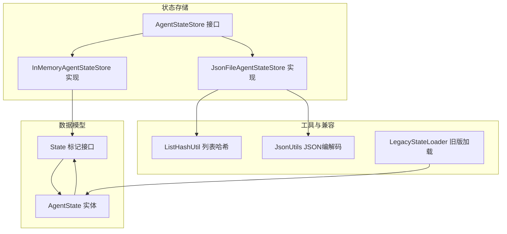
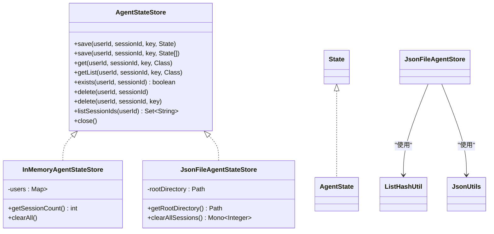
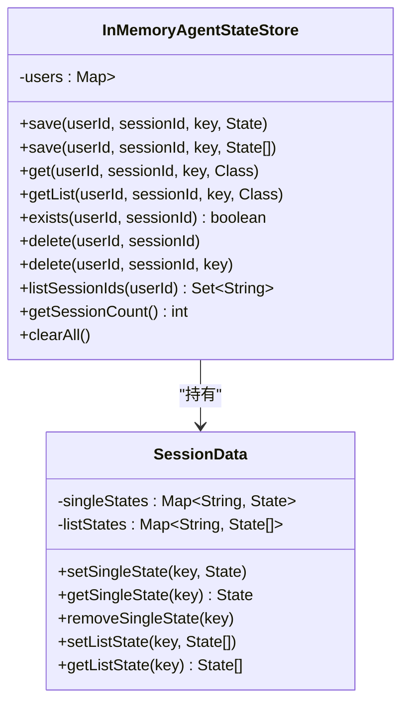
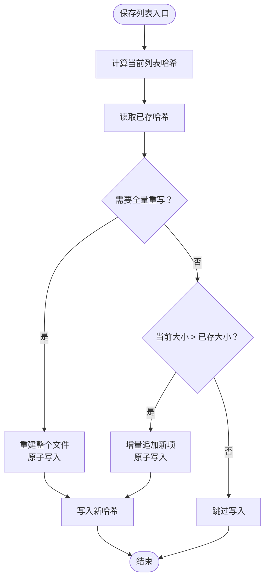
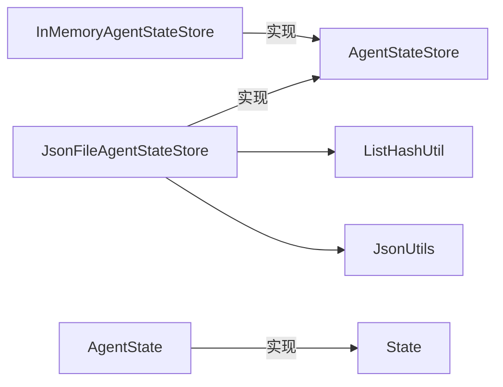

# 状态存储后端

<cite>
**本文引用的文件**
- [AgentStateStore.java](file://agentscope-core/src/main/java/io/agentscope/core/state/AgentStateStore.java)
- [InMemoryAgentStateStore.java](file://agentscope-core/src/main/java/io/agentscope/core/state/InMemoryAgentStateStore.java)
- [JsonFileAgentStateStore.java](file://agentscope-core/src/main/java/io/agentscope/core/state/JsonFileAgentStateStore.java)
- [State.java](file://agentscope-core/src/main/java/io/agentscope/core/state/State.java)
- [ListHashUtil.java](file://agentscope-core/src/main/java/io/agentscope/core/state/ListHashUtil.java)
- [JsonUtils.java](file://agentscope-core/src/main/java/io/agentscope/core/util/JsonUtils.java)
- [AgentState.java](file://agentscope-core/src/main/java/io/agentscope/core/state/AgentState.java)
- [LegacyStateLoader.java](file://agentscope-core/src/main/java/io/agentscope/core/state/LegacyStateLoader.java)
</cite>

## 目录
1. [简介](#简介)
2. [项目结构](#项目结构)
3. [核心组件](#核心组件)
4. [架构总览](#架构总览)
5. [组件详解](#组件详解)
6. [依赖关系分析](#依赖关系分析)
7. [性能与内存特性](#性能与内存特性)
8. [故障排查指南](#故障排查指南)
9. [结论](#结论)
10. [附录：配置与使用示例路径](#附录配置与使用示例路径)

## 简介
本文件面向AgentScope Java的状态存储后端，系统性阐述以下内容：
- AgentStateStore接口的设计原则与存储策略取舍
- 内存存储实现InMemoryAgentStateStore的线程安全、内存管理与性能特征
- 文件持久化实现JsonFileAgentStateStore的JSON序列化格式、文件命名与目录结构、I/O优化策略（原子写入、增量追加、哈希校验）
- 如何配置与使用不同存储后端、如何实现自定义存储适配器、如何处理存储异常与数据恢复
- 分布式场景下的状态同步策略、缓存机制与并发访问控制最佳实践

## 项目结构
状态存储相关代码位于agentscope-core模块的state包中，核心接口与实现如下：
- 接口层：AgentStateStore
- 实现层：InMemoryAgentStateStore、JsonFileAgentStateStore
- 数据模型：State标记接口、AgentState实体
- 工具层：ListHashUtil（列表哈希与变更检测）、JsonUtils（统一JSON编解码入口）
- 兼容层：LegacyStateLoader（从旧版本会话加载到新格式）

图表来源
- [AgentStateStore.java:1-167](file://agentscope-core/src/main/java/io/agentscope/core/state/AgentStateStore.java#L1-L167)
- [InMemoryAgentStateStore.java:1-195](file://agentscope-core/src/main/java/io/agentscope/core/state/InMemoryAgentStateStore.java#L1-L195)
- [JsonFileAgentStateStore.java:1-397](file://agentscope-core/src/main/java/io/agentscope/core/state/JsonFileAgentStateStore.java#L1-L397)
- [State.java:1-31](file://agentscope-core/src/main/java/io/agentscope/core/state/State.java#L1-L31)
- [AgentState.java:1-424](file://agentscope-core/src/main/java/io/agentscope/core/state/AgentState.java#L1-L424)
- [ListHashUtil.java:1-172](file://agentscope-core/src/main/java/io/agentscope/core/state/ListHashUtil.java#L1-L172)
- [JsonUtils.java:1-153](file://agentscope-core/src/main/java/io/agentscope/core/util/JsonUtils.java#L1-L153)
- [LegacyStateLoader.java:1-68](file://agentscope-core/src/main/java/io/agentscope/core/state/LegacyStateLoader.java#L1-L68)

章节来源
- [AgentStateStore.java:1-167](file://agentscope-core/src/main/java/io/agentscope/core/state/AgentStateStore.java#L1-L167)
- [InMemoryAgentStateStore.java:1-195](file://agentscope-core/src/main/java/io/agentscope/core/state/InMemoryAgentStateStore.java#L1-L195)
- [JsonFileAgentStateStore.java:1-397](file://agentscope-core/src/main/java/io/agentscope/core/state/JsonFileAgentStateStore.java#L1-L397)
- [State.java:1-31](file://agentscope-core/src/main/java/io/agentscope/core/state/State.java#L1-L31)
- [AgentState.java:1-424](file://agentscope-core/src/main/java/io/agentscope/core/state/AgentState.java#L1-L424)
- [ListHashUtil.java:1-172](file://agentscope-core/src/main/java/io/agentscope/core/state/ListHashUtil.java#L1-L172)
- [JsonUtils.java:1-153](file://agentscope-core/src/main/java/io/agentscope/core/util/JsonUtils.java#L1-L153)
- [LegacyStateLoader.java:1-68](file://agentscope-core/src/main/java/io/agentscope/core/state/LegacyStateLoader.java#L1-L68)

## 核心组件
- AgentStateStore接口：定义按(userId, sessionId)键控的单值/列表读写、存在性检查、删除、会话枚举等能力；默认方法支持按key删除与资源清理。
- InMemoryAgentStateStore：基于ConcurrentHashMap的内存实现，线程安全，适合单进程、无需跨重启持久化的场景。
- JsonFileAgentStateStore：基于文件系统的实现，采用UTF-8、原子写入、JSON/JSONL格式、哈希校验实现增量追加与全量重写策略。
- State与AgentState：State为可持久化标记接口；AgentState是核心运行时状态载体，包含上下文、摘要、权限/工具/任务/计划模式上下文等。
- ListHashUtil：对列表进行采样哈希计算，用于判断是否需要全量重写或可增量追加。
- JsonUtils：全局JSON编解码入口，支持替换实现。

章节来源
- [AgentStateStore.java:61-167](file://agentscope-core/src/main/java/io/agentscope/core/state/AgentStateStore.java#L61-L167)
- [InMemoryAgentStateStore.java:46-195](file://agentscope-core/src/main/java/io/agentscope/core/state/InMemoryAgentStateStore.java#L46-L195)
- [JsonFileAgentStateStore.java:66-397](file://agentscope-core/src/main/java/io/agentscope/core/state/JsonFileAgentStateStore.java#L66-L397)
- [State.java:18-31](file://agentscope-core/src/main/java/io/agentscope/core/state/State.java#L18-L31)
- [AgentState.java:59-424](file://agentscope-core/src/main/java/io/agentscope/core/state/AgentState.java#L59-L424)
- [ListHashUtil.java:48-172](file://agentscope-core/src/main/java/io/agentscope/core/state/ListHashUtil.java#L48-L172)
- [JsonUtils.java:49-153](file://agentscope-core/src/main/java/io/agentscope/core/util/JsonUtils.java#L49-L153)

## 架构总览
下图展示了接口、实现、数据模型与工具之间的关系，以及文件存储布局与关键流程。

图表来源
- [AgentStateStore.java:61-167](file://agentscope-core/src/main/java/io/agentscope/core/state/AgentStateStore.java#L61-L167)
- [InMemoryAgentStateStore.java:46-195](file://agentscope-core/src/main/java/io/agentscope/core/state/InMemoryAgentStateStore.java#L46-L195)
- [JsonFileAgentStateStore.java:66-397](file://agentscope-core/src/main/java/io/agentscope/core/state/JsonFileAgentStateStore.java#L66-L397)
- [State.java:18-31](file://agentscope-core/src/main/java/io/agentscope/core/state/State.java#L18-L31)
- [AgentState.java:59-424](file://agentscope-core/src/main/java/io/agentscope/core/state/AgentState.java#L59-L424)
- [ListHashUtil.java:48-172](file://agentscope-core/src/main/java/io/agentscope/core/state/ListHashUtil.java#L48-L172)
- [JsonUtils.java:49-153](file://agentscope-core/src/main/java/io/agentscope/core/util/JsonUtils.java#L49-L153)

## 组件详解

### AgentStateStore接口设计原则
- 键空间：以(userId, sessionId)作为槽位标识，其中userId可空表示匿名/单租户调用；实现方负责将二者组合为具体存储键（如文件路径、Redis键前缀）。
- 单值与列表写入策略差异：实现可自行决定列表写入策略（例如增量追加或全量替换），调用方应始终传入完整列表。
- 默认行为：delete(key)与close()提供默认空实现，便于仅需部分能力的实现。
- 使用示例：接口注释提供了典型用法，包括匿名与用户作用域保存、按key读取、列出会话ID等。

章节来源
- [AgentStateStore.java:22-60](file://agentscope-core/src/main/java/io/agentscope/core/state/AgentStateStore.java#L22-L60)
- [AgentStateStore.java:73-92](file://agentscope-core/src/main/java/io/agentscope/core/state/AgentStateStore.java#L73-L92)
- [AgentStateStore.java:143-145](file://agentscope-core/src/main/java/io/agentscope/core/state/AgentStateStore.java#L143-L145)
- [AgentStateStore.java:163-166](file://agentscope-core/src/main/java/io/agentscope/core/state/AgentStateStore.java#L163-L166)

### InMemoryAgentStateStore（内存存储）
- 存储结构：三层Map(users → sessionId → SessionData)，ConcurrentHashMap保证线程安全。
- 匿名用户处理：userId为空时映射到固定桶名，避免与空字符串用户冲突。
- 语义：
  - 单值保存为覆盖写；列表保存为整包替换。
  - 支持按会话或按key删除；支持列出某用户的全部会话ID。
  - 提供统计与清空方法，便于测试与运维。
- 性能与限制：
  - 读写为内存操作，延迟低；但JVM退出即丢失，不适用于分布式或多进程场景。
  - 随会话数量增长，内存占用线性增加。

图表来源
- [InMemoryAgentStateStore.java:46-195](file://agentscope-core/src/main/java/io/agentscope/core/state/InMemoryAgentStateStore.java#L46-L195)

章节来源
- [InMemoryAgentStateStore.java:26-45](file://agentscope-core/src/main/java/io/agentscope/core/state/InMemoryAgentStateStore.java#L26-L45)
- [InMemoryAgentStateStore.java:54-132](file://agentscope-core/src/main/java/io/agentscope/core/state/InMemoryAgentStateStore.java#L54-L132)
- [InMemoryAgentStateStore.java:134-142](file://agentscope-core/src/main/java/io/agentscope/core/state/InMemoryAgentStateStore.java#L134-L142)

### JsonFileAgentStateStore（文件持久化）
- 目录布局与命名：
  - 根目录下按用户分桶，匿名用户使用固定桶名；会话ID同样进行安全编码（字母数字+下划线+连字符+点号保留，否则Base64 URL无填充编码）。
  - 每个会话目录内：
    - 单值状态：key.json（JSON）
    - 列表状态：key.jsonl（每行一条JSON对象）
    - 列表哈希：key.hash（记录上次列表快照哈希）
- 序列化与I/O：
  - 使用JsonUtils统一编解码，默认Jackson实现；UTF-8编码。
  - 原子写入：临时文件写入后原子移动覆盖，避免部分写入。
  - 列表写入策略：
    - 计算当前列表哈希并与已存哈希比较；
    - 若需要全量重写（列表被修改/收缩/缺失哈希），则重建整个文件；
    - 否则仅追加新增项；
    - 最终更新哈希文件。
- 能力：
  - 单值/列表读取、存在性检查、按会话/按key删除、枚举会话ID；
  - 提供根目录查询与批量清理会话的异步方法（bounded elastic调度）。

图表来源
- [JsonFileAgentStateStore.java:110-133](file://agentscope-core/src/main/java/io/agentscope/core/state/JsonFileAgentStateStore.java#L110-L133)
- [ListHashUtil.java:147-170](file://agentscope-core/src/main/java/io/agentscope/core/state/ListHashUtil.java#L147-L170)

章节来源
- [JsonFileAgentStateStore.java:41-65](file://agentscope-core/src/main/java/io/agentscope/core/state/JsonFileAgentStateStore.java#L41-L65)
- [JsonFileAgentStateStore.java:98-133](file://agentscope-core/src/main/java/io/agentscope/core/state/JsonFileAgentStateStore.java#L98-L133)
- [JsonFileAgentStateStore.java:135-164](file://agentscope-core/src/main/java/io/agentscope/core/state/JsonFileAgentStateStore.java#L135-L164)
- [JsonFileAgentStateStore.java:166-202](file://agentscope-core/src/main/java/io/agentscope/core/state/JsonFileAgentStateStore.java#L166-L202)
- [JsonFileAgentStateStore.java:204-241](file://agentscope-core/src/main/java/io/agentscope/core/state/JsonFileAgentStateStore.java#L204-L241)
- [JsonFileAgentStateStore.java:251-280](file://agentscope-core/src/main/java/io/agentscope/core/state/JsonFileAgentStateStore.java#L251-L280)
- [JsonFileAgentStateStore.java:286-290](file://agentscope-core/src/main/java/io/agentscope/core/state/JsonFileAgentStateStore.java#L286-L290)
- [JsonFileAgentStateStore.java:319-323](file://agentscope-core/src/main/java/io/agentscope/core/state/JsonFileAgentStateStore.java#L319-L323)
- [JsonFileAgentStateStore.java:377-395](file://agentscope-core/src/main/java/io/agentscope/core/state/JsonFileAgentStateStore.java#L377-L395)
- [ListHashUtil.java:76-95](file://agentscope-core/src/main/java/io/agentscope/core/state/ListHashUtil.java#L76-L95)
- [ListHashUtil.java:147-170](file://agentscope-core/src/main/java/io/agentscope/core/state/ListHashUtil.java#L147-L170)

### 数据模型与序列化
- State：可持久化标记接口，推荐使用不可变记录类型；也可直接让领域对象实现该接口以避免转换开销。
- AgentState：核心运行时状态，包含会话ID、用户ID、摘要、上下文消息列表、回复ID、当前迭代次数、中断状态、权限/工具/任务/计划模式上下文等；提供构建器与JSON序列化/反序列化便捷方法。
- JsonUtils：提供全局JsonCodec访问点，支持设置自定义实现或重置为默认实现；同时提供工具方法验证JSON对象有效性与解析工具调用参数。

章节来源
- [State.java:18-31](file://agentscope-core/src/main/java/io/agentscope/core/state/State.java#L18-L31)
- [AgentState.java:31-58](file://agentscope-core/src/main/java/io/agentscope/core/state/AgentState.java#L31-L58)
- [AgentState.java:279-288](file://agentscope-core/src/main/java/io/agentscope/core/state/AgentState.java#L279-L288)
- [JsonUtils.java:49-91](file://agentscope-core/src/main/java/io/agentscope/core/util/JsonUtils.java#L49-L91)
- [JsonUtils.java:103-151](file://agentscope-core/src/main/java/io/agentscope/core/util/JsonUtils.java#L103-L151)

### 旧版数据迁移
- LegacyStateLoader：从旧版会话键（如memory_messages、toolkit_activeGroups）读取并组装为新的AgentState对象，不修改原始数据，后续保存将采用新格式。

章节来源
- [LegacyStateLoader.java:30-67](file://agentscope-core/src/main/java/io/agentscope/core/state/LegacyStateLoader.java#L30-L67)

## 依赖关系分析
- 接口与实现：AgentStateStore为统一契约，InMemoryAgentStateStore与JsonFileAgentStateStore分别满足不同部署形态的需求。
- 工具依赖：JsonFileAgentStateStore依赖ListHashUtil进行列表变更检测与增量/全量策略决策；依赖JsonUtils进行JSON编解码。
- 数据模型：AgentState实现State接口，作为典型持久化对象。

图表来源
- [AgentStateStore.java:61-167](file://agentscope-core/src/main/java/io/agentscope/core/state/AgentStateStore.java#L61-L167)
- [InMemoryAgentStateStore.java:46-195](file://agentscope-core/src/main/java/io/agentscope/core/state/InMemoryAgentStateStore.java#L46-L195)
- [JsonFileAgentStateStore.java:66-397](file://agentscope-core/src/main/java/io/agentscope/core/state/JsonFileAgentStateStore.java#L66-L397)
- [ListHashUtil.java:48-172](file://agentscope-core/src/main/java/io/agentscope/core/state/ListHashUtil.java#L48-L172)
- [JsonUtils.java:49-153](file://agentscope-core/src/main/java/io/agentscope/core/util/JsonUtils.java#L49-L153)
- [AgentState.java:59-424](file://agentscope-core/src/main/java/io/agentscope/core/state/AgentState.java#L59-L424)
- [State.java:18-31](file://agentscope-core/src/main/java/io/agentscope/core/state/State.java#L18-L31)

## 性能与内存特性
- InMemoryAgentStateStore
  - 优点：极低延迟、线程安全、实现简单。
  - 代价：内存占用随会话数线性增长；JVM退出即丢失；不适合分布式或多进程共享。
- JsonFileAgentStateStore
  - 优点：持久化可靠、支持增量追加、原子写入保障一致性。
  - 成本：磁盘I/O与文件系统元数据开销；大列表场景通过哈希采样降低计算成本；UTF-8读写与逐行解析带来一定CPU消耗。
- 列表写入优化
  - 小列表全量采样；大列表按四分位采样，显著降低哈希计算复杂度。
  - 仅在必要时全量重写，多数情况下增量追加，减少I/O放大。

章节来源
- [InMemoryAgentStateStore.java:38-44](file://agentscope-core/src/main/java/io/agentscope/core/state/InMemoryAgentStateStore.java#L38-L44)
- [JsonFileAgentStateStore.java:63-65](file://agentscope-core/src/main/java/io/agentscope/core/state/JsonFileAgentStateStore.java#L63-L65)
- [ListHashUtil.java:26-32](file://agentscope-core/src/main/java/io/agentscope/core/state/ListHashUtil.java#L26-L32)
- [ListHashUtil.java:110-122](file://agentscope-core/src/main/java/io/agentscope/core/state/ListHashUtil.java#L110-L122)

## 故障排查指南
- 常见异常与定位
  - 保存失败：检查根目录权限、磁盘空间、文件锁；确认sessionId非空且非空白；查看异常堆栈中的“Failed to save”信息。
  - 加载失败：确认目标文件是否存在、JSON格式是否有效；查看异常堆栈中的“Failed to load”信息。
  - 删除失败：确认会话目录存在且可删除；注意递归删除顺序（先子项后父项）。
  - 列表未更新：确认当前列表哈希与已存哈希一致；若列表被修改或收缩，将触发全量重写。
- 建议排查步骤
  - 核对sessionId与userId组合是否正确；确认目录结构与命名规则符合安全编码要求。
  - 对于文件存储，优先检查哈希文件与JSONL文件的一致性；必要时手动备份后清理哈希文件以强制全量重写。
  - 在高并发场景，确保调用方不会在同一会话上同时进行读写竞争（建议在业务层做会话级串行化或幂等写入）。

章节来源
- [JsonFileAgentStateStore.java:98-108](file://agentscope-core/src/main/java/io/agentscope/core/state/JsonFileAgentStateStore.java#L98-L108)
- [JsonFileAgentStateStore.java:166-179](file://agentscope-core/src/main/java/io/agentscope/core/state/JsonFileAgentStateStore.java#L166-L179)
- [JsonFileAgentStateStore.java:209-215](file://agentscope-core/src/main/java/io/agentscope/core/state/JsonFileAgentStateStore.java#L209-L215)
- [JsonFileAgentStateStore.java:217-224](file://agentscope-core/src/main/java/io/agentscope/core/state/JsonFileAgentStateStore.java#L217-L224)
- [JsonFileAgentStateStore.java:227-241](file://agentscope-core/src/main/java/io/agentscope/core/state/JsonFileAgentStateStore.java#L227-L241)

## 结论
- AgentStateStore接口提供了清晰的抽象边界，既支持内存快速读写，也支持文件持久化与增量优化。
- InMemoryAgentStateStore适合单进程、低延迟、易丢弃的场景；JsonFileAgentStateStore适合需要持久化与跨进程/容器复用的场景。
- 通过ListHashUtil与原子写入策略，JsonFileAgentStateStore在可靠性与性能之间取得平衡。
- 在分布式与多实例环境中，建议结合外部分布式存储（如Redis/Memcached）或引入分布式锁/协调服务来实现状态同步与并发控制。

## 附录：配置与使用示例路径
- 创建并使用内存存储
  - 参考：[InMemoryAgentStateStore构造与方法:46-195](file://agentscope-core/src/main/java/io/agentscope/core/state/InMemoryAgentStateStore.java#L46-L195)
  - 示例路径（保存/读取/删除/枚举）：[AgentStateStore接口方法签名:73-157](file://agentscope-core/src/main/java/io/agentscope/core/state/AgentStateStore.java#L73-L157)
- 创建并使用文件存储
  - 默认根目录：用户主目录下的隐藏目录；可指定自定义根目录
  - 参考：[JsonFileAgentStateStore构造与根目录:80-96](file://agentscope-core/src/main/java/io/agentscope/core/state/JsonFileAgentStateStore.java#L80-L96)
  - 文件布局与命名规则：[目录与文件命名:44-65](file://agentscope-core/src/main/java/io/agentscope/core/state/JsonFileAgentStateStore.java#L44-L65)
  - 保存/读取/删除/枚举：[保存与读取实现:98-202](file://agentscope-core/src/main/java/io/agentscope/core/state/JsonFileAgentStateStore.java#L98-L202)
- 自定义JSON编解码器
  - 参考：[JsonUtils设置与重置:77-91](file://agentscope-core/src/main/java/io/agentscope/core/util/JsonUtils.java#L77-L91)
- 旧版数据迁移
  - 参考：[LegacyStateLoader加载逻辑:48-66](file://agentscope-core/src/main/java/io/agentscope/core/state/LegacyStateLoader.java#L48-L66)
- 分布式与并发控制最佳实践
  - 建议：在多实例/多进程场景下，使用外部分布式存储或协调服务；对同一会话的并发写入进行串行化或使用带版本/ETag的乐观锁；定期清理过期会话目录；监控磁盘空间与I/O延迟。