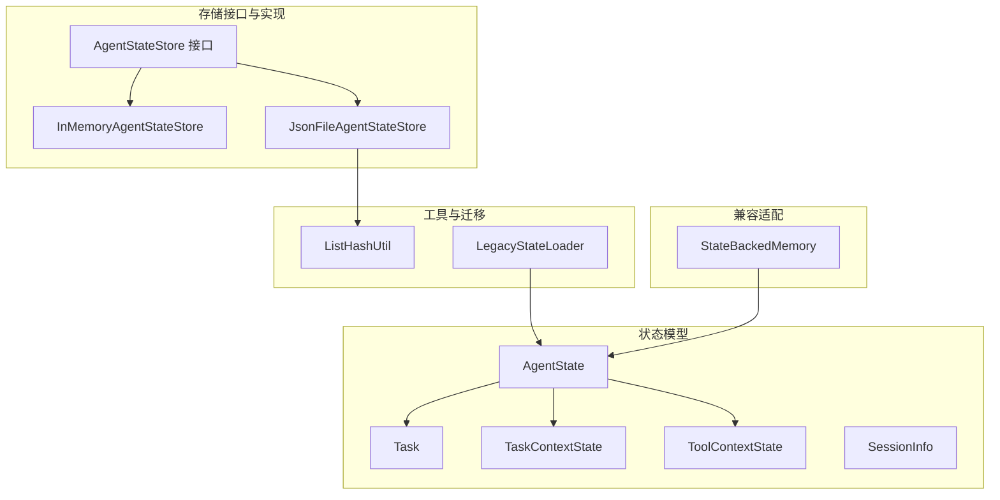
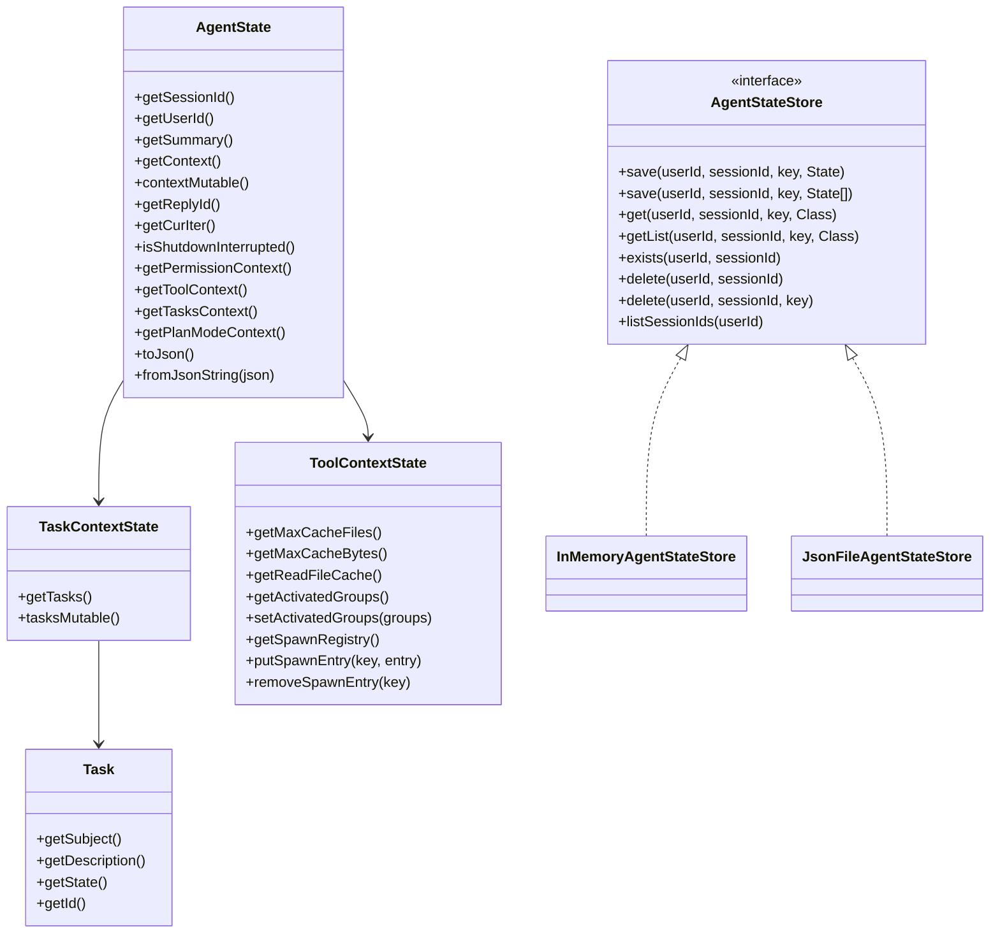
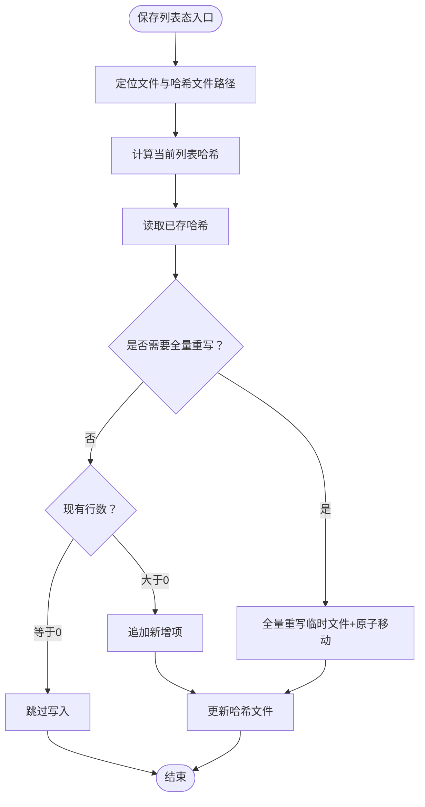
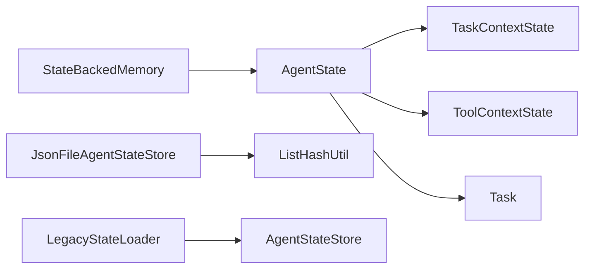

# 状态管理

<cite>
**本文引用的文件**
- [AgentState.java](file://agentscope-core/src/main/java/io/agentscope/core/state/AgentState.java)
- [AgentStateStore.java](file://agentscope-core/src/main/java/io/agentscope/core/state/AgentStateStore.java)
- [InMemoryAgentStateStore.java](file://agentscope-core/src/main/java/io/agentscope/core/state/InMemoryAgentStateStore.java)
- [JsonFileAgentStateStore.java](file://agentscope-core/src/main/java/io/agentscope/core/state/JsonFileAgentStateStore.java)
- [SessionInfo.java](file://agentscope-core/src/main/java/io/agentscope/core/state/SessionInfo.java)
- [Task.java](file://agentscope-core/src/main/java/io/agentscope/core/state/Task.java)
- [TaskContextState.java](file://agentscope-core/src/main/java/io/agentscope/core/state/TaskContextState.java)
- [ToolContextState.java](file://agentscope-core/src/main/java/io/agentscope/core/state/ToolContextState.java)
- [LegacyStateLoader.java](file://agentscope-core/src/main/java/io/agentscope/core/state/LegacyStateLoader.java)
- [ListHashUtil.java](file://agentscope-core/src/main/java/io/agentscope/core/state/ListHashUtil.java)
- [StateBackedMemory.java](file://agentscope-core/src/main/java/io/agentscope/core/memory/StateBackedMemory.java)
- [AgentStateTest.java](file://agentscope-core/src/test/java/io/agentscope/core/state/AgentStateTest.java)
</cite>

## 目录
1. [简介](#简介)
2. [项目结构](#项目结构)
3. [核心组件](#核心组件)
4. [架构总览](#架构总览)
5. [组件详解](#组件详解)
6. [依赖关系分析](#依赖关系分析)
7. [性能与并发特性](#性能与并发特性)
8. [故障排查指南](#故障排查指南)
9. [结论](#结论)
10. [附录：使用示例与最佳实践](#附录使用示例与最佳实践)

## 简介
本文件系统性阐述 AgentScope Java 的状态管理系统，重点覆盖：
- AgentState 数据结构设计：会话信息、任务状态、工具状态的组织方式
- AgentStateStore 存储策略：InMemoryAgentStateStore 内存存储、JsonFileAgentStateStore 文件持久化
- 状态序列化与反序列化机制：JSON 编解码、字段顺序与兼容性
- 状态快照与恢复：单值与列表态的保存/加载、哈希增量写入
- 使用示例：如何创建与管理 AgentState 实例、配置不同存储后端、实现状态持久化
- 一致性与并发：线程安全、原子写、哈希校验与增量更新
- 性能优化：缓存与 I/O 策略、采样哈希、异步文件操作

## 项目结构
状态管理相关代码集中在 agentscope-core 模块的 state 包中，并辅以 memory 包中的兼容适配器。关键文件如下：
- 状态模型：AgentState、Task、TaskContextState、ToolContextState、SessionInfo
- 存储接口与实现：AgentStateStore、InMemoryAgentStateStore、JsonFileAgentStateStore
- 工具与迁移：ListHashUtil、LegacyStateLoader
- 兼容适配：StateBackedMemory

图表来源
- [AgentState.java:59-424](file://agentscope-core/src/main/java/io/agentscope/core/state/AgentState.java#L59-L424)
- [AgentStateStore.java:61-167](file://agentscope-core/src/main/java/io/agentscope/core/state/AgentStateStore.java#L61-L167)
- [InMemoryAgentStateStore.java:46-195](file://agentscope-core/src/main/java/io/agentscope/core/state/InMemoryAgentStateStore.java#L46-L195)
- [JsonFileAgentStateStore.java:66-397](file://agentscope-core/src/main/java/io/agentscope/core/state/JsonFileAgentStateStore.java#L66-L397)
- [Task.java:41-283](file://agentscope-core/src/main/java/io/agentscope/core/state/Task.java#L41-L283)
- [TaskContextState.java:30-75](file://agentscope-core/src/main/java/io/agentscope/core/state/TaskContextState.java#L30-L75)
- [ToolContextState.java:49-293](file://agentscope-core/src/main/java/io/agentscope/core/state/ToolContextState.java#L49-L293)
- [SessionInfo.java:25-94](file://agentscope-core/src/main/java/io/agentscope/core/state/SessionInfo.java#L25-L94)
- [ListHashUtil.java:48-172](file://agentscope-core/src/main/java/io/agentscope/core/state/ListHashUtil.java#L48-L172)
- [LegacyStateLoader.java:30-68](file://agentscope-core/src/main/java/io/agentscope/core/state/LegacyStateLoader.java#L30-L68)
- [StateBackedMemory.java:35-80](file://agentscope-core/src/main/java/io/agentscope/core/memory/StateBackedMemory.java#L35-L80)

章节来源
- [AgentState.java:1-424](file://agentscope-core/src/main/java/io/agentscope/core/state/AgentState.java#L1-L424)
- [AgentStateStore.java:1-167](file://agentscope-core/src/main/java/io/agentscope/core/state/AgentStateStore.java#L1-L167)

## 核心组件
- AgentState：单个智能体的运行时状态，承载会话标识、用户标识、对话上下文、滚动摘要、回复标识、当前推理迭代次数、关闭中断标记、权限上下文、工具上下文、任务上下文、计划模式上下文等。支持 JSON 序列化与反序列化，提供不可变视图与可变视图。
- AgentStateStore：统一的状态持久化接口，定义按 (userId, sessionId, key) 组合的单值/列表态读写、存在性检查、删除、会话枚举等能力。
- InMemoryAgentStateStore：基于并发映射的内存存储，适合单进程、无需跨重启持久化的场景。
- JsonFileAgentStateStore：基于文件系统的 JSON/JSONL 存储，支持原子写、UTF-8、哈希增量写、Base64 安全路径编码。
- Task/TaskContextState：任务域数据模型与容器，支持任务生命周期状态与依赖关系。
- ToolContextState：工具域上下文，含只序列化配置项（最大缓存条目、最大缓存字节、激活分组）、运行时读缓存（LRU）与子代理注册表。
- LegacyStateLoader：从旧版会话格式迁移至新 AgentState 的工具。
- ListHashUtil：列表态内容哈希计算与变更检测，用于增量写入决策。

章节来源
- [AgentState.java:59-424](file://agentscope-core/src/main/java/io/agentscope/core/state/AgentState.java#L59-L424)
- [AgentStateStore.java:61-167](file://agentscope-core/src/main/java/io/agentscope/core/state/AgentStateStore.java#L61-L167)
- [InMemoryAgentStateStore.java:46-195](file://agentscope-core/src/main/java/io/agentscope/core/state/InMemoryAgentStateStore.java#L46-L195)
- [JsonFileAgentStateStore.java:66-397](file://agentscope-core/src/main/java/io/agentscope/core/state/JsonFileAgentStateStore.java#L66-L397)
- [Task.java:41-283](file://agentscope-core/src/main/java/io/agentscope/core/state/Task.java#L41-L283)
- [TaskContextState.java:30-75](file://agentscope-core/src/main/java/io/agentscope/core/state/TaskContextState.java#L30-L75)
- [ToolContextState.java:49-293](file://agentscope-core/src/main/java/io/agentscope/core/state/ToolContextState.java#L49-L293)
- [LegacyStateLoader.java:30-68](file://agentscope-core/src/main/java/io/agentscope/core/state/LegacyStateLoader.java#L30-L68)
- [ListHashUtil.java:48-172](file://agentscope-core/src/main/java/io/agentscope/core/state/ListHashUtil.java#L48-L172)

## 架构总览
AgentState 作为状态根对象，聚合多个子上下文；AgentStateStore 抽象了存储层，具体实现负责键空间组织、序列化策略与 I/O 行为。JsonFileAgentStateStore 在文件系统上采用“目录分桶 + JSON/JSONL + 哈希”的组合，确保列表态的高效增量写入与原子性。

图表来源
- [AgentState.java:59-424](file://agentscope-core/src/main/java/io/agentscope/core/state/AgentState.java#L59-L424)
- [TaskContextState.java:30-75](file://agentscope-core/src/main/java/io/agentscope/core/state/TaskContextState.java#L30-L75)
- [ToolContextState.java:49-293](file://agentscope-core/src/main/java/io/agentscope/core/state/ToolContextState.java#L49-L293)
- [Task.java:41-283](file://agentscope-core/src/main/java/io/agentscope/core/state/Task.java#L41-L283)
- [AgentStateStore.java:61-167](file://agentscope-core/src/main/java/io/agentscope/core/state/AgentStateStore.java#L61-L167)
- [InMemoryAgentStateStore.java:46-195](file://agentscope-core/src/main/java/io/agentscope/core/state/InMemoryAgentStateStore.java#L46-L195)
- [JsonFileAgentStateStore.java:66-397](file://agentscope-core/src/main/java/io/agentscope/core/state/JsonFileAgentStateStore.java#L66-L397)

## 组件详解

### AgentState 数据结构设计
- 字段组织
  - 会话与用户：sessionId、userId
  - 对话上下文：List<Msg> context（不可变视图与可变视图分离）
  - 摘要与迭代：summary、curIter
  - 回复标识：replyId
  - 关闭中断：shutdownInterrupted
  - 权限上下文：PermissionContextState
  - 工具上下文：ToolContextState
  - 任务上下文：TaskContextState
  - 计划模式上下文：PlanModeContextState
- 不可变与可变访问
  - getContext() 返回防御性拷贝，避免外部修改内部状态
  - contextMutable() 提供可变句柄，供内部组件就地追加/替换消息
- 序列化
  - 使用 Jackson 注解控制字段顺序与忽略项
  - 支持 toJson()/fromJsonString() 进行完整状态的 JSON 序列化/反序列化
- 中断控制
  - interruptControl() 懒加载并线程安全地返回运行时中断信号对象（非序列化）

章节来源
- [AgentState.java:59-340](file://agentscope-core/src/main/java/io/agentscope/core/state/AgentState.java#L59-L340)

### AgentStateStore 接口与实现

#### AgentStateStore 接口
- 键空间：(userId, sessionId, key)，其中 sessionId 必须非空且非空白；userId 可为空表示匿名/单租户调用
- 单值与列表态
  - 单值：全量替换
  - 列表态：不同实现采用不同策略（见下）
- 能力：保存、获取、存在性检查、删除、列出会话、资源清理

章节来源
- [AgentStateStore.java:61-167](file://agentscope-core/src/main/java/io/agentscope/core/state/AgentStateStore.java#L61-L167)

#### InMemoryAgentStateStore（内存存储）
- 结构：ConcurrentHashMap 用户桶 → 会话桶 → SessionData（单值映射 + 列表映射）
- 线程安全：所有读写通过并发映射实现
- 限制：JVM 生命周期内有效，不适用于分布式或跨进程场景
- 辅助方法：getSessionCount()、clearAll()

章节来源
- [InMemoryAgentStateStore.java:46-195](file://agentscope-core/src/main/java/io/agentscope/core/state/InMemoryAgentStateStore.java#L46-L195)

#### JsonFileAgentStateStore（文件持久化）
- 目录布局
  - 匿名会话：root/__anon__/safe(sessionId)/
  - 用户会话：root/safe(userId)/safe(sessionId)/
  - 文件命名：key.json（单值）、key.jsonl（列表）、key.hash（列表哈希）
- 特性
  - 原子写：临时文件 + 原子移动，避免部分写入
  - UTF-8 编码
  - 列表态增量写：基于哈希判断是否需要全量重写或仅追加
  - 安全路径：仅允许字母数字、下划线、连字符、点；否则 Base64 URL 编码
- 方法族
  - save(userId, sessionId, key, State)
  - save(userId, sessionId, key, List<State>)：根据哈希与现有行数决定全写或追加
  - get/getList/exist/delete/delete(key)/listSessionIds/close

图表来源
- [JsonFileAgentStateStore.java:110-133](file://agentscope-core/src/main/java/io/agentscope/core/state/JsonFileAgentStateStore.java#L110-L133)
- [ListHashUtil.java:76-170](file://agentscope-core/src/main/java/io/agentscope/core/state/ListHashUtil.java#L76-L170)

章节来源
- [JsonFileAgentStateStore.java:66-397](file://agentscope-core/src/main/java/io/agentscope/core/state/JsonFileAgentStateStore.java#L66-L397)
- [ListHashUtil.java:48-172](file://agentscope-core/src/main/java/io/agentscope/core/state/ListHashUtil.java#L48-L172)

### 状态序列化与反序列化
- 字段顺序：通过注解固定序列化顺序，便于人类可读与版本兼容
- 可选字段：反序列化时若缺失字段，回退到默认值
- JSON 工具：统一使用 JsonUtils 进行 pretty/常规 JSON 编解码
- 运行时字段：如 interruptControl 标记为忽略，不参与序列化

章节来源
- [AgentState.java:46-58](file://agentscope-core/src/main/java/io/agentscope/core/state/AgentState.java#L46-L58)
- [AgentState.java:105-153](file://agentscope-core/src/main/java/io/agentscope/core/state/AgentState.java#L105-L153)
- [AgentState.java:279-288](file://agentscope-core/src/main/java/io/agentscope/core/state/AgentState.java#L279-L288)

### 状态快照与恢复
- 快照：AgentState.toJson() 输出完整 JSON 文档
- 恢复：AgentState.fromJsonString() 或 Jackson 反序列化
- 列表态：JsonFileAgentStateStore.getList() 逐行解析 JSONL
- 迁移：LegacyStateLoader.loadFromLegacySession() 将旧版 memory_messages 与 toolkit_activeGroups 映射到新结构

章节来源
- [AgentState.java:279-288](file://agentscope-core/src/main/java/io/agentscope/core/state/AgentState.java#L279-L288)
- [JsonFileAgentStateStore.java:182-202](file://agentscope-core/src/main/java/io/agentscope/core/state/JsonFileAgentStateStore.java#L182-L202)
- [LegacyStateLoader.java:48-66](file://agentscope-core/src/main/java/io/agentscope/core/state/LegacyStateLoader.java#L48-L66)

### 任务与工具上下文
- Task：任务主题、描述、元数据、创建时间、状态、ID、所有者、阻塞关系
- TaskContextState：任务列表容器，提供不可变视图与可变视图
- ToolContextState：工具激活分组、子代理注册表、只序列化配置；运行时维护读缓存（LRU），基于 mtime 校验与淘汰

章节来源
- [Task.java:41-283](file://agentscope-core/src/main/java/io/agentscope/core/state/Task.java#L41-L283)
- [TaskContextState.java:30-75](file://agentscope-core/src/main/java/io/agentscope/core/state/TaskContextState.java#L30-L75)
- [ToolContextState.java:49-293](file://agentscope-core/src/main/java/io/agentscope/core/state/ToolContextState.java#L49-L293)

### 兼容适配与会话信息
- StateBackedMemory：将历史消息读写委托给 AgentState.contextMutable()，保留对旧 API 的兼容
- SessionInfo：封装会话元数据（大小、最后修改时间、组件数量），用于会话概览与诊断

章节来源
- [StateBackedMemory.java:35-80](file://agentscope-core/src/main/java/io/agentscope/core/memory/StateBackedMemory.java#L35-L80)
- [SessionInfo.java:25-94](file://agentscope-core/src/main/java/io/agentscope/core/state/SessionInfo.java#L25-L94)

## 依赖关系分析
- 组件耦合
  - AgentState 依赖 TaskContextState、ToolContextState、权限与计划模式上下文
  - JsonFileAgentStateStore 依赖 ListHashUtil 进行列表态变更检测
  - LegacyStateLoader 依赖 AgentStateStore 读取旧键并构建新状态
- 外部依赖
  - Jackson 用于 JSON 序列化
  - Reactor 调度器用于文件系统操作的异步执行
  - 标准 NIO 进行原子写与目录遍历

图表来源
- [AgentState.java:59-424](file://agentscope-core/src/main/java/io/agentscope/core/state/AgentState.java#L59-L424)
- [JsonFileAgentStateStore.java:66-397](file://agentscope-core/src/main/java/io/agentscope/core/state/JsonFileAgentStateStore.java#L66-L397)
- [ListHashUtil.java:48-172](file://agentscope-core/src/main/java/io/agentscope/core/state/ListHashUtil.java#L48-L172)
- [LegacyStateLoader.java:30-68](file://agentscope-core/src/main/java/io/agentscope/core/state/LegacyStateLoader.java#L30-L68)
- [StateBackedMemory.java:35-80](file://agentscope-core/src/main/java/io/agentscope/core/memory/StateBackedMemory.java#L35-L80)

## 性能与并发特性
- 并发控制
  - InMemoryAgentStateStore：使用 ConcurrentHashMap，读多写少场景具备良好吞吐
  - JsonFileAgentStateStore：文件写入采用原子移动，避免部分写入；列表态增量写减少磁盘 IO
- I/O 优化
  - 列表态：基于哈希采样（小列表全采样，大列表按四分位采样）快速判定是否需要全写
  - 异步：文件系统操作在 boundedElastic 调度器上执行，避免阻塞 Reactor 主线程
- 内存与容量
  - ToolContextState 的读缓存受条目数与总字节上限约束，自动淘汰最旧条目
- 一致性
  - 原子写 + 哈希校验，确保列表态在并发写入下的最终一致

章节来源
- [InMemoryAgentStateStore.java:46-195](file://agentscope-core/src/main/java/io/agentscope/core/state/InMemoryAgentStateStore.java#L46-L195)
- [JsonFileAgentStateStore.java:110-133](file://agentscope-core/src/main/java/io/agentscope/core/state/JsonFileAgentStateStore.java#L110-L133)
- [ListHashUtil.java:76-170](file://agentscope-core/src/main/java/io/agentscope/core/state/ListHashUtil.java#L76-L170)
- [ToolContextState.java:184-241](file://agentscope-core/src/main/java/io/agentscope/core/state/ToolContextState.java#L184-L241)

## 故障排查指南
- 序列化异常
  - 现象：反序列化时报错或字段缺失
  - 排查：确认 JSON 字段顺序与类型匹配；必要时使用默认值回退
- 文件写入失败
  - 现象：保存状态抛出运行时异常
  - 排查：检查根目录可写性、磁盘空间、路径合法性（Base64 编码）
- 列表态未更新
  - 现象：期望的增量写未发生
  - 排查：核对哈希文件是否存在、内容是否被篡改；确认现有行数与新列表长度
- 会话不存在
  - 现象：get/getList 返回空
  - 排查：确认 sessionId 是否正确、用户命名空间是否匹配
- 测试验证
  - 使用单元测试验证默认值、不可变视图行为、JSON 往返等

章节来源
- [AgentStateTest.java:31-169](file://agentscope-core/src/test/java/io/agentscope/core/state/AgentStateTest.java#L31-L169)
- [JsonFileAgentStateStore.java:102-108](file://agentscope-core/src/main/java/io/agentscope/core/state/JsonFileAgentStateStore.java#L102-L108)
- [JsonFileAgentStateStore.java:173-179](file://agentscope-core/src/main/java/io/agentscope/core/state/JsonFileAgentStateStore.java#L173-L179)

## 结论
AgentScope Java 的状态管理以 AgentState 为核心，结合 AgentStateStore 的抽象与多种实现，提供了从内存到文件的灵活持久化方案。通过 JSON 序列化、哈希增量写与原子文件操作，系统在保证一致性的同时兼顾性能与可扩展性。配合任务与工具上下文，能够支撑复杂会话与多轮交互的恢复与演进。

## 附录：使用示例与最佳实践
以下示例以“代码片段路径”形式给出，便于在工程中直接定位与参考：

- 创建 AgentState 实例
  - 使用构建器设置会话/用户/摘要/上下文/迭代计数等字段
  - 参考：[AgentState.java:269-422](file://agentscope-core/src/main/java/io/agentscope/core/state/AgentState.java#L269-L422)
- 配置存储后端
  - 内存存储：构造 InMemoryAgentStateStore
    - 参考：[InMemoryAgentStateStore.java:46-195](file://agentscope-core/src/main/java/io/agentscope/core/state/InMemoryAgentStateStore.java#L46-L195)
  - 文件存储：构造 JsonFileAgentStateStore（默认用户目录）
    - 参考：[JsonFileAgentStateStore.java:80-96](file://agentscope-core/src/main/java/io/agentscope/core/state/JsonFileAgentStateStore.java#L80-L96)
- 保存与加载状态
  - 单值保存：AgentStateStore.save(userId, sessionId, "agent_state", state)
    - 参考：[AgentStateStore.java:73](file://agentscope-core/src/main/java/io/agentscope/core/state/AgentStateStore.java#L73)
  - 列表保存：AgentStateStore.save(userId, sessionId, "memory_messages", list)
    - 参考：[AgentStateStore.java:92](file://agentscope-core/src/main/java/io/agentscope/core/state/AgentStateStore.java#L92)
  - 加载单值：store.get(userId, sessionId, "agent_state", AgentState.class)
    - 参考：[AgentStateStore.java:104](file://agentscope-core/src/main/java/io/agentscope/core/state/AgentStateStore.java#L104)
  - 加载列表：store.getList(userId, sessionId, "memory_messages", Msg.class)
    - 参考：[AgentStateStore.java:116-117](file://agentscope-core/src/main/java/io/agentscope/core/state/AgentStateStore.java#L116-L117)
- 状态快照与恢复
  - 导出 JSON：state.toJson()
    - 参考：[AgentState.java:279-281](file://agentscope-core/src/main/java/io/agentscope/core/state/AgentState.java#L279-L281)
  - 从 JSON 恢复：AgentState.fromJsonString(json)
    - 参考：[AgentState.java:286-288](file://agentscope-core/src/main/java/io/agentscope/core/state/AgentState.java#L286-L288)
- 旧版迁移
  - 从 legacy 会话加载：LegacyStateLoader.loadFromLegacySession(store, userId, sessionId)
    - 参考：[LegacyStateLoader.java:48-66](file://agentscope-core/src/main/java/io/agentscope/core/state/LegacyStateLoader.java#L48-L66)
- 任务与工具上下文
  - 设置任务：taskContext.tasksMutable().add(task)
    - 参考：[TaskContextState.java:50](file://agentscope-core/src/main/java/io/agentscope/core/state/TaskContextState.java#L50)
  - 设置工具激活分组：toolContext.setActivatedGroups(groups)
    - 参考：[ToolContextState.java:120](file://agentscope-core/src/main/java/io/agentscope/core/state/ToolContextState.java#L120)
- 最佳实践
  - 使用 contextMutable() 就地修改上下文，避免频繁重建
  - 列表态尽量传入完整列表，让存储层做增量写决策
  - 在高并发场景优先选择 JsonFileAgentStateStore 并配合合适的哈希策略
  - 对于需要跨进程/跨节点共享的状态，考虑引入分布式存储实现（自定义 AgentStateStore）