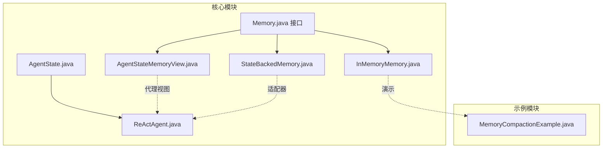
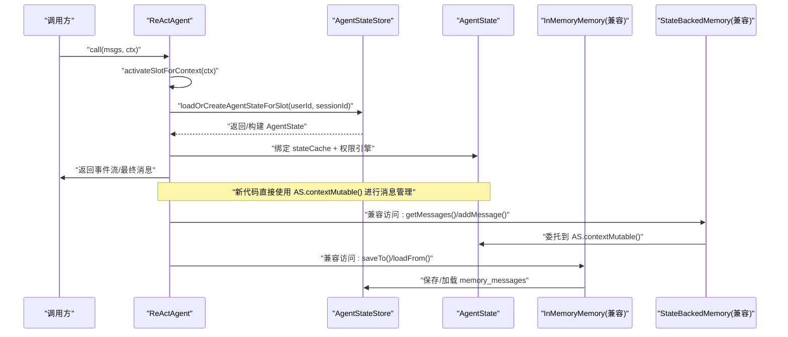
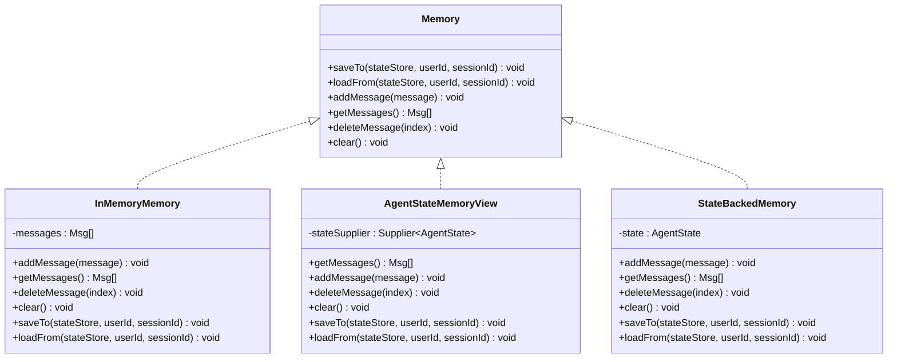
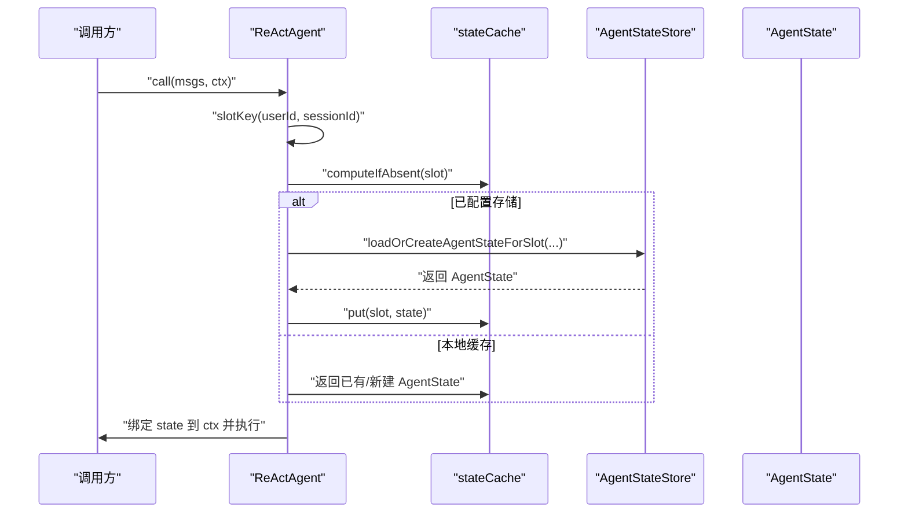
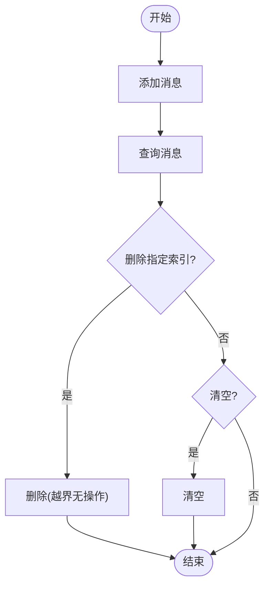
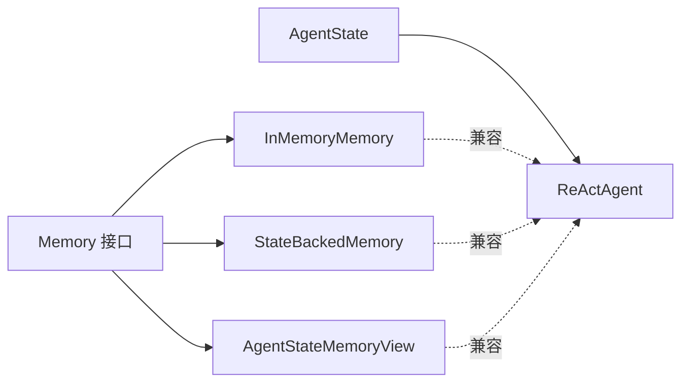

# 短期记忆

<cite>
**本文引用的文件**
- [InMemoryMemory.java](file://agentscope-core/src/main/java/io/agentscope/core/memory/InMemoryMemory.java)
- [Memory.java](file://agentscope-core/src/main/java/io/agentscope/core/memory/Memory.java)
- [AgentStateMemoryView.java](file://agentscope-core/src/main/java/io/agentscope/core/memory/AgentStateMemoryView.java)
- [StateBackedMemory.java](file://agentscope-core/src/main/java/io/agentscope/core/memory/StateBackedMemory.java)
- [AgentState.java](file://agentscope-core/src/main/java/io/agentscope/core/state/AgentState.java)
- [ReActAgent.java](file://agentscope-core/src/main/java/io/agentscope/core/ReActAgent.java)
- [InMemoryMemoryTest.java](file://agentscope-core/src/test/java/io/agentscope/core/legacy/memory/InMemoryMemoryTest.java)
- [InMemoryMemoryNewApiTest.java](file://agentscope-core/src/test/java/io/agentscope/core/legacy/memory/InMemoryMemoryNewApiTest.java)
- [MemoryCompactionExample.java](file://agentscope-examples/documentation/src/main/java/io/agentscope/examples/documentation2/harness/memory/MemoryCompactionExample.java)
- [LongTermMemory.java](file://agentscope-core/src/main/java/io/agentscope/core/memory/LongTermMemory.java)
</cite>

## 目录
1. [简介](#简介)
2. [项目结构](#项目结构)
3. [核心组件](#核心组件)
4. [架构总览](#架构总览)
5. [详细组件分析](#详细组件分析)
6. [依赖关系分析](#依赖关系分析)
7. [性能考虑](#性能考虑)
8. [故障排除指南](#故障排除指南)
9. [结论](#结论)
10. [附录](#附录)

## 简介
本文件聚焦于 AgentScope Java 的短期记忆系统，重点解析 InMemoryMemory 的内存存储实现机制，涵盖消息缓冲区管理、线程安全、持久化接口、生命周期管理（添加/删除/查询/清空）、与会话状态的关系，以及在 ReAct 代理中的作用。同时给出配置与使用指引、性能优化建议、内存监控与故障排除方法。

## 项目结构
短期记忆相关的核心代码位于 agentscope-core 模块的 memory 与 state 包中，并在 ReActAgent 中与会话状态集成。示例模块提供了压缩与长期记忆的联动演示。

**图表来源**
- [InMemoryMemory.java:37-134](file://agentscope-core/src/main/java/io/agentscope/core/memory/InMemoryMemory.java#L37-L134)
- [Memory.java:35-78](file://agentscope-core/src/main/java/io/agentscope/core/memory/Memory.java#L35-L78)
- [AgentStateMemoryView.java:43-86](file://agentscope-core/src/main/java/io/agentscope/core/memory/AgentStateMemoryView.java#L43-L86)
- [StateBackedMemory.java:36-79](file://agentscope-core/src/main/java/io/agentscope/core/memory/StateBackedMemory.java#L36-L79)
- [AgentState.java:59-423](file://agentscope-core/src/main/java/io/agentscope/core/state/AgentState.java#L59-L423)
- [ReActAgent.java:1-4305](file://agentscope-core/src/main/java/io/agentscope/core/ReActAgent.java#L1-L4305)
- [MemoryCompactionExample.java:51-163](file://agentscope-examples/documentation/src/main/java/io/agentscope/examples/documentation2/harness/memory/MemoryCompactionExample.java#L51-L163)

**章节来源**
- [InMemoryMemory.java:1-135](file://agentscope-core/src/main/java/io/agentscope/core/memory/InMemoryMemory.java#L1-L135)
- [Memory.java:1-79](file://agentscope-core/src/main/java/io/agentscope/core/memory/Memory.java#L1-L79)
- [AgentStateMemoryView.java:1-87](file://agentscope-core/src/main/java/io/agentscope/core/memory/AgentStateMemoryView.java#L1-L87)
- [StateBackedMemory.java:1-80](file://agentscope-core/src/main/java/io/agentscope/core/memory/StateBackedMemory.java#L1-L80)
- [AgentState.java:1-424](file://agentscope-core/src/main/java/io/agentscope/core/state/AgentState.java#L1-L424)
- [ReActAgent.java:1-4305](file://agentscope-core/src/main/java/io/agentscope/core/ReActAgent.java#L1-L4305)
- [MemoryCompactionExample.java:1-164](file://agentscope-examples/documentation/src/main/java/io/agentscope/examples/documentation2/harness/memory/MemoryCompactionExample.java#L1-L164)

## 核心组件
- InMemoryMemory：基于线程安全集合的内存短期记忆实现，提供消息增删查清与持久化接口。
- Memory 接口：定义短期记忆的标准能力（保存/加载、添加/获取/删除/清空）。
- AgentStateMemoryView：只读适配器，将 getMessages 代理到 AgentState 上下文，用于兼容旧版。
- StateBackedMemory：写入/读取委托给 AgentState.contextMutable() 的适配器，兼容旧版访问路径。
- AgentState：承载会话级上下文（context 列表）、摘要、权限等状态，是 2.0+ 的核心。
- ReActAgent：在每次调用中激活会话槽位并绑定 AgentState，短期记忆通过 AgentState 管理。

**章节来源**
- [InMemoryMemory.java:37-134](file://agentscope-core/src/main/java/io/agentscope/core/memory/InMemoryMemory.java#L37-L134)
- [Memory.java:35-78](file://agentscope-core/src/main/java/io/agentscope/core/memory/Memory.java#L35-L78)
- [AgentStateMemoryView.java:43-86](file://agentscope-core/src/main/java/io/agentscope/core/memory/AgentStateMemoryView.java#L43-L86)
- [StateBackedMemory.java:36-79](file://agentscope-core/src/main/java/io/agentscope/core/memory/StateBackedMemory.java#L36-L79)
- [AgentState.java:59-423](file://agentscope-core/src/main/java/io/agentscope/core/state/AgentState.java#L59-L423)
- [ReActAgent.java:437-478](file://agentscope-core/src/main/java/io/agentscope/core/ReActAgent.java#L437-L478)

## 架构总览
短期记忆在 2.0+ 版本中已迁移至 AgentState.contextMutable() 作为“真实”上下文，InMemoryMemory 仅保留兼容性用途（新代码应直接读写 AgentState.contextMutable()）。ReActAgent 在每次调用时根据 RuntimeContext 解析或回退会话标识，加载/缓存 AgentState 并绑定到当前调用作用域。

**图表来源**
- [ReActAgent.java:437-478](file://agentscope-core/src/main/java/io/agentscope/core/ReActAgent.java#L437-L478)
- [AgentState.java:59-423](file://agentscope-core/src/main/java/io/agentscope/core/state/AgentState.java#L59-L423)
- [StateBackedMemory.java:36-79](file://agentscope-core/src/main/java/io/agentscope/core/memory/StateBackedMemory.java#L36-L79)
- [InMemoryMemory.java:62-81](file://agentscope-core/src/main/java/io/agentscope/core/memory/InMemoryMemory.java#L62-L81)

## 详细组件分析

### InMemoryMemory 内存存储实现
- 数据结构
  - 使用线程安全的并发列表保存消息，支持高并发下的读一致性与写入安全。
  - 提供标准的短期记忆接口：添加、获取（过滤空值）、删除指定索引、清空。
- 持久化接口
  - saveTo/loadFrom 将完整消息列表保存到 AgentStateStore，键名固定，便于 v1 会话兼容。
  - 即使为空也会保存，确保清空状态可被持久化。
- 生命周期管理
  - 添加：线程安全追加。
  - 查询：返回非空消息副本，避免外部修改影响内部状态。
  - 删除：越界视为无操作，保证并发安全。
  - 清空：清空所有消息。
- 与会话状态的关系
  - 通过 AgentStateStore 与会话绑定，实现跨调用的记忆延续。
  - 新代码推荐直接使用 AgentState.contextMutable()，InMemoryMemory 主要用于兼容旧版。

**图表来源**
- [Memory.java:35-78](file://agentscope-core/src/main/java/io/agentscope/core/memory/Memory.java#L35-L78)
- [InMemoryMemory.java:37-134](file://agentscope-core/src/main/java/io/agentscope/core/memory/InMemoryMemory.java#L37-L134)
- [AgentStateMemoryView.java:43-86](file://agentscope-core/src/main/java/io/agentscope/core/memory/AgentStateMemoryView.java#L43-L86)
- [StateBackedMemory.java:36-79](file://agentscope-core/src/main/java/io/agentscope/core/memory/StateBackedMemory.java#L36-L79)

**章节来源**
- [InMemoryMemory.java:37-134](file://agentscope-core/src/main/java/io/agentscope/core/memory/InMemoryMemory.java#L37-L134)
- [Memory.java:35-78](file://agentscope-core/src/main/java/io/agentscope/core/memory/Memory.java#L35-L78)
- [InMemoryMemoryTest.java:38-177](file://agentscope-core/src/test/java/io/agentscope/core/legacy/memory/InMemoryMemoryTest.java#L38-L177)
- [InMemoryMemoryNewApiTest.java:51-113](file://agentscope-core/src/test/java/io/agentscope/core/legacy/memory/InMemoryMemoryNewApiTest.java#L51-L113)

### 与会话状态的关系与 ReAct 代理中的作用
- 会话槽位激活
  - ReActAgent 根据 RuntimeContext 解析 userId/sessionId，计算槽位键，加载或构建 AgentState 并缓存。
  - 若配置了 AgentStateStore，则每次调用都会从存储重新加载最新状态，保证分布式一致性。
- 上下文绑定
  - 将当前调用的 AgentState 绑定到 RuntimeContext，中间件/工具可通过 rc.getAgentState() 获取调用级上下文。
- 短期记忆集成
  - 新代码直接使用 AgentState.contextMutable() 追加/替换消息。
  - 兼容层提供 StateBackedMemory 与 AgentStateMemoryView，以保持旧版 API 可用性。

**图表来源**
- [ReActAgent.java:437-478](file://agentscope-core/src/main/java/io/agentscope/core/ReActAgent.java#L437-L478)
- [AgentState.java:59-423](file://agentscope-core/src/main/java/io/agentscope/core/state/AgentState.java#L59-L423)

**章节来源**
- [ReActAgent.java:437-478](file://agentscope-core/src/main/java/io/agentscope/core/ReActAgent.java#L437-L478)
- [AgentState.java:59-423](file://agentscope-core/src/main/java/io/agentscope/core/state/AgentState.java#L59-L423)

### 短期记忆生命周期与操作流程
- 添加消息
  - 新代码：直接在 AgentState.contextMutable() 追加。
  - 兼容层：通过 StateBackedMemory 或 InMemoryMemory 的 addMessage。
- 查询消息
  - 新代码：使用 AgentState.getContext() 获取不可变副本，或 contextMutable() 获取可变句柄。
  - 兼容层：AgentStateMemoryView.getMessages() 返回只读列表。
- 删除消息
  - 新代码：在 contextMutable() 上进行索引删除。
  - 兼容层：StateBackedMemory/InMemoryMemory 的 deleteMessage 对越界进行无操作保护。
- 清空消息
  - 新代码：contextMutable().clear()。
  - 兼容层：clear() 清空内部列表。

**图表来源**
- [InMemoryMemory.java:92-133](file://agentscope-core/src/main/java/io/agentscope/core/memory/InMemoryMemory.java#L92-L133)
- [StateBackedMemory.java:44-65](file://agentscope-core/src/main/java/io/agentscope/core/memory/StateBackedMemory.java#L44-L65)
- [AgentStateMemoryView.java:51-55](file://agentscope-core/src/main/java/io/agentscope/core/memory/AgentStateMemoryView.java#L51-L55)

**章节来源**
- [InMemoryMemory.java:92-133](file://agentscope-core/src/main/java/io/agentscope/core/memory/InMemoryMemory.java#L92-L133)
- [StateBackedMemory.java:44-65](file://agentscope-core/src/main/java/io/agentscope/core/memory/StateBackedMemory.java#L44-L65)
- [AgentStateMemoryView.java:51-55](file://agentscope-core/src/main/java/io/agentscope/core/memory/AgentStateMemoryView.java#L51-L55)

### 与压缩与长期记忆的关系
- 压缩（ConversationCompactor）
  - 仅作用于 AgentState.contextMutable() 的消息列表，不影响 Plan Mode、子任务、权限等状态。
  - 可配置触发阈值与保留数量，支持在压缩前 flush。
- 长期记忆（LongTermMemory）
  - 2.0+ 已移除，框架不再内置长期记忆；跨会话持久化需在应用层自行集成。
  - 示例展示了压缩与 per-call flush 的组合使用，帮助控制上下文长度与成本。

**章节来源**
- [LongTermMemory.java:66-68](file://agentscope-core/src/main/java/io/agentscope/core/memory/LongTermMemory.java#L66-L68)
- [MemoryCompactionExample.java:66-76](file://agentscope-examples/documentation/src/main/java/io/agentscope/examples/documentation2/harness/memory/MemoryCompactionExample.java#L66-L76)

## 依赖关系分析
- InMemoryMemory 实现 Memory 接口，提供线程安全的消息列表与持久化能力。
- AgentStateMemoryView 与 StateBackedMemory 作为兼容层，分别提供只读代理与写入委托。
- ReActAgent 通过 AgentStateStore 与 AgentState 管理会话级上下文，短期记忆通过 AgentState.contextMutable() 管理。

**图表来源**
- [Memory.java:35-78](file://agentscope-core/src/main/java/io/agentscope/core/memory/Memory.java#L35-L78)
- [InMemoryMemory.java:37-134](file://agentscope-core/src/main/java/io/agentscope/core/memory/InMemoryMemory.java#L37-L134)
- [AgentStateMemoryView.java:43-86](file://agentscope-core/src/main/java/io/agentscope/core/memory/AgentStateMemoryView.java#L43-L86)
- [StateBackedMemory.java:36-79](file://agentscope-core/src/main/java/io/agentscope/core/memory/StateBackedMemory.java#L36-L79)
- [AgentState.java:59-423](file://agentscope-core/src/main/java/io/agentscope/core/state/AgentState.java#L59-L423)
- [ReActAgent.java:437-478](file://agentscope-core/src/main/java/io/agentscope/core/ReActAgent.java#L437-L478)

**章节来源**
- [Memory.java:35-78](file://agentscope-core/src/main/java/io/agentscope/core/memory/Memory.java#L35-L78)
- [InMemoryMemory.java:37-134](file://agentscope-core/src/main/java/io/agentscope/core/memory/InMemoryMemory.java#L37-L134)
- [AgentStateMemoryView.java:43-86](file://agentscope-core/src/main/java/io/agentscope/core/memory/AgentStateMemoryView.java#L43-L86)
- [StateBackedMemory.java:36-79](file://agentscope-core/src/main/java/io/agentscope/core/memory/StateBackedMemory.java#L36-L79)
- [AgentState.java:59-423](file://agentscope-core/src/main/java/io/agentscope/core/state/AgentState.java#L59-L423)
- [ReActAgent.java:437-478](file://agentscope-core/src/main/java/io/agentscope/core/ReActAgent.java#L437-L478)

## 性能考虑
- 线程安全与并发
  - InMemoryMemory 使用并发列表，读多写少场景具备良好吞吐；频繁删除可能引发复制开销。
  - 建议优先使用 AgentState.contextMutable() 直接管理，减少额外封装层。
- 记忆长度控制
  - 结合压缩配置（触发消息数、保留数量）与 per-call flush 策略，降低上下文长度与 LLM 成本。
  - 示例展示了低阈值触发的压缩与每日 flush，适合演示与验证效果。
- 存储与序列化
  - saveTo/loadFrom 会序列化完整消息列表；对于超长会话，建议配合压缩与定期 offload，避免单次持久化过大。
- I/O 与异步
  - ReActAgent 的状态保存采用调度线程池异步执行，避免阻塞主调用链。

**章节来源**
- [InMemoryMemory.java:37-134](file://agentscope-core/src/main/java/io/agentscope/core/memory/InMemoryMemory.java#L37-L134)
- [MemoryCompactionExample.java:66-76](file://agentscope-examples/documentation/src/main/java/io/agentscope/examples/documentation2/harness/memory/MemoryCompactionExample.java#L66-L76)
- [ReActAgent.java:412-422](file://agentscope-core/src/main/java/io/agentscope/core/ReActAgent.java#L412-L422)

## 故障排除指南
- 空指针与越界
  - getMessages 会过滤空条目；deleteMessage 对越界索引无操作，避免异常。
  - 测试覆盖了空内存、越界删除、并发操作等边界场景。
- 持久化不生效
  - 确认已配置 AgentStateStore；若未配置，状态仅驻留内存。
  - saveTo/loadFrom 会覆盖目标内容，注意幂等性与增量保存策略。
- 兼容性问题
  - 新代码应直接使用 AgentState.contextMutable()；如需兼容旧版 API，请通过 StateBackedMemory 或 AgentStateMemoryView。
- 长度膨胀
  - 启用压缩与 per-call flush，合理设置触发阈值与保留数量，避免 context_length_exceeded。

**章节来源**
- [InMemoryMemoryTest.java:58-133](file://agentscope-core/src/test/java/io/agentscope/core/legacy/memory/InMemoryMemoryTest.java#L58-L133)
- [InMemoryMemoryNewApiTest.java:51-113](file://agentscope-core/src/test/java/io/agentscope/core/legacy/memory/InMemoryMemoryNewApiTest.java#L51-L113)
- [InMemoryMemory.java:92-133](file://agentscope-core/src/main/java/io/agentscope/core/memory/InMemoryMemory.java#L92-L133)

## 结论
- InMemoryMemory 为短期记忆提供了线程安全的内存实现与持久化接口，主要用于兼容旧版代码。
- 2.0+ 的短期记忆核心已迁移至 AgentState.contextMutable()，ReActAgent 在每次调用中负责会话槽位的加载与绑定。
- 建议新代码直接使用 AgentState 管理上下文，结合压缩与 flush 控制上下文长度与成本；长期记忆请在应用层自定义集成。

## 附录

### 配置与使用要点
- 直接使用 AgentState
  - 追加消息：在 contextMutable() 上添加。
  - 查询消息：使用 getContext() 获取不可变副本；需要可变句柄时使用 contextMutable()。
  - 删除/清空：在 contextMutable() 上进行索引删除或整体清空。
- 兼容旧版
  - 通过 StateBackedMemory 或 AgentStateMemoryView 访问短期记忆 API。
  - 使用 InMemoryMemory 的 saveTo/loadFrom 与 AgentStateStore 集成 v1 会话。

**章节来源**
- [AgentState.java:179-188](file://agentscope-core/src/main/java/io/agentscope/core/state/AgentState.java#L179-L188)
- [StateBackedMemory.java:44-65](file://agentscope-core/src/main/java/io/agentscope/core/memory/StateBackedMemory.java#L44-L65)
- [AgentStateMemoryView.java:51-55](file://agentscope-core/src/main/java/io/agentscope/core/memory/AgentStateMemoryView.java#L51-L55)
- [InMemoryMemory.java:62-81](file://agentscope-core/src/main/java/io/agentscope/core/memory/InMemoryMemory.java#L62-L81)