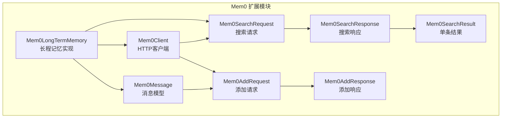
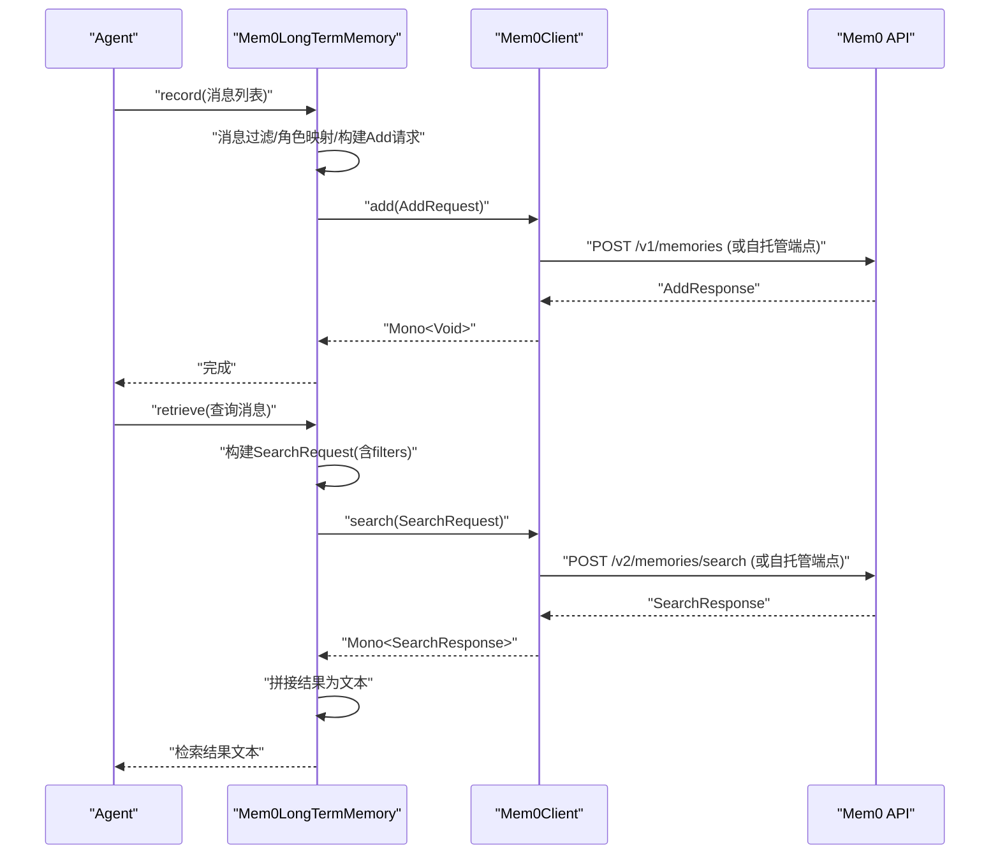
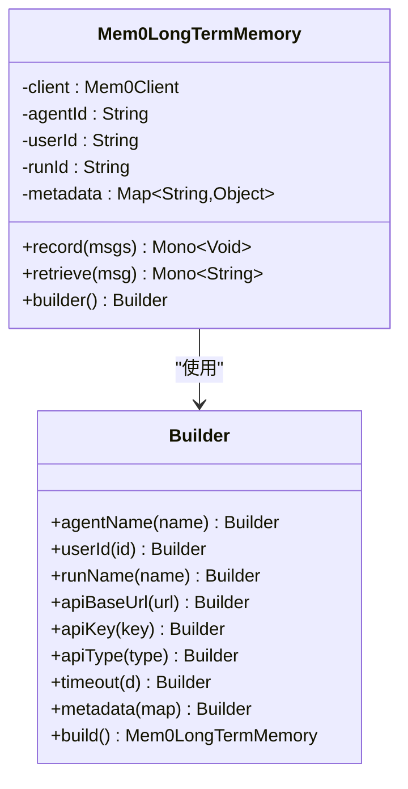
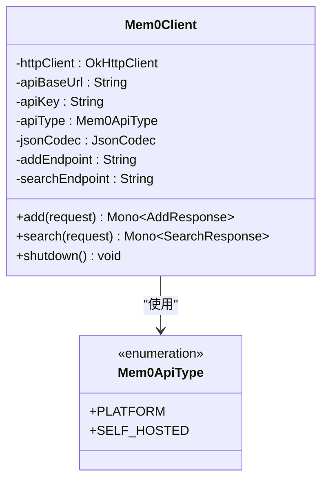
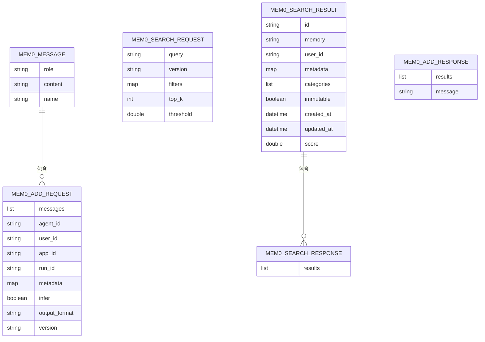
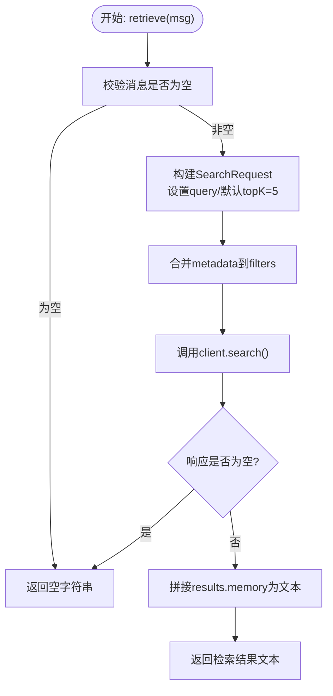
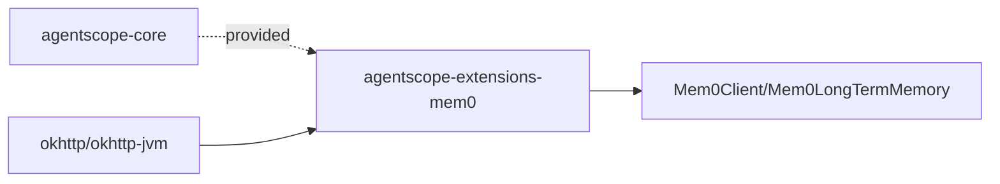

# Mem0向量记忆

<cite>
**本文引用的文件**   
- [Mem0LongTermMemory.java](file://agentscope-extensions/agentscope-extensions-mem/agentscope-extensions-mem0/src/main/java/io/agentscope/core/memory/mem0/Mem0LongTermMemory.java)
- [Mem0Client.java](file://agentscope-extensions/agentscope-extensions-mem/agentscope-extensions-mem0/src/main/java/io/agentscope/core/memory/mem0/Mem0Client.java)
- [Mem0Message.java](file://agentscope-extensions/agentscope-extensions-mem/agentscope-extensions-mem0/src/main/java/io/agentscope/core/memory/mem0/Mem0Message.java)
- [Mem0AddRequest.java](file://agentscope-extensions/agentscope-extensions-mem/agentscope-extensions-mem0/src/main/java/io/agentscope/core/memory/mem0/Mem0AddRequest.java)
- [Mem0SearchRequest.java](file://agentscope-extensions/agentscope-extensions-mem/agentscope-extensions-mem0/src/main/java/io/agentscope/core/memory/mem0/Mem0SearchRequest.java)
- [Mem0SearchResponse.java](file://agentscope-extensions/agentscope-extensions-mem/agentscope-extensions-mem0/src/main/java/io/agentscope/core/memory/mem0/Mem0SearchResponse.java)
- [Mem0SearchResult.java](file://agentscope-extensions/agentscope-extensions-mem/agentscope-extensions-mem0/src/main/java/io/agentscope/core/memory/mem0/Mem0SearchResult.java)
- [Mem0AddResponse.java](file://agentscope-extensions/agentscope-extensions-mem/agentscope-extensions-mem0/src/main/java/io/agentscope/core/memory/mem0/Mem0AddResponse.java)
- [Mem0ApiType.java](file://agentscope-extensions/agentscope-extensions-mem/agentscope-extensions-mem0/src/main/java/io/agentscope/core/memory/mem0/Mem0ApiType.java)
- [mem0.md](file://docs/v2/zh/integration/memory/mem0.md)
- [pom.xml](file://agentscope-extensions/agentscope-extensions-mem/agentscope-extensions-mem0/pom.xml)
- [Mem0LongTermMemoryTest.java](file://agentscope-extensions/agentscope-extensions-mem/agentscope-extensions-mem0/src/test/java/io/agentscope/core/memory/mem0/Mem0LongTermMemoryTest.java)
</cite>

## 目录
1. [简介](#简介)
2. [项目结构](#项目结构)
3. [核心组件](#核心组件)
4. [架构总览](#架构总览)
5. [组件详解](#组件详解)
6. [依赖关系分析](#依赖关系分析)
7. [性能考量](#性能考量)
8. [故障排除指南](#故障排除指南)
9. [结论](#结论)
10. [附录](#附录)

## 简介
本文件面向在AgentScope Java中集成Mem0向量记忆系统的开发者，系统性阐述Mem0LongTermMemory的实现原理与最佳实践，覆盖以下主题：
- 向量嵌入生成与向量数据库存储：通过Mem0的LLM推理抽取“可记忆”信息并持久化
- 语义检索机制：基于v2搜索接口的语义相似度检索
- Mem0Client配置要点：API类型、鉴权头、超时、平台/自托管端点差异
- 在ReActAgent中的完整集成：消息格式转换、索引构建、查询优化
- 故障排除、性能监控与成本控制建议

## 项目结构
Mem0扩展模块位于agentscope-extensions-mem0，核心类围绕“消息模型—请求/响应—HTTP客户端—长程记忆实现”的层次组织。

图表来源
- [Mem0Message.java:1-129](file://agentscope-extensions/agentscope-extensions-mem/agentscope-extensions-mem0/src/main/java/io/agentscope/core/memory/mem0/Mem0Message.java#L1-129)
- [Mem0AddRequest.java:1-469](file://agentscope-extensions/agentscope-extensions-mem/agentscope-extensions-mem0/src/main/java/io/agentscope/core/memory/mem0/Mem0AddRequest.java#L1-469)
- [Mem0SearchRequest.java:1-366](file://agentscope-extensions/agentscope-extensions-mem/agentscope-extensions-mem0/src/main/java/io/agentscope/core/memory/mem0/Mem0SearchRequest.java#L1-366)
- [Mem0SearchResponse.java:1-62](file://agentscope-extensions/agentscope-extensions-mem/agentscope-extensions-mem0/src/main/java/io/agentscope/core/memory/mem0/Mem0SearchResponse.java#L1-62)
- [Mem0SearchResult.java:1-225](file://agentscope-extensions/agentscope-extensions-mem/agentscope-extensions-mem0/src/main/java/io/agentscope/core/memory/mem0/Mem0SearchResult.java#L1-225)
- [Mem0AddResponse.java:1-79](file://agentscope-extensions/agentscope-extensions-mem/agentscope-extensions-mem0/src/main/java/io/agentscope/core/memory/mem0/Mem0AddResponse.java#L1-79)
- [Mem0Client.java:1-280](file://agentscope-extensions/agentscope-extensions-mem/agentscope-extensions-mem0/src/main/java/io/agentscope/core/memory/mem0/Mem0Client.java#L1-280)
- [Mem0LongTermMemory.java:1-440](file://agentscope-extensions/agentscope-extensions-mem/agentscope-extensions-mem0/src/main/java/io/agentscope/core/memory/mem0/Mem0LongTermMemory.java#L1-440)

章节来源
- [mem0.md:1-107](file://docs/v2/zh/integration/memory/mem0.md#L1-L107)

## 核心组件
- Mem0Message：消息载体，携带角色与内容，用于记录与检索
- Mem0AddRequest/Mem0AddResponse：记录记忆的请求/响应模型
- Mem0SearchRequest/Mem0SearchResponse/Mem0SearchResult：检索记忆的请求/响应模型
- Mem0Client：HTTP客户端，封装平台/自托管端点与鉴权头差异
- Mem0LongTermMemory：长程记忆实现，负责消息格式转换、检索构建、调用客户端

章节来源
- [Mem0Message.java:1-129](file://agentscope-extensions/agentscope-extensions-mem/agentscope-extensions-mem0/src/main/java/io/agentscope/core/memory/mem0/Mem0Message.java#L1-129)
- [Mem0AddRequest.java:1-469](file://agentscope-extensions/agentscope-extensions-mem/agentscope-extensions-mem0/src/main/java/io/agentscope/core/memory/mem0/Mem0AddRequest.java#L1-469)
- [Mem0SearchRequest.java:1-366](file://agentscope-extensions/agentscope-extensions-mem/agentscope-extensions-mem0/src/main/java/io/agentscope/core/memory/mem0/Mem0SearchRequest.java#L1-366)
- [Mem0SearchResponse.java:1-62](file://agentscope-extensions/agentscope-extensions-mem/agentscope-extensions-mem0/src/main/java/io/agentscope/core/memory/mem0/Mem0SearchResponse.java#L1-62)
- [Mem0SearchResult.java:1-225](file://agentscope-extensions/agentscope-extensions-mem/agentscope-extensions-mem0/src/main/java/io/agentscope/core/memory/mem0/Mem0SearchResult.java#L1-225)
- [Mem0AddResponse.java:1-79](file://agentscope-extensions/agentscope-extensions-mem/agentscope-extensions-mem0/src/main/java/io/agentscope/core/memory/mem0/Mem0AddResponse.java#L1-79)
- [Mem0Client.java:1-280](file://agentscope-extensions/agentscope-extensions-mem/agentscope-extensions-mem0/src/main/java/io/agentscope/core/memory/mem0/Mem0Client.java#L1-280)
- [Mem0LongTermMemory.java:1-440](file://agentscope-extensions/agentscope-extensions-mem/agentscope-extensions-mem0/src/main/java/io/agentscope/core/memory/mem0/Mem0LongTermMemory.java#L1-440)

## 架构总览
Mem0LongTermMemory以Reactive方式编排“记录—检索”流程，内部通过Mem0Client调用Mem0 API，完成消息到可记忆片段的抽取与语义检索。

图表来源
- [Mem0LongTermMemory.java:156-292](file://agentscope-extensions/agentscope-extensions-mem/agentscope-extensions-mem0/src/main/java/io/agentscope/core/memory/mem0/Mem0LongTermMemory.java#L156-L292)
- [Mem0Client.java:222-267](file://agentscope-extensions/agentscope-extensions-mem/agentscope-extensions-mem0/src/main/java/io/agentscope/core/memory/mem0/Mem0Client.java#L222-L267)
- [Mem0AddRequest.java:37-125](file://agentscope-extensions/agentscope-extensions-mem/agentscope-extensions-mem0/src/main/java/io/agentscope/core/memory/mem0/Mem0AddRequest.java#L37-L125)
- [Mem0SearchRequest.java:37-90](file://agentscope-extensions/agentscope-extensions-mem/agentscope-extensions-mem0/src/main/java/io/agentscope/core/memory/mem0/Mem0SearchRequest.java#L37-L90)

## 组件详解

### Mem0LongTermMemory：长程记忆实现
- 多租户隔离：通过agentId、userId、runId与自定义metadata组合形成filters，确保检索仅返回匹配上下文的记忆
- 消息格式转换：将Agent消息转换为Mem0Message，角色映射遵循规则
- 记录流程：过滤空内容与压缩历史标记，构造Add请求并调用客户端
- 检索流程：构建SearchRequest，合并metadata为filters，调用客户端后聚合结果

图表来源
- [Mem0LongTermMemory.java:113-438](file://agentscope-extensions/agentscope-extensions-mem/agentscope-extensions-mem0/src/main/java/io/agentscope/core/memory/mem0/Mem0LongTermMemory.java#L113-L438)

章节来源
- [Mem0LongTermMemory.java:156-292](file://agentscope-extensions/agentscope-extensions-mem/agentscope-extensions-mem0/src/main/java/io/agentscope/core/memory/mem0/Mem0LongTermMemory.java#L156-L292)

### Mem0Client：HTTP客户端
- 平台/自托管端点与鉴权头差异：根据Mem0ApiType选择端点与头部
- 响应兼容：search接口同时兼容v1.0数组与v1.1对象两种响应格式
- 超时与调度：基于OkHttp配置连接/读/写超时，并在弹性调度器上执行IO

图表来源
- [Mem0Client.java:44-120](file://agentscope-extensions/agentscope-extensions-mem/agentscope-extensions-mem0/src/main/java/io/agentscope/core/memory/mem0/Mem0Client.java#L44-L120)
- [Mem0ApiType.java:18-52](file://agentscope-extensions/agentscope-extensions-mem/agentscope-extensions-mem0/src/main/java/io/agentscope/core/memory/mem0/Mem0ApiType.java#L18-L52)

章节来源
- [Mem0Client.java:135-267](file://agentscope-extensions/agentscope-extensions-mem/agentscope-extensions-mem0/src/main/java/io/agentscope/core/memory/mem0/Mem0Client.java#L135-L267)

### 数据模型与消息格式
- Mem0Message：role/content/name
- Mem0AddRequest：messages+多租户标识+metadata+输出格式等
- Mem0SearchRequest：query/version/filters/topK/threshold等
- Mem0SearchResponse/SearchResult：results列表与单条字段
- Mem0AddResponse：results/message

图表来源
- [Mem0AddRequest.java:37-280](file://agentscope-extensions/agentscope-extensions-mem/agentscope-extensions-mem0/src/main/java/io/agentscope/core/memory/mem0/Mem0AddRequest.java#L37-L280)
- [Mem0Message.java:30-92](file://agentscope-extensions/agentscope-extensions-mem/agentscope-extensions-mem0/src/main/java/io/agentscope/core/memory/mem0/Mem0Message.java#L30-L92)
- [Mem0SearchRequest.java:37-180](file://agentscope-extensions/agentscope-extensions-mem/agentscope-extensions-mem0/src/main/java/io/agentscope/core/memory/mem0/Mem0SearchRequest.java#L37-L180)
- [Mem0SearchResponse.java:33-52](file://agentscope-extensions/agentscope-extensions-mem/agentscope-extensions-mem0/src/main/java/io/agentscope/core/memory/mem0/Mem0SearchResponse.java#L33-L52)
- [Mem0SearchResult.java:44-200](file://agentscope-extensions/agentscope-extensions-mem/agentscope-extensions-mem0/src/main/java/io/agentscope/core/memory/mem0/Mem0SearchResult.java#L44-L200)
- [Mem0AddResponse.java:36-66](file://agentscope-extensions/agentscope-extensions-mem/agentscope-extensions-mem0/src/main/java/io/agentscope/core/memory/mem0/Mem0AddResponse.java#L36-L66)

章节来源
- [Mem0Message.java:18-129](file://agentscope-extensions/agentscope-extensions-mem/agentscope-extensions-mem0/src/main/java/io/agentscope/core/memory/mem0/Mem0Message.java#L18-L129)
- [Mem0AddRequest.java:18-469](file://agentscope-extensions/agentscope-extensions-mem/agentscope-extensions-mem0/src/main/java/io/agentscope/core/memory/mem0/Mem0AddRequest.java#L18-L469)
- [Mem0SearchRequest.java:18-366](file://agentscope-extensions/agentscope-extensions-mem/agentscope-extensions-mem0/src/main/java/io/agentscope/core/memory/mem0/Mem0SearchRequest.java#L18-L366)
- [Mem0SearchResponse.java:18-62](file://agentscope-extensions/agentscope-extensions-mem/agentscope-extensions-mem0/src/main/java/io/agentscope/core/memory/mem0/Mem0SearchResponse.java#L18-L62)
- [Mem0SearchResult.java:18-225](file://agentscope-extensions/agentscope-extensions-mem/agentscope-extensions-mem0/src/main/java/io/agentscope/core/memory/mem0/Mem0SearchResult.java#L18-L225)
- [Mem0AddResponse.java:18-79](file://agentscope-extensions/agentscope-extensions-mem/agentscope-extensions-mem0/src/main/java/io/agentscope/core/memory/mem0/Mem0AddResponse.java#L18-L79)

### 检索流程与查询优化
- 检索入口：retrieve接收消息，提取文本作为查询
- 构建请求：默认topK=5；将agentId/userId/runId与metadata合并为filters
- 结果聚合：按顺序拼接memory字段为字符串；异常时返回空串

图表来源
- [Mem0LongTermMemory.java:268-292](file://agentscope-extensions/agentscope-extensions-mem/agentscope-extensions-mem0/src/main/java/io/agentscope/core/memory/mem0/Mem0LongTermMemory.java#L268-L292)
- [Mem0SearchRequest.java:82-90](file://agentscope-extensions/agentscope-extensions-mem/agentscope-extensions-mem0/src/main/java/io/agentscope/core/memory/mem0/Mem0SearchRequest.java#L82-L90)

章节来源
- [Mem0LongTermMemory.java:239-292](file://agentscope-extensions/agentscope-extensions-mem/agentscope-extensions-mem0/src/main/java/io/agentscope/core/memory/mem0/Mem0LongTermMemory.java#L239-L292)

### 在ReActAgent中的集成
- 依赖引入：agentscope-extensions-mem0
- 构造Mem0LongTermMemory：指定apiBaseUrl、apiKey、apiType、agentName/userId/runName、metadata、timeout
- 绑定到Agent：将memory注入ReActAgent，并设置LongTermMemoryMode.BOTH以启用记录与检索
- 使用方式：Agent正常调用，记忆在record/retrieve之间自动往返

章节来源
- [mem0.md:11-45](file://docs/v2/zh/integration/memory/mem0.md#L11-L45)
- [Mem0LongTermMemory.java:55-108](file://agentscope-extensions/agentscope-extensions-mem/agentscope-extensions-mem0/src/main/java/io/agentscope/core/memory/mem0/Mem0LongTermMemory.java#L55-L108)

## 依赖关系分析
- 模块依赖：agentscope-extensions-mem0依赖agentscope-core（provided），并引入OkHttp用于HTTP通信
- 运行时耦合：Mem0LongTermMemory强依赖Mem0Client；Mem0Client依赖OkHttp与Json工具

图表来源
- [pom.xml:33-49](file://agentscope-extensions/agentscope-extensions-mem/agentscope-extensions-mem0/pom.xml#L33-L49)

章节来源
- [pom.xml:18-51](file://agentscope-extensions/agentscope-extensions-mem/agentscope-extensions-mem0/pom.xml#L18-L51)

## 性能考量
- 异步非阻塞：记录与检索均在Reactor Mono中执行，避免阻塞主线程
- 线程调度：HTTP IO在bounded elastic调度器上执行，降低资源占用
- 超时配置：可通过Builder设置timeout，平衡延迟与稳定性
- 检索参数：合理设置topK与threshold，减少无效往返；filters精确匹配可降低检索范围
- 批量插入：当前实现逐批发送消息，若需更高吞吐可在应用层合并消息批次后调用record

章节来源
- [Mem0Client.java:135-186](file://agentscope-extensions/agentscope-extensions-mem/agentscope-extensions-mem0/src/main/java/io/agentscope/core/memory/mem0/Mem0Client.java#L135-L186)
- [Mem0SearchRequest.java:52-71](file://agentscope-extensions/agentscope-extensions-mem/agentscope-extensions-mem0/src/main/java/io/agentscope/core/memory/mem0/Mem0SearchRequest.java#L52-L71)
- [Mem0LongTermMemory.java:246-254](file://agentscope-extensions/agentscope-extensions-mem/agentscope-extensions-mem0/src/main/java/io/agentscope/core/memory/mem0/Mem0LongTermMemory.java#L246-L254)

## 故障排除指南
- 构建失败（缺少必要参数）
  - 现象：构建时抛出IllegalArgumentException，提示至少需要提供agentName/userId/runName之一
  - 处理：补齐任一标识符；确认apiBaseUrl非空
  - 参考
    - [Mem0LongTermMemory.java:149-153](file://agentscope-extensions/agentscope-extensions-mem/agentscope-extensions-mem0/src/main/java/io/agentscope/core/memory/mem0/Mem0LongTermMemory.java#L149-L153)
    - [Mem0LongTermMemoryTest.java:94-103](file://agentscope-extensions/agentscope-extensions-mem/agentscope-extensions-mem0/src/test/java/io/agentscope/core/memory/mem0/Mem0LongTermMemoryTest.java#L94-L103)
- HTTP错误
  - 现象：执行add/search时报错，包含状态码与错误体
  - 处理：检查apiKey与apiType是否匹配；确认网络可达；查看服务端日志
  - 参考
    - [Mem0Client.java:160-183](file://agentscope-extensions/agentscope-extensions-mem/agentscope-extensions-mem0/src/main/java/io/agentscope/core/memory/mem0/Mem0Client.java#L160-L183)
- 响应格式不兼容
  - 现象：search返回数组而非对象导致解析异常
  - 处理：代码已兼容两种格式；如仍异常，请检查服务端版本与返回体
  - 参考
    - [Mem0Client.java:250-266](file://agentscope-extensions/agentscope-extensions-mem/agentscope-extensions-mem0/src/main/java/io/agentscope/core/memory/mem0/Mem0Client.java#L250-L266)
- 记录无结果
  - 现象：record成功但retrieve返回空
  - 处理：检查filters是否正确合并；确认metadata一致；调整threshold
  - 参考
    - [Mem0LongTermMemory.java:279-291](file://agentscope-extensions/agentscope-extensions-mem/agentscope-extensions-mem0/src/main/java/io/agentscope/core/memory/mem0/Mem0LongTermMemory.java#L279-L291)

章节来源
- [Mem0LongTermMemoryTest.java:94-127](file://agentscope-extensions/agentscope-extensions-mem/agentscope-extensions-mem0/src/test/java/io/agentscope/core/memory/mem0/Mem0LongTermMemoryTest.java#L94-L127)
- [Mem0Client.java:160-183](file://agentscope-extensions/agentscope-extensions-mem/agentscope-extensions-mem0/src/main/java/io/agentscope/core/memory/mem0/Mem0Client.java#L160-L183)

## 结论
Mem0LongTermMemory在AgentScope中提供了开箱即用的向量记忆能力：通过清晰的消息模型、灵活的多租户filters与兼容的检索响应，实现了从“事实记忆”到“语义检索”的闭环。结合合理的检索参数与超时配置，可在保证性能的同时获得稳定的检索效果。

## 附录

### 配置参数与最佳实践
- 基础参数
  - apiBaseUrl：Mem0服务地址（必填）
  - apiKey：API密钥；平台使用Token头，自托管使用X-API-Key头
  - apiType：Mem0ApiType（默认PLATFORM）
  - agentName/userId/runName：至少提供其一
  - metadata：自定义过滤键值对
  - timeout：HTTP请求超时
- 检索参数
  - topK：返回数量上限（默认5）
  - threshold：最小相似度阈值（默认0.3）
  - filters：由上述ID与metadata自动合并
- 记录参数
  - infer：是否启用LLM抽取（默认true）
  - output_format：v1.1（推荐）
  - async_mode：异步处理（默认true）

章节来源
- [mem0.md:93-106](file://docs/v2/zh/integration/memory/mem0.md#L93-L106)
- [Mem0SearchRequest.java:52-71](file://agentscope-extensions/agentscope-extensions-mem/agentscope-extensions-mem0/src/main/java/io/agentscope/core/memory/mem0/Mem0SearchRequest.java#L52-L71)
- [Mem0AddRequest.java:67-90](file://agentscope-extensions/agentscope-extensions-mem/agentscope-extensions-mem0/src/main/java/io/agentscope/core/memory/mem0/Mem0AddRequest.java#L67-L90)