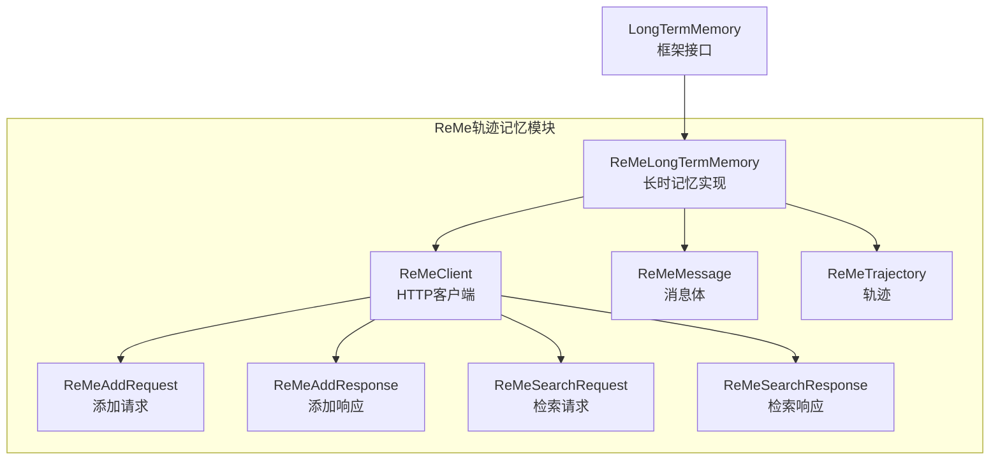
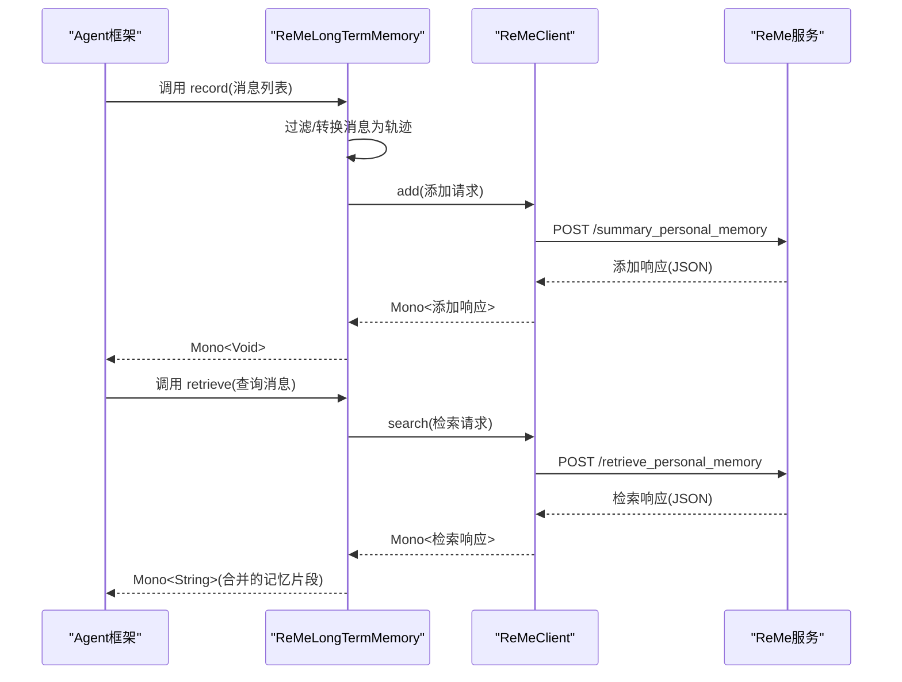
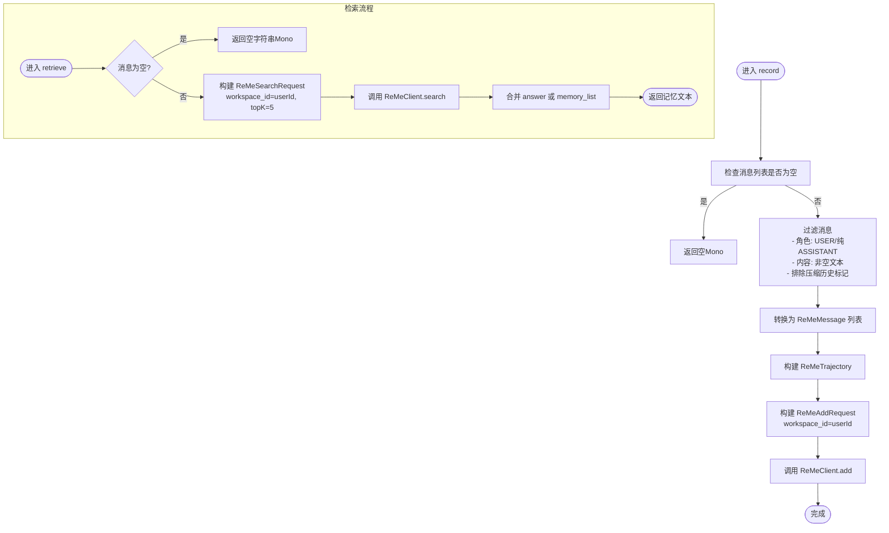
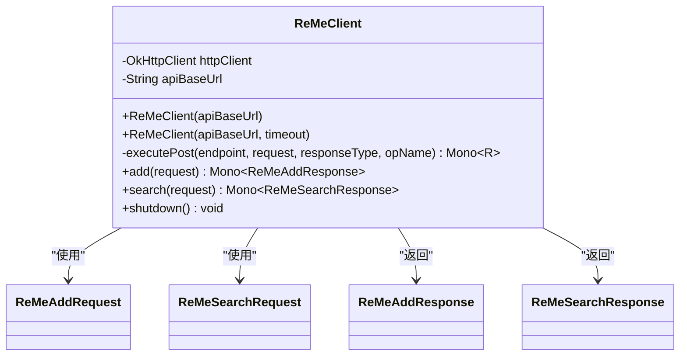
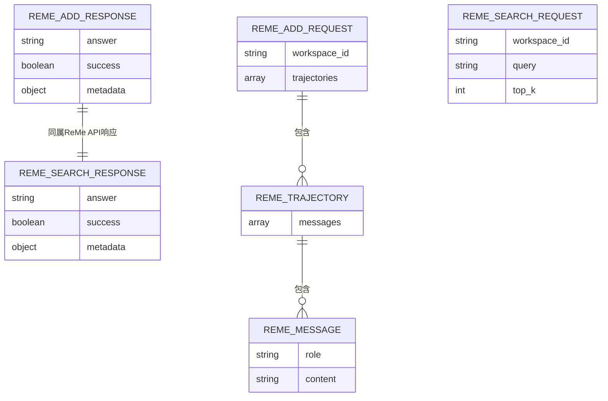
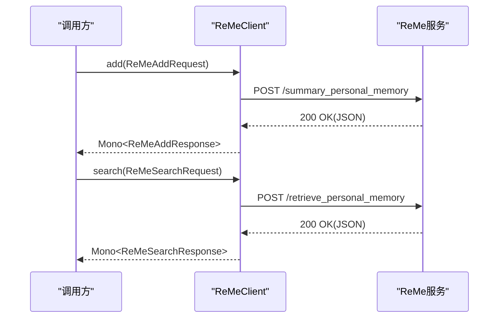
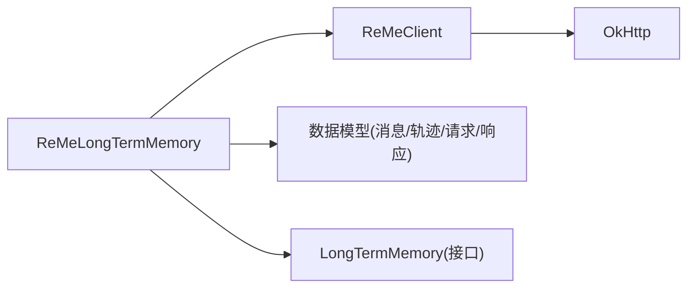

# ReMe轨迹记忆

<cite>
**本文引用的文件**
- [ReMeLongTermMemory.java](file://agentscope-extensions/agentscope-extensions-mem/agentscope-extensions-reme/src/main/java/io/agentscope/core/memory/reme/ReMeLongTermMemory.java)
- [ReMeClient.java](file://agentscope-extensions/agentscope-extensions-mem/agentscope-extensions-reme/src/main/java/io/agentscope/core/memory/reme/ReMeClient.java)
- [ReMeTrajectory.java](file://agentscope-extensions/agentscope-extensions-mem/agentscope-extensions-reme/src/main/java/io/agentscope/core/memory/reme/ReMeTrajectory.java)
- [ReMeMessage.java](file://agentscope-extensions/agentscope-extensions-mem/agentscope-extensions-reme/src/main/java/io/agentscope/core/memory/reme/ReMeMessage.java)
- [ReMeAddRequest.java](file://agentscope-extensions/agentscope-extensions-mem/agentscope-extensions-reme/src/main/java/io/agentscope/core/memory/reme/ReMeAddRequest.java)
- [ReMeAddResponse.java](file://agentscope-extensions/agentscope-extensions-mem/agentscope-extensions-reme/src/main/java/io/agentscope/core/memory/reme/ReMeAddResponse.java)
- [ReMeSearchRequest.java](file://agentscope-extensions/agentscope-extensions-mem/agentscope-extensions-reme/src/main/java/io/agentscope/core/memory/reme/ReMeSearchRequest.java)
- [ReMeSearchResponse.java](file://agentscope-extensions/agentscope-extensions-mem/agentscope-extensions-reme/src/main/java/io/agentscope/core/memory/reme/ReMeSearchResponse.java)
- [LongTermMemory.java](file://agentscope-core/src/main/java/io/agentscope/core/memory/LongTermMemory.java)
- [ReMeLongTermMemoryTest.java](file://agentscope-extensions/agentscope-extensions-mem/agentscope-extensions-reme/src/test/java/io/agentscope/core/memory/reme/ReMeLongTermMemoryTest.java)
- [ReMeClientTest.java](file://agentscope-extensions/agentscope-extensions-mem/agentscope-extensions-reme/src/test/java/io/agentscope/core/memory/reme/ReMeClientTest.java)
</cite>

## 目录
1. [简介](#简介)
2. [项目结构](#项目结构)
3. [核心组件](#核心组件)
4. [架构总览](#架构总览)
5. [详细组件分析](#详细组件分析)
6. [依赖关系分析](#依赖关系分析)
7. [性能考虑](#性能考虑)
8. [故障排查指南](#故障排查指南)
9. [结论](#结论)
10. [附录](#附录)

## 简介
本文件面向ReMe轨迹记忆系统的开发者与集成者，系统化阐述ReMeLongTermMemory在对话历史记录、用户行为分析与交互模式识别方面的独特能力，并深入解析ReMeClient的轨迹管理API、事件序列处理与状态机转换流程。文档同时提供轨迹数据分析的实现思路（如用户偏好建模、个性化推荐、异常检测），并覆盖轨迹存储格式、压缩算法建议、查询优化策略、隐私保护与数据脱敏、合规性要求及性能优化技巧。

## 项目结构
ReMe轨迹记忆模块位于扩展模块中，围绕长时记忆接口进行ReMe后端适配，核心文件组织如下：
- ReMeLongTermMemory：面向框架的长时记忆实现，负责消息过滤、轨迹构建与调用ReMeClient。
- ReMeClient：ReMe API的HTTP客户端，封装添加与检索两个核心端点。
- 数据模型：ReMeMessage、ReMeTrajectory、ReMeAddRequest/Response、ReMeSearchRequest/Response。
- 接口契约：LongTermMemory（框架抽象）。
- 测试：ReMeLongTermMemoryTest、ReMeClientTest，验证请求构造、响应解析与错误处理。

图表来源
- [ReMeLongTermMemory.java:66-307](file://agentscope-extensions/agentscope-extensions-mem/agentscope-extensions-reme/src/main/java/io/agentscope/core/memory/reme/ReMeLongTermMemory.java#L66-L307)
- [ReMeClient.java:33-178](file://agentscope-extensions/agentscope-extensions-mem/agentscope-extensions-reme/src/main/java/io/agentscope/core/memory/reme/ReMeClient.java#L33-L178)
- [ReMeMessage.java:26-96](file://agentscope-extensions/agentscope-extensions-mem/agentscope-extensions-reme/src/main/java/io/agentscope/core/memory/reme/ReMeMessage.java#L26-L96)
- [ReMeTrajectory.java:27-78](file://agentscope-extensions/agentscope-extensions-mem/agentscope-extensions-reme/src/main/java/io/agentscope/core/memory/reme/ReMeTrajectory.java#L27-L78)
- [ReMeAddRequest.java:28-99](file://agentscope-extensions/agentscope-extensions-mem/agentscope-extensions-reme/src/main/java/io/agentscope/core/memory/reme/ReMeAddRequest.java#L28-L99)
- [ReMeAddResponse.java:43-315](file://agentscope-extensions/agentscope-extensions-mem/agentscope-extensions-reme/src/main/java/io/agentscope/core/memory/reme/ReMeAddResponse.java#L43-L315)
- [ReMeSearchRequest.java:27-120](file://agentscope-extensions/agentscope-extensions-mem/agentscope-extensions-reme/src/main/java/io/agentscope/core/memory/reme/ReMeSearchRequest.java#L27-L120)
- [ReMeSearchResponse.java:47-274](file://agentscope-extensions/agentscope-extensions-mem/agentscope-extensions-reme/src/main/java/io/agentscope/core/memory/reme/ReMeSearchResponse.java#L47-L274)
- [LongTermMemory.java:71-112](file://agentscope-core/src/main/java/io/agentscope/core/memory/LongTermMemory.java#L71-L112)

章节来源
- [ReMeLongTermMemory.java:28-65](file://agentscope-extensions/agentscope-extensions-mem/agentscope-extensions-reme/src/main/java/io/agentscope/core/memory/reme/ReMeLongTermMemory.java#L28-L65)
- [LongTermMemory.java:22-69](file://agentscope-core/src/main/java/io/agentscope/core/memory/LongTermMemory.java#L22-L69)

## 核心组件
- ReMeLongTermMemory：实现框架长时记忆接口，负责将Msg列表转换为ReMeMessage轨迹，过滤无效消息，调用ReMeClient完成添加与检索。
- ReMeClient：封装OkHttp异步请求，统一JSON序列化/反序列化与错误处理，暴露add与search两个Mono接口。
- 数据模型：标准化ReMe API输入输出，确保与后端协议一致。
- 接口契约：LongTermMemory定义record/retrieve的异步语义，便于与Agent框架集成。

章节来源
- [ReMeLongTermMemory.java:66-307](file://agentscope-extensions/agentscope-extensions-mem/agentscope-extensions-reme/src/main/java/io/agentscope/core/memory/reme/ReMeLongTermMemory.java#L66-L307)
- [ReMeClient.java:33-178](file://agentscope-extensions/agentscope-extensions-mem/agentscope-extensions-reme/src/main/java/io/agentscope/core/memory/reme/ReMeClient.java#L33-L178)
- [LongTermMemory.java:71-112](file://agentscope-core/src/main/java/io/agentscope/core/memory/LongTermMemory.java#L71-L112)

## 架构总览
ReMe轨迹记忆采用“框架适配层 + HTTP客户端 + 数据模型”的分层设计，核心交互通过ReMeClient完成，ReMeLongTermMemory承担消息预处理与工作区隔离职责。

图表来源
- [ReMeLongTermMemory.java:108-244](file://agentscope-extensions/agentscope-extensions-mem/agentscope-extensions-reme/src/main/java/io/agentscope/core/memory/reme/ReMeLongTermMemory.java#L108-L244)
- [ReMeClient.java:145-165](file://agentscope-extensions/agentscope-extensions-mem/agentscope-extensions-reme/src/main/java/io/agentscope/core/memory/reme/ReMeClient.java#L145-L165)
- [ReMeAddRequest.java:28-99](file://agentscope-extensions/agentscope-extensions-mem/agentscope-extensions-reme/src/main/java/io/agentscope/core/memory/reme/ReMeAddRequest.java#L28-L99)
- [ReMeSearchRequest.java:27-120](file://agentscope-extensions/agentscope-extensions-mem/agentscope-extensions-reme/src/main/java/io/agentscope/core/memory/reme/ReMeSearchRequest.java#L27-L120)
- [ReMeAddResponse.java:43-315](file://agentscope-extensions/agentscope-extensions-mem/agentscope-extensions-reme/src/main/java/io/agentscope/core/memory/reme/ReMeAddResponse.java#L43-L315)
- [ReMeSearchResponse.java:47-274](file://agentscope-extensions/agentscope-extensions-mem/agentscope-extensions-reme/src/main/java/io/agentscope/core/memory/reme/ReMeSearchResponse.java#L47-L274)

## 详细组件分析

### ReMeLongTermMemory：轨迹管理与状态机
- 消息过滤与角色映射：仅保留USER/纯ASSISTANT消息，排除含工具调用的ASSISTANT消息、空文本与压缩历史标记的消息。
- 轨迹构建：将过滤后的消息组装为单条轨迹，设置工作区ID（userId映射为workspace_id）。
- 添加流程：调用ReMeClient.add，返回Mono<Void>表示完成。
- 检索流程：以消息文本为查询词，调用ReMeClient.search，优先使用answer字段，否则拼接memory_list中的content。
- 错误处理：检索失败时回退为空字符串，保证非阻塞。

图表来源
- [ReMeLongTermMemory.java:108-244](file://agentscope-extensions/agentscope-extensions-mem/agentscope-extensions-reme/src/main/java/io/agentscope/core/memory/reme/ReMeLongTermMemory.java#L108-L244)

章节来源
- [ReMeLongTermMemory.java:87-195](file://agentscope-extensions/agentscope-extensions-mem/agentscope-extensions-reme/src/main/java/io/agentscope/core/memory/reme/ReMeLongTermMemory.java#L87-L195)
- [ReMeLongTermMemory.java:197-244](file://agentscope-extensions/agentscope-extensions-mem/agentscope-extensions-reme/src/main/java/io/agentscope/core/memory/reme/ReMeLongTermMemory.java#L197-L244)

### ReMeClient：ReMe API客户端
- 统一端点：/summary_personal_memory（添加）、/retrieve_personal_memory（检索）。
- 异步执行：使用bounded elastic调度器在线程池中执行HTTP请求，避免阻塞。
- 错误处理：非成功状态码抛出IO异常，包含状态码与响应体摘要；空响应体或空字符串返回空对象。
- 资源释放：提供shutdown方法关闭调度线程池与连接池。

图表来源
- [ReMeClient.java:33-178](file://agentscope-extensions/agentscope-extensions-mem/agentscope-extensions-reme/src/main/java/io/agentscope/core/memory/reme/ReMeClient.java#L33-L178)
- [ReMeAddRequest.java:28-99](file://agentscope-extensions/agentscope-extensions-mem/agentscope-extensions-reme/src/main/java/io/agentscope/core/memory/reme/ReMeAddRequest.java#L28-L99)
- [ReMeSearchRequest.java:27-120](file://agentscope-extensions/agentscope-extensions-mem/agentscope-extensions-reme/src/main/java/io/agentscope/core/memory/reme/ReMeSearchRequest.java#L27-L120)
- [ReMeAddResponse.java:43-315](file://agentscope-extensions/agentscope-extensions-mem/agentscope-extensions-reme/src/main/java/io/agentscope/core/memory/reme/ReMeAddResponse.java#L43-L315)
- [ReMeSearchResponse.java:47-274](file://agentscope-extensions/agentscope-extensions-mem/agentscope-extensions-reme/src/main/java/io/agentscope/core/memory/reme/ReMeSearchResponse.java#L47-L274)

章节来源
- [ReMeClient.java:84-131](file://agentscope-extensions/agentscope-extensions-mem/agentscope-extensions-reme/src/main/java/io/agentscope/core/memory/reme/ReMeClient.java#L84-L131)
- [ReMeClient.java:145-165](file://agentscope-extensions/agentscope-extensions-mem/agentscope-extensions-reme/src/main/java/io/agentscope/core/memory/reme/ReMeClient.java#L145-L165)

### 数据模型：轨迹与消息
- ReMeMessage：role/content，支持用户与助手两类角色。
- ReMeTrajectory：由多个ReMeMessage组成的一次对话序列。
- 请求/响应：ReMeAddRequest/Response、ReMeSearchRequest/Response，包含workspace_id、top_k、answer、metadata.memory_list等字段。

图表来源
- [ReMeAddRequest.java:28-99](file://agentscope-extensions/agentscope-extensions-mem/agentscope-extensions-reme/src/main/java/io/agentscope/core/memory/reme/ReMeAddRequest.java#L28-L99)
- [ReMeAddResponse.java:43-315](file://agentscope-extensions/agentscope-extensions-mem/agentscope-extensions-reme/src/main/java/io/agentscope/core/memory/reme/ReMeAddResponse.java#L43-L315)
- [ReMeSearchRequest.java:27-120](file://agentscope-extensions/agentscope-extensions-mem/agentscope-extensions-reme/src/main/java/io/agentscope/core/memory/reme/ReMeSearchRequest.java#L27-L120)
- [ReMeSearchResponse.java:47-274](file://agentscope-extensions/agentscope-extensions-mem/agentscope-extensions-reme/src/main/java/io/agentscope/core/memory/reme/ReMeSearchResponse.java#L47-L274)
- [ReMeMessage.java:26-96](file://agentscope-extensions/agentscope-extensions-mem/agentscope-extensions-reme/src/main/java/io/agentscope/core/memory/reme/ReMeMessage.java#L26-L96)
- [ReMeTrajectory.java:27-78](file://agentscope-extensions/agentscope-extensions-mem/agentscope-extensions-reme/src/main/java/io/agentscope/core/memory/reme/ReMeTrajectory.java#L27-L78)

章节来源
- [ReMeMessage.java:26-96](file://agentscope-extensions/agentscope-extensions-mem/agentscope-extensions-reme/src/main/java/io/agentscope/core/memory/reme/ReMeMessage.java#L26-L96)
- [ReMeTrajectory.java:27-78](file://agentscope-extensions/agentscope-extensions-mem/agentscope-extensions-reme/src/main/java/io/agentscope/core/memory/reme/ReMeTrajectory.java#L27-L78)
- [ReMeAddRequest.java:28-99](file://agentscope-extensions/agentscope-extensions-mem/agentscope-extensions-reme/src/main/java/io/agentscope/core/memory/reme/ReMeAddRequest.java#L28-L99)
- [ReMeSearchRequest.java:27-120](file://agentscope-extensions/agentscope-extensions-mem/agentscope-extensions-reme/src/main/java/io/agentscope/core/memory/reme/ReMeSearchRequest.java#L27-L120)

### API工作流：添加与检索
- 添加流程：构建轨迹 → 组装请求 → 发送POST → 解析响应 → 返回结果。
- 检索流程：构建查询 → 发送POST → 解析响应 → 合并answer或memory_list → 返回文本。

图表来源
- [ReMeClient.java:145-165](file://agentscope-extensions/agentscope-extensions-mem/agentscope-extensions-reme/src/main/java/io/agentscope/core/memory/reme/ReMeClient.java#L145-L165)
- [ReMeAddRequest.java:28-99](file://agentscope-extensions/agentscope-extensions-mem/agentscope-extensions-reme/src/main/java/io/agentscope/core/memory/reme/ReMeAddRequest.java#L28-L99)
- [ReMeSearchRequest.java:27-120](file://agentscope-extensions/agentscope-extensions-mem/agentscope-extensions-reme/src/main/java/io/agentscope/core/memory/reme/ReMeSearchRequest.java#L27-L120)
- [ReMeAddResponse.java:43-315](file://agentscope-extensions/agentscope-extensions-mem/agentscope-extensions-reme/src/main/java/io/agentscope/core/memory/reme/ReMeAddResponse.java#L43-L315)
- [ReMeSearchResponse.java:47-274](file://agentscope-extensions/agentscope-extensions-mem/agentscope-extensions-reme/src/main/java/io/agentscope/core/memory/reme/ReMeSearchResponse.java#L47-L274)

## 依赖关系分析
- ReMeLongTermMemory依赖ReMeClient与数据模型，实现消息到轨迹的转换与工作区隔离。
- ReMeClient依赖OkHttp与JSON工具，封装HTTP细节。
- LongTermMemory作为框架接口，定义record/retrieve的异步契约。

图表来源
- [ReMeLongTermMemory.java:66-85](file://agentscope-extensions/agentscope-extensions-mem/agentscope-extensions-reme/src/main/java/io/agentscope/core/memory/reme/ReMeLongTermMemory.java#L66-L85)
- [ReMeClient.java:33-68](file://agentscope-extensions/agentscope-extensions-mem/agentscope-extensions-reme/src/main/java/io/agentscope/core/memory/reme/ReMeClient.java#L33-L68)
- [LongTermMemory.java:71-112](file://agentscope-core/src/main/java/io/agentscope/core/memory/LongTermMemory.java#L71-L112)

章节来源
- [ReMeLongTermMemory.java:66-85](file://agentscope-extensions/agentscope-extensions-mem/agentscope-extensions-reme/src/main/java/io/agentscope/core/memory/reme/ReMeLongTermMemory.java#L66-L85)
- [ReMeClient.java:33-68](file://agentscope-extensions/agentscope-extensions-mem/agentscope-extensions-reme/src/main/java/io/agentscope/core/memory/reme/ReMeClient.java#L33-L68)
- [LongTermMemory.java:71-112](file://agentscope-core/src/main/java/io/agentscope/core/memory/LongTermMemory.java#L71-L112)

## 性能考虑
- 异步非阻塞：ReMeClient在bounded elastic调度器上执行网络请求，避免主线程阻塞。
- 响应合并：检索时优先使用answer，其次拼接memory_list，减少下游处理复杂度。
- 过滤策略：在record阶段剔除无效消息，降低网络负载与后端处理开销。
- 超时配置：支持自定义读超时，平衡延迟与稳定性。
- 批量与分页：当前实现按轨迹批量提交；检索可结合topK控制返回规模。

章节来源
- [ReMeClient.java:57-67](file://agentscope-extensions/agentscope-extensions-mem/agentscope-extensions-reme/src/main/java/io/agentscope/core/memory/reme/ReMeClient.java#L57-L67)
- [ReMeClient.java:130-131](file://agentscope-extensions/agentscope-extensions-mem/agentscope-extensions-reme/src/main/java/io/agentscope/core/memory/reme/ReMeClient.java#L130-L131)
- [ReMeLongTermMemory.java:225-243](file://agentscope-extensions/agentscope-extensions-mem/agentscope-extensions-reme/src/main/java/io/agentscope/core/memory/reme/ReMeLongTermMemory.java#L225-L243)

## 故障排查指南
- 构造参数校验：userId与apiBaseUrl必填，空值将触发IllegalArgumentException。
- HTTP错误：非成功状态码会抛出IO异常，包含状态码与响应体摘要，便于定位问题。
- 空响应：空响应体或空字符串将被解析为空对象，避免上游崩溃。
- 请求体验证：测试用例验证请求包含workspace_id与trajectories/query/top_k等关键字段。
- 资源释放：不再使用时调用shutdown释放线程池与连接池资源。

章节来源
- [ReMeLongTermMemory.java:74-84](file://agentscope-extensions/agentscope-extensions-mem/agentscope-extensions-reme/src/main/java/io/agentscope/core/memory/reme/ReMeLongTermMemory.java#L74-L84)
- [ReMeClient.java:100-128](file://agentscope-extensions/agentscope-extensions-mem/agentscope-extensions-reme/src/main/java/io/agentscope/core/memory/reme/ReMeClient.java#L100-L128)
- [ReMeClientTest.java:184-200](file://agentscope-extensions/agentscope-extensions-mem/agentscope-extensions-reme/src/test/java/io/agentscope/core/memory/reme/ReMeClientTest.java#L184-L200)
- [ReMeLongTermMemoryTest.java:675-684](file://agentscope-extensions/agentscope-extensions-mem/agentscope-extensions-reme/src/test/java/io/agentscope/core/memory/reme/ReMeLongTermMemoryTest.java#L675-L684)

## 结论
ReMe轨迹记忆通过清晰的分层设计与严格的契约约束，实现了对对话历史的高效记录与检索。ReMeLongTermMemory专注于消息过滤与轨迹构建，ReMeClient专注HTTP通信与错误处理，二者配合满足了多租户工作区隔离、异步非阻塞与可维护性的需求。结合测试用例与接口规范，该实现为后续的用户偏好建模、个性化推荐与异常检测提供了可靠的数据基础。

## 附录

### 轨迹数据分析与应用示例（实现思路）
- 用户偏好建模
  - 输入：检索返回的记忆片段（answer或memory_list内容）。
  - 处理：基于关键词、when_to_use、metadata等字段提取偏好特征向量。
  - 输出：偏好向量与置信度，用于个性化提示注入。
- 个性化推荐
  - 输入：偏好向量 + 当前上下文。
  - 处理：相似度匹配或轻量分类器生成候选推荐。
  - 输出：推荐项列表与理由。
- 异常检测
  - 输入：近期轨迹与检索结果。
  - 处理：统计异常模式（如频繁变更when_to_use、低score记忆）。
  - 输出：异常告警与重检建议。

### 轨迹存储格式与查询优化
- 存储格式
  - 轨迹：数组形式的ReMeTrajectory，每条包含有序ReMeMessage列表。
  - 元数据：memory_list中的content、when_to_use、score、time_created等字段可用于排序与筛选。
- 查询优化
  - topK：限制返回数量，平衡召回与性能。
  - answer优先：优先使用answer字段减少下游拼接成本。
  - 缓存：对高频查询结果进行短期缓存（需结合业务场景评估）。

### 隐私保护与合规性
- 数据最小化：仅记录USER/纯ASSISTANT消息，过滤工具调用与空内容。
- 工作区隔离：通过workspace_id实现多租户隔离，避免交叉污染。
- 脱敏策略：对敏感信息（如时间、作者）在前端展示层进行脱敏处理（参考项目中活动日志脱敏实践思路）。
- 合规性：遵循数据最小化原则与访问控制策略，确保符合GDPR/CCPA等法规要求。