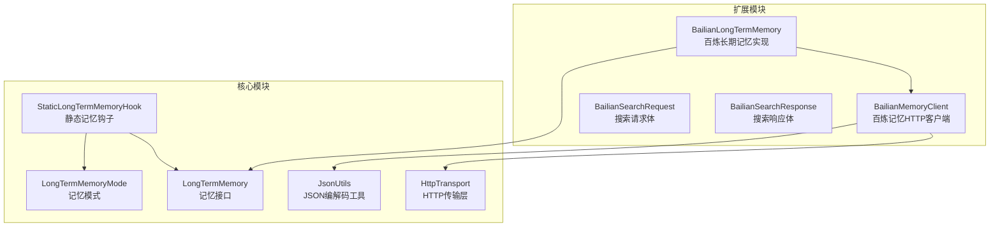
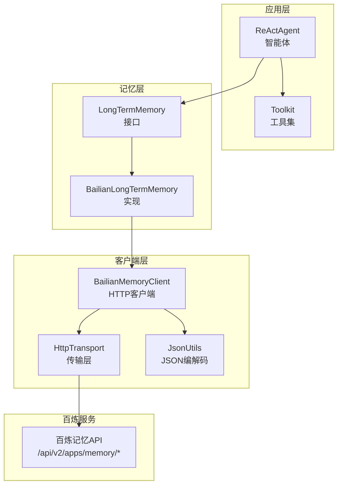
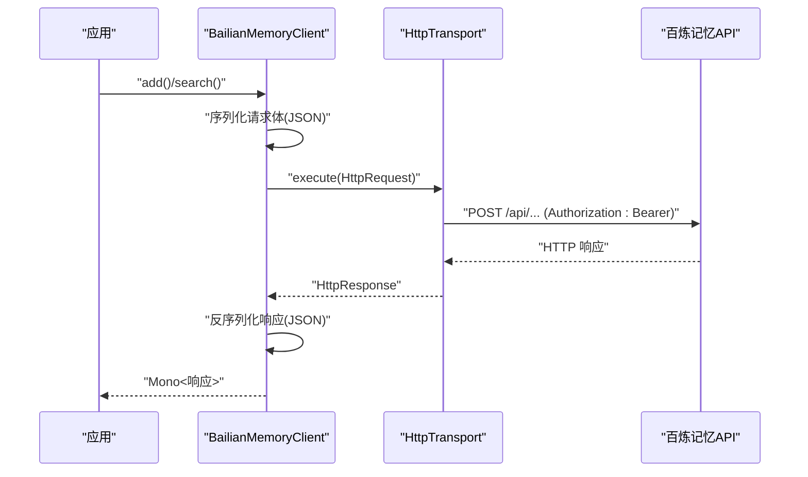
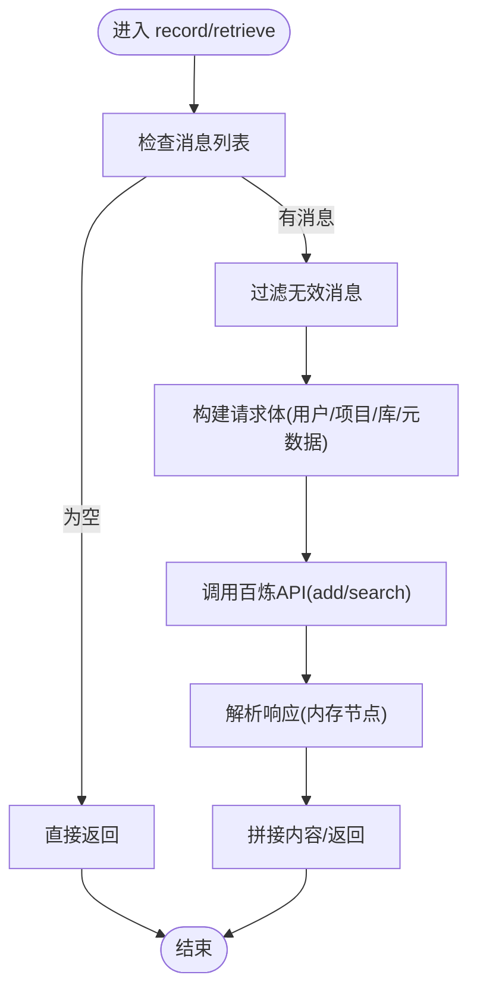
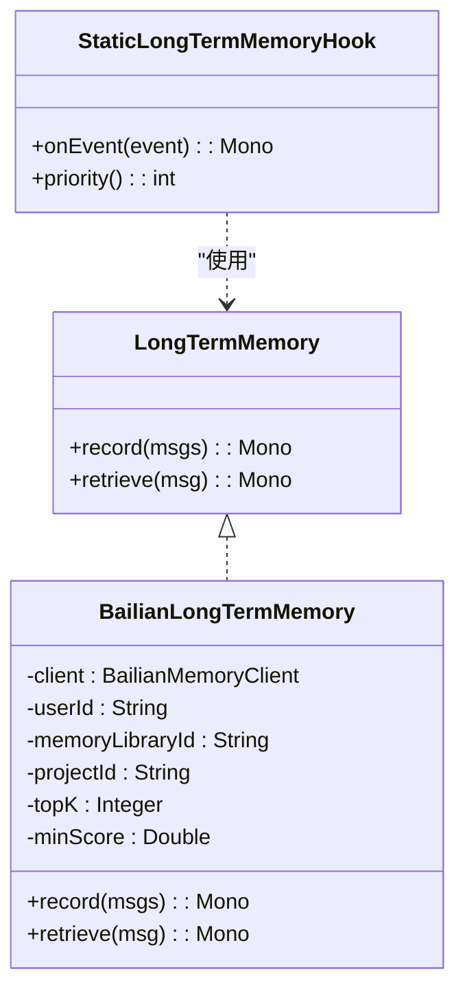
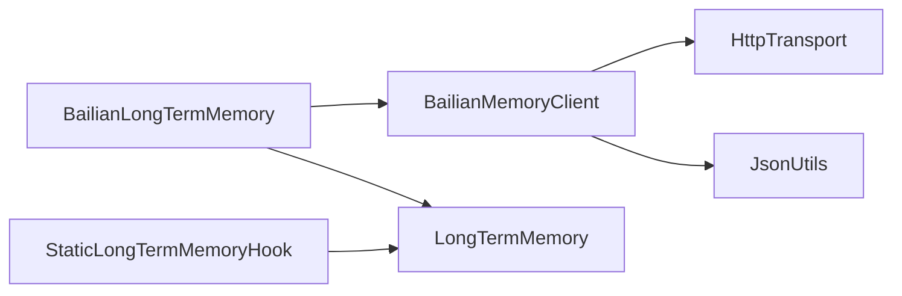
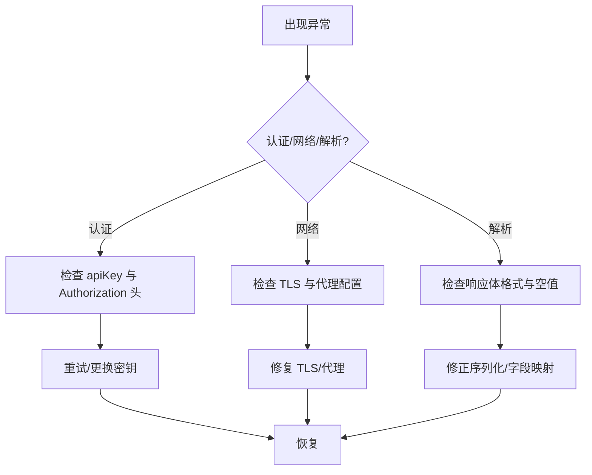

# 百炼企业记忆

<cite>
**本文引用的文件**   
- [BailianMemoryClient.java](file://agentscope-extensions/agentscope-extensions-mem/agentscope-extensions-memory-bailian/src/main/java/io/agentscope/core/memory/bailian/BailianMemoryClient.java)
- [BailianLongTermMemory.java](file://agentscope-extensions/agentscope-extensions-mem/agentscope-extensions-memory-bailian/src/main/java/io/agentscope/core/memory/bailian/BailianLongTermMemory.java)
- [BailianSearchRequest.java](file://agentscope-extensions/agentscope-extensions-mem/agentscope-extensions-memory-bailian/src/main/java/io/agentscope/core/memory/bailian/BailianSearchRequest.java)
- [BailianSearchResponse.java](file://agentscope-extensions/agentscope-extensions-mem/agentscope-extensions-memory-bailian/src/main/java/io/agentscope/core/memory/bailian/BailianSearchResponse.java)
- [LongTermMemory.java](file://agentscope-core/src/main/java/io/agentscope/core/memory/LongTermMemory.java)
- [LongTermMemoryMode.java](file://agentscope-core/src/main/java/io/agentscope/core/memory/LongTermMemoryMode.java)
- [StaticLongTermMemoryHook.java](file://agentscope-core/src/main/java/io/agentscope/core/memory/StaticLongTermMemoryHook.java)
- [HttpTransport.java](file://agentscope-core/src/main/java/io/agentscope/core/model/transport/HttpTransport.java)
- [JsonUtils.java](file://agentscope-core/src/main/java/io/agentscope/core/util/JsonUtils.java)
- [memory.md](file://docs/v1/zh/docs/task/memory.md)
- [overview.md](file://docs/v2/zh/integration/rag/overview.md)
- [rag.md](file://docs/v1/zh/docs/task/rag.md)
- [BailianMemoryClientTest.java](file://agentscope-extensions/agentscope-extensions-mem/agentscope-extensions-memory-bailian/src/test/java/io/agentscope/core/memory/bailian/BailianMemoryClientTest.java)
- [BailianSearchResponseTest.java](file://agentscope-extensions/agentscope-extensions-mem/agentscope-extensions-memory-bailian/src/test/java/io/agentscope/core/memory/bailian/BailianSearchResponseTest.java)
- [NacosAgentRegistry.java](file://agentscope-extensions/agentscope-extensions-nacos/agentscope-extensions-nacos-a2a/src/main/java/io/agentscope/core/nacos/a2a/registry/NacosAgentRegistry.java)
- [DeploymentProperties.java](file://agentscope-extensions/agentscope-extensions-protocol/agentscope-extensions-a2a/agentscope-extensions-a2a-server/src/main/java/io/agentscope/core/a2a/server/transport/DeploymentProperties.java)
- [AgentCardConverterUtil.java](file://agentscope-extensions/agentscope-extensions-nacos/agentscope-extensions-nacos-a2a/src/main/java/io/agentscope/core/nacos/a2a/utils/AgentCardConverterUtil.java)
</cite>

## 目录
1. [简介](#简介)
2. [项目结构](#项目结构)
3. [核心组件](#核心组件)
4. [架构总览](#架构总览)
5. [组件详解](#组件详解)
6. [依赖关系分析](#依赖关系分析)
7. [性能与容量规划](#性能与容量规划)
8. [企业级安全与合规](#企业级安全与合规)
9. [部署与运维指南](#部署与运维指南)
10. [故障排查](#故障排查)
11. [结论](#结论)
12. [附录](#附录)

## 简介
本技术文档聚焦于百炼企业级记忆系统在 Agentscope Java 中的实现与应用，围绕以下目标展开：
- 全面介绍 BailianLongTermMemory 的企业级特性：大规模知识存储、多租户隔离、语义检索、LLM 辅助记忆提取。
- 深入解析 BailianMemoryClient 的认证机制、API 网关配置、数据加密传输路径。
- 提供企业环境下的部署指南：集群配置、负载均衡、高可用架构建议。
- 说明知识图谱构建、实体识别、关系抽取等高级能力在百炼生态中的定位与使用方式。
- 给出企业级监控指标、审计日志、性能基准测试与容量规划建议。

## 项目结构
本项目采用模块化组织，百炼记忆相关代码位于扩展模块中，核心抽象与通用传输层位于核心模块中。关键目录与文件如下：
- 扩展模块：agentscope-extensions-memory-bailian
  - 客户端与记忆实现：BailianMemoryClient、BailianLongTermMemory、请求/响应对象
- 核心模块：agentscope-core
  - 记忆接口与模式：LongTermMemory、LongTermMemoryMode、StaticLongTermMemoryHook
  - 传输层与序列化：HttpTransport、JsonUtils
- 文档：docs/v1/zh/docs/task/memory.md、docs/v2/zh/integration/rag/overview.md、docs/v1/zh/docs/task/rag.md
- 测试：BailianMemoryClientTest、BailianSearchResponseTest

**图表来源**
- [BailianMemoryClient.java:67-268](file://agentscope-extensions/agentscope-extensions-mem/agentscope-extensions-memory-bailian/src/main/java/io/agentscope/core/memory/bailian/BailianMemoryClient.java#L67-L268)
- [BailianLongTermMemory.java:77-492](file://agentscope-extensions/agentscope-extensions-mem/agentscope-extensions-memory-bailian/src/main/java/io/agentscope/core/memory/bailian/BailianLongTermMemory.java#L77-L492)
- [LongTermMemory.java:71-112](file://agentscope-core/src/main/java/io/agentscope/core/memory/LongTermMemory.java#L71-L112)
- [LongTermMemoryMode.java:54-71](file://agentscope-core/src/main/java/io/agentscope/core/memory/LongTermMemoryMode.java#L54-L71)
- [StaticLongTermMemoryHook.java:78-301](file://agentscope-core/src/main/java/io/agentscope/core/memory/StaticLongTermMemoryHook.java#L78-L301)
- [HttpTransport.java:33-63](file://agentscope-core/src/main/java/io/agentscope/core/model/transport/HttpTransport.java#L33-L63)
- [JsonUtils.java:49-153](file://agentscope-core/src/main/java/io/agentscope/core/util/JsonUtils.java#L49-L153)

**章节来源**
- [BailianMemoryClient.java:67-268](file://agentscope-extensions/agentscope-extensions-mem/agentscope-extensions-memory-bailian/src/main/java/io/agentscope/core/memory/bailian/BailianMemoryClient.java#L67-L268)
- [BailianLongTermMemory.java:77-492](file://agentscope-extensions/agentscope-extensions-mem/agentscope-extensions-memory-bailian/src/main/java/io/agentscope/core/memory/bailian/BailianLongTermMemory.java#L77-L492)
- [LongTermMemory.java:71-112](file://agentscope-core/src/main/java/io/agentscope/core/memory/LongTermMemory.java#L71-L112)
- [LongTermMemoryMode.java:54-71](file://agentscope-core/src/main/java/io/agentscope/core/memory/LongTermMemoryMode.java#L54-L71)
- [StaticLongTermMemoryHook.java:78-301](file://agentscope-core/src/main/java/io/agentscope/core/memory/StaticLongTermMemoryHook.java#L78-L301)
- [HttpTransport.java:33-63](file://agentscope-core/src/main/java/io/agentscope/core/model/transport/HttpTransport.java#L33-L63)
- [JsonUtils.java:49-153](file://agentscope-core/src/main/java/io/agentscope/core/util/JsonUtils.java#L49-L153)

## 核心组件
- BailianMemoryClient：面向百炼记忆 API 的 HTTP 客户端，负责添加记忆与语义检索，支持自定义 HTTP 传输与 JSON 序列化。
- BailianLongTermMemory：基于百炼服务的长期记忆实现，封装记录与检索流程，支持多租户参数与检索阈值配置。
- 请求/响应模型：BailianSearchRequest、BailianSearchResponse 等，承载百炼 API 的输入输出结构。
- 核心抽象：LongTermMemory、LongTermMemoryMode、StaticLongTermMemoryHook，提供框架级的记忆集成与自动注入能力。
- 传输与序列化：HttpTransport 抽象传输层；JsonUtils 提供全局 JSON 编解码访问点。

**章节来源**
- [BailianMemoryClient.java:67-268](file://agentscope-extensions/agentscope-extensions-mem/agentscope-extensions-memory-bailian/src/main/java/io/agentscope/core/memory/bailian/BailianMemoryClient.java#L67-L268)
- [BailianLongTermMemory.java:77-492](file://agentscope-extensions/agentscope-extensions-mem/agentscope-extensions-memory-bailian/src/main/java/io/agentscope/core/memory/bailian/BailianLongTermMemory.java#L77-L492)
- [BailianSearchRequest.java:28-40](file://agentscope-extensions/agentscope-extensions-mem/agentscope-extensions-memory-bailian/src/main/java/io/agentscope/core/memory/bailian/BailianSearchRequest.java#L28-L40)
- [BailianSearchResponse.java:30-40](file://agentscope-extensions/agentscope-extensions-mem/agentscope-extensions-memory-bailian/src/main/java/io/agentscope/core/memory/bailian/BailianSearchResponse.java#L30-L40)
- [LongTermMemory.java:71-112](file://agentscope-core/src/main/java/io/agentscope/core/memory/LongTermMemory.java#L71-L112)
- [LongTermMemoryMode.java:54-71](file://agentscope-core/src/main/java/io/agentscope/core/memory/LongTermMemoryMode.java#L54-L71)
- [StaticLongTermMemoryHook.java:78-301](file://agentscope-core/src/main/java/io/agentscope/core/memory/StaticLongTermMemoryHook.java#L78-L301)
- [HttpTransport.java:33-63](file://agentscope-core/src/main/java/io/agentscope/core/model/transport/HttpTransport.java#L33-L63)
- [JsonUtils.java:49-153](file://agentscope-core/src/main/java/io/agentscope/core/util/JsonUtils.java#L49-L153)

## 架构总览
百炼企业记忆在框架中的位置与交互如下：

**图表来源**
- [BailianLongTermMemory.java:77-492](file://agentscope-extensions/agentscope-extensions-mem/agentscope-extensions-memory-bailian/src/main/java/io/agentscope/core/memory/bailian/BailianLongTermMemory.java#L77-L492)
- [BailianMemoryClient.java:67-268](file://agentscope-extensions/agentscope-extensions-mem/agentscope-extensions-memory-bailian/src/main/java/io/agentscope/core/memory/bailian/BailianMemoryClient.java#L67-L268)
- [HttpTransport.java:33-63](file://agentscope-core/src/main/java/io/agentscope/core/model/transport/HttpTransport.java#L33-L63)
- [JsonUtils.java:49-153](file://agentscope-core/src/main/java/io/agentscope/core/util/JsonUtils.java#L49-L153)

## 组件详解

### BailianMemoryClient：认证、网关与传输
- 认证机制
  - 使用 Authorization 头传递 Bearer Token，Token 来源于 apiKey 配置。
  - 默认基础 URL 指向百炼服务域名，可通过 Builder 自定义。
- API 网关配置
  - 支持自定义 HttpTransport，便于替换底层实现或注入代理、TLS 等。
  - 支持自定义 JSON 编解码器，便于适配不同序列化需求。
- 数据加密传输
  - 通过 HttpTransport 层抽象，结合 TLS 支持（如 OkHttp 传输），确保请求在传输层加密。
- 错误处理
  - 对非成功状态码抛出 IO 异常；对空响应体进行校验；统一映射为 IO 异常以便上层处理。

**图表来源**
- [BailianMemoryClient.java:144-195](file://agentscope-extensions/agentscope-extensions-mem/agentscope-extensions-memory-bailian/src/main/java/io/agentscope/core/memory/bailian/BailianMemoryClient.java#L144-L195)
- [HttpTransport.java:33-63](file://agentscope-core/src/main/java/io/agentscope/core/model/transport/HttpTransport.java#L33-L63)
- [JsonUtils.java:49-153](file://agentscope-core/src/main/java/io/agentscope/core/util/JsonUtils.java#L49-L153)

**章节来源**
- [BailianMemoryClient.java:67-268](file://agentscope-extensions/agentscope-extensions-mem/agentscope-extensions-memory-bailian/src/main/java/io/agentscope/core/memory/bailian/BailianMemoryClient.java#L67-L268)
- [HttpTransport.java:33-63](file://agentscope-core/src/main/java/io/agentscope/core/model/transport/HttpTransport.java#L33-L63)
- [JsonUtils.java:49-153](file://agentscope-core/src/main/java/io/agentscope/core/util/JsonUtils.java#L49-L153)

### BailianLongTermMemory：记录与检索
- 记录流程（record）
  - 过滤消息：仅保留 USER/ASSISTANT，排除纯工具调用回复与空白内容。
  - 构造请求：按配置填充 userId、memoryLibraryId、projectId、profileSchema、metadata 等。
  - 调用 add 接口，异步记录并吞错返回。
- 检索流程（retrieve）
  - 将查询消息转换为 BailianMessage，构造搜索请求。
  - 设置 topK、minScore、rerank/judge/rewrite 等参数。
  - 解析响应，拼接内存节点内容为字符串返回。

**图表来源**
- [BailianLongTermMemory.java:147-273](file://agentscope-extensions/agentscope-extensions-mem/agentscope-extensions-memory-bailian/src/main/java/io/agentscope/core/memory/bailian/BailianLongTermMemory.java#L147-L273)

**章节来源**
- [BailianLongTermMemory.java:77-492](file://agentscope-extensions/agentscope-extensions-mem/agentscope-extensions-memory-bailian/src/main/java/io/agentscope/core/memory/bailian/BailianLongTermMemory.java#L77-L492)

### 记忆模式与框架集成
- LongTermMemoryMode：提供 AGENT_CONTROL、STATIC_CONTROL、BOTH 三种模式，决定记忆的自动管理程度。
- StaticLongTermMemoryHook：在事件流中自动注入检索与记录，优先级较高，确保检索先于推理、记录在回复后执行。
- LongTermMemory 接口：定义 record/retrieve 的异步契约，便于替换实现。

**图表来源**
- [LongTermMemory.java:71-112](file://agentscope-core/src/main/java/io/agentscope/core/memory/LongTermMemory.java#L71-L112)
- [BailianLongTermMemory.java:77-492](file://agentscope-extensions/agentscope-extensions-mem/agentscope-extensions-memory-bailian/src/main/java/io/agentscope/core/memory/bailian/BailianLongTermMemory.java#L77-L492)
- [StaticLongTermMemoryHook.java:78-301](file://agentscope-core/src/main/java/io/agentscope/core/memory/StaticLongTermMemoryHook.java#L78-L301)

**章节来源**
- [LongTermMemory.java:71-112](file://agentscope-core/src/main/java/io/agentscope/core/memory/LongTermMemory.java#L71-L112)
- [LongTermMemoryMode.java:54-71](file://agentscope-core/src/main/java/io/agentscope/core/memory/LongTermMemoryMode.java#L54-L71)
- [StaticLongTermMemoryHook.java:78-301](file://agentscope-core/src/main/java/io/agentscope/core/memory/StaticLongTermMemoryHook.java#L78-L301)

### 百炼知识库与高级能力
- 百炼知识库（RAG）：提供托管式向量检索、rerank、查询重写、多轮对话等能力，适合企业级知识库场景。
- 知识图谱、实体识别、关系抽取：在 v2 文档中明确指出“需要 OCR、知识图谱增强的复杂文档场景”可考虑 RAGFlow；百炼知识库以向量检索为主，不直接暴露知识图谱构建接口。若需知识图谱，可在应用侧结合外部图数据库或百炼图谱服务完成。

**章节来源**
- [overview.md:1-41](file://docs/v2/zh/integration/rag/overview.md#L1-L41)
- [rag.md:153-366](file://docs/v1/zh/docs/task/rag.md#L153-L366)

## 依赖关系分析
- 组件耦合
  - BailianLongTermMemory 依赖 BailianMemoryClient；BailianMemoryClient 依赖 HttpTransport 与 JsonUtils。
  - 记忆接口与模式独立于具体实现，便于替换与扩展。
- 外部依赖
  - 百炼记忆 API：/api/v2/apps/memory/add 与 /api/v2/apps/memory/memory_nodes/search。
  - 可替换的传输层：OkHttp、JDK HttpClient 等，通过 HttpTransportFactory 注入。
- 循环依赖
  - 未发现循环依赖；各模块职责清晰。

**图表来源**
- [BailianLongTermMemory.java:77-492](file://agentscope-extensions/agentscope-extensions-mem/agentscope-extensions-memory-bailian/src/main/java/io/agentscope/core/memory/bailian/BailianLongTermMemory.java#L77-L492)
- [BailianMemoryClient.java:67-268](file://agentscope-extensions/agentscope-extensions-mem/agentscope-extensions-memory-bailian/src/main/java/io/agentscope/core/memory/bailian/BailianMemoryClient.java#L67-L268)
- [HttpTransport.java:33-63](file://agentscope-core/src/main/java/io/agentscope/core/model/transport/HttpTransport.java#L33-L63)
- [JsonUtils.java:49-153](file://agentscope-core/src/main/java/io/agentscope/core/util/JsonUtils.java#L49-L153)
- [LongTermMemory.java:71-112](file://agentscope-core/src/main/java/io/agentscope/core/memory/LongTermMemory.java#L71-L112)
- [StaticLongTermMemoryHook.java:78-301](file://agentscope-core/src/main/java/io/agentscope/core/memory/StaticLongTermMemoryHook.java#L78-L301)

**章节来源**
- [BailianLongTermMemory.java:77-492](file://agentscope-extensions/agentscope-extensions-mem/agentscope-extensions-memory-bailian/src/main/java/io/agentscope/core/memory/bailian/BailianLongTermMemory.java#L77-L492)
- [BailianMemoryClient.java:67-268](file://agentscope-extensions/agentscope-extensions-mem/agentscope-extensions-memory-bailian/src/main/java/io/agentscope/core/memory/bailian/BailianMemoryClient.java#L67-L268)
- [HttpTransport.java:33-63](file://agentscope-core/src/main/java/io/agentscope/core/model/transport/HttpTransport.java#L33-L63)
- [JsonUtils.java:49-153](file://agentscope-core/src/main/java/io/agentscope/core/util/JsonUtils.java#L49-L153)
- [LongTermMemory.java:71-112](file://agentscope-core/src/main/java/io/agentscope/core/memory/LongTermMemory.java#L71-L112)
- [StaticLongTermMemoryHook.java:78-301](file://agentscope-core/src/main/java/io/agentscope/core/memory/StaticLongTermMemoryHook.java#L78-L301)

## 性能与容量规划
- 异步与背压
  - HTTP 请求在 bounded elastic 调度器上执行，避免阻塞主线程；建议根据并发与延迟要求调整调度器参数。
- 记录与检索批量化
  - 记录时对消息进行过滤与去噪，减少无效请求；检索时合理设置 topK 与 minScore，平衡召回与性能。
- 容量规划
  - 记忆节点数量与检索 topK 成正比增加响应时间；建议在生产环境启用 rerank/judge/rewrite 时预留额外计算资源。
- 基准测试
  - 建议在预生产环境进行压力测试：不同 topK、minScore、消息长度与并发下的延迟与吞吐；记录与检索的 P95/P99 延迟曲线。

[本节为通用指导，无需特定文件引用]

## 企业级安全与合规
- 认证与授权
  - 使用 Bearer Token（apiKey）进行认证；建议在企业环境中通过密钥管理服务（KMS）或配置中心集中管理。
- 传输安全
  - 通过 HttpTransport 层启用 TLS；确保与百炼 API 的 HTTPS 通信。
- 数据最小化与脱敏
  - 记录前对消息进行过滤（排除工具调用、空白内容、压缩历史标记），降低敏感信息留存风险。
- 合规性
  - 依据企业数据治理策略，对记忆节点与检索结果进行生命周期管理与删除；结合审计日志追踪访问行为。

**章节来源**
- [BailianMemoryClient.java:144-195](file://agentscope-extensions/agentscope-extensions-mem/agentscope-extensions-memory-bailian/src/main/java/io/agentscope/core/memory/bailian/BailianMemoryClient.java#L144-L195)
- [BailianLongTermMemory.java:147-215](file://agentscope-extensions/agentscope-extensions-mem/agentscope-extensions-memory-bailian/src/main/java/io/agentscope/core/memory/bailian/BailianLongTermMemory.java#L147-L215)

## 部署与运维指南
- 集群与高可用
  - 将 BailianMemoryClient 注入到多个实例共享的传输层（如 OkHttp 池化连接），并通过负载均衡器分发请求。
  - 在企业网络中配置出口代理与 TLS 终止，确保与百炼 API 的稳定连通。
- 配置要点
  - apiBaseUrl：指向百炼 API 的域名或内部网关。
  - apiKey：从配置中心或环境变量注入。
  - topK/minScore/rerank/judge/rewrite：根据业务需求与性能预算调优。
- 监控与告警
  - 指标：请求成功率、P95/P99 延迟、错误率、队列积压、传输层连接数。
  - 日志：请求/响应体采样（脱敏）、异常堆栈、超时与重试统计。
- 审计日志
  - 记录检索与记录的关键元数据（用户ID、库ID、项目ID、请求ID、耗时）；避免记录具体内容。

**章节来源**
- [BailianMemoryClient.java:214-266](file://agentscope-extensions/agentscope-extensions-mem/agentscope-extensions-memory-bailian/src/main/java/io/agentscope/core/memory/bailian/BailianMemoryClient.java#L214-L266)
- [BailianLongTermMemory.java:324-490](file://agentscope-extensions/agentscope-extensions-mem/agentscope-extensions-memory-bailian/src/main/java/io/agentscope/core/memory/bailian/BailianLongTermMemory.java#L324-L490)

## 故障排查
- 常见问题
  - 认证失败：确认 apiKey 非空且未过期；检查 Authorization 头是否正确设置。
  - 空响应或解析失败：检查网络连通性与 TLS 配置；确认响应体非空。
  - 记录失败：查看日志中的 warn 信息；确认消息过滤逻辑未误删有效内容。
- 单元测试参考
  - 使用 MockWebServer 模拟百炼 API，验证客户端构建、请求发送与错误映射。
  - 验证响应对象的序列化/反序列化行为。

**图表来源**
- [BailianMemoryClientTest.java:35-150](file://agentscope-extensions/agentscope-extensions-mem/agentscope-extensions-memory-bailian/src/test/java/io/agentscope/core/memory/bailian/BailianMemoryClientTest.java#L35-L150)
- [BailianSearchResponseTest.java:40-80](file://agentscope-extensions/agentscope-extensions-mem/agentscope-extensions-memory-bailian/src/test/java/io/agentscope/core/memory/bailian/BailianSearchResponseTest.java#L40-L80)

**章节来源**
- [BailianMemoryClientTest.java:35-150](file://agentscope-extensions/agentscope-extensions-mem/agentscope-extensions-memory-bailian/src/test/java/io/agentscope/core/memory/bailian/BailianMemoryClientTest.java#L35-L150)
- [BailianSearchResponseTest.java:40-80](file://agentscope-extensions/agentscope-extensions-mem/agentscope-extensions-memory-bailian/src/test/java/io/agentscope/core/memory/bailian/BailianSearchResponseTest.java#L40-L80)

## 结论
百炼企业记忆通过 BailianMemoryClient 与 BailianLongTermMemory 提供了企业级的长期记忆能力：多租户隔离、语义检索、LLM 辅助记忆提取，并具备良好的可替换传输层与 JSON 编解码能力。结合企业级安全与合规实践、完善的监控与审计体系，可在生产环境中稳定支撑智能体的跨会话记忆需求。对于知识图谱、实体识别与关系抽取等高级能力，建议结合百炼知识库的检索增强与外部图谱服务共同实现。

[本节为总结，无需特定文件引用]

## 附录
- 示例与文档
  - 百炼记忆使用示例与环境变量配置参见任务文档。
  - 百炼知识库（RAG）概览与选型建议参见 v2 文档。
- 关键类与方法路径
  - [BailianMemoryClient.add(...):110-112](file://agentscope-extensions/agentscope-extensions-mem/agentscope-extensions-memory-bailian/src/main/java/io/agentscope/core/memory/bailian/BailianMemoryClient.java#L110-L112)
  - [BailianMemoryClient.search(...):124-127](file://agentscope-extensions/agentscope-extensions-mem/agentscope-extensions-memory-bailian/src/main/java/io/agentscope/core/memory/bailian/BailianMemoryClient.java#L124-L127)
  - [BailianLongTermMemory.record(...):147-215](file://agentscope-extensions/agentscope-extensions-mem/agentscope-extensions-memory-bailian/src/main/java/io/agentscope/core/memory/bailian/BailianLongTermMemory.java#L147-L215)
  - [BailianLongTermMemory.retrieve(...):227-273](file://agentscope-extensions/agentscope-extensions-mem/agentscope-extensions-memory-bailian/src/main/java/io/agentscope/core/memory/bailian/BailianLongTermMemory.java#L227-L273)

**章节来源**
- [memory.md:265-314](file://docs/v1/zh/docs/task/memory.md#L265-L314)
- [overview.md:1-41](file://docs/v2/zh/integration/rag/overview.md#L1-L41)