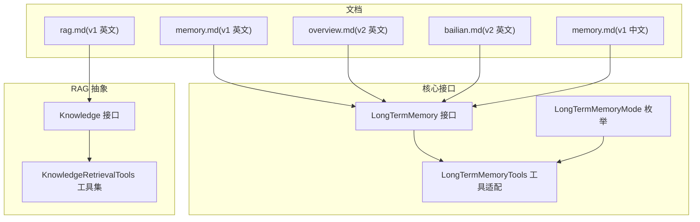
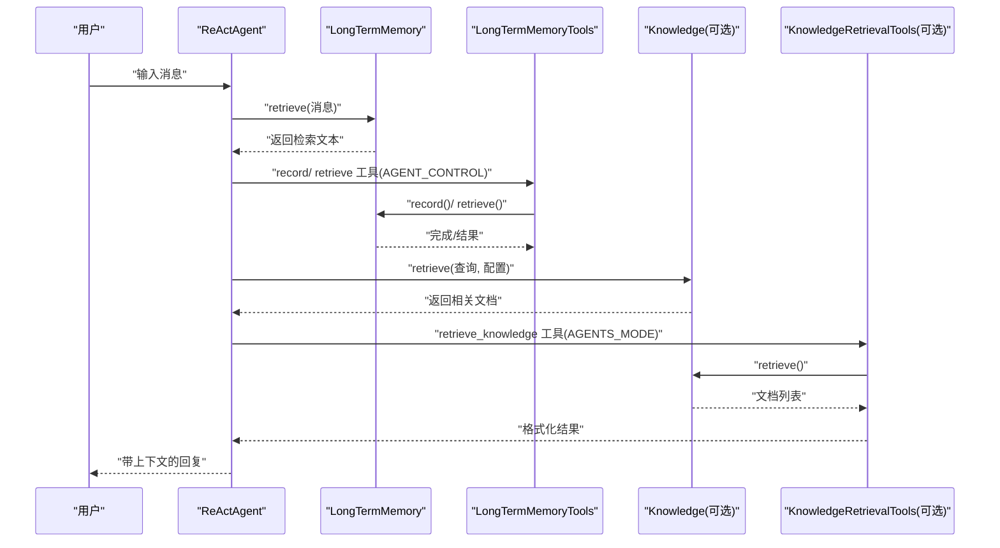
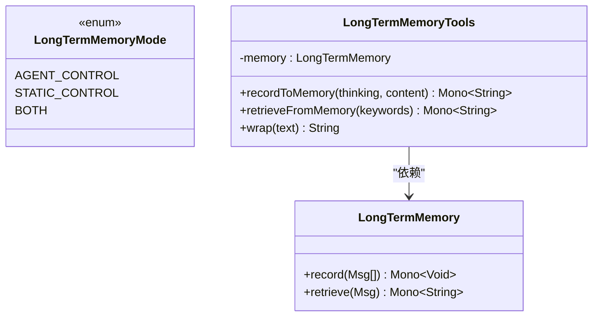
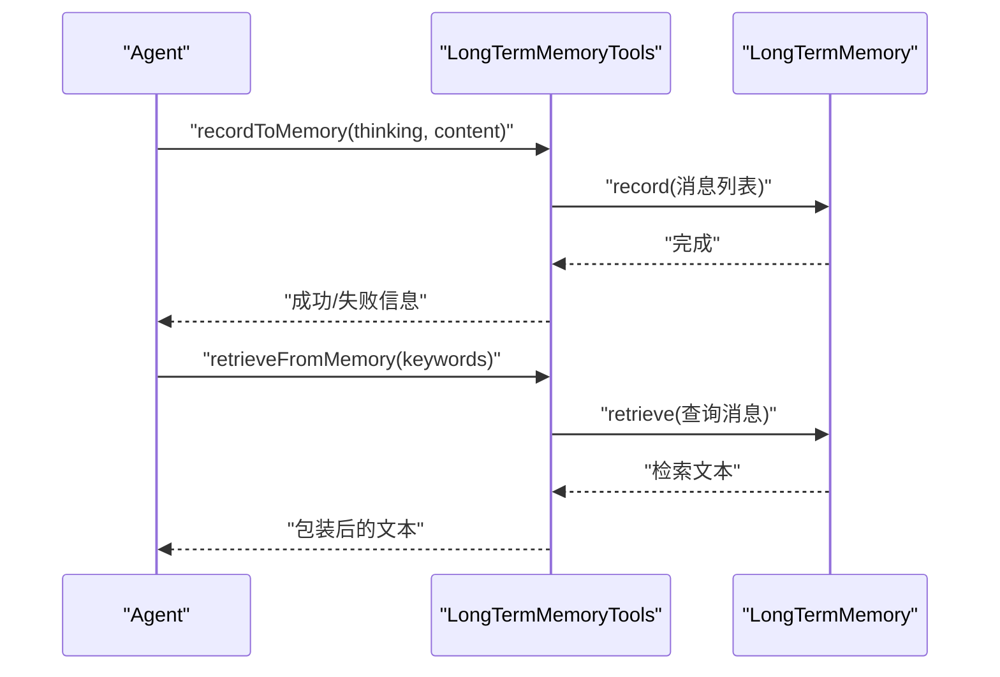
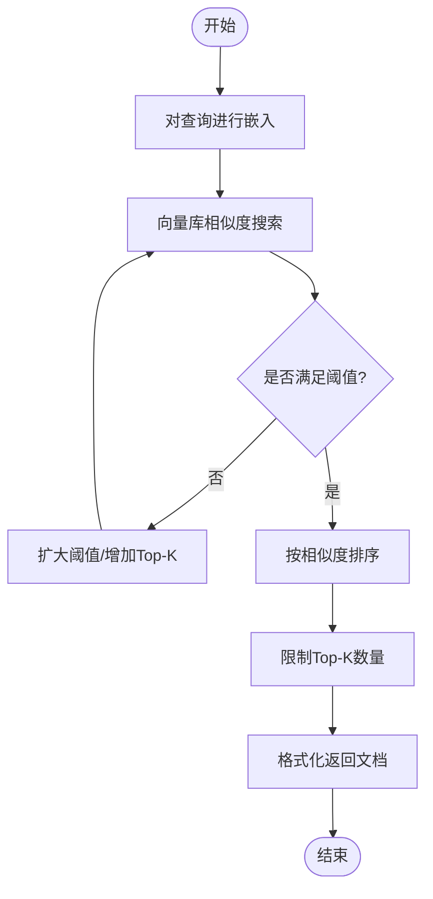
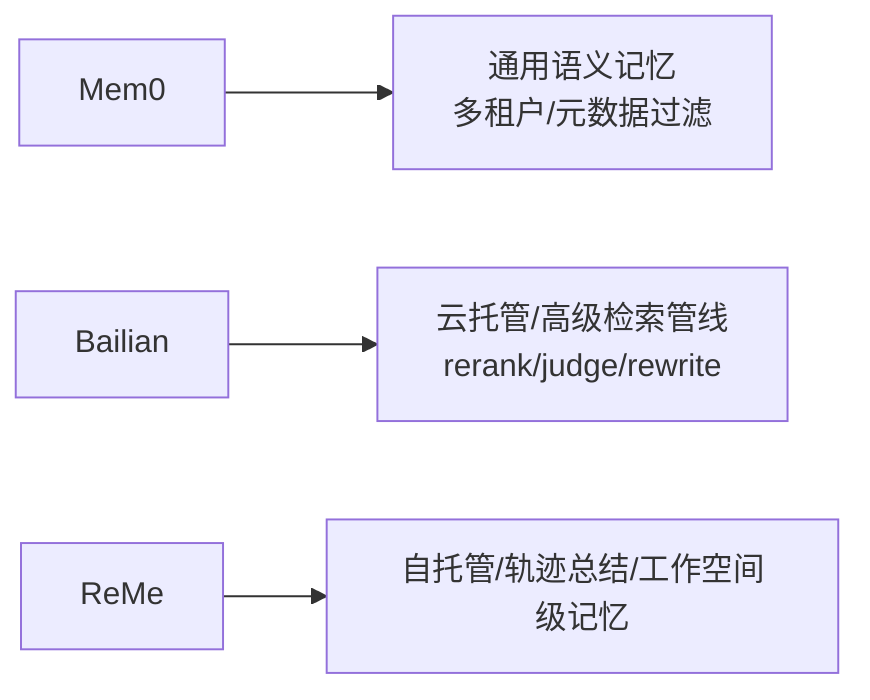
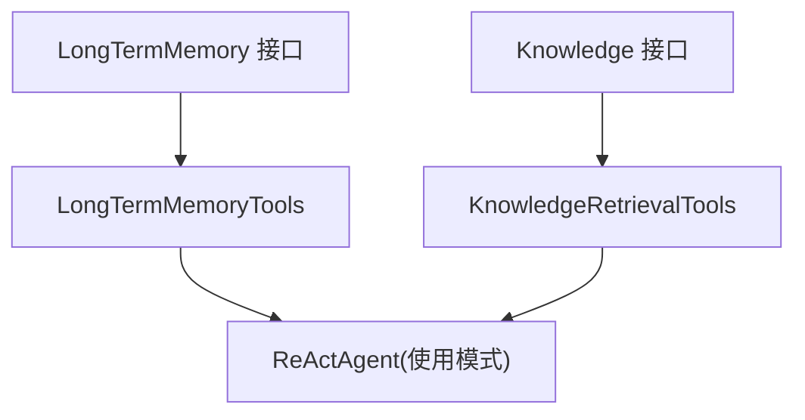

# 长期记忆

<cite>
**本文引用的文件**
- [LongTermMemory.java](file://agentscope-core/src/main/java/io/agentscope/core/memory/LongTermMemory.java)
- [LongTermMemoryMode.java](file://agentscope-core/src/main/java/io/agentscope/core/memory/LongTermMemoryMode.java)
- [LongTermMemoryTools.java](file://agentscope-core/src/main/java/io/agentscope/core/memory/LongTermMemoryTools.java)
- [Knowledge.java](file://agentscope-core/src/main/java/io/agentscope/core/rag/Knowledge.java)
- [KnowledgeRetrievalTools.java](file://agentscope-core/src/main/java/io/agentscope/core/rag/KnowledgeRetrievalTools.java)
- [memory.md（v1 英文）](file://docs/v1/en/docs/task/memory.md)
- [overview.md（v2 英文）](file://docs/v2/en/integration/memory/overview.md)
- [bailian.md（v2 英文）](file://docs/v2/en/integration/memory/bailian.md)
- [memory.md（v1 中文）](file://docs/v1/zh/docs/task/memory.md)
- [rag.md（v1 英文）](file://docs/v1/en/docs/task/rag.md)
</cite>

## 目录
1. [简介](#简介)
2. [项目结构](#项目结构)
3. [核心组件](#核心组件)
4. [架构总览](#架构总览)
5. [详细组件分析](#详细组件分析)
6. [依赖分析](#依赖分析)
7. [性能考虑](#性能考虑)
8. [故障排查指南](#故障排查指南)
9. [结论](#结论)
10. [附录](#附录)

## 简介
本文件面向 AgentScope Java 的长期记忆体系，系统化梳理“长期记忆”接口设计、扩展机制与集成方案，并对向量检索、语义搜索、索引构建、相似度匹配、检索优化等关键能力进行深入解读。文档同时覆盖 Mem0、百炼（Bailian）等主流供应商实现，以及与 RAG（检索增强生成）相关的知识库抽象与工具集，帮助读者在不同场景下选择合适的后端、配置检索参数、实现知识增强，并给出性能调优与成本控制的最佳实践。

## 项目结构
围绕长期记忆与检索增强，核心代码与文档分布如下：
- 核心接口与模式定义位于 agentscope-core 的 memory 包中，提供统一的长期记忆 API 与工作模式枚举。
- 工具适配层 LongTermMemoryTools 将核心 API 暴露为 Agent 可用的工具函数。
- RAG 相关的知识库接口与检索工具位于 agentscope-core 的 rag 包中，提供通用的知识增补能力。
- 文档位于 docs 目录，涵盖 v1、v2 版本的英文与中文内容，包含各供应商实现的快速开始、特性开关与最佳实践。

图表来源
- [LongTermMemory.java:71-112](file://agentscope-core/src/main/java/io/agentscope/core/memory/LongTermMemory.java#L71-L112)
- [LongTermMemoryMode.java:54-71](file://agentscope-core/src/main/java/io/agentscope/core/memory/LongTermMemoryMode.java#L54-L71)
- [LongTermMemoryTools.java:67-216](file://agentscope-core/src/main/java/io/agentscope/core/memory/LongTermMemoryTools.java#L67-L216)
- [Knowledge.java:34-59](file://agentscope-core/src/main/java/io/agentscope/core/rag/Knowledge.java#L34-L59)
- [KnowledgeRetrievalTools.java:57-217](file://agentscope-core/src/main/java/io/agentscope/core/rag/KnowledgeRetrievalTools.java#L57-L217)
- [memory.md（v1 英文）:1-173](file://docs/v1/en/docs/task/memory.md#L1-L173)
- [overview.md（v2 英文）:1-30](file://docs/v2/en/integration/memory/overview.md#L1-L30)
- [bailian.md（v2 英文）:1-73](file://docs/v2/en/integration/memory/bailian.md#L1-L73)
- [memory.md（v1 中文）:1-314](file://docs/v1/zh/docs/task/memory.md#L1-L314)
- [rag.md（v1 英文）:475-542](file://docs/v1/en/docs/task/rag.md#L475-L542)

章节来源
- [LongTermMemory.java:1-112](file://agentscope-core/src/main/java/io/agentscope/core/memory/LongTermMemory.java#L1-L112)
- [LongTermMemoryMode.java:1-71](file://agentscope-core/src/main/java/io/agentscope/core/memory/LongTermMemoryMode.java#L1-L71)
- [LongTermMemoryTools.java:1-216](file://agentscope-core/src/main/java/io/agentscope/core/memory/LongTermMemoryTools.java#L1-L216)
- [Knowledge.java:1-59](file://agentscope-core/src/main/java/io/agentscope/core/rag/Knowledge.java#L1-L59)
- [KnowledgeRetrievalTools.java:1-217](file://agentscope-core/src/main/java/io/agentscope/core/rag/KnowledgeRetrievalTools.java#L1-L217)
- [memory.md（v1 英文）:1-173](file://docs/v1/en/docs/task/memory.md#L1-L173)
- [overview.md（v2 英文）:1-30](file://docs/v2/en/integration/memory/overview.md#L1-L30)
- [bailian.md（v2 英文）:1-73](file://docs/v2/en/integration/memory/bailian.md#L1-L73)
- [memory.md（v1 中文）:1-314](file://docs/v1/zh/docs/task/memory.md#L1-L314)
- [rag.md（v1 英文）:475-542](file://docs/v1/en/docs/task/rag.md#L475-L542)

## 核心组件
- 长期记忆接口 LongTermMemory：定义记录与检索两大核心能力，返回 Reactor Mono，支持非阻塞集成；提供使用示例与模式说明。
- 长期记忆模式 LongTermMemoryMode：定义三种工作模式（AGENT_CONTROL、STATIC_CONTROL、BOTH），控制框架与 Agent 对记忆的参与程度。
- 工具适配 LongTermMemoryTools：将 record/retrieve 适配为 Agent 可用的工具函数，便于在 AGENT_CONTROL 模式下由 Agent 自主决策。
- 知识库接口 Knowledge：RAG 场景下的知识增补抽象，提供 addDocuments 与 retrieve 能力。
- 知识检索工具 KnowledgeRetrievalTools：在 Agentic 模式下暴露检索工具，支持从知识库中按查询获取相关文档并格式化返回。

章节来源
- [LongTermMemory.java:22-112](file://agentscope-core/src/main/java/io/agentscope/core/memory/LongTermMemory.java#L22-L112)
- [LongTermMemoryMode.java:18-71](file://agentscope-core/src/main/java/io/agentscope/core/memory/LongTermMemoryMode.java#L18-L71)
- [LongTermMemoryTools.java:27-216](file://agentscope-core/src/main/java/io/agentscope/core/memory/LongTermMemoryTools.java#L27-L216)
- [Knowledge.java:23-59](file://agentscope-core/src/main/java/io/agentscope/core/rag/Knowledge.java#L23-L59)
- [KnowledgeRetrievalTools.java:28-217](file://agentscope-core/src/main/java/io/agentscope/core/rag/KnowledgeRetrievalTools.java#L28-L217)

## 架构总览
长期记忆与 RAG 在 AgentScope 中以“接口 + 工具 + 文档”的方式解耦，既可作为独立扩展（如 Mem0、Bailian），也可与应用层会话上下文结合使用。整体交互流程如下：

图表来源
- [LongTermMemory.java:93-110](file://agentscope-core/src/main/java/io/agentscope/core/memory/LongTermMemory.java#L93-L110)
- [LongTermMemoryTools.java:103-214](file://agentscope-core/src/main/java/io/agentscope/core/memory/LongTermMemoryTools.java#L103-L214)
- [Knowledge.java:46-57](file://agentscope-core/src/main/java/io/agentscope/core/rag/Knowledge.java#L46-L57)
- [KnowledgeRetrievalTools.java:119-167](file://agentscope-core/src/main/java/io/agentscope/core/rag/KnowledgeRetrievalTools.java#L119-L167)

## 详细组件分析

### 长期记忆接口与模式
- 接口职责
  - 记录：将对话消息抽取为可持久化的知识片段，异步写入后端。
  - 检索：根据当前消息查询相关历史知识，返回可用于系统提示的文本。
- 模式说明
  - AGENT_CONTROL：Agent 通过工具自主决定何时记录与检索。
  - STATIC_CONTROL：框架在推理前后自动执行记录与检索。
  - BOTH：兼顾自动化与 Agent 自主性。
- 设计要点
  - 方法均为异步 Mono，便于与框架事件流集成。
  - 工具适配器 LongTermMemoryTools 将核心 API 映射为工具签名，降低 Agent 使用门槛。

图表来源
- [LongTermMemory.java:71-112](file://agentscope-core/src/main/java/io/agentscope/core/memory/LongTermMemory.java#L71-L112)
- [LongTermMemoryMode.java:54-71](file://agentscope-core/src/main/java/io/agentscope/core/memory/LongTermMemoryMode.java#L54-L71)
- [LongTermMemoryTools.java:67-216](file://agentscope-core/src/main/java/io/agentscope/core/memory/LongTermMemoryTools.java#L67-L216)

章节来源
- [LongTermMemory.java:22-112](file://agentscope-core/src/main/java/io/agentscope/core/memory/LongTermMemory.java#L22-L112)
- [LongTermMemoryMode.java:18-71](file://agentscope-core/src/main/java/io/agentscope/core/memory/LongTermMemoryMode.java#L18-L71)
- [LongTermMemoryTools.java:27-216](file://agentscope-core/src/main/java/io/agentscope/core/memory/LongTermMemoryTools.java#L27-L216)

### 工具适配与 Agent 集成
- 工具函数
  - recordToMemory：接收 Agent 的思考与要记录的事实列表，封装为消息并调用 record。
  - retrieveFromMemory：接收关键词列表，封装为查询消息并调用 retrieve，再进行包装输出。
- 集成方式
  - 在 AGENT_CONTROL 模式下，工具由框架注册到 Agent 的工具箱。
  - 在 STATIC_CONTROL 或 BOTH 模式下，框架自动在合适时机调用 record/retrieve。

图表来源
- [LongTermMemoryTools.java:103-214](file://agentscope-core/src/main/java/io/agentscope/core/memory/LongTermMemoryTools.java#L103-L214)
- [LongTermMemory.java:91-110](file://agentscope-core/src/main/java/io/agentscope/core/memory/LongTermMemory.java#L91-L110)

章节来源
- [LongTermMemoryTools.java:84-214](file://agentscope-core/src/main/java/io/agentscope/core/memory/LongTermMemoryTools.java#L84-L214)

### 向量检索与语义搜索（RAG 抽象）
- 知识库接口
  - addDocuments：将文档嵌入并存入向量库，用于后续检索。
  - retrieve：对查询进行嵌入，基于相似度阈值与 Top-K 限制返回相关文档。
- 检索工具
  - retrieve_knowledge：在 Agentic 模式下，允许 Agent 主动检索知识库；可自动注入会话上下文以提升准确性。
- 最佳实践
  - 分块大小、重叠比例、分数阈值、Top-K 数量等参数需结合模型上下文窗口与业务场景调整。
  - 优先使用通用模式（Generic）进行简单问答，复杂任务可采用 Agentic 模式进行选择性检索。

图表来源
- [Knowledge.java:46-57](file://agentscope-core/src/main/java/io/agentscope/core/rag/Knowledge.java#L46-L57)
- [KnowledgeRetrievalTools.java:119-167](file://agentscope-core/src/main/java/io/agentscope/core/rag/KnowledgeRetrievalTools.java#L119-L167)
- [rag.md（v1 英文）:525-542](file://docs/v1/en/docs/task/rag.md#L525-L542)

章节来源
- [Knowledge.java:23-59](file://agentscope-core/src/main/java/io/agentscope/core/rag/Knowledge.java#L23-L59)
- [KnowledgeRetrievalTools.java:28-217](file://agentscope-core/src/main/java/io/agentscope/core/rag/KnowledgeRetrievalTools.java#L28-L217)
- [rag.md（v1 英文）:475-542](file://docs/v1/en/docs/task/rag.md#L475-L542)

### 供应商实现概览与选择建议
- Mem0 长期记忆
  - 适用场景：通用语义记忆、多租户隔离、元数据过滤。
  - 兼容性：针对平台与自托管部署提供 API 类型适配，自动选择端点与响应解析。
  - 快速开始与示例参见文档。
- 百炼（Bailian）长期记忆
  - 适用场景：已在阿里云百炼平台、需要 rerank/judge/rewrite 等高级检索管线。
  - 隔离维度：支持 userId + memoryLibraryId + projectId 三级隔离。
  - 特性开关：rerank、judge、rewrite 可按需开启，注意延迟与成本。
- ReMe 长期记忆
  - 适用场景：自托管 ReMe 服务、关注轨迹总结与工作空间级记忆。

图表来源
- [overview.md（v2 英文）:5-10](file://docs/v2/en/integration/memory/overview.md#L5-L10)
- [bailian.md（v2 英文）:1-73](file://docs/v2/en/integration/memory/bailian.md#L1-L73)
- [memory.md（v1 英文）:142-173](file://docs/v1/en/docs/task/memory.md#L142-L173)
- [memory.md（v1 中文）:265-314](file://docs/v1/zh/docs/task/memory.md#L265-L314)

章节来源
- [overview.md（v2 英文）:1-30](file://docs/v2/en/integration/memory/overview.md#L1-L30)
- [bailian.md（v2 英文）:1-73](file://docs/v2/en/integration/memory/bailian.md#L1-L73)
- [memory.md（v1 英文）:142-173](file://docs/v1/en/docs/task/memory.md#L142-L173)
- [memory.md（v1 中文）:265-314](file://docs/v1/zh/docs/task/memory.md#L265-L314)

## 依赖分析
- 组件耦合
  - LongTermMemoryTools 依赖 LongTermMemory 接口，二者通过工具适配实现低耦合。
  - KnowledgeRetrievalTools 依赖 Knowledge 接口，形成 RAG 场景下的检索工具链。
- 外部依赖
  - 各供应商实现（Mem0、Bailian、ReMe）均遵循相同接口契约，便于替换与迁移。
  - 文档与示例为实现细节提供参考，避免直接绑定具体实现。

图表来源
- [LongTermMemory.java:71-112](file://agentscope-core/src/main/java/io/agentscope/core/memory/LongTermMemory.java#L71-L112)
- [LongTermMemoryTools.java:67-216](file://agentscope-core/src/main/java/io/agentscope/core/memory/LongTermMemoryTools.java#L67-L216)
- [Knowledge.java:34-59](file://agentscope-core/src/main/java/io/agentscope/core/rag/Knowledge.java#L34-L59)
- [KnowledgeRetrievalTools.java:57-217](file://agentscope-core/src/main/java/io/agentscope/core/rag/KnowledgeRetrievalTools.java#L57-L217)

章节来源
- [LongTermMemory.java:71-112](file://agentscope-core/src/main/java/io/agentscope/core/memory/LongTermMemory.java#L71-L112)
- [LongTermMemoryTools.java:67-216](file://agentscope-core/src/main/java/io/agentscope/core/memory/LongTermMemoryTools.java#L67-L216)
- [Knowledge.java:34-59](file://agentscope-core/src/main/java/io/agentscope/core/rag/Knowledge.java#L34-L59)
- [KnowledgeRetrievalTools.java:57-217](file://agentscope-core/src/main/java/io/agentscope/core/rag/KnowledgeRetrievalTools.java#L57-L217)

## 性能考虑
- 检索参数调优
  - 分数阈值：从 0.3–0.5 开始，依据召回质量逐步调整。
  - Top-K：初始 3–5 文档，结合模型上下文窗口上限动态调整。
  - 分块策略：依据模型上下文窗口与任务特征选择 256–1024 字符分块，使用 10–20% 重叠保持连续性。
- 模式选择
  - Generic 模式：适合简单问答与稳定检索模式，资源占用较低。
  - Agentic 模式：适合复杂任务与选择性检索，但可能带来额外延迟与成本。
- 成本控制
  - 按需启用 rerank/judge/rewrite 等高级管线，仅在必要时开启。
  - 合理设置阈值与 Top-K，避免过度检索导致的网络与计算开销。
- 并发与异步
  - 利用异步 Mono 流水线减少阻塞，配合框架事件流实现非阻塞写入与检索。

章节来源
- [rag.md（v1 英文）:525-542](file://docs/v1/en/docs/task/rag.md#L525-L542)
- [bailian.md（v2 英文）:46-73](file://docs/v2/en/integration/memory/bailian.md#L46-L73)

## 故障排查指南
- 记录失败
  - 现象：record 工具返回错误信息。
  - 排查：检查消息内容是否为空或无效；确认后端可用性与鉴权配置。
- 检索无结果
  - 现象：retrieve 返回空文本或工具返回“未找到相关记忆”。
  - 排查：提高分数阈值或增大 Top-K；确保已先进行过记录；核对查询关键词与文档分块策略。
- Agent 工具不可用
  - 现象：AGENTS_MODE 下无法调用检索工具。
  - 排查：确认工具已注册至 Agent 的工具箱；检查默认配置与会话上下文注入逻辑。
- 供应商兼容问题
  - 现象：平台与自托管部署响应不一致。
  - 排查：确认 API 类型配置正确，使用内部兼容适配机制自动选择端点与解析方式。

章节来源
- [LongTermMemoryTools.java:103-214](file://agentscope-core/src/main/java/io/agentscope/core/memory/LongTermMemoryTools.java#L103-L214)
- [KnowledgeRetrievalTools.java:119-167](file://agentscope-core/src/main/java/io/agentscope/core/rag/KnowledgeRetrievalTools.java#L119-L167)
- [memory.md（v1 英文）:142-173](file://docs/v1/en/docs/task/memory.md#L142-L173)
- [bailian.md（v2 英文）:46-73](file://docs/v2/en/integration/memory/bailian.md#L46-L73)

## 结论
AgentScope 的长期记忆体系以统一接口为核心，辅以灵活的模式与工具适配，既能满足框架自动化管理的需求，也能赋予 Agent 自主决策的能力。结合 RAG 抽象，系统可在不同供应商实现之间平滑切换，并通过参数调优与模式选择实现性能与成本的平衡。建议在生产环境中优先采用 BOTH 模式，配合合理的检索参数与按需启用的高级管线，获得更稳健的用户体验。

## 附录
- 快速开始与示例
  - Mem0 长期记忆：参考 v1 英文与中文 memory 文档中的示例与配置说明。
  - 百炼长期记忆：参考 v2 英文 bailian 文档与 v1 中文 memory 文档中的示例。
- 供应商选择指引
  - 单机本地启动：Mem0 或 ReMe。
  - 已在阿里云百炼平台：优先选择 Bailian。
  - 需要元数据过滤：选择 Mem0。
  - 关注端到端轨迹总结：选择 ReMe。

章节来源
- [memory.md（v1 英文）:1-173](file://docs/v1/en/docs/task/memory.md#L1-L173)
- [overview.md（v2 英文）:22-28](file://docs/v2/en/integration/memory/overview.md#L22-L28)
- [bailian.md（v2 英文）:1-73](file://docs/v2/en/integration/memory/bailian.md#L1-L73)
- [memory.md（v1 中文）:1-314](file://docs/v1/zh/docs/task/memory.md#L1-L314)