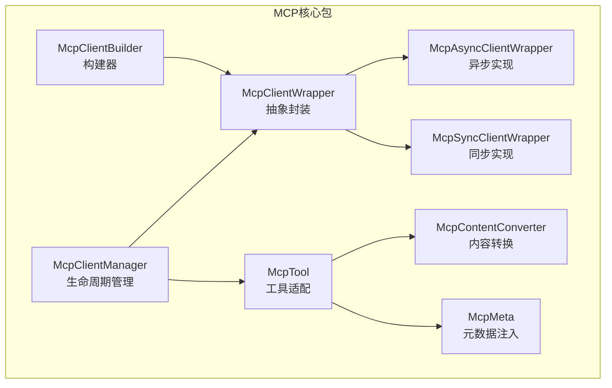
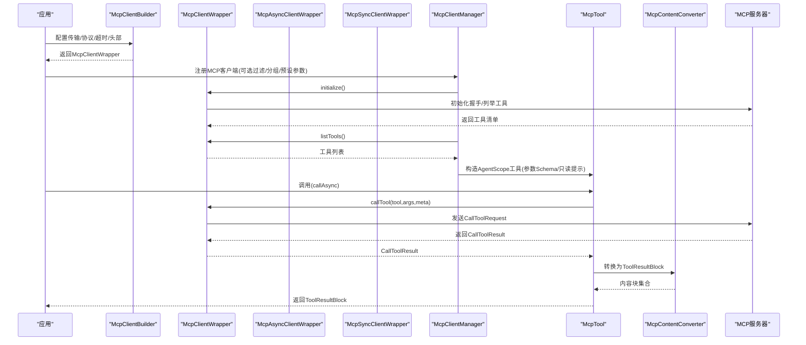
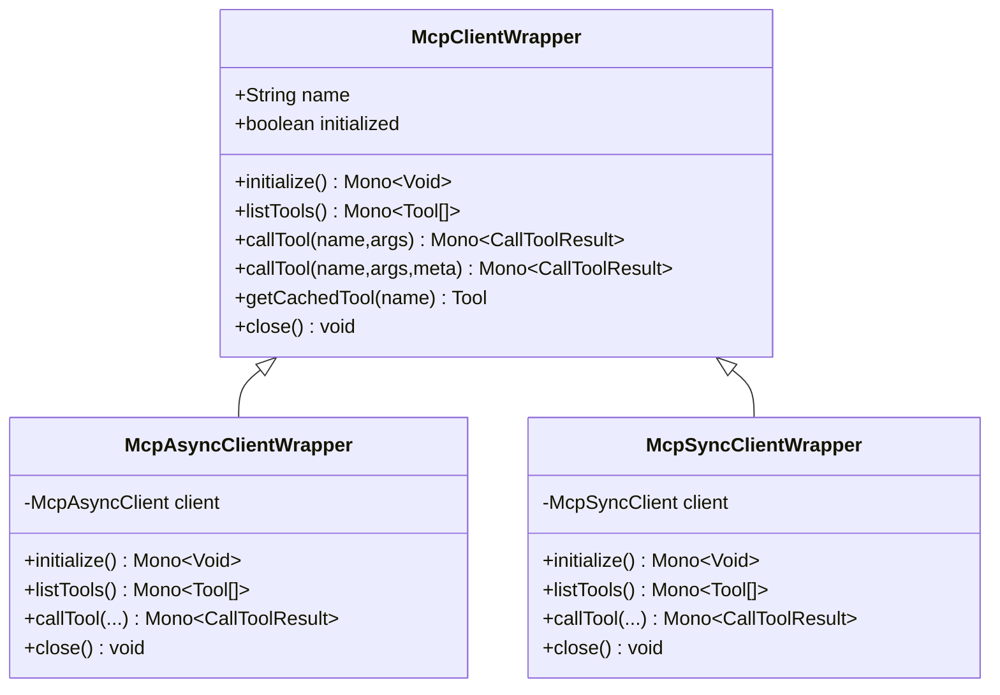
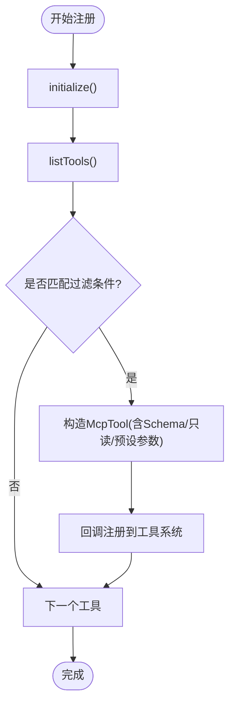
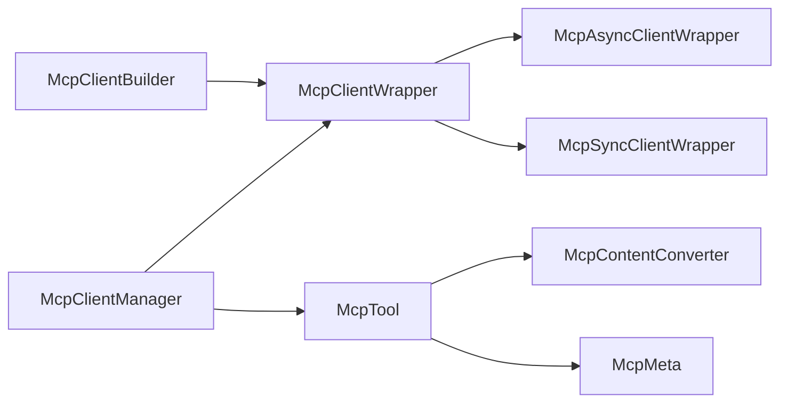

# MCP协议支持

<cite>
**本文引用的文件**
- [McpClientManager.java](file://agentscope-core/src/main/java/io/agentscope/core/tool/McpClientManager.java)
- [McpClientWrapper.java](file://agentscope-core/src/main/java/io/agentscope/core/tool/mcp/McpClientWrapper.java)
- [McpTool.java](file://agentscope-core/src/main/java/io/agentscope/core/tool/mcp/McpTool.java)
- [McpContentConverter.java](file://agentscope-core/src/main/java/io/agentscope/core/tool/mcp/McpContentConverter.java)
- [McpClientBuilder.java](file://agentscope-core/src/main/java/io/agentscope/core/tool/mcp/McpClientBuilder.java)
- [McpAsyncClientWrapper.java](file://agentscope-core/src/main/java/io/agentscope/core/tool/mcp/McpAsyncClientWrapper.java)
- [McpSyncClientWrapper.java](file://agentscope-core/src/main/java/io/agentscope/core/tool/mcp/McpSyncClientWrapper.java)
- [McpMeta.java](file://agentscope-core/src/main/java/io/agentscope/core/tool/mcp/McpMeta.java)
- [tool.md](file://docs/v2/zh/docs/building-blocks/tool.md)
- [mcp.md](file://docs/v1/zh/docs/task/mcp.md)
</cite>

## 目录
1. [简介](#简介)
2. [项目结构](#项目结构)
3. [核心组件](#核心组件)
4. [架构总览](#架构总览)
5. [详细组件分析](#详细组件分析)
6. [依赖分析](#依赖分析)
7. [性能考虑](#性能考虑)
8. [故障排除指南](#故障排除指南)
9. [结论](#结论)
10. [附录](#附录)

## 简介
本文件面向AgentScope Java的MCP（Model Context Protocol）协议支持，系统性阐述以下内容：
- 客户端封装与连接管理：McpClientWrapper抽象层、异步与同步实现、协议版本协商与传输配置
- 工具适配与协议转换：McpTool的工具桥接、参数与Schema映射、权限策略与调用流程
- 内容转换机制与格式适配：McpContentConverter的消息体转换、多类型内容块映射
- 客户端生命周期管理与资源池控制：McpClientManager的注册/注销、工具过滤与分组
- 典型集成示例：如何接入MCP服务、注册MCP工具、处理MCP消息
- 安全认证、连接重试与错误恢复机制
- 性能优化与故障排除建议

## 项目结构
围绕MCP协议支持的核心代码位于agentscope-core模块的tool.mcp包内，配合工具注册中心与工具组管理器协同工作。

图表来源
- [McpClientWrapper.java:40-131](file://agentscope-core/src/main/java/io/agentscope/core/tool/mcp/McpClientWrapper.java#L40-L131)
- [McpAsyncClientWrapper.java:40-199](file://agentscope-core/src/main/java/io/agentscope/core/tool/mcp/McpAsyncClientWrapper.java#L40-L199)
- [McpSyncClientWrapper.java:41-207](file://agentscope-core/src/main/java/io/agentscope/core/tool/mcp/McpSyncClientWrapper.java#L41-L207)
- [McpClientBuilder.java:94-791](file://agentscope-core/src/main/java/io/agentscope/core/tool/mcp/McpClientBuilder.java#L94-L791)
- [McpTool.java:51-311](file://agentscope-core/src/main/java/io/agentscope/core/tool/mcp/McpTool.java#L51-L311)
- [McpContentConverter.java:41-205](file://agentscope-core/src/main/java/io/agentscope/core/tool/mcp/McpContentConverter.java#L41-L205)
- [McpMeta.java:55-122](file://agentscope-core/src/main/java/io/agentscope/core/tool/mcp/McpMeta.java#L55-L122)
- [McpClientManager.java:36-297](file://agentscope-core/src/main/java/io/agentscope/core/tool/McpClientManager.java#L36-L297)

章节来源
- [McpClientWrapper.java:40-131](file://agentscope-core/src/main/java/io/agentscope/core/tool/mcp/McpClientWrapper.java#L40-L131)
- [McpClientBuilder.java:94-791](file://agentscope-core/src/main/java/io/agentscope/core/tool/mcp/McpClientBuilder.java#L94-L791)

## 核心组件
- McpClientWrapper：MCP客户端抽象封装，统一管理初始化、工具发现、调用与关闭，支持缓存与只读提示传播
- McpAsyncClientWrapper / McpSyncClientWrapper：分别基于异步/同步MCP客户端的实现，提供Mono响应式接口与阻塞操作的调度隔离
- McpClientBuilder：流式配置构建器，支持StdIO/SSE/StreamableHTTP三种传输，可自定义HTTP客户端、协议版本、超时、头部与查询参数
- McpTool：将远程MCP工具桥接为AgentScope工具，负责参数合并、权限判定、结果转换与错误兜底
- McpContentConverter：MCP内容与AgentScope内容块之间的双向转换，覆盖文本、图片、嵌入资源等
- McpMeta：运行时上下文中的MCP元数据命名空间，用于向每个MCP调用注入meta字段
- McpClientManager：MCP客户端生命周期管理器，负责注册、工具枚举与过滤、分组与预设参数注入、注销与清理

章节来源
- [McpClientWrapper.java:40-131](file://agentscope-core/src/main/java/io/agentscope/core/tool/mcp/McpClientWrapper.java#L40-L131)
- [McpAsyncClientWrapper.java:40-199](file://agentscope-core/src/main/java/io/agentscope/core/tool/mcp/McpAsyncClientWrapper.java#L40-L199)
- [McpSyncClientWrapper.java:41-207](file://agentscope-core/src/main/java/io/agentscope/core/tool/mcp/McpSyncClientWrapper.java#L41-L207)
- [McpClientBuilder.java:94-791](file://agentscope-core/src/main/java/io/agentscope/core/tool/mcp/McpClientBuilder.java#L94-L791)
- [McpTool.java:51-311](file://agentscope-core/src/main/java/io/agentscope/core/tool/mcp/McpTool.java#L51-L311)
- [McpContentConverter.java:41-205](file://agentscope-core/src/main/java/io/agentscope/core/tool/mcp/McpContentConverter.java#L41-L205)
- [McpMeta.java:55-122](file://agentscope-core/src/main/java/io/agentscope/core/tool/mcp/McpMeta.java#L55-L122)
- [McpClientManager.java:36-297](file://agentscope-core/src/main/java/io/agentscope/core/tool/McpClientManager.java#L36-L297)

## 架构总览
下图展示了从应用侧到MCP服务器的调用链路与各组件职责：

图表来源
- [McpClientBuilder.java:421-496](file://agentscope-core/src/main/java/io/agentscope/core/tool/mcp/McpClientBuilder.java#L421-L496)
- [McpAsyncClientWrapper.java:65-173](file://agentscope-core/src/main/java/io/agentscope/core/tool/mcp/McpAsyncClientWrapper.java#L65-L173)
- [McpSyncClientWrapper.java:67-183](file://agentscope-core/src/main/java/io/agentscope/core/tool/mcp/McpSyncClientWrapper.java#L67-L183)
- [McpClientManager.java:129-218](file://agentscope-core/src/main/java/io/agentscope/core/tool/McpClientManager.java#L129-L218)
- [McpTool.java:179-204](file://agentscope-core/src/main/java/io/agentscope/core/tool/mcp/McpTool.java#L179-L204)
- [McpContentConverter.java:56-71](file://agentscope-core/src/main/java/io/agentscope/core/tool/mcp/McpContentConverter.java#L56-L71)

## 详细组件分析

### McpClientWrapper与实现类
- 抽象职责：统一客户端生命周期、工具缓存、调用入口与资源释放
- 异步实现：基于McpAsyncClient，初始化与调用均返回Mono，内部记录服务器信息与工具清单
- 同步实现：基于McpSyncClient，通过boundedElastic调度隔离阻塞操作，避免事件循环被阻塞

图表来源
- [McpClientWrapper.java:40-131](file://agentscope-core/src/main/java/io/agentscope/core/tool/mcp/McpClientWrapper.java#L40-L131)
- [McpAsyncClientWrapper.java:40-199](file://agentscope-core/src/main/java/io/agentscope/core/tool/mcp/McpAsyncClientWrapper.java#L40-L199)
- [McpSyncClientWrapper.java:41-207](file://agentscope-core/src/main/java/io/agentscope/core/tool/mcp/McpSyncClientWrapper.java#L41-L207)

章节来源
- [McpClientWrapper.java:40-131](file://agentscope-core/src/main/java/io/agentscope/core/tool/mcp/McpClientWrapper.java#L40-L131)
- [McpAsyncClientWrapper.java:40-199](file://agentscope-core/src/main/java/io/agentscope/core/tool/mcp/McpAsyncClientWrapper.java#L40-L199)
- [McpSyncClientWrapper.java:41-207](file://agentscope-core/src/main/java/io/agentscope/core/tool/mcp/McpSyncClientWrapper.java#L41-L207)

### McpClientBuilder：传输与协议配置
- 传输类型：StdIO（本地进程）、SSE（HTTP流式）、StreamableHTTP（可流式HTTP）
- 高级HTTP定制：支持HTTP/2、自定义超时、SSL设置等
- 协议版本：默认仅支持“2024-11-05”，可通过protocolVersions声明支持多个版本，解决服务器返回新版本导致的握手失败
- 超时配置：独立设置请求与初始化超时
- 头部与查询参数：支持为HTTP传输添加头与查询参数，URL中的既有参数与新增参数合并，后者优先

章节来源
- [McpClientBuilder.java:94-791](file://agentscope-core/src/main/java/io/agentscope/core/tool/mcp/McpClientBuilder.java#L94-L791)

### McpClientManager：生命周期与工具注册
- 注册流程：初始化客户端、列举工具、根据enableTools/disableTools进行过滤、按groupName分组、合并预设参数、回调注册到工具系统
- 权限与只读：从工具annotations提取readOnlyHint，自动允许只读工具
- 注销流程：移除该客户端下的全部工具，关闭底层连接
- 查询与校验：提供客户端名称集合、按名称获取包装器、工具过滤逻辑

图表来源
- [McpClientManager.java:129-218](file://agentscope-core/src/main/java/io/agentscope/core/tool/McpClientManager.java#L129-L218)

章节来源
- [McpClientManager.java:36-297](file://agentscope-core/src/main/java/io/agentscope/core/tool/McpClientManager.java#L36-L297)

### McpTool：工具适配与协议转换
- 参数Schema转换：将MCP JsonSchema转换为AgentScope参数格式，保留$defs/definitions，排除预设参数
- 权限策略：只读工具自动允许，其他工具每次调用前需要显式授权
- 调用流程：合并输入参数与预设参数（输入优先），提取RuntimeContext中的McpMeta作为meta，调用客户端，转换为ToolResultBlock，异常转为错误结果
- 输出Schema：可选输出Schema透传至工具基类

章节来源
- [McpTool.java:51-311](file://agentscope-core/src/main/java/io/agentscope/core/tool/mcp/McpTool.java#L51-L311)

### McpContentConverter：内容转换机制
- 结果转换：将MCP CallToolResult转换为ToolResultBlock，错误标记时提取文本内容作为错误消息
- 列表转换：空列表时生成空文本块，否则逐项转换
- 单项转换：TextContent→TextBlock、ImageContent→ImageBlock（Base64Source）、EmbeddedResource→Text或Image（依据mime类型）、AudioContent→占位文本
- 错误提取：从文本内容拼接错误信息

章节来源
- [McpContentConverter.java:41-205](file://agentscope-core/src/main/java/io/agentscope/core/tool/mcp/McpContentConverter.java#L41-L205)

### McpMeta：元数据注入
- 类型键：以McpMeta.class为键注册到RuntimeContext
- 合并策略：多次注册时后者覆盖前者相同键
- 作用域：仅提取McpMeta.class键对象，避免泄漏其他上下文对象
- 使用：McpTool在调用时自动提取并注入到MCP CallToolRequest.meta

章节来源
- [McpMeta.java:55-122](file://agentscope-core/src/main/java/io/agentscope/core/tool/mcp/McpMeta.java#L55-L122)
- [McpTool.java:249-258](file://agentscope-core/src/main/java/io/agentscope/core/tool/mcp/McpTool.java#L249-L258)

## 依赖分析
- 组件耦合
  - McpClientManager依赖McpClientWrapper与工具注册中心，负责工具的批量注册与注销
  - McpTool依赖McpClientWrapper与McpContentConverter，承担协议到AgentScope的桥接
  - McpClientBuilder产出McpClientWrapper，贯穿初始化、协议版本与传输配置
- 外部依赖
  - modelcontextprotocol客户端库：提供McpAsyncClient/McpSyncClient与传输实现
  - Reactor：提供Mono/Publisher响应式模型
  - 日志框架：SLF4J用于日志记录

图表来源
- [McpClientBuilder.java:421-496](file://agentscope-core/src/main/java/io/agentscope/core/tool/mcp/McpClientBuilder.java#L421-L496)
- [McpClientWrapper.java:40-131](file://agentscope-core/src/main/java/io/agentscope/core/tool/mcp/McpClientWrapper.java#L40-L131)
- [McpClientManager.java:36-297](file://agentscope-core/src/main/java/io/agentscope/core/tool/McpClientManager.java#L36-L297)
- [McpTool.java:51-311](file://agentscope-core/src/main/java/io/agentscope/core/tool/mcp/McpTool.java#L51-L311)
- [McpContentConverter.java:41-205](file://agentscope-core/src/main/java/io/agentscope/core/tool/mcp/McpContentConverter.java#L41-L205)
- [McpMeta.java:55-122](file://agentscope-core/src/main/java/io/agentscope/core/tool/mcp/McpMeta.java#L55-L122)

## 性能考虑
- 异步优先：优先使用McpAsyncClientWrapper，避免阻塞事件循环
- 调度隔离：同步实现通过boundedElastic调度执行阻塞操作，降低对主线程的影响
- 工具缓存：McpClientWrapper缓存工具清单，减少重复列举开销
- 过滤与分组：在注册阶段使用enableTools/disableTools缩小工具集，降低权限评估与UI展示成本
- 协议版本：合理声明支持的协议版本，避免握手失败导致的重连与初始化开销
- HTTP传输：SSE适合长连接场景，StreamableHTTP适合无状态请求；根据业务特征选择合适传输

## 故障排除指南
- 连接失败（协议版本不兼容）
  - 现象：初始化时报“不支持的协议版本”
  - 处理：使用McpClientBuilder.protocolVersions声明支持的版本列表
  - 参考路径：[McpClientBuilder.java:329-341](file://agentscope-core/src/main/java/io/agentscope/core/tool/mcp/McpClientBuilder.java#L329-L341)
- 客户端未初始化即调用
  - 现象：IllegalStateException提示未初始化
  - 处理：确保先调用initialize()并等待成功
  - 参考路径：[McpAsyncClientWrapper.java:104-112](file://agentscope-core/src/main/java/io/agentscope/core/tool/mcp/McpAsyncClientWrapper.java#L104-L112)、[McpSyncClientWrapper.java:110-119](file://agentscope-core/src/main/java/io/agentscope/core/tool/mcp/McpSyncClientWrapper.java#L110-L119)
- 工具未注册或不可见
  - 现象：工具不在工具集中
  - 处理：确认已注册MCP客户端，检查enableTools过滤条件；使用McpClientManager列出客户端名称
  - 参考路径：[McpClientManager.java:259-271](file://agentscope-core/src/main/java/io/agentscope/core/tool/McpClientManager.java#L259-L271)
- 结果为空或错误
  - 现象：ToolResultBlock为空或错误
  - 处理：检查McpContentConverter对内容类型的映射；查看MCP服务器返回的错误内容
  - 参考路径：[McpContentConverter.java:56-71](file://agentscope-core/src/main/java/io/agentscope/core/tool/mcp/McpContentConverter.java#L56-L71)
- 元数据未生效
  - 现象：MCP调用缺少meta字段
  - 处理：在RuntimeContext中以McpMeta.class键注册并合并多个来源
  - 参考路径：[McpMeta.java:96-107](file://agentscope-core/src/main/java/io/agentscope/core/tool/mcp/McpMeta.java#L96-L107)、[McpTool.java:249-258](file://agentscope-core/src/main/java/io/agentscope/core/tool/mcp/McpTool.java#L249-L258)

章节来源
- [McpClientBuilder.java:329-341](file://agentscope-core/src/main/java/io/agentscope/core/tool/mcp/McpClientBuilder.java#L329-L341)
- [McpAsyncClientWrapper.java:104-112](file://agentscope-core/src/main/java/io/agentscope/core/tool/mcp/McpAsyncClientWrapper.java#L104-L112)
- [McpSyncClientWrapper.java:110-119](file://agentscope-core/src/main/java/io/agentscope/core/tool/mcp/McpSyncClientWrapper.java#L110-L119)
- [McpClientManager.java:259-271](file://agentscope-core/src/main/java/io/agentscope/core/tool/McpClientManager.java#L259-L271)
- [McpContentConverter.java:56-71](file://agentscope-core/src/main/java/io/agentscope/core/tool/mcp/McpContentConverter.java#L56-L71)
- [McpMeta.java:96-107](file://agentscope-core/src/main/java/io/agentscope/core/tool/mcp/McpMeta.java#L96-L107)
- [McpTool.java:249-258](file://agentscope-core/src/main/java/io/agentscope/core/tool/mcp/McpTool.java#L249-L258)

## 结论
AgentScope Java通过McpClientWrapper抽象、McpClientBuilder构建器、McpClientManager生命周期管理以及McpTool/McpContentConverter的协议桥接，提供了对MCP协议的完整支持。开发者可以便捷地接入不同传输类型的MCP服务器，按需启用工具、注入元数据、处理权限与错误，并在异步与同步模式间自由选择以满足性能需求。

## 附录

### 集成与使用示例（路径指引）
- 接入MCP服务（StdIO/Streamable HTTP/SSE）
  - 示例路径：[tool.md:314-364](file://docs/v2/zh/docs/building-blocks/tool.md#L314-L364)
- 注册MCP工具到Toolkit
  - 示例路径：[tool.md:330-331](file://docs/v2/zh/docs/building-blocks/tool.md#L330-L331)
- 列出与移除MCP客户端
  - 示例路径：[mcp.md:307-320](file://docs/v1/zh/docs/task/mcp.md#L307-L320)
- 协议版本配置
  - 示例路径：[mcp.md:287-303](file://docs/v1/zh/docs/task/mcp.md#L287-L303)

### 安全认证、连接重试与错误恢复
- 认证与头部
  - 通过McpClientBuilder.headers/header为HTTP传输添加认证头
  - 参考路径：[McpClientBuilder.java:231-249](file://agentscope-core/src/main/java/io/agentscope/core/tool/mcp/McpClientBuilder.java#L231-L249)
- 连接与初始化超时
  - 使用timeout/initializationTimeout控制请求与初始化超时
  - 参考路径：[McpClientBuilder.java:293-307](file://agentscope-core/src/main/java/io/agentscope/core/tool/mcp/McpClientBuilder.java#L293-L307)
- 协议版本协商
  - 使用protocolVersions声明支持的版本，避免握手失败
  - 参考路径：[McpClientBuilder.java:329-341](file://agentscope-core/src/main/java/io/agentscope/core/tool/mcp/McpClientBuilder.java#L329-L341)
- 错误恢复
  - McpTool在调用失败时返回ToolResultBlock.error兜底，避免任务中断
  - 参考路径：[McpTool.java:194-203](file://agentscope-core/src/main/java/io/agentscope/core/tool/mcp/McpTool.java#L194-L203)