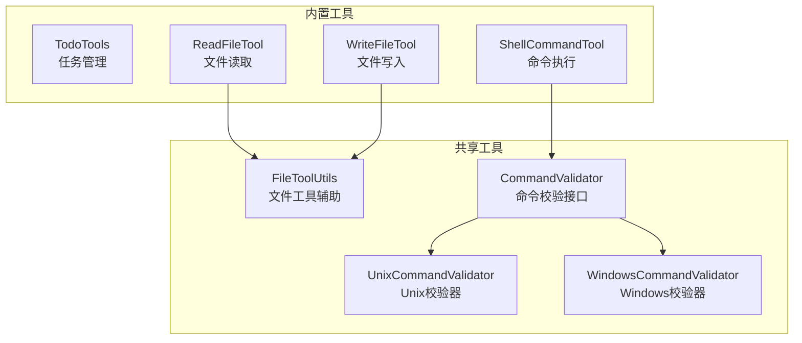
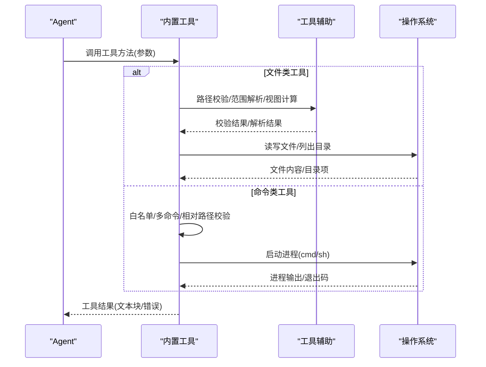
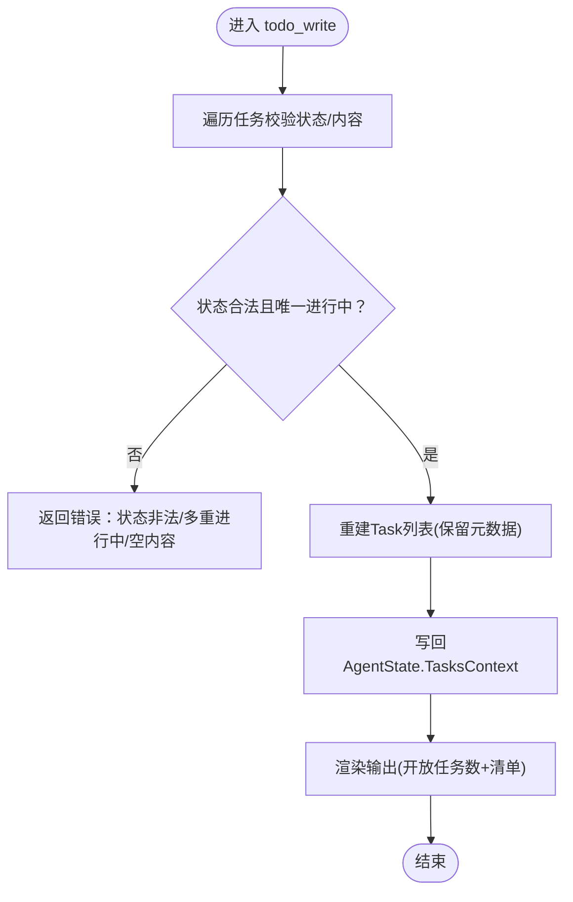
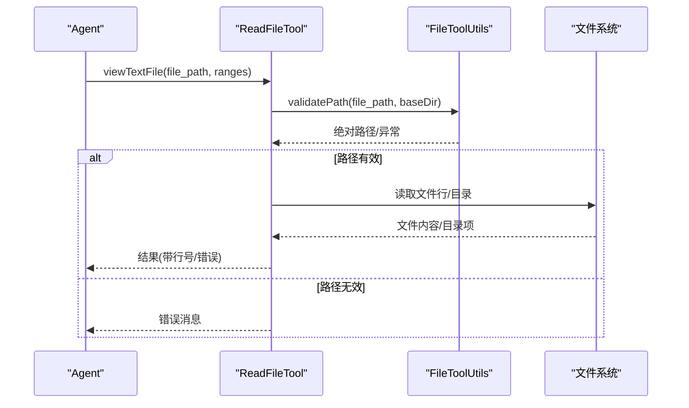
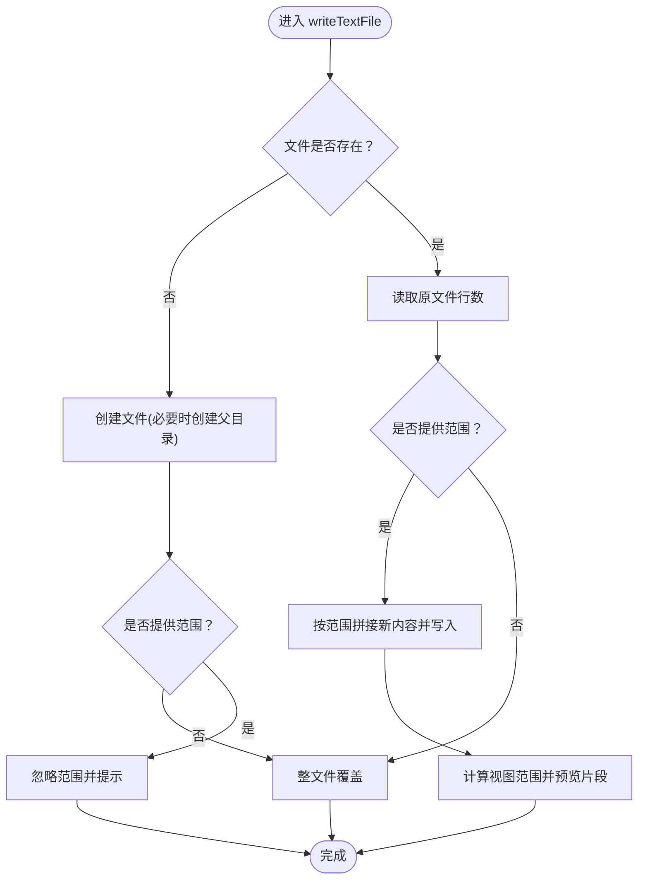
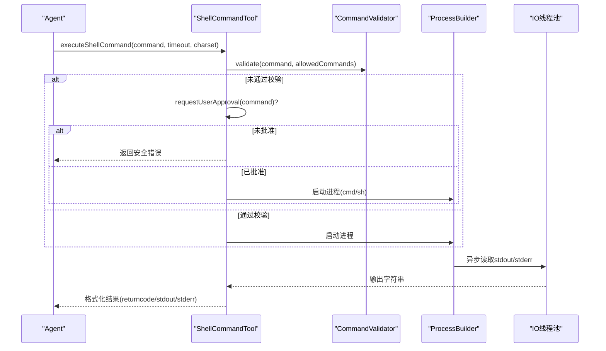
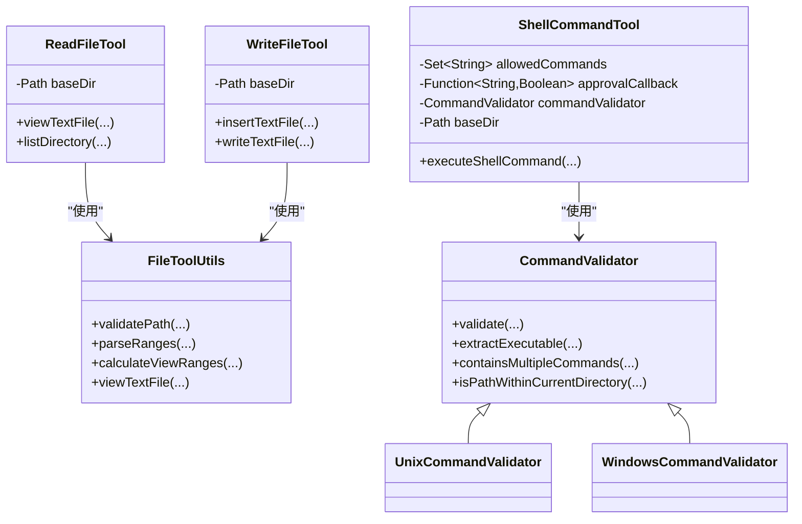

# 内置工具集

<cite>
**本文引用的文件**
- [TodoTools.java](file://agentscope-core/src/main/java/io/agentscope/core/tool/builtin/TodoTools.java)
- [ReadFileTool.java](file://agentscope-core/src/main/java/io/agentscope/core/tool/file/ReadFileTool.java)
- [WriteFileTool.java](file://agentscope-core/src/main/java/io/agentscope/core/tool/file/WriteFileTool.java)
- [ShellCommandTool.java](file://agentscope-core/src/main/java/io/agentscope/core/tool/coding/ShellCommandTool.java)
- [FileToolUtils.java](file://agentscope-core/src/main/java/io/agentscope/core/tool/file/FileToolUtils.java)
- [CommandValidator.java](file://agentscope-core/src/main/java/io/agentscope/core/tool/coding/CommandValidator.java)
- [UnixCommandValidator.java](file://agentscope-core/src/main/java/io/agentscope/core/tool/coding/UnixCommandValidator.java)
- [WindowsCommandValidator.java](file://agentscope-core/src/main/java/io/agentscope/core/tool/coding/WindowsCommandValidator.java)
</cite>

## 目录
1. [简介](#简介)
2. [项目结构](#项目结构)
3. [核心组件](#核心组件)
4. [架构总览](#架构总览)
5. [详细组件分析](#详细组件分析)
6. [依赖关系分析](#依赖关系分析)
7. [性能与资源限制](#性能与资源限制)
8. [故障排查指南](#故障排查指南)
9. [结论](#结论)
10. [附录：扩展与自定义开发指南](#附录扩展与自定义开发指南)

## 简介
本文件面向AgentScope Java的内置工具集，重点覆盖以下三类工具：
- 任务管理：TodoTools（会话级任务清单维护）
- 文件操作：ReadFileTool（文本文件查看/目录列举）、WriteFileTool（文本文件插入/写入）
- 命令执行：ShellCommandTool（跨平台安全命令执行）

文档将从功能特性、使用场景、参数配置、安全机制、错误处理与性能限制等方面进行系统化说明，并提供可直接定位到源码位置的“章节来源”和“图表来源”，帮助读者快速理解与实践。

## 项目结构
内置工具位于agentscope-core模块中，按职责分层组织：
- 任务管理：io.agentscope.core.tool.builtin.TodoTools
- 文件工具：io.agentscope.core.tool.file.ReadFileTool、WriteFileTool、FileToolUtils
- 命令执行：io.agentscope.core.tool.coding.ShellCommandTool、CommandValidator及其平台实现

图表来源
- [ReadFileTool.java:1-357](file://agentscope-core/src/main/java/io/agentscope/core/tool/file/ReadFileTool.java#L1-L357)
- [WriteFileTool.java:1-406](file://agentscope-core/src/main/java/io/agentscope/core/tool/file/WriteFileTool.java#L1-L406)
- [ShellCommandTool.java:1-800](file://agentscope-core/src/main/java/io/agentscope/core/tool/coding/ShellCommandTool.java#L1-L800)
- [FileToolUtils.java:1-161](file://agentscope-core/src/main/java/io/agentscope/core/tool/file/FileToolUtils.java#L1-L161)
- [CommandValidator.java:1-186](file://agentscope-core/src/main/java/io/agentscope/core/tool/coding/CommandValidator.java#L1-L186)
- [UnixCommandValidator.java:1-216](file://agentscope-core/src/main/java/io/agentscope/core/tool/coding/UnixCommandValidator.java#L1-L216)
- [WindowsCommandValidator.java:1-248](file://agentscope-core/src/main/java/io/agentscope/core/tool/coding/WindowsCommandValidator.java#L1-L248)

章节来源
- [ReadFileTool.java:1-357](file://agentscope-core/src/main/java/io/agentscope/core/tool/file/ReadFileTool.java#L1-L357)
- [WriteFileTool.java:1-406](file://agentscope-core/src/main/java/io/agentscope/core/tool/file/WriteFileTool.java#L1-L406)
- [ShellCommandTool.java:1-800](file://agentscope-core/src/main/java/io/agentscope/core/tool/coding/ShellCommandTool.java#L1-L800)
- [FileToolUtils.java:1-161](file://agentscope-core/src/main/java/io/agentscope/core/tool/file/FileToolUtils.java#L1-L161)
- [CommandValidator.java:1-186](file://agentscope-core/src/main/java/io/agentscope/core/tool/coding/CommandValidator.java#L1-L186)
- [UnixCommandValidator.java:1-216](file://agentscope-core/src/main/java/io/agentscope/core/tool/coding/UnixCommandValidator.java#L1-L216)
- [WindowsCommandValidator.java:1-248](file://agentscope-core/src/main/java/io/agentscope/core/tool/coding/WindowsCommandValidator.java#L1-L248)

## 核心组件
- 任务管理工具（TodoTools）
  - 提供会话级任务清单维护能力，支持完整列表替换语义，自动持久化至AgentState
  - 支持状态约束（最多一个进行中的任务），优先级标注，Markdown风格渲染
- 文件读取工具（ReadFileTool）
  - 支持查看文件全文或指定行范围，支持负索引（从末尾计数）
  - 支持目录列举，返回绝对路径列表；具备基础目录限制与路径校验
- 文件写入工具（WriteFileTool）
  - 支持在指定行插入内容，或按行范围替换/覆盖
  - 自动创建父目录；提供变更前后上下文片段预览
- 命令执行工具（ShellCommandTool）
  - 跨平台命令执行，支持白名单、用户审批回调、多命令检测、超时控制、字符集解码
  - 平台专用校验器（Unix/Windows）保障相对路径安全与多命令阻断

章节来源
- [TodoTools.java:1-262](file://agentscope-core/src/main/java/io/agentscope/core/tool/builtin/TodoTools.java#L1-L262)
- [ReadFileTool.java:1-357](file://agentscope-core/src/main/java/io/agentscope/core/tool/file/ReadFileTool.java#L1-L357)
- [WriteFileTool.java:1-406](file://agentscope-core/src/main/java/io/agentscope/core/tool/file/WriteFileTool.java#L1-L406)
- [ShellCommandTool.java:1-800](file://agentscope-core/src/main/java/io/agentscope/core/tool/coding/ShellCommandTool.java#L1-L800)

## 架构总览
内置工具通过统一的注解与接口暴露给Agent调用，遵循“工具即方法”的设计，结合框架的参数解析与结果封装，形成端到端的外部能力调用链。

图表来源
- [ReadFileTool.java:89-215](file://agentscope-core/src/main/java/io/agentscope/core/tool/file/ReadFileTool.java#L89-L215)
- [WriteFileTool.java:237-403](file://agentscope-core/src/main/java/io/agentscope/core/tool/file/WriteFileTool.java#L237-L403)
- [ShellCommandTool.java:425-542](file://agentscope-core/src/main/java/io/agentscope/core/tool/coding/ShellCommandTool.java#L425-L542)

## 详细组件分析

### 任务管理工具：TodoTools
- 功能要点
  - 单一工具名“todo_write”，接收完整更新后的任务列表，整体替换而非增量合并
  - 强制单个“进行中”任务规则，防止并发执行多个子任务
  - 任务状态枚举：pending/in_progress/completed
  - 优先级字段支持高/中/低，保留元数据以稳定标识
  - 渲染输出采用Markdown风格标记，便于人类阅读
- 参数与行为
  - 输入参数：List<TodoItem> todos（包含content/status/priority）
  - 输出：当前开放任务数量与清单摘要
- 使用场景
  - 需要规划与追踪多步骤工作流
  - 与中间件配合，每轮对话重申任务状态
- 安全与约束
  - 框架注入AgentState，确保状态持久化
  - 严格的状态与唯一性校验，拒绝非法输入
- 错误处理
  - 非法状态、空白内容、多重进行中等均返回错误信息

图表来源
- [TodoTools.java:92-173](file://agentscope-core/src/main/java/io/agentscope/core/tool/builtin/TodoTools.java#L92-L173)

章节来源
- [TodoTools.java:1-262](file://agentscope-core/src/main/java/io/agentscope/core/tool/builtin/TodoTools.java#L1-L262)

### 文件读取工具：ReadFileTool
- 功能要点
  - 查看文件全文或指定行范围（含负索引）
  - 列举目录内容，返回绝对路径列表
  - 可选baseDir限制，防止越权访问
- 参数与行为
  - viewTextFile(file_path, ranges?)
  - listDirectory(dir_path)
- 安全与约束
  - 路径校验：相对路径基于baseDir解析，绝对路径需在baseDir之内
  - 仅允许常规文件与目录，拒绝符号链接等异常路径
- 错误处理
  - 路径无效、不存在、非文件/目录、范围格式错误、读取异常等均返回错误消息

图表来源
- [ReadFileTool.java:89-215](file://agentscope-core/src/main/java/io/agentscope/core/tool/file/ReadFileTool.java#L89-L215)
- [FileToolUtils.java:49-79](file://agentscope-core/src/main/java/io/agentscope/core/tool/file/FileToolUtils.java#L49-L79)

章节来源
- [ReadFileTool.java:1-357](file://agentscope-core/src/main/java/io/agentscope/core/tool/file/ReadFileTool.java#L1-L357)
- [FileToolUtils.java:1-161](file://agentscope-core/src/main/java/io/agentscope/core/tool/file/FileToolUtils.java#L1-L161)

### 文件写入工具：WriteFileTool
- 功能要点
  - 插入内容：在指定行插入新行，其余行下移
  - 写入/覆盖：可按行范围替换，或整文件覆盖
  - 自动创建缺失的父目录
  - 变更后提供上下文片段预览
- 参数与行为
  - insertTextFile(file_path, content, line_number)
  - writeText_file(file_path, content, ranges?)
- 安全与约束
  - 路径校验与范围校验，避免越界与非法格式
  - 新建文件时忽略不适用的ranges
- 错误处理
  - 行号非法、目标文件不存在、范围格式错误、写入失败等返回错误

图表来源
- [WriteFileTool.java:237-403](file://agentscope-core/src/main/java/io/agentscope/core/tool/file/WriteFileTool.java#L237-L403)
- [FileToolUtils.java:118-159](file://agentscope-core/src/main/java/io/agentscope/core/tool/file/FileToolUtils.java#L118-L159)

章节来源
- [WriteFileTool.java:1-406](file://agentscope-core/src/main/java/io/agentscope/core/tool/file/WriteFileTool.java#L1-L406)
- [FileToolUtils.java:1-161](file://agentscope-core/src/main/java/io/agentscope/core/tool/file/FileToolUtils.java#L1-L161)

### 命令执行工具：ShellCommandTool
- 功能要点
  - 执行shell命令，返回XML风格的returncode/stdout/stderr
  - 白名单策略、多命令检测、相对路径安全校验、超时控制、字符集解码
  - 支持用户审批回调，非白名单命令可请求人工确认
- 参数与行为
  - execute_shell_command(command, timeout?, charset?)
- 安全与约束
  - 默认平台校验器：UnixCommandValidator/WindowsCommandValidator
  - 多命令分隔符阻断（&、|、;、换行等，按平台区分）
  - 相对路径执行限制（./或.\开头的命令需保持在当前目录内）
  - baseDir可限定工作目录
- 错误处理
  - 超时、中断、IO异常、拒绝执行（无回调或被拒绝）等均有明确错误输出

图表来源
- [ShellCommandTool.java:425-542](file://agentscope-core/src/main/java/io/agentscope/core/tool/coding/ShellCommandTool.java#L425-L542)
- [CommandValidator.java:60-91](file://agentscope-core/src/main/java/io/agentscope/core/tool/coding/CommandValidator.java#L60-L91)
- [UnixCommandValidator.java:49-91](file://agentscope-core/src/main/java/io/agentscope/core/tool/coding/UnixCommandValidator.java#L49-L91)
- [WindowsCommandValidator.java:52-95](file://agentscope-core/src/main/java/io/agentscope/core/tool/coding/WindowsCommandValidator.java#L52-L95)

章节来源
- [ShellCommandTool.java:1-800](file://agentscope-core/src/main/java/io/agentscope/core/tool/coding/ShellCommandTool.java#L1-L800)
- [CommandValidator.java:1-186](file://agentscope-core/src/main/java/io/agentscope/core/tool/coding/CommandValidator.java#L1-L186)
- [UnixCommandValidator.java:1-216](file://agentscope-core/src/main/java/io/agentscope/core/tool/coding/UnixCommandValidator.java#L1-L216)
- [WindowsCommandValidator.java:1-248](file://agentscope-core/src/main/java/io/agentscope/core/tool/coding/WindowsCommandValidator.java#L1-L248)

## 依赖关系分析
- 文件工具依赖FileToolUtils进行路径校验、范围解析与视图计算
- 命令工具依赖CommandValidator接口及平台实现（Unix/Windows）进行安全校验
- ShellCommandTool内部使用固定命名的线程池异步读取标准输出与错误输出，避免管道缓冲区死锁

图表来源
- [ReadFileTool.java:48-357](file://agentscope-core/src/main/java/io/agentscope/core/tool/file/ReadFileTool.java#L48-L357)
- [WriteFileTool.java:43-406](file://agentscope-core/src/main/java/io/agentscope/core/tool/file/WriteFileTool.java#L43-L406)
- [FileToolUtils.java:28-161](file://agentscope-core/src/main/java/io/agentscope/core/tool/file/FileToolUtils.java#L28-L161)
- [ShellCommandTool.java:73-800](file://agentscope-core/src/main/java/io/agentscope/core/tool/coding/ShellCommandTool.java#L73-L800)
- [CommandValidator.java:42-186](file://agentscope-core/src/main/java/io/agentscope/core/tool/coding/CommandValidator.java#L42-L186)
- [UnixCommandValidator.java:45-216](file://agentscope-core/src/main/java/io/agentscope/core/tool/coding/UnixCommandValidator.java#L45-L216)
- [WindowsCommandValidator.java:48-248](file://agentscope-core/src/main/java/io/agentscope/core/tool/coding/WindowsCommandValidator.java#L48-L248)

章节来源
- [ReadFileTool.java:1-357](file://agentscope-core/src/main/java/io/agentscope/core/tool/file/ReadFileTool.java#L1-L357)
- [WriteFileTool.java:1-406](file://agentscope-core/src/main/java/io/agentscope/core/tool/file/WriteFileTool.java#L1-L406)
- [ShellCommandTool.java:1-800](file://agentscope-core/src/main/java/io/agentscope/core/tool/coding/ShellCommandTool.java#L1-L800)
- [FileToolUtils.java:1-161](file://agentscope-core/src/main/java/io/agentscope/core/tool/file/FileToolUtils.java#L1-L161)
- [CommandValidator.java:1-186](file://agentscope-core/src/main/java/io/agentscope/core/tool/coding/CommandValidator.java#L1-L186)
- [UnixCommandValidator.java:1-216](file://agentscope-core/src/main/java/io/agentscope/core/tool/coding/UnixCommandValidator.java#L1-L216)
- [WindowsCommandValidator.java:1-248](file://agentscope-core/src/main/java/io/agentscope/core/tool/coding/WindowsCommandValidator.java#L1-L248)

## 性能与资源限制
- 文件工具
  - 读取/写入采用同步阻塞I/O，适合小到中等规模文件；大文件建议分段处理或限制范围
  - 视图预览采用固定额外行数（常量），避免过度输出
- 命令工具
  - 默认超时时间（秒）可在构造时配置；执行过程在独立调度器上运行
  - 异步线程池用于读取标准输出与错误输出，避免子进程缓冲区满导致的死锁
  - 字符集可按命令单独覆盖，默认UTF-8

章节来源
- [ShellCommandTool.java:76-98](file://agentscope-core/src/main/java/io/agentscope/core/tool/coding/ShellCommandTool.java#L76-L98)
- [ShellCommandTool.java:491-542](file://agentscope-core/src/main/java/io/agentscope/core/tool/coding/ShellCommandTool.java#L491-L542)
- [WriteFileTool.java:190-200](file://agentscope-core/src/main/java/io/agentscope/core/tool/file/WriteFileTool.java#L190-L200)

## 故障排查指南
- 任务管理
  - “最多一个进行中任务”错误：检查传入列表中仅有一个in_progress
  - 空内容或非法状态：确保content非空，status为允许值
- 文件读取
  - 路径无效/越权：确认baseDir设置与相对路径解析；避免..逃逸
  - 非文件/目录：确认目标为常规文件或目录
  - 范围格式错误：使用“start,end”或“[start,end]”，数值需在文件行数范围内
- 文件写入
  - 行号越界：line_number应在[1, 原文件行数+1]
  - 范围起始大于结束：修正范围顺序
- 命令执行
  - 多命令分隔符：避免在同一命令中使用&、|、;等（按平台不同）
  - 相对路径逃逸：./或.\开头的命令不得逃逸当前目录
  - 超时：适当增大timeout或简化命令
  - 编码问题：通过charset参数覆盖默认UTF-8

章节来源
- [TodoTools.java:113-134](file://agentscope-core/src/main/java/io/agentscope/core/tool/builtin/TodoTools.java#L113-L134)
- [ReadFileTool.java:114-193](file://agentscope-core/src/main/java/io/agentscope/core/tool/file/ReadFileTool.java#L114-L193)
- [WriteFileTool.java:111-175](file://agentscope-core/src/main/java/io/agentscope/core/tool/file/WriteFileTool.java#L111-L175)
- [ShellCommandTool.java:502-541](file://agentscope-core/src/main/java/io/agentscope/core/tool/coding/ShellCommandTool.java#L502-L541)

## 结论
内置工具集围绕“安全、易用、可观测”设计：
- 任务管理提供强一致的会话级状态
- 文件工具在路径与范围层面强化安全边界
- 命令工具在白名单、多命令阻断与超时控制方面构建了稳健的执行面

对于生产环境，建议：
- 文件工具：始终设置baseDir，避免越权访问
- 命令工具：启用白名单或审批回调，合理设置超时与字符集

## 附录：扩展与自定义开发指南
- 自定义文件工具
  - 复用FileToolUtils进行路径校验与范围解析
  - 在工具类中声明@Tool方法，返回Mono<ToolResultBlock>以适配异步执行
- 自定义命令校验器
  - 实现CommandValidator接口，覆盖extractExecutable、containsMultipleCommands与isPathWithinCurrentDirectory
  - 在ShellCommandTool构造时注入自定义校验器
- 自定义工具注册
  - 将工具实例注册到Agent的工具工厂或技能盒中，以便模型可见与调用

章节来源
- [FileToolUtils.java:49-159](file://agentscope-core/src/main/java/io/agentscope/core/tool/file/FileToolUtils.java#L49-L159)
- [CommandValidator.java:42-186](file://agentscope-core/src/main/java/io/agentscope/core/tool/coding/CommandValidator.java#L42-L186)
- [ShellCommandTool.java:198-222](file://agentscope-core/src/main/java/io/agentscope/core/tool/coding/ShellCommandTool.java#L198-L222)