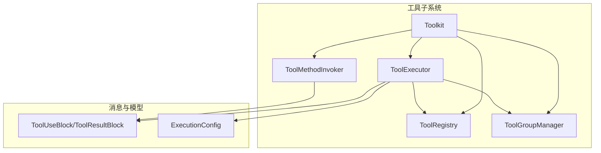
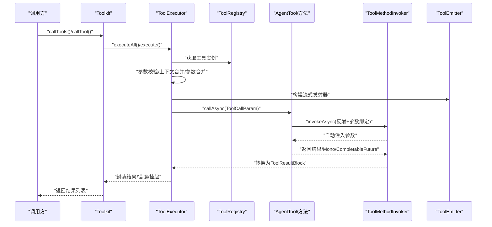
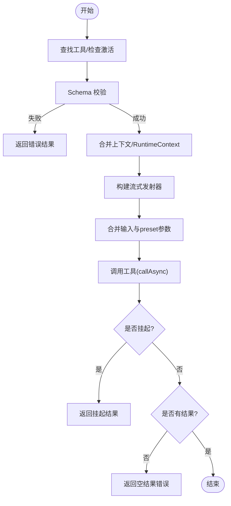
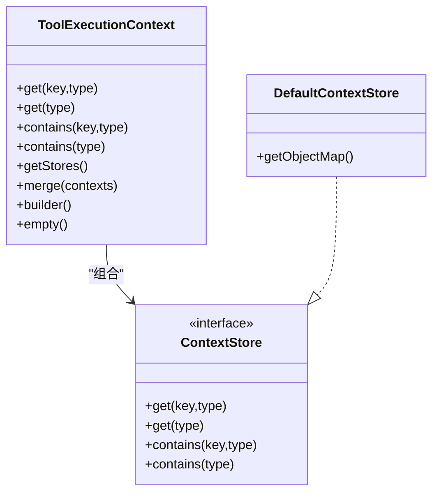
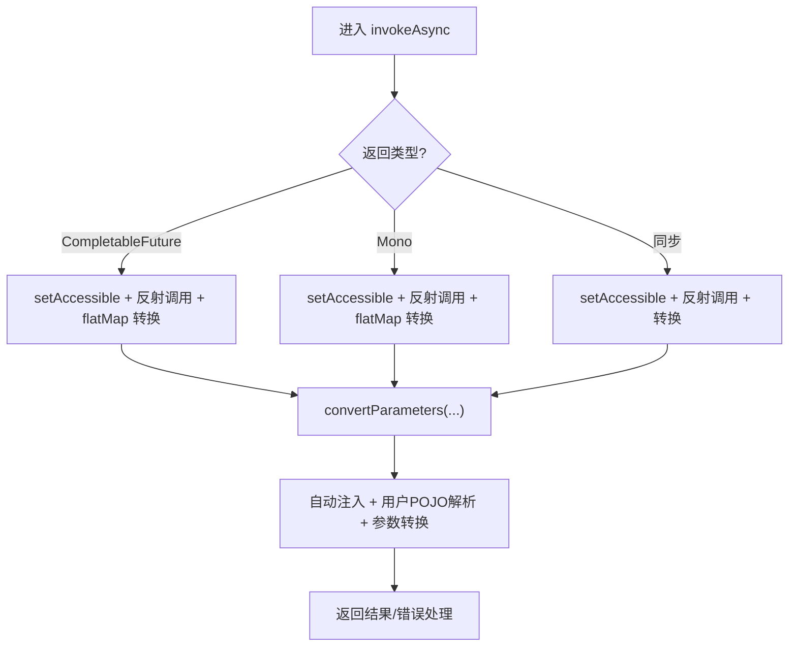
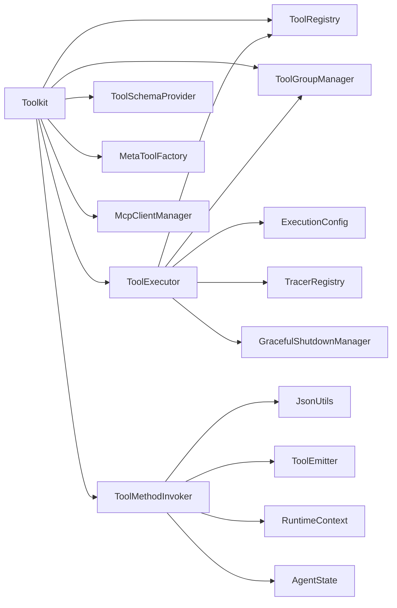

# 工具执行引擎

<cite>
**本文引用的文件**
- [ToolExecutor.java](file://agentscope-core/src/main/java/io/agentscope/core/tool/ToolExecutor.java)
- [ToolExecutionContext.java](file://agentscope-core/src/main/java/io/agentscope/core/tool/ToolExecutionContext.java)
- [ToolMethodInvoker.java](file://agentscope-core/src/main/java/io/agentscope/core/tool/ToolMethodInvoker.java)
- [AgentTool.java](file://agentscope-core/src/main/java/io/agentscope/core/tool/AgentTool.java)
- [Toolkit.java](file://agentscope-core/src/main/java/io/agentscope/core/tool/Toolkit.java)
- [ToolExecutorTest.java](file://agentscope-core/src/test/java/io/agentscope/core/tool/ToolExecutorTest.java)
- [SampleTools.java](file://agentscope-core/src/test/java/io/agentscope/core/tool/test/SampleTools.java)
</cite>

## 目录
1. [简介](#简介)
2. [项目结构](#项目结构)
3. [核心组件](#核心组件)
4. [架构总览](#架构总览)
5. [详细组件分析](#详细组件分析)
6. [依赖分析](#依赖分析)
7. [性能考虑](#性能考虑)
8. [故障排查指南](#故障排查指南)
9. [结论](#结论)
10. [附录：使用示例与最佳实践](#附录使用示例与最佳实践)

## 简介
本技术文档聚焦于 AgentScope Java 的工具执行引擎，系统性阐述以下主题：
- ToolExecutor 的执行调度与任务管理机制（单次、批量、顺序/并行、并发安全分区）
- ToolExecutionContext 的上下文传递与状态管理（优先级解析链、合并策略）
- ToolMethodInvoker 的方法调用反射机制与参数绑定过程（自动注入、类型转换、泛型提取）
- 工具执行生命周期（预处理、执行、后处理、异常处理）
- 同步/异步/流式工具的执行示例路径
- 超时控制、重试机制、中断处理
- 性能监控、资源管理、并发控制的最佳实践

## 项目结构
围绕工具执行引擎的关键模块与职责如下：
- Toolkit：工具注册、检索、模式生成、执行编排的门面；持有 ToolExecutor、ToolMethodInvoker、ToolRegistry、ToolGroupManager 等核心组件
- ToolExecutor：统一的工具执行器，负责调度、超时、重试、关闭保护、回调合并与结果封装
- ToolMethodInvoker：基于反射的工具方法调用器，负责参数绑定、类型转换、返回值转换与错误处理
- ToolExecutionContext：上下文容器（已弃用），通过多存储层按优先级解析对象；推荐使用 RuntimeContext
- AgentTool：工具接口，定义名称、描述、参数/输出模式、异步调用契约

图表来源
- [Toolkit.java:66-117](file://agentscope-core/src/main/java/io/agentscope/core/tool/Toolkit.java#L66-L117)
- [ToolExecutor.java:58-95](file://agentscope-core/src/main/java/io/agentscope/core/tool/ToolExecutor.java#L58-L95)
- [ToolMethodInvoker.java:38-44](file://agentscope-core/src/main/java/io/agentscope/core/tool/ToolMethodInvoker.java#L38-L44)

章节来源
- [Toolkit.java:37-65](file://agentscope-core/src/main/java/io/agentscope/core/tool/Toolkit.java#L37-L65)

## 核心组件
- ToolExecutor
  - 单工具执行：参数校验、上下文合并、参数合并（preset > input）、发射器构建、调用工具、异常与挂起处理、空结果兜底
  - 批量执行：顺序/并行模式；对“并发安全”的工具进行安全并发分组，非安全工具串行占位，保证状态隔离
  - 基础设施层：调度（boundedElastic 或自定义线程池）、超时、重试、优雅关停保护
- ToolMethodInvoker
  - 反射调用：支持同步、Mono、CompletableFuture 返回类型
  - 参数绑定：自动注入 ToolEmitter、Agent、RuntimeContext、AgentState、ToolExecutionContext（已弃用）；用户自定义 POJO 从 RuntimeContext 解析
  - 类型转换：JSON 编解码保留泛型；字符串回退到基本类型解析
  - 错误处理：传播 ToolSuspendException；其他异常包装为 ToolResultBlock.error
- ToolExecutionContext（已弃用）
  - 多存储层优先级解析：调用层 > Agent 层 > Toolkit 默认 > Spring（框架内）
  - 合并策略：按优先级拼接存储列表
- AgentTool
  - 异步调用契约：Mono<ToolResultBlock>
  - 模式定义：名称、描述、参数 JSON Schema、可选输出 Schema、严格模式

章节来源
- [ToolExecutor.java:167-291](file://agentscope-core/src/main/java/io/agentscope/core/tool/ToolExecutor.java#L167-L291)
- [ToolExecutor.java:305-407](file://agentscope-core/src/main/java/io/agentscope/core/tool/ToolExecutor.java#L305-L407)
- [ToolExecutor.java:411-488](file://agentscope-core/src/main/java/io/agentscope/core/tool/ToolExecutor.java#L411-L488)
- [ToolMethodInvoker.java:55-125](file://agentscope-core/src/main/java/io/agentscope/core/tool/ToolMethodInvoker.java#L55-L125)
- [ToolMethodInvoker.java:149-198](file://agentscope-core/src/main/java/io/agentscope/core/tool/ToolMethodInvoker.java#L149-L198)
- [ToolMethodInvoker.java:283-315](file://agentscope-core/src/main/java/io/agentscope/core/tool/ToolMethodInvoker.java#L283-L315)
- [ToolMethodInvoker.java:363-380](file://agentscope-core/src/main/java/io/agentscope/core/tool/ToolMethodInvoker.java#L363-L380)
- [ToolExecutionContext.java:52-184](file://agentscope-core/src/main/java/io/agentscope/core/tool/ToolExecutionContext.java#L52-L184)
- [AgentTool.java:40-118](file://agentscope-core/src/main/java/io/agentscope/core/tool/AgentTool.java#L40-L118)

## 架构总览
工具执行引擎以 Toolkit 为中心，协调注册、模式、执行与结果转换。下图展示了从调用方到工具方法的端到端流程。

图表来源
- [Toolkit.java:118-117](file://agentscope-core/src/main/java/io/agentscope/core/tool/Toolkit.java#L118-L117)
- [ToolExecutor.java:167-291](file://agentscope-core/src/main/java/io/agentscope/core/tool/ToolExecutor.java#L167-L291)
- [ToolMethodInvoker.java:55-125](file://agentscope-core/src/main/java/io/agentscope/core/tool/ToolMethodInvoker.java#L55-L125)

## 详细组件分析

### 组件一：ToolExecutor 执行调度与任务管理
- 单工具执行
  - 工具查找与激活检查
  - 输入参数与 preset 合并（preset 优先）
  - 上下文合并（RuntimeContext 与 Toolkit 默认）
  - Schema 校验
  - 流式发射器构建
  - 调用工具并处理 ToolSuspendException、空结果等边界情况
- 批量执行
  - 顺序模式：按声明顺序串行执行
  - 并行模式：对“并发安全”的工具进行安全并发分组，非安全工具单独串行槽位，保持状态隔离
- 基础设施层
  - 调度：默认 boundedElastic，或使用自定义 ExecutorService
  - 超时：基于 ExecutionConfig 的超时时间
  - 重试：指数退避、抖动、过滤条件、重试前日志
  - 关停保护：与全局优雅关停信号竞争，触发取消并抛出错误

图表来源
- [ToolExecutor.java:184-291](file://agentscope-core/src/main/java/io/agentscope/core/tool/ToolExecutor.java#L184-L291)

章节来源
- [ToolExecutor.java:167-291](file://agentscope-core/src/main/java/io/agentscope/core/tool/ToolExecutor.java#L167-L291)
- [ToolExecutor.java:305-407](file://agentscope-core/src/main/java/io/agentscope/core/tool/ToolExecutor.java#L305-L407)
- [ToolExecutor.java:411-488](file://agentscope-core/src/main/java/io/agentscope/core/tool/ToolExecutor.java#L411-L488)

### 组件二：ToolExecutionContext 上下文传递与状态管理
- 两层架构：外部接口 + 存储层（ContextStore）
- 优先级链：调用层 > Agent 层 > Toolkit 默认 > Spring（最高到最低）
- 查询策略：按优先级遍历存储，命中即返回
- 合并策略：将多个上下文的存储列表按优先级拼接
- 建议迁移：使用 RuntimeContext 注册 POJO，并在调用时传入

图表来源
- [ToolExecutionContext.java:52-184](file://agentscope-core/src/main/java/io/agentscope/core/tool/ToolExecutionContext.java#L52-L184)

章节来源
- [ToolExecutionContext.java:23-50](file://agentscope-core/src/main/java/io/agentscope/core/tool/ToolExecutionContext.java#L23-L50)
- [ToolExecutionContext.java:148-166](file://agentscope-core/src/main/java/io/agentscope/core/tool/ToolExecutionContext.java#L148-L166)

### 组件三：ToolMethodInvoker 方法调用与参数绑定
- 返回类型分支
  - CompletableFuture：转 Mono，等待完成并转换结果
  - Mono：直接 flatMap 转换
  - 同步：包装为 Mono.fromCallable
- 自动注入
  - ToolEmitter、Agent、RuntimeContext、AgentState、ToolExecutionContext（已弃用）
- 用户上下文 POJO 解析
  - 非 @ToolParam、非基础类型、非框架消息类型、非标准库包名 → 视为用户 POJO，从 RuntimeContext 解析
- 参数转换
  - 直接赋值：类型兼容且无泛型信息
  - JSON 转换：保留泛型类型信息
  - 字符串回退：基本类型字符串解析
- 泛型提取
  - 从 Mono<T>/CompletableFuture<T> 中提取 T，用于结果转换

图表来源
- [ToolMethodInvoker.java:55-125](file://agentscope-core/src/main/java/io/agentscope/core/tool/ToolMethodInvoker.java#L55-L125)
- [ToolMethodInvoker.java:149-198](file://agentscope-core/src/main/java/io/agentscope/core/tool/ToolMethodInvoker.java#L149-L198)
- [ToolMethodInvoker.java:283-315](file://agentscope-core/src/main/java/io/agentscope/core/tool/ToolMethodInvoker.java#L283-L315)

章节来源
- [ToolMethodInvoker.java:55-125](file://agentscope-core/src/main/java/io/agentscope/core/tool/ToolMethodInvoker.java#L55-L125)
- [ToolMethodInvoker.java:149-198](file://agentscope-core/src/main/java/io/agentscope/core/tool/ToolMethodInvoker.java#L149-L198)
- [ToolMethodInvoker.java:283-315](file://agentscope-core/src/main/java/io/agentscope/core/tool/ToolMethodInvoker.java#L283-L315)
- [ToolMethodInvoker.java:388-398](file://agentscope-core/src/main/java/io/agentscope/core/tool/ToolMethodInvoker.java#L388-L398)

### 组件四：工具执行生命周期与错误处理
- 生命周期阶段
  - 预处理：工具查找、激活检查、Schema 校验、上下文与参数合并、发射器构建
  - 执行：调用工具的 callAsync，内部由 ToolMethodInvoker 完成反射与参数绑定
  - 后处理：结果转换、流式回调、元数据填充（id/name）
  - 异常处理：ToolSuspendException 挂起、空 Mono 兜底、其他异常包装为错误结果
- 关键点
  - 挂起：ToolSuspendException 在 ToolExecutor 中被转换为挂起结果
  - 空结果：若工具未发出任何结果，返回错误提示
  - 错误传播：异常链中若包含 ToolSuspendException，则上抛以触发挂起逻辑

章节来源
- [ToolExecutor.java:184-291](file://agentscope-core/src/main/java/io/agentscope/core/tool/ToolExecutor.java#L184-L291)
- [ToolMethodInvoker.java:363-380](file://agentscope-core/src/main/java/io/agentscope/core/tool/ToolMethodInvoker.java#L363-L380)

## 依赖分析
- 组件耦合
  - Toolkit 对 ToolExecutor、ToolMethodInvoker、ToolRegistry、ToolGroupManager、ToolSchemaProvider、MetaToolFactory、McpClientManager 有强依赖
  - ToolExecutor 依赖 ToolRegistry、ToolGroupManager、ToolkitConfig、ExecutionConfig、TracerRegistry、GracefulShutdownManager
  - ToolMethodInvoker 依赖 ToolResultConverter、JsonUtils、ToolEmitter、Agent、RuntimeContext、AgentState
- 外部依赖
  - Reactor（Mono/Flux/Schedulers/Retry）
  - SLF4J 日志
  - Jackson/Jakarta JSON 工具（JsonUtils）

图表来源
- [Toolkit.java:66-117](file://agentscope-core/src/main/java/io/agentscope/core/tool/Toolkit.java#L66-L117)
- [ToolExecutor.java:58-95](file://agentscope-core/src/main/java/io/agentscope/core/tool/ToolExecutor.java#L58-L95)
- [ToolMethodInvoker.java:38-44](file://agentscope-core/src/main/java/io/agentscope/core/tool/ToolMethodInvoker.java#L38-L44)

章节来源
- [Toolkit.java:66-117](file://agentscope-core/src/main/java/io/agentscope/core/tool/Toolkit.java#L66-L117)
- [ToolExecutor.java:58-95](file://agentscope-core/src/main/java/io/agentscope/core/tool/ToolExecutor.java#L58-L95)
- [ToolMethodInvoker.java:38-44](file://agentscope-core/src/main/java/io/agentscope/core/tool/ToolMethodInvoker.java#L38-L44)

## 性能考虑
- 并发与分区
  - 并行执行时，仅对“并发安全”的工具进行安全并发分组，避免状态共享导致的竞争风险
  - 非安全工具独立串行槽位，确保顺序一致性与状态隔离
- 调度与线程
  - 默认使用 boundedElastic，适合 I/O 密集型工具；对于 CPU 密集型工具建议提供自定义线程池
- 超时与重试
  - 合理设置超时，避免长时间阻塞；重试应配合抖动与过滤条件，避免放大资源消耗
- 结果转换与序列化
  - 使用 JSON 编解码保留泛型类型，减少运行时类型擦除带来的转换开销
- 流式回调
  - 回调中避免阻塞操作，必要时异步化，防止影响其他回调执行

## 故障排查指南
- 常见问题
  - 工具未找到：检查工具名称与注册是否一致
  - 参数校验失败：核对 ToolUseBlock 的内容与工具参数 Schema
  - 工具未返回结果：确认工具实现是否正确发出结果或抛出异常
  - 并发冲突：将非并发安全工具标记为不安全，或调整执行顺序
- 排查步骤
  - 查看 ToolExecutor 的日志级别，定位具体阶段（校验/调用/转换/错误）
  - 检查 ToolMethodInvoker 的参数绑定与类型转换路径
  - 关注 ToolSuspendException 的传播路径，确认挂起逻辑是否按预期工作
- 相关测试参考
  - 单元测试覆盖了并行执行、错误包装、空结果兜底、中断异常处理等场景

章节来源
- [ToolExecutorTest.java:62-174](file://agentscope-core/src/test/java/io/agentscope/core/tool/ToolExecutorTest.java#L62-L174)
- [ToolMethodInvoker.java:363-380](file://agentscope-core/src/main/java/io/agentscope/core/tool/ToolMethodInvoker.java#L363-L380)

## 结论
工具执行引擎通过 Toolkit 进行统一编排，结合 ToolExecutor 的基础设施能力与 ToolMethodInvoker 的反射参数绑定，实现了高可靠、可扩展、可观测的工具执行体系。推荐在生产环境中：
- 明确工具的并发安全性，合理选择顺序/并行执行策略
- 使用 ExecutionConfig 控制超时与重试，结合日志与监控进行性能观测
- 将上下文迁移至 RuntimeContext，逐步弃用 ToolExecutionContext
- 对流式工具提供合适的回调与背压策略，保障吞吐与稳定性

## 附录：使用示例与最佳实践
- 同步工具
  - 示例路径：[SampleTools.java:35-50](file://agentscope-core/src/test/java/io/agentscope/core/tool/test/SampleTools.java#L35-L50)
  - 最佳实践：确保方法无阻塞；如需延迟，请使用异步版本
- 异步工具（CompletableFuture/Mono）
  - 示例路径：[SampleTools.java:118-133](file://agentscope-core/src/test/java/io/agentscope/core/tool/test/SampleTools.java#L118-L133)
  - 最佳实践：返回值及时完成；避免泄漏未完成的任务
- 流式工具
  - 示例路径：[Toolkit.java:118-117](file://agentscope-core/src/main/java/io/agentscope/core/tool/Toolkit.java#L118-L117)（通过 ToolEmitter 提供流式回调）
  - 最佳实践：在回调中避免阻塞；注意回调顺序与去重
- 超时控制
  - 示例路径：[ToolExecutor.java:418-430](file://agentscope-core/src/main/java/io/agentscope/core/tool/ToolExecutor.java#L418-L430)
  - 最佳实践：根据工具特性设置合理超时；对长耗时工具启用重试
- 重试机制
  - 示例路径：[ToolExecutor.java:432-471](file://agentscope-core/src/main/java/io/agentscope/core/tool/ToolExecutor.java#L432-L471)
  - 最佳实践：区分瞬时错误与永久错误；设置最大尝试次数与退避上限
- 中断处理
  - 示例路径：[ToolExecutor.java:478-488](file://agentscope-core/src/main/java/io/agentscope/core/tool/ToolExecutor.java#L478-L488)
  - 最佳实践：工具内部正确处理中断；避免忽略 Thread.currentThread().interrupt()