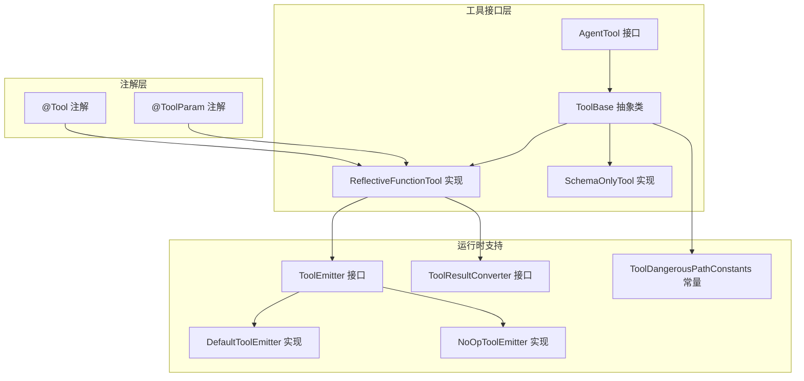
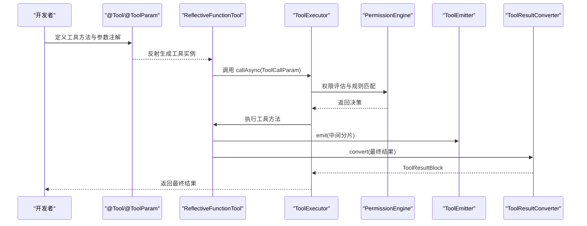
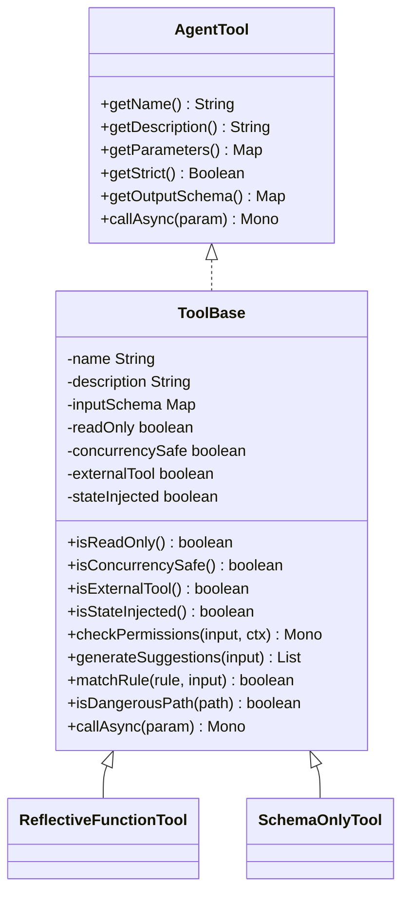
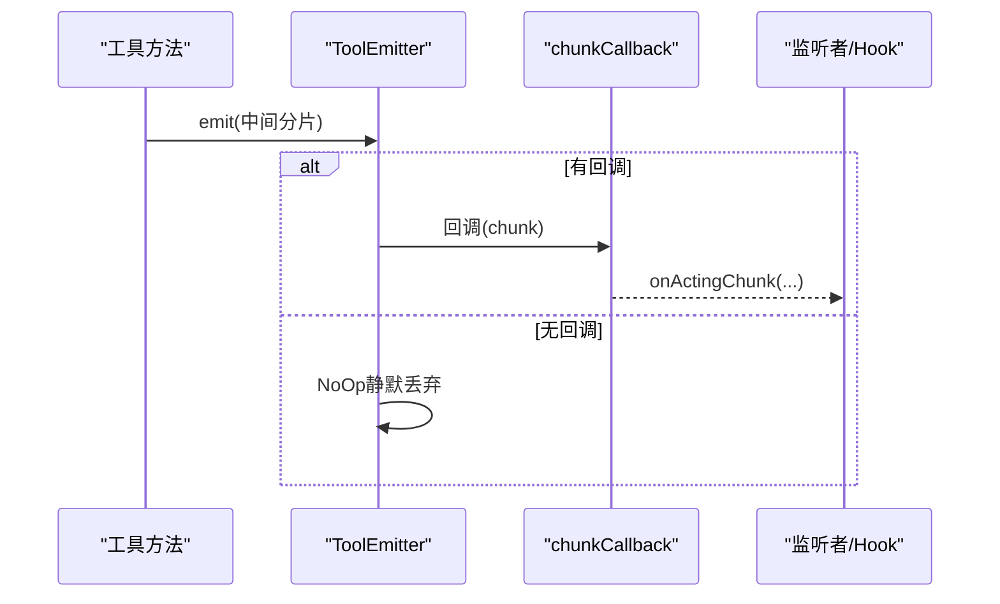
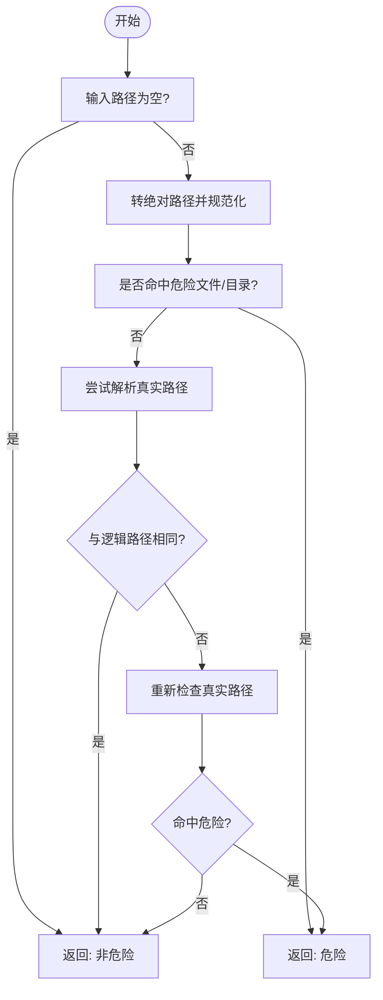
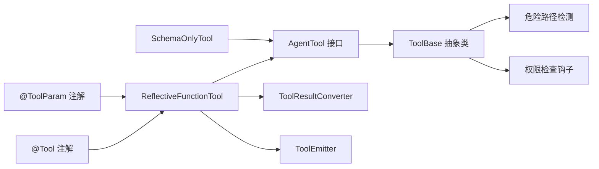

# 工具接口设计

<cite>
**本文引用的文件**
- [Tool.java](file://agentscope-core/src/main/java/io/agentscope/core/tool/Tool.java)
- [ToolParam.java](file://agentscope-core/src/main/java/io/agentscope/core/tool/ToolParam.java)
- [ToolBase.java](file://agentscope-core/src/main/java/io/agentscope/core/tool/ToolBase.java)
- [ToolEmitter.java](file://agentscope-core/src/main/java/io/agentscope/core/tool/ToolEmitter.java)
- [DefaultToolEmitter.java](file://agentscope-core/src/main/java/io/agentscope/core/tool/DefaultToolEmitter.java)
- [NoOpToolEmitter.java](file://agentscope-core/src/main/java/io/agentscope/core/tool/NoOpToolEmitter.java)
- [ToolDangerousPathConstants.java](file://agentscope-core/src/main/java/io/agentscope/core/tool/ToolDangerousPathConstants.java)
- [ToolResultConverter.java](file://agentscope-core/src/main/java/io/agentscope/core/tool/ToolResultConverter.java)
- [ReflectiveFunctionTool.java](file://agentscope-core/src/main/java/io/agentscope/core/tool/ReflectiveFunctionTool.java)
- [SchemaOnlyTool.java](file://agentscope-core/src/main/java/io/agentscope/core/tool/SchemaOnlyTool.java)
- [AgentTool.java](file://agentscope-core/src/main/java/io/agentscope/core/tool/AgentTool.java)
</cite>

## 目录
1. [简介](#简介)
2. [项目结构](#项目结构)
3. [核心组件](#核心组件)
4. [架构总览](#架构总览)
5. [详细组件分析](#详细组件分析)
6. [依赖关系分析](#依赖关系分析)
7. [性能考量](#性能考量)
8. [故障排查指南](#故障排查指南)
9. [结论](#结论)
10. [附录：最佳实践与常见陷阱](#附录最佳实践与常见陷阱)

## 简介
本文件面向AgentScope Java的工具接口设计，系统性阐述@Tool注解、ToolBase基类、ToolParam参数注解、ToolEmitter事件发射器、结果转换器以及外部工具等关键构件的设计理念、使用方式与实现细节。文档同时覆盖工具安全属性（只读、并发安全、危险路径保护）、工具类型（标准工具、异步工具、流式工具）的创建范式，并给出最佳实践与常见陷阱，帮助开发者在保证安全性与可维护性的前提下高效构建工具。

## 项目结构
工具相关的核心代码位于agentscope-core模块的tool包内，围绕以下关键接口与抽象类展开：
- 注解层：@Tool、@ToolParam
- 抽象层：ToolBase（继承AgentTool）
- 运行时桥接：ReflectiveFunctionTool（基于@Tool方法生成）
- 外部工具：SchemaOnlyTool
- 流式输出：ToolEmitter及其默认实现
- 安全常量：ToolDangerousPathConstants
- 结果转换：ToolResultConverter

图表来源
- [AgentTool.java:40-119](file://agentscope-core/src/main/java/io/agentscope/core/tool/AgentTool.java#L40-L119)
- [ToolBase.java:60-342](file://agentscope-core/src/main/java/io/agentscope/core/tool/ToolBase.java#L60-L342)
- [ReflectiveFunctionTool.java:39-175](file://agentscope-core/src/main/java/io/agentscope/core/tool/ReflectiveFunctionTool.java#L39-L175)
- [SchemaOnlyTool.java:57-140](file://agentscope-core/src/main/java/io/agentscope/core/tool/SchemaOnlyTool.java#L57-L140)
- [Tool.java:60-194](file://agentscope-core/src/main/java/io/agentscope/core/tool/Tool.java#L60-L194)
- [ToolParam.java:62-105](file://agentscope-core/src/main/java/io/agentscope/core/tool/ToolParam.java#L62-L105)
- [ToolEmitter.java:59-72](file://agentscope-core/src/main/java/io/agentscope/core/tool/ToolEmitter.java#L59-L72)
- [DefaultToolEmitter.java:28-61](file://agentscope-core/src/main/java/io/agentscope/core/tool/DefaultToolEmitter.java#L28-L61)
- [NoOpToolEmitter.java:26-46](file://agentscope-core/src/main/java/io/agentscope/core/tool/NoOpToolEmitter.java#L26-L46)
- [ToolDangerousPathConstants.java:27-81](file://agentscope-core/src/main/java/io/agentscope/core/tool/ToolDangerousPathConstants.java#L27-L81)
- [ToolResultConverter.java:48-59](file://agentscope-core/src/main/java/io/agentscope/core/tool/ToolResultConverter.java#L48-L59)

章节来源
- [Tool.java:24-194](file://agentscope-core/src/main/java/io/agentscope/core/tool/Tool.java#L24-L194)
- [ToolParam.java:24-105](file://agentscope-core/src/main/java/io/agentscope/core/tool/ToolParam.java#L24-L105)
- [ToolBase.java:34-342](file://agentscope-core/src/main/java/io/agentscope/core/tool/ToolBase.java#L34-L342)
- [ToolEmitter.java:20-72](file://agentscope-core/src/main/java/io/agentscope/core/tool/ToolEmitter.java#L20-L72)
- [DefaultToolEmitter.java:22-61](file://agentscope-core/src/main/java/io/agentscope/core/tool/DefaultToolEmitter.java#L22-L61)
- [NoOpToolEmitter.java:20-46](file://agentscope-core/src/main/java/io/agentscope/core/tool/NoOpToolEmitter.java#L20-L46)
- [ToolDangerousPathConstants.java:20-81](file://agentscope-core/src/main/java/io/agentscope/core/tool/ToolDangerousPathConstants.java#L20-L81)
- [ToolResultConverter.java:21-59](file://agentscope-core/src/main/java/io/agentscope/core/tool/ToolResultConverter.java#L21-L59)
- [ReflectiveFunctionTool.java:28-175](file://agentscope-core/src/main/java/io/agentscope/core/tool/ReflectiveFunctionTool.java#L28-L175)
- [SchemaOnlyTool.java:26-140](file://agentscope-core/src/main/java/io/agentscope/core/tool/SchemaOnlyTool.java#L26-L140)
- [AgentTool.java:22-119](file://agentscope-core/src/main/java/io/agentscope/core/tool/AgentTool.java#L22-L119)

## 核心组件
- @Tool注解：用于标记方法为工具，声明工具名称、描述、严格模式、只读、并发安全、外部工具、状态注入、危险文件/目录、自定义结果转换器等元数据。
- @ToolParam注解：用于描述工具参数的名称、是否必需、描述，确保JSON Schema生成与LLM理解一致。
- ToolBase抽象类：统一实现AgentTool，提供权限检查钩子、规则建议、危险路径检测、Builder构造、外部工具默认调用策略等。
- ToolEmitter接口及其实现：支持工具执行过程中的流式分片输出，仅对监听者可见，不影响最终返回给模型的结果。
- ToolResultConverter接口：允许自定义工具返回值到ToolResultBlock的转换逻辑，便于过滤敏感信息、格式化或压缩。
- ReflectiveFunctionTool：基于@Tool方法生成的具体工具实现，负责参数Schema生成、调用器集成、严格模式传递。
- SchemaOnlyTool：仅注册Schema的外部工具，通过抛出特定异常将调用挂起交由框架处理。

章节来源
- [Tool.java:60-194](file://agentscope-core/src/main/java/io/agentscope/core/tool/Tool.java#L60-L194)
- [ToolParam.java:62-105](file://agentscope-core/src/main/java/io/agentscope/core/tool/ToolParam.java#L62-L105)
- [ToolBase.java:60-342](file://agentscope-core/src/main/java/io/agentscope/core/tool/ToolBase.java#L60-L342)
- [ToolEmitter.java:59-72](file://agentscope-core/src/main/java/io/agentscope/core/tool/ToolEmitter.java#L59-L72)
- [DefaultToolEmitter.java:28-61](file://agentscope-core/src/main/java/io/agentscope/core/tool/DefaultToolEmitter.java#L28-L61)
- [NoOpToolEmitter.java:26-46](file://agentscope-core/src/main/java/io/agentscope/core/tool/NoOpToolEmitter.java#L26-L46)
- [ToolResultConverter.java:48-59](file://agentscope-core/src/main/java/io/agentscope/core/tool/ToolResultConverter.java#L48-L59)
- [ReflectiveFunctionTool.java:39-175](file://agentscope-core/src/main/java/io/agentscope/core/tool/ReflectiveFunctionTool.java#L39-L175)
- [SchemaOnlyTool.java:57-140](file://agentscope-core/src/main/java/io/agentscope/core/tool/SchemaOnlyTool.java#L57-L140)
- [AgentTool.java:40-119](file://agentscope-core/src/main/java/io/agentscope/core/tool/AgentTool.java#L40-L119)

## 架构总览
工具体系从注解驱动到运行时桥接再到安全与流式输出的完整链路如下：

图表来源
- [ReflectiveFunctionTool.java:160-165](file://agentscope-core/src/main/java/io/agentscope/core/tool/ReflectiveFunctionTool.java#L160-L165)
- [ToolBase.java:196-199](file://agentscope-core/src/main/java/io/agentscope/core/tool/ToolBase.java#L196-L199)
- [ToolEmitter.java:61-70](file://agentscope-core/src/main/java/io/agentscope/core/tool/ToolEmitter.java#L61-L70)
- [ToolResultConverter.java:50-57](file://agentscope-core/src/main/java/io/agentscope/core/tool/ToolResultConverter.java#L50-L57)

## 详细组件分析

### @Tool注解设计与使用
- 设计理念
  - 将“工具元数据”与“方法签名”解耦，通过注解声明工具行为，框架自动发现并生成JSON Schema。
  - 提供严格模式、只读、并发安全、外部工具、状态注入、危险文件/目录白/黑名单、自定义结果转换器等细粒度控制。
- 使用要点
  - 方法必须全部参数标注@ToolParam（ToolEmitter除外），返回类型支持字符串或响应式类型。
  - 名称遵循snake_case，描述需清晰说明用途与返回值。
  - 外部工具通过externalTool=true启用，调用将被挂起交由框架处理。
- 关键属性
  - name/description：工具名与描述
  - strict：严格模式
  - readOnly/concurrencySafe：只读与并发安全
  - externalTool/stateInjected：外部工具与状态注入
  - dangerousFiles/dangerousDirectories：危险文件/目录
  - converter：自定义结果转换器

章节来源
- [Tool.java:24-194](file://agentscope-core/src/main/java/io/agentscope/core/tool/Tool.java#L24-L194)

### @ToolParam参数注解
- 设计理念
  - 参数名必填，弥补Java运行时不保留参数名的限制；描述帮助LLM理解参数取值范围与约束。
- 使用要点
  - 必须为每个非ToolEmitter参数添加@ToolParam，参数名遵循snake_case。
  - required=false表示可选参数，未提供时接收null或默认值。
- 类型系统与验证
  - 通过注解生成JSON Schema，配合strict模式由模型端进行更强校验。

章节来源
- [ToolParam.java:24-105](file://agentscope-core/src/main/java/io/agentscope/core/tool/ToolParam.java#L24-L105)

### ToolBase基类与扩展点
- 统一能力
  - 实现AgentTool，暴露名称、描述、参数Schema、严格模式、输出Schema等。
  - 默认callAsync对非外部工具抛出不支持错误，要求子类覆盖。
- 权限与安全
  - checkPermissions：子类可重写以实现细粒度许可策略。
  - generateSuggestions/matchRule：生成建议规则与规则匹配。
  - isDangerousPath：基于危险文件/目录列表进行路径安全判定，解析符号链接避免绕过。
- 构造与配置
  - Builder模式，支持readOnly、concurrencySafe、externalTool、stateInjected、mcp/mcpName、dangerousFiles/dangerousDirectories等。
- 外部工具支持
  - isExternalTool为true时，callAsync抛出ToolSuspendException，交由框架处理。

图表来源
- [AgentTool.java:40-119](file://agentscope-core/src/main/java/io/agentscope/core/tool/AgentTool.java#L40-L119)
- [ToolBase.java:60-342](file://agentscope-core/src/main/java/io/agentscope/core/tool/ToolBase.java#L60-L342)
- [ReflectiveFunctionTool.java:39-175](file://agentscope-core/src/main/java/io/agentscope/core/tool/ReflectiveFunctionTool.java#L39-L175)
- [SchemaOnlyTool.java:57-140](file://agentscope-core/src/main/java/io/agentscope/core/tool/SchemaOnlyTool.java#L57-L140)

章节来源
- [ToolBase.java:34-342](file://agentscope-core/src/main/java/io/agentscope/core/tool/ToolBase.java#L34-L342)

### ToolEmitter事件发射器
- 工作原理
  - 自动注入到工具方法签名中（无需@ToolParam），用于发送中间分片到监听者，不影响最终返回给模型的结果。
  - 框架内部创建DefaultToolEmitter，回调至hooks；若无回调则使用NoOpToolEmitter静默丢弃。
- 使用场景
  - 长耗时任务的进度反馈、调试日志、中间态提示等。
- 注意事项
  - 分片仅对监听者可见，不要依赖其向模型传递关键信息。

图表来源
- [ToolEmitter.java:20-72](file://agentscope-core/src/main/java/io/agentscope/core/tool/ToolEmitter.java#L20-L72)
- [DefaultToolEmitter.java:28-61](file://agentscope-core/src/main/java/io/agentscope/core/tool/DefaultToolEmitter.java#L28-L61)
- [NoOpToolEmitter.java:26-46](file://agentscope-core/src/main/java/io/agentscope/core/tool/NoOpToolEmitter.java#L26-L46)

章节来源
- [ToolEmitter.java:20-72](file://agentscope-core/src/main/java/io/agentscope/core/tool/ToolEmitter.java#L20-L72)
- [DefaultToolEmitter.java:22-61](file://agentscope-core/src/main/java/io/agentscope/core/tool/DefaultToolEmitter.java#L22-L61)
- [NoOpToolEmitter.java:20-46](file://agentscope-core/src/main/java/io/agentscope/core/tool/NoOpToolEmitter.java#L20-L46)

### 工具安全属性配置
- 只读工具（readOnly）
  - 在EXPLORE与ACCEPT_EDITS模式下自动放行，符合ToolBase.isReadOnly契约。
- 并发安全（concurrencySafe）
  - 默认true，典型纯函数工具；若存在共享状态需设为false以串行化调用。
- 危险文件与目录保护
  - 默认名单来自ToolDangerousPathConstants，ToolBase提供isDangerousPath统一校验，解析真实路径防止符号链接绕过。
  - 子类可通过Builder替换默认名单，实现更严格或更宽松的策略。

图表来源
- [ToolBase.java:224-267](file://agentscope-core/src/main/java/io/agentscope/core/tool/ToolBase.java#L224-L267)
- [ToolDangerousPathConstants.java:27-81](file://agentscope-core/src/main/java/io/agentscope/core/tool/ToolDangerousPathConstants.java#L27-L81)

章节来源
- [Tool.java:100-118](file://agentscope-core/src/main/java/io/agentscope/core/tool/Tool.java#L100-L118)
- [ToolBase.java:224-267](file://agentscope-core/src/main/java/io/agentscope/core/tool/ToolBase.java#L224-L267)
- [ToolDangerousPathConstants.java:27-81](file://agentscope-core/src/main/java/io/agentscope/core/tool/ToolDangerousPathConstants.java#L27-L81)

### 工具类型与创建范式
- 标准工具（同步/异步）
  - 使用@Tool标注方法，所有参数使用@ToolParam，返回字符串或响应式类型。
  - 框架通过ReflectiveFunctionTool桥接，生成参数Schema并调用具体实现。
- 异步工具
  - AgentTool要求callAsync返回Mono，ToolBase默认非外部工具抛不支持，子类需覆盖实现。
- 流式工具
  - 在方法签名中声明ToolEmitter参数，使用emit发送中间分片；最终返回值作为ToolResultBlock发送给模型。
- 外部工具
  - 设置externalTool=true或使用SchemaOnlyTool，callAsync抛出ToolSuspendException，框架将其转为挂起消息。

章节来源
- [Tool.java:45-51](file://agentscope-core/src/main/java/io/agentscope/core/tool/Tool.java#L45-L51)
- [ReflectiveFunctionTool.java:160-165](file://agentscope-core/src/main/java/io/agentscope/core/tool/ReflectiveFunctionTool.java#L160-L165)
- [SchemaOnlyTool.java:135-138](file://agentscope-core/src/main/java/io/agentscope/core/tool/SchemaOnlyTool.java#L135-L138)
- [ToolEmitter.java:20-72](file://agentscope-core/src/main/java/io/agentscope/core/tool/ToolEmitter.java#L20-L72)

## 依赖关系分析
- 注解驱动：@Tool与@ToolParam决定工具元数据与参数Schema生成。
- 运行时桥接：ReflectiveFunctionTool将注解元数据映射到ToolBase契约，统一接入权限引擎与执行器。
- 安全与流式：ToolBase内置危险路径检测；ToolEmitter提供中间分片能力；ToolResultConverter控制最终结果呈现。
- 外部工具：SchemaOnlyTool与externalTool路径共同构成外部执行的统一入口。

图表来源
- [Tool.java:60-194](file://agentscope-core/src/main/java/io/agentscope/core/tool/Tool.java#L60-L194)
- [ToolParam.java:62-105](file://agentscope-core/src/main/java/io/agentscope/core/tool/ToolParam.java#L62-L105)
- [ReflectiveFunctionTool.java:39-175](file://agentscope-core/src/main/java/io/agentscope/core/tool/ReflectiveFunctionTool.java#L39-L175)
- [ToolBase.java:60-342](file://agentscope-core/src/main/java/io/agentscope/core/tool/ToolBase.java#L60-L342)
- [ToolResultConverter.java:48-59](file://agentscope-core/src/main/java/io/agentscope/core/tool/ToolResultConverter.java#L48-L59)
- [ToolEmitter.java:59-72](file://agentscope-core/src/main/java/io/agentscope/core/tool/ToolEmitter.java#L59-L72)
- [SchemaOnlyTool.java:57-140](file://agentscope-core/src/main/java/io/agentscope/core/tool/SchemaOnlyTool.java#L57-L140)

章节来源
- [Tool.java:60-194](file://agentscope-core/src/main/java/io/agentscope/core/tool/Tool.java#L60-L194)
- [ToolParam.java:62-105](file://agentscope-core/src/main/java/io/agentscope/core/tool/ToolParam.java#L62-L105)
- [ToolBase.java:60-342](file://agentscope-core/src/main/java/io/agentscope/core/tool/ToolBase.java#L60-L342)
- [ReflectiveFunctionTool.java:39-175](file://agentscope-core/src/main/java/io/agentscope/core/tool/ReflectiveFunctionTool.java#L39-L175)
- [SchemaOnlyTool.java:57-140](file://agentscope-core/src/main/java/io/agentscope/core/tool/SchemaOnlyTool.java#L57-L140)
- [ToolResultConverter.java:48-59](file://agentscope-core/src/main/java/io/agentscope/core/tool/ToolResultConverter.java#L48-L59)
- [ToolEmitter.java:59-72](file://agentscope-core/src/main/java/io/agentscope/core/tool/ToolEmitter.java#L59-L72)

## 性能考量
- 并发安全
  - 默认concurrencySafe=true，适合无共享状态的纯函数工具；存在共享资源时应设为false以避免竞态。
- 流式输出
  - emit调用应避免过于频繁的小块，减少回调开销；合并小片段或按固定节奏发送。
- 结果转换
  - 自定义converter可能引入序列化/过滤成本，建议缓存或延迟处理大对象。
- 外部工具
  - externalTool路径将调用挂起，减少本地阻塞；但需确保外部执行端具备足够吞吐能力。

## 故障排查指南
- 调用未生效
  - 若isExternalTool为true且未正确处理挂起，请确认框架已捕获ToolSuspendException并转为挂起消息。
- 权限拒绝
  - 检查checkPermissions是否返回DENY或ASK；必要时在子类中重写以细化策略。
- 危险路径误判
  - 核对dangerousFiles/dangerousDirectories配置；注意符号链接解析可能导致路径变化。
- 参数Schema不匹配
  - 确认所有参数均标注@ToolParam且名称与描述准确；开启strict模式后模型端会更严格校验。
- 流式输出无效
  - 确保方法签名包含ToolEmitter且未被NoOp实现替代；检查chunkCallback是否配置。

章节来源
- [ToolBase.java:196-216](file://agentscope-core/src/main/java/io/agentscope/core/tool/ToolBase.java#L196-L216)
- [ReflectiveFunctionTool.java:160-165](file://agentscope-core/src/main/java/io/agentscope/core/tool/ReflectiveFunctionTool.java#L160-L165)
- [SchemaOnlyTool.java:135-138](file://agentscope-core/src/main/java/io/agentscope/core/tool/SchemaOnlyTool.java#L135-L138)
- [ToolEmitter.java:61-70](file://agentscope-core/src/main/java/io/agentscope/core/tool/ToolEmitter.java#L61-L70)

## 结论
AgentScope Java的工具接口设计以注解驱动为核心，结合ToolBase提供的统一抽象、权限与安全钩子、流式输出与结果转换机制，形成从声明到执行、从安全到可观测的完整闭环。通过合理配置只读、并发安全、危险路径保护与严格模式，开发者可在保障安全的前提下快速构建高性能、可维护的工具集。

## 附录：最佳实践与常见陷阱
- 最佳实践
  - 工具命名与参数命名采用snake_case，描述清晰明确，有助于LLM正确选择与调用。
  - 对于有副作用的工具，设置readOnly=false并谨慎配置concurrencySafe；涉及文件系统操作时利用dangerousFiles/dangerousDirectories强化保护。
  - 使用ToolEmitter进行长任务的进度反馈，但不要依赖其向模型传递关键信息。
  - 自定义ToolResultConverter时，优先考虑敏感信息过滤与输出格式化。
  - 外部工具统一走externalTool或SchemaOnlyTool路径，确保框架能正确处理挂起与恢复。
- 常见陷阱
  - 忘记为参数添加@ToolParam或遗漏ToolEmitter参数注解，导致Schema生成失败或签名不匹配。
  - 将AgentState参数同时标注@ToolParam，违反类型自动注入契约。
  - 在非外部工具上直接调用ToolBase默认的callAsync，导致不支持异常。
  - 低估危险路径检测的边界情况，未考虑符号链接与大小写差异。
  - 过度频繁emit造成回调压力，影响整体吞吐。