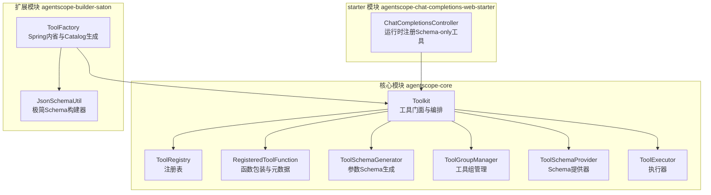
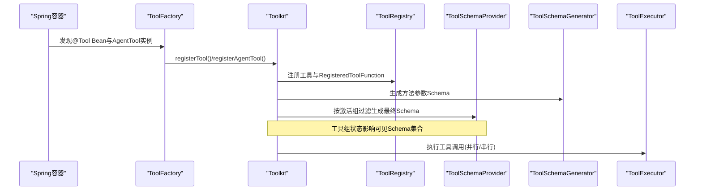
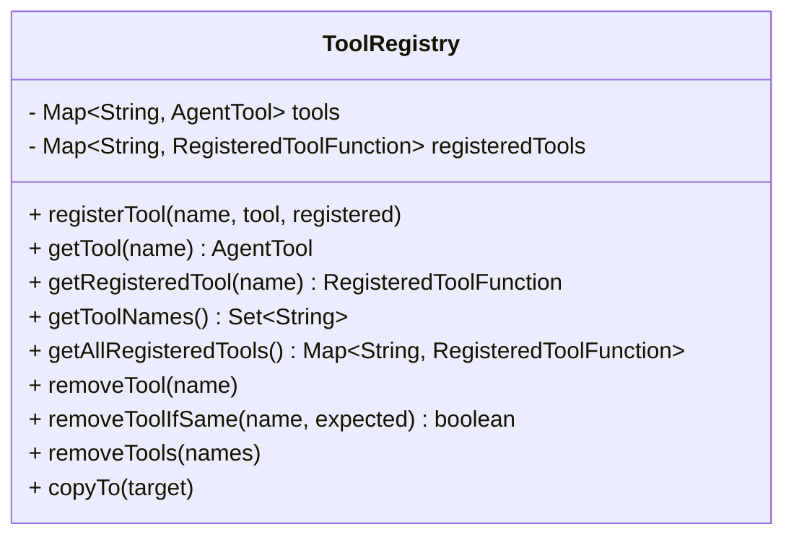
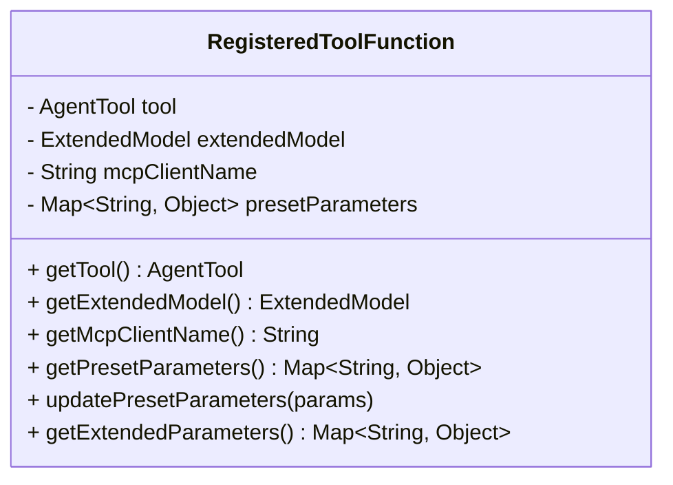
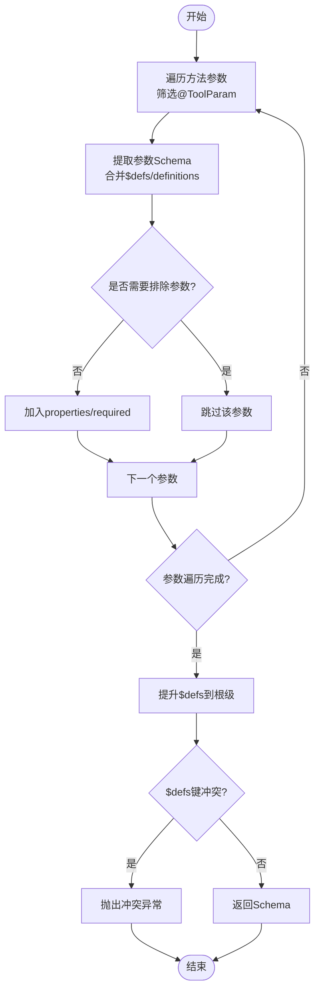
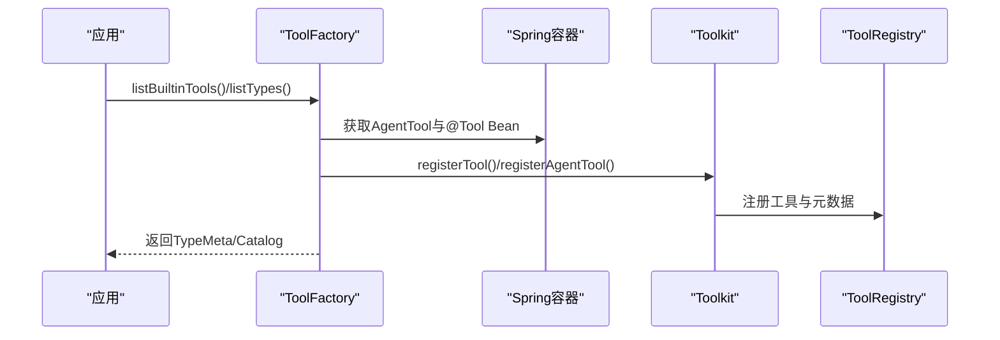
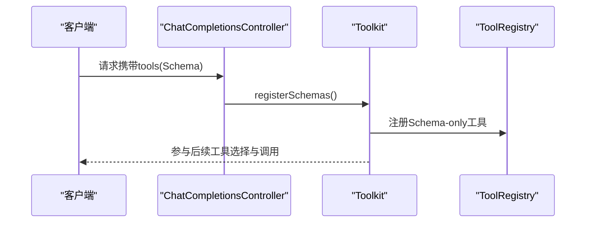
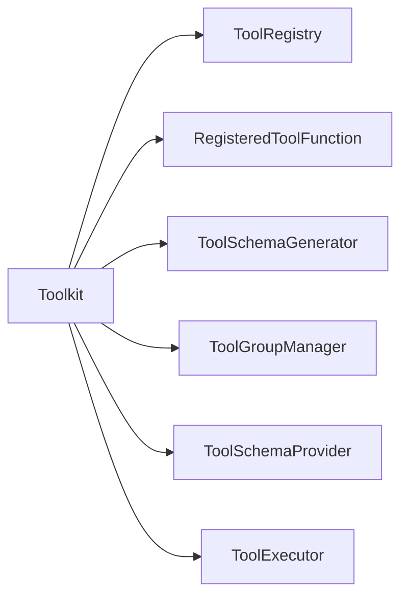

# 工具注册与发现

<cite>
**本文引用的文件**   
- [ToolRegistry.java](file://agentscope-core/src/main/java/io/agentscope/core/tool/ToolRegistry.java)
- [RegisteredToolFunction.java](file://agentscope-core/src/main/java/io/agentscope/core/tool/RegisteredToolFunction.java)
- [ToolSchemaGenerator.java](file://agentscope-core/src/main/java/io/agentscope/core/tool/ToolSchemaGenerator.java)
- [Toolkit.java](file://agentscope-core/src/main/java/io/agentscope/core/tool/Toolkit.java)
- [ToolGroupManager.java](file://agentscope-core/src/main/java/io/agentscope/core/tool/ToolGroupManager.java)
- [ToolSchemaProvider.java](file://agentscope-core/src/main/java/io/agentscope/core/tool/ToolSchemaProvider.java)
- [ToolExecutor.java](file://agentscope-core/src/main/java/io/agentscope/core/tool/ToolExecutor.java)
- [ToolFactory.java](file://agentscope-builder-saton/src/main/java/io/agentscope/builder/saton/factory/tool/ToolFactory.java)
- [JsonSchemaUtil.java](file://agentscope-builder-saton/src/main/java/io/agentscope/builder/saton/factory/core/JsonSchemaUtil.java)
- [ChatCompletionsController.java](file://agentscope-extensions/agentscope-spring-boot-starters/agentscope-chat-completions-web-starter/src/main/java/io/agentscope/spring/boot/chat/web/ChatCompletionsController.java)
- [ToolFactoryTest.java](file://agentscope-builder-saton/src/test/java/io/agentscope/builder/saton/factory/tool/ToolFactoryTest.java)
</cite>

## 目录
1. [简介](#简介)
2. [项目结构](#项目结构)
3. [核心组件](#核心组件)
4. [架构总览](#架构总览)
5. [详细组件分析](#详细组件分析)
6. [依赖分析](#依赖分析)
7. [性能考虑](#性能考虑)
8. [故障排查指南](#故障排查指南)
9. [结论](#结论)
10. [附录：使用示例与最佳实践](#附录使用示例与最佳实践)

## 简介
本技术文档聚焦于 AgentScope Java 的“工具注册与发现”机制，系统阐述以下主题：
- ToolRegistry 注册表设计与并发安全
- RegisteredToolFunction 函数包装与元数据管理
- ToolSchemaGenerator 的 JSON Schema 生成与冲突检测
- 工具注册生命周期：自动扫描、手动注册、动态更新
- 工具发现算法与工具组过滤
- 冲突解决策略、版本管理与依赖解析
- 性能优化与内存管理最佳实践

## 项目结构
围绕工具注册与发现的核心代码位于 agentscope-core 模块的 tool 包中；同时，builder-saton 提供了基于 Spring 的工具内省与 Catalog 生成能力，chat-completions-web-starter 展示了运行时动态注册外部工具 Schema 的场景。

图示来源
- [Toolkit.java:66-117](file://agentscope-core/src/main/java/io/agentscope/core/tool/Toolkit.java#L66-L117)
- [ToolRegistry.java:40-155](file://agentscope-core/src/main/java/io/agentscope/core/tool/ToolRegistry.java#L40-L155)
- [RegisteredToolFunction.java:28-142](file://agentscope-core/src/main/java/io/agentscope/core/tool/RegisteredToolFunction.java#L28-L142)
- [ToolSchemaGenerator.java:34-152](file://agentscope-core/src/main/java/io/agentscope/core/tool/ToolSchemaGenerator.java#L34-L152)
- [ToolGroupManager.java](file://agentscope-core/src/main/java/io/agentscope/core/tool/ToolGroupManager.java)
- [ToolSchemaProvider.java](file://agentscope-core/src/main/java/io/agentscope/core/tool/ToolSchemaProvider.java)
- [ToolExecutor.java](file://agentscope-core/src/main/java/io/agentscope/core/tool/ToolExecutor.java)
- [ToolFactory.java:40-140](file://agentscope-builder-saton/src/main/java/io/agentscope/builder/saton/factory/tool/ToolFactory.java#L40-L140)
- [JsonSchemaUtil.java:23-44](file://agentscope-builder-saton/src/main/java/io/agentscope/builder/saton/factory/core/JsonSchemaUtil.java#L23-L44)
- [ChatCompletionsController.java:155-172](file://agentscope-extensions/agentscope-spring-boot-starters/agentscope-chat-completions-web-starter/src/main/java/io/agentscope/spring/boot/chat/web/ChatCompletionsController.java#L155-L172)

章节来源
- [Toolkit.java:66-117](file://agentscope-core/src/main/java/io/agentscope/core/tool/Toolkit.java#L66-L117)
- [ToolFactory.java:40-140](file://agentscope-builder-saton/src/main/java/io/agentscope/builder/saton/factory/tool/ToolFactory.java#L40-L140)

## 核心组件
- ToolRegistry：线程安全的注册表，维护工具名称到实现与 RegisteredToolFunction 元数据的映射，支持原子删除与批量复制。
- RegisteredToolFunction：对 AgentTool 的包装，承载扩展模型、MCP 客户端名、预设参数等元数据，并提供运行时动态更新预设参数的能力。
- ToolSchemaGenerator：将 Java 方法签名转换为 OpenAI 兼容的 JSON Schema，支持 $defs 提升与冲突检测。
- Toolkit：门面类，协调注册、分组、Schema 生成、执行与 MCP 客户端管理；提供流式回调、并行/串行执行、工具组状态持久化等能力。
- ToolGroupManager/ToolSchemaProvider：工具组生命周期管理与按组过滤的 Schema 生成。
- ToolExecutor：统一的工具执行引擎，支持超时、重试、并行度控制与进度回调。
- ToolFactory（builder-saton）：通过 HarnessAgent 内省内置工具与 Spring Bean，生成 Catalog；JsonSchemaUtil 提供极简 Schema 构建。
- ChatCompletionsController（starter）：运行时将请求中的工具 Schema 注册为“Schema-only 工具”。

章节来源
- [ToolRegistry.java:40-155](file://agentscope-core/src/main/java/io/agentscope/core/tool/ToolRegistry.java#L40-L155)
- [RegisteredToolFunction.java:28-142](file://agentscope-core/src/main/java/io/agentscope/core/tool/RegisteredToolFunction.java#L28-L142)
- [ToolSchemaGenerator.java:34-152](file://agentscope-core/src/main/java/io/agentscope/core/tool/ToolSchemaGenerator.java#L34-L152)
- [Toolkit.java:66-117](file://agentscope-core/src/main/java/io/agentscope/core/tool/Toolkit.java#L66-L117)
- [ToolGroupManager.java](file://agentscope-core/src/main/java/io/agentscope/core/tool/ToolGroupManager.java)
- [ToolSchemaProvider.java](file://agentscope-core/src/main/java/io/agentscope/core/tool/ToolSchemaProvider.java)
- [ToolExecutor.java](file://agentscope-core/src/main/java/io/agentscope/core/tool/ToolExecutor.java)
- [ToolFactory.java:40-140](file://agentscope-builder-saton/src/main/java/io/agentscope/builder/saton/factory/tool/ToolFactory.java#L40-L140)
- [JsonSchemaUtil.java:23-44](file://agentscope-builder-saton/src/main/java/io/agentscope/builder/saton/factory/core/JsonSchemaUtil.java#L23-L44)
- [ChatCompletionsController.java:155-172](file://agentscope-extensions/agentscope-spring-boot-starters/agentscope-chat-completions-web-starter/src/main/java/io/agentscope/spring/boot/chat/web/ChatCompletionsController.java#L155-L172)

## 架构总览
下图展示了工具注册与发现的关键交互流程：从 Spring 容器或内省入口，到 Toolkit 的注册与 Schema 生成，再到执行阶段的分组过滤与并发调度。

图示来源
- [ToolFactory.java:100-125](file://agentscope-builder-saton/src/main/java/io/agentscope/builder/saton/factory/tool/ToolFactory.java#L100-L125)
- [Toolkit.java:154-243](file://agentscope-core/src/main/java/io/agentscope/core/tool/Toolkit.java#L154-L243)
- [ToolRegistry.java:52-58](file://agentscope-core/src/main/java/io/agentscope/core/tool/ToolRegistry.java#L52-L58)
- [ToolSchemaGenerator.java:50-93](file://agentscope-core/src/main/java/io/agentscope/core/tool/ToolSchemaGenerator.java#L50-L93)
- [ToolSchemaProvider.java](file://agentscope-core/src/main/java/io/agentscope/core/tool/ToolSchemaProvider.java)
- [ToolExecutor.java](file://agentscope-core/src/main/java/io/agentscope/core/tool/ToolExecutor.java)

## 详细组件分析

### ToolRegistry 注册表设计
- 数据结构：两个并发映射分别存储 AgentTool 实例与 RegisteredToolFunction 元数据，保证高并发下的读写一致性。
- 并发安全：使用 ConcurrentHashMap，提供原子删除（基于 identity 比较）以避免“检查-修改”竞态。
- 生命周期操作：支持移除单个/多个工具、深拷贝到目标注册表，便于会话级隔离与状态恢复。

图示来源
- [ToolRegistry.java:40-155](file://agentscope-core/src/main/java/io/agentscope/core/tool/ToolRegistry.java#L40-L155)

章节来源
- [ToolRegistry.java:40-155](file://agentscope-core/src/main/java/io/agentscope/core/tool/ToolRegistry.java#L40-L155)

### RegisteredToolFunction 函数包装与元数据管理
- 职责：封装 AgentTool，附加扩展模型、MCP 客户端名、预设参数等；提供运行时动态更新预设参数。
- 预设参数：不暴露于 JSON Schema，适合注入上下文（如 API Key、用户 ID），支持按工具粒度配置。
- 扩展 Schema：当存在扩展模型时，与基础参数 Schema 合并，确保框架层 schema 一致性。

图示来源
- [RegisteredToolFunction.java:28-142](file://agentscope-core/src/main/java/io/agentscope/core/tool/RegisteredToolFunction.java#L28-L142)

章节来源
- [RegisteredToolFunction.java:28-142](file://agentscope-core/src/main/java/io/agentscope/core/tool/RegisteredToolFunction.java#L28-L142)

### ToolSchemaGenerator JSON Schema 生成与冲突检测
- 输入：Java 方法（仅处理带 @ToolParam 的参数），可排除特定参数（如预设参数）。
- 生成：输出 OpenAI 兼容的 JSON Schema，包含 properties、required、$defs/definitions。
- 冲突检测：对 $defs/definitions 进行去重与一致性校验，若键相同但定义不同则抛出异常，避免歧义。

图示来源
- [ToolSchemaGenerator.java:50-115](file://agentscope-core/src/main/java/io/agentscope/core/tool/ToolSchemaGenerator.java#L50-L115)

章节来源
- [ToolSchemaGenerator.java:34-152](file://agentscope-core/src/main/java/io/agentscope/core/tool/ToolSchemaGenerator.java#L34-L152)

### 工具注册生命周期与发现算法
- 自动扫描（Spring）：ToolFactory 通过 Spring 上下文发现 AgentTool 实现与带 @Tool 的 POJO 方法，统一注册至 Toolkit。
- 内省 Catalog：HarnessAgent 构建临时代理，收集内置工具与自定义工具的 Schema，形成 Catalog。
- 手动注册：Toolkit 提供多种注册入口（对象扫描、AgentTool 直接注册、Schema-only 工具、MCP 客户端、子代理）。
- 动态更新：支持运行时更新预设参数、切换工具组、增删 MCP 客户端与工具。

图示来源
- [ToolFactory.java:62-88](file://agentscope-builder-saton/src/main/java/io/agentscope/builder/saton/factory/tool/ToolFactory.java#L62-L88)
- [ToolFactory.java:100-125](file://agentscope-builder-saton/src/main/java/io/agentscope/builder/saton/factory/tool/ToolFactory.java#L100-L125)
- [Toolkit.java:154-243](file://agentscope-core/src/main/java/io/agentscope/core/tool/Toolkit.java#L154-L243)
- [ToolRegistry.java:52-58](file://agentscope-core/src/main/java/io/agentscope/core/tool/ToolRegistry.java#L52-L58)

章节来源
- [ToolFactory.java:40-140](file://agentscope-builder-saton/src/main/java/io/agentscope/builder/saton/factory/tool/ToolFactory.java#L40-L140)
- [Toolkit.java:146-148](file://agentscope-core/src/main/java/io/agentscope/core/tool/Toolkit.java#L146-L148)

### 工具发现与过滤
- 工具组过滤：ToolSchemaProvider 结合 ToolGroupManager 的激活状态，仅返回当前可见的工具 Schema。
- 外部工具：支持仅注册 Schema 的工具（Schema-only），框架不会执行，而是通过消息提示外部执行。
- 运行时注册：Web Starter 在请求中携带工具 Schema 时，将其注册为 Schema-only 工具，增强灵活性。

图示来源
- [ChatCompletionsController.java:155-172](file://agentscope-extensions/agentscope-spring-boot-starters/agentscope-chat-completions-web-starter/src/main/java/io/agentscope/spring/boot/chat/web/ChatCompletionsController.java#L155-L172)
- [Toolkit.java:294-309](file://agentscope-core/src/main/java/io/agentscope/core/tool/Toolkit.java#L294-L309)

章节来源
- [Toolkit.java:333-351](file://agentscope-core/src/main/java/io/agentscope/core/tool/Toolkit.java#L333-L351)
- [Toolkit.java:294-309](file://agentscope-core/src/main/java/io/agentscope/core/tool/Toolkit.java#L294-L309)
- [ChatCompletionsController.java:155-172](file://agentscope-extensions/agentscope-spring-boot-starters/agentscope-chat-completions-web-starter/src/main/java/io/agentscope/spring/boot/chat/web/ChatCompletionsController.java#L155-L172)

### 冲突解决策略、版本管理与依赖解析
- Schema 冲突：ToolSchemaGenerator 对 $defs/definitions 键冲突进行严格校验，避免重复定义导致的歧义。
- 版本管理：通过工具组与预设参数实现“功能开关+上下文注入”的版本化行为；MCP 客户端可独立演进。
- 依赖解析：RegisteredToolFunction 将外部依赖（扩展模型、MCP 客户端）与工具解耦，便于替换与测试。

章节来源
- [ToolSchemaGenerator.java:96-115](file://agentscope-core/src/main/java/io/agentscope/core/tool/ToolSchemaGenerator.java#L96-L115)
- [RegisteredToolFunction.java:136-141](file://agentscope-core/src/main/java/io/agentscope/core/tool/RegisteredToolFunction.java#L136-L141)

## 依赖分析
- Toolkit 作为门面，聚合注册、分组、Schema 生成、执行与 MCP 管理。
- ToolRegistry 与 RegisteredToolFunction 为“数据层”，提供强一致的工具与元数据存储。
- ToolSchemaGenerator 与 ToolSchemaProvider 协作，完成参数 Schema 与最终 Schema 的生成与过滤。
- ToolExecutor 统一调度，结合配置实现超时、重试与并行度控制。

图示来源
- [Toolkit.java:66-117](file://agentscope-core/src/main/java/io/agentscope/core/tool/Toolkit.java#L66-L117)

章节来源
- [Toolkit.java:66-117](file://agentscope-core/src/main/java/io/agentscope/core/tool/Toolkit.java#L66-L117)

## 性能考虑
- 并发安全：注册表采用 ConcurrentHashMap，减少锁竞争；原子删除避免重复开销。
- 执行效率：ToolExecutor 支持并行执行与超时控制，合理设置并行度与超时阈值。
- Schema 生成：仅对带 @ToolParam 的参数生成 Schema，减少反射与类型推断成本。
- 内存管理：预设参数不进入 Schema，降低序列化体积；深拷贝 Toolkit 时保留用户回调，避免重复注册带来的额外对象创建。

## 故障排查指南
- 工具未出现在 Schema 中：检查工具组是否激活、是否被过滤；确认方法标注了 @Tool 且包含 @ToolParam 参数。
- Schema 冲突异常：检查是否存在同名 $defs/definitions 且定义不一致，修正重复定义。
- 工具删除无效：确认 Toolkit 配置允许删除工具；否则将忽略删除操作并记录警告。
- 运行时注册失败：核对请求中工具 Schema 的字段完整性与命名一致性。

章节来源
- [Toolkit.java:633-641](file://agentscope-core/src/main/java/io/agentscope/core/tool/Toolkit.java#L633-L641)
- [ToolSchemaGenerator.java:109-113](file://agentscope-core/src/main/java/io/agentscope/core/tool/ToolSchemaGenerator.java#L109-L113)

## 结论
AgentScope Java 的工具注册与发现机制以 Toolkit 为核心，结合 ToolRegistry、RegisteredToolFunction、ToolSchemaGenerator 与工具组体系，实现了从自动扫描、手动注册到动态更新的全生命周期管理。通过严格的 Schema 冲突检测、灵活的工具组过滤与运行时注册能力，系统在保证安全性的同时提供了高度可扩展性与可维护性。

## 附录：使用示例与最佳实践
- 注册自定义工具（对象扫描）：参考 [Toolkit.java:154-197](file://agentscope-core/src/main/java/io/agentscope/core/tool/Toolkit.java#L154-L197) 的 registerTool(Object) 流程。
- 注册 AgentTool 实例：参考 [Toolkit.java:203-243](file://agentscope-core/src/main/java/io/agentscope/core/tool/Toolkit.java#L203-L243) 的 registerAgentTool(AgentTool)。
- 查询工具信息与列表：参考 [Toolkit.java:251-262](file://agentscope-core/src/main/java/io/agentscope/core/tool/Toolkit.java#L251-L262) 与 [ToolRegistry.java:91-93](file://agentscope-core/src/main/java/io/agentscope/core/tool/ToolRegistry.java#L91-L93)。
- 运行时注册 Schema-only 工具：参考 [ChatCompletionsController.java:155-172](file://agentscope-extensions/agentscope-spring-boot-starters/agentscope-chat-completions-web-starter/src/main/java/io/agentscope/spring/boot/chat/web/ChatCompletionsController.java#L155-L172)。
- Catalog 生成与内省：参考 [ToolFactory.java:62-88](file://agentscope-builder-saton/src/main/java/io/agentscope/builder/saton/factory/tool/ToolFactory.java#L62-L88) 与 [ToolFactoryTest.java:21-38](file://agentscope-builder-saton/src/test/java/io/agentscope/builder/saton/factory/tool/ToolFactoryTest.java#L21-L38)。

最佳实践
- 使用工具组进行功能开关与权限控制，避免一次性暴露过多工具。
- 对敏感参数使用预设参数而非 Schema 字段，降低泄露风险。
- 在多线程环境下优先使用 Toolkit 的 builder API 进行注册，确保参数一致性。
- 对复杂嵌套类型，利用 $defs/definitions 并保持键唯一，避免冲突。