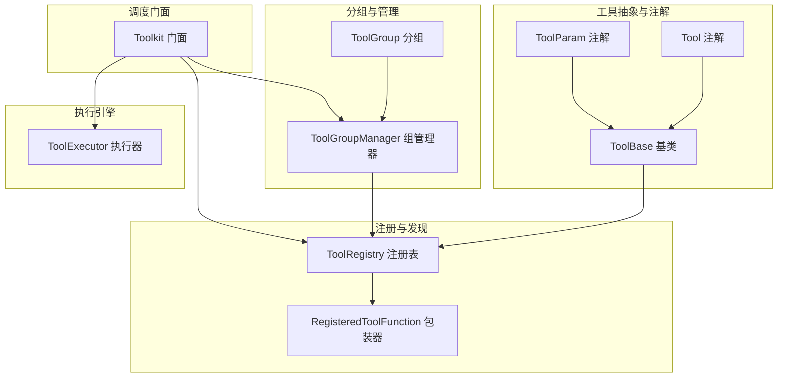
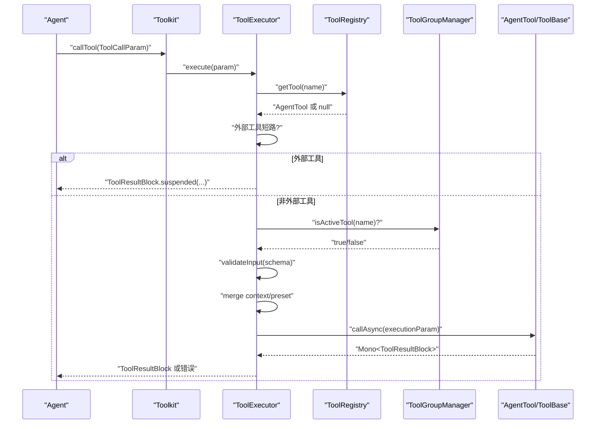
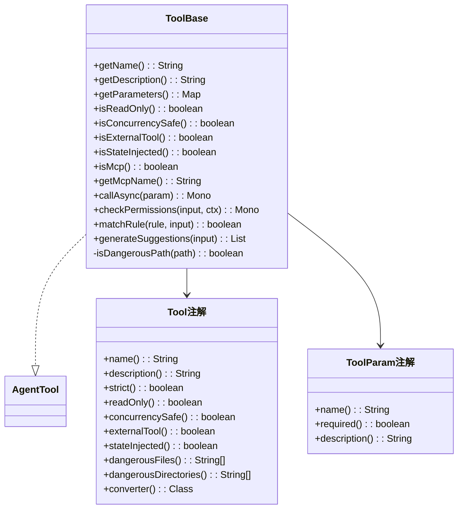
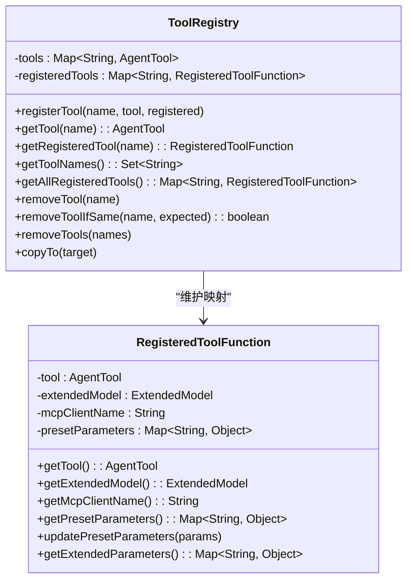
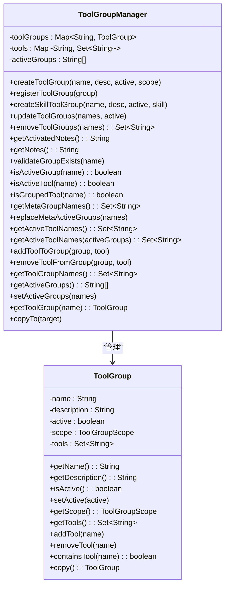
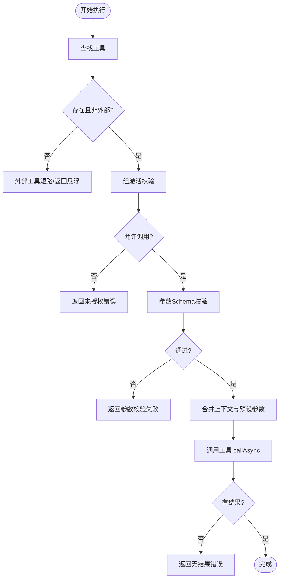
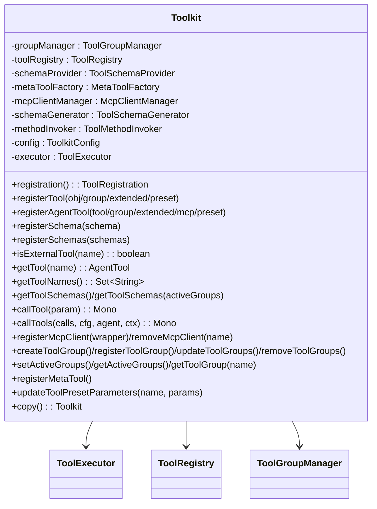
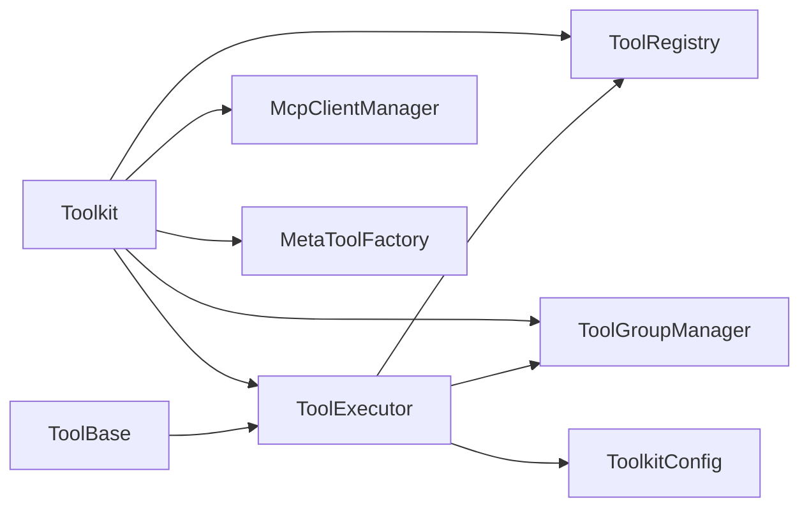

# 工具系统

<cite>
**本文引用的文件**
- [Tool.java](file://agentscope-core/src/main/java/io/agentscope/core/tool/Tool.java)
- [ToolBase.java](file://agentscope-core/src/main/java/io/agentscope/core/tool/ToolBase.java)
- [ToolRegistry.java](file://agentscope-core/src/main/java/io/agentscope/core/tool/ToolRegistry.java)
- [ToolGroup.java](file://agentscope-core/src/main/java/io/agentscope/core/tool/ToolGroup.java)
- [ToolGroupManager.java](file://agentscope-core/src/main/java/io/agentscope/core/tool/ToolGroupManager.java)
- [ToolExecutor.java](file://agentscope-core/src/main/java/io/agentscope/core/tool/ToolExecutor.java)
- [RegisteredToolFunction.java](file://agentscope-core/src/main/java/io/agentscope/core/tool/RegisteredToolFunction.java)
- [Toolkit.java](file://agentscope-core/src/main/java/io/agentscope/core/tool/Toolkit.java)
- [ToolParam.java](file://agentscope-core/src/main/java/io/agentscope/core/tool/ToolParam.java)
- [ToolGroupScope.java](file://agentscope-core/src/main/java/io/agentscope/core/tool/ToolGroupScope.java)
- [ToolCallParam.java](file://agentscope-core/src/main/java/io/agentscope/core/tool/ToolCallParam.java)
- [ToolkitConfig.java](file://agentscope-core/src/main/java/io/agentscope/core/tool/ToolkitConfig.java)
</cite>

## 目录
1. [简介](#简介)
2. [项目结构](#项目结构)
3. [核心组件](#核心组件)
4. [架构总览](#架构总览)
5. [详细组件分析](#详细组件分析)
6. [依赖分析](#依赖分析)
7. [性能考虑](#性能考虑)
8. [故障排查指南](#故障排查指南)
9. [结论](#结论)
10. [附录](#附录)

## 简介
本文件面向AgentScope Java的工具系统，系统性阐述工具容器设计、工具组织机制、统一抽象与基类能力、注册与发现、分组与组管理、执行引擎与函数注册机制，并提供可操作的示例路径与最佳实践，覆盖安全机制（权限与危险路径防护）、输入校验、错误处理与性能优化等主题。

## 项目结构
工具系统位于agentscope-core模块的io.agentscope.core.tool包内，围绕以下核心构件展开：
- 抽象与注解：Tool、ToolParam、ToolBase
- 容器与注册：ToolRegistry、RegisteredToolFunction
- 分组与管理：ToolGroup、ToolGroupManager
- 执行引擎：ToolExecutor
- 调度门面：Toolkit（注册、执行、分组、MCP、元工具）

图表来源
- [Toolkit.java:66-117](file://agentscope-core/src/main/java/io/agentscope/core/tool/Toolkit.java#L66-L117)
- [ToolRegistry.java:40-155](file://agentscope-core/src/main/java/io/agentscope/core/tool/ToolRegistry.java#L40-L155)
- [ToolGroupManager.java:32-530](file://agentscope-core/src/main/java/io/agentscope/core/tool/ToolGroupManager.java#L32-L530)
- [ToolExecutor.java:58-486](file://agentscope-core/src/main/java/io/agentscope/core/tool/ToolExecutor.java#L58-L486)
- [Tool.java:60-193](file://agentscope-core/src/main/java/io/agentscope/core/tool/Tool.java#L60-L193)
- [ToolParam.java:62-104](file://agentscope-core/src/main/java/io/agentscope/core/tool/ToolParam.java#L62-L104)
- [ToolBase.java:60-341](file://agentscope-core/src/main/java/io/agentscope/core/tool/ToolBase.java#L60-L341)

章节来源
- [Toolkit.java:66-117](file://agentscope-core/src/main/java/io/agentscope/core/tool/Toolkit.java#L66-L117)
- [ToolRegistry.java:40-155](file://agentscope-core/src/main/java/io/agentscope/core/tool/ToolRegistry.java#L40-L155)
- [ToolGroupManager.java:32-530](file://agentscope-core/src/main/java/io/agentscope/core/tool/ToolGroupManager.java#L32-L530)
- [ToolExecutor.java:58-486](file://agentscope-core/src/main/java/io/agentscope/core/tool/ToolExecutor.java#L58-L486)
- [Tool.java:60-193](file://agentscope-core/src/main/java/io/agentscope/core/tool/Tool.java#L60-L193)
- [ToolParam.java:62-104](file://agentscope-core/src/main/java/io/agentscope/core/tool/ToolParam.java#L62-L104)
- [ToolBase.java:60-341](file://agentscope-core/src/main/java/io/agentscope/core/tool/ToolBase.java#L60-L341)

## 核心组件
- Tool与ToolParam：通过注解声明工具方法及其参数，生成JSON Schema供模型消费；支持严格模式、只读标记、并发安全、外部工具标记、状态注入、危险文件/目录白名单等。
- ToolBase：统一的工具基类，封装名称、描述、参数Schema、只读/并发安全/外部工具/状态注入/MCP标识等属性；提供默认调用入口、权限检查钩子、规则匹配与建议生成、危险路径检测等。
- ToolRegistry：线程安全的工具注册表，维护工具实例与RegisteredToolFunction元数据映射，支持动态增删与复制。
- RegisteredToolFunction：对AgentTool的包装，承载扩展Schema、MCP客户端名、预设参数（运行时注入）等元信息。
- ToolGroup与ToolGroupManager：工具分组与激活控制，支持META/EXTERNAL作用域、按技能绑定、动态增删改查、激活集合快照、按组计算可用工具集。
- ToolExecutor：统一执行引擎，负责单次/批量执行、超时/重试、调度、流式回调、外部工具短路、参数合并与上下文合并、错误归一化。
- Toolkit：门面，整合注册、执行、Schema生成、MCP、元工具、分组管理、深拷贝与回调保留。

章节来源
- [Tool.java:60-193](file://agentscope-core/src/main/java/io/agentscope/core/tool/Tool.java#L60-L193)
- [ToolParam.java:62-104](file://agentscope-core/src/main/java/io/agentscope/core/tool/ToolParam.java#L62-L104)
- [ToolBase.java:60-341](file://agentscope-core/src/main/java/io/agentscope/core/tool/ToolBase.java#L60-L341)
- [ToolRegistry.java:40-155](file://agentscope-core/src/main/java/io/agentscope/core/tool/ToolRegistry.java#L40-L155)
- [RegisteredToolFunction.java:28-142](file://agentscope-core/src/main/java/io/agentscope/core/tool/RegisteredToolFunction.java#L28-L142)
- [ToolGroup.java:42-257](file://agentscope-core/src/main/java/io/agentscope/core/tool/ToolGroup.java#L42-L257)
- [ToolGroupManager.java:32-530](file://agentscope-core/src/main/java/io/agentscope/core/tool/ToolGroupManager.java#L32-L530)
- [ToolExecutor.java:58-486](file://agentscope-core/src/main/java/io/agentscope/core/tool/ToolExecutor.java#L58-L486)
- [Toolkit.java:66-785](file://agentscope-core/src/main/java/io/agentscope/core/tool/Toolkit.java#L66-L785)

## 架构总览
下图展示了从调用到执行的关键交互流程，包括Schema生成、分组过滤、参数校验、外部工具短路、执行与回调、超时/重试/关闭保护等。

图表来源
- [Toolkit.java:490-492](file://agentscope-core/src/main/java/io/agentscope/core/tool/Toolkit.java#L490-L492)
- [ToolExecutor.java:167-291](file://agentscope-core/src/main/java/io/agentscope/core/tool/ToolExecutor.java#L167-L291)
- [ToolRegistry.java:66-84](file://agentscope-core/src/main/java/io/agentscope/core/tool/ToolRegistry.java#L66-L84)
- [ToolGroupManager.java:292-316](file://agentscope-core/src/main/java/io/agentscope/core/tool/ToolGroupManager.java#L292-L316)

## 详细组件分析

### 抽象与注解：Tool与ToolParam
- Tool注解用于标注方法为工具，支持name/description/strict/readOnly/concurrencySafe/externalTool/stateInjected/dangerousFiles/dangerousDirectories/converter等属性，覆盖LLM兼容命名、严格模式、只读、并发安全、外部执行、状态注入、危险路径白名单与自定义结果转换器。
- ToolParam注解用于参数元数据，要求name必填，支持required与description，确保Schema生成与参数映射。

图表来源
- [Tool.java:60-193](file://agentscope-core/src/main/java/io/agentscope/core/tool/Tool.java#L60-L193)
- [ToolParam.java:62-104](file://agentscope-core/src/main/java/io/agentscope/core/tool/ToolParam.java#L62-L104)
- [ToolBase.java:60-341](file://agentscope-core/src/main/java/io/agentscope/core/tool/ToolBase.java#L60-L341)

章节来源
- [Tool.java:60-193](file://agentscope-core/src/main/java/io/agentscope/core/tool/Tool.java#L60-L193)
- [ToolParam.java:62-104](file://agentscope-core/src/main/java/io/agentscope/core/tool/ToolParam.java#L62-L104)
- [ToolBase.java:60-341](file://agentscope-core/src/main/java/io/agentscope/core/tool/ToolBase.java#L60-L341)

### 工具容器与注册：ToolRegistry与RegisteredToolFunction
- ToolRegistry以ConcurrentHashMap存储工具名到AgentTool与RegisteredToolFunction的映射，提供注册、查询、删除、原子删除、批量复制等能力，保证并发安全。
- RegisteredToolFunction包装AgentTool并携带扩展Schema、MCP客户端名、预设参数（运行时注入），支持动态更新预设参数。

图表来源
- [ToolRegistry.java:40-155](file://agentscope-core/src/main/java/io/agentscope/core/tool/ToolRegistry.java#L40-L155)
- [RegisteredToolFunction.java:28-142](file://agentscope-core/src/main/java/io/agentscope/core/tool/RegisteredToolFunction.java#L28-L142)

章节来源
- [ToolRegistry.java:40-155](file://agentscope-core/src/main/java/io/agentscope/core/tool/ToolRegistry.java#L40-L155)
- [RegisteredToolFunction.java:28-142](file://agentscope-core/src/main/java/io/agentscope/core/tool/RegisteredToolFunction.java#L28-L142)

### 分组与组管理：ToolGroup与ToolGroupManager
- ToolGroup表示一个具名工具集合，支持活动状态、作用域（META/EXTERNAL）、工具集合的增删查与深拷贝。
- ToolGroupManager维护分组索引（分组->工具、工具->分组）、活动分组列表、按技能绑定的分组、按组计算可用工具集、激活状态设置与恢复、日志与校验。

图表来源
- [ToolGroup.java:42-257](file://agentscope-core/src/main/java/io/agentscope/core/tool/ToolGroup.java#L42-L257)
- [ToolGroupManager.java:32-530](file://agentscope-core/src/main/java/io/agentscope/core/tool/ToolGroupManager.java#L32-L530)

章节来源
- [ToolGroup.java:42-257](file://agentscope-core/src/main/java/io/agentscope/core/tool/ToolGroup.java#L42-L257)
- [ToolGroupManager.java:32-530](file://agentscope-core/src/main/java/io/agentscope/core/tool/ToolGroupManager.java#L32-L530)

### 执行引擎：ToolExecutor
- 单次执行：查找工具、外部工具短路、组激活校验、Schema校验、上下文与预设参数合并、构建执行参数、调用工具、异常转错误或悬浮结果、空结果兜底。
- 批量执行：顺序/并行策略，安全工具批内合并顺序输出，非安全工具串行槽位，应用调度、超时、重试、优雅关停保护。
- 回调：用户与内部chunk回调组合，避免阻塞其他回调。

图表来源
- [ToolExecutor.java:184-291](file://agentscope-core/src/main/java/io/agentscope/core/tool/ToolExecutor.java#L184-L291)

章节来源
- [ToolExecutor.java:58-486](file://agentscope-core/src/main/java/io/agentscope/core/tool/ToolExecutor.java#L58-L486)

### 门面：Toolkit
- 注册：扫描对象中的@Tool方法、注册AgentTool、注册SchemaOnly外部工具、注册MCP客户端、注册子Agent工具、注册元工具（动态组管理）。
- 执行：单次/批量执行委托给ToolExecutor，合并执行配置。
- 分组：创建/更新/删除/查询分组，设置激活集合，按技能绑定分组。
- 深拷贝：保留用户chunk回调，复制注册表与分组状态。

图表来源
- [Toolkit.java:66-785](file://agentscope-core/src/main/java/io/agentscope/core/tool/Toolkit.java#L66-L785)

章节来源
- [Toolkit.java:66-785](file://agentscope-core/src/main/java/io/agentscope/core/tool/Toolkit.java#L66-L785)

## 依赖分析
- 组件耦合
  - Toolkit聚合多个子系统：ToolRegistry、ToolGroupManager、ToolExecutor、ToolSchemaProvider、MetaToolFactory、McpClientManager。
  - ToolExecutor依赖Toolkit、ToolRegistry、ToolGroupManager、ToolkitConfig、TracerRegistry、GracefulShutdownManager。
  - ToolBase实现AgentTool，作为反射工具与MCP工具的基类，提供权限检查与危险路径检测。
- 可能的循环依赖
  - 当前各组件通过接口与门面进行交互，未见直接循环依赖迹象。
- 外部依赖点
  - Reactor调度器（boundedElastic）、日志框架、工具结果转换器、MCP客户端包装器。

图表来源
- [Toolkit.java:70-117](file://agentscope-core/src/main/java/io/agentscope/core/tool/Toolkit.java#L70-L117)
- [ToolExecutor.java:62-95](file://agentscope-core/src/main/java/io/agentscope/core/tool/ToolExecutor.java#L62-L95)

章节来源
- [Toolkit.java:70-117](file://agentscope-core/src/main/java/io/agentscope/core/tool/Toolkit.java#L70-L117)
- [ToolExecutor.java:62-95](file://agentscope-core/src/main/java/io/agentscope/core/tool/ToolExecutor.java#L62-L95)

## 性能考虑
- 并发与调度
  - 使用Reactor Schedulers.boundedElastic或自定义ExecutorService，避免阻塞主线程。
  - 批量执行中对concurrencySafe工具进行批内合并顺序输出，减少锁竞争。
- 超时与重试
  - 支持ExecutionConfig超时与指数退避重试，结合抖动降低风暴效应。
- 内存与序列化
  - 预设参数不暴露于Schema，减少传输开销；结果转换器可做压缩/摘要。
- 线程安全
  - 注册表与组管理器采用并发容器，保证高并发场景下的正确性。

## 故障排查指南
- 工具未找到
  - 现象：返回“工具未找到”错误。
  - 排查：确认已注册、未被删除、分组处于激活状态。
- 参数校验失败
  - 现象：返回“参数校验失败”提示。
  - 排查：核对Tool与ToolParam注解、Schema生成、传入参数类型与必填项。
- 未授权调用
  - 现象：返回“未授权工具调用”。
  - 排查：确认工具所属分组是否激活；若禁用删除，注意分组状态。
- 外部工具悬浮
  - 现象：返回“工具悬浮”，由上层处理。
  - 排查：确认ToolBase.isExternalTool或@Tool(externalTool=true)配置。
- 执行超时/重试
  - 现象：超时或多次重试后失败。
  - 排查：调整ExecutionConfig超时与最大尝试次数；检查回调异常导致的吞错。

章节来源
- [ToolExecutor.java:188-291](file://agentscope-core/src/main/java/io/agentscope/core/tool/ToolExecutor.java#L188-L291)
- [Toolkit.java:633-688](file://agentscope-core/src/main/java/io/agentscope/core/tool/Toolkit.java#L633-L688)

## 结论
AgentScope Java工具系统以注解驱动的统一抽象（Tool/ToolParam/ToolBase）为核心，配合线程安全的注册表与灵活的分组管理，形成可动态启用/禁用、可外部执行、可流式回调、可超时重试的执行引擎。通过预设参数与结果转换器，系统在安全性与易用性之间取得平衡，并提供了深拷贝与回调保留等高级能力，适合复杂多变的智能体工具编排场景。

## 附录

### 快速上手与示例路径
- 创建自定义工具
  - 使用注解声明工具方法与参数，参考：
    - [Tool.java:31-51](file://agentscope-core/src/main/java/io/agentscope/core/tool/Tool.java#L31-L51)
    - [ToolParam.java:31-54](file://agentscope-core/src/main/java/io/agentscope/core/tool/ToolParam.java#L31-L54)
- 注册工具
  - 扫描对象注册：[Toolkit.java:154-197](file://agentscope-core/src/main/java/io/agentscope/core/tool/Toolkit.java#L154-L197)
  - 直接注册AgentTool：[Toolkit.java:203-243](file://agentscope-core/src/main/java/io/agentscope/core/tool/Toolkit.java#L203-L243)
  - 注册SchemaOnly外部工具：[Toolkit.java:294-296](file://agentscope-core/src/main/java/io/agentscope/core/tool/Toolkit.java#L294-L296)
- 配置工具参数与预设
  - 预设参数在注册时注入，运行时可更新：[RegisteredToolFunction.java:105-128](file://agentscope-core/src/main/java/io/agentscope/core/tool/RegisteredToolFunction.java#L105-L128)，[Toolkit.java:752-760](file://agentscope-core/src/main/java/io/agentscope/core/tool/Toolkit.java#L752-L760)
- 处理工具结果
  - 单次/批量执行入口：[Toolkit.java:490-525](file://agentscope-core/src/main/java/io/agentscope/core/tool/Toolkit.java#L490-L525)
  - 流式chunk回调设置：[Toolkit.java:446-464](file://agentscope-core/src/main/java/io/agentscope/core/tool/Toolkit.java#L446-L464)
- 安全机制与输入验证
  - 权限检查与危险路径检测：[ToolBase.java:196-267](file://agentscope-core/src/main/java/io/agentscope/core/tool/ToolBase.java#L196-L267)
  - 参数Schema校验：[ToolExecutor.java:210-220](file://agentscope-core/src/main/java/io/agentscope/core/tool/ToolExecutor.java#L210-L220)
- 性能优化
  - 并行批处理与安全分区：[ToolExecutor.java:332-355](file://agentscope-core/src/main/java/io/agentscope/core/tool/ToolExecutor.java#L332-L355)
  - 超时与重试配置：[ToolExecutor.java:418-468](file://agentscope-core/src/main/java/io/agentscope/core/tool/ToolExecutor.java#L418-L468)
- 第三方工具集成
  - MCP客户端注册：[Toolkit.java:538-550](file://agentscope-core/src/main/java/io/agentscope/core/tool/Toolkit.java#L538-L550)
  - 外部工具短路：[ToolExecutor.java:195-197](file://agentscope-core/src/main/java/io/agentscope/core/tool/ToolExecutor.java#L195-L197)

### 最佳实践
- 工具命名与描述
  - 使用snake_case命名，清晰描述用途与返回值，便于LLM决策。
- 只读与并发安全
  - 对纯函数工具设置readOnly与concurrencySafe，提升并行度。
- 危险路径防护
  - 合理配置dangerousFiles与dangerousDirectories，必要时在工具内二次校验。
- 预设参数与状态注入
  - 将敏感或会话相关参数放入预设，避免暴露Schema；需要时开启stateInjected。
- 分组与动态控制
  - 使用ToolGroup按功能域分组，结合MetaTool实现动态开关；谨慎使用删除开关。
- 错误与可观测性
  - 为回调设置日志与告警；对外部工具与悬浮结果进行明确处理；合理设置超时与重试。