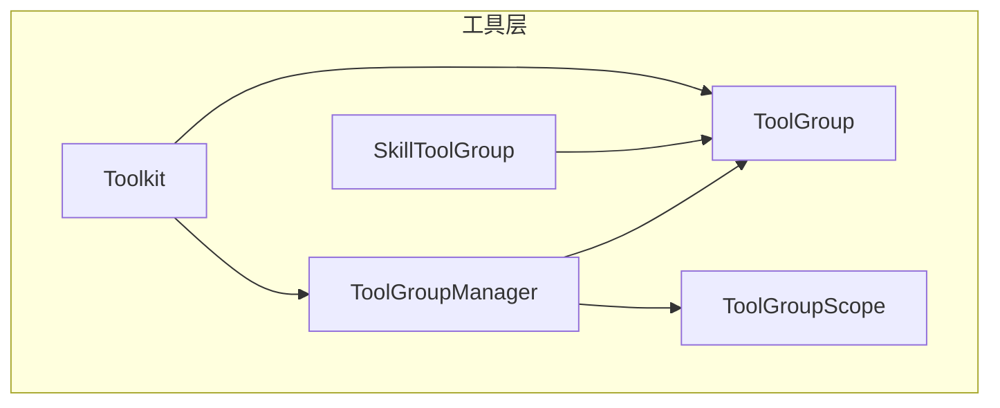
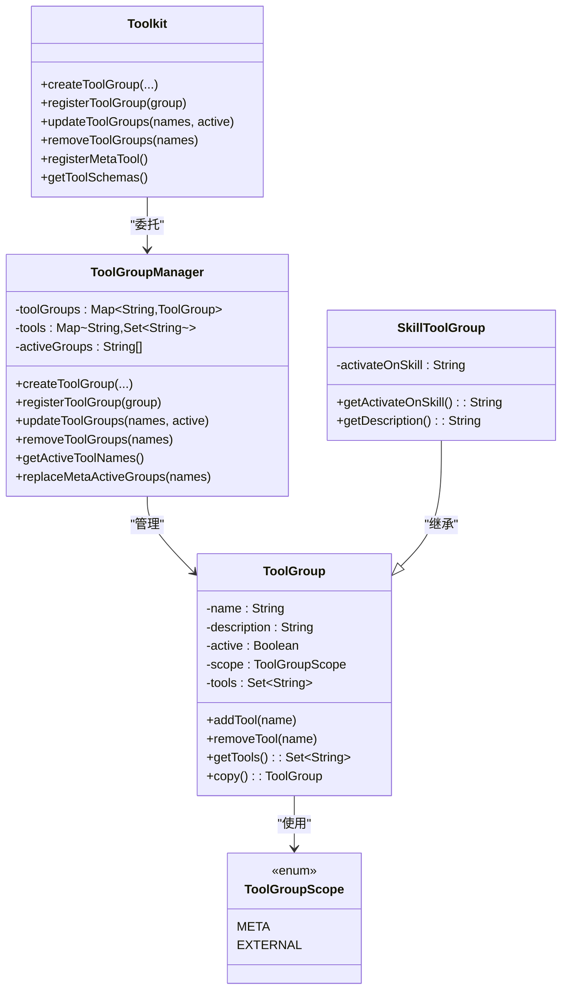
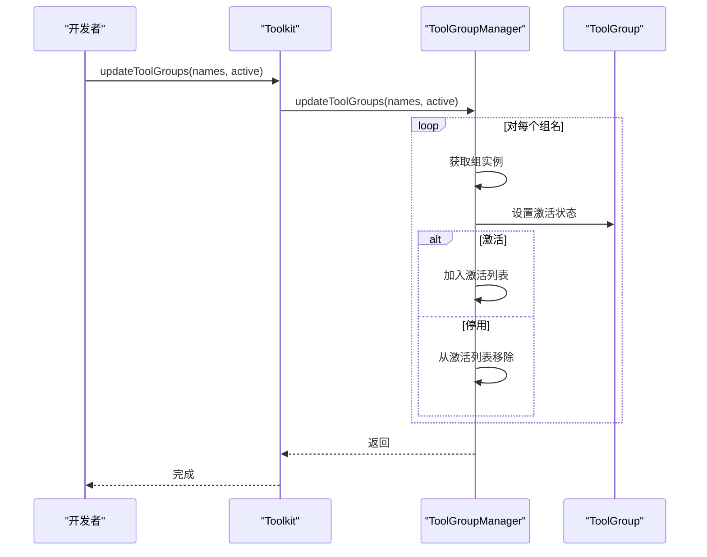
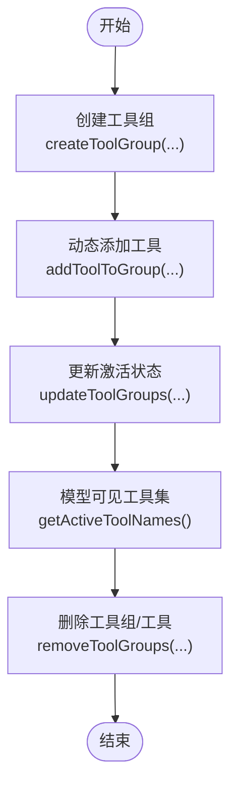
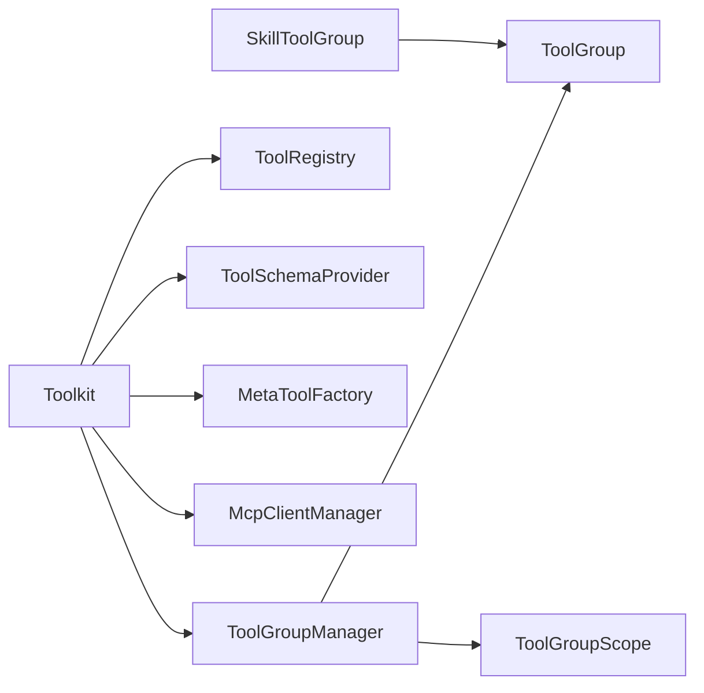

# 工具组管理

<cite>
**本文引用的文件**
- [ToolGroup.java](file://agentscope-core/src/main/java/io/agentscope/core/tool/ToolGroup.java)
- [ToolGroupManager.java](file://agentscope-core/src/main/java/io/agentscope/core/tool/ToolGroupManager.java)
- [ToolGroupScope.java](file://agentscope-core/src/main/java/io/agentscope/core/tool/ToolGroupScope.java)
- [Toolkit.java](file://agentscope-core/src/main/java/io/agentscope/core/tool/Toolkit.java)
- [SkillToolGroup.java](file://agentscope-core/src/main/java/io/agentscope/core/tool/SkillToolGroup.java)
- [ToolGroupTest.java](file://agentscope-core/src/test/java/io/agentscope/core/tool/ToolGroupTest.java)
- [ToolGroupExample.java](file://agentscope-examples/documentation/src/main/java/io/agentscope/examples/documentation2/tool/ToolGroupExample.java)
- [tool.md](file://docs/v2/zh/docs/building-blocks/tool.md)
</cite>

## 目录
1. [简介](#简介)
2. [项目结构](#项目结构)
3. [核心组件](#核心组件)
4. [架构总览](#架构总览)
5. [详细组件分析](#详细组件分析)
6. [依赖分析](#依赖分析)
7. [性能考量](#性能考量)
8. [故障排查指南](#故障排查指南)
9. [结论](#结论)
10. [附录](#附录)

## 简介
本文件系统化阐述 AgentScope Java 的工具组管理能力，围绕 ToolGroup 的分组理念、ToolGroupManager 的管理算法与接口、ToolGroupScope 的作用域控制与权限边界、以及工具组的生命周期（创建/修改/删除）、组内工具的动态增删等关键主题展开。文档同时给出面向开发者的实践路径：如何创建工具组、如何配置组权限、如何在运行时通过元工具进行动态管理，以及如何利用继承与组合模式构建更复杂的工具组形态。

## 项目结构
工具组管理位于 agentscope-core 的 tool 包中，核心类包括：
- ToolGroup：工具组实体，封装组名、描述、激活状态、作用域与工具集合
- ToolGroupManager：工具组的集中管理器，负责创建、更新、删除、查询与索引
- ToolGroupScope：定义组的管理边界（META/EXTERNAL）
- Toolkit：对外门面，委托工具组管理到 ToolGroupManager，并提供元工具注册
- SkillToolGroup：基于 ToolGroup 的子类，用于与特定技能绑定的工具组

图表来源
- [Toolkit.java:66-117](file://agentscope-core/src/main/java/io/agentscope/core/tool/Toolkit.java#L66-L117)
- [ToolGroup.java:42-70](file://agentscope-core/src/main/java/io/agentscope/core/tool/ToolGroup.java#L42-L70)
- [SkillToolGroup.java:44-59](file://agentscope-core/src/main/java/io/agentscope/core/tool/SkillToolGroup.java#L44-L59)
- [ToolGroupManager.java:32-39](file://agentscope-core/src/main/java/io/agentscope/core/tool/ToolGroupManager.java#L32-L39)
- [ToolGroupScope.java:29-42](file://agentscope-core/src/main/java/io/agentscope/core/tool/ToolGroupScope.java#L29-L42)

章节来源
- [Toolkit.java:66-117](file://agentscope-core/src/main/java/io/agentscope/core/tool/Toolkit.java#L66-L117)
- [ToolGroup.java:42-70](file://agentscope-core/src/main/java/io/agentscope/core/tool/ToolGroup.java#L42-L70)
- [SkillToolGroup.java:44-59](file://agentscope-core/src/main/java/io/agentscope/core/tool/SkillToolGroup.java#L44-L59)
- [ToolGroupManager.java:32-39](file://agentscope-core/src/main/java/io/agentscope/core/tool/ToolGroupManager.java#L32-L39)
- [ToolGroupScope.java:29-42](file://agentscope-core/src/main/java/io/agentscope/core/tool/ToolGroupScope.java#L29-L42)

## 核心组件
- ToolGroup：不可变字段（名称、描述、作用域）+ 可变字段（激活状态、工具集合）。提供 Builder 构建、工具增删、拷贝等能力；工具集合以 Set 存储，保证无重复并提供防御性拷贝。
- ToolGroupManager：维护三类数据结构
  - 组名到 ToolGroup 的映射（ConcurrentHashMap）
  - 工具名到组集合的反向索引（ConcurrentHashMap + KeySet）
  - 激活组列表（CopyOnWriteArrayList），支持并发读写
  提供创建/注册/删除工具组、更新激活状态、查询激活工具名、按组名过滤工具集、替换 META 组激活集等方法。
- ToolGroupScope：枚举类型，定义两类组的管理边界
  - META：由元工具（reset_equipped_tools）管理，agent 可在运行时切换
  - EXTERNAL：由开发者代码管理，对元工具不可见
- Toolkit：作为门面，将工具组管理委托给 ToolGroupManager，并提供元工具注册、工具注册、工具执行等能力。
- SkillToolGroup：ToolGroup 的子类，增加“绑定技能”语义，描述中自动追加“必须随技能一起激活”的提示，默认 META 作用域。

章节来源
- [ToolGroup.java:42-180](file://agentscope-core/src/main/java/io/agentscope/core/tool/ToolGroup.java#L42-L180)
- [ToolGroupManager.java:32-531](file://agentscope-core/src/main/java/io/agentscope/core/tool/ToolGroupManager.java#L32-L531)
- [ToolGroupScope.java:29-42](file://agentscope-core/src/main/java/io/agentscope/core/tool/ToolGroupScope.java#L29-L42)
- [Toolkit.java:552-722](file://agentscope-core/src/main/java/io/agentscope/core/tool/Toolkit.java#L552-L722)
- [SkillToolGroup.java:44-103](file://agentscope-core/src/main/java/io/agentscope/core/tool/SkillToolGroup.java#L44-L103)

## 架构总览
工具组管理采用“门面 + 管理器 + 实体 + 作用域”的分层设计：
- Toolkit 作为门面，协调 ToolGroupManager 与 ToolRegistry、ToolSchemaProvider、MetaToolFactory、McpClientManager 等模块
- ToolGroupManager 负责组的生命周期与索引维护，确保线程安全与一致性
- ToolGroupScope 决定组的可见性与可操控性，从而实现“作用域隔离”
- SkillToolGroup 通过继承扩展 ToolGroup，体现组合与继承的混合模式

图表来源
- [Toolkit.java:552-722](file://agentscope-core/src/main/java/io/agentscope/core/tool/Toolkit.java#L552-L722)
- [ToolGroupManager.java:32-531](file://agentscope-core/src/main/java/io/agentscope/core/tool/ToolGroupManager.java#L32-L531)
- [ToolGroup.java:42-180](file://agentscope-core/src/main/java/io/agentscope/core/tool/ToolGroup.java#L42-L180)
- [SkillToolGroup.java:44-103](file://agentscope-core/src/main/java/io/agentscope/core/tool/SkillToolGroup.java#L44-L103)
- [ToolGroupScope.java:29-42](file://agentscope-core/src/main/java/io/agentscope/core/tool/ToolGroupScope.java#L29-L42)

## 详细组件分析

### ToolGroup 设计理念与组织结构
- 不变性与可变性分离：名称、描述、作用域在构造后保持不变，仅激活状态与工具集合可变
- 防御性编程：对外返回工具集合的副本，避免外部修改影响内部状态
- Builder 模式：提供链式配置，支持默认值与显式覆盖
- 继承与组合：SkillToolGroup 通过组合原始描述并增强描述文本，体现“在不破坏 ToolGroup 不变性的前提下扩展语义”的设计

章节来源
- [ToolGroup.java:42-180](file://agentscope-core/src/main/java/io/agentscope/core/tool/ToolGroup.java#L42-L180)
- [SkillToolGroup.java:44-103](file://agentscope-core/src/main/java/io/agentscope/core/tool/SkillToolGroup.java#L44-L103)

### ToolGroupManager 算法与操作接口
- 创建与注册
  - createToolGroup(...)：校验唯一性，构建 ToolGroup，写入映射，必要时加入激活列表
  - registerToolGroup(group)：直接注册已构建的 ToolGroup 实例
  - createSkillToolGroup(...)：便捷创建与技能绑定的 ToolGroup
- 更新与删除
  - updateToolGroups(names, active)：批量更新激活状态，维护激活列表
  - removeToolGroups(names)：删除组并清理反向索引，返回被移除的工具名集合
- 查询与过滤
  - getActiveToolNames()/getActiveToolNames(activeGroups)：计算激活工具集合，后者支持按传入组集合的“一次性视图”
  - isActiveTool(toolName)/isGroupedTool(toolName)：判断工具是否属于任一激活组或是否被分组
  - getMetaGroupNames()/getNotes()/getActivatedNotes()：仅对 META 组进行统计与展示
- 线程安全
  - 使用 ConcurrentHashMap 与 CopyOnWriteArrayList，保证高并发下的读写一致性
  - replaceMetaActiveGroups 采用“先全停用再增量启用”的原子化策略，避免竞态

图表来源
- [Toolkit.java:633-641](file://agentscope-core/src/main/java/io/agentscope/core/tool/Toolkit.java#L633-L641)
- [ToolGroupManager.java:148-168](file://agentscope-core/src/main/java/io/agentscope/core/tool/ToolGroupManager.java#L148-L168)

章节来源
- [ToolGroupManager.java:48-205](file://agentscope-core/src/main/java/io/agentscope/core/tool/ToolGroupManager.java#L48-L205)
- [ToolGroupManager.java:286-374](file://agentscope-core/src/main/java/io/agentscope/core/tool/ToolGroupManager.java#L286-L374)
- [ToolGroupManager.java:381-415](file://agentscope-core/src/main/java/io/agentscope/core/tool/ToolGroupManager.java#L381-L415)

### ToolGroupScope 的作用域控制与权限边界
- META：由元工具管理，agent 可在运行时通过 reset_equipped_tools 切换；仅 META 组出现在元工具的参数枚举中
- EXTERNAL：由开发者代码管理，对元工具不可见；适合框架外的工具组或受控的静态组
- 权限与可见性：getNotes()/getActivatedNotes() 仅输出 META 组的状态；isActiveTool() 若工具未分组则视为可用，体现了“未分组即默认可用”的权限策略

章节来源
- [ToolGroupScope.java:29-42](file://agentscope-core/src/main/java/io/agentscope/core/tool/ToolGroupScope.java#L29-L42)
- [ToolGroupManager.java:235-265](file://agentscope-core/src/main/java/io/agentscope/core/tool/ToolGroupManager.java#L235-L265)
- [ToolGroupManager.java:294-330](file://agentscope-core/src/main/java/io/agentscope/core/tool/ToolGroupManager.java#L294-L330)

### 工具组的创建、修改、删除与动态增删
- 创建
  - Toolkit.createToolGroup(...) 或 registerToolGroup(...) 注册新组
  - createSkillToolGroup(...) 快速创建与技能绑定的组
- 修改
  - updateToolGroups(...) 批量激活/停用
  - ToolGroup.setActive(...) 单个组切换
  - addToolToGroup/removeToolFromGroup 动态调整组内工具
- 删除
  - removeToolGroups(...) 删除组及其中所有工具
  - removeTool(...) 删除单个工具（受配置项限制）

图表来源
- [Toolkit.java:562-621](file://agentscope-core/src/main/java/io/agentscope/core/tool/Toolkit.java#L562-L621)
- [ToolGroupManager.java:423-443](file://agentscope-core/src/main/java/io/agentscope/core/tool/ToolGroupManager.java#L423-L443)
- [ToolGroupManager.java:148-168](file://agentscope-core/src/main/java/io/agentscope/core/tool/ToolGroupManager.java#L148-L168)
- [ToolGroupManager.java:381-415](file://agentscope-core/src/main/java/io/agentscope/core/tool/ToolGroupManager.java#L381-L415)

章节来源
- [Toolkit.java:554-688](file://agentscope-core/src/main/java/io/agentscope/core/tool/Toolkit.java#L554-L688)
- [ToolGroupManager.java:48-205](file://agentscope-core/src/main/java/io/agentscope/core/tool/ToolGroupManager.java#L48-L205)

### 继承关系、组合模式与作用域隔离
- 继承：SkillToolGroup 继承 ToolGroup，新增“绑定技能”语义并通过增强描述提醒模型使用约束
- 组合：ToolGroupManager 组合 ToolGroup、工具名索引与激活列表，形成“组-工具-激活”三层关系
- 作用域隔离：ToolGroupScope 决定组是否对元工具可见，META/EXTERNAL 的差异体现在元工具参数、可见性与替换语义上

章节来源
- [SkillToolGroup.java:44-103](file://agentscope-core/src/main/java/io/agentscope/core/tool/SkillToolGroup.java#L44-L103)
- [ToolGroupManager.java:337-374](file://agentscope-core/src/main/java/io/agentscope/core/tool/ToolGroupManager.java#L337-L374)
- [ToolGroupScope.java:29-42](file://agentscope-core/src/main/java/io/agentscope/core/tool/ToolGroupScope.java#L29-L42)

### 元工具与运行时自管理
- 当存在非 basic 的工具组且开启 enableMetaTool(true) 时，Toolkit 会注册 reset_equipped_tools 元工具
- 元工具的参数为每个非 basic 组对应的布尔字段，agent 调用时声明期望的最终激活状态
- ToolGroupManager.replaceMetaActiveGroups(...) 实现“仅保留显式列出的组处于激活”的替换语义，避免遗漏停用

章节来源
- [tool.md:505-552](file://docs/v2/zh/docs/building-blocks/tool.md#L505-L552)
- [Toolkit.java:724-739](file://agentscope-core/src/main/java/io/agentscope/core/tool/Toolkit.java#L724-L739)
- [ToolGroupManager.java:355-374](file://agentscope-core/src/main/java/io/agentscope/core/tool/ToolGroupManager.java#L355-L374)

### 实践示例与最佳实践
- 创建工具组并注册工具
  - 使用 Toolkit.createToolGroup(...) 创建组，随后通过 registration().tool(...).group("groupName").apply() 将工具归组
- 配置组权限与可见性
  - 通过 ToolGroupScope.META/EXTERNAL 控制组是否对元工具可见；META 组可通过 reset_equipped_tools 运行时切换
- 动态管理工具组
  - 使用 Toolkit.updateToolGroups(...) 在运行时切换组激活状态
  - 使用 ToolGroupManager.getActiveToolNames(...) 获取当前模型可见的工具集合
- 示例参考
  - ToolGroupExample 展示了如何创建多个组并在交互中通过元工具激活不同组
  - v2 文档中的示例展示了 ToolGroup 的基本用法与元工具行为

章节来源
- [ToolGroupExample.java:112-134](file://agentscope-examples/documentation/src/main/java/io/agentscope/examples/documentation2/tool/ToolGroupExample.java#L112-L134)
- [tool.md:505-552](file://docs/v2/zh/docs/building-blocks/tool.md#L505-L552)

## 依赖分析
- Toolkit 依赖 ToolGroupManager、ToolRegistry、ToolSchemaProvider、MetaToolFactory、McpClientManager
- ToolGroupManager 依赖 ToolGroup、ToolGroupScope、并发容器
- SkillToolGroup 依赖 ToolGroup

图表来源
- [Toolkit.java:66-117](file://agentscope-core/src/main/java/io/agentscope/core/tool/Toolkit.java#L66-L117)
- [ToolGroupManager.java:32-39](file://agentscope-core/src/main/java/io/agentscope/core/tool/ToolGroupManager.java#L32-L39)
- [SkillToolGroup.java:44-59](file://agentscope-core/src/main/java/io/agentscope/core/tool/SkillToolGroup.java#L44-L59)

章节来源
- [Toolkit.java:66-117](file://agentscope-core/src/main/java/io/agentscope/core/tool/Toolkit.java#L66-L117)
- [ToolGroupManager.java:32-39](file://agentscope-core/src/main/java/io/agentscope/core/tool/ToolGroupManager.java#L32-L39)

## 性能考量
- 并发安全
  - 使用 ConcurrentHashMap 与 CopyOnWriteArrayList，降低锁竞争，提升读多写少场景的吞吐
- 计算复杂度
  - 激活工具集合计算：O(活跃组数 × 平均每组工具数)，通常较小
  - 工具-组反向索引查询：O(1) 平均时间
- 内存占用
  - 工具集合以 Set 存储，避免重复；对外返回副本，防止共享导致的扩容与重哈希
- 替换语义
  - replaceMetaActiveGroups 采用“全停用再增量启用”，避免中间态带来的可见性抖动

章节来源
- [ToolGroupManager.java:355-374](file://agentscope-core/src/main/java/io/agentscope/core/tool/ToolGroupManager.java#L355-L374)
- [ToolGroupManager.java:381-415](file://agentscope-core/src/main/java/io/agentscope/core/tool/ToolGroupManager.java#L381-L415)

## 故障排查指南
- 组不存在
  - 现象：调用 updateToolGroups/removeToolGroups 时抛出异常
  - 处理：先检查组名是否正确，或使用 validateGroupExists() 预检
- 工具删除受限
  - 现象：removeTool/removeToolGroups 未生效并记录警告
  - 原因：配置项禁止删除工具
  - 处理：根据业务需求调整配置或改为停用而非删除
- 工具不可见
  - 现象：模型无法看到某些工具
  - 排查：确认工具所属组是否激活；若为 EXTERNAL 组，需由开发者代码管理
- 并发冲突
  - 现象：多线程频繁切换激活状态导致可见性不稳定
  - 建议：使用 per-call 的 activeGroups 视图（getActiveToolNames(Collection)）隔离不同会话槽位

章节来源
- [ToolGroupManager.java:273-278](file://agentscope-core/src/main/java/io/agentscope/core/tool/ToolGroupManager.java#L273-L278)
- [Toolkit.java:633-641](file://agentscope-core/src/main/java/io/agentscope/core/tool/Toolkit.java#L633-L641)
- [Toolkit.java:679-688](file://agentscope-core/src/main/java/io/agentscope/core/tool/Toolkit.java#L679-L688)

## 结论
AgentScope 的工具组管理通过 ToolGroup 的清晰建模、ToolGroupManager 的高效索引与并发安全、ToolGroupScope 的作用域隔离，以及 Toolkit 的统一门面，实现了灵活、可控、可扩展的工具分组与动态管理能力。结合元工具，系统允许 agent 在运行时自主选择可用工具集，既满足安全约束，又兼顾灵活性与易用性。

## 附录
- 测试验证要点
  - ToolGroupTest 覆盖 Builder、工具增删、激活状态、防御性拷贝等行为
- 示例参考
  - ToolGroupExample 展示了工具组与元工具的实际交互流程

章节来源
- [ToolGroupTest.java:29-282](file://agentscope-core/src/test/java/io/agentscope/core/tool/ToolGroupTest.java#L29-L282)
- [ToolGroupExample.java:112-134](file://agentscope-examples/documentation/src/main/java/io/agentscope/examples/documentation2/tool/ToolGroupExample.java#L112-L134)