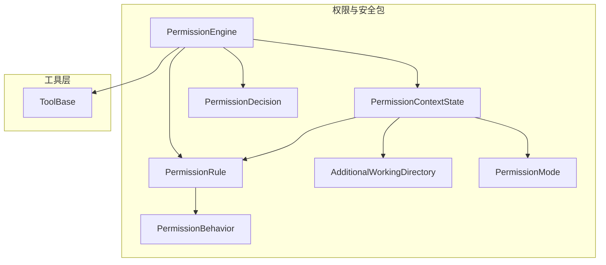
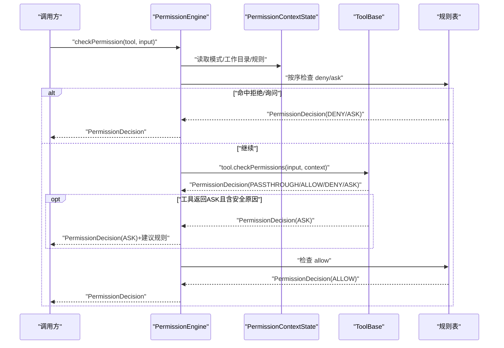
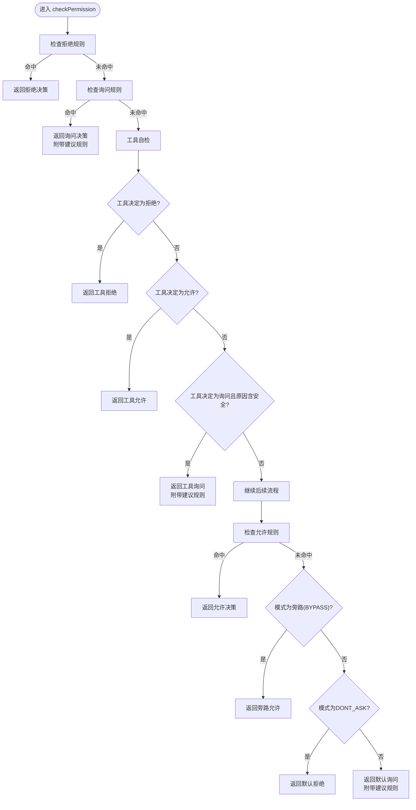
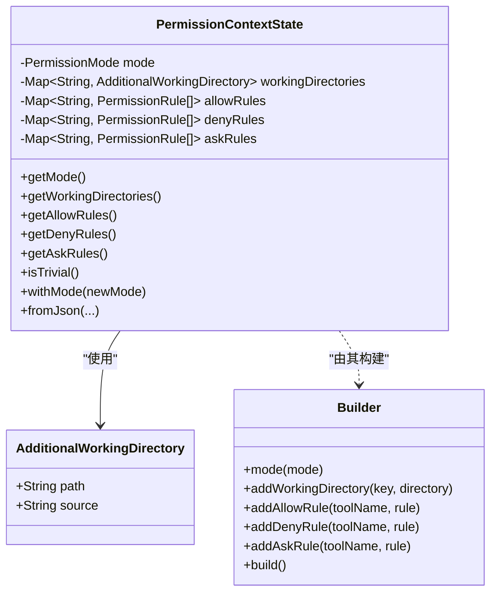
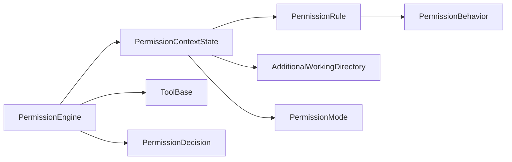

# 权限与安全

<cite>
**本文引用的文件**   
- [PermissionEngine.java](file://agentscope-core/src/main/java/io/agentscope/core/permission/PermissionEngine.java)
- [PermissionContextState.java](file://agentscope-core/src/main/java/io/agentscope/core/permission/PermissionContextState.java)
- [PermissionDecision.java](file://agentscope-core/src/main/java/io/agentscope/core/permission/PermissionDecision.java)
- [PermissionRule.java](file://agentscope-core/src/main/java/io/agentscope/core/permission/PermissionRule.java)
- [AdditionalWorkingDirectory.java](file://agentscope-core/src/main/java/io/agentscope/core/permission/AdditionalWorkingDirectory.java)
- [PermissionBehavior.java](file://agentscope-core/src/main/java/io/agentscope/core/permission/PermissionBehavior.java)
- [PermissionMode.java](file://agentscope-core/src/main/java/io/agentscope/core/permission/PermissionMode.java)
- [ToolBase.java](file://agentscope-core/src/main/java/io/agentscope/core/tool/ToolBase.java)
- [package-info.java](file://agentscope-core/src/main/java/io/agentscope/core/permission/package-info.java)
</cite>

## 目录
1. [简介](#简介)
2. [项目结构](#项目结构)
3. [核心组件](#核心组件)
4. [架构总览](#架构总览)
5. [组件详解](#组件详解)
6. [依赖关系分析](#依赖关系分析)
7. [性能考量](#性能考量)
8. [故障排查指南](#故障排查指南)
9. [结论](#结论)
10. [附录](#附录)

## 简介
本文件面向AgentScope Java的权限与安全系统，围绕以下核心构件进行技术文档化：
- 权限决策引擎：PermissionEngine
- 上下文状态管理：PermissionContextState
- 决策结果载体：PermissionDecision
- 规则定义机制：PermissionRule
- 工作目录限制与安全沙箱：AdditionalWorkingDirectory
- 行为与模式枚举：PermissionBehavior、PermissionMode

文档将从系统架构、数据流、处理逻辑、集成点、错误处理与性能特性等方面，给出深入解析，并提供配置、使用与最佳实践指导。

## 项目结构
权限与安全相关代码位于agentscope-core模块的io.agentscope.core.permission包中，配合工具基类ToolBase共同构成权限评估与执行控制闭环。

**图表来源**
- [PermissionEngine.java:1-336](file://agentscope-core/src/main/java/io/agentscope/core/permission/PermissionEngine.java#L1-L336)
- [PermissionContextState.java:1-250](file://agentscope-core/src/main/java/io/agentscope/core/permission/PermissionContextState.java#L1-L250)
- [PermissionDecision.java:1-207](file://agentscope-core/src/main/java/io/agentscope/core/permission/PermissionDecision.java#L1-L207)
- [PermissionRule.java:1-46](file://agentscope-core/src/main/java/io/agentscope/core/permission/PermissionRule.java#L1-L46)
- [AdditionalWorkingDirectory.java:1-40](file://agentscope-core/src/main/java/io/agentscope/core/permission/AdditionalWorkingDirectory.java#L1-L40)
- [PermissionBehavior.java:1-70](file://agentscope-core/src/main/java/io/agentscope/core/permission/PermissionBehavior.java#L1-L70)
- [PermissionMode.java:1-72](file://agentscope-core/src/main/java/io/agentscope/core/permission/PermissionMode.java#L1-L72)
- [ToolBase.java:60-341](file://agentscope-core/src/main/java/io/agentscope/core/tool/ToolBase.java#L60-L341)

**章节来源**
- [package-info.java:17-28](file://agentscope-core/src/main/java/io/agentscope/core/permission/package-info.java#L17-L28)

## 核心组件
- PermissionEngine：对工具调用请求进行权限评估，遵循“拒绝优先、询问次之、工具自检、允许再次之、旁路与默认”的判定顺序。
- PermissionContextState：封装当前会话的权限模式、工作目录集合与三张规则表（允许/拒绝/询问），并提供不可变快照与运行时模式切换能力。
- PermissionDecision：承载行为（允许/拒绝/询问/放行）、消息、原因、更新后的输入与建议规则。
- PermissionRule：按工具维度绑定的单条规则，支持空内容的“工具级”匹配与行为来源标注。
- AdditionalWorkingDirectory：工作目录记录，用于在特定模式下自动允许文件修改等操作。
- PermissionBehavior、PermissionMode：行为与模式枚举，支持字符串反序列化与大小写无关解析。

**章节来源**
- [PermissionEngine.java:28-46](file://agentscope-core/src/main/java/io/agentscope/core/permission/PermissionEngine.java#L28-L46)
- [PermissionContextState.java:29-36](file://agentscope-core/src/main/java/io/agentscope/core/permission/PermissionContextState.java#L29-L36)
- [PermissionDecision.java:28-36](file://agentscope-core/src/main/java/io/agentscope/core/permission/PermissionDecision.java#L28-L36)
- [PermissionRule.java:22-32](file://agentscope-core/src/main/java/io/agentscope/core/permission/PermissionRule.java#L22-L32)
- [AdditionalWorkingDirectory.java:22-30](file://agentscope-core/src/main/java/io/agentscope/core/permission/AdditionalWorkingDirectory.java#L22-L30)
- [PermissionBehavior.java:22-31](file://agentscope-core/src/main/java/io/agentscope/core/permission/PermissionBehavior.java#L22-L31)
- [PermissionMode.java:22-32](file://agentscope-core/src/main/java/io/agentscope/core/permission/PermissionMode.java#L22-L32)

## 架构总览
权限系统采用“上下文驱动 + 规则表 + 工具自检”的分层设计。PermissionEngine在每次工具调用时，基于PermissionContextState中的模式与规则表，结合工具自身的checkPermissions实现，输出PermissionDecision。

**图表来源**
- [PermissionEngine.java:139-202](file://agentscope-core/src/main/java/io/agentscope/core/permission/PermissionEngine.java#L139-L202)
- [ToolBase.java:196-199](file://agentscope-core/src/main/java/io/agentscope/core/tool/ToolBase.java#L196-L199)

## 组件详解

### 权限决策引擎：PermissionEngine
- 决策顺序
  1) 工具级拒绝规则（最高优先级）
  2) 工具级询问规则
  3) 工具自检（受旁路免疫）：EXPLORE/ACCEPT_EDITS的只读处理、危险路径检查、工具自身checkPermissions
  4) 工具级允许规则
  5) 旁路模式（BYPASS）回退
  6) 默认策略：ASK（在DONT_ASK模式下降级为DENY）
- 规则复制与不可变性：构造时从PermissionContextState复制规则表，避免外部变更影响引擎内部状态；提供只读视图。
- 运行时扩展：支持通过addRule动态追加规则（ALLOW/DENY/ASK），PASSTHROUGH规则不存储，用于“交还引擎”。
- 工具自检与安全：在EXPLORE/ACCEPT_EDITS模式下，优先应用只读策略；随后调用工具的checkPermissions；若工具返回ASK且原因包含“安全”，则附加建议规则。

**图表来源**
- [PermissionEngine.java:139-202](file://agentscope-core/src/main/java/io/agentscope/core/permission/PermissionEngine.java#L139-L202)
- [PermissionEngine.java:204-227](file://agentscope-core/src/main/java/io/agentscope/core/permission/PermissionEngine.java#L204-L227)
- [PermissionEngine.java:265-302](file://agentscope-core/src/main/java/io/agentscope/core/permission/PermissionEngine.java#L265-L302)
- [PermissionEngine.java:318-334](file://agentscope-core/src/main/java/io/agentscope/core/permission/PermissionEngine.java#L318-L334)

**章节来源**
- [PermissionEngine.java:47-106](file://agentscope-core/src/main/java/io/agentscope/core/permission/PermissionEngine.java#L47-L106)
- [PermissionEngine.java:139-202](file://agentscope-core/src/main/java/io/agentscope/core/permission/PermissionEngine.java#L139-L202)
- [PermissionEngine.java:204-227](file://agentscope-core/src/main/java/io/agentscope/core/permission/PermissionEngine.java#L204-L227)
- [PermissionEngine.java:265-302](file://agentscope-core/src/main/java/io/agentscope/core/permission/PermissionEngine.java#L265-L302)
- [PermissionEngine.java:318-334](file://agentscope-core/src/main/java/io/agentscope/core/permission/PermissionEngine.java#L318-L334)

### 上下文状态管理：PermissionContextState
- 组成要素
  - 模式：PermissionMode（DEFAULT/ACCEPT_EDITS/EXPLORE/BYPASS/DONT_ASK）
  - 工作目录：Map<String, AdditionalWorkingDirectory>，键为目录标识，值为目录与来源
  - 规则表：三张有序列表（允许/拒绝/询问），按工具名索引
- 不可变快照：构建时冻结规则表与工作目录映射，保证引擎内部一致性；提供withMode创建新模式上下文。
- JSON序列化：支持fromJson工厂方法，便于从配置加载。
- 轻量判断：isTrivial用于ReAct代理判断是否启用完整权限引擎。

**图表来源**
- [PermissionContextState.java:37-133](file://agentscope-core/src/main/java/io/agentscope/core/permission/PermissionContextState.java#L37-L133)
- [PermissionContextState.java:148-159](file://agentscope-core/src/main/java/io/agentscope/core/permission/PermissionContextState.java#L148-L159)
- [PermissionContextState.java:201-248](file://agentscope-core/src/main/java/io/agentscope/core/permission/PermissionContextState.java#L201-L248)
- [AdditionalWorkingDirectory.java:31-39](file://agentscope-core/src/main/java/io/agentscope/core/permission/AdditionalWorkingDirectory.java#L31-L39)

**章节来源**
- [PermissionContextState.java:37-133](file://agentscope-core/src/main/java/io/agentscope/core/permission/PermissionContextState.java#L37-L133)
- [PermissionContextState.java:148-159](file://agentscope-core/src/main/java/io/agentscope/core/permission/PermissionContextState.java#L148-L159)
- [PermissionContextState.java:201-248](file://agentscope-core/src/main/java/io/agentscope/core/permission/PermissionContextState.java#L201-L248)

### 决策结果：PermissionDecision
- 字段
  - behavior：PermissionBehavior（ALLOW/DENY/ASK/PASSTHROUGH）
  - message：人类可读消息
  - decisionReason：决策原因
  - updatedInput：经规则重写的输入映射（可选）
  - suggestedRules：建议的后续规则（可选）
- 工厂方法：allow/deny/ask/passthrough便捷构造
- withSuggestedRules：附加建议规则并返回新实例

**章节来源**
- [PermissionDecision.java:36-95](file://agentscope-core/src/main/java/io/agentscope/core/permission/PermissionDecision.java#L36-L95)
- [PermissionDecision.java:97-127](file://agentscope-core/src/main/java/io/agentscope/core/permission/PermissionDecision.java#L97-L127)

### 规则定义：PermissionRule
- 元素
  - toolName：目标工具名（必填）
  - ruleContent：工具特定的匹配模式（可空，表示工具级规则）
  - behavior：匹配后的行为（必填）
  - source：规则来源（如用户设置、建议等，必填）
- 语义：当ruleContent为空时，视为对该工具的所有调用均匹配；否则由工具的matchRule负责解释。

**章节来源**
- [PermissionRule.java:33-45](file://agentscope-core/src/main/java/io/agentscope/core/permission/PermissionRule.java#L33-L45)

### 工作目录与安全沙箱：AdditionalWorkingDirectory
- 作用
  - 作为PermissionMode.ACCEPT_EDITS的自动允许依据，限定文件修改的范围
  - 与PermissionContextState的规则表协同，形成“白名单式”的安全沙箱
- 字段
  - path：绝对路径（必填）
  - source：来源（如会话、用户设置等，必填）

**章节来源**
- [AdditionalWorkingDirectory.java:31-39](file://agentscope-core/src/main/java/io/agentscope/core/permission/AdditionalWorkingDirectory.java#L31-L39)

### 行为与模式枚举
- PermissionBehavior：ALLOW/DENY/ASK/PASSTHROUGH，支持字符串反序列化
- PermissionMode：DEFAULT/ACCEPT_EDITS/EXPLORE/BYPASS/DONT_ASK，支持字符串反序列化

**章节来源**
- [PermissionBehavior.java:32-68](file://agentscope-core/src/main/java/io/agentscope/core/permission/PermissionBehavior.java#L32-L68)
- [PermissionMode.java:33-70](file://agentscope-core/src/main/java/io/agentscope/core/permission/PermissionMode.java#L33-L70)

### 工具自检与危险路径
- ToolBase提供默认checkPermissions返回PASSTHROUGH，允许引擎接管；具体工具可覆盖以实现细粒度策略。
- 危险路径检测：针对文件名与路径段进行大小写无关匹配，并尝试解析符号链接以防止绕过。

**章节来源**
- [ToolBase.java:196-199](file://agentscope-core/src/main/java/io/agentscope/core/tool/ToolBase.java#L196-L199)
- [ToolBase.java:218-260](file://agentscope-core/src/main/java/io/agentscope/core/tool/ToolBase.java#L218-L260)

## 依赖关系分析
- PermissionEngine依赖PermissionContextState提供的模式与规则表，并调用ToolBase的checkPermissions与matchRule。
- PermissionContextState持有AdditionalWorkingDirectory与PermissionRule，提供不可变快照与运行时模式切换。
- PermissionDecision作为跨组件的数据载体，携带updatedInput与suggestedRules，支持建议规则的传递。
- PermissionBehavior与PermissionMode为枚举类型，提供统一的字符串解析能力，便于配置与JSON序列化。

**图表来源**
- [PermissionEngine.java:47-106](file://agentscope-core/src/main/java/io/agentscope/core/permission/PermissionEngine.java#L47-L106)
- [PermissionContextState.java:37-133](file://agentscope-core/src/main/java/io/agentscope/core/permission/PermissionContextState.java#L37-L133)
- [PermissionDecision.java:36-95](file://agentscope-core/src/main/java/io/agentscope/core/permission/PermissionDecision.java#L36-L95)
- [PermissionRule.java:33-45](file://agentscope-core/src/main/java/io/agentscope/core/permission/PermissionRule.java#L33-L45)
- [AdditionalWorkingDirectory.java:31-39](file://agentscope-core/src/main/java/io/agentscope/core/permission/AdditionalWorkingDirectory.java#L31-L39)
- [PermissionBehavior.java:32-68](file://agentscope-core/src/main/java/io/agentscope/core/permission/PermissionBehavior.java#L32-L68)
- [PermissionMode.java:33-70](file://agentscope-core/src/main/java/io/agentscope/core/permission/PermissionMode.java#L33-L70)

## 性能考量
- 规则表复制：构造时复制规则表，避免运行期锁竞争，但会带来额外内存占用；建议在上下文稳定时复用PermissionEngine实例。
- 规则匹配：规则匹配委托给工具的matchRule，建议在工具侧实现高效匹配逻辑（如预编译正则、缓存键集）。
- 工具自检：默认checkPermissions返回PASSTHROUGH，减少不必要的阻塞；对于高开销检查，应在工具侧实现短路与缓存。
- 模式分支：EXPLORE/ACCEPT_EDITS等模式下的快速路径可减少规则扫描次数，提升整体吞吐。

## 故障排查指南
- 常见问题
  - 决策始终为ASK：检查PermissionContextState的模式与规则表是否正确加载；确认工具的checkPermissions与matchRule实现是否返回PASSTHROUGH或ASK。
  - 拒绝规则未生效：确认规则表中是否存在对应工具名的规则；检查ruleContent是否为空（工具级规则）或匹配条件是否正确。
  - 旁路模式无效：确认PermissionContextState的模式是否被正确切换至BYPASS；注意withMode会返回新实例而非原地修改。
  - 危险路径绕过：检查工具侧的危险路径检测逻辑与符号链接解析；确保路径标准化与大小写无关匹配正确。
- 排查步骤
  - 打印PermissionContextState的快照（模式、工作目录、规则表）以核对配置。
  - 在工具的checkPermissions中增加日志，观察输入与上下文，定位拒绝/询问的具体原因。
  - 使用PermissionDecision的decisionReason与suggestedRules辅助定位问题与修复建议。

**章节来源**
- [PermissionEngine.java:139-202](file://agentscope-core/src/main/java/io/agentscope/core/permission/PermissionEngine.java#L139-L202)
- [ToolBase.java:196-199](file://agentscope-core/src/main/java/io/agentscope/core/tool/ToolBase.java#L196-L199)
- [PermissionContextState.java:148-159](file://agentscope-core/src/main/java/io/agentscope/core/permission/PermissionContextState.java#L148-L159)

## 结论
AgentScope Java的权限与安全系统通过PermissionEngine、PermissionContextState、PermissionDecision、PermissionRule与AdditionalWorkingDirectory的协作，实现了灵活可控的工具调用授权机制。其设计强调：
- 明确的决策顺序与旁路免疫的工具自检
- 上下文驱动的模式与工作目录白名单
- 可扩展的规则表与建议规则机制
- 工具侧的危险路径检测与细粒度策略

在生产环境中，建议结合业务场景合理配置模式与规则，利用建议规则机制持续优化授权策略，并通过审计与合规检查保障系统安全。

## 附录

### 配置与使用要点
- 配置PermissionContextState
  - 设置PermissionMode（DEFAULT/ACCEPT_EDITS/EXPLORE/BYPASS/DONT_ASK）
  - 添加工作目录（AdditionalWorkingDirectory）
  - 注入规则表（ALLOW/DENY/ASK）
- 运行时扩展
  - 通过PermissionEngine.addRule动态添加规则
  - 使用PermissionContextState.withMode切换模式
- 工具侧实现
  - 覆盖checkPermissions实现自检策略
  - 实现matchRule与generateSuggestions以支持规则匹配与建议生成

**章节来源**
- [PermissionContextState.java:201-248](file://agentscope-core/src/main/java/io/agentscope/core/permission/PermissionContextState.java#L201-L248)
- [PermissionEngine.java:94-106](file://agentscope-core/src/main/java/io/agentscope/core/permission/PermissionEngine.java#L94-L106)
- [ToolBase.java:196-199](file://agentscope-core/src/main/java/io/agentscope/core/tool/ToolBase.java#L196-L199)
- [ToolBase.java:204-216](file://agentscope-core/src/main/java/io/agentscope/core/tool/ToolBase.java#L204-L216)

### 安全策略与最佳实践
- 最小权限原则：默认使用DEFAULT模式，仅在必要时放宽至ACCEPT_EDITS或BYPASS
- 白名单优先：通过工作目录与明确规则限制操作范围
- 建议规则闭环：利用generateSuggestions与suggestedRules持续完善授权策略
- 审计与合规：记录PermissionDecision的decisionReason与updatedInput，便于审计与合规检查
- 危险路径治理：在工具侧强化危险文件与目录的识别与拦截

**章节来源**
- [PermissionMode.java:22-32](file://agentscope-core/src/main/java/io/agentscope/core/permission/PermissionMode.java#L22-L32)
- [AdditionalWorkingDirectory.java:22-30](file://agentscope-core/src/main/java/io/agentscope/core/permission/AdditionalWorkingDirectory.java#L22-L30)
- [ToolBase.java:218-260](file://agentscope-core/src/main/java/io/agentscope/core/tool/ToolBase.java#L218-L260)