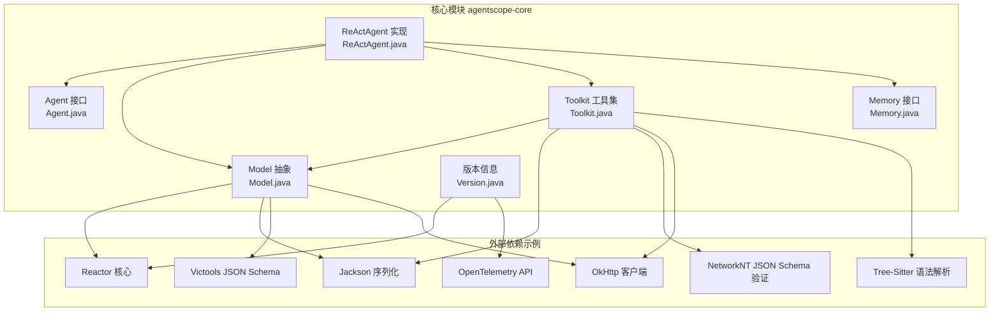
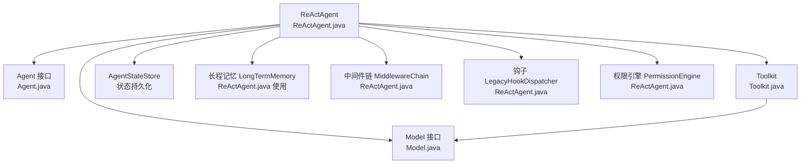
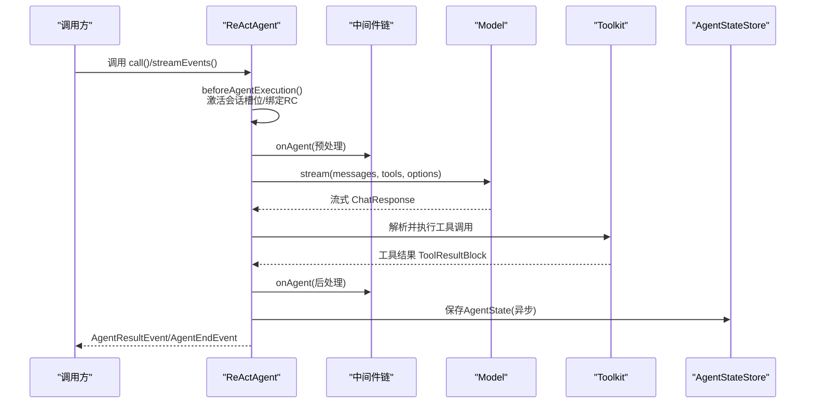
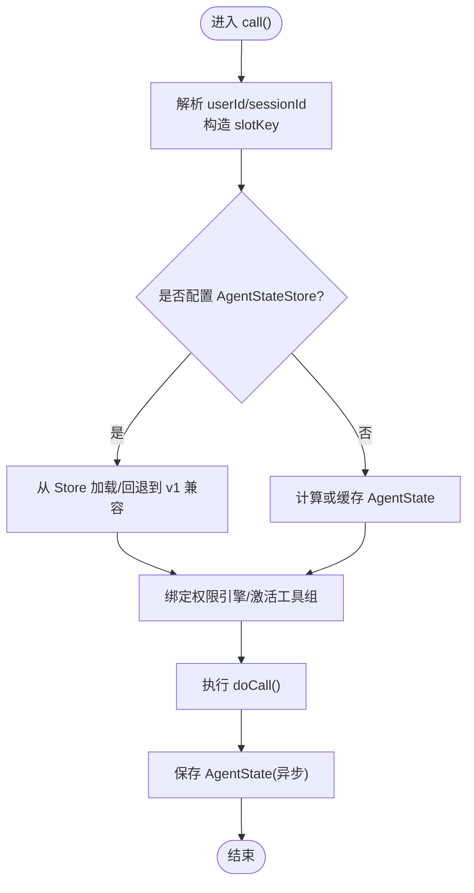
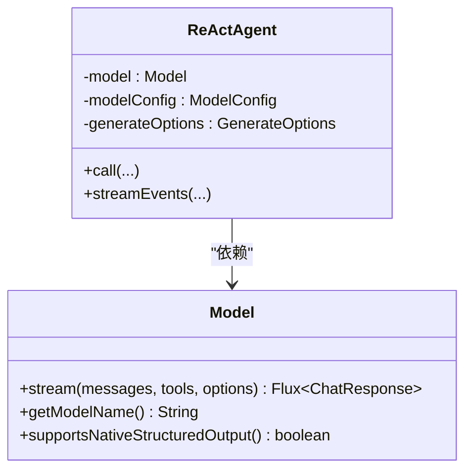
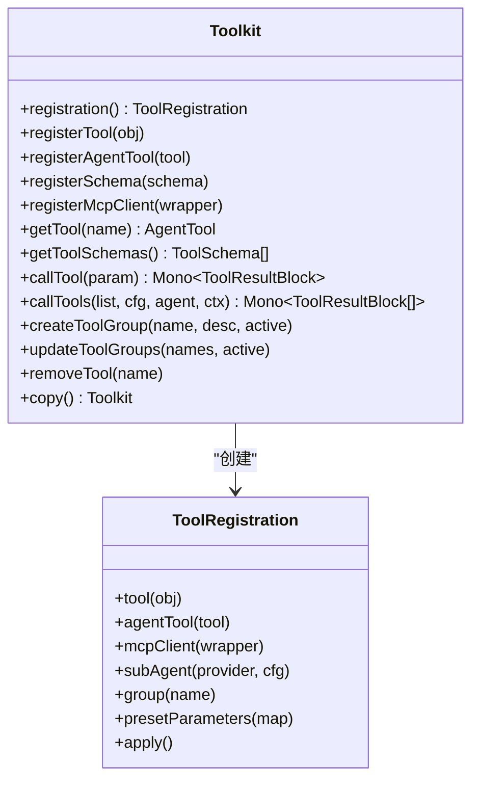
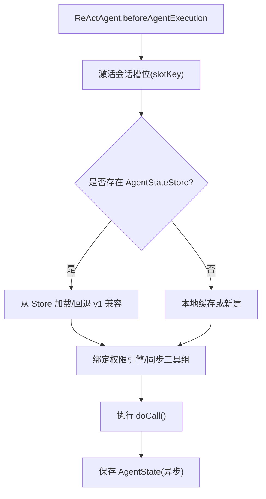
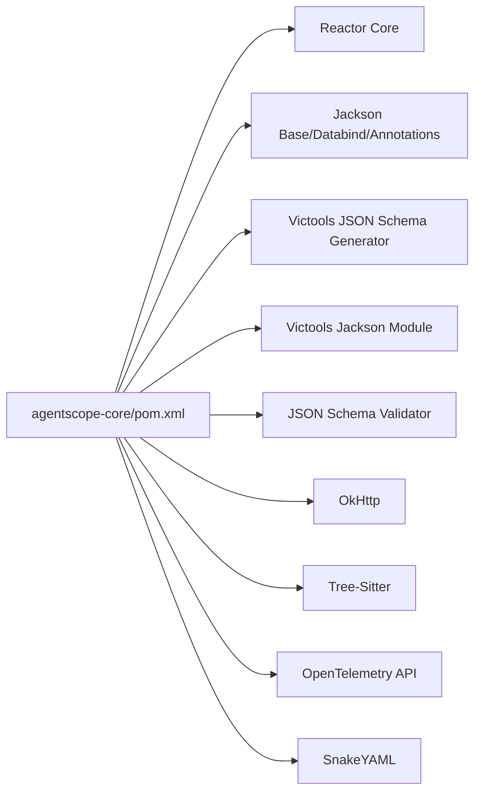

# 核心模块

<cite>
**本文引用的文件**   
- [agentscope-core/pom.xml](file://agentscope-core/pom.xml)
- [Version.java](file://agentscope-core/src/main/java/io/agentscope/core/Version.java)
- [ReActAgent.java](file://agentscope-core/src/main/java/io/agentscope/core/ReActAgent.java)
- [Agent.java](file://agentscope-core/src/main/java/io/agentscope/core/agent/Agent.java)
- [Model.java](file://agentscope-core/src/main/java/io/agentscope/core/model/Model.java)
- [Toolkit.java](file://agentscope-core/src/main/java/io/agentscope/core/tool/Toolkit.java)
- [Memory.java](file://agentscope-core/src/main/java/io/agentscope/core/memory/Memory.java)
</cite>

## 目录
1. [引言](#引言)
2. [项目结构](#项目结构)
3. [核心组件](#核心组件)
4. [架构总览](#架构总览)
5. [详细组件分析](#详细组件分析)
6. [依赖分析](#依赖分析)
7. [性能考虑](#性能考虑)
8. [故障排查指南](#故障排查指南)
9. [结论](#结论)
10. [附录](#附录)

## 引言
本文件面向AgentScope Java的核心模块（agentscope-core），聚焦以下子系统与能力：
- 代理系统：以ReActAgent为核心，覆盖代理生命周期、事件流、钩子与中间件、权限与中断控制等
- 模型抽象：统一的Model接口与模型工厂（ModelRegistry）职责边界
- 工具系统：Toolkit工具注册、工具组管理、外部工具与MCP客户端集成
- 内存管理：Memory接口与AgentState/状态持久化迁移路径

文档同时给出模块间依赖关系、交互流程、扩展点与最佳实践，并提供可直接定位到源码位置的“章节来源”和“图示来源”，便于深入学习与二次开发。

## 项目结构
agentscope-core作为核心库，提供代理、模型、工具、内存、状态、事件、中间件、权限、RAG、挂起恢复、优雅停机等基础能力。其依赖通过Maven集中管理，涵盖Reactor响应式、Jackson序列化、树形语法解析、HTTP客户端、OpenTelemetry观测等。

**图示来源**
- [agentscope-core/pom.xml:51-231](file://agentscope-core/pom.xml#L51-L231)
- [Agent.java:18-47](file://agentscope-core/src/main/java/io/agentscope/core/agent/Agent.java#L18-L47)
- [ReActAgent.java:148-198](file://agentscope-core/src/main/java/io/agentscope/core/ReActAgent.java#L148-L198)
- [Model.java:22-53](file://agentscope-core/src/main/java/io/agentscope/core/model/Model.java#L22-L53)
- [Toolkit.java:37-64](file://agentscope-core/src/main/java/io/agentscope/core/tool/Toolkit.java#L37-L64)
- [Memory.java:22-33](file://agentscope-core/src/main/java/io/agentscope/core/memory/Memory.java#L22-L33)

**章节来源**
- [agentscope-core/pom.xml:51-231](file://agentscope-core/pom.xml#L51-L231)
- [Version.java:18-45](file://agentscope-core/src/main/java/io/agentscope/core/Version.java#L18-L45)

## 核心组件
- 代理接口与实现
  - Agent接口：统一的可调用、可流式、可观察能力契约；提供中断、状态与工具包访问入口
  - ReActAgent：基于ReAct循环（推理-行动）的代理实现，支持流式事件、钩子、中间件、权限、RAG、挂起恢复、优雅停机等
- 模型抽象
  - Model接口：统一的流式对话生成接口，支持工具Schema与结构化输出提示
  - ModelRegistry：模型注册与选择（在ReActAgent中装配）
- 工具系统
  - Toolkit：工具注册、Schema生成、执行器、分组管理、MCP客户端、元工具（动态切换工具组）
- 内存管理
  - Memory接口：兼容v1的消息缓冲持久化入口（已标记弃用，新代码使用AgentState）

**章节来源**
- [Agent.java:21-114](file://agentscope-core/src/main/java/io/agentscope/core/agent/Agent.java#L21-L114)
- [ReActAgent.java:148-198](file://agentscope-core/src/main/java/io/agentscope/core/ReActAgent.java#L148-L198)
- [Model.java:22-53](file://agentscope-core/src/main/java/io/agentscope/core/model/Model.java#L22-L53)
- [Toolkit.java:37-117](file://agentscope-core/src/main/java/io/agentscope/core/tool/Toolkit.java#L37-L117)
- [Memory.java:22-78](file://agentscope-core/src/main/java/io/agentscope/core/memory/Memory.java#L22-L78)

## 架构总览
下图展示了ReActAgent与核心子系统的交互关系：代理持有模型、工具集、中间件、权限引擎、状态存储与长程记忆；工具通过执行器调度，消息经格式化器与响应格式化器处理；事件流贯穿整个生命周期。

**图示来源**
- [ReActAgent.java:218-330](file://agentscope-core/src/main/java/io/agentscope/core/ReActAgent.java#L218-L330)
- [Agent.java:18-47](file://agentscope-core/src/main/java/io/agentscope/core/agent/Agent.java#L18-L47)
- [Model.java:22-53](file://agentscope-core/src/main/java/io/agentscope/core/model/Model.java#L22-L53)
- [Toolkit.java:66-117](file://agentscope-core/src/main/java/io/agentscope/core/tool/Toolkit.java#L66-L117)

## 详细组件分析

### 代理系统：ReActAgent
- 设计要点
  - 基于Reactor的非阻塞流式执行，支持事件流与结果提取
  - 生命周期：beforeAgentExecution → doCall → afterAgentExecution；中间件与钩子贯穿
  - 会话槽位（slot）隔离：按(userId, sessionId)缓存AgentState与权限引擎，支持分布式一致性
  - 结构化输出：支持模型原生结构化输出或合成工具generate_response
  - 中断与优雅停机：支持用户中断、挂起恢复、部分推理策略
- 关键流程（调用与事件流）

**图示来源**
- [ReActAgent.java:795-804](file://agentscope-core/src/main/java/io/agentscope/core/ReActAgent.java#L795-L804)
- [ReActAgent.java:511-536](file://agentscope-core/src/main/java/io/agentscope/core/ReActAgent.java#L511-L536)
- [ReActAgent.java:627-637](file://agentscope-core/src/main/java/io/agentscope/core/ReActAgent.java#L627-L637)

- 会话槽位与状态加载

**图示来源**
- [ReActAgent.java:437-478](file://agentscope-core/src/main/java/io/agentscope/core/ReActAgent.java#L437-L478)
- [ReActAgent.java:412-422](file://agentscope-core/src/main/java/io/agentscope/core/ReActAgent.java#L412-L422)

- 使用示例（路径定位）
  - 代理构建与调用示例：[ReActAgent.java:163-190](file://agentscope-core/src/main/java/io/agentscope/core/ReActAgent.java#L163-L190)
  - 中断与权限示例：[ReActAgent.java:686-722](file://agentscope-core/src/main/java/io/agentscope/core/ReActAgent.java#L686-L722)

**章节来源**
- [ReActAgent.java:148-198](file://agentscope-core/src/main/java/io/agentscope/core/ReActAgent.java#L148-L198)
- [ReActAgent.java:511-637](file://agentscope-core/src/main/java/io/agentscope/core/ReActAgent.java#L511-L637)
- [ReActAgent.java:686-722](file://agentscope-core/src/main/java/io/agentscope/core/ReActAgent.java#L686-L722)
- [ReActAgent.java:412-478](file://agentscope-core/src/main/java/io/agentscope/core/ReActAgent.java#L412-L478)

### 模型抽象：Model接口与工厂
- Model接口
  - 统一的流式对话生成：stream(messages, tools, options)
  - 支持原生结构化输出（取决于具体实现）
- 模型工厂与装配
  - ReActAgent内部装配ModelConfig与GenerateOptions，结合工具Schema与响应格式化
  - 可通过ModelRegistry进行注册与选择（在ReActAgent中装配）

**图示来源**
- [Model.java:22-53](file://agentscope-core/src/main/java/io/agentscope/core/model/Model.java#L22-L53)
- [ReActAgent.java:271-272](file://agentscope-core/src/main/java/io/agentscope/core/ReActAgent.java#L271-L272)

- 使用示例（路径定位）
  - Model接口定义：[Model.java:22-53](file://agentscope-core/src/main/java/io/agentscope/core/model/Model.java#L22-L53)
  - ReActAgent装配与调用：[ReActAgent.java:312-314](file://agentscope-core/src/main/java/io/agentscope/core/ReActAgent.java#L312-L314)

**章节来源**
- [Model.java:22-53](file://agentscope-core/src/main/java/io/agentscope/core/model/Model.java#L22-L53)
- [ReActAgent.java:312-314](file://agentscope-core/src/main/java/io/agentscope/core/ReActAgent.java#L312-L314)

### 工具系统：Toolkit、工具注册与工具组管理
- 能力概览
  - 注册：对象方法、AgentTool实例、SchemaOnly工具、MCP客户端
  - 分组：创建/激活/删除工具组；动态开关；与技能绑定
  - 执行：顺序/并行执行；参数校验；结果转换；进度回调
  - 元工具：reset_equipped_tools用于运行时切换工具组
- 关键类关系

**图示来源**
- [Toolkit.java:66-117](file://agentscope-core/src/main/java/io/agentscope/core/tool/Toolkit.java#L66-L117)
- [Toolkit.java:146-148](file://agentscope-core/src/main/java/io/agentscope/core/tool/Toolkit.java#L146-L148)

- 使用示例（路径定位）
  - 工具注册与Schema生成：[Toolkit.java:154-197](file://agentscope-core/src/main/java/io/agentscope/core/tool/Toolkit.java#L154-L197)
  - 工具组管理与元工具：[Toolkit.java:562-739](file://agentscope-core/src/main/java/io/agentscope/core/tool/Toolkit.java#L562-L739)
  - 工具执行与并发策略：[Toolkit.java:511-525](file://agentscope-core/src/main/java/io/agentscope/core/tool/Toolkit.java#L511-L525)

**章节来源**
- [Toolkit.java:37-117](file://agentscope-core/src/main/java/io/agentscope/core/tool/Toolkit.java#L37-L117)
- [Toolkit.java:154-197](file://agentscope-core/src/main/java/io/agentscope/core/tool/Toolkit.java#L154-L197)
- [Toolkit.java:562-739](file://agentscope-core/src/main/java/io/agentscope/core/tool/Toolkit.java#L562-L739)
- [Toolkit.java:511-525](file://agentscope-core/src/main/java/io/agentscope/core/tool/Toolkit.java#L511-L525)

### 内存管理：Memory接口与AgentState
- Memory接口（已弃用）
  - 提供与v1兼容的消息缓冲持久化入口（保存/加载键memory_messages）
  - 新代码应使用AgentState进行上下文与状态管理
- AgentState与状态存储
  - ReActAgent通过AgentStateStore保存/加载AgentState
  - 状态包含上下文、工具上下文（含激活组）、权限上下文等

**图示来源**
- [ReActAgent.java:437-478](file://agentscope-core/src/main/java/io/agentscope/core/ReActAgent.java#L437-L478)
- [ReActAgent.java:412-422](file://agentscope-core/src/main/java/io/agentscope/core/ReActAgent.java#L412-L422)
- [Memory.java:22-33](file://agentscope-core/src/main/java/io/agentscope/core/memory/Memory.java#L22-L33)

**章节来源**
- [Memory.java:22-78](file://agentscope-core/src/main/java/io/agentscope/core/memory/Memory.java#L22-L78)
- [ReActAgent.java:412-478](file://agentscope-core/src/main/java/io/agentscope/core/ReActAgent.java#L412-L478)

## 依赖分析
- Maven依赖概览（核心）
  - 响应式：io.projectreactor:reactor-core
  - 序列化：com.fasterxml.jackson.*（databind/annotations/datetime-jsr310）
  - JSON Schema：com.github.victools:jsonschema-generator 与 module
  - 校验：com.networknt:json-schema-validator
  - HTTP：com.squareup.okhttp3:okhttp(-jvm)
  - 语法解析：io.github.bonede:tree-sitter(+bash)
  - 观测：io.opentelemetry:opentelemetry-api(+sdk)
  - YAML：org.yaml:snakeyaml
  - 其他：commons-compress、sqlite-jdbc、kubernetes-client、protobuf-java等（可选）

**图示来源**
- [agentscope-core/pom.xml:51-231](file://agentscope-core/pom.xml#L51-L231)

**章节来源**
- [agentscope-core/pom.xml:51-231](file://agentscope-core/pom.xml#L51-L231)

## 性能考虑
- 并发与序列化
  - ReActAgent单实例同一时刻仅处理一个call()；并发场景建议按请求创建独立实例
  - 会话级序列化：按(userId, sessionId)槽位串行化调用，避免跨会话状态竞争
- I/O与线程池
  - 状态保存采用boundedElastic调度器异步写入，降低对主流程影响
  - 工具执行器支持顺序/并行策略，结合超时与重试配置优化吞吐
- 事件与钩子
  - 事件流基于Reactor，注意背压与订阅端处理开销
  - 钩子与中间件链路越短越好，避免在热路径做昂贵操作
- 结构化输出
  - 优先使用模型原生结构化输出（若支持），减少额外工具注入带来的往返成本

[本节为通用指导，不直接分析具体文件]

## 故障排查指南
- 代理中断无效
  - 确认在正确的会话槽位上调用interrupt(userId, sessionId)，并在执行检查点处生效
  - 参考：[ReActAgent.java:686-722](file://agentscope-core/src/main/java/io/agentscope/core/ReActAgent.java#L686-L722)
- 工具未被发现或不可调用
  - 检查工具组是否激活；确认工具Schema生成与过滤逻辑
  - 参考：[Toolkit.java:699-712](file://agentscope-core/src/main/java/io/agentscope/core/tool/Toolkit.java#L699-L712)
- 状态未持久化
  - 确认已配置AgentStateStore且保存流程未被拦截
  - 参考：[ReActAgent.java:412-422](file://agentscope-core/src/main/java/io/agentscope/core/ReActAgent.java#L412-L422)
- 事件流异常
  - 检查中间件链与钩子是否正确绑定/解绑RuntimeContext
  - 参考：[ReActAgent.java:511-536](file://agentscope-core/src/main/java/io/agentscope/core/ReActAgent.java#L511-L536)

**章节来源**
- [ReActAgent.java:511-536](file://agentscope-core/src/main/java/io/agentscope/core/ReActAgent.java#L511-L536)
- [ReActAgent.java:686-722](file://agentscope-core/src/main/java/io/agentscope/core/ReActAgent.java#L686-L722)
- [Toolkit.java:699-712](file://agentscope-core/src/main/java/io/agentscope/core/tool/Toolkit.java#L699-L712)
- [ReActAgent.java:412-422](file://agentscope-core/src/main/java/io/agentscope/core/ReActAgent.java#L412-L422)

## 结论
agentscope-core通过清晰的接口分层与可插拔组件（模型、工具、中间件、钩子、权限、状态），为复杂代理行为提供了高内聚、低耦合的实现基础。ReActAgent作为典型实现，展示了如何在统一生命周期内协调多子系统，兼顾易用性与可扩展性。建议在生产环境中：
- 明确并发边界与会话槽位隔离
- 合理配置工具执行策略与超时重试
- 利用中间件与钩子进行可观测与治理
- 优先采用原生结构化输出与Schema驱动的工具面

[本节为总结，不直接分析具体文件]

## 附录
- 版本与User-Agent
  - Version提供统一的版本号与User-Agent字符串，便于追踪与统计
  - 参考：[Version.java:24-45](file://agentscope-core/src/main/java/io/agentscope/core/Version.java#L24-L45)

**章节来源**
- [Version.java:24-45](file://agentscope-core/src/main/java/io/agentscope/core/Version.java#L24-L45)