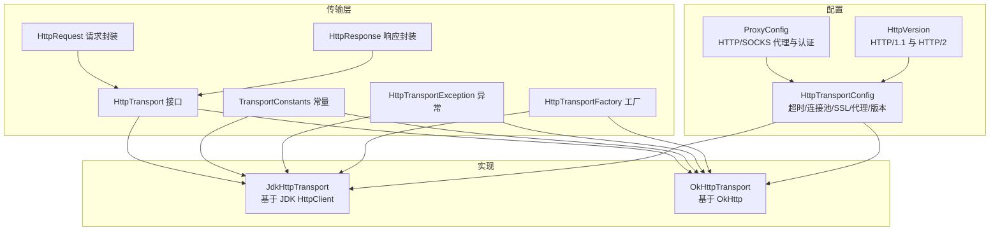
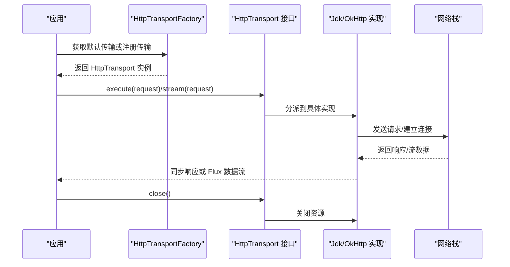
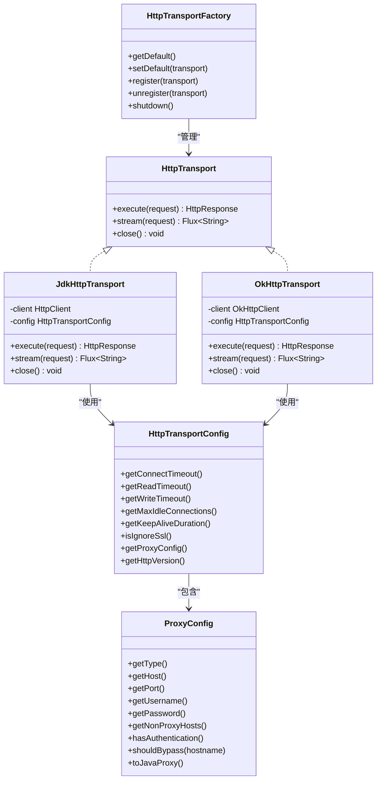

# 传输层抽象

<cite>
**本文引用的文件**   
- [HttpTransport.java](file://agentscope-core/src/main/java/io/agentscope/core/model/transport/HttpTransport.java)
- [HttpRequest.java](file://agentscope-core/src/main/java/io/agentscope/core/model/transport/HttpRequest.java)
- [HttpResponse.java](file://agentscope-core/src/main/java/io/agentscope/core/model/transport/HttpResponse.java)
- [JdkHttpTransport.java](file://agentscope-core/src/main/java/io/agentscope/core/model/transport/JdkHttpTransport.java)
- [OkHttpTransport.java](file://agentscope-core/src/main/java/io/agentscope/core/model/transport/OkHttpTransport.java)
- [HttpTransportConfig.java](file://agentscope-core/src/main/java/io/agentscope/core/model/transport/HttpTransportConfig.java)
- [ProxyConfig.java](file://agentscope-core/src/main/java/io/agentscope/core/model/transport/ProxyConfig.java)
- [HttpVersion.java](file://agentscope-core/src/main/java/io/agentscope/core/model/transport/HttpVersion.java)
- [TransportConstants.java](file://agentscope-core/src/main/java/io/agentscope/core/model/transport/TransportConstants.java)
- [HttpTransportException.java](file://agentscope-core/src/main/java/io/agentscope/core/model/transport/HttpTransportException.java)
- [HttpTransportFactory.java](file://agentscope-core/src/main/java/io/agentscope/core/model/transport/HttpTransportFactory.java)
- [JdkHttpTransportTest.java](file://agentscope-core/src/test/java/io/agentscope/core/model/transport/JdkHttpTransportTest.java)
</cite>

## 目录
1. [简介](#简介)
2. [项目结构](#项目结构)
3. [核心组件](#核心组件)
4. [架构总览](#架构总览)
5. [组件详解](#组件详解)
6. [依赖关系分析](#依赖关系分析)
7. [性能考量](#性能考量)
8. [故障排查指南](#故障排查指南)
9. [结论](#结论)
10. [附录：使用示例与最佳实践](#附录使用示例与最佳实践)

## 简介
本文件系统性阐述 AgentScope Java 的传输层抽象设计与实现，围绕 HttpTransport 接口及其统一抽象机制展开，覆盖请求发送、响应接收、流式（SSE/NDJSON）数据解析、连接管理、代理与超时配置、SSL 安全策略、以及工厂生命周期管理等内容。同时对比 JDK 原生 HttpClient 与 OkHttp 两种实现的差异与性能特征，并提供可操作的配置与排障建议。

## 项目结构
传输层位于 agentscope-core 模块的 transport 包中，采用“接口 + 多实现 + 配置 + 工厂”的分层组织方式：
- 接口与数据模型：HttpTransport、HttpRequest、HttpResponse、TransportConstants
- 实现：JdkHttpTransport、OkHttpTransport
- 配置：HttpTransportConfig、ProxyConfig、HttpVersion
- 异常：HttpTransportException
- 生命周期与工厂：HttpTransportFactory

图示来源
- [HttpTransport.java:33-62](file://agentscope-core/src/main/java/io/agentscope/core/model/transport/HttpTransport.java#L33-L62)
- [JdkHttpTransport.java:68-169](file://agentscope-core/src/main/java/io/agentscope/core/model/transport/JdkHttpTransport.java#L68-L169)
- [OkHttpTransport.java:62-159](file://agentscope-core/src/main/java/io/agentscope/core/model/transport/OkHttpTransport.java#L62-L159)
- [HttpTransportConfig.java:26-149](file://agentscope-core/src/main/java/io/agentscope/core/model/transport/HttpTransportConfig.java#L26-L149)
- [ProxyConfig.java:55-150](file://agentscope-core/src/main/java/io/agentscope/core/model/transport/ProxyConfig.java#L55-L150)
- [HttpVersion.java:23-41](file://agentscope-core/src/main/java/io/agentscope/core/model/transport/HttpVersion.java#L23-L41)
- [TransportConstants.java:21-36](file://agentscope-core/src/main/java/io/agentscope/core/model/transport/TransportConstants.java#L21-L36)
- [HttpTransportException.java:24-187](file://agentscope-core/src/main/java/io/agentscope/core/model/transport/HttpTransportException.java#L24-L187)
- [HttpTransportFactory.java:54-192](file://agentscope-core/src/main/java/io/agentscope/core/model/transport/HttpTransportFactory.java#L54-L192)

章节来源
- [HttpTransport.java:20-62](file://agentscope-core/src/main/java/io/agentscope/core/model/transport/HttpTransport.java#L20-L62)
- [JdkHttpTransport.java:53-169](file://agentscope-core/src/main/java/io/agentscope/core/model/transport/JdkHttpTransport.java#L53-L169)
- [OkHttpTransport.java:51-159](file://agentscope-core/src/main/java/io/agentscope/core/model/transport/OkHttpTransport.java#L51-L159)
- [HttpTransportConfig.java:26-149](file://agentscope-core/src/main/java/io/agentscope/core/model/transport/HttpTransportConfig.java#L26-L149)
- [ProxyConfig.java:55-150](file://agentscope-core/src/main/java/io/agentscope/core/model/transport/ProxyConfig.java#L55-L150)
- [HttpVersion.java:23-41](file://agentscope-core/src/main/java/io/agentscope/core/model/transport/HttpVersion.java#L23-L41)
- [TransportConstants.java:21-36](file://agentscope-core/src/main/java/io/agentscope/core/model/transport/TransportConstants.java#L21-L36)
- [HttpTransportException.java:24-187](file://agentscope-core/src/main/java/io/agentscope/core/model/transport/HttpTransportException.java#L24-L187)
- [HttpTransportFactory.java:54-192](file://agentscope-core/src/main/java/io/agentscope/core/model/transport/HttpTransportFactory.java#L54-L192)

## 核心组件
- HttpTransport 接口：定义同步执行 execute 与流式 stream 能力，以及资源关闭 close。
- HttpRequest/HttpResponse：不可变数据载体，Builder 模式构建，提供只读视图以保证线程安全。
- JdkHttpTransport/OkHttpTransport：分别基于 JDK HttpClient 与 OkHttp 的具体实现，均支持同步请求与 SSE/NDJSON 流式解析。
- HttpTransportConfig：集中管理超时、连接池、SSL 忽略、代理、HTTP 版本等配置。
- ProxyConfig：统一 HTTP/SOCKS 代理配置与非代理主机白名单匹配。
- HttpVersion：映射到 JDK HttpClient 的 HTTP/1.1 与 HTTP/2。
- TransportConstants：流式格式头常量（如 NDJSON）。
- HttpTransportException：统一的传输层异常，携带状态码与响应体，便于重试判定与调试。
- HttpTransportFactory：默认实例懒加载、注册管理、JVM 关闭钩子自动清理。

章节来源
- [HttpTransport.java:33-62](file://agentscope-core/src/main/java/io/agentscope/core/model/transport/HttpTransport.java#L33-L62)
- [HttpRequest.java:28-164](file://agentscope-core/src/main/java/io/agentscope/core/model/transport/HttpRequest.java#L28-L164)
- [HttpResponse.java:27-146](file://agentscope-core/src/main/java/io/agentscope/core/model/transport/HttpResponse.java#L27-L146)
- [JdkHttpTransport.java:68-312](file://agentscope-core/src/main/java/io/agentscope/core/model/transport/JdkHttpTransport.java#L68-L312)
- [OkHttpTransport.java:62-334](file://agentscope-core/src/main/java/io/agentscope/core/model/transport/OkHttpTransport.java#L62-L334)
- [HttpTransportConfig.java:26-267](file://agentscope-core/src/main/java/io/agentscope/core/model/transport/HttpTransportConfig.java#L26-L267)
- [ProxyConfig.java:55-439](file://agentscope-core/src/main/java/io/agentscope/core/model/transport/ProxyConfig.java#L55-L439)
- [HttpVersion.java:23-41](file://agentscope-core/src/main/java/io/agentscope/core/model/transport/HttpVersion.java#L23-L41)
- [TransportConstants.java:21-36](file://agentscope-core/src/main/java/io/agentscope/core/model/transport/TransportConstants.java#L21-L36)
- [HttpTransportException.java:24-187](file://agentscope-core/src/main/java/io/agentscope/core/model/transport/HttpTransportException.java#L24-L187)
- [HttpTransportFactory.java:54-192](file://agentscope-core/src/main/java/io/agentscope/core/model/transport/HttpTransportFactory.java#L54-L192)

## 架构总览
下图展示了从应用调用到具体传输实现的交互路径，以及工厂与配置在其中的作用。

图示来源
- [HttpTransportFactory.java:80-168](file://agentscope-core/src/main/java/io/agentscope/core/model/transport/HttpTransportFactory.java#L80-L168)
- [HttpTransport.java:42-61](file://agentscope-core/src/main/java/io/agentscope/core/model/transport/HttpTransport.java#L42-L61)
- [JdkHttpTransport.java:171-240](file://agentscope-core/src/main/java/io/agentscope/core/model/transport/JdkHttpTransport.java#L171-L240)
- [OkHttpTransport.java:201-308](file://agentscope-core/src/main/java/io/agentscope/core/model/transport/OkHttpTransport.java#L201-L308)

## 组件详解

### HttpTransport 接口与职责
- 同步执行：execute(HttpRequest) -> HttpResponse
- 流式处理：stream(HttpRequest) -> Flux<String>（支持 SSE/NDJSON）
- 资源管理：close() 释放底层连接与线程池

章节来源
- [HttpTransport.java:33-62](file://agentscope-core/src/main/java/io/agentscope/core/model/transport/HttpTransport.java#L33-L62)

### HttpRequest/HttpResponse 数据模型
- 不可变对象：通过 Builder 构建，内部使用不可变 Map 保存头部，避免并发修改。
- HttpRequest 支持 URL、方法、头部、正文；HttpResponse 提供状态码、头部、正文与成功判断。
- 序列化：请求体为字符串；响应体读取后缓存为字符串，便于后续处理。

章节来源
- [HttpRequest.java:28-164](file://agentscope-core/src/main/java/io/agentscope/core/model/transport/HttpRequest.java#L28-L164)
- [HttpResponse.java:27-146](file://agentscope-core/src/main/java/io/agentscope/core/model/transport/HttpResponse.java#L27-L146)

### JdkHttpTransport 实现要点
- 基于 JDK HttpClient，支持 HTTP/2 与回退至 HTTP/1.1。
- 连接池：由 JDK HttpClient 内建，无需额外配置。
- 超时：连接超时、读超时、写超时通过 HttpTransportConfig 注入。
- 代理：支持 HTTP 代理与 SOCKS 代理；HTTP 代理可配置认证；SOCKS 认证不支持（JDK 限制）。
- SSL：可选择忽略证书校验（仅限开发/测试），并提供 TrustAll 策略日志警告。
- 流式解析：区分 SSE 与 NDJSON；SSE 以 data: 行开头，遇到 [DONE] 结束标记停止。
- 错误处理：对非 2xx 状态码立即读取错误体并抛出 HttpTransportException；异步流式场景通过 Reactor 调度与错误映射。

章节来源
- [JdkHttpTransport.java:53-312](file://agentscope-core/src/main/java/io/agentscope/core/model/transport/JdkHttpTransport.java#L53-L312)
- [HttpTransportConfig.java:26-149](file://agentscope-core/src/main/java/io/agentscope/core/model/transport/HttpTransportConfig.java#L26-L149)
- [ProxyConfig.java:55-150](file://agentscope-core/src/main/java/io/agentscope/core/model/transport/ProxyConfig.java#L55-L150)
- [TransportConstants.java:21-36](file://agentscope-core/src/main/java/io/agentscope/core/model/transport/TransportConstants.java#L21-L36)
- [HttpTransportException.java:24-187](file://agentscope-core/src/main/java/io/agentscope/core/model/transport/HttpTransportException.java#L24-L187)

### OkHttpTransport 实现要点
- 基于 OkHttp，显式连接池与超时控制，支持更细粒度的连接复用。
- 代理：支持 HTTP 代理与 SOCKS 代理；HTTP 代理认证通过 Authenticator；SOCKS 认证通过 OkHttp 支持。
- SSL：可配置信任所有证书（仅限开发/测试），并提供 HostnameVerifier 跳过校验。
- 流式解析：与 JDK 实现一致，支持 SSE/NDJSON；通过 Flux.create 手动驱动背压与取消。
- 资源关闭：关闭线程池与连接池，确保优雅退出。

章节来源
- [OkHttpTransport.java:51-334](file://agentscope-core/src/main/java/io/agentscope/core/model/transport/OkHttpTransport.java#L51-L334)
- [HttpTransportConfig.java:26-149](file://agentscope-core/src/main/java/io/agentscope/core/model/transport/HttpTransportConfig.java#L26-L149)
- [ProxyConfig.java:55-150](file://agentscope-core/src/main/java/io/agentscope/core/model/transport/ProxyConfig.java#L55-L150)
- [TransportConstants.java:21-36](file://agentscope-core/src/main/java/io/agentscope/core/model/transport/TransportConstants.java#L21-L36)
- [HttpTransportException.java:24-187](file://agentscope-core/src/main/java/io/agentscope/core/model/transport/HttpTransportException.java#L24-L187)

### 配置体系：HttpTransportConfig 与 ProxyConfig
- HttpTransportConfig 默认值：连接超时 30s、读超时 5min、写超时 30s、最大空闲连接 5、保活 5min、HTTP/2、不忽略 SSL。
- ProxyConfig 支持 HTTP/SOCKS4/SOCKS5，可配置用户名/密码与非代理主机白名单；白名单支持通配符匹配。
- HttpVersion 映射到 JDK HttpClient 的版本枚举。

章节来源
- [HttpTransportConfig.java:26-267](file://agentscope-core/src/main/java/io/agentscope/core/model/transport/HttpTransportConfig.java#L26-L267)
- [ProxyConfig.java:55-439](file://agentscope-core/src/main/java/io/agentscope/core/model/transport/ProxyConfig.java#L55-L439)
- [HttpVersion.java:23-41](file://agentscope-core/src/main/java/io/agentscope/core/model/transport/HttpVersion.java#L23-L41)

### 工厂与生命周期：HttpTransportFactory
- 默认传输懒加载：首次访问时创建 JdkHttpTransport 并注册到管理列表。
- 设置默认：可替换默认传输；重复设置会自动注册新实例。
- 注册/注销：手动注册任意传输实例以便统一关闭。
- 关闭钩子：JVM 关闭时遍历管理列表逐一关闭，避免资源泄漏。

章节来源
- [HttpTransportFactory.java:54-192](file://agentscope-core/src/main/java/io/agentscope/core/model/transport/HttpTransportFactory.java#L54-L192)

### 异常模型：HttpTransportException
- 支持普通错误、带原因的错误、HTTP 错误（含状态码与响应体）。
- 提供 isHttpError/isClientError/isServerError/isRetryable 判定，便于上层重试策略。
- 输出消息包含截断后的响应体，便于快速定位问题。

章节来源
- [HttpTransportException.java:24-187](file://agentscope-core/src/main/java/io/agentscope/core/model/transport/HttpTransportException.java#L24-L187)

## 依赖关系分析
- 松耦合：应用仅依赖 HttpTransport 接口，可在运行期切换实现（JDK/OkHttp）。
- 配置注入：实现通过 HttpTransportConfig 统一获取超时、连接池、代理、SSL、HTTP 版本等参数。
- 代理适配：ProxyConfig 抽象了 HTTP/SOCKS 的差异，实现层通过 JDK 或 OkHttp 的代理 API 注入。
- 流式解析：TransportConstants 定义流格式头，实现层根据头部选择 SSE 或 NDJSON 解析逻辑。
- 工厂管理：HttpTransportFactory 统一生命周期，避免忘记关闭导致的线程池/连接池泄漏。

图示来源
- [HttpTransport.java:33-62](file://agentscope-core/src/main/java/io/agentscope/core/model/transport/HttpTransport.java#L33-L62)
- [JdkHttpTransport.java:68-312](file://agentscope-core/src/main/java/io/agentscope/core/model/transport/JdkHttpTransport.java#L68-L312)
- [OkHttpTransport.java:62-334](file://agentscope-core/src/main/java/io/agentscope/core/model/transport/OkHttpTransport.java#L62-L334)
- [HttpTransportConfig.java:26-267](file://agentscope-core/src/main/java/io/agentscope/core/model/transport/HttpTransportConfig.java#L26-L267)
- [ProxyConfig.java:55-439](file://agentscope-core/src/main/java/io/agentscope/core/model/transport/ProxyConfig.java#L55-L439)
- [HttpTransportFactory.java:54-192](file://agentscope-core/src/main/java/io/agentscope/core/model/transport/HttpTransportFactory.java#L54-L192)

## 性能考量
- 连接复用
  - JDK：内置连接池，适合轻量级使用；HTTP/2 可提升多路复用能力。
  - OkHttp：显式连接池与保活时间，适合高并发、长连接场景。
- 超时设置
  - 连接超时：影响握手与首包等待；读超时：长轮询/流式场景需适当放宽。
  - 写超时：大体积请求体上传需评估。
- 流式解析
  - SSE/NDJSON：按行读取，注意空行与 [DONE] 标记处理，避免阻塞。
- 线程调度
  - 实现均使用 Reactor 的 boundedElastic 调度器进行 IO 密集型任务解耦。
- 代理与 SSL
  - 代理链路可能引入延迟；SSL 握手成本较高，生产环境不建议禁用证书校验。

[本节为通用性能指导，不直接分析具体文件]

## 故障排查指南
- 常见错误类型
  - 连接失败/超时：检查代理、防火墙、DNS、SSL 证书。
  - 非 2xx 响应：捕获 HttpTransportException，读取状态码与响应体，结合 isRetryable 判断是否重试。
  - 流中断：确认服务端是否正确发送 SSE/NDJSON，以及 [DONE] 标记是否到达。
- 定位步骤
  - 开启传输层日志，观察请求 URL、方法、头部与响应状态。
  - 使用工厂的默认传输或注册传输，确保在 JVM 关闭时被正确关闭，避免资源泄漏。
  - 对比 JDK 与 OkHttp 实现，验证是否为特定实现的已知限制（如 JDK 不支持 SOCKS5 认证）。
- 建议
  - 生产环境不要禁用 SSL 校验。
  - 对于流式场景，合理设置读超时与背压策略。
  - 在代理环境下，明确非代理主机白名单，避免不必要的代理转发。

章节来源
- [HttpTransportException.java:125-140](file://agentscope-core/src/main/java/io/agentscope/core/model/transport/HttpTransportException.java#L125-L140)
- [JdkHttpTransport.java:190-240](file://agentscope-core/src/main/java/io/agentscope/core/model/transport/JdkHttpTransport.java#L190-L240)
- [OkHttpTransport.java:212-308](file://agentscope-core/src/main/java/io/agentscope/core/model/transport/OkHttpTransport.java#L212-L308)
- [HttpTransportFactory.java:144-168](file://agentscope-core/src/main/java/io/agentscope/core/model/transport/HttpTransportFactory.java#L144-L168)

## 结论
该传输层抽象通过清晰的接口与统一的数据模型，屏蔽了 JDK 与 OkHttp 的差异，提供了稳定、可扩展的 HTTP 通信能力。配合完善的配置体系、异常模型与工厂生命周期管理，既满足日常开发需求，又为高并发与复杂网络环境提供了足够的灵活性与可观测性。

[本节为总结性内容，不直接分析具体文件]

## 附录：使用示例与最佳实践

### 如何配置传输层
- 使用工厂获取默认传输或注册自定义传输
  - 参考路径：[HttpTransportFactory.java:80-109](file://agentscope-core/src/main/java/io/agentscope/core/model/transport/HttpTransportFactory.java#L80-L109)
- 自定义配置（超时、连接池、代理、SSL、HTTP 版本）
  - 参考路径：[HttpTransportConfig.java:147-267](file://agentscope-core/src/main/java/io/agentscope/core/model/transport/HttpTransportConfig.java#L147-L267)
  - 参考路径：[ProxyConfig.java:55-150](file://agentscope-core/src/main/java/io/agentscope/core/model/transport/ProxyConfig.java#L55-L150)
- 选择实现（JDK/OkHttp）
  - 参考路径：[JdkHttpTransport.java:81-109](file://agentscope-core/src/main/java/io/agentscope/core/model/transport/JdkHttpTransport.java#L81-L109)
  - 参考路径：[OkHttpTransport.java:76-102](file://agentscope-core/src/main/java/io/agentscope/core/model/transport/OkHttpTransport.java#L76-L102)

### 如何发送请求与处理流式数据
- 同步请求
  - 参考路径：[JdkHttpTransport.java:171-188](file://agentscope-core/src/main/java/io/agentscope/core/model/transport/JdkHttpTransport.java#L171-L188)
  - 参考路径：[OkHttpTransport.java:201-210](file://agentscope-core/src/main/java/io/agentscope/core/model/transport/OkHttpTransport.java#L201-L210)
- 流式请求（SSE/NDJSON）
  - 参考路径：[JdkHttpTransport.java:190-240](file://agentscope-core/src/main/java/io/agentscope/core/model/transport/JdkHttpTransport.java#L190-L240)
  - 参考路径：[OkHttpTransport.java:212-308](file://agentscope-core/src/main/java/io/agentscope/core/model/transport/OkHttpTransport.java#L212-L308)
- 流式格式头
  - 参考路径：[TransportConstants.java:21-36](file://agentscope-core/src/main/java/io/agentscope/core/model/transport/TransportConstants.java#L21-L36)

### 如何实现自定义传输器
- 实现 HttpTransport 接口，提供 execute/stream/close
  - 参考路径：[HttpTransport.java:33-62](file://agentscope-core/src/main/java/io/agentscope/core/model/transport/HttpTransport.java#L33-L62)
- 使用工厂注册与管理
  - 参考路径：[HttpTransportFactory.java:120-142](file://agentscope-core/src/main/java/io/agentscope/core/model/transport/HttpTransportFactory.java#L120-L142)

### 如何处理网络异常
- 捕获 HttpTransportException，判断 isRetryable 并记录响应体
  - 参考路径：[HttpTransportException.java:125-187](file://agentscope-core/src/main/java/io/agentscope/core/model/transport/HttpTransportException.java#L125-L187)
- 在测试中验证行为
  - 参考路径：[JdkHttpTransportTest.java:71-200](file://agentscope-core/src/test/java/io/agentscope/core/model/transport/JdkHttpTransportTest.java#L71-L200)

### 性能优化与安全建议
- 连接池与保活：优先使用 OkHttp 的显式连接池；JDK 默认池适用于轻量场景。
- 超时策略：根据业务调整连接/读/写超时；流式场景延长读超时。
- 代理与 SSL：生产环境禁用 SSL 校验；代理认证优先使用 HTTP 代理。
- 资源清理：通过工厂注册传输，确保 JVM 关闭时统一关闭。

[本节为实践指导，不直接分析具体文件]