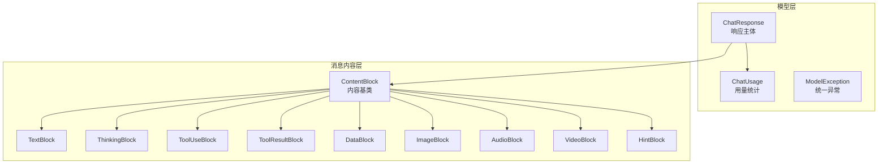
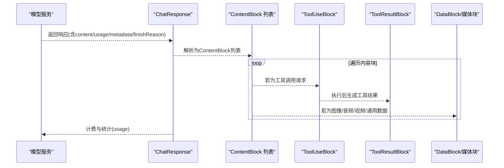
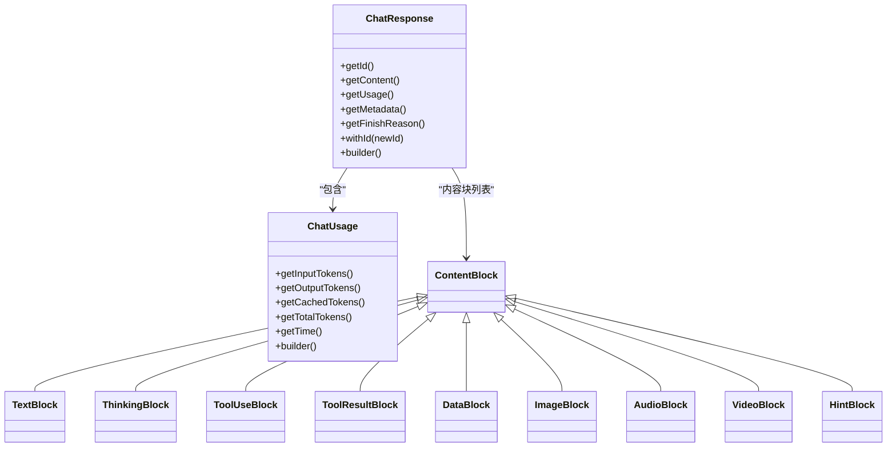

# 响应处理

<cite>
**本文引用的文件**
- [ChatResponse.java](file://agentscope-core/src/main/java/io/agentscope/core/model/ChatResponse.java)
- [ChatUsage.java](file://agentscope-core/src/main/java/io/agentscope/core/model/ChatUsage.java)
- [ModelException.java](file://agentscope-core/src/main/java/io/agentscope/core/model/ModelException.java)
- [ContentBlock.java](file://agentscope-core/src/main/java/io/agentscope/core/message/ContentBlock.java)
- [TextBlock.java](file://agentscope-core/src/main/java/io/agentscope/core/message/TextBlock.java)
- [ThinkingBlock.java](file://agentscope-core/src/main/java/io/agentscope/core/message/ThinkingBlock.java)
- [ToolUseBlock.java](file://agentscope-core/src/main/java/io/agentscope/core/message/ToolUseBlock.java)
- [ToolResultBlock.java](file://agentscope-core/src/main/java/io/agentscope/core/message/ToolResultBlock.java)
- [DataBlock.java](file://agentscope-core/src/main/java/io/agentscope/core/message/DataBlock.java)
- [ImageBlock.java](file://agentscope-core/src/main/java/io/agentscope/core/message/ImageBlock.java)
- [AudioBlock.java](file://agentscope-core/src/main/java/io/agentscope/core/message/AudioBlock.java)
- [VideoBlock.java](file://agentscope-core/src/main/java/io/agentscope/core/message/VideoBlock.java)
- [HintBlock.java](file://agentscope-core/src/main/java/io/agentscope/core/message/HintBlock.java)
</cite>

## 目录
1. [简介](#简介)
2. [项目结构](#项目结构)
3. [核心组件](#核心组件)
4. [架构总览](#架构总览)
5. [组件详解](#组件详解)
6. [依赖关系分析](#依赖关系分析)
7. [性能考量](#性能考量)
8. [故障排查指南](#故障排查指南)
9. [结论](#结论)
10. [附录：常见用法与最佳实践](#附录常见用法与最佳实践)

## 简介
本文件聚焦于 AgentScope Java 的“响应处理”机制，系统性阐述以下主题：
- ChatResponse 数据结构与响应流处理（文本增量、工具调用、思维过程、多模态内容）
- ChatUsage 使用统计与计费信息处理
- ModelException 异常分类与错误处理策略
- 具体的代码示例路径（以源码路径标注代替直接代码片段）
- 响应处理的性能优化、内存管理与错误恢复最佳实践

## 项目结构
围绕响应处理的关键代码位于 agentscope-core 模块中，主要分为两层：
- 模型层：ChatResponse、ChatUsage、ModelException
- 消息内容层：ContentBlock 及其子类（TextBlock、ThinkingBlock、ToolUseBlock、ToolResultBlock、DataBlock、ImageBlock、AudioBlock、VideoBlock、HintBlock）

**图示来源**
- [ChatResponse.java:29-122](file://agentscope-core/src/main/java/io/agentscope/core/model/ChatResponse.java#L29-L122)
- [ChatUsage.java:28-126](file://agentscope-core/src/main/java/io/agentscope/core/model/ChatUsage.java#L28-L126)
- [ModelException.java:22-104](file://agentscope-core/src/main/java/io/agentscope/core/model/ModelException.java#L22-L104)
- [ContentBlock.java:46-67](file://agentscope-core/src/main/java/io/agentscope/core/message/ContentBlock.java#L46-L67)
- [TextBlock.java:31-95](file://agentscope-core/src/main/java/io/agentscope/core/message/TextBlock.java#L31-L95)
- [ThinkingBlock.java:37-133](file://agentscope-core/src/main/java/io/agentscope/core/message/ThinkingBlock.java#L37-L133)
- [ToolUseBlock.java:34-286](file://agentscope-core/src/main/java/io/agentscope/core/message/ToolUseBlock.java#L34-L286)
- [ToolResultBlock.java:35-413](file://agentscope-core/src/main/java/io/agentscope/core/message/ToolResultBlock.java#L35-L413)
- [DataBlock.java:35-153](file://agentscope-core/src/main/java/io/agentscope/core/message/DataBlock.java#L35-L153)
- [ImageBlock.java:37-163](file://agentscope-core/src/main/java/io/agentscope/core/message/ImageBlock.java#L37-L163)
- [AudioBlock.java:35-96](file://agentscope-core/src/main/java/io/agentscope/core/message/AudioBlock.java#L35-L96)
- [VideoBlock.java:36-239](file://agentscope-core/src/main/java/io/agentscope/core/message/VideoBlock.java#L36-L239)
- [HintBlock.java:28-74](file://agentscope-core/src/main/java/io/agentscope/core/message/HintBlock.java#L28-L74)

**章节来源**
- [ChatResponse.java:29-207](file://agentscope-core/src/main/java/io/agentscope/core/model/ChatResponse.java#L29-L207)
- [ChatUsage.java:28-191](file://agentscope-core/src/main/java/io/agentscope/core/model/ChatUsage.java#L28-L191)
- [ModelException.java:22-118](file://agentscope-core/src/main/java/io/agentscope/core/model/ModelException.java#L22-L118)
- [ContentBlock.java:46-67](file://agentscope-core/src/main/java/io/agentscope/core/message/ContentBlock.java#L46-L67)

## 核心组件
- ChatResponse：封装一次模型调用的完整响应，包含内容块列表、用量统计、元数据与结束原因。
- ChatUsage：记录输入/输出/缓存令牌数与执行时长，支持构建器模式。
- ModelException：统一的模型操作异常类型，携带模型名与提供商信息，便于定位与分级处理。
- ContentBlock 及其子类：多态的内容容器，覆盖文本、思维、工具调用/结果、多模态数据与提示信息。

关键职责与接口要点：
- ChatResponse 提供 withId、builder 等方法，确保兼容不同提供商返回差异（如 Ollama 不返回 id）。
- ContentBlock 通过 Jackson 多态注解实现序列化/反序列化，并限定子类集合，保证类型安全。
- ToolUseBlock/ToolResultBlock 支持状态机（ToolCallState/ToolResultState），便于流式工具调用的状态追踪。
- ChatUsage 提供 getTotalTokens、带时间字段的构造器，满足计费与性能监控需求。

**章节来源**
- [ChatResponse.java:46-206](file://agentscope-core/src/main/java/io/agentscope/core/model/ChatResponse.java#L46-L206)
- [ChatUsage.java:45-189](file://agentscope-core/src/main/java/io/agentscope/core/model/ChatUsage.java#L45-L189)
- [ModelException.java:35-104](file://agentscope-core/src/main/java/io/agentscope/core/model/ModelException.java#L35-L104)
- [ContentBlock.java:46-67](file://agentscope-core/src/main/java/io/agentscope/core/message/ContentBlock.java#L46-L67)
- [ToolUseBlock.java:98-186](file://agentscope-core/src/main/java/io/agentscope/core/message/ToolUseBlock.java#L98-L186)
- [ToolResultBlock.java:46-140](file://agentscope-core/src/main/java/io/agentscope/core/message/ToolResultBlock.java#L46-L140)

## 架构总览
下图展示了从模型响应到内容块解析、工具调用处理与多模态数据呈现的整体流程。

**图示来源**
- [ChatResponse.java:29-122](file://agentscope-core/src/main/java/io/agentscope/core/model/ChatResponse.java#L29-L122)
- [ToolUseBlock.java:34-119](file://agentscope-core/src/main/java/io/agentscope/core/message/ToolUseBlock.java#L34-L119)
- [ToolResultBlock.java:35-140](file://agentscope-core/src/main/java/io/agentscope/core/message/ToolResultBlock.java#L35-L140)
- [DataBlock.java:35-87](file://agentscope-core/src/main/java/io/agentscope/core/message/DataBlock.java#L35-L87)

## 组件详解

### ChatResponse：响应主体与流式处理
- 字段与语义
  - id：响应唯一标识；若为空将自动生成 UUID（兼容 Ollama 等不返回 id 的提供商）。
  - content：内容块列表，承载文本、思维、工具调用/结果、多模态数据等。
  - usage：Token 使用统计与耗时。
  - metadata：来自提供商的扩展元数据。
  - finishReason：停止生成的原因（如长度、内容过滤、函数调用等）。
- 流式处理要点
  - content 中可包含多个 ContentBlock，按顺序增量到达。
  - 对于工具调用，可通过 ToolUseBlock/ToolResultBlock 进行分块处理与状态推进。
  - 思维过程可由 ThinkingBlock 增量输出，便于前端实时渲染与调试。
- 示例路径
  - [ChatResponse.Builder.build 自动填充 id:198-205](file://agentscope-core/src/main/java/io/agentscope/core/model/ChatResponse.java#L198-L205)

**章节来源**
- [ChatResponse.java:46-206](file://agentscope-core/src/main/java/io/agentscope/core/model/ChatResponse.java#L46-L206)

### ChatUsage：用量统计与计费
- 字段与语义
  - inputTokens：输入令牌数
  - outputTokens：输出令牌数
  - cachedTokens：缓存命中令牌数（部分提供商支持）
  - time：执行时长（秒）
- 计费与统计
  - getTotalTokens：输入+输出总和，用于成本估算。
  - cachedTokens：可用于区分“实际计费输入”与“缓存节省输入”，并影响计费单价。
- 示例路径
  - [ChatUsage 构造器与 getter:45-117](file://agentscope-core/src/main/java/io/agentscope/core/model/ChatUsage.java#L45-L117)
  - [ChatUsage.Builder 构建:187-189](file://agentscope-core/src/main/java/io/agentscope/core/model/ChatUsage.java#L187-L189)

**章节来源**
- [ChatUsage.java:45-189](file://agentscope-core/src/main/java/io/agentscope/core/model/ChatUsage.java#L45-L189)

### ModelException：异常分类与处理策略
- 分类维度
  - 通用异常：无模型/提供商上下文
  - 模型级异常：携带 modelName 与 provider，便于定位具体模型与提供商
- 处理建议
  - 区分重试策略：网络超时、限流、鉴权失败等可采用指数退避；内容过滤、参数错误等需快速失败并记录
  - 结合 ChatUsage 记录失败场景的耗时与令牌消耗，辅助成本归因
  - 在工具调用链路中，捕获并转换为 ToolResultBlock.error 或 Suspended 结果，保持对话连续性
- 示例路径
  - [ModelException 构造与访问器:35-104](file://agentscope-core/src/main/java/io/agentscope/core/model/ModelException.java#L35-L104)

**章节来源**
- [ModelException.java:22-118](file://agentscope-core/src/main/java/io/agentscope/core/model/ModelException.java#L22-L118)

### ContentBlock 体系：多模态与多阶段内容
- ContentBlock 作为密封类（sealed），通过 @JsonTypeInfo/@JsonSubTypes 实现多态序列化
- 子类覆盖能力
  - 文本：TextBlock
  - 思维：ThinkingBlock（支持 metadata 保留推理细节）
  - 工具：ToolUseBlock（含 id/name/input/content/metadata/state）
  - 工具结果：ToolResultBlock（含 output/metadata/state，支持 suspended 标记）
  - 多模态：DataBlock（统一二进制容器）、ImageBlock、AudioBlock、VideoBlock（含尺寸/帧率/像素约束）
  - 提示：HintBlock（注入式提示，非历史）
- 示例路径
  - [ContentBlock 密封类与子类映射:46-67](file://agentscope-core/src/main/java/io/agentscope/core/message/ContentBlock.java#L46-L67)
  - [ThinkingBlock 元数据键与构建器:39-131](file://agentscope-core/src/main/java/io/agentscope/core/message/ThinkingBlock.java#L39-L131)
  - [ToolUseBlock 多构造器与状态更新:54-186](file://agentscope-core/src/main/java/io/agentscope/core/message/ToolUseBlock.java#L54-L186)
  - [ToolResultBlock 输出与 suspended 辅助方法:166-186](file://agentscope-core/src/main/java/io/agentscope/core/message/ToolResultBlock.java#L166-L186)
  - [DataBlock 构造器与构建器:51-151](file://agentscope-core/src/main/java/io/agentscope/core/message/DataBlock.java#L51-L151)
  - [ImageBlock/VideoBlock/音频块属性与构建器:63-161](file://agentscope-core/src/main/java/io/agentscope/core/message/ImageBlock.java#L63-L161)
  - [VideoBlock 属性与构建器:69-237](file://agentscope-core/src/main/java/io/agentscope/core/message/VideoBlock.java#L69-L237)
  - [HintBlock 注入提示:34-73](file://agentscope-core/src/main/java/io/agentscope/core/message/HintBlock.java#L34-L73)

**章节来源**
- [ContentBlock.java:46-67](file://agentscope-core/src/main/java/io/agentscope/core/message/ContentBlock.java#L46-L67)
- [TextBlock.java:31-95](file://agentscope-core/src/main/java/io/agentscope/core/message/TextBlock.java#L31-L95)
- [ThinkingBlock.java:37-133](file://agentscope-core/src/main/java/io/agentscope/core/message/ThinkingBlock.java#L37-L133)
- [ToolUseBlock.java:34-286](file://agentscope-core/src/main/java/io/agentscope/core/message/ToolUseBlock.java#L34-L286)
- [ToolResultBlock.java:35-413](file://agentscope-core/src/main/java/io/agentscope/core/message/ToolResultBlock.java#L35-L413)
- [DataBlock.java:35-153](file://agentscope-core/src/main/java/io/agentscope/core/message/DataBlock.java#L35-L153)
- [ImageBlock.java:37-163](file://agentscope-core/src/main/java/io/agentscope/core/message/ImageBlock.java#L37-L163)
- [AudioBlock.java:35-96](file://agentscope-core/src/main/java/io/agentscope/core/message/AudioBlock.java#L35-L96)
- [VideoBlock.java:36-239](file://agentscope-core/src/main/java/io/agentscope/core/message/VideoBlock.java#L36-L239)
- [HintBlock.java:28-74](file://agentscope-core/src/main/java/io/agentscope/core/message/HintBlock.java#L28-L74)

### 工具调用与思维过程的流式处理
- 工具调用流
  - 请求：ToolUseBlock（含 id/name/input/content/metadata/state）
  - 执行：在业务侧根据 input 调用工具，产出 ToolResultBlock（含 output/metadata/state）
  - 状态推进：通过 withState/withIdAndName 更新状态或补充 id/name
- 思维过程流
  - ThinkingBlock 支持增量输出与 metadata 保留（如推理详情），便于前端逐步渲染与审计
- 示例路径
  - [ToolUseBlock.withState 状态更新:184-186](file://agentscope-core/src/main/java/io/agentscope/core/message/ToolUseBlock.java#L184-L186)
  - [ToolResultBlock.withState 状态更新:138-140](file://agentscope-core/src/main/java/io/agentscope/core/message/ToolResultBlock.java#L138-L140)
  - [ToolResultBlock.suspended 外部执行挂起:166-186](file://agentscope-core/src/main/java/io/agentscope/core/message/ToolResultBlock.java#L166-L186)
  - [ThinkingBlock 元数据与构建器:89-131](file://agentscope-core/src/main/java/io/agentscope/core/message/ThinkingBlock.java#L89-L131)

**章节来源**
- [ToolUseBlock.java:98-186](file://agentscope-core/src/main/java/io/agentscope/core/message/ToolUseBlock.java#L98-L186)
- [ToolResultBlock.java:138-186](file://agentscope-core/src/main/java/io/agentscope/core/message/ToolResultBlock.java#L138-L186)
- [ThinkingBlock.java:89-131](file://agentscope-core/src/main/java/io/agentscope/core/message/ThinkingBlock.java#L89-L131)

### 多模态内容处理
- DataBlock 作为统一二进制容器，优先使用；ImageBlock/AudioBlock/VideoBlock 保留向后兼容
- Source 支持 URL 与 Base64，避免重复编码/解码带来的内存压力
- 媒体块属性（如 min/maxPixels、fps、maxFrames、totalPixels）用于控制资源消耗与合规性
- 示例路径
  - [DataBlock 构造器与属性:51-87](file://agentscope-core/src/main/java/io/agentscope/core/message/DataBlock.java#L51-L87)
  - [ImageBlock 构造器与属性:63-98](file://agentscope-core/src/main/java/io/agentscope/core/message/ImageBlock.java#L63-L98)
  - [VideoBlock 构造器与属性:69-136](file://agentscope-core/src/main/java/io/agentscope/core/message/VideoBlock.java#L69-L136)

**章节来源**
- [DataBlock.java:51-87](file://agentscope-core/src/main/java/io/agentscope/core/message/DataBlock.java#L51-L87)
- [ImageBlock.java:63-98](file://agentscope-core/src/main/java/io/agentscope/core/message/ImageBlock.java#L63-L98)
- [VideoBlock.java:69-136](file://agentscope-core/src/main/java/io/agentscope/core/message/VideoBlock.java#L69-L136)

## 依赖关系分析
- ChatResponse 依赖 ContentBlock 列表与 ChatUsage；ContentBlock 为密封类，子类通过 Jackson 多态绑定
- ToolUseBlock/ToolResultBlock 与状态枚举（ToolCallState/ToolResultState）配合，形成可追踪的工具调用生命周期
- ModelException 与各 Provider 的错误语义解耦，便于上层统一处理

**图示来源**
- [ChatResponse.java:29-122](file://agentscope-core/src/main/java/io/agentscope/core/model/ChatResponse.java#L29-L122)
- [ChatUsage.java:28-126](file://agentscope-core/src/main/java/io/agentscope/core/model/ChatUsage.java#L28-L126)
- [ContentBlock.java:46-67](file://agentscope-core/src/main/java/io/agentscope/core/message/ContentBlock.java#L46-L67)
- [TextBlock.java:31-95](file://agentscope-core/src/main/java/io/agentscope/core/message/TextBlock.java#L31-L95)
- [ThinkingBlock.java:37-133](file://agentscope-core/src/main/java/io/agentscope/core/message/ThinkingBlock.java#L37-L133)
- [ToolUseBlock.java:34-286](file://agentscope-core/src/main/java/io/agentscope/core/message/ToolUseBlock.java#L34-L286)
- [ToolResultBlock.java:35-413](file://agentscope-core/src/main/java/io/agentscope/core/message/ToolResultBlock.java#L35-L413)
- [DataBlock.java:35-153](file://agentscope-core/src/main/java/io/agentscope/core/message/DataBlock.java#L35-L153)
- [ImageBlock.java:37-163](file://agentscope-core/src/main/java/io/agentscope/core/message/ImageBlock.java#L37-L163)
- [AudioBlock.java:35-96](file://agentscope-core/src/main/java/io/agentscope/core/message/AudioBlock.java#L35-L96)
- [VideoBlock.java:36-239](file://agentscope-core/src/main/java/io/agentscope/core/message/VideoBlock.java#L36-L239)
- [HintBlock.java:28-74](file://agentscope-core/src/main/java/io/agentscope/core/message/HintBlock.java#L28-L74)

## 性能考量
- 内存管理
  - ContentBlock 输入参数采用防御性拷贝（不可变视图），降低外部修改风险并减少并发问题
  - DataBlock/ImageBlock/AudioBlock/VideoBlock 的 Source 仅持有引用，避免重复解码/编码
- 序列化/反序列化
  - ContentBlock 通过 Jackson 多态注解，减少分支判断开销；建议在高并发场景复用 ObjectMapper
- 流式处理
  - ToolUseBlock/ToolResultBlock 支持增量 content 与状态推进，避免一次性累积大量中间结果
- 计费与统计
  - ChatUsage 提供 cachedTokens 与 time，便于热点路径优化与成本控制

[本节为通用指导，无需列出具体文件来源]

## 故障排查指南
- 常见问题与对策
  - 响应 id 缺失：ChatResponse.Builder 会自动填充 UUID，确保下游逻辑稳定
  - 工具调用未完成：检查 ToolUseBlock/ToolResultBlock 的状态流转，必要时手动 withState 推进
  - 多模态媒体过大：利用 VideoBlock 的 fps/maxFrames/totalPixels 限制，或 DataBlock 的 id/name 做去重
  - 异常定位困难：使用 ModelException 的 modelName/provider 字段，结合 ChatUsage 的 time/inputTokens/outputTokens 进行成本与性能归因
- 示例路径
  - [ChatResponse.Builder.build 自动填充 id:198-205](file://agentscope-core/src/main/java/io/agentscope/core/model/ChatResponse.java#L198-L205)
  - [ToolResultBlock.suspended 外部执行挂起:166-186](file://agentscope-core/src/main/java/io/agentscope/core/message/ToolResultBlock.java#L166-L186)
  - [ModelException 访问器:93-104](file://agentscope-core/src/main/java/io/agentscope/core/model/ModelException.java#L93-L104)

**章节来源**
- [ChatResponse.java:198-205](file://agentscope-core/src/main/java/io/agentscope/core/model/ChatResponse.java#L198-L205)
- [ToolResultBlock.java:166-186](file://agentscope-core/src/main/java/io/agentscope/core/message/ToolResultBlock.java#L166-L186)
- [ModelException.java:93-104](file://agentscope-core/src/main/java/io/agentscope/core/model/ModelException.java#L93-L104)

## 结论
AgentScope Java 的响应处理以 ChatResponse 为核心，借助 ContentBlock 的多态体系与 ChatUsage 的计量能力，实现了对文本增量、工具调用、思维过程与多模态内容的统一建模。配合 ModelException 的统一异常模型，可在复杂流式场景中实现稳健的错误处理与可观测性。通过状态推进、防御性拷贝与媒体块属性控制，兼顾了性能与可靠性。

[本节为总结性内容，无需列出具体文件来源]

## 附录：常见用法与最佳实践
- 解析响应流
  - 步骤：接收 ChatResponse -> 遍历 content -> 类型匹配 -> 分别处理文本/思维/工具/媒体
  - 示例路径：[ChatResponse.content 获取:73-75](file://agentscope-core/src/main/java/io/agentscope/core/model/ChatResponse.java#L73-L75)
- 提取工具调用结果
  - 步骤：识别 ToolUseBlock -> 执行工具 -> 生成 ToolResultBlock -> withState 推进
  - 示例路径：[ToolUseBlock.withState:184-186](file://agentscope-core/src/main/java/io/agentscope/core/message/ToolUseBlock.java#L184-L186)
- 处理部分完成的响应
  - 使用 ToolResultBlock.suspended 将需要外部执行的工具标记为挂起，保持对话连续
  - 示例路径：[ToolResultBlock.suspended:166-186](file://agentscope-core/src/main/java/io/agentscope/core/message/ToolResultBlock.java#L166-L186)
- 性能优化与内存管理
  - 使用 DataBlock 统一二进制容器，避免重复编解码
  - 合理设置 VideoBlock 的 fps/maxFrames/totalPixels 控制资源占用
  - 示例路径：[DataBlock 构造器:51-60](file://agentscope-core/src/main/java/io/agentscope/core/message/DataBlock.java#L51-L60)
- 错误恢复
  - 捕获 ModelException，依据 provider/modelName 定位问题；结合 ChatUsage 的 time/inputTokens/outputTokens 进行成本与性能分析
  - 示例路径：[ModelException 访问器:93-104](file://agentscope-core/src/main/java/io/agentscope/core/model/ModelException.java#L93-L104)

**章节来源**
- [ChatResponse.java:73-75](file://agentscope-core/src/main/java/io/agentscope/core/model/ChatResponse.java#L73-L75)
- [ToolUseBlock.java:184-186](file://agentscope-core/src/main/java/io/agentscope/core/message/ToolUseBlock.java#L184-L186)
- [ToolResultBlock.java:166-186](file://agentscope-core/src/main/java/io/agentscope/core/message/ToolResultBlock.java#L166-L186)
- [DataBlock.java:51-60](file://agentscope-core/src/main/java/io/agentscope/core/message/DataBlock.java#L51-L60)
- [ModelException.java:93-104](file://agentscope-core/src/main/java/io/agentscope/core/model/ModelException.java#L93-L104)