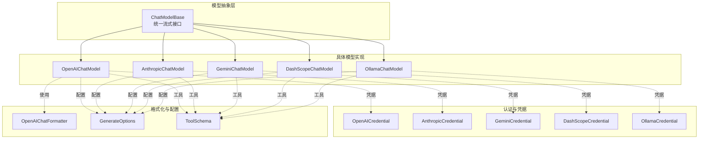
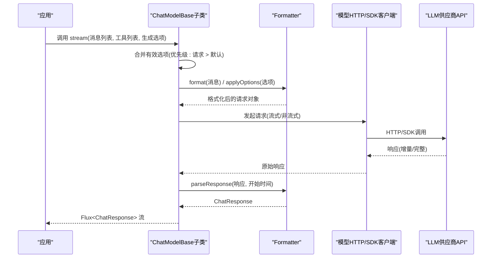
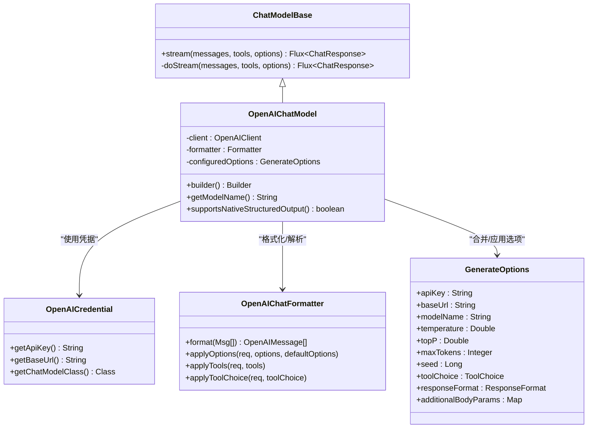
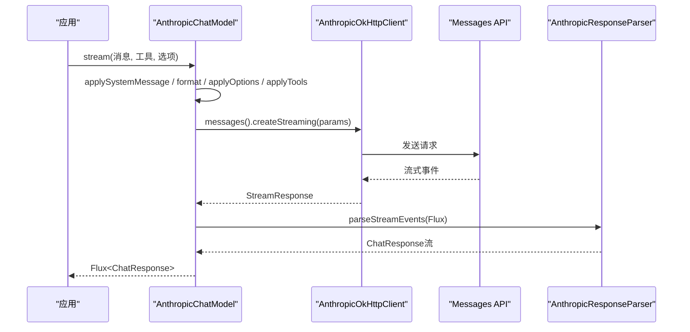
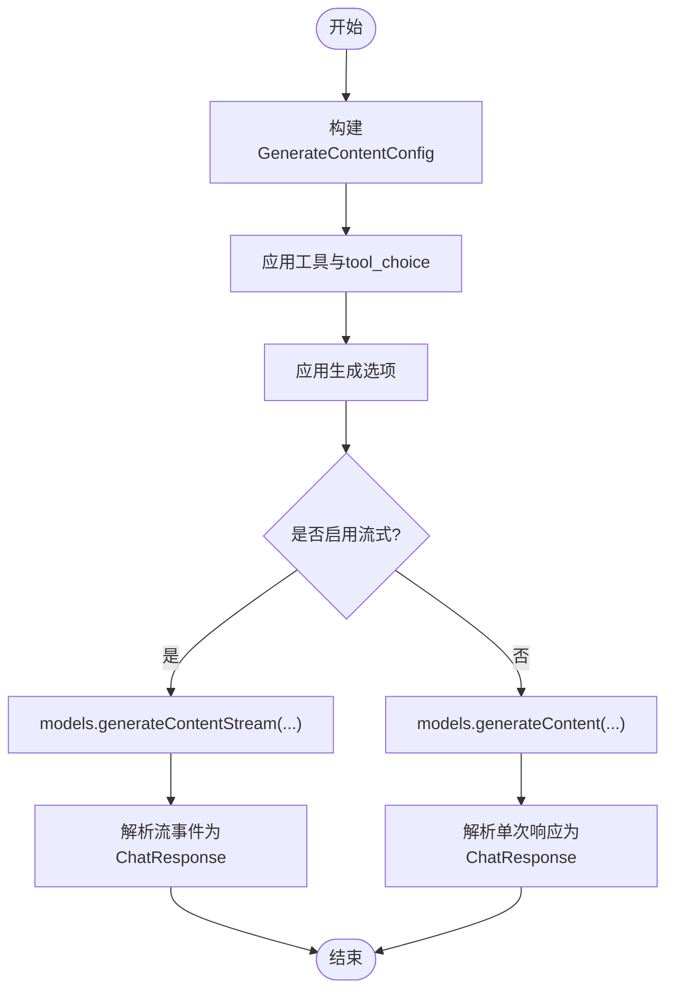
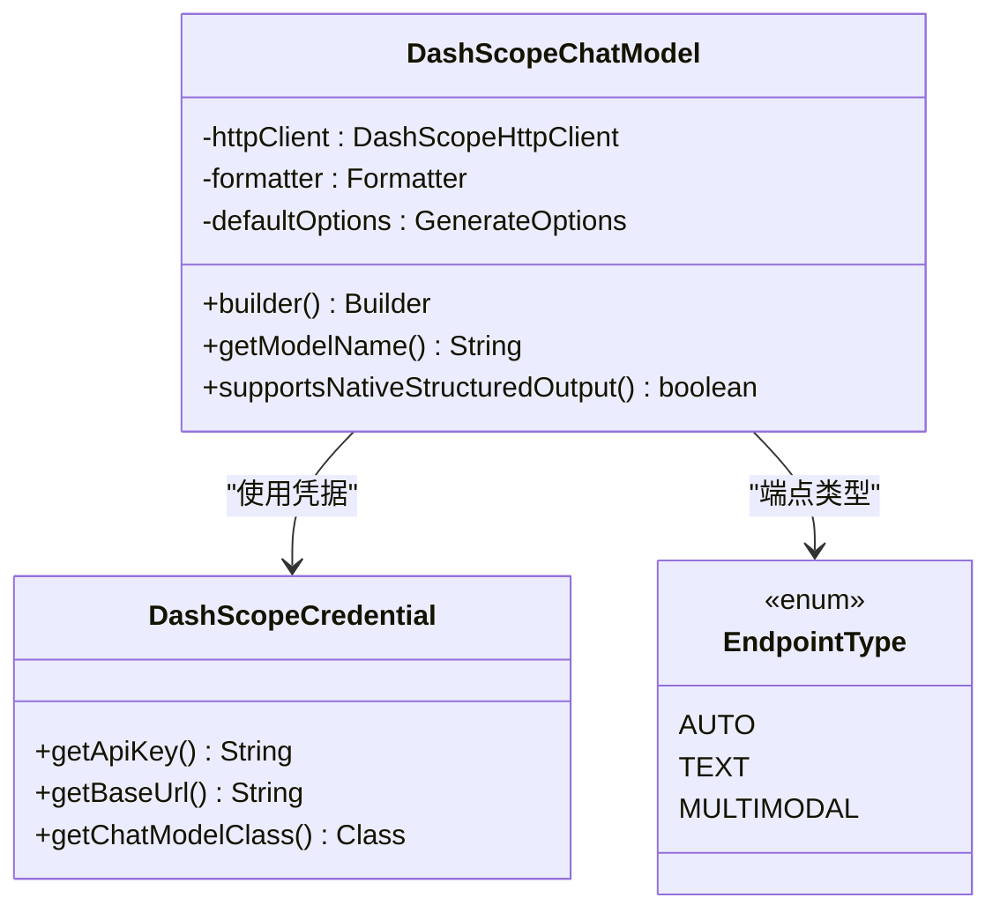
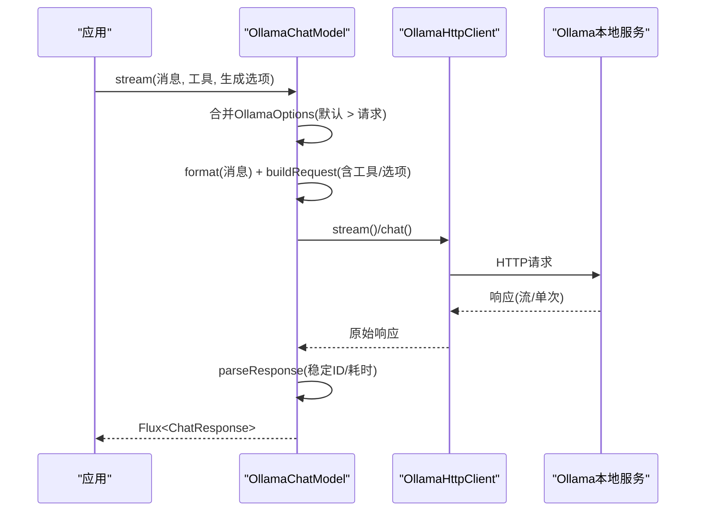
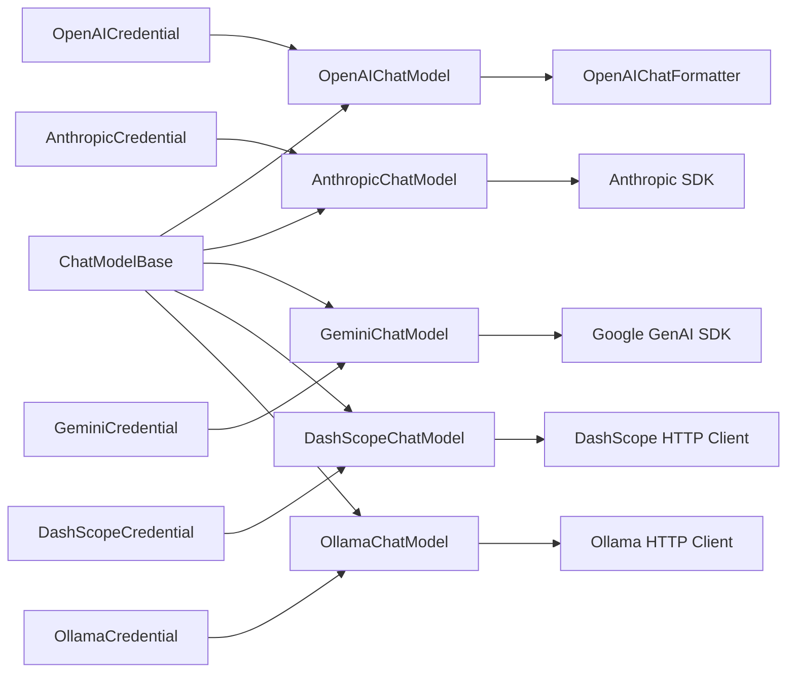

# 模型实现

<cite>
**本文引用的文件**
- [ChatModelBase.java](file://agentscope-core/src/main/java/io/agentscope/core/model/ChatModelBase.java)
- [OpenAIChatModel.java](file://agentscope-core/src/main/java/io/agentscope/core/model/OpenAIChatModel.java)
- [AnthropicChatModel.java](file://agentscope-core/src/main/java/io/agentscope/core/model/AnthropicChatModel.java)
- [GeminiChatModel.java](file://agentscope-core/src/main/java/io/agentscope/core/model/GeminiChatModel.java)
- [DashScopeChatModel.java](file://agentscope-core/src/main/java/io/agentscope/core/model/DashScopeChatModel.java)
- [OllamaChatModel.java](file://agentscope-core/src/main/java/io/agentscope/core/model/OllamaChatModel.java)
- [OpenAICredential.java](file://agentscope-core/src/main/java/io/agentscope/core/credential/OpenAICredential.java)
- [AnthropicCredential.java](file://agentscope-core/src/main/java/io/agentscope/core/credential/AnthropicCredential.java)
- [GeminiCredential.java](file://agentscope-core/src/main/java/io/agentscope/core/credential/GeminiCredential.java)
- [DashScopeCredential.java](file://agentscope-core/src/main/java/io/agentscope/core/credential/DashScopeCredential.java)
- [OllamaCredential.java](file://agentscope-core/src/main/java/io/agentscope/core/credential/OllamaCredential.java)
- [OpenAIChatFormatter.java](file://agentscope-core/src/main/java/io/agentscope/core/formatter/openai/OpenAIChatFormatter.java)
- [GenerateOptions.java](file://agentscope-core/src/main/java/io/agentscope/core/model/GenerateOptions.java)
- [ToolSchema.java](file://agentscope-core/src/main/java/io/agentscope/core/model/ToolSchema.java)
</cite>

## 目录
1. [简介](#简介)
2. [项目结构](#项目结构)
3. [核心组件](#核心组件)
4. [架构总览](#架构总览)
5. [详细组件分析](#详细组件分析)
6. [依赖分析](#依赖分析)
7. [性能考虑](#性能考虑)
8. [故障排查指南](#故障排查指南)
9. [结论](#结论)
10. [附录](#附录)

## 简介
本文件面向AgentScope Java框架中主流大语言模型（LLM）的适配与使用，系统性梳理OpenAI、Anthropic、Gemini、DashScope、Ollama等模型的认证机制、API调用方式、参数配置与响应处理，并总结各模型的特色能力（如结构化输出、工具调用、多模态等）。文档同时提供可操作的配置与使用建议、错误处理策略以及性能与最佳实践指导。

## 项目结构
AgentScope Java在agentscope-core模块中提供了统一的模型抽象与适配层：
- 抽象基类：ChatModelBase定义了所有模型的通用流式调用接口与追踪集成。
- 具体实现：OpenAIChatModel、AnthropicChatModel、GeminiChatModel、DashScopeChatModel、OllamaChatModel分别封装不同供应商的SDK或HTTP客户端。
- 认证与凭据：credential包提供各模型对应的凭据类，用于管理API Key、基础URL等连接信息。
- 格式化器：formatter包针对各模型的消息格式转换、工具参数映射、选项应用等进行适配。
- 配置与工具：GenerateOptions集中管理连接级与生成级参数；ToolSchema描述工具接口与JSON Schema。

图表来源
- [ChatModelBase.java:29-61](file://agentscope-core/src/main/java/io/agentscope/core/model/ChatModelBase.java#L29-L61)
- [OpenAIChatModel.java:61-83](file://agentscope-core/src/main/java/io/agentscope/core/model/OpenAIChatModel.java#L61-L83)
- [AnthropicChatModel.java:55-115](file://agentscope-core/src/main/java/io/agentscope/core/model/AnthropicChatModel.java#L55-L115)
- [GeminiChatModel.java:57-151](file://agentscope-core/src/main/java/io/agentscope/core/model/GeminiChatModel.java#L57-L151)
- [DashScopeChatModel.java:55-170](file://agentscope-core/src/main/java/io/agentscope/core/model/DashScopeChatModel.java#L55-L170)
- [OllamaChatModel.java:56-87](file://agentscope-core/src/main/java/io/agentscope/core/model/OllamaChatModel.java#L56-L87)
- [OpenAICredential.java:29-76](file://agentscope-core/src/main/java/io/agentscope/core/credential/OpenAICredential.java#L29-L76)
- [AnthropicCredential.java:29-68](file://agentscope-core/src/main/java/io/agentscope/core/credential/AnthropicCredential.java#L29-L68)
- [GeminiCredential.java:29-59](file://agentscope-core/src/main/java/io/agentscope/core/credential/GeminiCredential.java#L29-L59)
- [DashScopeCredential.java:29-71](file://agentscope-core/src/main/java/io/agentscope/core/credential/DashScopeCredential.java#L29-L71)
- [OllamaCredential.java:33-63](file://agentscope-core/src/main/java/io/agentscope/core/credential/OllamaCredential.java#L33-L63)
- [OpenAIChatFormatter.java:46-52](file://agentscope-core/src/main/java/io/agentscope/core/formatter/openai/OpenAIChatFormatter.java#L46-L52)
- [GenerateOptions.java:32-98](file://agentscope-core/src/main/java/io/agentscope/core/model/GenerateOptions.java#L32-L98)
- [ToolSchema.java:28-52](file://agentscope-core/src/main/java/io/agentscope/core/model/ToolSchema.java#L28-L52)

章节来源
- [ChatModelBase.java:29-61](file://agentscope-core/src/main/java/io/agentscope/core/model/ChatModelBase.java#L29-L61)
- [OpenAIChatModel.java:61-83](file://agentscope-core/src/main/java/io/agentscope/core/model/OpenAIChatModel.java#L61-L83)
- [AnthropicChatModel.java:55-115](file://agentscope-core/src/main/java/io/agentscope/core/model/AnthropicChatModel.java#L55-L115)
- [GeminiChatModel.java:57-151](file://agentscope-core/src/main/java/io/agentscope/core/model/GeminiChatModel.java#L57-L151)
- [DashScopeChatModel.java:55-170](file://agentscope-core/src/main/java/io/agentscope/core/model/DashScopeChatModel.java#L55-L170)
- [OllamaChatModel.java:56-87](file://agentscope-core/src/main/java/io/agentscope/core/model/OllamaChatModel.java#L56-L87)

## 核心组件
- ChatModelBase：定义统一的流式调用入口，内部通过TracerRegistry进行调用追踪，屏蔽具体模型差异。
- 各模型实现：均继承自ChatModelBase，覆盖doStream以实现各自SDK或HTTP客户端的请求构建、参数映射与响应解析。
- 凭据类：OpenAICredential、AnthropicCredential、GeminiCredential、DashScopeCredential、OllamaCredential分别封装对应供应商的认证信息与默认行为。
- 格式化器：OpenAIChatFormatter等负责消息格式转换、工具schema映射、采样参数与特殊选项（如响应格式、缓存控制）的应用。
- 配置与工具：GenerateOptions集中管理API Key、基础URL、模型名、采样参数、执行配置（超时/重试）、工具选择策略、附加头/体/查询参数等；ToolSchema描述工具接口与JSON Schema。

章节来源
- [ChatModelBase.java:42-61](file://agentscope-core/src/main/java/io/agentscope/core/model/ChatModelBase.java#L42-L61)
- [OpenAIChatModel.java:85-182](file://agentscope-core/src/main/java/io/agentscope/core/model/OpenAIChatModel.java#L85-L182)
- [AnthropicChatModel.java:134-221](file://agentscope-core/src/main/java/io/agentscope/core/model/AnthropicChatModel.java#L134-L221)
- [GeminiChatModel.java:226-313](file://agentscope-core/src/main/java/io/agentscope/core/model/GeminiChatModel.java#L226-L313)
- [DashScopeChatModel.java:197-318](file://agentscope-core/src/main/java/io/agentscope/core/model/DashScopeChatModel.java#L197-L318)
- [OllamaChatModel.java:138-236](file://agentscope-core/src/main/java/io/agentscope/core/model/OllamaChatModel.java#L138-L236)
- [OpenAICredential.java:29-76](file://agentscope-core/src/main/java/io/agentscope/core/credential/OpenAICredential.java#L29-L76)
- [AnthropicCredential.java:29-68](file://agentscope-core/src/main/java/io/agentscope/core/credential/AnthropicCredential.java#L29-L68)
- [GeminiCredential.java:29-59](file://agentscope-core/src/main/java/io/agentscope/core/credential/GeminiCredential.java#L29-L59)
- [DashScopeCredential.java:29-71](file://agentscope-core/src/main/java/io/agentscope/core/credential/DashScopeCredential.java#L29-L71)
- [OllamaCredential.java:33-63](file://agentscope-core/src/main/java/io/agentscope/core/credential/OllamaCredential.java#L33-L63)
- [OpenAIChatFormatter.java:46-132](file://agentscope-core/src/main/java/io/agentscope/core/formatter/openai/OpenAIChatFormatter.java#L46-L132)
- [GenerateOptions.java:32-98](file://agentscope-core/src/main/java/io/agentscope/core/model/GenerateOptions.java#L32-L98)
- [ToolSchema.java:28-52](file://agentscope-core/src/main/java/io/agentscope/core/model/ToolSchema.java#L28-L52)

## 架构总览
下图展示了AgentScope对各模型的统一抽象与适配层关系，以及典型一次对话的调用序列。

图表来源
- [ChatModelBase.java:42-61](file://agentscope-core/src/main/java/io/agentscope/core/model/ChatModelBase.java#L42-L61)
- [OpenAIChatModel.java:85-182](file://agentscope-core/src/main/java/io/agentscope/core/model/OpenAIChatModel.java#L85-L182)
- [AnthropicChatModel.java:134-221](file://agentscope-core/src/main/java/io/agentscope/core/model/AnthropicChatModel.java#L134-L221)
- [GeminiChatModel.java:226-313](file://agentscope-core/src/main/java/io/agentscope/core/model/GeminiChatModel.java#L226-L313)
- [DashScopeChatModel.java:197-318](file://agentscope-core/src/main/java/io/agentscope/core/model/DashScopeChatModel.java#L197-L318)
- [OllamaChatModel.java:138-236](file://agentscope-core/src/main/java/io/agentscope/core/model/OllamaChatModel.java#L138-L236)

## 详细组件分析

### OpenAI模型适配
- 认证机制：通过OpenAICredential管理API Key与可选组织ID、基础URL；OpenAIChatModel支持在构造时注入或通过GenerateOptions传入。
- API调用方式：OpenAIChatModel使用OpenAIClient进行HTTP调用，支持流式与非流式两种模式；当启用流式时自动附加stream_options以收集token用量。
- 参数配置：OpenAIChatFormatter将GenerateOptions中的温度、top_p、频率/存在惩罚、最大token、种子、并行工具调用、响应格式等映射到OpenAI请求；支持额外body参数透传。
- 响应处理：parseResponse计算耗时并返回ChatResponse；支持缓存控制（cache_control）与工具调用（tool_choice、tools）。
- 特色能力：原生结构化输出支持（supportsNativeStructuredOutput），工具调用严格模式（strict）由formatter按需启用。

图表来源
- [OpenAIChatModel.java:61-197](file://agentscope-core/src/main/java/io/agentscope/core/model/OpenAIChatModel.java#L61-L197)
- [OpenAICredential.java:29-76](file://agentscope-core/src/main/java/io/agentscope/core/credential/OpenAICredential.java#L29-L76)
- [OpenAIChatFormatter.java:46-284](file://agentscope-core/src/main/java/io/agentscope/core/formatter/openai/OpenAIChatFormatter.java#L46-L284)
- [GenerateOptions.java:32-385](file://agentscope-core/src/main/java/io/agentscope/core/model/GenerateOptions.java#L32-385)

章节来源
- [OpenAIChatModel.java:85-182](file://agentscope-core/src/main/java/io/agentscope/core/model/OpenAIChatModel.java#L85-L182)
- [OpenAICredential.java:29-76](file://agentscope-core/src/main/java/io/agentscope/core/credential/OpenAICredential.java#L29-L76)
- [OpenAIChatFormatter.java:68-132](file://agentscope-core/src/main/java/io/agentscope/core/formatter/openai/OpenAIChatFormatter.java#L68-L132)
- [GenerateOptions.java:108-385](file://agentscope-core/src/main/java/io/agentscope/core/model/GenerateOptions.java#L108-385)

### Anthropic模型适配
- 认证机制：AnthropicCredential管理API Key与基础URL；AnthropicChatModel通过官方OkHttp客户端初始化。
- API调用方式：使用官方Messages API，支持流式与非流式；系统消息通过system参数传递；工具结果需置于独立用户消息中。
- 参数配置：Formatter负责将GenerateOptions映射到MessageCreateParams；支持tool_choice与工具schema；代理配置通过ProxyConfig转换为Java Proxy。
- 响应处理：通过AnthropicResponseParser将SDK流事件转换为ChatResponse；支持超时与重试。

图表来源
- [AnthropicChatModel.java:134-221](file://agentscope-core/src/main/java/io/agentscope/core/model/AnthropicChatModel.java#L134-L221)
- [AnthropicCredential.java:29-68](file://agentscope-core/src/main/java/io/agentscope/core/credential/AnthropicCredential.java#L29-L68)

章节来源
- [AnthropicChatModel.java:134-221](file://agentscope-core/src/main/java/io/agentscope/core/model/AnthropicChatModel.java#L134-L221)
- [AnthropicCredential.java:29-68](file://agentscope-core/src/main/java/io/agentscope/core/credential/AnthropicCredential.java#L29-L68)

### Gemini模型适配
- 认证机制：GeminiCredential管理API Key；GeminiChatModel可结合Vertex AI参数（project、location、credentials）或直接使用Gemini API。
- API调用方式：使用官方GenAI Java SDK；支持文本与多模态（图像/音频/视频）；支持思维模式（thinking）与多代理对话。
- 参数配置：Formatter将GenerateOptions映射到GenerateContentConfig；支持工具调用与tool_choice；代理配置通过Smart Merge合并至ClientOptions。
- 响应处理：将ResponseStream转换为Flux并解析为ChatResponse；支持关闭流资源。

图表来源
- [GeminiChatModel.java:226-313](file://agentscope-core/src/main/java/io/agentscope/core/model/GeminiChatModel.java#L226-L313)
- [GeminiCredential.java:29-59](file://agentscope-core/src/main/java/io/agentscope/core/credential/GeminiCredential.java#L29-L59)

章节来源
- [GeminiChatModel.java:226-313](file://agentscope-core/src/main/java/io/agentscope/core/model/GeminiChatModel.java#L226-L313)
- [GeminiCredential.java:29-59](file://agentscope-core/src/main/java/io/agentscope/core/credential/GeminiCredential.java#L29-L59)

### DashScope模型适配
- 认证机制：DashScopeCredential管理API Key与基础URL，默认基础URL指向兼容模式端点。
- API调用方式：通过DashScopeHttpClient进行HTTP调用，自动根据模型名路由到文本或多模态API；支持流式与非流式。
- 参数配置：Formatter负责消息格式化、工具schema与tool_choice应用；支持思考模式（enableThinking）与搜索增强（enableSearch）。
- 响应处理：parseResponse解析响应并计算耗时；支持缓存控制；可选RSA公钥加密（企业安全）。

图表来源
- [DashScopeChatModel.java:55-358](file://agentscope-core/src/main/java/io/agentscope/core/model/DashScopeChatModel.java#L55-L358)
- [DashScopeCredential.java:29-71](file://agentscope-core/src/main/java/io/agentscope/core/credential/DashScopeCredential.java#L29-L71)

章节来源
- [DashScopeChatModel.java:197-348](file://agentscope-core/src/main/java/io/agentscope/core/model/DashScopeChatModel.java#L197-L348)
- [DashScopeCredential.java:29-71](file://agentscope-core/src/main/java/io/agentscope/core/credential/DashScopeCredential.java#L29-L71)

### Ollama模型适配
- 认证机制：OllamaCredential仅管理本地服务地址（host），无需API Key；OllamaChatModel通过HTTP客户端访问本地Ollama实例。
- API调用方式：使用OllamaHttpClient进行HTTP调用；支持流式与非流式；可同时使用GenerateOptions与OllamaOptions。
- 参数配置：Formatter将AgentScope消息转换为Ollama请求；支持工具调用与tool_choice；代理配置通过OkHttpTransport与ProxyConfig设置。
- 响应处理：parseResponse解析响应并稳定流式ID；支持超时与重试。

图表来源
- [OllamaChatModel.java:138-236](file://agentscope-core/src/main/java/io/agentscope/core/model/OllamaChatModel.java#L138-L236)
- [OllamaCredential.java:33-63](file://agentscope-core/src/main/java/io/agentscope/core/credential/OllamaCredential.java#L33-L63)

章节来源
- [OllamaChatModel.java:138-236](file://agentscope-core/src/main/java/io/agentscope/core/model/OllamaChatModel.java#L138-L236)
- [OllamaCredential.java:33-63](file://agentscope-core/src/main/java/io/agentscope/core/credential/OllamaCredential.java#L33-L63)

## 依赖分析
- 组件内聚与耦合
  - ChatModelBase提供统一接口，降低上层对具体模型的感知；各模型实现内部通过Formatter解耦消息格式与参数映射。
  - 凭据类与模型类通过getChatModelClass关联，便于注册与工厂化装配。
- 外部依赖
  - OpenAI：HTTP客户端与OpenAI SDK；Anthropic：官方Java SDK；Gemini：Google GenAI SDK；DashScope：HTTP客户端；Ollama：本地HTTP服务。
- 可能的循环依赖
  - 当前结构清晰，未发现循环依赖迹象；Formatter与模型之间为单向依赖。

图表来源
- [ChatModelBase.java:29-61](file://agentscope-core/src/main/java/io/agentscope/core/model/ChatModelBase.java#L29-L61)
- [OpenAIChatModel.java:61-83](file://agentscope-core/src/main/java/io/agentscope/core/model/OpenAIChatModel.java#L61-L83)
- [AnthropicChatModel.java:55-115](file://agentscope-core/src/main/java/io/agentscope/core/model/AnthropicChatModel.java#L55-L115)
- [GeminiChatModel.java:57-151](file://agentscope-core/src/main/java/io/agentscope/core/model/GeminiChatModel.java#L57-L151)
- [DashScopeChatModel.java:55-170](file://agentscope-core/src/main/java/io/agentscope/core/model/DashScopeChatModel.java#L55-L170)
- [OllamaChatModel.java:56-87](file://agentscope-core/src/main/java/io/agentscope/core/model/OllamaChatModel.java#L56-L87)

章节来源
- [OpenAIChatModel.java:61-83](file://agentscope-core/src/main/java/io/agentscope/core/model/OpenAIChatModel.java#L61-L83)
- [AnthropicChatModel.java:55-115](file://agentscope-core/src/main/java/io/agentscope/core/model/AnthropicChatModel.java#L55-L115)
- [GeminiChatModel.java:57-151](file://agentscope-core/src/main/java/io/agentscope/core/model/GeminiChatModel.java#L57-L151)
- [DashScopeChatModel.java:55-170](file://agentscope-core/src/main/java/io/agentscope/core/model/DashScopeChatModel.java#L55-L170)
- [OllamaChatModel.java:56-87](file://agentscope-core/src/main/java/io/agentscope/core/model/OllamaChatModel.java#L56-L87)

## 性能考虑
- 流式传输：OpenAI、Anthropic、Gemini、DashScope、Ollama均支持流式响应，有利于降低首字节延迟与提升交互体验。
- 超时与重试：通过GenerateOptions的ExecutionConfig统一配置超时与重试策略，减少网络抖动影响。
- 缓存控制：OpenAI与DashScope支持cache_control，可显著降低重复提示成本与延迟。
- 代理与连接复用：DashScope与Ollama的Builder支持共享HttpTransport，减少连接开销。
- 结构化输出：OpenAI与DashScope支持原生结构化输出，避免后处理与二次校验成本。

## 故障排查指南
- 常见错误类型
  - 认证失败：检查凭据类中的API Key与基础URL是否正确；确认供应商端权限与配额。
  - 网络异常：启用ExecutionConfig配置超时与重试；必要时配置代理。
  - 工具调用失败：核对ToolSchema的名称与参数JSON Schema；确保tool_choice与工具列表匹配。
  - 多模态/思维模式：确认模型名与端点类型匹配；DashScope的enableThinking会强制开启流式。
- 排查步骤
  - 打印有效选项（合并后的GenerateOptions）与请求体，定位参数问题。
  - 分别尝试非流式与流式调用，判断是否为流式解析或SDK兼容性问题。
  - 查看日志中的开始时间与耗时统计，辅助定位慢请求。
  - 对比各模型的formatter映射逻辑，确认参数是否被正确应用。

章节来源
- [GenerateOptions.java:268-385](file://agentscope-core/src/main/java/io/agentscope/core/model/GenerateOptions.java#L268-385)
- [OpenAIChatModel.java:85-182](file://agentscope-core/src/main/java/io/agentscope/core/model/OpenAIChatModel.java#L85-L182)
- [DashScopeChatModel.java:197-348](file://agentscope-core/src/main/java/io/agentscope/core/model/DashScopeChatModel.java#L197-L348)
- [OllamaChatModel.java:138-236](file://agentscope-core/src/main/java/io/agentscope/core/model/OllamaChatModel.java#L138-L236)

## 结论
AgentScope Java通过统一的ChatModelBase与完善的凭据、格式化、配置体系，实现了对OpenAI、Anthropic、Gemini、DashScope、Ollama等主流模型的一致化接入。开发者可通过GenerateOptions与ToolSchema灵活配置参数与工具，借助流式传输与结构化输出提升交互体验与可靠性。建议在生产环境中统一启用超时与重试、合理使用缓存控制与代理，并结合各模型特性（如DashScope的思考模式、Gemini的多模态）优化使用策略。

## 附录
- 配置与使用要点
  - API密钥设置：通过对应Credential类或GenerateOptions传入；优先级遵循“请求 > 默认”合并规则。
  - 模型参数调整：温度、top_p、最大token、工具选择策略、响应格式等均可在GenerateOptions中配置。
  - 错误处理策略：启用ExecutionConfig统一超时与重试；对流式响应注意资源关闭与异常传播。
  - 最佳实践：优先使用流式响应；开启cache_control以降低成本；为工具调用提供严格的JSON Schema；在DashScope/Ollama中合理设置代理与连接池。