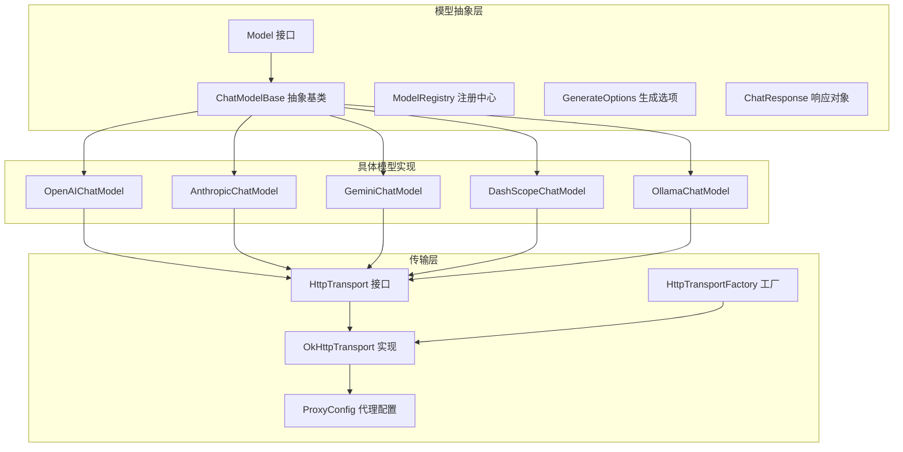
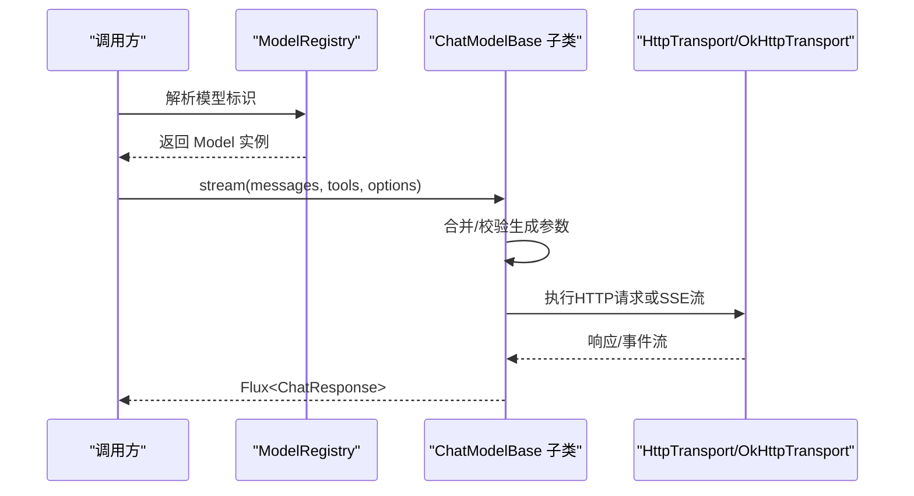
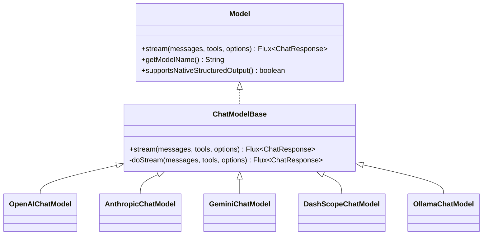
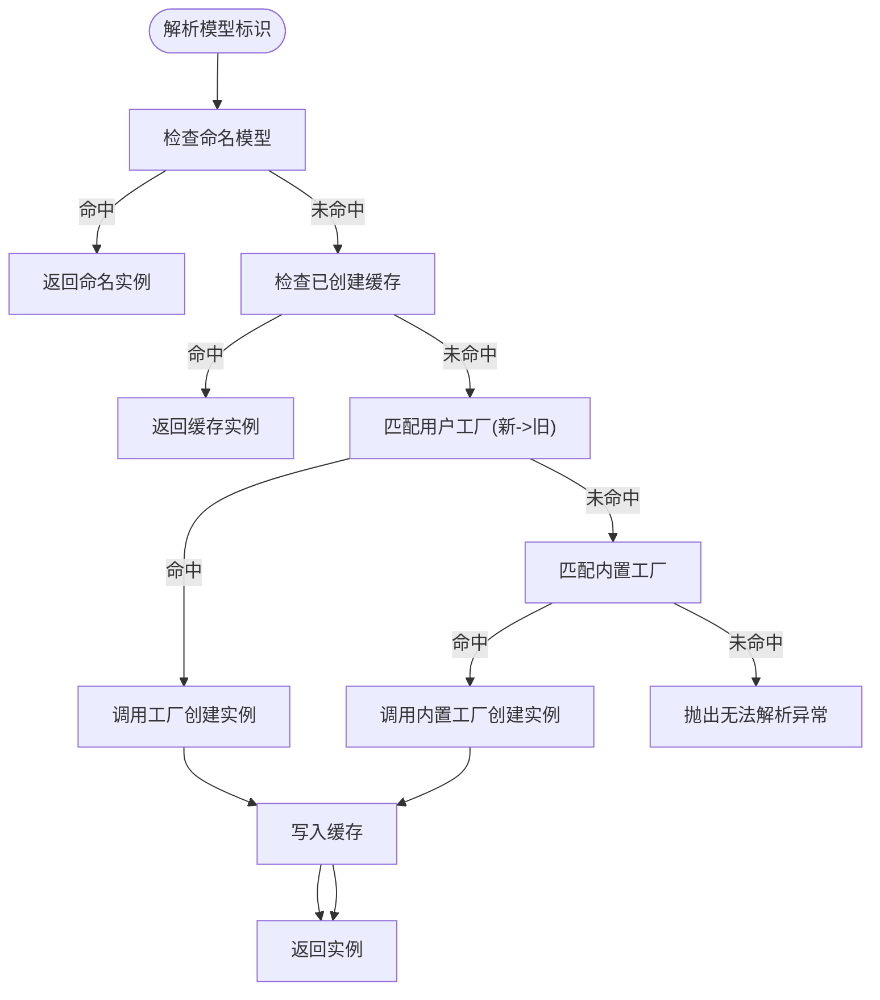
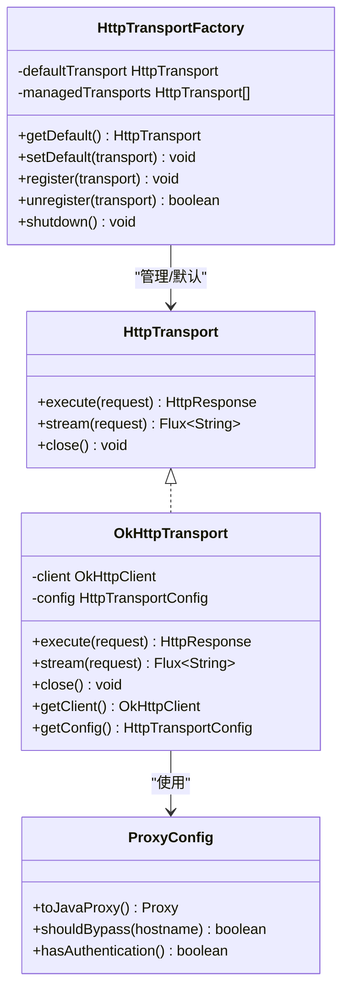
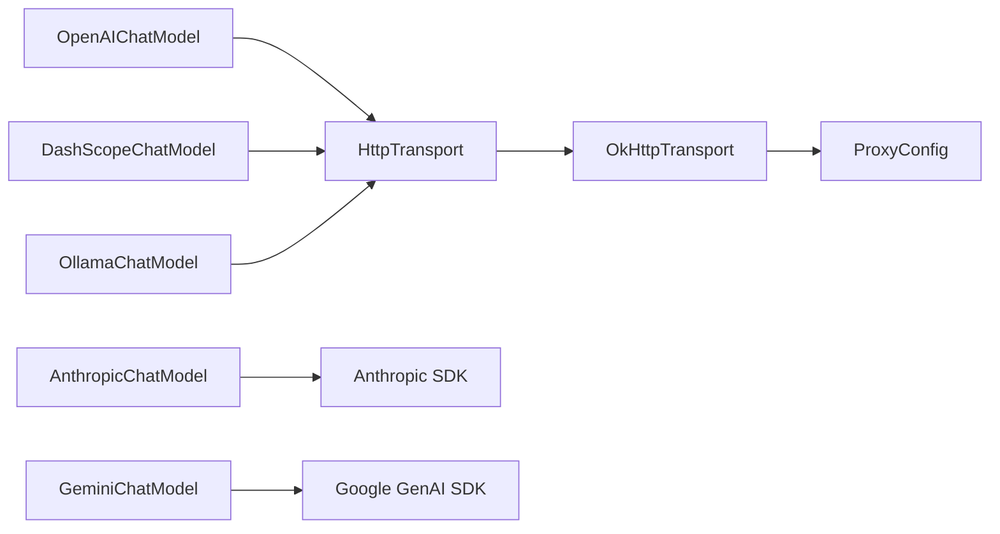

# 模型抽象

<cite>
**本文引用的文件**
- [Model.java](file://agentscope-core/src/main/java/io/agentscope/core/model/Model.java)
- [ChatModelBase.java](file://agentscope-core/src/main/java/io/agentscope/core/model/ChatModelBase.java)
- [ModelRegistry.java](file://agentscope-core/src/main/java/io/agentscope/core/model/ModelRegistry.java)
- [GenerateOptions.java](file://agentscope-core/src/main/java/io/agentscope/core/model/GenerateOptions.java)
- [ChatResponse.java](file://agentscope-core/src/main/java/io/agentscope/core/model/ChatResponse.java)
- [OpenAIChatModel.java](file://agentscope-core/src/main/java/io/agentscope/core/model/OpenAIChatModel.java)
- [AnthropicChatModel.java](file://agentscope-core/src/main/java/io/agentscope/core/model/AnthropicChatModel.java)
- [GeminiChatModel.java](file://agentscope-core/src/main/java/io/agentscope/core/model/GeminiChatModel.java)
- [DashScopeChatModel.java](file://agentscope-core/src/main/java/io/agentscope/core/model/DashScopeChatModel.java)
- [OllamaChatModel.java](file://agentscope-core/src/main/java/io/agentscope/core/model/OllamaChatModel.java)
- [HttpTransport.java](file://agentscope-core/src/main/java/io/agentscope/core/model/transport/HttpTransport.java)
- [OkHttpTransport.java](file://agentscope-core/src/main/java/io/agentscope/core/model/transport/OkHttpTransport.java)
- [HttpTransportFactory.java](file://agentscope-core/src/main/java/io/agentscope/core/model/transport/HttpTransportFactory.java)
- [ProxyConfig.java](file://agentscope-core/src/main/java/io/agentscope/core/model/transport/ProxyConfig.java)
</cite>

## 目录
1. [简介](#简介)
2. [项目结构](#项目结构)
3. [核心组件](#核心组件)
4. [架构总览](#架构总览)
5. [详细组件分析](#详细组件分析)
6. [依赖分析](#依赖分析)
7. [性能考虑](#性能考虑)
8. [故障排查指南](#故障排查指南)
9. [结论](#结论)
10. [附录](#附录)

## 简介
本文件面向AgentScope Java的“模型抽象层”，系统性阐述统一抽象设计、基类扩展机制、模型注册与发现、生成参数配置、响应处理、多提供商适配（OpenAI、Anthropic、Gemini、DashScope、Ollama）、以及传输层抽象与HTTP客户端实现。文档同时提供可操作的使用建议、最佳实践与排障指引，帮助开发者在不改变上层调用方式的前提下，灵活接入与扩展新的模型与传输能力。

## 项目结构
模型抽象层位于agentscope-core模块的io.agentscope.core.model包中，围绕统一接口Model、抽象基类ChatModelBase、注册中心ModelRegistry、生成参数GenerateOptions、响应对象ChatResponse展开；同时配套transport子包提供HTTP传输抽象与OkHttp实现，并通过工厂与代理配置支持灵活部署。

图示来源
- [Model.java:22-53](file://agentscope-core/src/main/java/io/agentscope/core/model/Model.java#L22-L53)
- [ChatModelBase.java:29-61](file://agentscope-core/src/main/java/io/agentscope/core/model/ChatModelBase.java#L29-L61)
- [ModelRegistry.java:35-261](file://agentscope-core/src/main/java/io/agentscope/core/model/ModelRegistry.java#L35-L261)
- [GenerateOptions.java:32-904](file://agentscope-core/src/main/java/io/agentscope/core/model/GenerateOptions.java#L32-L904)
- [ChatResponse.java:29-208](file://agentscope-core/src/main/java/io/agentscope/core/model/ChatResponse.java#L29-L208)
- [OpenAIChatModel.java:61-446](file://agentscope-core/src/main/java/io/agentscope/core/model/OpenAIChatModel.java#L61-L446)
- [AnthropicChatModel.java:55-350](file://agentscope-core/src/main/java/io/agentscope/core/model/AnthropicChatModel.java#L55-L350)
- [GeminiChatModel.java:57-623](file://agentscope-core/src/main/java/io/agentscope/core/model/GeminiChatModel.java#L57-L623)
- [DashScopeChatModel.java:55-683](file://agentscope-core/src/main/java/io/agentscope/core/model/DashScopeChatModel.java#L55-L683)
- [OllamaChatModel.java:56-380](file://agentscope-core/src/main/java/io/agentscope/core/model/OllamaChatModel.java#L56-L380)
- [HttpTransport.java:33-62](file://agentscope-core/src/main/java/io/agentscope/core/model/transport/HttpTransport.java#L33-L62)
- [OkHttpTransport.java:62-496](file://agentscope-core/src/main/java/io/agentscope/core/model/transport/OkHttpTransport.java#L62-L496)
- [HttpTransportFactory.java:54-193](file://agentscope-core/src/main/java/io/agentscope/core/model/transport/HttpTransportFactory.java#L54-L193)
- [ProxyConfig.java:55-440](file://agentscope-core/src/main/java/io/agentscope/core/model/transport/ProxyConfig.java#L55-L440)

章节来源
- [Model.java:22-53](file://agentscope-core/src/main/java/io/agentscope/core/model/Model.java#L22-L53)
- [ChatModelBase.java:29-61](file://agentscope-core/src/main/java/io/agentscope/core/model/ChatModelBase.java#L29-L61)
- [ModelRegistry.java:35-261](file://agentscope-core/src/main/java/io/agentscope/core/model/ModelRegistry.java#L35-L261)
- [GenerateOptions.java:32-904](file://agentscope-core/src/main/java/io/agentscope/core/model/GenerateOptions.java#L32-L904)
- [ChatResponse.java:29-208](file://agentscope-core/src/main/java/io/agentscope/core/model/ChatResponse.java#L29-L208)

## 核心组件
- 统一接口Model：定义流式对话生成、模型名与原生结构化输出能力声明。
- 抽象基类ChatModelBase：封装通用调用流程与遥测追踪，子类仅需实现doStream。
- 注册中心ModelRegistry：命名模型注册、用户工厂与内置工厂解析、缓存与错误提示。
- 生成参数GenerateOptions：请求级与连接级参数、合并策略、执行配置、结构化输出格式。
- 响应对象ChatResponse：不可变响应载体，含内容块、用量、元数据与结束原因。
- 传输层HttpTransport与OkHttpTransport：抽象HTTP调用与SSE流，工厂管理生命周期，代理配置支持多种类型与绕过规则。

章节来源
- [Model.java:22-53](file://agentscope-core/src/main/java/io/agentscope/core/model/Model.java#L22-L53)
- [ChatModelBase.java:29-61](file://agentscope-core/src/main/java/io/agentscope/core/model/ChatModelBase.java#L29-L61)
- [ModelRegistry.java:35-261](file://agentscope-core/src/main/java/io/agentscope/core/model/ModelRegistry.java#L35-L261)
- [GenerateOptions.java:32-904](file://agentscope-core/src/main/java/io/agentscope/core/model/GenerateOptions.java#L32-L904)
- [ChatResponse.java:29-208](file://agentscope-core/src/main/java/io/agentscope/core/model/ChatResponse.java#L29-L208)
- [HttpTransport.java:33-62](file://agentscope-core/src/main/java/io/agentscope/core/model/transport/HttpTransport.java#L33-L62)
- [OkHttpTransport.java:62-496](file://agentscope-core/src/main/java/io/agentscope/core/model/transport/OkHttpTransport.java#L62-L496)
- [HttpTransportFactory.java:54-193](file://agentscope-core/src/main/java/io/agentscope/core/model/transport/HttpTransportFactory.java#L54-L193)
- [ProxyConfig.java:55-440](file://agentscope-core/src/main/java/io/agentscope/core/model/transport/ProxyConfig.java#L55-L440)

## 架构总览
下图展示了从调用方到各模型实现与传输层的整体交互路径，体现统一抽象与可替换性。

图示来源
- [ModelRegistry.java:142-173](file://agentscope-core/src/main/java/io/agentscope/core/model/ModelRegistry.java#L142-L173)
- [ChatModelBase.java:42-48](file://agentscope-core/src/main/java/io/agentscope/core/model/ChatModelBase.java#L42-L48)
- [HttpTransport.java:42-54](file://agentscope-core/src/main/java/io/agentscope/core/model/transport/HttpTransport.java#L42-L54)

## 详细组件分析

### Model接口与ChatModelBase基类
- Model接口：定义流式生成、模型名与原生结构化输出能力，默认方法可被具体模型覆盖。
- ChatModelBase：统一拦截与追踪，内部委托doStream给子类实现，确保一致的生命周期与可观测性。

图示来源
- [Model.java:22-53](file://agentscope-core/src/main/java/io/agentscope/core/model/Model.java#L22-L53)
- [ChatModelBase.java:29-61](file://agentscope-core/src/main/java/io/agentscope/core/model/ChatModelBase.java#L29-L61)
- [OpenAIChatModel.java:61-446](file://agentscope-core/src/main/java/io/agentscope/core/model/OpenAIChatModel.java#L61-L446)
- [AnthropicChatModel.java:55-350](file://agentscope-core/src/main/java/io/agentscope/core/model/AnthropicChatModel.java#L55-L350)
- [GeminiChatModel.java:57-623](file://agentscope-core/src/main/java/io/agentscope/core/model/GeminiChatModel.java#L57-L623)
- [DashScopeChatModel.java:55-683](file://agentscope-core/src/main/java/io/agentscope/core/model/DashScopeChatModel.java#L55-L683)
- [OllamaChatModel.java:56-380](file://agentscope-core/src/main/java/io/agentscope/core/model/OllamaChatModel.java#L56-L380)

章节来源
- [Model.java:22-53](file://agentscope-core/src/main/java/io/agentscope/core/model/Model.java#L22-L53)
- [ChatModelBase.java:29-61](file://agentscope-core/src/main/java/io/agentscope/core/model/ChatModelBase.java#L29-L61)

### ModelRegistry：模型注册与发现
- 支持命名模型注册与优先解析。
- 用户工厂优先于内置工厂，按注册顺序倒序匹配。
- 内置工厂覆盖openai、dashscope/qwen、anthropic、gemini、ollama，自动读取环境变量。
- 提供canResolve与reset，便于测试与动态重置。

图示来源
- [ModelRegistry.java:142-173](file://agentscope-core/src/main/java/io/agentscope/core/model/ModelRegistry.java#L142-L173)
- [ModelRegistry.java:214-226](file://agentscope-core/src/main/java/io/agentscope/core/model/ModelRegistry.java#L214-L226)
- [ModelRegistry.java:244-259](file://agentscope-core/src/main/java/io/agentscope/core/model/ModelRegistry.java#L244-L259)

章节来源
- [ModelRegistry.java:35-261](file://agentscope-core/src/main/java/io/agentscope/core/model/ModelRegistry.java#L35-L261)

### GenerateOptions：生成参数配置
- 连接级：apiKey、baseUrl、endpointPath、modelName、stream。
- 生成参数：temperature、topP、maxTokens、maxCompletionTokens、频率/存在惩罚、思考预算、推理努力、seed、cacheControl、parallelToolCalls、toolChoice、responseFormat、附加头/体/查询参数。
- 执行配置：超时、重试次数、退避策略、错误过滤。
- 合并策略：逐字段优先级，Map类型采用主次合并。
- 结构化输出：通过responseFormat支持原生结构化输出。

章节来源
- [GenerateOptions.java:32-904](file://agentscope-core/src/main/java/io/agentscope/core/model/GenerateOptions.java#L32-L904)

### ChatResponse：响应处理
- 不可变数据类，包含id、内容块列表、用量、元数据、结束原因。
- Builder支持自动填充id（如提供方未返回）。
- 与Formatter配合解析各提供商响应。

章节来源
- [ChatResponse.java:29-208](file://agentscope-core/src/main/java/io/agentscope/core/model/ChatResponse.java#L29-L208)

### 传输层抽象与HTTP客户端
- HttpTransport：同步执行与SSE流式接口，负责生命周期关闭。
- OkHttpTransport：基于OkHttp实现，支持连接池、超时、可选忽略SSL、代理（HTTP/SOCKS、认证、非代理主机）、NDJSON与SSE解析。
- HttpTransportFactory：默认单例懒加载、注册管理、JVM关闭钩子清理。
- ProxyConfig：统一代理配置，支持HTTP/SOCKS、认证、通配模式非代理主机匹配。

图示来源
- [HttpTransport.java:33-62](file://agentscope-core/src/main/java/io/agentscope/core/model/transport/HttpTransport.java#L33-L62)
- [OkHttpTransport.java:62-496](file://agentscope-core/src/main/java/io/agentscope/core/model/transport/OkHttpTransport.java#L62-L496)
- [HttpTransportFactory.java:54-193](file://agentscope-core/src/main/java/io/agentscope/core/model/transport/HttpTransportFactory.java#L54-L193)
- [ProxyConfig.java:55-440](file://agentscope-core/src/main/java/io/agentscope/core/model/transport/ProxyConfig.java#L55-L440)

章节来源
- [HttpTransport.java:33-62](file://agentscope-core/src/main/java/io/agentscope/core/model/transport/HttpTransport.java#L33-L62)
- [OkHttpTransport.java:62-496](file://agentscope-core/src/main/java/io/agentscope/core/model/transport/OkHttpTransport.java#L62-L496)
- [HttpTransportFactory.java:54-193](file://agentscope-core/src/main/java/io/agentscope/core/model/transport/HttpTransportFactory.java#L54-L193)
- [ProxyConfig.java:55-440](file://agentscope-core/src/main/java/io/agentscope/core/model/transport/ProxyConfig.java#L55-L440)

### OpenAI适配：OpenAIChatModel
- 使用OpenAI兼容API，支持工具调用、消息格式转换、流式/非流式、超时与重试。
- 支持原生结构化输出。
- Builder支持API Key、模型名、流式开关、默认选项、基础URL、端点路径、Formatter、HTTP传输与代理。

章节来源
- [OpenAIChatModel.java:61-446](file://agentscope-core/src/main/java/io/agentscope/core/model/OpenAIChatModel.java#L61-L446)

### Anthropic适配：AnthropicChatModel
- 基于官方Anthropic Java SDK，支持Claude系列模型、工具调用、流式/非流式、代理配置。
- Builder支持基础URL、API Key、模型名、流式开关、默认选项、Formatter与代理。

章节来源
- [AnthropicChatModel.java:55-350](file://agentscope-core/src/main/java/io/agentscope/core/model/AnthropicChatModel.java#L55-L350)

### Gemini适配：GeminiChatModel
- 基于官方Google GenAI Java SDK，支持文本/多模态、工具调用、思维模式、Vertex AI与Gemini API切换。
- Builder支持API Key、基础URL、模型名、流式开关、项目/区域、Vertex AI开关、HTTP与客户端选项、默认选项、Formatter与代理。
- 代理智能合并：若已有ClientOptions且含代理，则优先保留其代理设置并告警。

章节来源
- [GeminiChatModel.java:57-623](file://agentscope-core/src/main/java/io/agentscope/core/model/GeminiChatModel.java#L57-L623)

### DashScope适配：DashScopeChatModel
- 原生HTTP客户端，支持文本/视觉模型自动路由、思维模式、搜索增强、加密请求（RSA公钥拉取与AES-GCM）。
- Builder支持API Key、模型名、流式开关、思维/搜索开关、端点类型、默认选项、基础URL、Formatter、HTTP传输、代理与加密。

章节来源
- [DashScopeChatModel.java:55-683](file://agentscope-core/src/main/java/io/agentscope/core/model/DashScopeChatModel.java#L55-L683)

### Ollama适配：OllamaChatModel
- 面向本地Ollama实例，支持工具调用、流式/非流式、Ollama专用选项与AgentScope选项互转。
- Builder支持模型名、基础URL、默认选项、Formatter、HTTP传输与代理。

章节来源
- [OllamaChatModel.java:56-380](file://agentscope-core/src/main/java/io/agentscope/core/model/OllamaChatModel.java#L56-L380)

## 依赖分析
- 耦合与内聚：各模型实现均继承自ChatModelBase，共享统一调用与追踪逻辑；传输层通过接口解耦，便于替换与扩展。
- 外部依赖：OpenAI、Anthropic、Google GenAI、OkHttp等第三方库；通过Formatter与HTTP客户端隔离差异。
- 可能的循环依赖：当前结构以接口与工厂为主，未见直接循环导入。

图示来源
- [OpenAIChatModel.java:61-446](file://agentscope-core/src/main/java/io/agentscope/core/model/OpenAIChatModel.java#L61-L446)
- [AnthropicChatModel.java:55-350](file://agentscope-core/src/main/java/io/agentscope/core/model/AnthropicChatModel.java#L55-L350)
- [GeminiChatModel.java:57-623](file://agentscope-core/src/main/java/io/agentscope/core/model/GeminiChatModel.java#L57-L623)
- [DashScopeChatModel.java:55-683](file://agentscope-core/src/main/java/io/agentscope/core/model/DashScopeChatModel.java#L55-L683)
- [OllamaChatModel.java:56-380](file://agentscope-core/src/main/java/io/agentscope/core/model/OllamaChatModel.java#L56-L380)
- [HttpTransport.java:33-62](file://agentscope-core/src/main/java/io/agentscope/core/model/transport/HttpTransport.java#L33-L62)
- [OkHttpTransport.java:62-496](file://agentscope-core/src/main/java/io/agentscope/core/model/transport/OkHttpTransport.java#L62-L496)
- [ProxyConfig.java:55-440](file://agentscope-core/src/main/java/io/agentscope/core/model/transport/ProxyConfig.java#L55-L440)

章节来源
- [OpenAIChatModel.java:61-446](file://agentscope-core/src/main/java/io/agentscope/core/model/OpenAIChatModel.java#L61-L446)
- [AnthropicChatModel.java:55-350](file://agentscope-core/src/main/java/io/agentscope/core/model/AnthropicChatModel.java#L55-L350)
- [GeminiChatModel.java:57-623](file://agentscope-core/src/main/java/io/agentscope/core/model/GeminiChatModel.java#L57-L623)
- [DashScopeChatModel.java:55-683](file://agentscope-core/src/main/java/io/agentscope/core/model/DashScopeChatModel.java#L55-L683)
- [OllamaChatModel.java:56-380](file://agentscope-core/src/main/java/io/agentscope/core/model/OllamaChatModel.java#L56-L380)

## 性能考虑
- 连接复用与池化：OkHttpTransport使用连接池与可配置超时，减少握手开销。
- 流式响应：优先使用流式以降低首字节延迟与内存占用。
- 缓存控制：启用cacheControl可利用支持方的提示缓存，降低重复请求成本。
- 代理与网络：合理配置代理与非代理主机，避免不必要的转发。
- 超时与重试：通过ExecutionConfig统一配置，结合指数退避与错误过滤，提升稳定性。

## 故障排查指南
- 模型解析失败：检查命名模型是否注册、正则工厂是否匹配、内置前缀是否正确、环境变量是否齐全。
- 认证错误：核对API Key、基础URL、端点路径；确认代理认证信息正确。
- 传输异常：查看OkHttpTransport日志与状态码，确认SSL策略、代理认证与非代理主机配置。
- 响应解析：确认Formatter与模型版本兼容，检查responseFormat与工具schema一致性。
- 资源泄漏：确保HttpTransportFactory在JVM关闭时统一关闭，或手动调用shutdown。

章节来源
- [ModelRegistry.java:244-259](file://agentscope-core/src/main/java/io/agentscope/core/model/ModelRegistry.java#L244-L259)
- [OkHttpTransport.java:202-308](file://agentscope-core/src/main/java/io/agentscope/core/model/transport/OkHttpTransport.java#L202-L308)
- [HttpTransportFactory.java:154-168](file://agentscope-core/src/main/java/io/agentscope/core/model/transport/HttpTransportFactory.java#L154-L168)

## 结论
AgentScope Java的模型抽象层通过统一接口、抽象基类与注册中心实现了跨提供商的一致体验；借助传输层抽象与HTTP客户端，既保证了灵活性又兼顾了性能与可靠性。开发者可通过GenerateOptions与ChatResponse进行参数与结果的标准化处理，通过ModelRegistry与各模型实现快速集成与扩展。

## 附录

### 使用示例（路径参考）
- 注册自定义模型
  - [ModelRegistry.java:114-118](file://agentscope-core/src/main/java/io/agentscope/core/model/ModelRegistry.java#L114-L118)
  - [ModelRegistry.java:129-134](file://agentscope-core/src/main/java/io/agentscope/core/model/ModelRegistry.java#L129-L134)
- 配置生成参数
  - [GenerateOptions.java:392-402](file://agentscope-core/src/main/java/io/agentscope/core/model/GenerateOptions.java#L392-L402)
  - [GenerateOptions.java:439-502](file://agentscope-core/src/main/java/io/agentscope/core/model/GenerateOptions.java#L439-L502)
- 处理流式响应
  - [OpenAIChatModel.java:156-182](file://agentscope-core/src/main/java/io/agentscope/core/model/OpenAIChatModel.java#L156-L182)
  - [DashScopeChatModel.java:286-318](file://agentscope-core/src/main/java/io/agentscope/core/model/DashScopeChatModel.java#L286-L318)
- 传输层与代理
  - [HttpTransportFactory.java:80-91](file://agentscope-core/src/main/java/io/agentscope/core/model/transport/HttpTransportFactory.java#L80-L91)
  - [ProxyConfig.java:55-440](file://agentscope-core/src/main/java/io/agentscope/core/model/transport/ProxyConfig.java#L55-L440)
  - [OkHttpTransport.java:130-156](file://agentscope-core/src/main/java/io/agentscope/core/model/transport/OkHttpTransport.java#L130-L156)