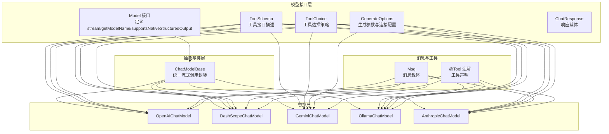
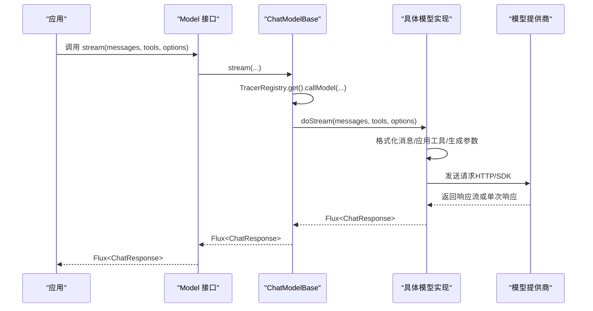
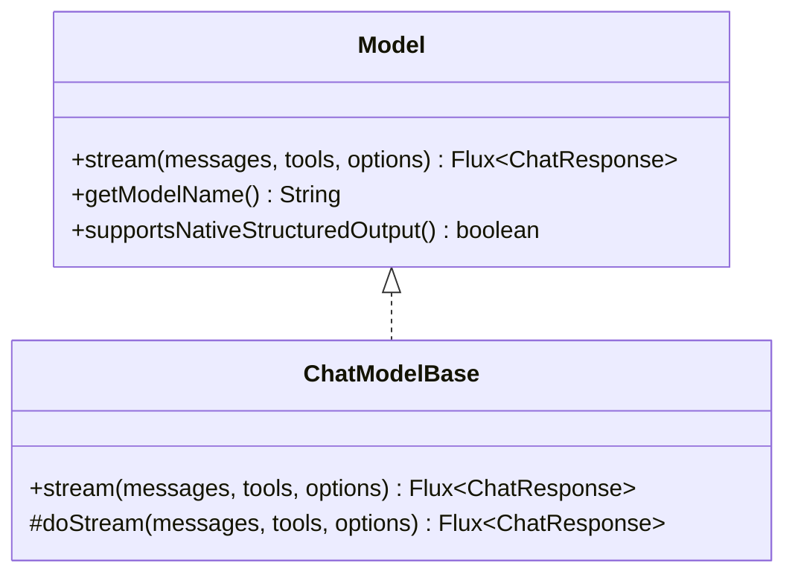
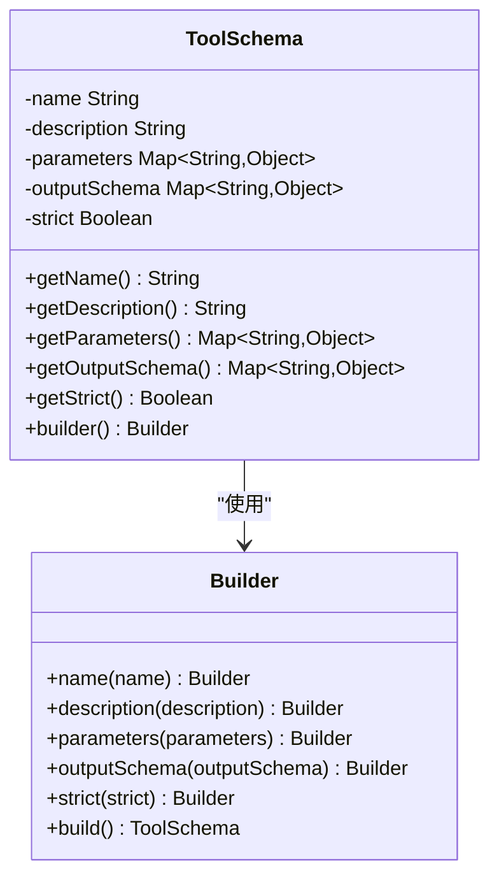
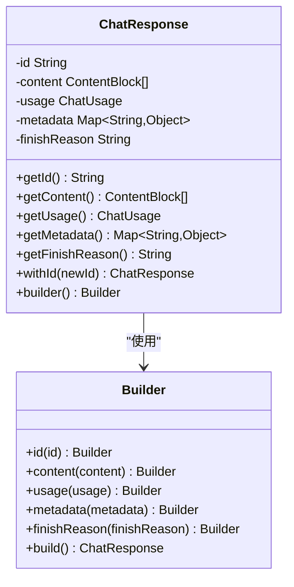
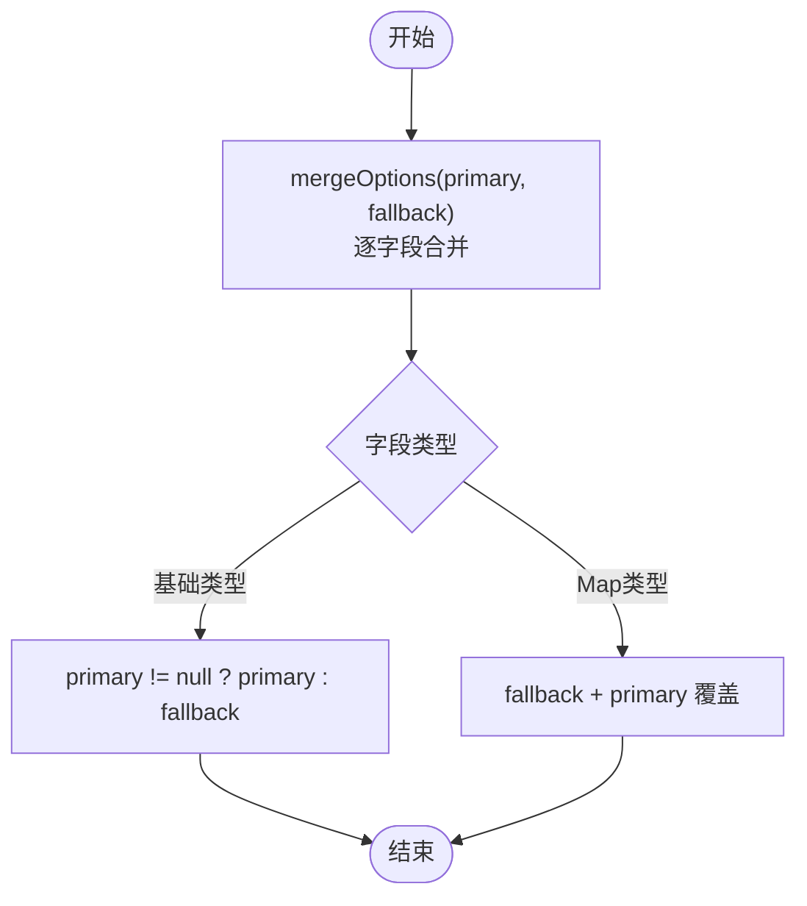
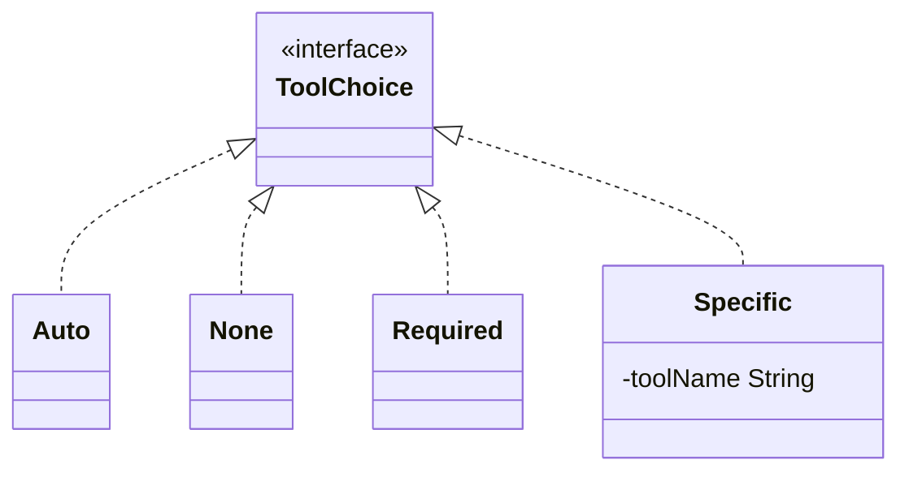
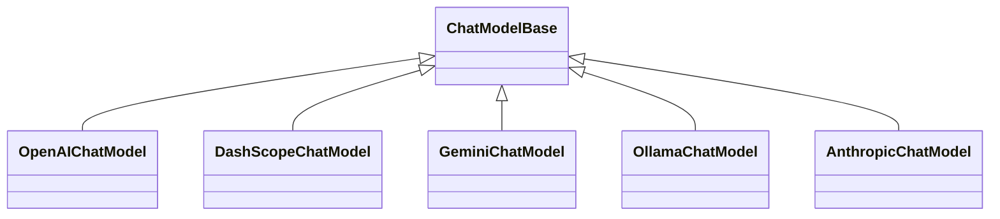
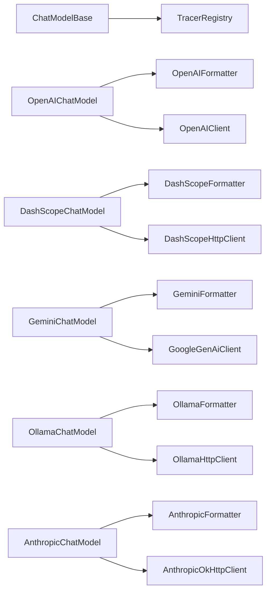

# 模型接口设计

<cite>
**本文档引用的文件**
- [Model.java](file://agentscope-core/src/main/java/io/agentscope/core/model/Model.java)
- [ChatModelBase.java](file://agentscope-core/src/main/java/io/agentscope/core/model/ChatModelBase.java)
- [ToolSchema.java](file://agentscope-core/src/main/java/io/agentscope/core/model/ToolSchema.java)
- [ChatResponse.java](file://agentscope-core/src/main/java/io/agentscope/core/model/ChatResponse.java)
- [GenerateOptions.java](file://agentscope-core/src/main/java/io/agentscope/core/model/GenerateOptions.java)
- [OpenAIChatModel.java](file://agentscope-core/src/main/java/io/agentscope/core/model/OpenAIChatModel.java)
- [DashScopeChatModel.java](file://agentscope-core/src/main/java/io/agentscope/core/model/DashScopeChatModel.java)
- [GeminiChatModel.java](file://agentscope-core/src/main/java/io/agentscope/core/model/GeminiChatModel.java)
- [OllamaChatModel.java](file://agentscope-core/src/main/java/io/agentscope/core/model/OllamaChatModel.java)
- [AnthropicChatModel.java](file://agentscope-core/src/main/java/io/agentscope/core/model/AnthropicChatModel.java)
- [ModelUtils.java](file://agentscope-core/src/main/java/io/agentscope/core/model/ModelUtils.java)
- [ToolChoice.java](file://agentscope-core/src/main/java/io/agentscope/core/model/ToolChoice.java)
- [Msg.java](file://agentscope-core/src/main/java/io/agentscope/core/message/Msg.java)
- [Tool.java](file://agentscope-core/src/main/java/io/agentscope/core/tool/Tool.java)
</cite>

## 目录
1. [简介](#简介)
2. [项目结构](#项目结构)
3. [核心组件](#核心组件)
4. [架构概览](#架构概览)
5. [详细组件分析](#详细组件分析)
6. [依赖分析](#依赖分析)
7. [性能考虑](#性能考虑)
8. [故障排除指南](#故障排除指南)
9. [结论](#结论)
10. [附录：最佳实践与扩展指南](#附录最佳实践与扩展指南)

## 简介
本文件系统性阐述 AgentScope Java 的模型接口设计，围绕 Model 接口的统一抽象、ChatModelBase 基类的功能特性、ToolSchema 的作用与结构，以及与模型接口的关系进行深入解析。重点覆盖以下主题：
- stream 方法的流式响应处理机制与背压控制
- getModelName 的标识管理策略
- supportsNativeStructuredOutput 的原生结构化输出支持
- ChatModelBase 的消息格式化、工具集成与默认实现策略
- ToolSchema 的不可变数据结构与构建器模式
- 典型模型实现（OpenAI、DashScope、Gemini、Ollama、Anthropic）的接口适配
- 自定义模型接口实现的示例路径、错误处理与性能优化建议

## 项目结构
AgentScope 的模型层位于 agentscope-core 模块的 io.agentscope.core.model 包中，采用“接口 + 抽象基类 + 多供应商实现”的分层设计：
- 接口层：Model 定义统一的模型调用契约
- 基类层：ChatModelBase 提供通用的流式调用封装与追踪能力
- 实现层：各主流大模型提供商的 ChatModel 实现
- 工具层：ToolSchema 描述工具接口，配合 ToolChoice 控制工具使用策略
- 数据层：ChatResponse、GenerateOptions、Msg 等承载请求/响应与消息语义

图表来源
- [Model.java:22-53](file://agentscope-core/src/main/java/io/agentscope/core/model/Model.java#L22-L53)
- [ChatModelBase.java:29-61](file://agentscope-core/src/main/java/io/agentscope/core/model/ChatModelBase.java#L29-L61)
- [OpenAIChatModel.java:61-446](file://agentscope-core/src/main/java/io/agentscope/core/model/OpenAIChatModel.java#L61-L446)
- [DashScopeChatModel.java:55-683](file://agentscope-core/src/main/java/io/agentscope/core/model/DashScopeChatModel.java#L55-L683)
- [GeminiChatModel.java:57-623](file://agentscope-core/src/main/java/io/agentscope/core/model/GeminiChatModel.java#L57-L623)
- [OllamaChatModel.java:56-380](file://agentscope-core/src/main/java/io/agentscope/core/model/OllamaChatModel.java#L56-L380)
- [AnthropicChatModel.java:55-350](file://agentscope-core/src/main/java/io/agentscope/core/model/AnthropicChatModel.java#L55-L350)
- [ToolSchema.java:28-183](file://agentscope-core/src/main/java/io/agentscope/core/model/ToolSchema.java#L28-L183)
- [ToolChoice.java:45-85](file://agentscope-core/src/main/java/io/agentscope/core/model/ToolChoice.java#L45-L85)
- [GenerateOptions.java:32-904](file://agentscope-core/src/main/java/io/agentscope/core/model/GenerateOptions.java#L32-L904)
- [ChatResponse.java:29-208](file://agentscope-core/src/main/java/io/agentscope/core/model/ChatResponse.java#L29-L208)
- [Msg.java:67-843](file://agentscope-core/src/main/java/io/agentscope/core/message/Msg.java#L67-L843)
- [Tool.java:60-194](file://agentscope-core/src/main/java/io/agentscope/core/tool/Tool.java#L60-L194)

章节来源
- [Model.java:22-53](file://agentscope-core/src/main/java/io/agentscope/core/model/Model.java#L22-L53)
- [ChatModelBase.java:29-61](file://agentscope-core/src/main/java/io/agentscope/core/model/ChatModelBase.java#L29-L61)

## 核心组件
本节聚焦模型接口设计的关键构件及其职责边界。

- Model 接口
  - 统一抽象：定义 stream(List<Msg>, List<ToolSchema>, GenerateOptions) 返回 Flux<ChatResponse>，确保所有模型实现具备一致的流式调用入口
  - 身份识别：getModelName 提供模型名称，便于日志与追踪
  - 结构化输出：supportsNativeStructuredOutput 支持原生结构化输出（JSON Schema），避免合成工具注入

- ChatModelBase 抽象类
  - 流式封装：在 doStream 抽象方法中实现具体模型的调用逻辑；stream 方法通过 TracerRegistry 统一追踪
  - 默认行为：提供 final stream 方法，子类仅需实现 doStream 即可获得统一的追踪与生命周期管理

- ToolSchema 工具描述
  - 不可变数据结构：使用 Builder 模式构造，字段包含 name/description/parameters/outputSchema/strict
  - JSON Schema：parameters 与 outputSchema 以 Map<String,Object> 表达，兼容不同模型的参数校验与结果约束

- ChatResponse 响应载体
  - 不可变对象：包含 id/content/usage/metadata/finishReason
  - 构建器：支持 withId 等派生实例，便于稳定 id 传播（如 Ollama）

- GenerateOptions 生成参数
  - 连接级配置：apiKey/baseUrl/endpointPath/modelName/stream
  - 生成级参数：temperature/topP/maxTokens/…/parallelToolCalls/responseFormat
  - 合并策略：mergeOptions 支持主次优先级合并，便于默认值与请求级选项叠加

- ToolChoice 工具选择策略
  - sealed 接口：Auto/None/Required/Specific 四种模式，Specific 需校验非空工具名
  - 与模型集成：通过 formatter.applyToolChoice 应用到不同提供商的请求体

章节来源
- [Model.java:22-53](file://agentscope-core/src/main/java/io/agentscope/core/model/Model.java#L22-L53)
- [ChatModelBase.java:29-61](file://agentscope-core/src/main/java/io/agentscope/core/model/ChatModelBase.java#L29-L61)
- [ToolSchema.java:28-183](file://agentscope-core/src/main/java/io/agentscope/core/model/ToolSchema.java#L28-L183)
- [ChatResponse.java:29-208](file://agentscope-core/src/main/java/io/agentscope/core/model/ChatResponse.java#L29-L208)
- [GenerateOptions.java:32-904](file://agentscope-core/src/main/java/io/agentscope/core/model/GenerateOptions.java#L32-L904)
- [ToolChoice.java:45-85](file://agentscope-core/src/main/java/io/agentscope/core/model/ToolChoice.java#L45-L85)

## 架构概览
下图展示了从应用层到各模型实现的数据流与控制流：

图表来源
- [ChatModelBase.java:42-61](file://agentscope-core/src/main/java/io/agentscope/core/model/ChatModelBase.java#L42-L61)
- [OpenAIChatModel.java:85-182](file://agentscope-core/src/main/java/io/agentscope/core/model/OpenAIChatModel.java#L85-L182)
- [DashScopeChatModel.java:197-318](file://agentscope-core/src/main/java/io/agentscope/core/model/DashScopeChatModel.java#L197-L318)
- [GeminiChatModel.java:226-313](file://agentscope-core/src/main/java/io/agentscope/core/model/GeminiChatModel.java#L226-L313)
- [OllamaChatModel.java:138-236](file://agentscope-core/src/main/java/io/agentscope/core/model/OllamaChatModel.java#L138-L236)
- [AnthropicChatModel.java:134-221](file://agentscope-core/src/main/java/io/agentscope/core/model/AnthropicChatModel.java#L134-L221)

## 详细组件分析

### Model 接口与 ChatModelBase 基类
- 设计理念
  - 统一抽象：通过 Model 接口屏蔽不同提供商的差异，保证上层调用一致性
  - 可扩展性：ChatModelBase 将通用逻辑（追踪、超时重试、默认选项）下沉，子类仅关注协议转换与调用细节
- 关键方法
  - stream：返回响应流，内部由 TracerRegistry 统一追踪
  - getModelName：用于日志与标识
  - supportsNativeStructuredOutput：是否支持原生结构化输出（默认 false，部分实现覆写为 true）

图表来源
- [Model.java:22-53](file://agentscope-core/src/main/java/io/agentscope/core/model/Model.java#L22-L53)
- [ChatModelBase.java:29-61](file://agentscope-core/src/main/java/io/agentscope/core/model/ChatModelBase.java#L29-L61)

章节来源
- [Model.java:22-53](file://agentscope-core/src/main/java/io/agentscope/core/model/Model.java#L22-L53)
- [ChatModelBase.java:29-61](file://agentscope-core/src/main/java/io/agentscope/core/model/ChatModelBase.java#L29-L61)

### ToolSchema：工具接口描述
- 不可变性与线程安全：字段以不可变 Map 形式存储，避免并发修改
- JSON Schema 支持：parameters 与 outputSchema 作为 Map<String,Object>，便于不同模型的参数校验与结果约束
- 构建器模式：链式设置 name/description/parameters/outputSchema/strict，提升可读性与易用性

图表来源
- [ToolSchema.java:28-183](file://agentscope-core/src/main/java/io/agentscope/core/model/ToolSchema.java#L28-L183)

章节来源
- [ToolSchema.java:28-183](file://agentscope-core/src/main/java/io/agentscope/core/model/ToolSchema.java#L28-L183)

### ChatResponse：响应载体
- 不可变对象：确保并发安全与可预测性
- 扩展能力：withId 支持稳定 id 传播，满足特定提供商（如 Ollama）的 id 合并需求
- 元数据：metadata 与 finishReason 保留模型侧信息，便于后续处理与统计

图表来源
- [ChatResponse.java:29-208](file://agentscope-core/src/main/java/io/agentscope/core/model/ChatResponse.java#L29-L208)

章节来源
- [ChatResponse.java:29-208](file://agentscope-core/src/main/java/io/agentscope/core/model/ChatResponse.java#L29-L208)

### GenerateOptions：生成参数与连接配置
- 分层设计：连接级（apiKey/baseUrl/endpointPath/modelName/stream）与生成级（temperature/topP/…/responseFormat）分离
- 合并策略：mergeOptions 支持主次优先级合并，便于默认值与请求级选项叠加
- 执行配置：ExecutionConfig 支持超时与重试，配合 ModelUtils.applyTimeoutAndRetry 统一增强

图表来源
- [GenerateOptions.java:439-516](file://agentscope-core/src/main/java/io/agentscope/core/model/GenerateOptions.java#L439-L516)

章节来源
- [GenerateOptions.java:32-904](file://agentscope-core/src/main/java/io/agentscope/core/model/GenerateOptions.java#L32-L904)

### ToolChoice：工具选择策略
- sealed 接口：Auto/None/Required/Specific 四种模式
- 兼容性：Specific 构造器校验工具名非空，避免运行期错误
- 集成点：各模型实现通过 formatter.applyToolChoice 应用到请求体

图表来源
- [ToolChoice.java:45-85](file://agentscope-core/src/main/java/io/agentscope/core/model/ToolChoice.java#L45-L85)

章节来源
- [ToolChoice.java:45-85](file://agentscope-core/src/main/java/io/agentscope/core/model/ToolChoice.java#L45-L85)

### 具体模型实现对比
- OpenAIChatModel
  - 特性：支持原生结构化输出（supportsNativeStructuredOutput 返回 true）、工具调用、缓存控制、超时重试
  - 流式处理：基于 OpenAI HTTP API，支持 stream 与非流式两种模式
- DashScopeChatModel
  - 特性：自动端点路由（文本/多模态）、思维模式（thinking）、搜索增强、缓存控制、超时重试
  - 流式处理：根据端点类型选择文本或多模态 API
- GeminiChatModel
  - 特性：官方 SDK 集成、多代理对话、视觉能力、思维模式、工具调用
  - 流式处理：基于 ResponseStream，支持关闭资源
- OllamaChatModel
  - 特性：本地 Ollama 实例集成、OllamaOptions 与 GenerateOptions 双通道、稳定 id 合并
  - 流式处理：HTTP API，支持流式与非流式
- AnthropicChatModel
  - 特性：官方 SDK 集成、思维模式、工具调用、系统消息特殊处理
  - 流式处理：基于 SDK StreamResponse，支持关闭资源

图表来源
- [OpenAIChatModel.java:61-446](file://agentscope-core/src/main/java/io/agentscope/core/model/OpenAIChatModel.java#L61-L446)
- [DashScopeChatModel.java:55-683](file://agentscope-core/src/main/java/io/agentscope/core/model/DashScopeChatModel.java#L55-L683)
- [GeminiChatModel.java:57-623](file://agentscope-core/src/main/java/io/agentscope/core/model/GeminiChatModel.java#L57-L623)
- [OllamaChatModel.java:56-380](file://agentscope-core/src/main/java/io/agentscope/core/model/OllamaChatModel.java#L56-L380)
- [AnthropicChatModel.java:55-350](file://agentscope-core/src/main/java/io/agentscope/core/model/AnthropicChatModel.java#L55-L350)

章节来源
- [OpenAIChatModel.java:61-446](file://agentscope-core/src/main/java/io/agentscope/core/model/OpenAIChatModel.java#L61-L446)
- [DashScopeChatModel.java:55-683](file://agentscope-core/src/main/java/io/agentscope/core/model/DashScopeChatModel.java#L55-L683)
- [GeminiChatModel.java:57-623](file://agentscope-core/src/main/java/io/agentscope/core/model/GeminiChatModel.java#L57-L623)
- [OllamaChatModel.java:56-380](file://agentscope-core/src/main/java/io/agentscope/core/model/OllamaChatModel.java#L56-L380)
- [AnthropicChatModel.java:55-350](file://agentscope-core/src/main/java/io/agentscope/core/model/AnthropicChatModel.java#L55-L350)

## 依赖分析
- 组件耦合
  - ChatModelBase 对 TracerRegistry 存在调用依赖，但不持有具体实现，降低耦合度
  - 各模型实现依赖对应的 Formatter（消息格式化）与 HTTP 客户端/SDK
- 外部依赖
  - Reactor（Flux/Publisher）用于响应流式处理
  - 各模型 SDK（OpenAI、DashScope、Gemini、Anthropic）用于直接调用
- 循环依赖
  - 未发现循环导入；接口与实现分层清晰

图表来源
- [ChatModelBase.java:45-47](file://agentscope-core/src/main/java/io/agentscope/core/model/ChatModelBase.java#L45-L47)
- [OpenAIChatModel.java:65-83](file://agentscope-core/src/main/java/io/agentscope/core/model/OpenAIChatModel.java#L65-L83)
- [DashScopeChatModel.java:65-68](file://agentscope-core/src/main/java/io/agentscope/core/model/DashScopeChatModel.java#L65-L68)
- [GeminiChatModel.java:70-73](file://agentscope-core/src/main/java/io/agentscope/core/model/GeminiChatModel.java#L70-L73)
- [OllamaChatModel.java:60-62](file://agentscope-core/src/main/java/io/agentscope/core/model/OllamaChatModel.java#L60-L62)
- [AnthropicChatModel.java:63-65](file://agentscope-core/src/main/java/io/agentscope/core/model/AnthropicChatModel.java#L63-L65)

章节来源
- [ChatModelBase.java:45-47](file://agentscope-core/src/main/java/io/agentscope/core/model/ChatModelBase.java#L45-L47)
- [OpenAIChatModel.java:65-83](file://agentscope-core/src/main/java/io/agentscope/core/model/OpenAIChatModel.java#L65-L83)
- [DashScopeChatModel.java:65-68](file://agentscope-core/src/main/java/io/agentscope/core/model/DashScopeChatModel.java#L65-L68)
- [GeminiChatModel.java:70-73](file://agentscope-core/src/main/java/io/agentscope/core/model/GeminiChatModel.java#L70-L73)
- [OllamaChatModel.java:60-62](file://agentscope-core/src/main/java/io/agentscope/core/model/OllamaChatModel.java#L60-L62)
- [AnthropicChatModel.java:63-65](file://agentscope-core/src/main/java/io/agentscope/core/model/AnthropicChatModel.java#L63-L65)

## 性能考虑
- 流式处理
  - 使用 Reactor Flux 实现背压与异步处理，减少内存占用与延迟
  - 在 doStream 中尽早过滤/映射，避免不必要的中间对象
- 超时与重试
  - 通过 ExecutionConfig 与 ModelUtils.applyTimeoutAndRetry 统一配置，避免阻塞与资源泄漏
  - 合理设置初始退避与最大退避，避免雪崩效应
- 缓存控制
  - GenerateOptions.getCacheControl 开启后，Formatter 会自动添加缓存控制标记，降低重复请求成本
- 并行工具调用
  - GenerateOptions.getParallelToolCalls 支持并行函数调用，提升工具执行效率
- 线程调度
  - 使用 Schedulers.boundedElastic() 执行阻塞操作，避免阻塞事件线程

## 故障排除指南
- 超时异常
  - 现象：请求超过设定超时时间抛出 ModelException
  - 处理：检查网络状况、增加超时时间、优化上游处理逻辑
- 重试失败
  - 现象：多次重试后仍失败
  - 处理：调整 retryOn 条件、增大最大尝试次数、检查错误码分类
- 工具调用错误
  - 现象：工具参数校验失败或工具名不匹配
  - 处理：核对 ToolSchema.parameters 与 ToolChoice.Specific 的工具名
- 响应 id 不稳定
  - 现象：Ollama 等提供商未返回 id，导致流式响应 id 不一致
  - 处理：使用 ChatResponse.withId 或 ChatResponse.Builder 自动填充 id

章节来源
- [ModelUtils.java:69-139](file://agentscope-core/src/main/java/io/agentscope/core/model/ModelUtils.java#L69-L139)
- [ChatResponse.java:111-206](file://agentscope-core/src/main/java/io/agentscope/core/model/ChatResponse.java#L111-L206)

## 结论
AgentScope Java 的模型接口设计通过 Model 接口与 ChatModelBase 抽象类实现了对多模型提供商的一致抽象，结合 ToolSchema、ToolChoice、GenerateOptions 等组件，提供了强大的工具集成、结构化输出与流式响应能力。各具体实现遵循统一的调用流程与错误处理策略，既保证了扩展性，又兼顾了性能与可靠性。

## 附录：最佳实践与扩展指南

### 最佳实践
- 明确职责边界：接口只定义契约，基类负责通用流程，实现类专注协议转换
- 参数合并策略：使用 GenerateOptions.mergeOptions 合并默认与请求级参数，避免遗漏关键配置
- 工具选择策略：优先使用 ToolChoice.Auto，必要时使用 Specific 精确控制工具调用
- 结构化输出：当模型支持原生结构化输出时，优先使用 responseFormat 而非合成工具
- 错误处理：统一通过 ModelUtils.applyTimeoutAndRetry 增强超时与重试，避免阻塞
- 资源管理：SDK 流式响应完成后及时关闭资源，防止句柄泄露

### 扩展指南
- 新增模型实现步骤
  - 继承 ChatModelBase，实现 doStream(...)，完成消息格式化、工具应用、参数映射与响应解析
  - 如支持原生结构化输出，覆写 supportsNativeStructuredOutput 返回 true
  - 在 Builder 中处理默认选项、HTTP 传输与代理配置
- 自定义工具
  - 使用 @Tool 注解声明工具方法，配合 ToolParam 生成 JSON Schema
  - 通过 ToolSchema.Builder 构建工具描述，传递给模型实现
- 性能优化
  - 合理设置流式缓冲区大小与背压策略
  - 使用缓存控制与并行工具调用减少往返开销
  - 通过 ExecutionConfig 调整超时与重试策略，平衡成功率与延迟

### 示例路径参考
- 自定义模型接口实现（流式响应、错误处理、性能优化）
  - [OpenAIChatModel.doStream:85-182](file://agentscope-core/src/main/java/io/agentscope/core/model/OpenAIChatModel.java#L85-L182)
  - [DashScopeChatModel.streamWithHttpClient:222-318](file://agentscope-core/src/main/java/io/agentscope/core/model/DashScopeChatModel.java#L222-L318)
  - [GeminiChatModel.doStream:226-313](file://agentscope-core/src/main/java/io/agentscope/core/model/GeminiChatModel.java#L226-L313)
  - [OllamaChatModel.streamWithHttpClient:152-236](file://agentscope-core/src/main/java/io/agentscope/core/model/OllamaChatModel.java#L152-L236)
  - [AnthropicChatModel.doStream:134-221](file://agentscope-core/src/main/java/io/agentscope/core/model/AnthropicChatModel.java#L134-L221)
- 错误处理与超时重试
  - [ModelUtils.applyTimeoutAndRetry:69-139](file://agentscope-core/src/main/java/io/agentscope/core/model/ModelUtils.java#L69-L139)
- 结构化输出支持
  - [Model.supportsNativeStructuredOutput:50-52](file://agentscope-core/src/main/java/io/agentscope/core/model/Model.java#L50-L52)
  - [OpenAIChatModel.supportsNativeStructuredOutput:194-197](file://agentscope-core/src/main/java/io/agentscope/core/model/OpenAIChatModel.java#L194-L197)
  - [DashScopeChatModel.supportsNativeStructuredOutput:360-363](file://agentscope-core/src/main/java/io/agentscope/core/model/DashScopeChatModel.java#L360-L363)