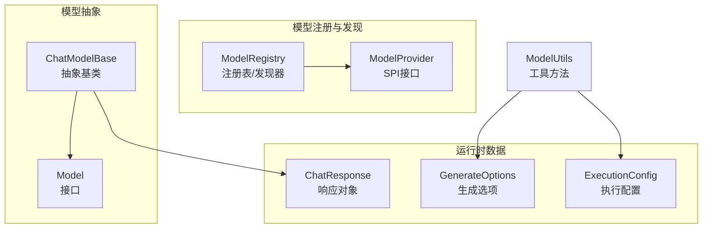
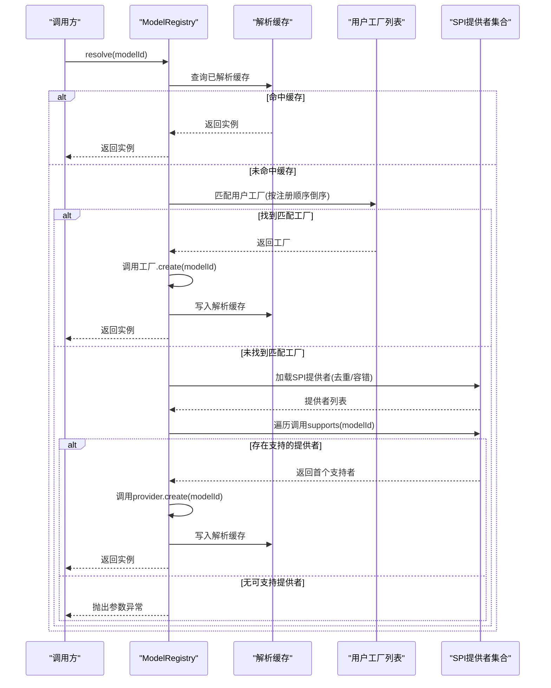
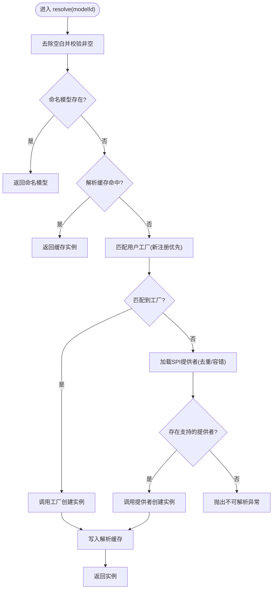
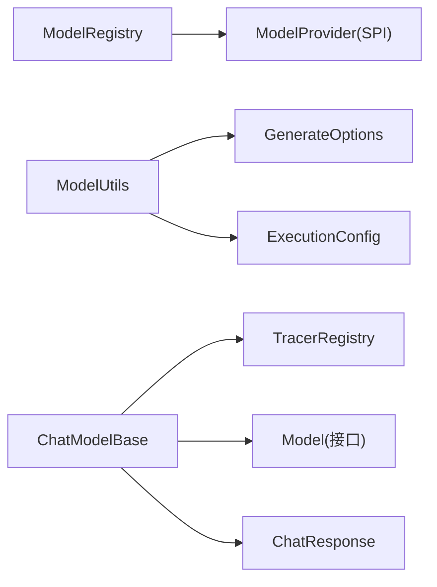

# 模型注册机制

<cite>
**本文引用的文件**
- [ModelRegistry.java](file://agentscope-core/src/main/java/io/agentscope/core/model/ModelRegistry.java)
- [ModelUtils.java](file://agentscope-core/src/main/java/io/agentscope/core/model/ModelUtils.java)
- [ModelProvider.java](file://agentscope-core/src/main/java/io/agentscope/core/model/spi/ModelProvider.java)
- [Model.java](file://agentscope-core/src/main/java/io/agentscope/core/model/Model.java)
- [GenerateOptions.java](file://agentscope-core/src/main/java/io/agentscope/core/model/GenerateOptions.java)
- [ExecutionConfig.java](file://agentscope-core/src/main/java/io/agentscope/core/model/ExecutionConfig.java)
- [ChatModelBase.java](file://agentscope-core/src/main/java/io/agentscope/core/model/ChatModelBase.java)
- [ChatResponse.java](file://agentscope-core/src/main/java/io/agentscope/core/model/ChatResponse.java)
</cite>

## 目录
1. [简介](#简介)
2. [项目结构](#项目结构)
3. [核心组件](#核心组件)
4. [架构总览](#架构总览)
5. [详细组件分析](#详细组件分析)
6. [依赖分析](#依赖分析)
7. [性能考量](#性能考量)
8. [故障排除指南](#故障排除指南)
9. [结论](#结论)
10. [附录：最佳实践与示例路径](#附录最佳实践与示例路径)

## 简介
本文件面向AgentScope Java的“模型注册机制”，系统性阐述ModelRegistry的模型注册与发现流程、查找算法、生命周期管理；详解ModelUtils提供的超时与重试、默认执行配置注入等辅助能力；并说明模型别名系统、优先级排序、动态加载等高级特性。文末提供可直接定位到源码的示例路径，帮助快速上手。

## 项目结构
围绕模型注册与使用的关键文件组织如下：
- 注册与发现：ModelRegistry（注册表）、ModelProvider（SPI接口）
- 模型抽象与基类：Model（接口）、ChatModelBase（抽象基类）
- 响应与选项：ChatResponse（响应数据类）、GenerateOptions（生成参数）、ExecutionConfig（执行配置）
- 工具方法：ModelUtils（超时/重试、默认配置注入）

图表来源
- [ModelRegistry.java:1-302](file://agentscope-core/src/main/java/io/agentscope/core/model/ModelRegistry.java#L1-L302)
- [ModelProvider.java:1-32](file://agentscope-core/src/main/java/io/agentscope/core/model/spi/ModelProvider.java#L1-L32)
- [Model.java:1-86](file://agentscope-core/src/main/java/io/agentscope/core/model/Model.java#L1-L86)
- [ChatModelBase.java:1-86](file://agentscope-core/src/main/java/io/agentscope/core/model/ChatModelBase.java#L1-L86)
- [GenerateOptions.java:1-904](file://agentscope-core/src/main/java/io/agentscope/core/model/GenerateOptions.java#L1-L904)
- [ExecutionConfig.java:1-389](file://agentscope-core/src/main/java/io/agentscope/core/model/ExecutionConfig.java#L1-L389)
- [ChatResponse.java:1-208](file://agentscope-core/src/main/java/io/agentscope/core/model/ChatResponse.java#L1-L208)
- [ModelUtils.java:1-179](file://agentscope-core/src/main/java/io/agentscope/core/model/ModelUtils.java#L1-L179)

章节来源
- [ModelRegistry.java:1-302](file://agentscope-core/src/main/java/io/agentscope/core/model/ModelRegistry.java#L1-L302)
- [ModelProvider.java:1-32](file://agentscope-core/src/main/java/io/agentscope/core/model/spi/ModelProvider.java#L1-L32)
- [Model.java:1-86](file://agentscope-core/src/main/java/io/agentscope/core/model/Model.java#L1-L86)
- [ChatModelBase.java:1-86](file://agentscope-core/src/main/java/io/agentscope/core/model/ChatModelBase.java#L1-L86)
- [GenerateOptions.java:1-904](file://agentscope-core/src/main/java/io/agentscope/core/model/GenerateOptions.java#L1-L904)
- [ExecutionConfig.java:1-389](file://agentscope-core/src/main/java/io/agentscope/core/model/ExecutionConfig.java#L1-L389)
- [ChatResponse.java:1-208](file://agentscope-core/src/main/java/io/agentscope/core/model/ChatResponse.java#L1-L208)
- [ModelUtils.java:1-179](file://agentscope-core/src/main/java/io/agentscope/core/model/ModelUtils.java#L1-L179)

## 核心组件
- ModelRegistry：全局单例式注册表，支持命名模型注册、用户工厂注册（正则匹配）、SPI提供者发现、解析缓存与重置、服务提供者重载。
- ModelProvider：SPI接口，定义providerId、supports、create三要素，用于扩展模块动态提供模型。
- Model：模型统一接口，定义stream、名称、结构化输出能力、上下文窗口等。
- ChatModelBase：模型抽象基类，封装调用与追踪。
- GenerateOptions/ExecutionConfig：统一的生成与执行配置，支持合并策略与默认值。
- ChatResponse：模型响应数据载体。
- ModelUtils：超时与重试增强、默认执行配置注入等工具方法。

章节来源
- [ModelRegistry.java:40-302](file://agentscope-core/src/main/java/io/agentscope/core/model/ModelRegistry.java#L40-L302)
- [ModelProvider.java:20-32](file://agentscope-core/src/main/java/io/agentscope/core/model/spi/ModelProvider.java#L20-L32)
- [Model.java:22-86](file://agentscope-core/src/main/java/io/agentscope/core/model/Model.java#L22-L86)
- [ChatModelBase.java:24-86](file://agentscope-core/src/main/java/io/agentscope/core/model/ChatModelBase.java#L24-L86)
- [GenerateOptions.java:32-904](file://agentscope-core/src/main/java/io/agentscope/core/model/GenerateOptions.java#L32-L904)
- [ExecutionConfig.java:54-389](file://agentscope-core/src/main/java/io/agentscope/core/model/ExecutionConfig.java#L54-L389)
- [ChatResponse.java:23-208](file://agentscope-core/src/main/java/io/agentscope/core/model/ChatResponse.java#L23-L208)
- [ModelUtils.java:31-179](file://agentscope-core/src/main/java/io/agentscope/core/model/ModelUtils.java#L31-L179)

## 架构总览
下图展示了从“模型标识”到“具体模型实例”的解析链路，以及SPI提供者的动态发现与优先级顺序。

图表来源
- [ModelRegistry.java:84-127](file://agentscope-core/src/main/java/io/agentscope/core/model/ModelRegistry.java#L84-L127)
- [ModelRegistry.java:173-211](file://agentscope-core/src/main/java/io/agentscope/core/model/ModelRegistry.java#L173-L211)
- [ModelRegistry.java:213-263](file://agentscope-core/src/main/java/io/agentscope/core/model/ModelRegistry.java#L213-L263)

## 详细组件分析

### ModelRegistry：注册表与发现器
- 注册能力
  - 命名注册：register(name, model)，精确名称匹配优先。
  - 用户工厂注册：registerFactory(regex, factory)，按注册顺序倒序优先匹配，Pattern.matches全量匹配。
- 解析流程
  - 优先：命名模型直接返回。
  - 其次：解析缓存命中复用。
  - 再次：用户工厂列表匹配（新注册优先）。
  - 最后：SPI提供者集合匹配（首次支持者生效）。
- 缓存与重置
  - 解析缓存：resolvedCache，避免重复创建。
  - 重置：reset()清空命名模型、用户工厂、解析缓存，并重载SPI提供者。
  - 重载：reloadProviders()刷新SPI提供者集合。
- 错误处理
  - 对于工厂或提供者返回null或抛出异常，包装为IllegalArgumentException。
  - 无法解析时构建详尽提示信息，指导模块依赖与环境变量配置。

图表来源
- [ModelRegistry.java:84-127](file://agentscope-core/src/main/java/io/agentscope/core/model/ModelRegistry.java#L84-L127)
- [ModelRegistry.java:173-211](file://agentscope-core/src/main/java/io/agentscope/core/model/ModelRegistry.java#L173-L211)
- [ModelRegistry.java:213-263](file://agentscope-core/src/main/java/io/agentscope/core/model/ModelRegistry.java#L213-L263)

章节来源
- [ModelRegistry.java:56-60](file://agentscope-core/src/main/java/io/agentscope/core/model/ModelRegistry.java#L56-L60)
- [ModelRegistry.java:71-76](file://agentscope-core/src/main/java/io/agentscope/core/model/ModelRegistry.java#L71-L76)
- [ModelRegistry.java:84-127](file://agentscope-core/src/main/java/io/agentscope/core/model/ModelRegistry.java#L84-L127)
- [ModelRegistry.java:133-145](file://agentscope-core/src/main/java/io/agentscope/core/model/ModelRegistry.java#L133-L145)
- [ModelRegistry.java:151-156](file://agentscope-core/src/main/java/io/agentscope/core/model/ModelRegistry.java#L151-L156)
- [ModelRegistry.java:162-164](file://agentscope-core/src/main/java/io/agentscope/core/model/ModelRegistry.java#L162-L164)
- [ModelRegistry.java:182-211](file://agentscope-core/src/main/java/io/agentscope/core/model/ModelRegistry.java#L182-L211)
- [ModelRegistry.java:213-263](file://agentscope-core/src/main/java/io/agentscope/core/model/ModelRegistry.java#L213-L263)
- [ModelRegistry.java:275-300](file://agentscope-core/src/main/java/io/agentscope/core/model/ModelRegistry.java#L275-L300)

### ModelProvider：SPI模型提供者接口
- 能力边界
  - providerId：提供者标识（如openai、dashscope等）。
  - supports：判断是否能基于完整modelId创建模型。
  - create：根据完整modelId创建具体模型实例。
- 安全与健壮性
  - supports与create可能抛出RuntimeException或LinkageError，注册器会记录警告并跳过该提供者，保证整体可用性。

章节来源
- [ModelProvider.java:20-32](file://agentscope-core/src/main/java/io/agentscope/core/model/spi/ModelProvider.java#L20-L32)
- [ModelRegistry.java:182-211](file://agentscope-core/src/main/java/io/agentscope/core/model/ModelRegistry.java#L182-L211)

### Model/ChatModelBase：模型抽象与基类
- Model接口
  - stream：流式生成响应。
  - getModelName：模型名称。
  - supportsNativeStructuredOutput/WithTools：原生结构化输出能力声明。
  - getContextWindowSize：上下文窗口大小。
- ChatModelBase
  - 统一封装调用与追踪，委托doStream给子类实现。
  - 提供上下文窗口与原生结构化输出能力的便捷设置。

章节来源
- [Model.java:22-86](file://agentscope-core/src/main/java/io/agentscope/core/model/Model.java#L22-L86)
- [ChatModelBase.java:24-86](file://agentscope-core/src/main/java/io/agentscope/core/model/ChatModelBase.java#L24-L86)

### GenerateOptions/ExecutionConfig：统一配置与合并策略
- GenerateOptions
  - 覆盖连接级配置（apiKey、baseUrl、endpointPath、modelName、stream）与生成参数（temperature、topP、maxTokens、maxCompletionTokens、frequencyPenalty、presencePenalty、thinkingBudget、reasoningEffort、toolChoice、topK、seed、cacheControl、parallelToolCalls、responseFormat、additionalHeaders/body/query）。
  - 合并策略：mergeOptions按字段逐项优先选择primary，map字段采用fallback+primary覆盖合并。
- ExecutionConfig
  - 统一超时与重试配置：timeout、maxAttempts、initialBackoff、maxBackoff、backoffMultiplier、retryOn。
  - 标准默认：MODEL_DEFAULTS（模型请求）与TOOL_DEFAULTS（工具调用）。
  - 合并策略：mergeConfigs按字段逐项优先选择primary。

章节来源
- [GenerateOptions.java:32-904](file://agentscope-core/src/main/java/io/agentscope/core/model/GenerateOptions.java#L32-L904)
- [ExecutionConfig.java:54-389](file://agentscope-core/src/main/java/io/agentscope/core/model/ExecutionConfig.java#L54-L389)

### ModelUtils：超时与重试、默认配置注入
- applyTimeoutAndRetry
  - 基于GenerateOptions中的ExecutionConfig对响应Flux应用timeout与指数退避重试。
  - 默认行为：若未配置超时则不限时；默认重试条件为RETRYABLE_ERRORS。
- ensureDefaultExecutionConfig
  - 当options为空或仅含部分executionConfig时，自动注入MODEL_DEFAULTS以确保一致性。

章节来源
- [ModelUtils.java:39-139](file://agentscope-core/src/main/java/io/agentscope/core/model/ModelUtils.java#L39-L139)
- [ModelUtils.java:141-177](file://agentscope-core/src/main/java/io/agentscope/core/model/ModelUtils.java#L141-L177)

## 依赖分析
- 组件耦合
  - ModelRegistry依赖ModelProvider SPI进行动态扩展，内部通过ServiceLoader加载并去重，容错处理无效声明。
  - ModelUtils不依赖具体模型实现，仅消费GenerateOptions/ExecutionConfig，通用性强。
  - ChatModelBase依赖TracerRegistry进行调用追踪，解耦了业务逻辑与观测性。
- 外部集成点
  - 模块需在classpath暴露META-INF/services/io.agentscope.core.model.spi.ModelProvider实现，以便被ModelRegistry发现。
  - 不同提供商（OpenAI、Gemini、DashScope、Ollama等）通过各自扩展模块提供ModelProvider实现。

图表来源
- [ModelRegistry.java:182-263](file://agentscope-core/src/main/java/io/agentscope/core/model/ModelRegistry.java#L182-L263)
- [ModelUtils.java:69-139](file://agentscope-core/src/main/java/io/agentscope/core/model/ModelUtils.java#L69-L139)
- [ChatModelBase.java:66-84](file://agentscope-core/src/main/java/io/agentscope/core/model/ChatModelBase.java#L66-L84)

章节来源
- [ModelRegistry.java:182-263](file://agentscope-core/src/main/java/io/agentscope/core/model/ModelRegistry.java#L182-L263)
- [ModelUtils.java:69-139](file://agentscope-core/src/main/java/io/agentscope/core/model/ModelUtils.java#L69-L139)
- [ChatModelBase.java:66-84](file://agentscope-core/src/main/java/io/agentscope/core/model/ChatModelBase.java#L66-L84)

## 性能考量
- 并发与缓存
  - 命名模型存储与解析缓存采用线程安全容器，减少重复创建开销。
  - 用户工厂列表使用CopyOnWriteArrayList，注册阶段写入，查询阶段只读遍历，降低锁竞争。
- SPI加载优化
  - 提供者集合缓存至静态字段，首次加载后复用；仅在reset/reloadProviders时重建。
  - 类加载器优先使用当前线程上下文类加载器，回退到ModelRegistry自身类加载器，避免重复与遗漏。
- 流式处理
  - Model.stream返回Flux，结合ModelUtils的超时与重试，可在不阻塞主线程的前提下实现可观测的异步调用。

章节来源
- [ModelRegistry.java:44-48](file://agentscope-core/src/main/java/io/agentscope/core/model/ModelRegistry.java#L44-L48)
- [ModelRegistry.java:151-156](file://agentscope-core/src/main/java/io/agentscope/core/model/ModelRegistry.java#L151-L156)
- [ModelRegistry.java:213-236](file://agentscope-core/src/main/java/io/agentscope/core/model/ModelRegistry.java#L213-L236)
- [ModelUtils.java:69-139](file://agentscope-core/src/main/java/io/agentscope/core/model/ModelUtils.java#L69-L139)

## 故障排除指南
- 无法解析模型
  - 现象：抛出IllegalArgumentException，提示找不到模型。
  - 排查要点：确认是否已通过register注册命名模型；检查是否满足用户工厂正则；确认对应扩展模块已在classpath且提供正确的ModelProvider实现；核对所需环境变量（如API密钥）是否配置。
- 提供者冲突
  - 现象：日志警告多个提供者支持同一modelId，最终仅使用首个发现的提供者。
  - 处理建议：确保提供者标识唯一，避免重复实现。
- 工厂/提供者返回null或抛异常
  - 现象：解析失败并包装为参数异常。
  - 处理建议：检查工厂/提供者实现的健壮性，确保create返回非空实例并在supports中正确过滤。
- 超时与重试问题
  - 现象：请求长时间无响应或频繁失败。
  - 处理建议：通过GenerateOptions/ExecutionConfig调整timeout、maxAttempts、backoff策略；必要时自定义retryOn谓词。

章节来源
- [ModelRegistry.java:101-127](file://agentscope-core/src/main/java/io/agentscope/core/model/ModelRegistry.java#L101-L127)
- [ModelRegistry.java:182-211](file://agentscope-core/src/main/java/io/agentscope/core/model/ModelRegistry.java#L182-L211)
- [ModelRegistry.java:275-300](file://agentscope-core/src/main/java/io/agentscope/core/model/ModelRegistry.java#L275-L300)
- [ModelUtils.java:69-139](file://agentscope-core/src/main/java/io/agentscope/core/model/ModelUtils.java#L69-L139)

## 结论
ModelRegistry通过“命名模型优先、解析缓存复用、用户工厂倒序优先、SPI提供者兜底”的多级解析策略，实现了灵活而稳定的模型发现与生命周期管理。配合ModelProvider的SPI扩展、GenerateOptions/ExecutionConfig的统一配置与ModelUtils的超时/重试增强，AgentScope在可扩展性、可观测性与可靠性方面形成完整闭环。

## 附录：最佳实践与示例路径
- 注册自定义模型（命名注册）
  - 使用register(name, model)完成命名模型注册，随后可通过resolve(name)直接获取。
  - 示例路径参考：[ModelRegistry.register:56-60](file://agentscope-core/src/main/java/io/agentscope/core/model/ModelRegistry.java#L56-L60)
- 配置模型工厂（正则匹配）
  - 使用registerFactory(regex, factory)注册用户工厂，注意regex需与完整modelId匹配；新注册优先于旧注册。
  - 示例路径参考：[ModelRegistry.registerFactory:71-76](file://agentscope-core/src/main/java/io/agentscope/core/model/ModelRegistry.java#L71-L76)
- 实现模型发现（SPI提供者）
  - 在扩展模块中实现ModelProvider，提供providerId/supprots/create；在META-INF/services目录暴露实现类名。
  - 示例路径参考：[ModelProvider接口:20-32](file://agentscope-core/src/main/java/io/agentscope/core/model/spi/ModelProvider.java#L20-L32)
- 使用ModelUtils增强执行策略
  - 通过applyTimeoutAndRetry为响应流添加超时与重试；ensureDefaultExecutionConfig确保默认执行配置注入。
  - 示例路径参考：
    - [ModelUtils.applyTimeoutAndRetry:69-139](file://agentscope-core/src/main/java/io/agentscope/core/model/ModelUtils.java#L69-L139)
    - [ModelUtils.ensureDefaultExecutionConfig:158-177](file://agentscope-core/src/main/java/io/agentscope/core/model/ModelUtils.java#L158-L177)
- 配置生成与执行参数
  - 使用GenerateOptions.builder与ExecutionConfig.builder构建与合并配置，支持分层优先级。
  - 示例路径参考：
    - [GenerateOptions.builder/mergeOptions:392-502](file://agentscope-core/src/main/java/io/agentscope/core/model/GenerateOptions.java#L392-L502)
    - [ExecutionConfig.builder/mergeConfigs:234-291](file://agentscope-core/src/main/java/io/agentscope/core/model/ExecutionConfig.java#L234-L291)