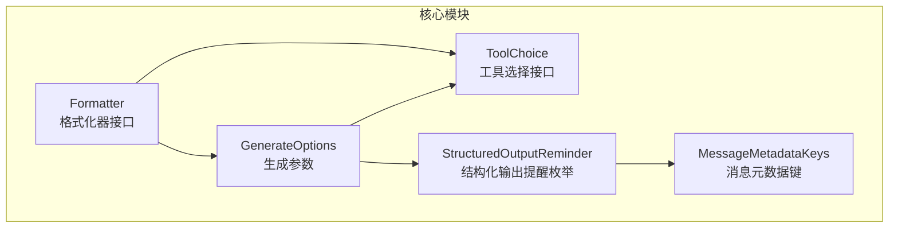
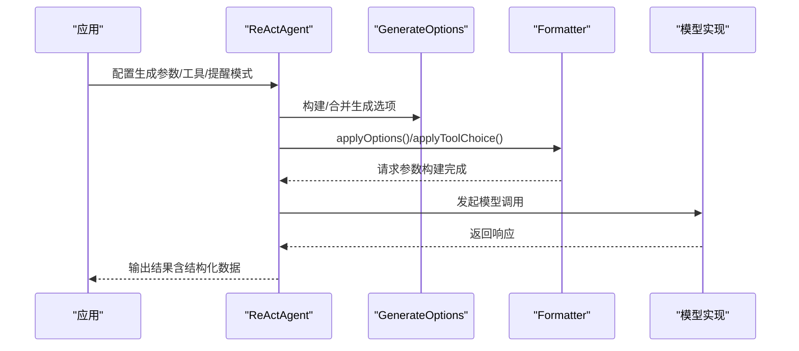
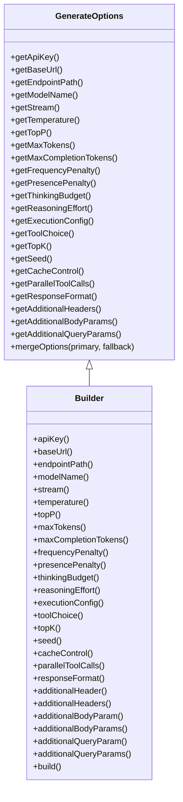
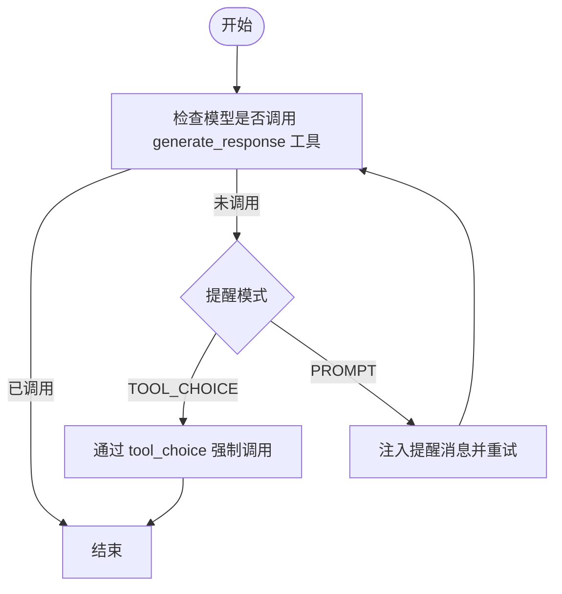
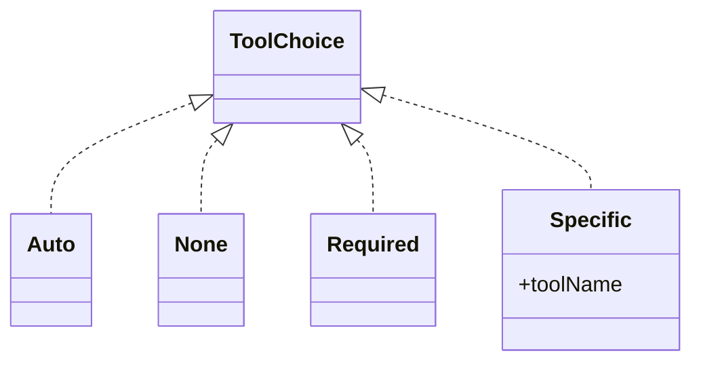
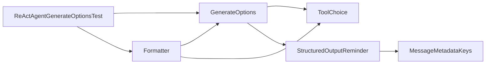

# 生成参数配置

<cite>
**本文引用的文件**
- [GenerateOptions.java](file://agentscope-core/src/main/java/io/agentscope/core/model/GenerateOptions.java)
- [StructuredOutputReminder.java](file://agentscope-core/src/main/java/io/agentscope/core/model/StructuredOutputReminder.java)
- [ToolChoice.java](file://agentscope-core/src/main/java/io/agentscope/core/model/ToolChoice.java)
- [Formatter.java](file://agentscope-core/src/main/java/io/agentscope/core/formatter/Formatter.java)
- [MessageMetadataKeys.java](file://agentscope-core/src/main/java/io/agentscope/core/message/MessageMetadataKeys.java)
- [ReActAgentGenerateOptionsTest.java](file://agentscope-core/src/test/java/io/agentscope/core/agent/ReActAgentGenerateOptionsTest.java)
- [agent-config.md](file://docs/v1/en/docs/task/agent-config.md)
- [structured-output.md](file://docs/v1/en/docs/task/structured-output.md)
</cite>

## 目录
1. [简介](#简介)
2. [项目结构](#项目结构)
3. [核心组件](#核心组件)
4. [架构总览](#架构总览)
5. [详细组件分析](#详细组件分析)
6. [依赖关系分析](#依赖关系分析)
7. [性能考量](#性能考量)
8. [故障排查指南](#故障排查指南)
9. [结论](#结论)
10. [附录](#附录)

## 简介
本技术文档聚焦于 AgentScope Java 的“生成参数配置”，系统性阐述以下主题：
- GenerateOptions 参数体系：温度、最大令牌数、top_p、频率惩罚、响应格式、工具选择、缓存控制等
- StructuredOutputReminder 结构化输出提醒机制：强制工具调用与提示注入两种模式
- ToolChoice 工具选择策略：自动、禁止、必选、特定工具
- 不同模型对参数的支持差异与兼容性处理
- 实际配置示例、条件生成、输出质量优化、参数调优与性能影响分析

## 项目结构
围绕生成参数配置的核心代码位于 agentscope-core 模块的 model、formatter、message 包中；配套文档位于 docs/v1/en/docs/task 下。

图表来源
- [GenerateOptions.java:32-98](file://agentscope-core/src/main/java/io/agentscope/core/model/GenerateOptions.java#L32-L98)
- [StructuredOutputReminder.java:25-51](file://agentscope-core/src/main/java/io/agentscope/core/model/StructuredOutputReminder.java#L25-L51)
- [ToolChoice.java:45-84](file://agentscope-core/src/main/java/io/agentscope/core/model/ToolChoice.java#L45-L84)
- [Formatter.java:55-145](file://agentscope-core/src/main/java/io/agentscope/core/formatter/Formatter.java#L55-L145)
- [MessageMetadataKeys.java:24-134](file://agentscope-core/src/main/java/io/agentscope/core/message/MessageMetadataKeys.java#L24-L134)

章节来源
- [GenerateOptions.java:32-98](file://agentscope-core/src/main/java/io/agentscope/core/model/GenerateOptions.java#L32-L98)
- [StructuredOutputReminder.java:25-51](file://agentscope-core/src/main/java/io/agentscope/core/model/StructuredOutputReminder.java#L25-L51)
- [ToolChoice.java:45-84](file://agentscope-core/src/main/java/io/agentscope/core/model/ToolChoice.java#L45-L84)
- [Formatter.java:55-145](file://agentscope-core/src/main/java/io/agentscope/core/formatter/Formatter.java#L55-L145)
- [MessageMetadataKeys.java:24-134](file://agentscope-core/src/main/java/io/agentscope/core/message/MessageMetadataKeys.java#L24-L134)

## 核心组件
- GenerateOptions：不可变的生成参数对象，支持连接级（如 apiKey、baseUrl、modelName、stream）与请求级（如 temperature、topP、maxTokens、toolChoice、responseFormat 等）参数；提供 builder 构建与按字段合并策略。
- StructuredOutputReminder：结构化输出提醒模式枚举，控制是否通过 tool_choice 强制工具调用或以提示注入方式引导。
- ToolChoice：工具调用策略接口，定义 Auto、None、Required、Specific 四种模式，用于控制模型是否以及如何调用工具。
- Formatter：格式化器接口，负责将 AgentScope 的消息与参数转换为各模型提供商的请求格式，并应用生成参数与工具定义。
- MessageMetadataKeys：消息元数据键常量，包含结构化输出提醒类型等内部标记键。

章节来源
- [GenerateOptions.java:32-98](file://agentscope-core/src/main/java/io/agentscope/core/model/GenerateOptions.java#L32-L98)
- [StructuredOutputReminder.java:25-51](file://agentscope-core/src/main/java/io/agentscope/core/model/StructuredOutputReminder.java#L25-L51)
- [ToolChoice.java:45-84](file://agentscope-core/src/main/java/io/agentscope/core/model/ToolChoice.java#L45-L84)
- [Formatter.java:55-145](file://agentscope-core/src/main/java/io/agentscope/core/formatter/Formatter.java#L55-L145)
- [MessageMetadataKeys.java:24-134](file://agentscope-core/src/main/java/io/agentscope/core/message/MessageMetadataKeys.java#L24-L134)

## 架构总览
下图展示了从应用配置到模型调用的关键流程，以及生成参数在其中的传递路径。

图表来源
- [Formatter.java:81-90](file://agentscope-core/src/main/java/io/agentscope/core/formatter/Formatter.java#L81-L90)
- [Formatter.java:121-144](file://agentscope-core/src/main/java/io/agentscope/core/formatter/Formatter.java#L121-L144)
- [GenerateOptions.java:439-502](file://agentscope-core/src/main/java/io/agentscope/core/model/GenerateOptions.java#L439-L502)

## 详细组件分析

### GenerateOptions 参数体系
- 连接级参数：apiKey、baseUrl、endpointPath、modelName、stream
- 生成级参数：temperature、topP、maxTokens、maxCompletionTokens、frequencyPenalty、presencePenalty、thinkingBudget、reasoningEffort、toolChoice、topK、seed、cacheControl、parallelToolCalls、responseFormat、additionalHeaders、additionalBodyParams、additionalQueryParams
- 合并策略：mergeOptions 支持逐字段优先级合并，map 类型字段采用 fallback 先、primary 覆盖的方式
- builder 方法覆盖所有参数设置，便于链式配置

图表来源
- [GenerateOptions.java:32-98](file://agentscope-core/src/main/java/io/agentscope/core/model/GenerateOptions.java#L32-L98)
- [GenerateOptions.java:518-902](file://agentscope-core/src/main/java/io/agentscope/core/model/GenerateOptions.java#L518-L902)

章节来源
- [GenerateOptions.java:32-98](file://agentscope-core/src/main/java/io/agentscope/core/model/GenerateOptions.java#L32-L98)
- [GenerateOptions.java:439-502](file://agentscope-core/src/main/java/io/agentscope/core/model/GenerateOptions.java#L439-L502)
- [GenerateOptions.java:518-902](file://agentscope-core/src/main/java/io/agentscope/core/model/GenerateOptions.java#L518-L902)

### StructuredOutputReminder 结构化输出提醒机制
- TOOL_CHOICE：默认推荐模式，通过 tool_choice 参数在必要时强制调用 generate_response 工具，允许先多步推理再生成最终结构化输出
- PROMPT：传统模式，若模型未调用工具，则注入提醒消息并重试，可能需要多次迭代

图表来源
- [StructuredOutputReminder.java:25-51](file://agentscope-core/src/main/java/io/agentscope/core/model/StructuredOutputReminder.java#L25-L51)
- [MessageMetadataKeys.java:50-71](file://agentscope-core/src/main/java/io/agentscope/core/message/MessageMetadataKeys.java#L50-L71)

章节来源
- [StructuredOutputReminder.java:25-51](file://agentscope-core/src/main/java/io/agentscope/core/model/StructuredOutputReminder.java#L25-L51)
- [MessageMetadataKeys.java:50-71](file://agentscope-core/src/main/java/io/agentscope/core/message/MessageMetadataKeys.java#L50-L71)

### ToolChoice 工具选择策略
- Auto：由模型自主决定是否调用工具
- None：禁止模型调用任何工具
- Required：强制至少一次工具调用
- Specific：强制调用指定名称的工具

图表来源
- [ToolChoice.java:45-84](file://agentscope-core/src/main/java/io/agentscope/core/model/ToolChoice.java#L45-L84)

章节来源
- [ToolChoice.java:45-84](file://agentscope-core/src/main/java/io/agentscope/core/model/ToolChoice.java#L45-L84)

### 参数与模型/格式化的适配
- Formatter.applyOptions：将 GenerateOptions 应用到具体提供商的请求参数构建器
- Formatter.applyToolChoice：将 ToolChoice 应用到请求参数构建器，不同提供商可做兼容性处理
- 通过 baseUrl/modelName 可进行提供商检测与降级处理

章节来源
- [Formatter.java:81-90](file://agentscope-core/src/main/java/io/agentscope/core/formatter/Formatter.java#L81-L90)
- [Formatter.java:121-144](file://agentscope-core/src/main/java/io/agentscope/core/formatter/Formatter.java#L121-L144)
- [Formatter.java:106-110](file://agentscope-core/src/main/java/io/agentscope/core/formatter/Formatter.java#L106-L110)
- [Formatter.java:139-144](file://agentscope-core/src/main/java/io/agentscope/core/formatter/Formatter.java#L139-L144)

### 不同模型对参数的支持差异与兼容性
- 温度、topP、maxTokens、toolChoice、responseFormat 等参数在不同提供商间存在差异
- 通过 Formatter 的 applyOptions/applyToolChoice 与 baseUrl/modelName 检测，实现兼容性处理与能力降级
- 文档示例展示了在 DashScope 等模型上的默认参数与结构化输出配置

章节来源
- [Formatter.java:92-110](file://agentscope-core/src/main/java/io/agentscope/core/formatter/Formatter.java#L92-L110)
- [Formatter.java:126-144](file://agentscope-core/src/main/java/io/agentscope/core/formatter/Formatter.java#L126-L144)
- [agent-config.md:474-771](file://docs/v1/en/docs/task/agent-config.md#L474-L771)

### 代码示例与最佳实践
- 基础配置示例：在 ReActAgent 中设置 GenerateOptions（温度、最大令牌数、topP、思考预算等），并启用结构化输出提醒模式
- 组合使用：将 GenerateOptions 与 ExecutionConfig 合并，确保超时与重试策略生效
- 测试验证：通过单元测试验证参数透传、合并行为与边界值处理

章节来源
- [agent-config.md:474-771](file://docs/v1/en/docs/task/agent-config.md#L474-L771)
- [ReActAgentGenerateOptionsTest.java:73-162](file://agentscope-core/src/test/java/io/agentscope/core/agent/ReActAgentGenerateOptionsTest.java#L73-L162)
- [ReActAgentGenerateOptionsTest.java:169-271](file://agentscope-core/src/test/java/io/agentscope/core/agent/ReActAgentGenerateOptionsTest.java#L169-L271)
- [ReActAgentGenerateOptionsTest.java:277-373](file://agentscope-core/src/test/java/io/agentscope/core/agent/ReActAgentGenerateOptionsTest.java#L277-L373)
- [ReActAgentGenerateOptionsTest.java:379-467](file://agentscope-core/src/test/java/io/agentscope/core/agent/ReActAgentGenerateOptionsTest.java#L379-L467)

## 依赖关系分析
- GenerateOptions 依赖 ToolChoice 作为其参数之一
- Formatter 在 applyOptions/applyToolChoice 中消费 GenerateOptions 与 ToolChoice
- StructuredOutputReminder 通过消息元数据键参与结构化输出流程
- ReActAgentGenerateOptionsTest 验证了生成参数在推理阶段的正确传递与合并

图表来源
- [GenerateOptions.java:49-85](file://agentscope-core/src/main/java/io/agentscope/core/model/GenerateOptions.java#L49-L85)
- [ToolChoice.java:45-84](file://agentscope-core/src/main/java/io/agentscope/core/model/ToolChoice.java#L45-L84)
- [Formatter.java:81-90](file://agentscope-core/src/main/java/io/agentscope/core/formatter/Formatter.java#L81-L90)
- [Formatter.java:121-144](file://agentscope-core/src/main/java/io/agentscope/core/formatter/Formatter.java#L121-L144)
- [MessageMetadataKeys.java:50-71](file://agentscope-core/src/main/java/io/agentscope/core/message/MessageMetadataKeys.java#L50-L71)
- [ReActAgentGenerateOptionsTest.java:73-162](file://agentscope-core/src/test/java/io/agentscope/core/agent/ReActAgentGenerateOptionsTest.java#L73-L162)

章节来源
- [GenerateOptions.java:49-85](file://agentscope-core/src/main/java/io/agentscope/core/model/GenerateOptions.java#L49-L85)
- [Formatter.java:81-90](file://agentscope-core/src/main/java/io/agentscope/core/formatter/Formatter.java#L81-L90)
- [Formatter.java:121-144](file://agentscope-core/src/main/java/io/agentscope/core/formatter/Formatter.java#L121-L144)
- [MessageMetadataKeys.java:50-71](file://agentscope-core/src/main/java/io/agentscope/core/message/MessageMetadataKeys.java#L50-L71)
- [ReActAgentGenerateOptionsTest.java:73-162](file://agentscope-core/src/test/java/io/agentscope/core/agent/ReActAgentGenerateOptionsTest.java#L73-L162)

## 性能考量
- 温度与 topP：提高随机性会增加 token 使用与推理时间，降低随机性有助于稳定与更快收敛
- 最大令牌数：直接影响上下文长度与成本，需结合任务复杂度与预算权衡
- 并行工具调用：开启后可提升工具执行吞吐，但需考虑并发与资源限制
- 缓存控制：prompt caching 可显著降低延迟与成本，适用于静态或重复提示
- 执行配置：超时与退避策略影响整体可用性与稳定性

## 故障排查指南
- 参数未生效：确认是否通过 ReActAgent.Builder.generateOptions 正确设置，并在推理阶段被合并
- 工具未调用：检查 ToolChoice 设置（Auto/None/Required/Specific），或 StructuredOutputReminder 是否正确启用
- 提示注入无效：确认 PROMPT 模式下的提醒消息是否被正确注入且未被后续对话覆盖
- 兼容性问题：通过 Formatter 的 applyToolChoice 与 baseUrl/modelName 检测，必要时降级至不支持严格模式的参数

章节来源
- [ReActAgentGenerateOptionsTest.java:169-271](file://agentscope-core/src/test/java/io/agentscope/core/agent/ReActAgentGenerateOptionsTest.java#L169-L271)
- [StructuredOutputReminder.java:25-51](file://agentscope-core/src/main/java/io/agentscope/core/model/StructuredOutputReminder.java#L25-L51)
- [Formatter.java:126-144](file://agentscope-core/src/main/java/io/agentscope/core/formatter/Formatter.java#L126-L144)

## 结论
GenerateOptions 提供了统一、可合并的生成参数抽象，配合 StructuredOutputReminder 与 ToolChoice，能够灵活地适配不同模型与场景需求。通过 Formatter 的适配层，SDK 在保证参数一致性的同时实现了跨提供商的兼容性。建议在生产环境中结合业务目标合理设置温度、最大令牌数与工具策略，并利用缓存与执行配置优化性能与成本。

## 附录
- 官方文档示例：包含完整的 Agent 配置与结构化输出示例，可直接参考以快速上手
- 单元测试：覆盖参数设置、合并、边界值与推理阶段透传等关键场景

章节来源
- [agent-config.md:474-771](file://docs/v1/en/docs/task/agent-config.md#L474-L771)
- [structured-output.md:1-87](file://docs/v1/en/docs/task/structured-output.md#L1-L87)
- [ReActAgentGenerateOptionsTest.java:73-162](file://agentscope-core/src/test/java/io/agentscope/core/agent/ReActAgentGenerateOptionsTest.java#L73-L162)