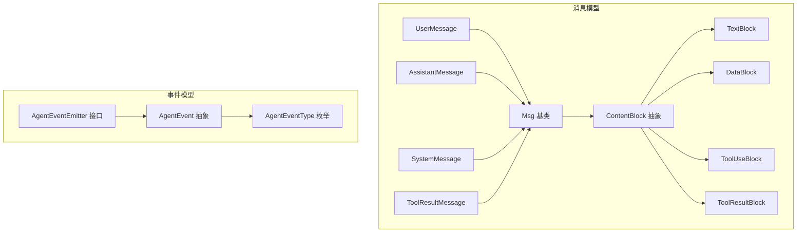
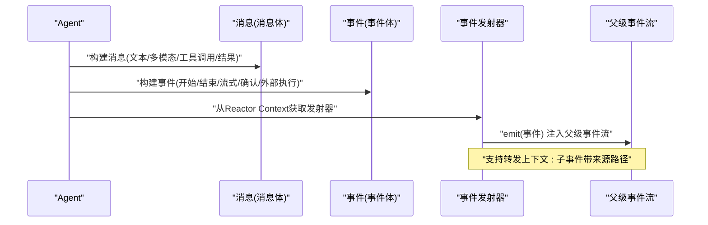
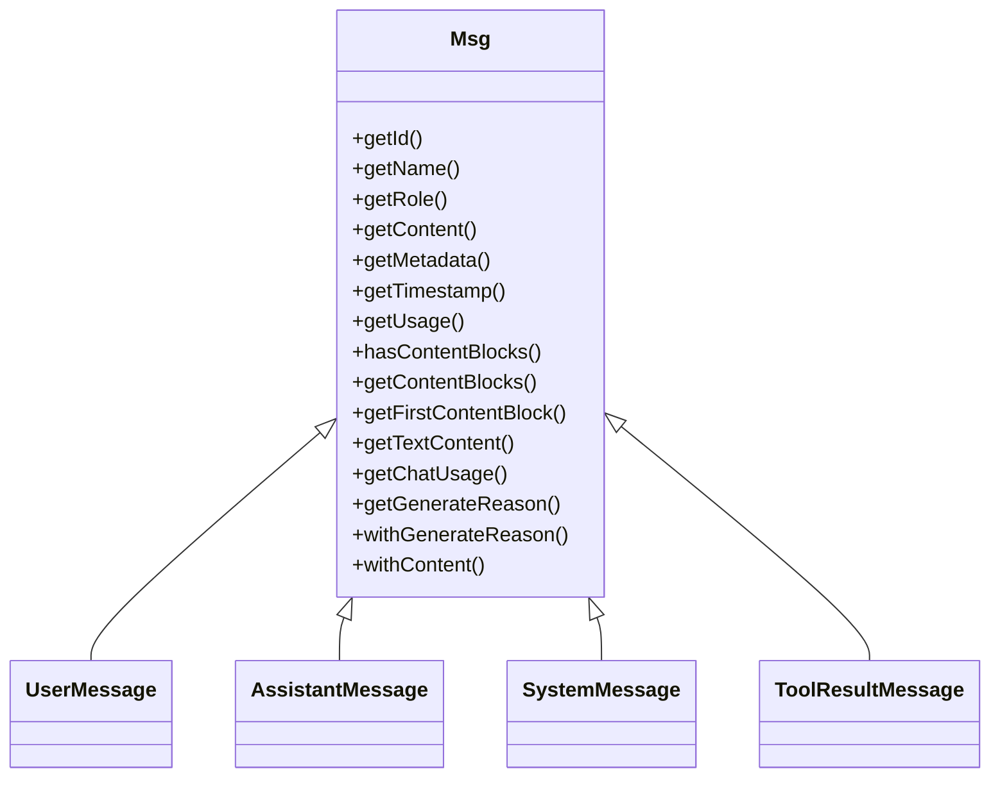
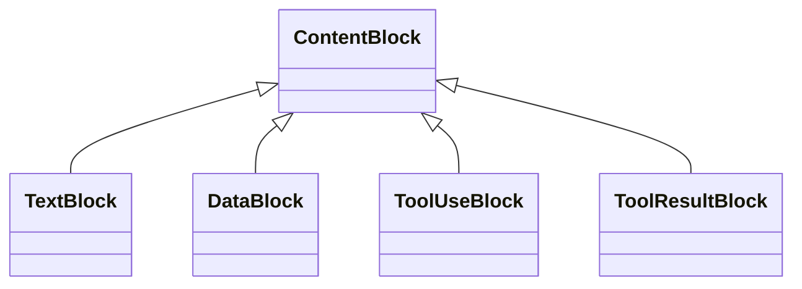
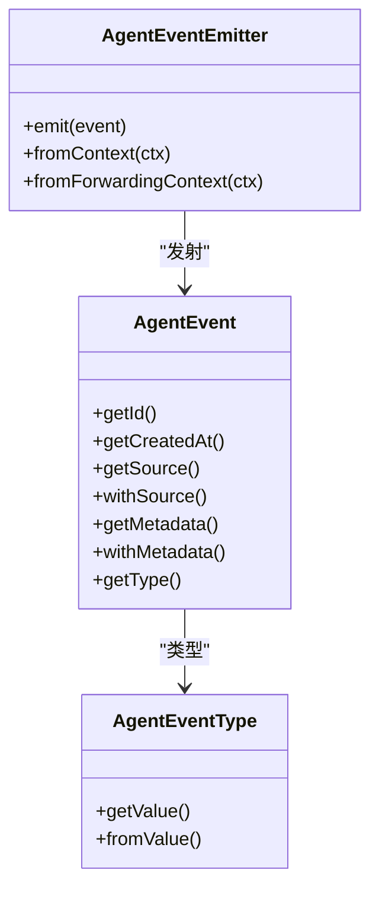
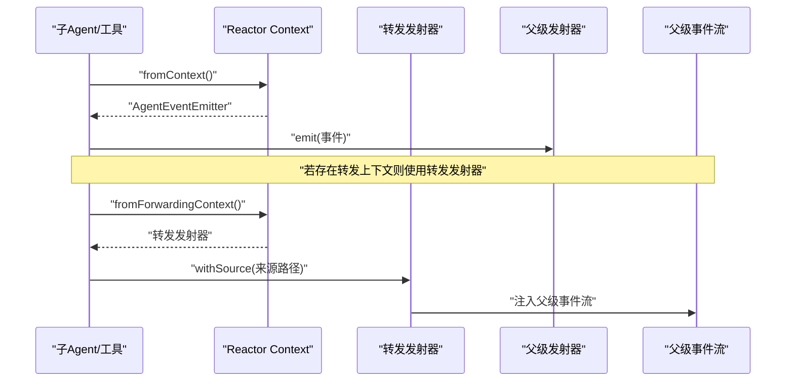
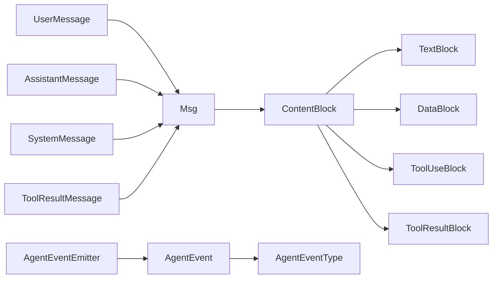

# 消息与事件系统

<cite>
**本文引用的文件**
- [agentscope-core/src/main/java/io/agentscope/core/message/Msg.java](file://agentscope-core/src/main/java/io/agentscope/core/message/Msg.java)
- [agentscope-core/src/main/java/io/agentscope/core/message/UserMessage.java](file://agentscope-core/src/main/java/io/agentscope/core/message/UserMessage.java)
- [agentscope-core/src/main/java/io/agentscope/core/message/AssistantMessage.java](file://agentscope-core/src/main/java/io/agentscope/core/message/AssistantMessage.java)
- [agentscope-core/src/main/java/io/agentscope/core/message/SystemMessage.java](file://agentscope-core/src/main/java/io/agentscope/core/message/SystemMessage.java)
- [agentscope-core/src/main/java/io/agentscope/core/message/ToolResultMessage.java](file://agentscope-core/src/main/java/io/agentscope/core/message/ToolResultMessage.java)
- [agentscope-core/src/main/java/io/agentscope/core/message/ContentBlock.java](file://agentscope-core/src/main/java/io/agentscope/core/message/ContentBlock.java)
- [agentscope-core/src/main/java/io/agentscope/core/message/TextBlock.java](file://agentscope-core/src/main/java/io/agentscope/core/message/TextBlock.java)
- [agentscope-core/src/main/java/io/agentscope/core/message/DataBlock.java](file://agentscope-core/src/main/java/io/agentscope/core/message/DataBlock.java)
- [agentscope-core/src/main/java/io/agentscope/core/message/ToolUseBlock.java](file://agentscope-core/src/main/java/io/agentscope/core/message/ToolUseBlock.java)
- [agentscope-core/src/main/java/io/agentscope/core/message/ToolResultBlock.java](file://agentscope-core/src/main/java/io/agentscope/core/message/ToolResultBlock.java)
- [agentscope-core/src/main/java/io/agentscope/core/event/AgentEvent.java](file://agentscope-core/src/main/java/io/agentscope/core/event/AgentEvent.java)
- [agentscope-core/src/main/java/io/agentscope/core/event/AgentEventType.java](file://agentscope-core/src/main/java/io/agentscope/core/event/AgentEventType.java)
- [agentscope-core/src/main/java/io/agentscope/core/event/AgentEventEmitter.java](file://agentscope-core/src/main/java/io/agentscope/core/event/AgentEventEmitter.java)
</cite>

## 目录
1. [简介](#简介)
2. [项目结构](#项目结构)
3. [核心组件](#核心组件)
4. [架构总览](#架构总览)
5. [详细组件分析](#详细组件分析)
6. [依赖分析](#依赖分析)
7. [性能考虑](#性能考虑)
8. [故障排查指南](#故障排查指南)
9. [结论](#结论)
10. [附录：使用示例与最佳实践](#附录使用示例与最佳实践)

## 简介
本文件面向AgentScope Java的消息与事件系统，系统性阐述消息抽象Msg及其子类（用户消息、助手消息、系统消息、工具结果消息），内容块ContentBlock及多模态支持（文本、图像/音频/视频统一数据块、思考内容、工具调用与结果），以及事件模型AgentEvent、事件类型AgentEventType与事件发射AgentEventEmitter。文档同时覆盖消息格式化、元数据管理、结构化输出提取、事件订阅与转发、异步处理与性能优化、序列化与持久化建议、调试与监控实践。

## 项目结构
围绕消息与事件的核心代码位于agentscope-core模块的message与event包中，采用“抽象基类+具体子类”的分层设计，并通过Jackson注解实现多态序列化与反序列化。消息侧以Msg为核心，配合ContentBlock多态体系；事件侧以AgentEvent为核心，配合AgentEventType枚举与AgentEventEmitter接口。

图表来源
- [agentscope-core/src/main/java/io/agentscope/core/message/Msg.java:67-152](file://agentscope-core/src/main/java/io/agentscope/core/message/Msg.java#L67-L152)
- [agentscope-core/src/main/java/io/agentscope/core/message/UserMessage.java:37-83](file://agentscope-core/src/main/java/io/agentscope/core/message/UserMessage.java#L37-L83)
- [agentscope-core/src/main/java/io/agentscope/core/message/AssistantMessage.java:35-81](file://agentscope-core/src/main/java/io/agentscope/core/message/AssistantMessage.java#L35-L81)
- [agentscope-core/src/main/java/io/agentscope/core/message/SystemMessage.java:35-81](file://agentscope-core/src/main/java/io/agentscope/core/message/SystemMessage.java#L35-L81)
- [agentscope-core/src/main/java/io/agentscope/core/message/ToolResultMessage.java:37-86](file://agentscope-core/src/main/java/io/agentscope/core/message/ToolResultMessage.java#L37-L86)
- [agentscope-core/src/main/java/io/agentscope/core/message/ContentBlock.java:58-67](file://agentscope-core/src/main/java/io/agentscope/core/message/ContentBlock.java#L58-L67)
- [agentscope-core/src/main/java/io/agentscope/core/message/TextBlock.java:31-57](file://agentscope-core/src/main/java/io/agentscope/core/message/TextBlock.java#L31-L57)
- [agentscope-core/src/main/java/io/agentscope/core/message/DataBlock.java:35-87](file://agentscope-core/src/main/java/io/agentscope/core/message/DataBlock.java#L35-L87)
- [agentscope-core/src/main/java/io/agentscope/core/message/ToolUseBlock.java:34-119](file://agentscope-core/src/main/java/io/agentscope/core/message/ToolUseBlock.java#L34-L119)
- [agentscope-core/src/main/java/io/agentscope/core/message/ToolResultBlock.java:35-58](file://agentscope-core/src/main/java/io/agentscope/core/message/ToolResultBlock.java#L35-L58)
- [agentscope-core/src/main/java/io/agentscope/core/event/AgentEvent.java:72-91](file://agentscope-core/src/main/java/io/agentscope/core/event/AgentEvent.java#L72-L91)
- [agentscope-core/src/main/java/io/agentscope/core/event/AgentEventType.java:40-95](file://agentscope-core/src/main/java/io/agentscope/core/event/AgentEventType.java#L40-L95)
- [agentscope-core/src/main/java/io/agentscope/core/event/AgentEventEmitter.java:39-68](file://agentscope-core/src/main/java/io/agentscope/core/event/AgentEventEmitter.java#L39-L68)

章节来源
- [agentscope-core/src/main/java/io/agentscope/core/message/Msg.java:40-66](file://agentscope-core/src/main/java/io/agentscope/core/message/Msg.java#L40-L66)
- [agentscope-core/src/main/java/io/agentscope/core/event/AgentEvent.java:27-71](file://agentscope-core/src/main/java/io/agentscope/core/event/AgentEvent.java#L27-L71)

## 核心组件
- 消息抽象与角色
  - Msg：统一承载消息ID、名称、角色、内容块列表、元数据、时间戳、用量统计；提供类型安全的内容块查询、结构化数据提取、生成原因标注、不可变替换等能力。
  - 角色专用消息：UserMessage、AssistantMessage、SystemMessage、ToolResultMessage，均继承自Msg并固定角色，提供便捷构造器与独立Builder。
- 内容块与多模态
  - ContentBlock为密封抽象，定义文本、图像/音频/视频统一数据块、思考内容、工具调用、工具结果、提示块、通用数据块等多态类型。
  - TextBlock：纯文本内容。
  - DataBlock：统一二进制媒体载体（图片/音频/视频/文件），支持URL或Base64源，具备稳定ID与可选名称。
  - ToolUseBlock：工具调用请求，含ID、名称、输入参数、原始内容（用于流式）、元数据、状态。
  - ToolResultBlock：工具执行结果，含ID、名称、输出内容块列表、元数据、状态；支持挂起标记与便捷构造。
- 事件模型
  - AgentEvent：所有细粒度事件的抽象，携带唯一ID、创建时间、来源路径、元数据，支持withSource与withMetadata链式设置。
  - AgentEventType：事件类型枚举，包含代理运行、模型调用、文本/思考/数据块流式、工具调用与结果、用户确认、外部执行、请求停止、子代理暴露、提示块、自定义事件等，并兼容历史别名。
  - AgentEventEmitter：事件发射接口，提供从Reactor Context检索发射器的能力，支持父子事件转发与线程安全发射。

章节来源
- [agentscope-core/src/main/java/io/agentscope/core/message/Msg.java:67-152](file://agentscope-core/src/main/java/io/agentscope/core/message/Msg.java#L67-L152)
- [agentscope-core/src/main/java/io/agentscope/core/message/ContentBlock.java:58-67](file://agentscope-core/src/main/java/io/agentscope/core/message/ContentBlock.java#L58-L67)
- [agentscope-core/src/main/java/io/agentscope/core/event/AgentEvent.java:72-132](file://agentscope-core/src/main/java/io/agentscope/core/event/AgentEvent.java#L72-L132)
- [agentscope-core/src/main/java/io/agentscope/core/event/AgentEventType.java:40-135](file://agentscope-core/src/main/java/io/agentscope/core/event/AgentEventType.java#L40-L135)
- [agentscope-core/src/main/java/io/agentscope/core/event/AgentEventEmitter.java:39-96](file://agentscope-core/src/main/java/io/agentscope/core/event/AgentEventEmitter.java#L39-L96)

## 架构总览
消息与事件在AgentScope中协同工作：Agent在推理与行动过程中产生消息（文本/多模态/工具调用/结果）与事件（开始/结束/流式增量/工具调用/结果/确认/外部执行等）。事件通过Reactor Context注入的AgentEventEmitter进入父级事件流，支持父子事件转发与聚合。

图表来源
- [agentscope-core/src/main/java/io/agentscope/core/event/AgentEventEmitter.java:77-96](file://agentscope-core/src/main/java/io/agentscope/core/event/AgentEventEmitter.java#L77-L96)
- [agentscope-core/src/main/java/io/agentscope/core/event/AgentEvent.java:114-132](file://agentscope-core/src/main/java/io/agentscope/core/event/AgentEvent.java#L114-L132)

## 详细组件分析

### 消息抽象与角色消息
- Msg职责
  - 统一ID、名称、角色、内容块、元数据、时间戳、用量统计。
  - 角色与内容块合法性校验：用户消息允许文本/数据/图像/音频/视频；系统消息仅允许文本；助手/工具消息无限制（工具保留向后兼容）。
  - Builder模式：支持随机ID、当前时间戳、内容块设置、文本快捷设置、元数据、用量、生成原因等。
  - 查询与转换：按类型筛选内容块、获取首条内容块、提取结构化数据、拼接纯文本、获取聊天用量、生成原因读取与更新。
- 角色专用消息
  - UserMessage：固定角色为USER，便捷构造文本或多种内容块，提供独立Builder。
  - AssistantMessage：固定角色为ASSISTANT，常用于包含思考与工具调用的结果。
  - SystemMessage：固定角色为SYSTEM，严格限制为文本块。
  - ToolResultMessage：固定角色为TOOL，内容由一个或多个ToolResultBlock组成，支持累积/替换结果。

图表来源
- [agentscope-core/src/main/java/io/agentscope/core/message/Msg.java:260-320](file://agentscope-core/src/main/java/io/agentscope/core/message/Msg.java#L260-L320)
- [agentscope-core/src/main/java/io/agentscope/core/message/UserMessage.java:37-83](file://agentscope-core/src/main/java/io/agentscope/core/message/UserMessage.java#L37-L83)
- [agentscope-core/src/main/java/io/agentscope/core/message/AssistantMessage.java:35-81](file://agentscope-core/src/main/java/io/agentscope/core/message/AssistantMessage.java#L35-L81)
- [agentscope-core/src/main/java/io/agentscope/core/message/SystemMessage.java:35-81](file://agentscope-core/src/main/java/io/agentscope/core/message/SystemMessage.java#L35-L81)
- [agentscope-core/src/main/java/io/agentscope/core/message/ToolResultMessage.java:37-86](file://agentscope-core/src/main/java/io/agentscope/core/message/ToolResultMessage.java#L37-L86)

章节来源
- [agentscope-core/src/main/java/io/agentscope/core/message/Msg.java:166-198](file://agentscope-core/src/main/java/io/agentscope/core/message/Msg.java#L166-L198)
- [agentscope-core/src/main/java/io/agentscope/core/message/UserMessage.java:39-71](file://agentscope-core/src/main/java/io/agentscope/core/message/UserMessage.java#L39-L71)
- [agentscope-core/src/main/java/io/agentscope/core/message/AssistantMessage.java:37-69](file://agentscope-core/src/main/java/io/agentscope/core/message/AssistantMessage.java#L37-L69)
- [agentscope-core/src/main/java/io/agentscope/core/message/SystemMessage.java:37-69](file://agentscope-core/src/main/java/io/agentscope/core/message/SystemMessage.java#L37-L69)
- [agentscope-core/src/main/java/io/agentscope/core/message/ToolResultMessage.java:39-74](file://agentscope-core/src/main/java/io/agentscope/core/message/ToolResultMessage.java#L39-L74)

### 内容块与多模态
- ContentBlock密封抽象：通过Jackson多态注解以"type"字段区分具体类型。
- TextBlock：最基础文本块，支持Builder。
- DataBlock：统一二进制媒体容器，支持Source（URL/Base64）、稳定ID与名称，适合新代码优先使用。
- ToolUseBlock：工具调用请求，含输入参数、原始内容（流式）、元数据、状态。
- ToolResultBlock：工具结果，含输出内容块列表、元数据、状态；支持挂起标记与便捷构造；提供静态of系列方法与withIdAndName。

图表来源
- [agentscope-core/src/main/java/io/agentscope/core/message/ContentBlock.java:58-67](file://agentscope-core/src/main/java/io/agentscope/core/message/ContentBlock.java#L58-L67)
- [agentscope-core/src/main/java/io/agentscope/core/message/TextBlock.java:31-57](file://agentscope-core/src/main/java/io/agentscope/core/message/TextBlock.java#L31-L57)
- [agentscope-core/src/main/java/io/agentscope/core/message/DataBlock.java:35-87](file://agentscope-core/src/main/java/io/agentscope/core/message/DataBlock.java#L35-L87)
- [agentscope-core/src/main/java/io/agentscope/core/message/ToolUseBlock.java:34-119](file://agentscope-core/src/main/java/io/agentscope/core/message/ToolUseBlock.java#L34-L119)
- [agentscope-core/src/main/java/io/agentscope/core/message/ToolResultBlock.java:35-140](file://agentscope-core/src/main/java/io/agentscope/core/message/ToolResultBlock.java#L35-L140)

章节来源
- [agentscope-core/src/main/java/io/agentscope/core/message/TextBlock.java:31-95](file://agentscope-core/src/main/java/io/agentscope/core/message/TextBlock.java#L31-L95)
- [agentscope-core/src/main/java/io/agentscope/core/message/DataBlock.java:35-154](file://agentscope-core/src/main/java/io/agentscope/core/message/DataBlock.java#L35-L154)
- [agentscope-core/src/main/java/io/agentscope/core/message/ToolUseBlock.java:34-287](file://agentscope-core/src/main/java/io/agentscope/core/message/ToolUseBlock.java#L34-L287)
- [agentscope-core/src/main/java/io/agentscope/core/message/ToolResultBlock.java:35-414](file://agentscope-core/src/main/java/io/agentscope/core/message/ToolResultBlock.java#L35-L414)

### 事件模型与发射
- AgentEvent：抽象事件基类，统一ID、创建时间、来源路径、元数据；提供withSource与withMetadata链式设置。
- AgentEventType：事件类型枚举，涵盖代理运行、模型调用、文本/思考/数据块流式、工具调用/结果、用户确认、外部执行、请求停止、子代理暴露、提示块、自定义事件；支持历史别名反序列化。
- AgentEventEmitter：函数式接口，提供从Reactor Context检索发射器的方法；支持父子转发上下文键；emit为线程安全。

图表来源
- [agentscope-core/src/main/java/io/agentscope/core/event/AgentEvent.java:72-132](file://agentscope-core/src/main/java/io/agentscope/core/event/AgentEvent.java#L72-L132)
- [agentscope-core/src/main/java/io/agentscope/core/event/AgentEventType.java:40-135](file://agentscope-core/src/main/java/io/agentscope/core/event/AgentEventType.java#L40-L135)
- [agentscope-core/src/main/java/io/agentscope/core/event/AgentEventEmitter.java:39-96](file://agentscope-core/src/main/java/io/agentscope/core/event/AgentEventEmitter.java#L39-L96)

章节来源
- [agentscope-core/src/main/java/io/agentscope/core/event/AgentEvent.java:72-132](file://agentscope-core/src/main/java/io/agentscope/core/event/AgentEvent.java#L72-L132)
- [agentscope-core/src/main/java/io/agentscope/core/event/AgentEventType.java:40-135](file://agentscope-core/src/main/java/io/agentscope/core/event/AgentEventType.java#L40-L135)
- [agentscope-core/src/main/java/io/agentscope/core/event/AgentEventEmitter.java:39-96](file://agentscope-core/src/main/java/io/agentscope/core/event/AgentEventEmitter.java#L39-L96)

### 事件序列与转发
- 发射流程：工具在Reactor上下文中通过AgentEventEmitter.fromContext检索发射器，调用emit注入父级事件流。
- 转发机制：子Agent通过FORWARDING_CONTEXT_KEY注入转发发射器，子事件在进入父流前自动打上来源路径，便于溯源与聚合。

图表来源
- [agentscope-core/src/main/java/io/agentscope/core/event/AgentEventEmitter.java:77-96](file://agentscope-core/src/main/java/io/agentscope/core/event/AgentEventEmitter.java#L77-L96)

## 依赖分析
- 消息侧
  - Msg对ContentBlock多态依赖，确保内容块类型安全与序列化一致性。
  - 各角色消息对Msg的继承与固定角色，保证消息语义正确性。
  - ToolUseBlock/ToolResultBlock作为ContentBlock子类，承载工具调用与结果。
- 事件侧
  - AgentEvent对AgentEventType多态依赖，Jackson注解驱动事件类型识别。
  - AgentEventEmitter为事件注入与转发提供运行时支撑。

图表来源
- [agentscope-core/src/main/java/io/agentscope/core/message/Msg.java:61-66](file://agentscope-core/src/main/java/io/agentscope/core/message/Msg.java#L61-L66)
- [agentscope-core/src/main/java/io/agentscope/core/event/AgentEvent.java:36-71](file://agentscope-core/src/main/java/io/agentscope/core/event/AgentEvent.java#L36-L71)
- [agentscope-core/src/main/java/io/agentscope/core/event/AgentEventEmitter.java:39-68](file://agentscope-core/src/main/java/io/agentscope/core/event/AgentEventEmitter.java#L39-L68)

章节来源
- [agentscope-core/src/main/java/io/agentscope/core/message/Msg.java:61-66](file://agentscope-core/src/main/java/io/agentscope/core/message/Msg.java#L61-L66)
- [agentscope-core/src/main/java/io/agentscope/core/event/AgentEvent.java:36-71](file://agentscope-core/src/main/java/io/agentscope/core/event/AgentEvent.java#L36-L71)

## 性能考虑
- 不可变性与防御性复制
  - Msg对内容块列表进行去空过滤与不可变封装；ToolUseBlock/ToolResultBlock对输入与元数据进行防御性复制，避免外部修改引发竞态。
- 序列化开销控制
  - ContentBlock与AgentEvent均使用Jackson多态注解，通过显式类型字段减少反射成本；DataBlock对非空字段进行条件包含，降低冗余。
- 流式处理
  - ToolUseBlock/ToolResultBlock支持原始内容字段，便于在事件流中进行增量传输；事件发射器基于Reactor，天然支持背压与异步。
- 元数据与结构化数据
  - Msg提供结构化数据提取与聊天用量解析，避免重复解析带来的额外开销；建议在需要时再进行转换，避免不必要的JSON编解码。

章节来源
- [agentscope-core/src/main/java/io/agentscope/core/message/Msg.java:134-151](file://agentscope-core/src/main/java/io/agentscope/core/message/Msg.java#L134-L151)
- [agentscope-core/src/main/java/io/agentscope/core/message/ToolUseBlock.java:108-118](file://agentscope-core/src/main/java/io/agentscope/core/message/ToolUseBlock.java#L108-L118)
- [agentscope-core/src/main/java/io/agentscope/core/message/ToolResultBlock.java:52-58](file://agentscope-core/src/main/java/io/agentscope/core/message/ToolResultBlock.java#L52-L58)
- [agentscope-core/src/main/java/io/agentscope/core/event/AgentEventEmitter.java:60-68](file://agentscope-core/src/main/java/io/agentscope/core/event/AgentEventEmitter.java#L60-L68)

## 故障排查指南
- 角色与内容块不匹配
  - 用户消息不允许除文本/数据/图像/音频/视频之外的内容块；系统消息仅允许文本块。违反规则会抛出非法参数异常。
- 结构化数据提取失败
  - 使用hasStructuredData检查是否存在结构化输出键；getStructuredData(Class)与getStructuredData(Map)需确保目标类型与元数据schema一致，否则抛出非法参数异常。
- 聊天用量解析
  - 若元数据中存在非标准结构，getChatUsage会尝试转换；若无法解析，返回null或默认值，需检查上游是否正确填充。
- 事件发射器缺失
  - 在非流式调用场景下，fromContext可能返回空；应进行判空处理，避免NPE。
- 事件转发路径错误
  - 子事件未打上来源路径会导致溯源困难；确保在转发上下文中使用转发发射器。

章节来源
- [agentscope-core/src/main/java/io/agentscope/core/message/Msg.java:166-198](file://agentscope-core/src/main/java/io/agentscope/core/message/Msg.java#L166-L198)
- [agentscope-core/src/main/java/io/agentscope/core/message/Msg.java:416-438](file://agentscope-core/src/main/java/io/agentscope/core/message/Msg.java#L416-L438)
- [agentscope-core/src/main/java/io/agentscope/core/message/Msg.java:560-584](file://agentscope-core/src/main/java/io/agentscope/core/message/Msg.java#L560-L584)
- [agentscope-core/src/main/java/io/agentscope/core/event/AgentEventEmitter.java:77-96](file://agentscope-core/src/main/java/io/agentscope/core/event/AgentEventEmitter.java#L77-L96)

## 结论
AgentScope Java的消息与事件系统以Msg与ContentBlock为核心，结合角色专用消息与多模态内容块，提供了强类型、可扩展、可序列化的消息表达；事件模型通过AgentEvent与AgentEventType实现细粒度可观测性，配合AgentEventEmitter与Reactor上下文实现事件注入与转发。该设计兼顾了易用性、性能与可维护性，适用于复杂多Agent协作与工具调用场景。

## 附录：使用示例与最佳实践
- 创建消息
  - 使用Msg.builder()或角色专用消息构造器快速构建用户/助手/系统/工具结果消息；通过content()/textContent()/metadata()等方法配置内容与元数据。
  - 多模态内容：优先使用DataBlock承载图片/音频/视频/文件；必要时组合TextBlock与其他内容块。
- 发送事件
  - 在工具执行期间，从Reactor Context获取AgentEventEmitter；通过emit注入事件到父级事件流；如涉及子Agent，使用转发发射器自动打上来源路径。
- 处理事件流
  - 订阅父级事件流，按AgentEventType进行分支处理；对流式事件（文本/思考/数据块/工具调用/结果）进行增量聚合。
- 事件过滤与订阅
  - 建议在消费端按类型过滤（如仅关注工具调用/结果、用户确认、外部执行），并结合来源路径进行路由。
- 异步处理与性能优化
  - 利用Reactor背压与线程池隔离；避免在事件流中进行阻塞操作；对大对象（如二进制媒体）尽量延迟加载或使用URL源。
- 序列化与持久化
  - 事件与消息均采用Jackson多态序列化，建议统一版本管理与兼容策略；事件持久化可按来源路径与类型分区存储，便于回放与审计。
- 调试与监控
  - 为关键事件添加元数据（如traceId、spanId）；记录事件来源路径与时间戳；对异常事件（如超限、外部执行）建立告警。

章节来源
- [agentscope-core/src/main/java/io/agentscope/core/message/Msg.java:205-235](file://agentscope-core/src/main/java/io/agentscope/core/message/Msg.java#L205-L235)
- [agentscope-core/src/main/java/io/agentscope/core/message/UserMessage.java:89-91](file://agentscope-core/src/main/java/io/agentscope/core/message/UserMessage.java#L89-L91)
- [agentscope-core/src/main/java/io/agentscope/core/message/AssistantMessage.java:87-89](file://agentscope-core/src/main/java/io/agentscope/core/message/AssistantMessage.java#L87-L89)
- [agentscope-core/src/main/java/io/agentscope/core/message/SystemMessage.java:87-89](file://agentscope-core/src/main/java/io/agentscope/core/message/SystemMessage.java#L87-L89)
- [agentscope-core/src/main/java/io/agentscope/core/message/ToolResultMessage.java:92-94](file://agentscope-core/src/main/java/io/agentscope/core/message/ToolResultMessage.java#L92-L94)
- [agentscope-core/src/main/java/io/agentscope/core/event/AgentEventEmitter.java:77-96](file://agentscope-core/src/main/java/io/agentscope/core/event/AgentEventEmitter.java#L77-L96)
- [agentscope-core/src/main/java/io/agentscope/core/event/AgentEventType.java:112-135](file://agentscope-core/src/main/java/io/agentscope/core/event/AgentEventType.java#L112-L135)