# 中间件示例

<cite>
**本文引用的文件**   
- [MiddlewareBase.java](file://agentscope-core/src/main/java/io/agentscope/core/middleware/MiddlewareBase.java)
- [MiddlewareChain.java](file://agentscope-core/src/main/java/io/agentscope/core/middleware/MiddlewareChain.java)
- [AgentInput.java](file://agentscope-core/src/main/java/io/agentscope/core/middleware/AgentInput.java)
- [ReasoningInput.java](file://agentscope-core/src/main/java/io/agentscope/core/middleware/ReasoningInput.java)
- [ActingInput.java](file://agentscope-core/src/main/java/io/agentscope/core/middleware/ActingInput.java)
- [ModelCallInput.java](file://agentscope-core/src/main/java/io/agentscope/core/middleware/ModelCallInput.java)
- [TaskReminderMiddleware.java](file://agentscope-core/src/main/java/io/agentscope/core/middleware/TaskReminderMiddleware.java)
- [GracefulShutdownMiddleware.java](file://agentscope-core/src/main/java/io/agentscope/core/shutdown/GracefulShutdownMiddleware.java)
- [DynamicSkillMiddleware.java](file://agentscope-core/src/main/java/io/agentscope/core/skill/DynamicSkillMiddleware.java)
- [OtelTracingMiddleware.java](file://agentscope-core/src/main/java/io/agentscope/core/tracing/OtelTracingMiddleware.java)
- [MessageQueueMiddleware.java](file://agentscope-examples/agents/agentscope-codingagent/src/main/java/io/agentscope/harness/coding/middleware/MessageQueueMiddleware.java)
- [ModelCallLimitMiddleware.java](file://agentscope-examples/agents/agentscope-codingagent/src/main/java/io/agentscope/harness/coding/middleware/ModelCallLimitMiddleware.java)
- [ReActAgentMiddlewareIntegrationTest.java](file://agentscope-core/src/test/java/io/agentscope/core/agent/ReActAgentMiddlewareIntegrationTest.java)
- [MiddlewareFactory.java](file://agentscope-builder-saton/src/main/java/io/agentscope/builder/saton/factory/middleware/MiddlewareFactory.java)
</cite>

## 目录
1. [引言](#引言)
2. [项目结构](#项目结构)
3. [核心组件](#核心组件)
4. [架构总览](#架构总览)
5. [详细组件分析](#详细组件分析)
6. [依赖分析](#依赖分析)
7. [性能考量](#性能考量)
8. [故障排查指南](#故障排查指南)
9. [结论](#结论)
10. [附录](#附录)

## 引言
本教程面向需要深度定制代理行为的高级开发者，系统讲解 AgentScope Java 的中间件体系：设计理念、实现方法与最佳实践。你将学会如何：
- 自定义中间件以拦截与修改代理请求
- 配置中间件链并控制执行顺序
- 在不同阶段（推理、工具执行、模型调用、系统提示）注入日志、权限校验、限流、可观测性等横切能力
- 基于真实示例扩展出符合业务需求的中间件

## 项目结构
中间件相关代码主要位于核心模块 agentscope-core 的 middleware 包中，并在其他子模块中提供了实际应用示例与工厂化装配能力。

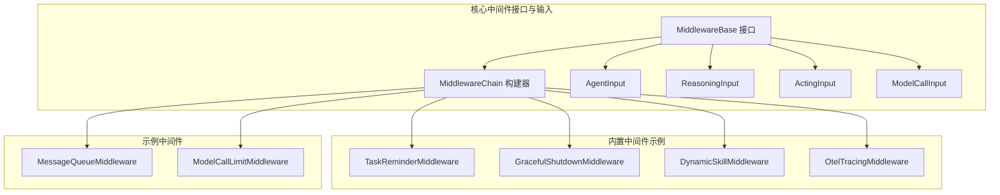

图示来源
- [MiddlewareBase.java:1-144](file://agentscope-core/src/main/java/io/agentscope/core/middleware/MiddlewareBase.java#L1-L144)
- [MiddlewareChain.java:1-79](file://agentscope-core/src/main/java/io/agentscope/core/middleware/MiddlewareChain.java#L1-L79)
- [AgentInput.java:1-27](file://agentscope-core/src/main/java/io/agentscope/core/middleware/AgentInput.java#L1-L27)
- [ReasoningInput.java:1-31](file://agentscope-core/src/main/java/io/agentscope/core/middleware/ReasoningInput.java#L1-L31)
- [ActingInput.java:1-27](file://agentscope-core/src/main/java/io/agentscope/core/middleware/ActingInput.java#L1-L27)
- [ModelCallInput.java:1-34](file://agentscope-core/src/main/java/io/agentscope/core/middleware/ModelCallInput.java#L1-L34)
- [TaskReminderMiddleware.java:1-129](file://agentscope-core/src/main/java/io/agentscope/core/middleware/TaskReminderMiddleware.java#L1-L129)
- [GracefulShutdownMiddleware.java:1-97](file://agentscope-core/src/main/java/io/agentscope/core/shutdown/GracefulShutdownMiddleware.java#L1-L97)
- [DynamicSkillMiddleware.java:1-353](file://agentscope-core/src/main/java/io/agentscope/core/skill/DynamicSkillMiddleware.java#L1-L353)
- [OtelTracingMiddleware.java:1-256](file://agentscope-core/src/main/java/io/agentscope/core/tracing/OtelTracingMiddleware.java#L1-L256)
- [MessageQueueMiddleware.java:1-106](file://agentscope-examples/agents/agentscope-codingagent/src/main/java/io/agentscope/harness/coding/middleware/MessageQueueMiddleware.java#L1-L106)
- [ModelCallLimitMiddleware.java:1-73](file://agentscope-examples/agents/agentscope-codingagent/src/main/java/io/agentscope/harness/coding/middleware/ModelCallLimitMiddleware.java#L1-L73)

章节来源
- [MiddlewareBase.java:1-144](file://agentscope-core/src/main/java/io/agentscope/core/middleware/MiddlewareBase.java#L1-L144)
- [MiddlewareChain.java:1-79](file://agentscope-core/src/main/java/io/agentscope/core/middleware/MiddlewareChain.java#L1-L79)

## 核心组件
- 中间件接口：定义五类拦截点（onAgent/onReasoning/onActing/onModelCall）与一类转换管道（onSystemPrompt），默认实现透传到下一个中间件或核心逻辑，便于按需覆盖。
- 中间件链构建器：按注册顺序反向包裹，形成洋葱式调用链，确保外层先“进入”，后“退出”；系统提示管道则按顺序串联。
- 输入上下文：针对不同拦截点提供专用输入对象，保证中间件只关注自身职责范围内的数据。

章节来源
- [MiddlewareBase.java:25-142](file://agentscope-core/src/main/java/io/agentscope/core/middleware/MiddlewareBase.java#L25-L142)
- [MiddlewareChain.java:25-77](file://agentscope-core/src/main/java/io/agentscope/core/middleware/MiddlewareChain.java#L25-L77)
- [AgentInput.java:21-26](file://agentscope-core/src/main/java/io/agentscope/core/middleware/AgentInput.java#L21-L26)
- [ReasoningInput.java:23-30](file://agentscope-core/src/main/java/io/agentscope/core/middleware/ReasoningInput.java#L23-L30)
- [ActingInput.java:21-26](file://agentscope-core/src/main/java/io/agentscope/core/middleware/ActingInput.java#L21-L26)
- [ModelCallInput.java:24-33](file://agentscope-core/src/main/java/io/agentscope/core/middleware/ModelCallInput.java#L24-L33)

## 架构总览
中间件采用“洋葱模式”与“管道模式”的组合：
- 洋葱模式：onAgent/onReasoning/onActing/onModelCall 四类钩子通过链式包裹，形成可叠加的横切逻辑。
- 管道模式：onSystemPrompt 串行处理，前一中间件输出作为下一中间件输入，最终注入系统提示。

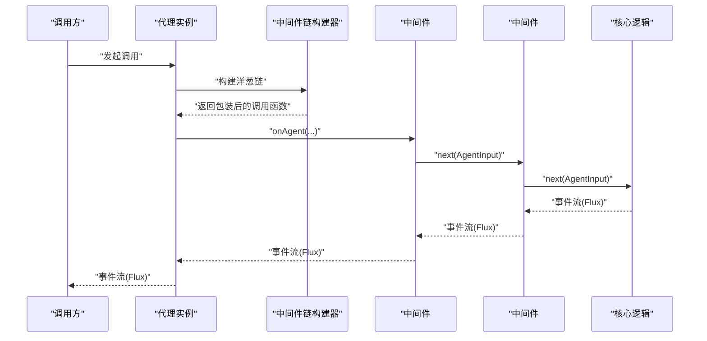

图示来源
- [MiddlewareChain.java:46-62](file://agentscope-core/src/main/java/io/agentscope/core/middleware/MiddlewareChain.java#L46-L62)
- [MiddlewareBase.java:69-127](file://agentscope-core/src/main/java/io/agentscope/core/middleware/MiddlewareBase.java#L69-L127)

## 详细组件分析

### 中间件接口与链式构建
- 设计要点
  - 默认实现直接透传，避免强制实现所有钩子
  - 洋葱链从后向前构建，注册顺序即外层优先
  - 系统提示管道顺序执行，前一结果作为后一输入
- 典型用法
  - 在 onReasoning 中插入日志、限流、权限校验
  - 在 onModelCall 中注入额外消息或参数
  - 在 onSystemPrompt 中拼接技能说明或任务提醒

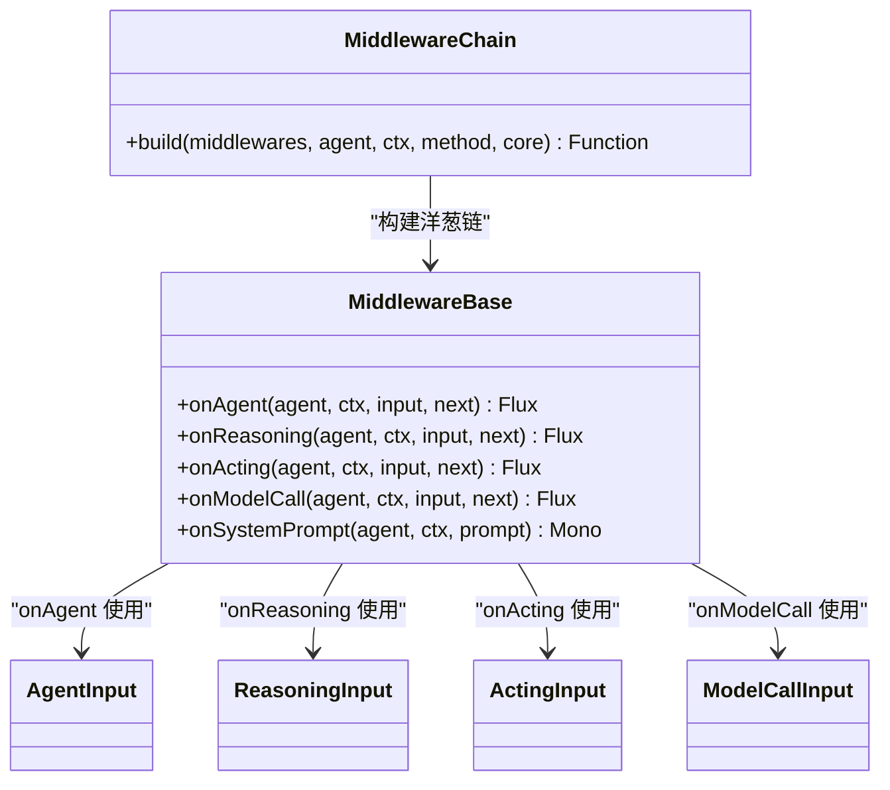

图示来源
- [MiddlewareBase.java:59-142](file://agentscope-core/src/main/java/io/agentscope/core/middleware/MiddlewareBase.java#L59-L142)
- [MiddlewareChain.java:31-77](file://agentscope-core/src/main/java/io/agentscope/core/middleware/MiddlewareChain.java#L31-L77)
- [AgentInput.java:21-26](file://agentscope-core/src/main/java/io/agentscope/core/middleware/AgentInput.java#L21-L26)
- [ReasoningInput.java:23-30](file://agentscope-core/src/main/java/io/agentscope/core/middleware/ReasoningInput.java#L23-L30)
- [ActingInput.java:21-26](file://agentscope-core/src/main/java/io/agentscope/core/middleware/ActingInput.java#L21-L26)
- [ModelCallInput.java:24-33](file://agentscope-core/src/main/java/io/agentscope/core/middleware/ModelCallInput.java#L24-L33)

章节来源
- [MiddlewareBase.java:25-142](file://agentscope-core/src/main/java/io/agentscope/core/middleware/MiddlewareBase.java#L25-L142)
- [MiddlewareChain.java:25-77](file://agentscope-core/src/main/java/io/agentscope/core/middleware/MiddlewareChain.java#L25-L77)

### 任务提醒中间件（系统提示+推理注入）
- 能力概述
  - onSystemPrompt：一次性注入“待办写入工具”的使用说明
  - onReasoning：每次推理前注入当前任务清单的临时提醒，确保模型始终看到最新状态
- 关键特性
  - 提醒消息标记为合成且仅临时注入，不持久化
  - 与会话状态解耦，即使对话压缩后也能持续生效

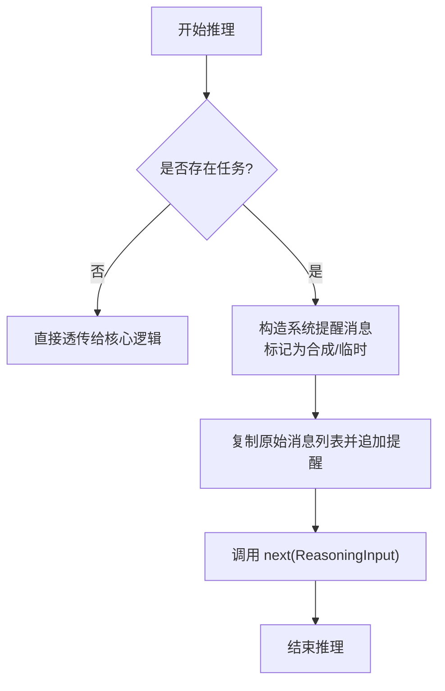

图示来源
- [TaskReminderMiddleware.java:74-100](file://agentscope-core/src/main/java/io/agentscope/core/middleware/TaskReminderMiddleware.java#L74-L100)

章节来源
- [TaskReminderMiddleware.java:33-129](file://agentscope-core/src/main/java/io/agentscope/core/middleware/TaskReminderMiddleware.java#L33-L129)

### 动态技能中间件（系统提示管道）
- 能力概述
  - onSystemPrompt：动态合并多个仓库的技能，按优先级去重，生成技能提示并拼接到系统提示
  - 支持运行时可见性过滤、工作目录稳定化、文件上传、签名缓存等优化
- 关键特性
  - 按调用重建技能视图，支持用户隔离与市场集成
  - 内容指纹短路：相同内容复用上次构建结果，降低开销

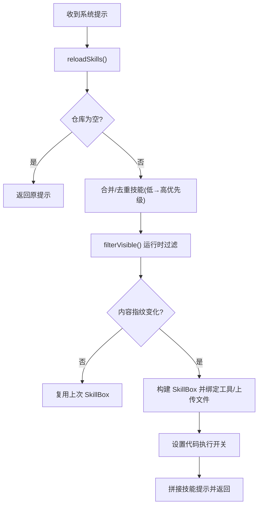

图示来源
- [DynamicSkillMiddleware.java:122-137](file://agentscope-core/src/main/java/io/agentscope/core/skill/DynamicSkillMiddleware.java#L122-L137)
- [DynamicSkillMiddleware.java:160-250](file://agentscope-core/src/main/java/io/agentscope/core/skill/DynamicSkillMiddleware.java#L160-L250)

章节来源
- [DynamicSkillMiddleware.java:39-137](file://agentscope-core/src/main/java/io/agentscope/core/skill/DynamicSkillMiddleware.java#L39-L137)
- [DynamicSkillMiddleware.java:160-353](file://agentscope-core/src/main/java/io/agentscope/core/skill/DynamicSkillMiddleware.java#L160-L353)

### 优雅停机中间件（生命周期安全点）
- 能力概述
  - onReasoning/onActing 完成后进行中断检查，允许在安全点中断，避免浪费输出 token
  - 通过 Reactor 上下文读取请求 ID，独立跟踪并发调用
- 关键特性
  - 注册/注销在 AgentBase.call() 中完成，保证每个请求都会清理
  - 仅在全局停机超时后才强制中断

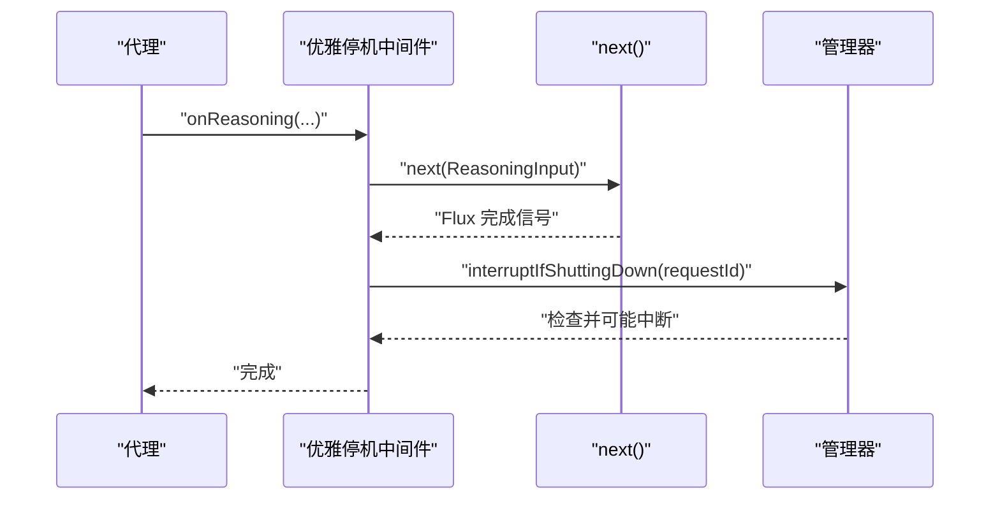

图示来源
- [GracefulShutdownMiddleware.java:63-91](file://agentscope-core/src/main/java/io/agentscope/core/shutdown/GracefulShutdownMiddleware.java#L63-L91)

章节来源
- [GracefulShutdownMiddleware.java:30-97](file://agentscope-core/src/main/java/io/agentscope/core/shutdown/GracefulShutdownMiddleware.java#L30-L97)

### OpenTelemetry 可观测性中间件
- 能力概述
  - 为代理调用、模型聊天、工具执行分别创建 Span
  - 记录 gen_ai 属性与用量信息，错误时记录异常
- 关键特性
  - 无 OTel 配置时近零开销（no-op provider）
  - 通过 defer 和 Scope 管理 Span 生命周期

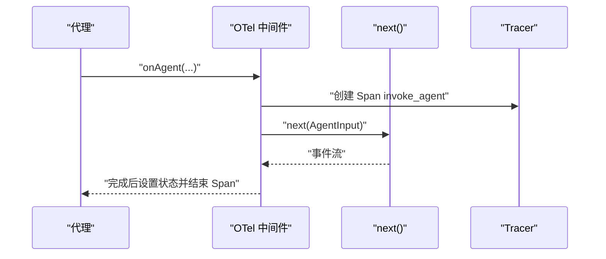

图示来源
- [OtelTracingMiddleware.java:78-124](file://agentscope-core/src/main/java/io/agentscope/core/tracing/OtelTracingMiddleware.java#L78-L124)

章节来源
- [OtelTracingMiddleware.java:40-256](file://agentscope-core/src/main/java/io/agentscope/core/tracing/OtelTracingMiddleware.java#L40-L256)

### 示例：消息队列中间件（系统提示注入）
- 能力概述
  - 从存储中拉取线程队列消息，注入到系统提示并在注入后清空
  - 通过 ThreadLocal 传递当前线程 ID，要求调用方在入口设置/移除
- 关键特性
  - 失败时记录告警并回退到原提示
  - 限制单次注入数量，避免过长提示

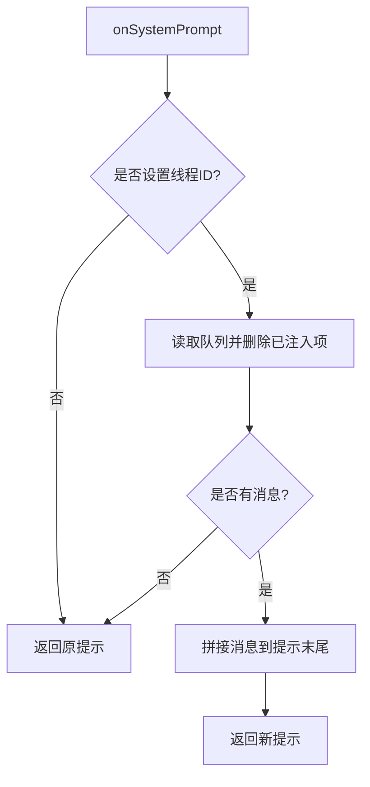

图示来源
- [MessageQueueMiddleware.java:66-82](file://agentscope-examples/agents/agentscope-codingagent/src/main/java/io/agentscope/harness/coding/middleware/MessageQueueMiddleware.java#L66-L82)

章节来源
- [MessageQueueMiddleware.java:28-106](file://agentscope-examples/agents/agentscope-codingagent/src/main/java/io/agentscope/harness/coding/middleware/MessageQueueMiddleware.java#L28-L106)

### 示例：模型调用次数限制中间件
- 能力概述
  - 在 onReasoning 钩子中统计全局调用次数，超过阈值立即终止
  - 适用于资源配额或成本控制场景
- 关键特性
  - 原子计数，跨线程安全
  - 提供查询接口用于监控

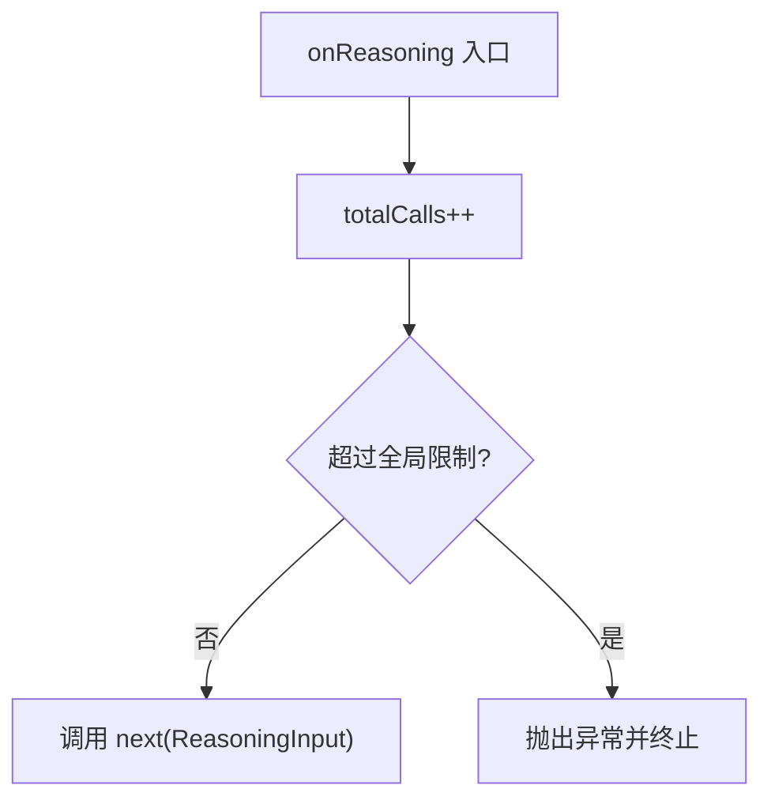

图示来源
- [ModelCallLimitMiddleware.java:50-67](file://agentscope-examples/agents/agentscope-codingagent/src/main/java/io/agentscope/harness/coding/middleware/ModelCallLimitMiddleware.java#L50-L67)

章节来源
- [ModelCallLimitMiddleware.java:29-73](file://agentscope-examples/agents/agentscope-codingagent/src/main/java/io/agentscope/harness/coding/middleware/ModelCallLimitMiddleware.java#L29-L73)

### 中间件链配置与执行顺序
- 注册顺序即洋葱外层优先，测试验证了“外层先进入、后退出”的洋葱顺序
- 系统提示管道严格顺序执行，前一中间件输出作为下一中间件输入

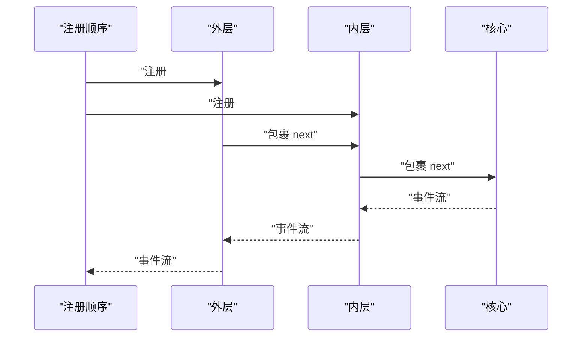

图示来源
- [ReActAgentMiddlewareIntegrationTest.java:161-178](file://agentscope-core/src/test/java/io/agentscope/core/agent/ReActAgentMiddlewareIntegrationTest.java#L161-L178)

章节来源
- [ReActAgentMiddlewareIntegrationTest.java:143-195](file://agentscope-core/src/test/java/io/agentscope/core/agent/ReActAgentMiddlewareIntegrationTest.java#L143-L195)

### 工厂化装配（类型驱动）
- 通过类型字符串与属性映射，动态实例化中间件
- 未知类型返回 404 风格的异常，与工具/模型/技能工厂一致

章节来源
- [MiddlewareFactory.java:13-41](file://agentscope-builder-saton/src/main/java/io/agentscope/builder/saton/factory/middleware/MiddlewareFactory.java#L13-L41)

## 依赖分析
- 组件内聚与耦合
  - MiddlewareBase 与各中间件松耦合，仅通过接口约定交互
  - MiddlewareChain 仅依赖中间件接口与函数式抽象，保持通用性
  - 具体中间件依赖核心事件、消息、状态与工具集，但通过运行时上下文解耦
- 外部依赖
  - Reactor 用于事件流编排
  - OpenTelemetry（可选）用于可观测性
  - 日志框架用于告警与调试

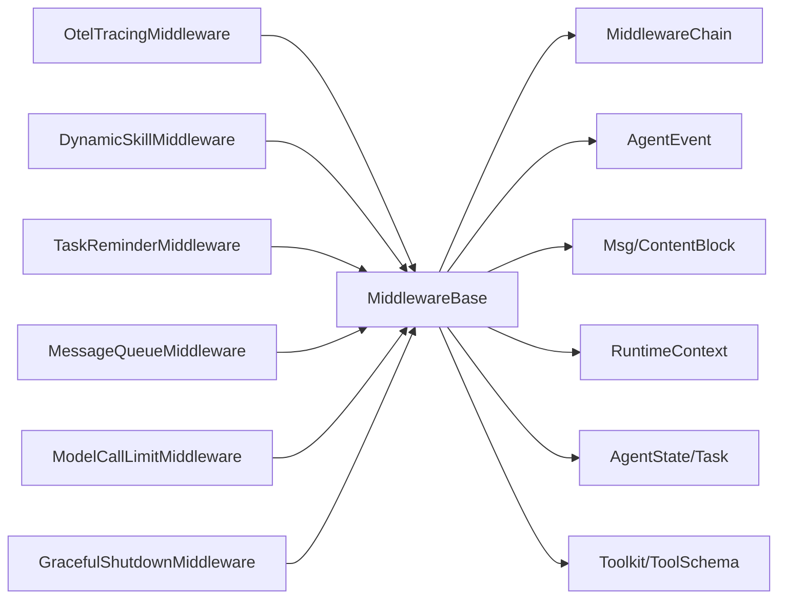

图示来源
- [MiddlewareBase.java:18-23](file://agentscope-core/src/main/java/io/agentscope/core/middleware/MiddlewareBase.java#L18-L23)
- [OtelTracingMiddleware.java:18-29](file://agentscope-core/src/main/java/io/agentscope/core/tracing/OtelTracingMiddleware.java#L18-L29)
- [DynamicSkillMiddleware.java:18-22](file://agentscope-core/src/main/java/io/agentscope/core/skill/DynamicSkillMiddleware.java#L18-L22)
- [TaskReminderMiddleware.java:18-25](file://agentscope-core/src/main/java/io/agentscope/core/middleware/TaskReminderMiddleware.java#L18-L25)
- [MessageQueueMiddleware.java:18-22](file://agentscope-examples/agents/agentscope-codingagent/src/main/java/io/agentscope/harness/coding/middleware/MessageQueueMiddleware.java#L18-L22)
- [ModelCallLimitMiddleware.java:18-22](file://agentscope-examples/agents/agentscope-codingagent/src/main/java/io/agentscope/harness/coding/middleware/ModelCallLimitMiddleware.java#L18-L22)
- [GracefulShutdownMiddleware.java:18-24](file://agentscope-core/src/main/java/io/agentscope/core/shutdown/GracefulShutdownMiddleware.java#L18-L24)

## 性能考量
- 中间件链构建
  - 构建过程为 O(n)，n 为中间件数量；建议按需注册，避免冗余
- 系统提示管道
  - 动态技能中间件采用内容指纹短路，避免重复构建；注意工作目录稳定性与文件上传开销
- 事件流
  - 使用 Reactor 的 defer/doOn 等操作减少不必要的订阅与副作用
- 可观测性
  - 无 OTel 配置时中间件近零开销；启用时合理设置采样策略
- 资源控制
  - 模型调用限制中间件提供全局计数，结合熔断策略防止资源耗尽

## 故障排查指南
- 中间件未生效
  - 检查注册顺序与链构建是否正确
  - 确认 onAgent/onReasoning/onActing/onModelCall 是否被覆盖
- 系统提示异常
  - 动态技能中间件在仓库加载失败时会记录告警并跳过；检查仓库可用性与可见性过滤
- 优雅停机未触发
  - 确认请求上下文中存在请求 ID 键；检查管理器状态与超时配置
- 可观测性缺失
  - 确认已初始化 OTel SDK；确认 Span 名称与属性键一致
- 调用限制误伤
  - 检查全局计数器状态与阈值配置；必要时调整或分环境区分

章节来源
- [DynamicSkillMiddleware.java:169-177](file://agentscope-core/src/main/java/io/agentscope/core/skill/DynamicSkillMiddleware.java#L169-L177)
- [GracefulShutdownMiddleware.java:93-95](file://agentscope-core/src/main/java/io/agentscope/core/shutdown/GracefulShutdownMiddleware.java#L93-L95)
- [OtelTracingMiddleware.java:50-53](file://agentscope-core/src/main/java/io/agentscope/core/tracing/OtelTracingMiddleware.java#L50-L53)
- [ModelCallLimitMiddleware.java:56-67](file://agentscope-examples/agents/agentscope-codingagent/src/main/java/io/agentscope/harness/coding/middleware/ModelCallLimitMiddleware.java#L56-L67)

## 结论
AgentScope Java 的中间件体系以简洁接口与灵活链式组合为核心，既支持在关键生命周期节点注入横切能力，又能在系统提示阶段进行顺序化增强。通过内置示例与工厂化装配，你可以快速扩展出满足复杂业务场景的中间件，实现日志、限流、可观测性、权限与任务管理等多样化需求。

## 附录
- 最佳实践
  - 仅覆盖必要的钩子，保持中间件单一职责
  - 在系统提示管道中谨慎拼接文本，避免过长提示影响模型效果
  - 对昂贵操作（如文件上传、外部仓库访问）进行缓存与短路
  - 使用 Reactor 的背压与错误处理机制，确保事件流稳定
- 常见场景
  - 权限检查：在 onReasoning/onActing 中校验用户与工具权限
  - 日志审计：在 onAgent/onReasoning/onActing 中记录关键事件
  - 成本控制：在 onModelCall 中注入配额与用量统计
  - 任务对齐：在 onReasoning 中注入任务提醒，保持上下文一致性