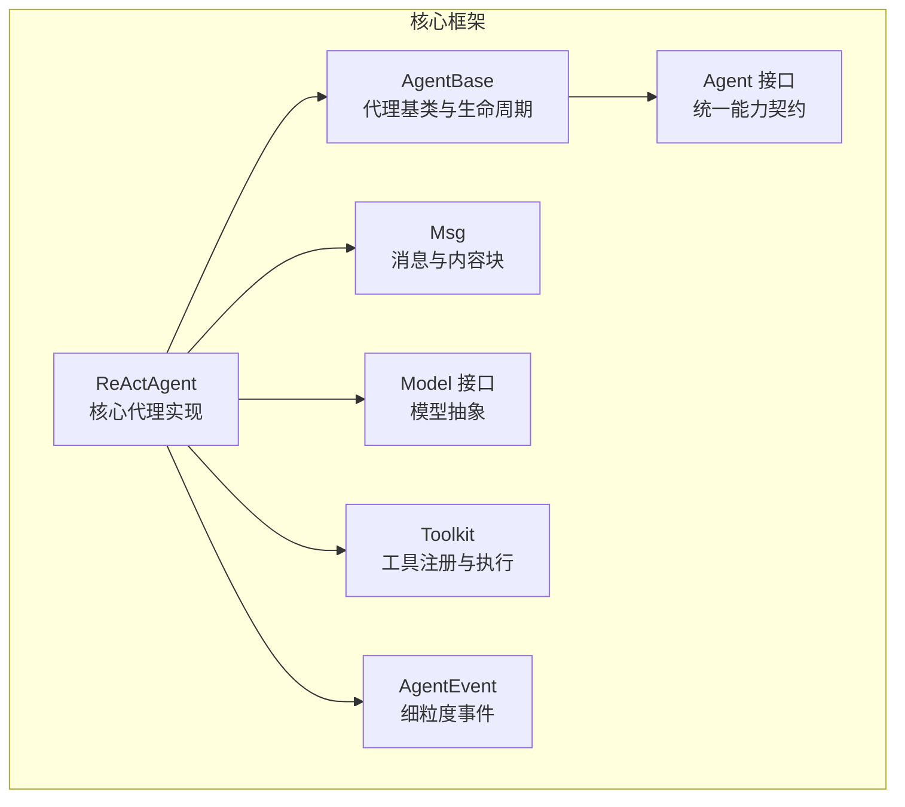
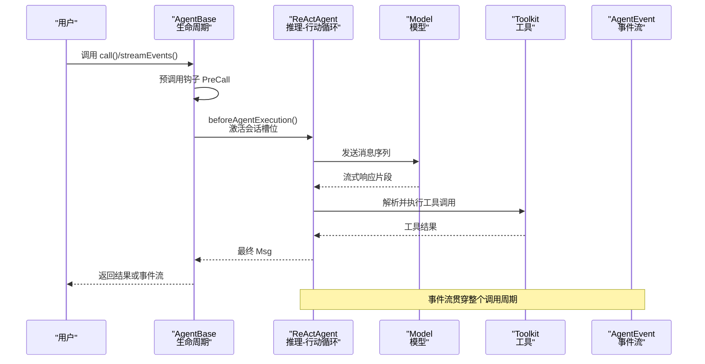
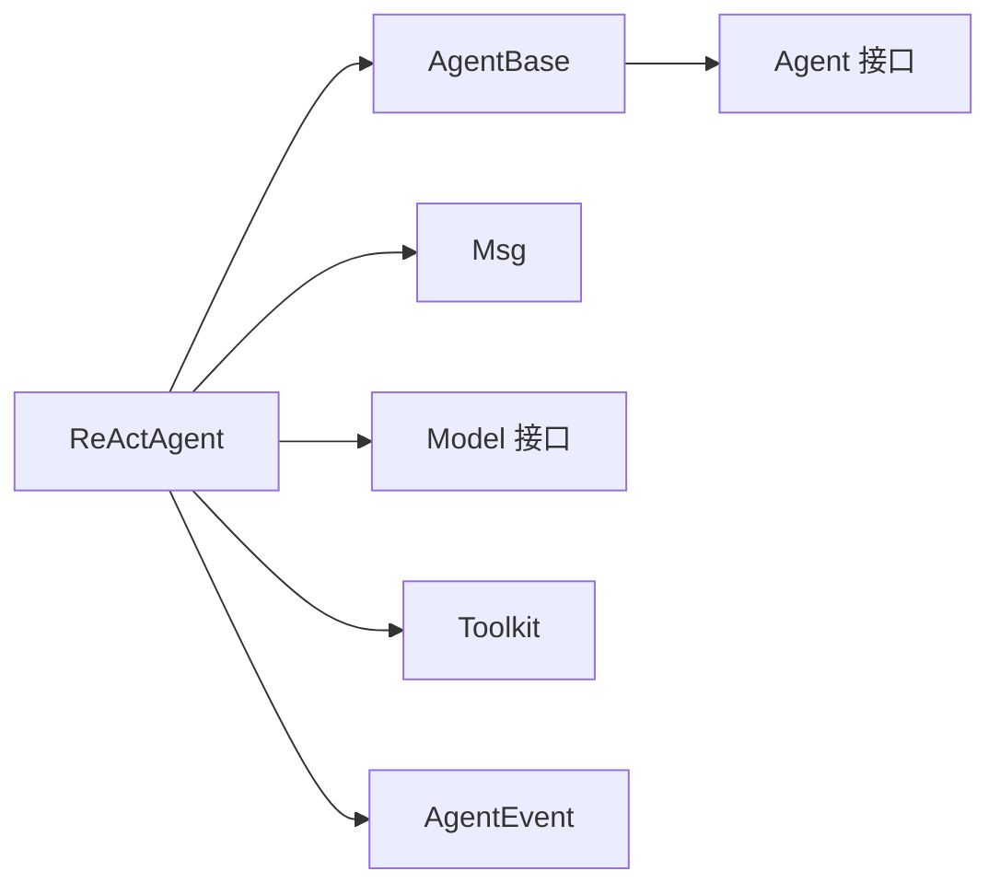

# 基础示例

<cite>
**本文引用的文件**
- [ReActAgent.java](file://agentscope-core/src/main/java/io/agentscope/core/ReActAgent.java)
- [Agent.java](file://agentscope-core/src/main/java/io/agentscope/core/agent/Agent.java)
- [AgentBase.java](file://agentscope-core/src/main/java/io/agentscope/core/agent/AgentBase.java)
- [Msg.java](file://agentscope-core/src/main/java/io/agentscope/core/message/Msg.java)
- [Model.java](file://agentscope-core/src/main/java/io/agentscope/core/model/Model.java)
- [Toolkit.java](file://agentscope-core/src/main/java/io/agentscope/core/tool/Toolkit.java)
- [AgentEvent.java](file://agentscope-core/src/main/java/io/agentscope/core/event/AgentEvent.java)
- [SubagentStreamingExample.java](file://agentscope-examples/documentation/src/main/java/io/agentscope/examples/documentation2/harness/subagent/SubagentStreamingExample.java)
- [ContextStatePersistenceExample.java](file://agentscope-examples/documentation/src/main/java/io/agentscope/examples/documentation2/harness/context/ContextStatePersistenceExample.java)
- [MemoryCompactionExample.java](file://agentscope-examples/documentation/src/main/java/io/agentscope/examples/documentation2/harness/memory/MemoryCompactionExample.java)
</cite>

## 目录
1. [简介](#简介)
2. [项目结构](#项目结构)
3. [核心组件](#核心组件)
4. [架构总览](#架构总览)
5. [详细组件分析](#详细组件分析)
6. [依赖分析](#依赖分析)
7. [性能考虑](#性能考虑)
8. [故障排查指南](#故障排查指南)
9. [结论](#结论)
10. [附录](#附录)

## 简介
本教程面向初学者，带你用最简单的方式体验 AgentScope Java 的“代理（Agent）”能力：从“基本聊天对话”到“多轮对话交互”，再到“流式响应处理”。你将学会如何：
- 创建一个 ReActAgent 并进行一次基本的单轮对话；
- 使用 RuntimeContext 实现多轮会话与状态持久化；
- 通过事件流（streamEvents）实现流式响应与中间态观察；
- 理解消息格式（Msg）、模型接口（Model）与工具（Toolkit）在代理中的角色。

本教程不直接给出代码片段，而是以“路径+行号”的形式指引你到仓库中的具体实现位置，帮助你在真实代码中对照学习。

## 项目结构
AgentScope Java 将“代理”“消息”“模型”“工具”“事件”等核心概念分层组织，便于扩展与组合。下图展示了与本教程相关的核心模块及其关系：

图表来源
- [ReActAgent.java](file://agentscope-core/src/main/java/io/agentscope/core/ReActAgent.java)
- [AgentBase.java](file://agentscope-core/src/main/java/io/agentscope/core/agent/AgentBase.java)
- [Agent.java](file://agentscope-core/src/main/java/io/agentscope/core/agent/Agent.java)
- [Msg.java](file://agentscope-core/src/main/java/io/agentscope/core/message/Msg.java)
- [Model.java](file://agentscope-core/src/main/java/io/agentscope/core/model/Model.java)
- [Toolkit.java](file://agentscope-core/src/main/java/io/agentscope/core/tool/Toolkit.java)
- [AgentEvent.java](file://agentscope-core/src/main/java/io/agentscope/core/event/AgentEvent.java)

章节来源
- [ReActAgent.java](file://agentscope-core/src/main/java/io/agentscope/core/ReActAgent.java)
- [AgentBase.java](file://agentscope-core/src/main/java/io/agentscope/core/agent/AgentBase.java)
- [Agent.java](file://agentscope-core/src/main/java/io/agentscope/core/agent/Agent.java)
- [Msg.java](file://agentscope-core/src/main/java/io/agentscope/core/message/Msg.java)
- [Model.java](file://agentscope-core/src/main/java/io/agentscope/core/model/Model.java)
- [Toolkit.java](file://agentscope-core/src/main/java/io/agentscope/core/tool/Toolkit.java)
- [AgentEvent.java](file://agentscope-core/src/main/java/io/agentscope/core/event/AgentEvent.java)

## 核心组件
- ReActAgent：遵循“推理-行动”循环的智能体，支持多轮对话、工具调用、权限与中断控制、事件流等高级特性。
- AgentBase：提供统一的生命周期（预调用钩子、实际调用、后置钩子、错误处理、中断处理）。
- Agent 接口：定义代理的统一能力边界（可调用、可流式、可观测）。
- Msg：消息载体，包含角色（用户/助手/系统/工具）、内容块（文本/数据/思考/工具调用/工具结果）与元数据。
- Model：模型抽象，负责将消息序列转换为响应流。
- Toolkit：工具注册、分组、Schema 生成与执行的中枢。
- AgentEvent：细粒度事件类型集合，用于观察代理内部状态变化。

章节来源
- [ReActAgent.java](file://agentscope-core/src/main/java/io/agentscope/core/ReActAgent.java)
- [AgentBase.java](file://agentscope-core/src/main/java/io/agentscope/core/agent/AgentBase.java)
- [Agent.java](file://agentscope-core/src/main/java/io/agentscope/core/agent/Agent.java)
- [Msg.java](file://agentscope-core/src/main/java/io/agentscope/core/message/Msg.java)
- [Model.java](file://agentscope-core/src/main/java/io/agentscope/core/model/Model.java)
- [Toolkit.java](file://agentscope-core/src/main/java/io/agentscope/core/tool/Toolkit.java)
- [AgentEvent.java](file://agentscope-core/src/main/java/io/agentscope/core/event/AgentEvent.java)

## 架构总览
下面的时序图展示了从“用户发起请求”到“代理返回最终消息”的完整流程，以及事件流的产生过程：

图表来源
- [AgentBase.java](file://agentscope-core/src/main/java/io/agentscope/core/agent/AgentBase.java)
- [ReActAgent.java](file://agentscope-core/src/main/java/io/agentscope/core/ReActAgent.java)
- [Model.java](file://agentscope-core/src/main/java/io/agentscope/core/model/Model.java)
- [Toolkit.java](file://agentscope-core/src/main/java/io/agentscope/core/tool/Toolkit.java)
- [AgentEvent.java](file://agentscope-core/src/main/java/io/agentscope/core/event/AgentEvent.java)

## 详细组件分析

### 基础聊天对话（单轮）
目标：用 ReActAgent 完成一次基本的“用户提问—模型回答”的单轮对话，并打印最终消息。

关键步骤与对应源码位置
- 准备消息：构造 Msg（角色为用户，内容为文本块），参考 [Msg.java](file://agentscope-core/src/main/java/io/agentscope/core/message/Msg.java)。
- 创建模型：实现 Model 接口或使用框架内置实现，参考 [Model.java](file://agentscope-core/src/main/java/io/agentscope/core/model/Model.java)。
- 构建代理：使用 ReActAgent.Builder 设置名称、系统提示、模型与最大迭代次数，参考 [ReActAgent.java](file://agentscope-core/src/main/java/io/agentscope/core/ReActAgent.java)。
- 调用代理：调用 call() 获取最终 Msg，参考 [AgentBase.java](file://agentscope-core/src/main/java/io/agentscope/core/agent/AgentBase.java)。

运行要点
- 单轮对话只需一次 call() 调用，无需多轮上下文。
- 若需观察中间态，可改用 streamEvents() 获取事件流，参考后续“流式响应处理”。

章节来源
- [Msg.java](file://agentscope-core/src/main/java/io/agentscope/core/message/Msg.java)
- [Model.java](file://agentscope-core/src/main/java/io/agentscope/core/model/Model.java)
- [ReActAgent.java](file://agentscope-core/src/main/java/io/agentscope/core/ReActAgent.java)
- [AgentBase.java](file://agentscope-core/src/main/java/io/agentscope/core/agent/AgentBase.java)

### 多轮对话交互（RuntimeContext 与会话槽位）
目标：在同一代理实例上，通过不同的 RuntimeContext 实现“多用户/多会话”的隔离与持久化。

关键步骤与对应源码位置
- 构造 RuntimeContext：设置 userId 与 sessionId，作为会话标识，参考 [ContextStatePersistenceExample.java](file://agentscope-examples/documentation/src/main/java/io/agentscope/examples/documentation2/harness/context/ContextStatePersistenceExample.java)。
- ReActAgent 激活会话槽位：beforeAgentExecution() 中根据 RuntimeContext 决定会话槽位，参考 [ReActAgent.java](file://agentscope-core/src/main/java/io/agentscope/core/ReActAgent.java)。
- 多轮调用：同一代理实例可并发处理不同会话，内部通过“会话槽位”隔离状态，参考 [AgentBase.java](file://agentscope-core/src/main/java/io/agentscope/core/agent/AgentBase.java)。
- 状态持久化：结合 AgentStateStore 在会话结束时保存状态，参考 [ContextStatePersistenceExample.java](file://agentscope-examples/documentation/src/main/java/io/agentscope/examples/documentation2/harness/context/ContextStatePersistenceExample.java)。

运行要点
- 不同 sessionId 对应独立的历史记录与工具激活状态。
- 同一 userId 下的不同 sessionId 是完全隔离的。

章节来源
- [ReActAgent.java](file://agentscope-core/src/main/java/io/agentscope/core/ReActAgent.java)
- [AgentBase.java](file://agentscope-core/src/main/java/io/agentscope/core/agent/AgentBase.java)
- [ContextStatePersistenceExample.java](file://agentscope-examples/documentation/src/main/java/io/agentscope/examples/documentation2/harness/context/ContextStatePersistenceExample.java)

### 流式响应处理（streamEvents 与事件观察）
目标：实时观察代理内部状态变化（模型调用开始/结束、文本增量、工具调用、工具结果等）。

关键步骤与对应源码位置
- 使用 streamEvents() 获取事件流，参考 [AgentBase.java](file://agentscope-core/src/main/java/io/agentscope/core/agent/AgentBase.java)。
- 事件类型：AgentStartEvent、TextBlockDeltaEvent、ToolCallStartEvent、ToolResultEndEvent、AgentEndEvent 等，参考 [AgentEvent.java](file://agentscope-core/src/main/java/io/agentscope/core/event/AgentEvent.java)。
- 子代理事件转发：父代理可接收子代理的事件并区分来源，参考 [SubagentStreamingExample.java](file://agentscope-examples/documentation/src/main/java/io/agentscope/examples/documentation2/harness/subagent/SubagentStreamingExample.java)。
- 记忆压缩示例：展示如何通过事件观察记忆压缩触发点，参考 [MemoryCompactionExample.java](file://agentscope-examples/documentation/src/main/java/io/agentscope/examples/documentation2/harness/memory/MemoryCompactionExample.java)。

运行要点
- 事件流是“非阻塞、可观察”的，适合构建前端实时 UI 或日志追踪。
- 可通过事件中的元数据与来源字段进行更精细的控制与展示。

章节来源
- [AgentBase.java](file://agentscope-core/src/main/java/io/agentscope/core/agent/AgentBase.java)
- [AgentEvent.java](file://agentscope-core/src/main/java/io/agentscope/core/event/AgentEvent.java)
- [SubagentStreamingExample.java](file://agentscope-examples/documentation/src/main/java/io/agentscope/examples/documentation2/harness/subagent/SubagentStreamingExample.java)
- [MemoryCompactionExample.java](file://agentscope-examples/documentation/src/main/java/io/agentscope/examples/documentation2/harness/memory/MemoryCompactionExample.java)

### ReActAgent 的基本使用要点
- 构建器模式：通过 builder() 设置 name、sysPrompt、model、toolkit、maxIters 等参数，参考 [ReActAgent.java](file://agentscope-core/src/main/java/io/agentscope/core/ReActAgent.java)。
- 生命周期钩子：PreCall/PostCall/Hook 系统贯穿 call() 执行，参考 [AgentBase.java](file://agentscope-core/src/main/java/io/agentscope/core/agent/AgentBase.java)。
- 工具集成：通过 Toolkit 注册工具，模型侧可读取工具 Schema，参考 [Toolkit.java](file://agentscope-core/src/main/java/io/agentscope/core/tool/Toolkit.java) 与 [Model.java](file://agentscope-core/src/main/java/io/agentscope/core/model/Model.java)。
- 中断与权限：支持 per-session 中断与权限控制，参考 [ReActAgent.java](file://agentscope-core/src/main/java/io/agentscope/core/ReActAgent.java)。

章节来源
- [ReActAgent.java](file://agentscope-core/src/main/java/io/agentscope/core/ReActAgent.java)
- [AgentBase.java](file://agentscope-core/src/main/java/io/agentscope/core/agent/AgentBase.java)
- [Toolkit.java](file://agentscope-core/src/main/java/io/agentscope/core/tool/Toolkit.java)
- [Model.java](file://agentscope-core/src/main/java/io/agentscope/core/model/Model.java)

## 依赖分析
ReActAgent 的核心依赖关系如下：

图表来源
- [ReActAgent.java](file://agentscope-core/src/main/java/io/agentscope/core/ReActAgent.java)
- [AgentBase.java](file://agentscope-core/src/main/java/io/agentscope/core/agent/AgentBase.java)
- [Agent.java](file://agentscope-core/src/main/java/io/agentscope/core/agent/Agent.java)
- [Msg.java](file://agentscope-core/src/main/java/io/agentscope/core/message/Msg.java)
- [Model.java](file://agentscope-core/src/main/java/io/agentscope/core/model/Model.java)
- [Toolkit.java](file://agentscope-core/src/main/java/io/agentscope/core/tool/Toolkit.java)
- [AgentEvent.java](file://agentscope-core/src/main/java/io/agentscope/core/event/AgentEvent.java)

章节来源
- [ReActAgent.java](file://agentscope-core/src/main/java/io/agentscope/core/ReActAgent.java)
- [AgentBase.java](file://agentscope-core/src/main/java/io/agentscope/core/agent/AgentBase.java)
- [Agent.java](file://agentscope-core/src/main/java/io/agentscope/core/agent/Agent.java)
- [Msg.java](file://agentscope-core/src/main/java/io/agentscope/core/message/Msg.java)
- [Model.java](file://agentscope-core/src/main/java/io/agentscope/core/model/Model.java)
- [Toolkit.java](file://agentscope-core/src/main/java/io/agentscope/core/tool/Toolkit.java)
- [AgentEvent.java](file://agentscope-core/src/main/java/io/agentscope/core/event/AgentEvent.java)

## 性能考虑
- 流式处理：优先使用 streamEvents() 以降低首字节延迟，提升用户体验。
- 会话串行化：ReActAgent 会对相同会话的多次调用进行串行化，避免并发写入导致的状态竞争。
- 工具执行：Toolkit 支持并行/串行执行策略，可根据场景调整以平衡吞吐与一致性。
- 状态持久化：合理配置 AgentStateStore 的保存时机，避免频繁 IO 影响性能。

## 故障排查指南
- call() 阻塞问题：仅在示例入口使用 block()，业务逻辑中请使用响应式链路，参考 [AgentBase.java](file://agentscope-core/src/main/java/io/agentscope/core/agent/AgentBase.java)。
- 事件流为空：确认是否正确调用 streamEvents()，并检查事件过滤条件，参考 [AgentEvent.java](file://agentscope-core/src/main/java/io/agentscope/core/event/AgentEvent.java)。
- 工具未生效：检查 Toolkit 是否已注册工具且处于激活组，参考 [Toolkit.java](file://agentscope-core/src/main/java/io/agentscope/core/tool/Toolkit.java)。
- 会话状态异常：核对 RuntimeContext 的 userId 与 sessionId 是否一致，参考 [ReActAgent.java](file://agentscope-core/src/main/java/io/agentscope/core/ReActAgent.java)。

章节来源
- [AgentBase.java](file://agentscope-core/src/main/java/io/agentscope/core/agent/AgentBase.java)
- [AgentEvent.java](file://agentscope-core/src/main/java/io/agentscope/core/event/AgentEvent.java)
- [Toolkit.java](file://agentscope-core/src/main/java/io/agentscope/core/tool/Toolkit.java)
- [ReActAgent.java](file://agentscope-core/src/main/java/io/agentscope/core/ReActAgent.java)

## 结论
通过本教程，你已经掌握了：
- 如何用 ReActAgent 进行一次基本聊天对话；
- 如何借助 RuntimeContext 实现多轮对话与会话隔离；
- 如何通过事件流观察代理内部状态变化；
- 如何理解消息、模型与工具在代理中的协作关系。

建议在实际项目中：
- 使用 streamEvents() 构建实时 UI；
- 通过 Toolkit 动态管理工具组；
- 利用 RuntimeContext 与状态存储实现多用户隔离与会话恢复。

## 附录
- 示例参考
  - 多轮会话与状态持久化：[ContextStatePersistenceExample.java](file://agentscope-examples/documentation/src/main/java/io/agentscope/examples/documentation2/harness/context/ContextStatePersistenceExample.java)
  - 子代理事件转发：[SubagentStreamingExample.java](file://agentscope-examples/documentation/src/main/java/io/agentscope/examples/documentation2/harness/subagent/SubagentStreamingExample.java)
  - 记忆压缩与长期记忆：[MemoryCompactionExample.java](file://agentscope-examples/documentation/src/main/java/io/agentscope/examples/documentation2/harness/memory/MemoryCompactionExample.java)