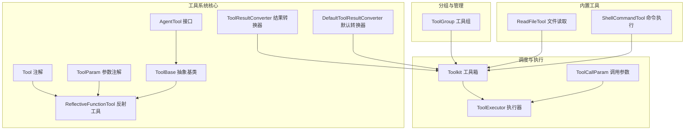
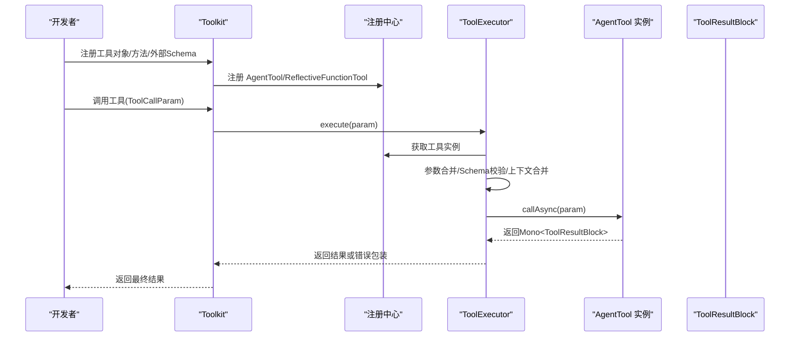
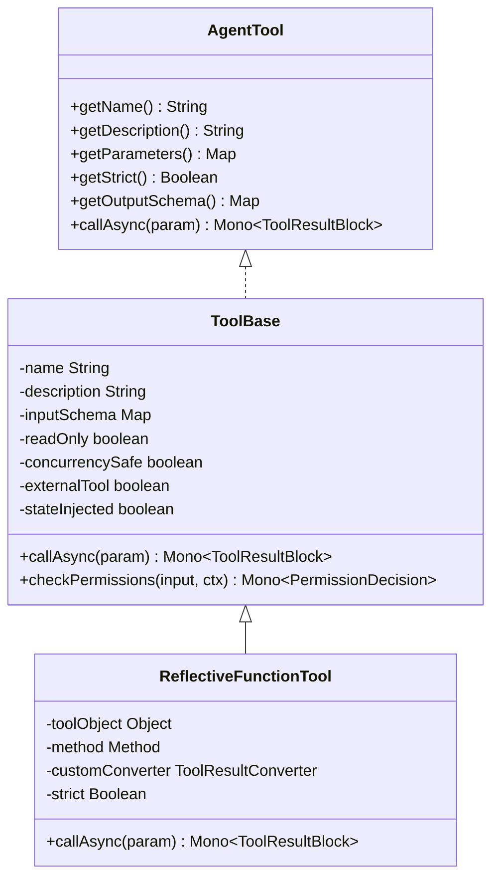
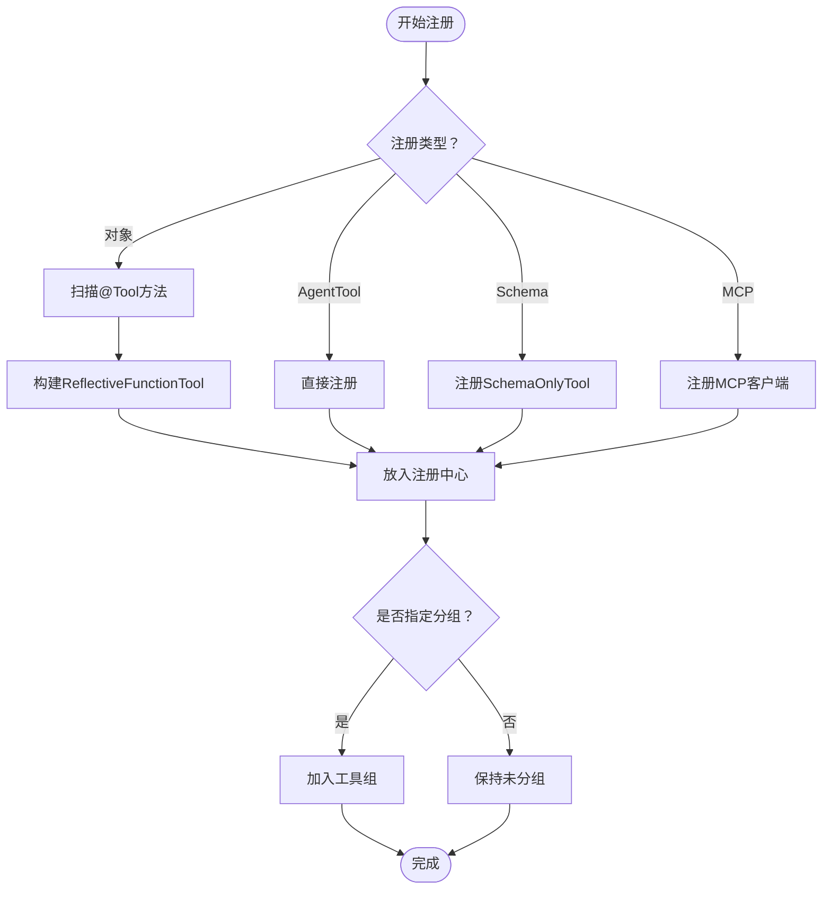
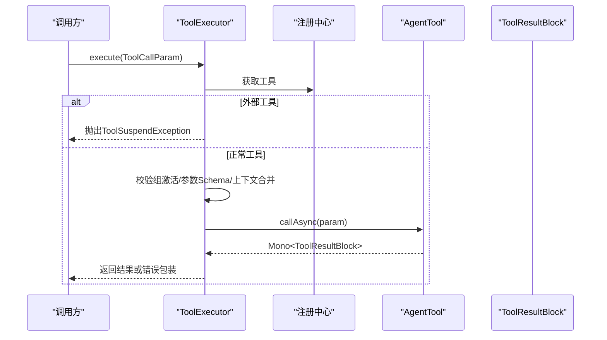
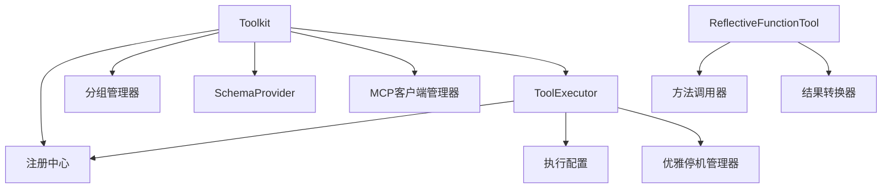

# 工具使用示例

<cite>
**本文引用的文件**
- [Tool.java](file://agentscope-core/src/main/java/io/agentscope/core/tool/Tool.java)
- [ToolParam.java](file://agentscope-core/src/main/java/io/agentscope/core/tool/ToolParam.java)
- [ToolBase.java](file://agentscope-core/src/main/java/io/agentscope/core/tool/ToolBase.java)
- [AgentTool.java](file://agentscope-core/src/main/java/io/agentscope/core/tool/AgentTool.java)
- [Toolkit.java](file://agentscope-core/src/main/java/io/agentscope/core/tool/Toolkit.java)
- [ToolCallParam.java](file://agentscope-core/src/main/java/io/agentscope/core/tool/ToolCallParam.java)
- [ReflectiveFunctionTool.java](file://agentscope-core/src/main/java/io/agentscope/core/tool/ReflectiveFunctionTool.java)
- [ToolGroup.java](file://agentscope-core/src/main/java/io/agentscope/core/tool/ToolGroup.java)
- [ToolExecutor.java](file://agentscope-core/src/main/java/io/agentscope/core/tool/ToolExecutor.java)
- [ToolResultConverter.java](file://agentscope-core/src/main/java/io/agentscope/core/tool/ToolResultConverter.java)
- [DefaultToolResultConverter.java](file://agentscope-core/src/main/java/io/agentscope/core/tool/DefaultToolResultConverter.java)
- [ReadFileTool.java](file://agentscope-core/src/main/java/io/agentscope/core/tool/file/ReadFileTool.java)
- [ShellCommandTool.java](file://agentscope-core/src/main/java/io/agentscope/core/tool/coding/ShellCommandTool.java)
</cite>

## 目录
1. [简介](#简介)
2. [项目结构](#项目结构)
3. [核心组件](#核心组件)
4. [架构总览](#架构总览)
5. [详细组件分析](#详细组件分析)
6. [依赖分析](#依赖分析)
7. [性能考虑](#性能考虑)
8. [故障排查指南](#故障排查指南)
9. [结论](#结论)
10. [附录](#附录)

## 简介
本教程面向需要扩展代理能力的开发者，系统讲解 AgentScope Java 的工具系统使用方法，涵盖：
- 自定义工具开发：注解与参数规范、返回值处理、结果转换器
- 工具调用机制：参数封装、执行上下文、权限与安全校验
- 工具组管理：分组激活、动态控制、元工具
- 工具执行流程：单次与批量执行、超时重试、并发安全
- 内置工具示例：文件读取、命令执行等
- 最佳实践与常见问题

## 项目结构
工具系统位于 agentscope-core 模块的 io.agentscope.core.tool 包下，核心文件如下：
- 注解与接口：Tool、ToolParam、AgentTool、ToolResultConverter
- 基础实现：ToolBase、ReflectiveFunctionTool
- 调度与执行：Toolkit、ToolExecutor、ToolCallParam
- 分组与管理：ToolGroup
- 内置工具：ReadFileTool（文件）、ShellCommandTool（命令）

图表来源
- [Tool.java:1-194](file://agentscope-core/src/main/java/io/agentscope/core/tool/Tool.java#L1-194)
- [ToolParam.java:1-105](file://agentscope-core/src/main/java/io/agentscope/core/tool/ToolParam.java#L1-105)
- [AgentTool.java:1-119](file://agentscope-core/src/main/java/io/agentscope/core/tool/AgentTool.java#L1-119)
- [ToolBase.java:1-342](file://agentscope-core/src/main/java/io/agentscope/core/tool/ToolBase.java#L1-342)
- [ReflectiveFunctionTool.java:1-175](file://agentscope-core/src/main/java/io/agentscope/core/tool/ReflectiveFunctionTool.java#L1-175)
- [ToolResultConverter.java:1-59](file://agentscope-core/src/main/java/io/agentscope/core/tool/ToolResultConverter.java#L1-59)
- [DefaultToolResultConverter.java:1-98](file://agentscope-core/src/main/java/io/agentscope/core/tool/DefaultToolResultConverter.java#L1-98)
- [Toolkit.java:1-800](file://agentscope-core/src/main/java/io/agentscope/core/tool/Toolkit.java#L1-800)
- [ToolExecutor.java:1-487](file://agentscope-core/src/main/java/io/agentscope/core/tool/ToolExecutor.java#L1-487)
- [ToolCallParam.java:1-260](file://agentscope-core/src/main/java/io/agentscope/core/tool/ToolCallParam.java#L1-260)
- [ToolGroup.java:1-258](file://agentscope-core/src/main/java/io/agentscope/core/tool/ToolGroup.java#L1-258)
- [ReadFileTool.java:1-357](file://agentscope-core/src/main/java/io/agentscope/core/tool/file/ReadFileTool.java#L1-357)
- [ShellCommandTool.java:1-800](file://agentscope-core/src/main/java/io/agentscope/core/tool/coding/ShellCommandTool.java#L1-800)

章节来源
- [Toolkit.java:1-800](file://agentscope-core/src/main/java/io/agentscope/core/tool/Toolkit.java#L1-800)
- [ToolBase.java:1-342](file://agentscope-core/src/main/java/io/agentscope/core/tool/ToolBase.java#L1-342)

## 核心组件
- 注解体系
  - Tool：标记方法为工具，支持名称、描述、严格模式、只读、并发安全、外部工具、状态注入、危险路径、自定义结果转换器等属性
  - ToolParam：为工具参数提供名称、是否必填、描述等元数据
- 接口契约
  - AgentTool：统一的工具接口，定义名称、描述、参数模式、输出模式、异步调用
  - ToolResultConverter：自定义结果转换逻辑
- 基类与反射桥接
  - ToolBase：抽象基类，提供权限检查、危险路径校验、构建器等
  - ReflectiveFunctionTool：将注解方法桥接到工具基类，生成参数模式、执行调用
- 调度与执行
  - Toolkit：注册、检索、执行工具；管理工具组、MCP 客户端、元工具
  - ToolExecutor：统一执行入口，负责参数合并、Schema 校验、并发控制、超时重试、流式回调
  - ToolCallParam：封装工具调用所需的参数、调用方、运行时上下文、发射器
- 分组与管理
  - ToolGroup：工具分组，支持激活状态、作用域、工具集合复制

章节来源
- [Tool.java:1-194](file://agentscope-core/src/main/java/io/agentscope/core/tool/Tool.java#L1-194)
- [ToolParam.java:1-105](file://agentscope-core/src/main/java/io/agentscope/core/tool/ToolParam.java#L1-105)
- [AgentTool.java:1-119](file://agentscope-core/src/main/java/io/agentscope/core/tool/AgentTool.java#L1-119)
- [ToolBase.java:1-342](file://agentscope-core/src/main/java/io/agentscope/core/tool/ToolBase.java#L1-342)
- [ReflectiveFunctionTool.java:1-175](file://agentscope-core/src/main/java/io/agentscope/core/tool/ReflectiveFunctionTool.java#L1-175)
- [Toolkit.java:1-800](file://agentscope-core/src/main/java/io/agentscope/core/tool/Toolkit.java#L1-800)
- [ToolExecutor.java:1-487](file://agentscope-core/src/main/java/io/agentscope/core/tool/ToolExecutor.java#L1-487)
- [ToolCallParam.java:1-260](file://agentscope-core/src/main/java/io/agentscope/core/tool/ToolCallParam.java#L1-260)
- [ToolGroup.java:1-258](file://agentscope-core/src/main/java/io/agentscope/core/tool/ToolGroup.java#L1-258)

## 架构总览
工具系统采用“注解驱动 + 反射桥接 + 统一执行器”的设计，通过 Toolkit 协调注册、分组与执行，ToolExecutor 提供基础设施层（调度、超时、重试、流式回调）。

图表来源
- [Toolkit.java:466-525](file://agentscope-core/src/main/java/io/agentscope/core/tool/Toolkit.java#L466-525)
- [ToolExecutor.java:167-291](file://agentscope-core/src/main/java/io/agentscope/core/tool/ToolExecutor.java#L167-291)
- [AgentTool.java:103-117](file://agentscope-core/src/main/java/io/agentscope/core/tool/AgentTool.java#L103-117)

## 详细组件分析

### 注解与参数规范
- Tool 注解要点
  - 名称与描述：用于 LLM 工具列表展示与决策
  - 严格模式 strict：提示模型提供更严格的参数格式
  - 只读 readOnly：在探索/编辑模式下自动放行
  - 并发安全 concurrencySafe：决定并行批处理中的调度策略
  - 外部工具 externalTool：不本地执行，抛出 ToolSuspendException 上浮给调用方
  - 状态注入 stateInjected：允许方法签名携带 AgentState 参数
  - 危险文件/目录 dangerousFiles/dangerousDirectories：路径安全校验
  - 自定义结果转换器 converter：覆盖默认 JSON 序列化行为
- ToolParam 注解要点
  - 必须提供 name，用于参数映射与 Schema 生成
  - required 控制必填
  - description 用于帮助模型理解参数含义

章节来源
- [Tool.java:24-194](file://agentscope-core/src/main/java/io/agentscope/core/tool/Tool.java#L24-194)
- [ToolParam.java:24-105](file://agentscope-core/src/main/java/io/agentscope/core/tool/ToolParam.java#L24-105)

### 工具基类与反射桥接
- ToolBase
  - 提供 Builder 模式构造，设置名称、描述、参数 Schema、只读、并发安全、外部工具、状态注入、MCP 标记
  - 提供默认 callAsync 错误处理，外部工具禁止本地调用
  - 权限检查与规则建议：checkPermissions/generateSuggestions
  - 危险路径校验：expandTilde/resolveRealPath/大小写不敏感匹配
- ReflectiveFunctionTool
  - 将 @Tool 方法桥接为 ToolBase 子类，生成参数 Schema
  - 校验 stateInjected 合约（最多一个 AgentState 参数且不可标注 @ToolParam）
  - 调用时若为外部工具，抛出 ToolSuspendException

图表来源
- [AgentTool.java:22-119](file://agentscope-core/src/main/java/io/agentscope/core/tool/AgentTool.java#L22-119)
- [ToolBase.java:34-207](file://agentscope-core/src/main/java/io/agentscope/core/tool/ToolBase.java#L34-207)
- [ReflectiveFunctionTool.java:28-174](file://agentscope-core/src/main/java/io/agentscope/core/tool/ReflectiveFunctionTool.java#L28-174)

章节来源
- [ToolBase.java:34-267](file://agentscope-core/src/main/java/io/agentscope/core/tool/ToolBase.java#L34-267)
- [ReflectiveFunctionTool.java:28-174](file://agentscope-core/src/main/java/io/agentscope/core/tool/ReflectiveFunctionTool.java#L28-174)

### 工具注册与路由
- Toolkit 支持多种注册方式
  - 注册对象：扫描 @Tool 方法，生成 ReflectiveFunctionTool 并注册
  - 注册 AgentTool 实例：直接注册，可指定分组、扩展模型、预设参数
  - 注册外部 Schema：仅注册参数 Schema，不本地执行
  - 注册 MCP 客户端：桥接外部工具生态
- 工具路由
  - 通过工具名查找 AgentTool
  - 工具组过滤：仅激活组内的工具可被调用
  - 元工具 reset_equipped_tools：动态切换工具组

图表来源
- [Toolkit.java:150-243](file://agentscope-core/src/main/java/io/agentscope/core/tool/Toolkit.java#L150-243)
- [Toolkit.java:264-325](file://agentscope-core/src/main/java/io/agentscope/core/tool/Toolkit.java#L264-325)
- [Toolkit.java:527-550](file://agentscope-core/src/main/java/io/agentscope/core/tool/Toolkit.java#L527-550)

章节来源
- [Toolkit.java:150-394](file://agentscope-core/src/main/java/io/agentscope/core/tool/Toolkit.java#L150-394)

### 工具执行流程
- 单次执行
  - 查找工具、外部工具短路、组激活检查、参数 Schema 校验
  - 合并运行时上下文与预设参数、创建 ToolEmitter、调用 callAsync
  - 捕获 ToolSuspendException 转换为 Suspended 结果，其他异常包装为错误结果
- 批量执行
  - 串行/并行控制：并发安全工具可并行，否则按槽位串行
  - 超时与重试：基于 ExecutionConfig 配置
  - 关闭保护：与优雅停机信号联动

图表来源
- [ToolExecutor.java:167-291](file://agentscope-core/src/main/java/io/agentscope/core/tool/ToolExecutor.java#L167-291)
- [Toolkit.java:466-492](file://agentscope-core/src/main/java/io/agentscope/core/tool/Toolkit.java#L466-492)

章节来源
- [ToolExecutor.java:167-407](file://agentscope-core/src/main/java/io/agentscope/core/tool/ToolExecutor.java#L167-407)

### 工具组管理
- 创建工具组：支持默认 META 作用域或外部作用域
- 动态激活/停用：支持批量更新、删除保护配置
- 技能绑定组：与特定技能绑定，随技能启用/禁用
- 元工具 reset_equipped_tools：允许代理在运行时切换工具组

章节来源
- [Toolkit.java:552-740](file://agentscope-core/src/main/java/io/agentscope/core/tool/Toolkit.java#L552-740)
- [ToolGroup.java:22-171](file://agentscope-core/src/main/java/io/agentscope/core/tool/ToolGroup.java#L22-171)

### 结果转换器
- ToolResultConverter：自定义转换逻辑，控制序列化、脱敏、压缩、元数据附加
- DefaultToolResultConverter：默认 JSON 序列化，null 转 “null”，void 转 “Done”，失败回退 toString()

章节来源
- [ToolResultConverter.java:21-59](file://agentscope-core/src/main/java/io/agentscope/core/tool/ToolResultConverter.java#L21-59)
- [DefaultToolResultConverter.java:26-98](file://agentscope-core/src/main/java/io/agentscope/core/tool/DefaultToolResultConverter.java#L26-98)

### 内置工具示例

#### 文件读取工具（ReadFileTool）
- 功能
  - 查看文本文件内容，支持行范围与负索引（从末尾计数）
  - 列举目录内容，返回完整路径
  - 可选 baseDir 限制，防止越权访问
- 使用场景
  - 日志查看、配置读取、文件审计
- 安全性
  - 路径验证与危险目录检测
  - 严格只读，无副作用

章节来源
- [ReadFileTool.java:33-357](file://agentscope-core/src/main/java/io/agentscope/core/tool/file/ReadFileTool.java#L33-357)

#### 命令执行工具（ShellCommandTool）
- 功能
  - 跨平台命令执行（Windows cmd.exe / Unix sh）
  - 白名单、多命令检测、用户审批回调
  - 超时控制、流式输出读取、字符集可配置
- 使用场景
  - 系统运维、环境探测、构建脚本执行
- 安全性
  - 默认高风险，强烈建议配置白名单与审批回调
  - 流式读取避免管道阻塞

章节来源
- [ShellCommandTool.java:53-800](file://agentscope-core/src/main/java/io/agentscope/core/tool/coding/ShellCommandTool.java#L53-800)

## 依赖分析
- 组件耦合
  - Toolkit 对外暴露注册、执行、分组 API，内部委托给注册中心、执行器、分组管理器
  - ToolExecutor 依赖注册中心、工具实例、执行配置、关闭管理器
  - ReflectiveFunctionTool 依赖反射生成参数 Schema、方法调用与自定义转换器
- 外部依赖
  - Reactor（Mono/Flux）用于异步执行与背压
  - SLF4J 用于日志记录
  - JsonUtils 用于默认结果转换的 JSON 序列化

图表来源
- [Toolkit.java:66-117](file://agentscope-core/src/main/java/io/agentscope/core/tool/Toolkit.java#L66-117)
- [ToolExecutor.java:58-95](file://agentscope-core/src/main/java/io/agentscope/core/tool/ToolExecutor.java#L58-95)

章节来源
- [Toolkit.java:66-117](file://agentscope-core/src/main/java/io/agentscope/core/tool/Toolkit.java#L66-117)
- [ToolExecutor.java:58-95](file://agentscope-core/src/main/java/io/agentscope/core/tool/ToolExecutor.java#L58-95)

## 性能考虑
- 并发与调度
  - 并发安全工具可并行执行，减少等待时间
  - 串行批处理保证共享状态工具的正确性
- 超时与重试
  - 建议为易阻塞工具设置合理超时与重试策略
- I/O 密集型
  - 使用 boundedElastic 调度线程池，避免阻塞事件循环
- 结果转换
  - 大对象序列化成本较高，必要时使用自定义转换器进行脱敏或压缩

## 故障排查指南
- 工具未找到
  - 检查工具名拼写、是否已注册、是否处于激活组
- 参数校验失败
  - 根据错误提示修正参数类型与必填项
- 外部工具上浮
  - 若工具声明 externalTool=true 或为 SchemaOnlyTool，需由调用方处理 ToolSuspendException
- 权限拒绝
  - 检查只读工具在当前模式下的放行策略，或调整工具组激活状态
- 命令执行失败
  - 检查白名单、多命令检测、工作目录、字符集配置与超时设置
- 流式输出丢失
  - 确保使用 ToolEmitter，并检查回调链路

章节来源
- [ToolExecutor.java:184-291](file://agentscope-core/src/main/java/io/agentscope/core/tool/ToolExecutor.java#L184-291)
- [Toolkit.java:311-325](file://agentscope-core/src/main/java/io/agentscope/core/tool/Toolkit.java#L311-325)
- [ShellCommandTool.java:500-542](file://agentscope-core/src/main/java/io/agentscope/core/tool/coding/ShellCommandTool.java#L500-542)

## 结论
AgentScope Java 的工具系统以注解驱动为核心，结合统一的执行器与分组管理，既保证了灵活性，又提供了安全与可观测性。通过内置工具与可插拔的结果转换器，开发者可以快速扩展代理的功能边界，同时遵循最佳实践确保安全性与稳定性。

## 附录

### 自定义工具开发步骤
- 编写工具类与方法
  - 使用 @Tool 标注方法，提供清晰的 name 与 description
  - 使用 @ToolParam 标注每个参数，明确 name、required、description
  - 返回类型建议使用 String/Mono<String> 或其他响应式类型
- 注册工具
  - 使用 Toolkit.registerTool(obj) 扫描并注册
  - 或使用 Toolkit.registration().tool(obj).group("groupName").apply() 进行分组与预设参数配置
- 可选：自定义结果转换器
  - 实现 ToolResultConverter 接口并在 @Tool.converter 中指定
- 可选：外部工具
  - 设置 @Tool(externalTool=true)，或使用 Toolkit.registerSchema 注册 SchemaOnlyTool

章节来源
- [Tool.java:31-56](file://agentscope-core/src/main/java/io/agentscope/core/tool/Tool.java#L31-56)
- [ToolParam.java:31-57](file://agentscope-core/src/main/java/io/agentscope/core/tool/ToolParam.java#L31-57)
- [Toolkit.java:146-148](file://agentscope-core/src/main/java/io/agentscope/core/tool/Toolkit.java#L146-148)
- [Toolkit.java:264-296](file://agentscope-core/src/main/java/io/agentscope/core/tool/Toolkit.java#L264-296)

### 工具调用示例（路径参考）
- 构建 ToolCallParam
  - 使用 ToolCallParam.builder().toolUseBlock(block).input(map).build()
- 单次调用
  - Toolkit.callTool(param) 返回 Mono<ToolResultBlock>
- 批量调用
  - Toolkit.callTools(list, agentConfig, agent, runtimeContext) 返回 Mono<List<ToolResultBlock>>
- 设置流式回调
  - Toolkit.setChunkCallback((use, result) -> ...) 与 setInternalChunkCallback

章节来源
- [ToolCallParam.java:122-156](file://agentscope-core/src/main/java/io/agentscope/core/tool/ToolCallParam.java#L122-156)
- [Toolkit.java:466-525](file://agentscope-core/src/main/java/io/agentscope/core/tool/Toolkit.java#L466-525)

### 内置工具使用示例（路径参考）
- 文件读取
  - ReadFileTool.viewTextFile(filePath, ranges) 与 listDirectory(dirPath)
- 命令执行
  - ShellCommandTool.executeShellCommand(command, timeout, charset)

章节来源
- [ReadFileTool.java:89-215](file://agentscope-core/src/main/java/io/agentscope/core/tool/file/ReadFileTool.java#L89-215)
- [ReadFileTool.java:223-333](file://agentscope-core/src/main/java/io/agentscope/core/tool/file/ReadFileTool.java#L223-333)
- [ShellCommandTool.java:466-542](file://agentscope-core/src/main/java/io/agentscope/core/tool/coding/ShellCommandTool.java#L466-542)