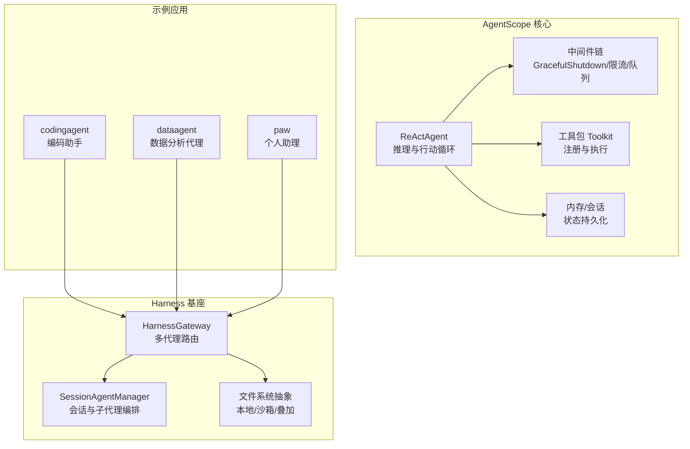
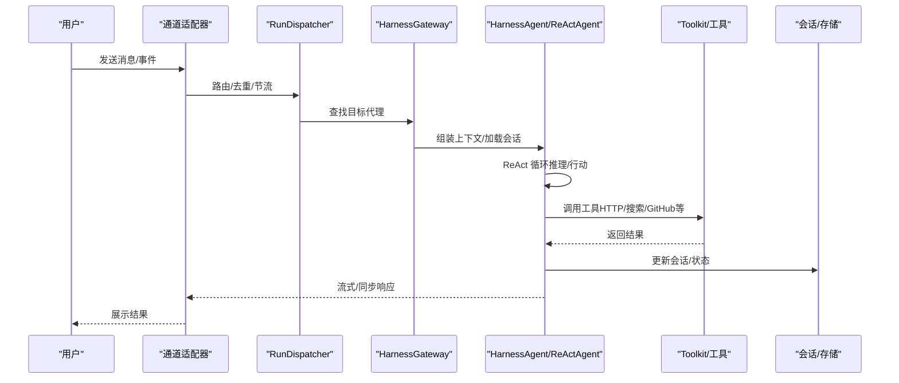
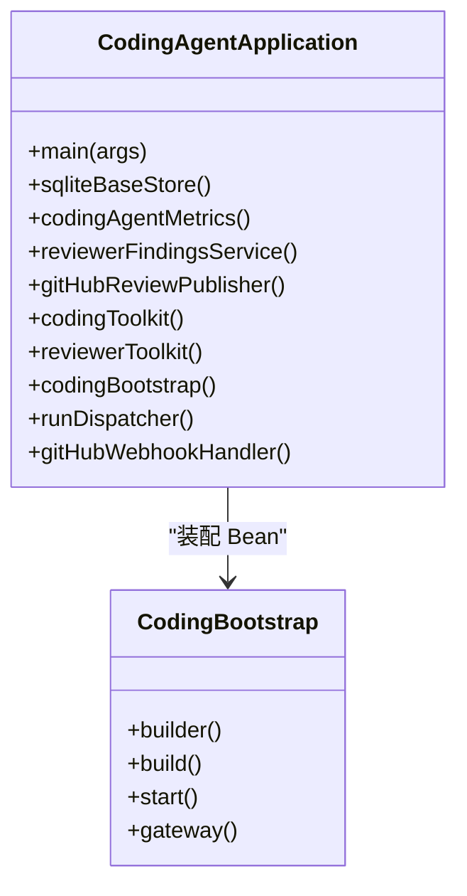
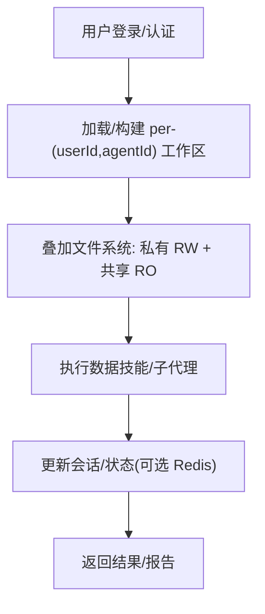
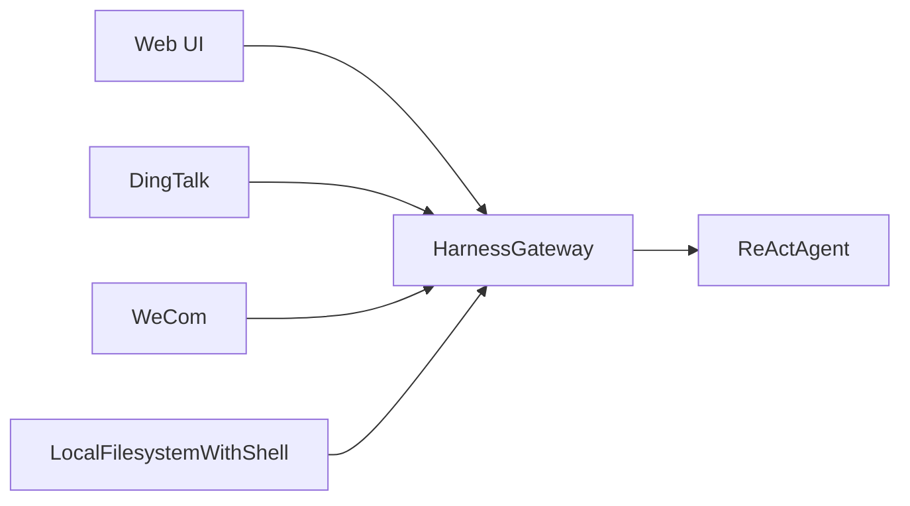
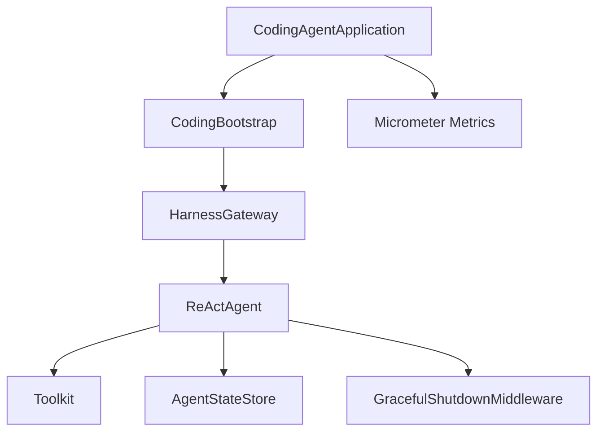

# 应用案例示例

<cite>
**本文引用的文件**
- [README.md](file://README.md)
- [agentscope-examples/README.md](file://agentscope-examples/README.md)
- [agentscope-examples/agents/agentscope-codingagent/README.md](file://agentscope-examples/agents/agentscope-codingagent/README.md)
- [agentscope-examples/agents/agentscope-dataagent/README.md](file://agentscope-examples/agents/agentscope-dataagent/README.md)
- [agentscope-examples/agents/agentscope-paw/README.md](file://agentscope-examples/agents/agentscope-paw/README.md)
- [agentscope-examples/agents/agentscope-codingagent/src/main/java/io/agentscope/harness/coding/CodingAgentApplication.java](file://agentscope-examples/agents/agentscope-codingagent/src/main/java/io/agentscope/harness/coding/CodingAgentApplication.java)
- [agentscope-examples/agents/agentscope-codingagent/src/main/java/io/agentscope/harness/coding/CodingBootstrap.java](file://agentscope-examples/agents/agentscope-codingagent/src/main/java/io/agentscope/harness/coding/CodingBootstrap.java)
- [agentscope-examples/agents/agentscope-dataagent/src/main/resources/application.yml](file://agentscope-examples/agents/agentscope-dataagent/src/main/resources/application.yml)
- [agentscope-examples/agents/agentscope-paw/src/main/resources/application.yml](file://agentscope-examples/agents/agentscope-paw/src/main/resources/application.yml)
- [agentscope-core/src/main/java/io/agentscope/core/ReActAgent.java](file://agentscope-core/src/main/java/io/agentscope/core/ReActAgent.java)
</cite>

## 目录
1. [简介](#简介)
2. [项目结构](#项目结构)
3. [核心组件](#核心组件)
4. [架构总览](#架构总览)
5. [详细组件分析](#详细组件分析)
6. [依赖分析](#依赖分析)
7. [性能考虑](#性能考虑)
8. [故障排查指南](#故障排查指南)
9. [结论](#结论)
10. [附录](#附录)

## 简介
本教程面向希望基于 AgentScope Java 构建完整代理应用的开发者，围绕三个真实项目案例展开：编码助手（agentscope-codingagent）、数据分析代理（agentscope-dataagent）与 PAW（Python Agent Web，agentscope-paw）。文档将系统讲解整体架构、核心功能实现、部署方案与运行流程，并提供可直接参考的配置要点与扩展建议。

## 项目结构
AgentScope Java 提供统一的框架能力（ReAct推理、工具调用、内存与会话、Hook与中间件、沙箱隔离等），并通过“Harness”封装形成可复用的工程化骨架。三大示例项目均基于 HarnessAgent 与 Spring Boot，采用模块化装配方式，分别面向不同场景：
- 编码助手：多通道接入（GitHub/Webhook、IM等）、线程路由与队列、沙箱隔离、评审与问题单闭环
- 数据分析代理：多租户工作区叠加、共享市场、分布式会话、内置数据技能与子代理
- PAW：个人助理，本地文件系统直连、多IM通道、无多租与无隔离设计

图示来源
- [agentscope-core/src/main/java/io/agentscope/core/ReActAgent.java:148-200](file://agentscope-core/src/main/java/io/agentscope/core/ReActAgent.java#L148-L200)
- [agentscope-examples/agents/agentscope-codingagent/src/main/java/io/agentscope/harness/coding/CodingBootstrap.java:87-145](file://agentscope-examples/agents/agentscope-codingagent/src/main/java/io/agentscope/harness/coding/CodingBootstrap.java#L87-L145)
- [agentscope-examples/agents/agentscope-dataagent/README.md:48-93](file://agentscope-examples/agents/agentscope-dataagent/README.md#L48-L93)
- [agentscope-examples/agents/agentscope-paw/README.md:35-61](file://agentscope-examples/agents/agentscope-paw/README.md#L35-L61)

章节来源
- [README.md:28-71](file://README.md#L28-L71)
- [agentscope-examples/README.md:33-46](file://agentscope-examples/README.md#L33-L46)

## 核心组件
- ReActAgent：实现 ReAct 推理-行动循环，支持结构化输出、Hook 生命周期、中断与恢复、中间件链与权限控制等
- HarnessGateway：多代理注册与路由，结合 ChannelManager 实现跨通道分发
- SessionAgentManager：会话级子代理生命周期管理与任务编排
- 文件系统抽象：本地直连、Docker 沙箱、叠加文件系统（私有+共享）
- 工具包 Toolkit：统一注册与执行外部工具（HTTP、搜索、GitHub API、评审工具等）

章节来源
- [agentscope-core/src/main/java/io/agentscope/core/ReActAgent.java:148-200](file://agentscope-core/src/main/java/io/agentscope/core/ReActAgent.java#L148-L200)
- [agentscope-examples/agents/agentscope-codingagent/src/main/java/io/agentscope/harness/coding/CodingBootstrap.java:87-145](file://agentscope-examples/agents/agentscope-codingagent/src/main/java/io/agentscope/harness/coding/CodingBootstrap.java#L87-L145)

## 架构总览
三大应用均以 CodingBootstrap 为装配入口，按需注入模型、工具包、文件系统与通道适配器，最终通过 Spring Boot 启动服务或本地 CLI 运行。

图示来源
- [agentscope-examples/agents/agentscope-codingagent/README.md:421-456](file://agentscope-examples/agents/agentscope-codingagent/README.md#L421-L456)
- [agentscope-examples/agents/agentscope-dataagent/README.md:269-316](file://agentscope-examples/agents/agentscope-dataagent/README.md#L269-L316)
- [agentscope-examples/agents/agentscope-paw/README.md:112-130](file://agentscope-examples/agents/agentscope-paw/README.md#L112-L130)

## 详细组件分析

### 编码助手（agentscope-codingagent）
- 场景定位：在组织内托管的自治编码机器人，支持 Issue→PR、PR 审查、评论迭代、多通道接入（GitHub/Webhook、IM）
- 关键特性
  - 线程路由与去重：基于事件标识生成线程ID，确保同一 Issue/PR 会话连续
  - 队列与预算：空闲时排队，线程/全局模型调用预算限制
  - 沙箱隔离：Docker 每会话容器，执行 git clone、测试、推送等
  - 评审闭环：结构化审查发现、汇总发布
- 运行模式
  - Webhook 服务：Spring Boot + GitHub Webhook 处理器
  - CLI 模式：本地 REPL，无需 Docker
- 配置要点
  - agentscope.json：通道、默认代理、工作区路径
  - 环境变量：API 密钥、沙箱类型、Webhook 密钥等
  - 可选：SQLite 存储用于队列与评审记录

图示来源
- [agentscope-examples/agents/agentscope-codingagent/src/main/java/io/agentscope/harness/coding/CodingAgentApplication.java:44-147](file://agentscope-examples/agents/agentscope-codingagent/src/main/java/io/agentscope/harness/coding/CodingAgentApplication.java#L44-L147)
- [agentscope-examples/agents/agentscope-codingagent/src/main/java/io/agentscope/harness/coding/CodingBootstrap.java:87-145](file://agentscope-examples/agents/agentscope-codingagent/src/main/java/io/agentscope/harness/coding/CodingBootstrap.java#L87-L145)

章节来源
- [agentscope-examples/agents/agentscope-codingagent/README.md:57-98](file://agentscope-examples/agents/agentscope-codingagent/README.md#L57-L98)
- [agentscope-examples/agents/agentscope-codingagent/README.md:206-221](file://agentscope-examples/agents/agentscope-codingagent/README.md#L206-L221)
- [agentscope-examples/agents/agentscope-codingagent/README.md:417-456](file://agentscope-examples/agents/agentscope-codingagent/README.md#L417-L456)

### 数据分析代理（agentscope-dataagent）
- 场景定位：团队分析师的专属数据代理，支持私有工作区叠加共享能力、分布式会话、市场化的技能贡献与审批
- 关键特性
  - 叠加文件系统：私有 RemoteFilesystem + 共享只读层（marketplace）
  - 分布式会话：Redis 支持任意副本服务任意用户
  - 内置数据技能：SQL 查询、图表渲染、报告写作等
  - 通道：Web UI、IM、通用 Webhook
- 运行模式
  - Spring Boot WebFlux 应用，提供 REST API 与前端静态资源
- 配置要点
  - application.yml：JWT 秘钥、工作区目录、DashScope 模型、Redis 分布式会话、Marketplace 开关

图示来源
- [agentscope-examples/agents/agentscope-dataagent/README.md:48-93](file://agentscope-examples/agents/agentscope-dataagent/README.md#L48-L93)
- [agentscope-examples/agents/agentscope-dataagent/src/main/resources/application.yml:66-139](file://agentscope-examples/agents/agentscope-dataagent/src/main/resources/application.yml#L66-L139)

章节来源
- [agentscope-examples/agents/agentscope-dataagent/README.md:160-240](file://agentscope-examples/agents/agentscope-dataagent/README.md#L160-L240)
- [agentscope-examples/agents/agentscope-dataagent/src/main/resources/application.yml:1-158](file://agentscope-examples/agents/agentscope-dataagent/src/main/resources/application.yml#L1-L158)

### PAW（Python Agent Web，agentscope-paw）
- 场景定位：个人助理，安装在本地机器上，与本地 Shell 和文件系统交互
- 关键特性
  - 本地文件系统直连，无多租与隔离
  - 内置 Web UI + 多 IM 通道（DingTalk/WeCom/Feishu/GitHub/GitLab）
  - 无登录、无水平扩展，专注个人使用
- 运行模式
  - Spring Boot 单进程应用，端口与工作区可通过环境变量配置

图示来源
- [agentscope-examples/agents/agentscope-paw/README.md:35-61](file://agentscope-examples/agents/agentscope-paw/README.md#L35-L61)
- [agentscope-examples/agents/agentscope-paw/src/main/resources/application.yml:1-54](file://agentscope-examples/agents/agentscope-paw/src/main/resources/application.yml#L1-L54)

章节来源
- [agentscope-examples/agents/agentscope-paw/README.md:63-81](file://agentscope-examples/agents/agentscope-paw/README.md#L63-L81)
- [agentscope-examples/agents/agentscope-paw/src/main/resources/application.yml:26-41](file://agentscope-examples/agents/agentscope-paw/src/main/resources/application.yml#L26-L41)

## 依赖分析
- 模块耦合
  - CodingBootstrap 作为装配中心，负责加载配置、构建代理、注入工具包与文件系统、注册通道
  - ReActAgent 作为执行核心，依赖模型、工具包、中间件、内存与会话存储
  - 示例应用通过 Spring Boot Bean 方式装配，避免硬编码耦合
- 外部集成
  - GitHub Webhook、DingTalk/Feishu/WeCom/Slack 等 IM 通道
  - DashScope/OpenAI/Anthropic 等大模型服务
  - Redis（可选）用于分布式会话与事件总线
  - Docker（可选）用于编码助手的沙箱隔离

图示来源
- [agentscope-examples/agents/agentscope-codingagent/src/main/java/io/agentscope/harness/coding/CodingBootstrap.java:561-722](file://agentscope-examples/agents/agentscope-codingagent/src/main/java/io/agentscope/harness/coding/CodingBootstrap.java#L561-L722)
- [agentscope-examples/agents/agentscope-codingagent/src/main/java/io/agentscope/harness/coding/CodingAgentApplication.java:62-147](file://agentscope-examples/agents/agentscope-codingagent/src/main/java/io/agentscope/harness/coding/CodingAgentApplication.java#L62-L147)

章节来源
- [agentscope-examples/agents/agentscope-codingagent/src/main/java/io/agentscope/harness/coding/CodingBootstrap.java:561-722](file://agentscope-examples/agents/agentscope-codingagent/src/main/java/io/agentscope/harness/coding/CodingBootstrap.java#L561-L722)
- [agentscope-examples/agents/agentscope-codingagent/src/main/java/io/agentscope/harness/coding/CodingAgentApplication.java:69-147](file://agentscope-examples/agents/agentscope-codingagent/src/main/java/io/agentscope/harness/coding/CodingAgentApplication.java#L69-L147)

## 性能考虑
- 异步与非阻塞：ReActAgent 基于 Project Reactor，支持流式事件与中间件链，降低阻塞开销
- 会话并发：按 (userId, sessionId) 序列化同一会话内的调用，避免竞态；不同会话并行执行
- 沙箱隔离：编码助手的 Docker 沙箱按会话复用，减少容器创建开销
- 分布式会话：DataAgent 使用 Redis 存储会话与事件总线，避免粘性会话带来的扩缩容复杂度
- 观测性：Micrometer 指标与 Actuator 端点便于监控与容量规划

## 故障排查指南
- 编码助手
  - Webhook 未触发：检查 GitHub App 权限、事件订阅与密钥配置
  - Docker 沙箱不可用：确认镜像拉取、工作目录挂载与隔离范围
  - 线程积压：检查队列与预算配置，必要时增加 THREAD_MODEL_CALL_BUDGET 或 GLOBAL_MODEL_CALL_LIMIT
- 数据分析代理
  - Redis 未启用：首次启动可能拒绝，需设置 dataagent.session.redis.enabled 并正确连接
  - MarketPlace 贡献失败：检查最大上传大小与共享目录写入权限
- PAW
  - 本地通道无法连接：确认 IM 通道的回调地址与证书配置
  - 本地文件系统权限：确保工作区目录对当前用户可读写

章节来源
- [agentscope-examples/agents/agentscope-codingagent/README.md:357-378](file://agentscope-examples/agents/agentscope-codingagent/README.md#L357-L378)
- [agentscope-examples/agents/agentscope-dataagent/README.md:541-559](file://agentscope-examples/agents/agentscope-dataagent/README.md#L541-L559)
- [agentscope-examples/agents/agentscope-paw/README.md:541-559](file://agentscope-examples/agents/agentscope-paw/README.md#L541-L559)

## 结论
AgentScope Java 通过统一的 ReActAgent 与 Harness 基座，为不同场景提供了可复用的工程化骨架。编码助手强调多通道与沙箱隔离，数据分析代理强调多租与共享市场，PAW 则专注于个人助理的易用性。开发者可据此快速搭建生产级代理应用，并按需扩展工具、通道与存储后端。

## 附录

### 快速启动与运行步骤
- 编码助手（Webhook 服务）
  - 设置环境变量（API 密钥、Webhook 密钥、可选 Docker 沙箱）
  - 在根目录执行 Maven 构建与启动命令
  - 访问 /webhooks/github 接收 GitHub 事件
- 数据分析代理
  - 配置 application.yml（JWT、工作区、DashScope、Redis）
  - 启动 Spring Boot 应用，访问 http://localhost:8080
- PAW
  - 设置 PAW_HOME 与 DASHSCOPE_API_KEY
  - 启动 Spring Boot 应用，访问 http://localhost:8080

章节来源
- [agentscope-examples/agents/agentscope-codingagent/README.md:206-221](file://agentscope-examples/agents/agentscope-codingagent/README.md#L206-L221)
- [agentscope-examples/agents/agentscope-dataagent/README.md:160-240](file://agentscope-examples/agents/agentscope-dataagent/README.md#L160-L240)
- [agentscope-examples/agents/agentscope-paw/README.md:63-81](file://agentscope-examples/agents/agentscope-paw/README.md#L63-L81)

### 关键配置项参考
- 编码助手（agentscope.json 与环境变量）
  - channels：通道类型、默认代理、回调参数
  - SANDBOX_TYPE、SANDBOX_IMAGE、WORKSPACE 目录
  - THREAD_MODEL_CALL_BUDGET、GLOBAL_MODEL_CALL_LIMIT
- 数据分析代理（application.yml）
  - dataagent.jwt.secret、dataagent.workspace
  - dataagent.dashscope.api-key、model-name
  - dataagent.session.redis.*、marketplace.*
- PAW（application.yml）
  - paw.home、paw.dashscope.*、server.port

章节来源
- [agentscope-examples/agents/agentscope-codingagent/README.md:417-456](file://agentscope-examples/agents/agentscope-codingagent/README.md#L417-L456)
- [agentscope-examples/agents/agentscope-dataagent/src/main/resources/application.yml:66-139](file://agentscope-examples/agents/agentscope-dataagent/src/main/resources/application.yml#L66-L139)
- [agentscope-examples/agents/agentscope-paw/src/main/resources/application.yml:26-41](file://agentscope-examples/agents/agentscope-paw/src/main/resources/application.yml#L26-L41)