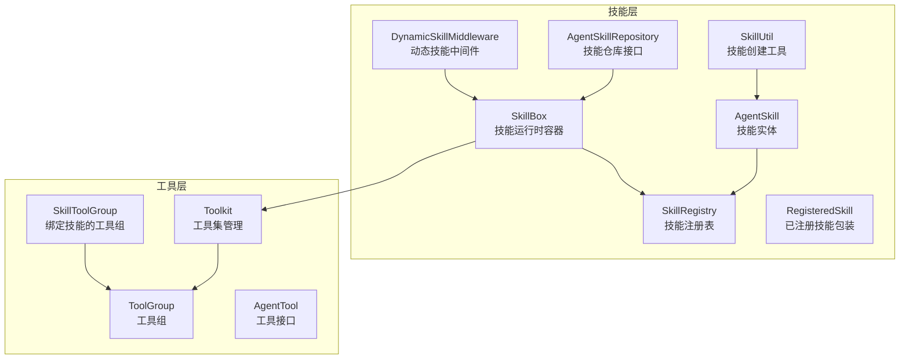
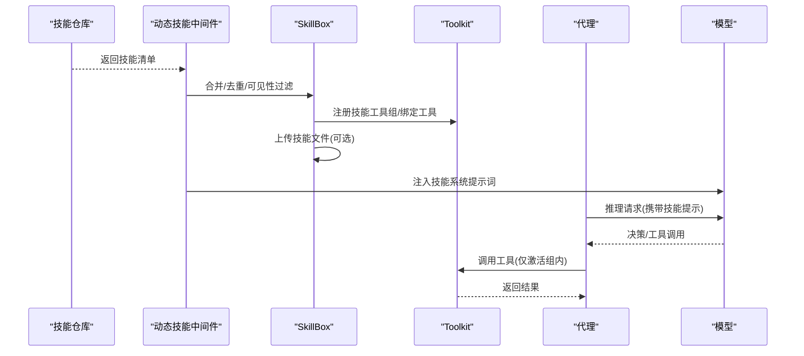
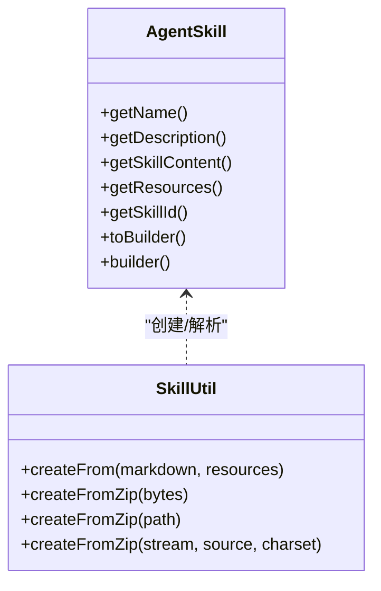
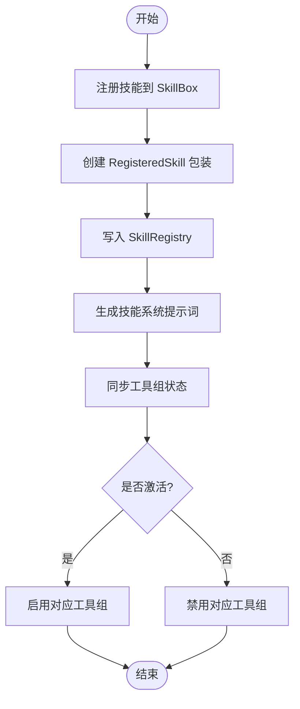
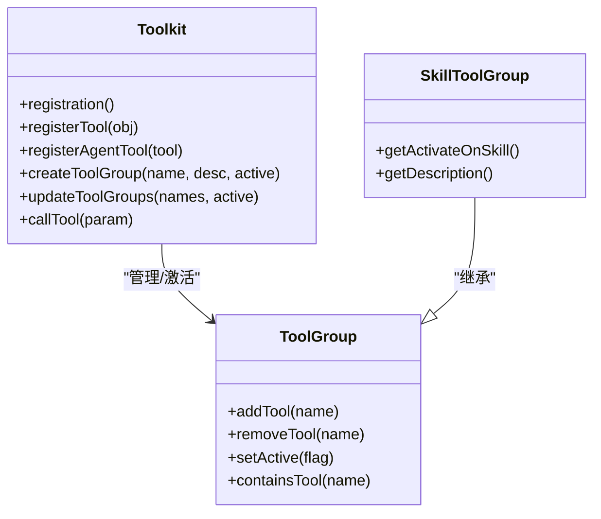
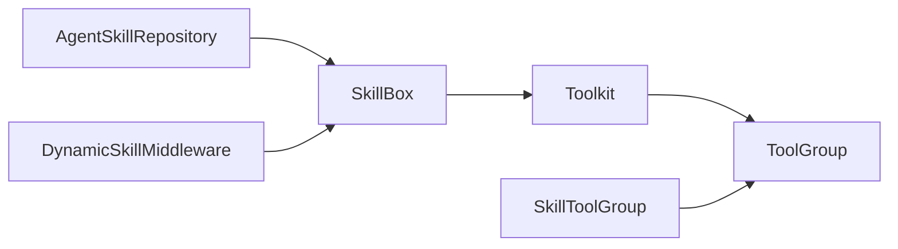

# 技能开发示例

<cite>
**本文引用的文件**
- [AgentSkill.java](file://agentscope-core/src/main/java/io/agentscope/core/skill/AgentSkill.java)
- [SkillRegistry.java](file://agentscope-core/src/main/java/io/agentscope/core/skill/SkillRegistry.java)
- [SkillBox.java](file://agentscope-core/src/main/java/io/agentscope/core/skill/SkillBox.java)
- [RegisteredSkill.java](file://agentscope-core/src/main/java/io/agentscope/core/skill/RegisteredSkill.java)
- [DynamicSkillMiddleware.java](file://agentscope-core/src/main/java/io/agentscope/core/skill/DynamicSkillMiddleware.java)
- [SkillUtil.java](file://agentscope-core/src/main/java/io/agentscope/core/skill/util/SkillUtil.java)
- [AgentSkillRepository.java](file://agentscope-core/src/main/java/io/agentscope/core/skill/repository/AgentSkillRepository.java)
- [AgentTool.java](file://agentscope-core/src/main/java/io/agentscope/core/tool/AgentTool.java)
- [Toolkit.java](file://agentscope-core/src/main/java/io/agentscope/core/tool/Toolkit.java)
- [ToolGroup.java](file://agentscope-core/src/main/java/io/agentscope/core/tool/ToolGroup.java)
- [SkillToolGroup.java](file://agentscope-core/src/main/java/io/agentscope/core/tool/SkillToolGroup.java)
- [SKILL.md](file://SKILL.md)
- [计算技能示例 SKILL.md](file://agentscope-core/src/test/resources/test-skills/calculation-skill/SKILL.md)
- [写作技能示例 SKILL.md](file://agentscope-core/src/test/resources/test-skills/writing-skill/SKILL.md)
</cite>

## 目录
1. [简介](#简介)
2. [项目结构](#项目结构)
3. [核心组件](#核心组件)
4. [架构总览](#架构总览)
5. [详细组件分析](#详细组件分析)
6. [依赖分析](#依赖分析)
7. [性能考虑](#性能考虑)
8. [故障排查指南](#故障排查指南)
9. [结论](#结论)
10. [附录](#附录)

## 简介
本教程面向希望在 AgentScope Java 中开发“技能”的开发者，系统讲解技能的概念、定义、注册、调用与组合方式，并结合框架现有能力给出可直接落地的开发模板与最佳实践。技能在 AgentScope 中是“提示词 + 工具 + 示例”的组合包，用于教会代理如何完成某一类特定任务；通过技能仓库与动态中间件，代理可在推理前按需加载技能提示词，从而实现“按需增强”的智能体行为。

## 项目结构
围绕技能系统的关键模块分布于 agentscope-core 的 skill 与 tool 子包中，配合 DynamicSkillMiddleware 实现技能的动态加载与注入；同时，工具系统（Toolkit、ToolGroup、SkillToolGroup）为技能的工具集合提供组织与激活控制。



图示来源
- [SkillBox.java:45-86](file://agentscope-core/src/main/java/io/agentscope/core/skill/SkillBox.java#L45-L86)
- [DynamicSkillMiddleware.java:59-120](file://agentscope-core/src/main/java/io/agentscope/core/skill/DynamicSkillMiddleware.java#L59-L120)
- [Toolkit.java:66-117](file://agentscope-core/src/main/java/io/agentscope/core/tool/Toolkit.java#L66-L117)
- [ToolGroup.java:42-70](file://agentscope-core/src/main/java/io/agentscope/core/tool/ToolGroup.java#L42-L70)
- [SkillToolGroup.java:44-59](file://agentscope-core/src/main/java/io/agentscope/core/tool/SkillToolGroup.java#L44-L59)

章节来源
- [SkillBox.java:45-110](file://agentscope-core/src/main/java/io/agentscope/core/skill/SkillBox.java#L45-L110)
- [Toolkit.java:66-117](file://agentscope-core/src/main/java/io/agentscope/core/tool/Toolkit.java#L66-L117)

## 核心组件
- AgentSkill：技能实体，包含元数据、技能内容、资源与来源信息，支持从 Markdown/YAML 前言与 ZIP 包创建。
- SkillRegistry：技能注册表，负责技能的存取、激活状态跟踪与查询。
- SkillBox：技能运行时容器，负责技能注册、提示词生成、工具组同步、文件上传等。
- DynamicSkillMiddleware：动态中间件，在每次推理前根据仓库与过滤器合并并签名技能视图，按需重建 SkillBox 并注入提示词。
- AgentSkillRepository：技能仓库接口，抽象不同后端（文件、数据库、远程）的 CRUD 操作。
- SkillUtil：技能工厂工具，支持从 Markdown、ZIP 包创建技能对象。
- Toolkit/ToolGroup/SkillToolGroup：工具层基础设施，提供工具注册、分组、激活控制与与技能绑定的专用工具组。
- AgentTool：工具接口，统一异步执行入口与参数/输出模式。

章节来源
- [AgentSkill.java:28-68](file://agentscope-core/src/main/java/io/agentscope/core/skill/AgentSkill.java#L28-L68)
- [SkillRegistry.java:23-38](file://agentscope-core/src/main/java/io/agentscope/core/skill/SkillRegistry.java#L23-L38)
- [SkillBox.java:38-44](file://agentscope-core/src/main/java/io/agentscope/core/skill/SkillBox.java#L38-L44)
- [DynamicSkillMiddleware.java:39-57](file://agentscope-core/src/main/java/io/agentscope/core/skill/DynamicSkillMiddleware.java#L39-L57)
- [AgentSkillRepository.java:21-34](file://agentscope-core/src/main/java/io/agentscope/core/skill/repository/AgentSkillRepository.java#L21-L34)
- [SkillUtil.java:35-54](file://agentscope-core/src/main/java/io/agentscope/core/skill/util/SkillUtil.java#L35-L54)
- [Toolkit.java:37-65](file://agentscope-core/src/main/java/io/agentscope/core/tool/Toolkit.java#L37-L65)
- [ToolGroup.java:22-41](file://agentscope-core/src/main/java/io/agentscope/core/tool/ToolGroup.java#L22-L41)
- [SkillToolGroup.java:22-43](file://agentscope-core/src/main/java/io/agentscope/core/tool/SkillToolGroup.java#L22-L43)
- [AgentTool.java:22-40](file://agentscope-core/src/main/java/io/agentscope/core/tool/AgentTool.java#L22-L40)

## 架构总览
下图展示了技能从“仓库加载 → 动态注入 → 工具组激活 → 代理调用”的全链路流程。



图示来源
- [DynamicSkillMiddleware.java:122-137](file://agentscope-core/src/main/java/io/agentscope/core/skill/DynamicSkillMiddleware.java#L122-L137)
- [SkillBox.java:221-243](file://agentscope-core/src/main/java/io/agentscope/core/skill/SkillBox.java#L221-L243)
- [Toolkit.java:538-550](file://agentscope-core/src/main/java/io/agentscope/core/tool/Toolkit.java#L538-L550)

## 详细组件分析

### 组件一：技能定义与创建（AgentSkill 与 SkillUtil）
- AgentSkill 提供三种创建路径：从 Markdown/YAML 前言解析、从显式参数构造、从 Builder 复制修改。
- SkillUtil 支持从 Markdown 字符串或 ZIP 包创建技能对象，ZIP 包要求根目录下存在 SKILL.md，其余资源作为技能资源映射。
- 典型用途：将领域知识封装为可复用的技能包，便于跨仓库共享与版本管理。



图示来源
- [AgentSkill.java:70-175](file://agentscope-core/src/main/java/io/agentscope/core/skill/AgentSkill.java#L70-L175)
- [SkillUtil.java:56-116](file://agentscope-core/src/main/java/io/agentscope/core/skill/util/SkillUtil.java#L56-L116)

章节来源
- [AgentSkill.java:70-175](file://agentscope-core/src/main/java/io/agentscope/core/skill/AgentSkill.java#L70-L175)
- [SkillUtil.java:77-116](file://agentscope-core/src/main/java/io/agentscope/core/skill/util/SkillUtil.java#L77-L116)

### 组件二：技能注册与激活（SkillBox 与 SkillRegistry）
- SkillBox 负责技能注册、生成技能系统提示词、同步工具组状态、上传技能文件等。
- SkillRegistry 维护技能与已注册包装的映射，提供查询、激活状态变更与删除操作。
- RegisteredSkill 记录技能激活状态，决定其工具组是否对代理可用。



图示来源
- [SkillBox.java:229-243](file://agentscope-core/src/main/java/io/agentscope/core/skill/SkillBox.java#L229-L243)
- [SkillRegistry.java:45-81](file://agentscope-core/src/main/java/io/agentscope/core/skill/SkillRegistry.java#L45-L81)
- [RegisteredSkill.java:28-58](file://agentscope-core/src/main/java/io/agentscope/core/skill/RegisteredSkill.java#L28-L58)

章节来源
- [SkillBox.java:229-336](file://agentscope-core/src/main/java/io/agentscope/core/skill/SkillBox.java#L229-L336)
- [SkillRegistry.java:45-143](file://agentscope-core/src/main/java/io/agentscope/core/skill/SkillRegistry.java#L45-L143)
- [RegisteredSkill.java:28-77](file://agentscope-core/src/main/java/io/agentscope/core/skill/RegisteredSkill.java#L28-L77)

### 组件三：动态技能加载（DynamicSkillMiddleware）
- DynamicSkillMiddleware 在每次推理前，基于仓库列表与过滤器构建“按用户隔离”的技能视图，进行内容签名以避免重复重建。
- 可通过子类覆写可见性过滤逻辑，实现灰度发布、环境开关等功能。
- 支持开启/关闭代码执行提示块，以便模型获得可执行的文件地址。

```mermaid
sequenceDiagram
participant Ctx as "运行上下文"
participant DSM as "DynamicSkillMiddleware"
participant Repo as "技能仓库列表"
participant Box as "SkillBox"
Ctx->>DSM : onSystemPrompt()
DSM->>Repo : getAllSkills()
Repo-->>DSM : 技能清单
DSM->>DSM : 过滤/去重/排序
DSM->>Box : 重建 SkillBox(可复用签名)
Box->>Box : 上传技能文件(可选)
Box-->>DSM : 生成技能提示词
DSM-->>Ctx : 注入提示词
```

图示来源
- [DynamicSkillMiddleware.java:122-137](file://agentscope-core/src/main/java/io/agentscope/core/skill/DynamicSkillMiddleware.java#L122-L137)
- [DynamicSkillMiddleware.java:160-250](file://agentscope-core/src/main/java/io/agentscope/core/skill/DynamicSkillMiddleware.java#L160-L250)

章节来源
- [DynamicSkillMiddleware.java:58-120](file://agentscope-core/src/main/java/io/agentscope/core/skill/DynamicSkillMiddleware.java#L58-L120)
- [DynamicSkillMiddleware.java:160-250](file://agentscope-core/src/main/java/io/agentscope/core/skill/DynamicSkillMiddleware.java#L160-L250)

### 组件四：工具与技能组合（Toolkit、ToolGroup、SkillToolGroup）
- Toolkit 提供工具注册、分组、Schema 生成、MCP 客户端集成与执行器等能力。
- ToolGroup 用于将工具按功能域分组，仅激活组内的工具对代理可见。
- SkillToolGroup 是绑定到具体技能的工具组，描述中会提醒必须随技能一起激活，便于模型正确使用。



图示来源
- [Toolkit.java:146-148](file://agentscope-core/src/main/java/io/agentscope/core/tool/Toolkit.java#L146-L148)
- [Toolkit.java:562-608](file://agentscope-core/src/main/java/io/agentscope/core/tool/Toolkit.java#L562-L608)
- [ToolGroup.java:42-70](file://agentscope-core/src/main/java/io/agentscope/core/tool/ToolGroup.java#L42-L70)
- [SkillToolGroup.java:44-81](file://agentscope-core/src/main/java/io/agentscope/core/tool/SkillToolGroup.java#L44-L81)

章节来源
- [Toolkit.java:562-608](file://agentscope-core/src/main/java/io/agentscope/core/tool/Toolkit.java#L562-L608)
- [ToolGroup.java:42-171](file://agentscope-core/src/main/java/io/agentscope/core/tool/ToolGroup.java#L42-L171)
- [SkillToolGroup.java:44-103](file://agentscope-core/src/main/java/io/agentscope/core/tool/SkillToolGroup.java#L44-L103)

### 组件五：技能与工具的关系与区别
- 技能（Skill）：强调“如何做某事”的知识包，包含提示词、工具集合与示例；面向任务域。
- 工具（Tool）：强调“可执行的操作”，由 AgentTool 接口统一抽象，面向能力单元。
- 关系：技能通过 SkillBox 将一组工具以“工具组”的形式注册到 Toolkit，再由 DynamicSkillMiddleware 在推理前注入技能提示词，使代理具备按需调用的能力。

章节来源
- [AgentTool.java:22-40](file://agentscope-core/src/main/java/io/agentscope/core/tool/AgentTool.java#L22-L40)
- [SkillBox.java:599-630](file://agentscope-core/src/main/java/io/agentscope/core/skill/SkillBox.java#L599-L630)
- [Toolkit.java:562-608](file://agentscope-core/src/main/java/io/agentscope/core/tool/Toolkit.java#L562-L608)

## 依赖分析
- 技能层依赖工具层：SkillBox 通过 Toolkit 管理工具组与工具注册；DynamicSkillMiddleware 依赖 SkillBox 生成提示词。
- 仓库接口解耦：AgentSkillRepository 抽象不同存储后端，支持 Git、MySQL、PostgreSQL 等实现。
- 工具组绑定：SkillToolGroup 与具体技能名称绑定，确保技能使用时工具组被正确激活。



图示来源
- [AgentSkillRepository.java:35-98](file://agentscope-core/src/main/java/io/agentscope/core/skill/repository/AgentSkillRepository.java#L35-L98)
- [SkillBox.java:49-74](file://agentscope-core/src/main/java/io/agentscope/core/skill/SkillBox.java#L49-L74)
- [Toolkit.java:70-78](file://agentscope-core/src/main/java/io/agentscope/core/tool/Toolkit.java#L70-L78)
- [DynamicSkillMiddleware.java:63-112](file://agentscope-core/src/main/java/io/agentscope/core/skill/DynamicSkillMiddleware.java#L63-L112)

章节来源
- [AgentSkillRepository.java:35-133](file://agentscope-core/src/main/java/io/agentscope/core/skill/repository/AgentSkillRepository.java#L35-L133)
- [SkillBox.java:49-74](file://agentscope-core/src/main/java/io/agentscope/core/skill/SkillBox.java#L49-L74)
- [Toolkit.java:70-78](file://agentscope-core/src/main/java/io/agentscope/core/tool/Toolkit.java#L70-L78)
- [DynamicSkillMiddleware.java:63-112](file://agentscope-core/src/main/java/io/agentscope/core/skill/DynamicSkillMiddleware.java#L63-L112)

## 性能考虑
- 动态技能中间件采用内容签名与短路策略，避免频繁重建 SkillBox 与重复上传资源。
- 工具执行器支持并行/顺序执行配置，结合执行超时与重试策略，提升整体吞吐与稳定性。
- 建议：将大型资源放在外部存储并通过仓库接口按需拉取，减少内存占用与冷启动时间。

## 故障排查指南
- 报错“技能不存在”：检查 SkillBox 是否正确注册，或 DynamicSkillMiddleware 的可见性过滤是否屏蔽了目标技能。
- 工具不可见：确认工具组处于激活状态，或检查 SkillToolGroup 的绑定是否正确。
- ZIP 包解析失败：确保 ZIP 根目录下存在 SKILL.md，且条目路径合法、无父目录段。
- 上传失败：检查工作目录权限与磁盘空间，必要时设置稳定的 workDir 以避免临时目录清理导致的丢失。

章节来源
- [DynamicSkillMiddleware.java:221-250](file://agentscope-core/src/main/java/io/agentscope/core/skill/DynamicSkillMiddleware.java#L221-L250)
- [SkillBox.java:763-799](file://agentscope-core/src/main/java/io/agentscope/core/skill/SkillBox.java#L763-L799)
- [SkillUtil.java:325-358](file://agentscope-core/src/main/java/io/agentscope/core/skill/util/SkillUtil.java#L325-L358)

## 结论
通过技能系统与工具系统的协同，AgentScope Java 能够以“知识包”的形式为代理提供可插拔、可组合的能力扩展。借助动态中间件与仓库接口，技能可以按需加载、按用户隔离与灰度发布；通过工具组与绑定工具组，技能的工具集合得以安全可控地暴露给代理。遵循本文模板与最佳实践，开发者可快速构建高质量的技能模块并融入现有代理流水线。

## 附录

### 技能开发模板与步骤
- 步骤一：编写 SKILL.md
  - 使用 YAML 前言定义 name 与 description，正文描述技能职责与使用场景。
  - 示例参考：[计算技能示例 SKILL.md:1-13](file://agentscope-core/src/test/resources/test-skills/calculation-skill/SKILL.md#L1-L13)、[写作技能示例 SKILL.md:1-14](file://agentscope-core/src/test/resources/test-skills/writing-skill/SKILL.md#L1-L14)
- 步骤二：准备资源文件
  - 将脚本、配置、示例等资源文件与 SKILL.md 放在同一根目录，打包为 ZIP 以便 SkillUtil 解析。
- 步骤三：创建技能对象
  - 使用 SkillUtil.createFrom 或 createFromZip 从 Markdown/ZIP 创建 AgentSkill。
  - 参考：[SkillUtil.java:77-116](file://agentscope-core/src/main/java/io/agentscope/core/skill/util/SkillUtil.java#L77-L116)
- 步骤四：注册技能
  - 通过 SkillBox.registerSkill 注册技能；必要时调用 registerSkillLoadTool 注册加载工具。
  - 参考：[SkillBox.java:229-243](file://agentscope-core/src/main/java/io/agentscope/core/skill/SkillBox.java#L229-L243)
- 步骤五：绑定工具组
  - 使用 Toolkit.createToolGroup 或 createSkillToolGroup 将工具归档到技能专属工具组。
  - 参考：[Toolkit.java:562-608](file://agentscope-core/src/main/java/io/agentscope/core/tool/Toolkit.java#L562-L608)、[SkillToolGroup.java:101-177](file://agentscope-core/src/main/java/io/agentscope/core/tool/SkillToolGroup.java#L101-L177)
- 步骤六：动态注入
  - 配置 DynamicSkillMiddleware，按用户/会话维度注入技能提示词。
  - 参考：[DynamicSkillMiddleware.java:122-137](file://agentscope-core/src/main/java/io/agentscope/core/skill/DynamicSkillMiddleware.java#L122-L137)

### 预定义技能使用示例
- 框架内置技能示例：参考根目录 SKILL.md，其中包含针对 AgentScope Java 的专家级技能说明与约束。
  - 参考：[SKILL.md:1-12](file://SKILL.md#L1-L12)

### 最佳实践
- 使用 SkillUtil 统一创建技能，确保元数据与资源一致性。
- 将大型资源放入外部存储并通过仓库接口延迟加载，减少内存压力。
- 为每个技能创建独立的工具组，并使用 SkillToolGroup 明确绑定关系。
- 在 DynamicSkillMiddleware 中实现细粒度可见性控制，支持灰度与环境隔离。
- 对工具执行进行超时与重试配置，保证代理调用的鲁棒性。