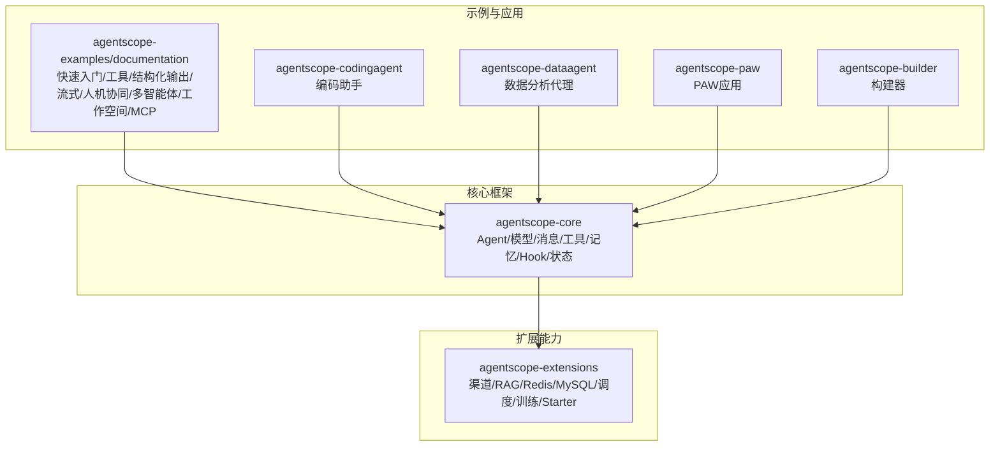
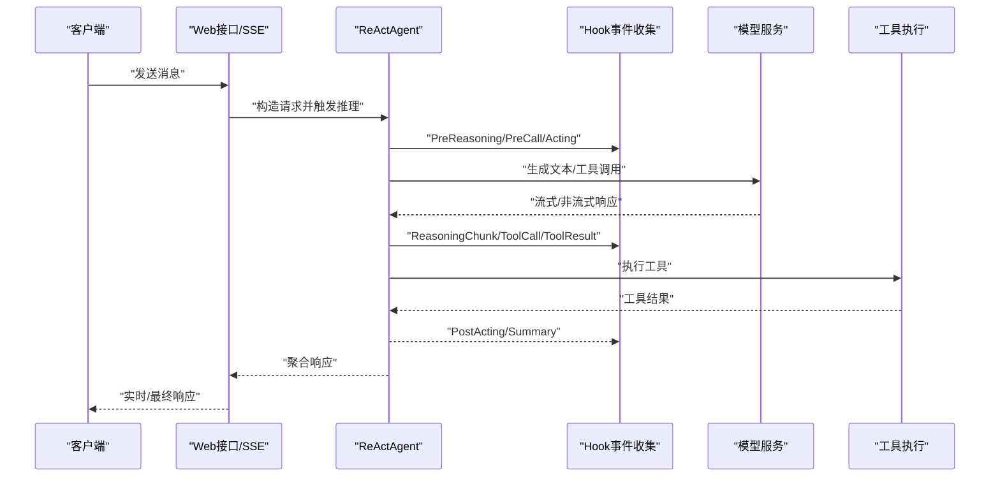
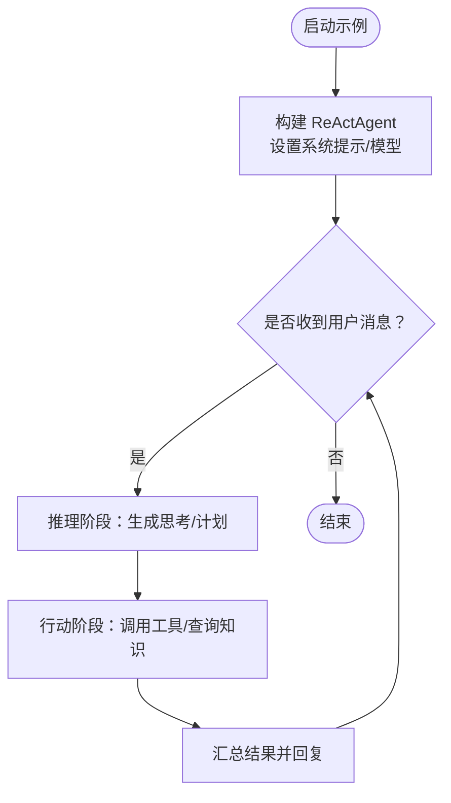
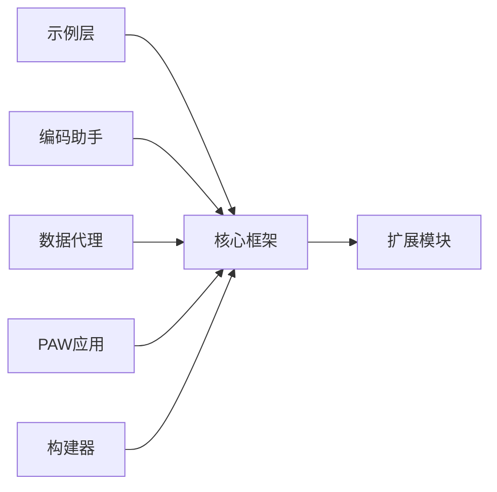

# 示例教程

<cite>
**本文引用的文件**
- [README.md](file://README.md)
- [agentscope-examples/README.md](file://agentscope-examples/README.md)
- [BasicChatExample.java](file://agentscope-examples/documentation/src/main/java/io/agentscope/examples/documentation2/quickstart/BasicChatExample.java)
- [ToolCallingExample.java](file://agentscope-examples/documentation/src/main/java/io/agentscope/examples/documentation2/tool/ToolCallingExample.java)
- [StructuredOutputExample.java](file://agentscope-examples/documentation/src/main/java/io/agentscope/examples/documentation2/structuredoutput/StructuredOutputExample.java)
- [ToolGroupExample.java](file://agentscope-examples/documentation/src/main/java/io/agentscope/examples/documentation2/tool/ToolGroupExample.java)
- [StreamingWebExample.java](file://agentscope-examples/documentation/src/main/java/io/agentscope/examples/documentation2/streaming/StreamingWebExample.java)
- [InterruptionExample.java](file://agentscope-examples/documentation/src/main/java/io/agentscope/examples/documentation2/hitl/InterruptionExample.java)
- [RuntimeContextExample.java](file://agentscope-examples/documentation/src/main/java/io/agentscope/examples/documentation2/context/RuntimeContextExample.java)
- [SkillCompositionExample.java](file://agentscope-examples/documentation/src/main/java/io/agentscope/examples/documentation2/harness/skill/SkillCompositionExample.java)
- [SubagentStreamingExample.java](file://agentscope-examples/documentation/src/main/java/io/agentscope/examples/documentation2/harness/subagent/SubagentStreamingExample.java)
- [WorkspaceSetupExample.java](file://agentscope-examples/documentation/src/main/java/io/agentscope/examples/documentation2/harness/workspace/WorkspaceSetupExample.java)
- [McpStdioExample.java](file://agentscope-examples/documentation/src/main/java/io/agentscope/examples/documentation2/mcp/McpStdioExample.java)
- [McpSseExample.java](file://agentscope-examples/documentation/src/main/java/io/agentscope/examples/documentation2/mcp/McpSseExample.java)
- [HookStopAgentExample.java](file://agentscope-examples/documentation/src/main/java/io/agentscope/examples/documentation2/hitl/HookStopAgentExample.java)
- [ChannelSendExample.java](file://agentscope-examples/documentation/src/main/java/io/agentscope/examples/documentation2/harness/channel/ChannelSendExample.java)
- [GatewayMultiAgentExample.java](file://agentscope-examples/documentation/src/main/java/io/agentscope/examples/documentation2/harness/channel/GatewayMultiAgentExample.java)
- [agentscope-codingagent/README.md](file://agentscope-codingagent/README.md)
- [agentscope-dataagent/README.md](file://agentscope-dataagent/README.md)
- [agentscope-paw/README.md](file://agentscope-paw/README.md)
- [agentscope-builder/README.md](file://agentscope-builder/README.md)
</cite>

## 目录
1. [简介](#简介)
2. [项目结构](#项目结构)
3. [核心组件](#核心组件)
4. [架构总览](#架构总览)
5. [详细组件分析](#详细组件分析)
6. [依赖关系分析](#依赖关系分析)
7. [性能考虑](#性能考虑)
8. [故障排查指南](#故障排查指南)
9. [结论](#结论)
10. [附录](#附录)

## 简介
本教程面向希望快速上手并深入掌握 AgentScope Java 的开发者与架构师。内容覆盖从零基础聊天、工具调用、结构化输出，到流式交互、会话持久化、中断控制、MCP 集成、技能组合、子智能体协作、工作空间与沙箱、以及面向生产的多智能体网关通道等主题。每个示例均提供运行步骤、交互提示、最佳实践与扩展建议，并给出可直接参考的源码路径。

## 项目结构
示例代码主要位于 agentscope-examples/documentation 子模块中，按“快速入门/工具/结构化输出/流式/人机协同/多智能体/工作空间/MCP”等维度组织；同时，框架核心 agentscope-core 提供模型、消息、工具、记忆、Hook、状态等基础设施；扩展模块 agentscope-extensions 提供渠道、RAG、Redis、MySQL、调度器、训练、Spring Boot Starter 等能力；另有多个实战应用示例：编码助手 agentscope-codingagent、数据代理 agentscope-dataagent、PAW 应用 agentscope-paw、构建器 agentscope-builder。

图示来源
- [README.md](file://README.md)
- [agentscope-examples/README.md](file://agentscope-examples/README.md)

章节来源
- [README.md](file://README.md)
- [agentscope-examples/README.md](file://agentscope-examples/README.md)

## 核心组件
- Agent 与 ReAct 推理：通过 ReActAgent 构建具备推理-行动循环的智能体，支持系统提示、模型配置、中间件与 Hook。
- 工具体系：@Tool 注解定义工具方法，Toolkit/ToolRegistry 管理注册，Meta-tool 支持工具组自激活。
- 结构化输出：基于 Schema 的类型安全输出解析，自动校正与映射。
- 流式交互：基于 Hook 的事件流与 SSE 实时推送。
- 会话与状态：JsonSession 持久化对话历史，RuntimeContext 管理上下文状态。
- 中断与恢复：用户干预、协作文档、安全取消与状态回滚。
- MCP 集成：连接外部工具服务器（StdIO/SSE/HTTP），统一协议扩展能力。
- 技能与子智能体：SkillBox/SkillRegistry 组合提示词与工具，SubagentTool 协作。
- 工作空间与沙箱：本地 Shell、共享存储、分布式状态与隔离执行。

章节来源
- [README.md](file://README.md)
- [agentscope-examples/README.md](file://agentscope-examples/README.md)

## 架构总览
下图展示典型示例的端到端流程：客户端发起请求，后端通过 Hook 收集事件，模型生成文本/工具调用，工具执行结果回传，最终以流式或非流式响应返回。

图示来源
- [StreamingWebExample.java](file://agentscope-examples/documentation/src/main/java/io/agentscope/examples/documentation2/streaming/StreamingWebExample.java)
- [HookStopAgentExample.java](file://agentscope-examples/documentation/src/main/java/io/agentscope/examples/documentation2/hitl/HookStopAgentExample.java)

## 详细组件分析

### 快速开始：基础聊天
- 目标：创建最简 ReActAgent 并进行对话。
- 关键点：Agent 构建器、系统提示、模型配置、消息收发。
- 运行方式：参考示例说明中的命令行执行方式。
- 扩展建议：接入不同模型提供商、增加中间件与 Hook。

图示来源
- [BasicChatExample.java](file://agentscope-examples/documentation/src/main/java/io/agentscope/examples/documentation2/quickstart/BasicChatExample.java)

章节来源
- [BasicChatExample.java](file://agentscope-examples/documentation/src/main/java/io/agentscope/examples/documentation2/quickstart/BasicChatExample.java)
- [agentscope-examples/README.md](file://agentscope-examples/README.md)

### 工具调用：给智能体配备工具
- 目标：使用 @Tool 注解定义工具，注册到 Toolkit，实现自动工具调用。
- 关键点：@Tool/@ToolParam、Toolkit、工具注册与发现。
- 运行方式：示例命令行执行，提问包含具体任务即可触发工具调用。
- 扩展建议：结合结构化输出约束工具返回格式。

章节来源
- [ToolCallingExample.java](file://agentscope-examples/documentation/src/main/java/io/agentscope/examples/documentation2/tool/ToolCallingExample.java)
- [agentscope-examples/README.md](file://agentscope-examples/README.md)

### 结构化输出：类型安全的结果抽取
- 目标：定义结构化 Schema，要求模型输出符合规范，自动解析为强类型对象。
- 关键点：Schema 定义、提示词引导、错误自动修正与重试。
- 运行方式：示例命令行执行，观察三类抽取场景的输出。
- 扩展建议：在工具链中复用该能力，统一下游处理。

章节来源
- [StructuredOutputExample.java](file://agentscope-examples/documentation/src/main/java/io/agentscope/examples/documentation2/structuredoutput/StructuredOutputExample.java)
- [agentscope-examples/README.md](file://agentscope-examples/README.md)

### 工具组：自主管理工具集合
- 目标：通过 meta-tool 自动激活所需工具组，提升任务适配能力。
- 关键点：工具组状态（INACTIVE/ACTIVE）、reset_equipped_tools、任务驱动的动态装配。
- 运行方式：示例命令行执行，尝试多组工具串联的任务。
- 扩展建议：结合计划模式与记忆，形成“策略-工具-执行”的闭环。

章节来源
- [ToolGroupExample.java](file://agentscope-examples/documentation/src/main/java/io/agentscope/examples/documentation2/tool/ToolGroupExample.java)
- [agentscope-examples/README.md](file://agentscope-examples/README.md)

### 流式交互：Spring Boot + SSE
- 目标：构建响应式 Web API，使用 Server-Sent Events 实现实时流式输出。
- 关键点：Hook 事件收集、SSE 推送、会话持久化。
- 运行方式：启动服务后，浏览器或 curl 访问指定端点。
- 扩展建议：结合前端组件实现实时聊天界面。

章节来源
- [StreamingWebExample.java](file://agentscope-examples/documentation/src/main/java/io/agentscope/examples/documentation2/streaming/StreamingWebExample.java)
- [agentscope-examples/README.md](file://agentscope-examples/README.md)

### 人机协同：中断与恢复
- 目标：演示用户主动中断、协作文档、安全取消与状态恢复。
- 关键点：中断机制、Hook 观察、假结果生成与优雅恢复。
- 运行方式：示例命令行执行，观察自动中断与恢复过程。
- 扩展建议：在生产环境加入人工确认与审计日志。

章节来源
- [InterruptionExample.java](file://agentscope-examples/documentation/src/main/java/io/agentscope/examples/documentation2/hitl/InterruptionExample.java)
- [HookStopAgentExample.java](file://agentscope-examples/documentation/src/main/java/io/agentscope/examples/documentation2/hitl/HookStopAgentExample.java)
- [agentscope-examples/README.md](file://agentscope-examples/README.md)

### 上下文与状态：运行时上下文与会话
- 目标：演示 RuntimeContext 的使用与 JsonSession 的会话持久化。
- 关键点：上下文注入、状态读写、跨轮次记忆。
- 运行方式：示例命令行执行，验证会话连续性。
- 扩展建议：结合长程记忆与状态归档，实现跨进程恢复。

章节来源
- [RuntimeContextExample.java](file://agentscope-examples/documentation/src/main/java/io/agentscope/examples/documentation2/context/RuntimeContextExample.java)
- [agentscope-examples/README.md](file://agentscope-examples/README.md)

### 技能组合：提示词与工具的封装
- 目标：通过 SkillBox/SkillRegistry 将提示词与工具打包为可复用技能。
- 关键点：技能注册、动态加载、技能组合与调用。
- 运行方式：示例命令行执行，观察技能对工具的编排效果。
- 扩展建议：将技能发布到 Git/数据库仓库，实现团队共享。

章节来源
- [SkillCompositionExample.java](file://agentscope-examples/documentation/src/main/java/io/agentscope/examples/documentation2/harness/skill/SkillCompositionExample.java)
- [agentscope-examples/README.md](file://agentscope-examples/README.md)

### 子智能体：流式与直接通信
- 目标：通过 SubagentTool 发起子智能体任务，支持流式与直连两种模式。
- 关键点：子智能体生命周期、事件传播、流式结果聚合。
- 运行方式：示例命令行执行，观察子任务执行与结果回传。
- 扩展建议：结合网关实现多智能体协作与编排。

章节来源
- [SubagentStreamingExample.java](file://agentscope-examples/documentation/src/main/java/io/agentscope/examples/documentation2/harness/subagent/SubagentStreamingExample.java)
- [agentscope-examples/README.md](file://agentscope-examples/README.md)

### 工作空间：本地/沙箱/共享存储
- 目标：演示本地 Shell、沙箱隔离与共享存储的工作空间配置。
- 关键点：权限控制、资源隔离、状态同步。
- 运行方式：示例命令行执行，验证文件操作与状态读写。
- 扩展建议：在生产中启用最小权限与审计日志。

章节来源
- [WorkspaceSetupExample.java](file://agentscope-examples/documentation/src/main/java/io/agentscope/examples/documentation2/harness/workspace/WorkspaceSetupExample.java)
- [agentscope-examples/README.md](file://agentscope-examples/README.md)

### MCP 集成：外部工具服务器
- 目标：通过 MCP 协议连接外部工具服务器（StdIO/SSE/HTTP）。
- 关键点：MCP 客户端管理、工具发现与调用。
- 运行方式：安装对应 MCP 服务器后，示例命令行执行。
- 扩展建议：将常用工具抽象为 MCP 服务，统一治理与版本管理。

章节来源
- [McpStdioExample.java](file://agentscope-examples/documentation/src/main/java/io/agentscope/examples/documentation2/mcp/McpStdioExample.java)
- [McpSseExample.java](file://agentscope-examples/documentation/src/main/java/io/agentscope/examples/documentation2/mcp/McpSseExample.java)
- [agentscope-examples/README.md](file://agentscope-examples/README.md)

### 多智能体网关：通道与协作
- 目标：通过 Channel 与 Gateway 实现多智能体之间的消息传递与协作。
- 关键点：通道发送、网关路由、多智能体编排。
- 运行方式：示例命令行执行，观察消息转发与结果聚合。
- 扩展建议：结合服务注册中心实现动态发现与负载均衡。

章节来源
- [ChannelSendExample.java](file://agentscope-examples/documentation/src/main/java/io/agentscope/examples/documentation2/harness/channel/ChannelSendExample.java)
- [GatewayMultiAgentExample.java](file://agentscope-examples/documentation/src/main/java/io/agentscope/examples/documentation2/harness/channel/GatewayMultiAgentExample.java)
- [agentscope-examples/README.md](file://agentscope-examples/README.md)

## 依赖关系分析
示例与核心框架、扩展模块之间呈现清晰的分层依赖：示例层依赖核心框架；核心框架依赖扩展模块；应用示例（编码助手、数据代理等）在示例基础上进一步整合业务能力。

图示来源
- [README.md](file://README.md)
- [agentscope-examples/README.md](file://agentscope-examples/README.md)

章节来源
- [README.md](file://README.md)
- [agentscope-examples/README.md](file://agentscope-examples/README.md)

## 性能考虑
- 流式与非阻塞：优先采用 Hook 事件流与响应式模型调用，降低延迟与内存占用。
- 工具批量化：合并相似工具调用，减少往返次数；对 IO 密集型工具使用并发与限流。
- 缓存与预热：对频繁访问的工具与模型结果进行缓存；冷启动阶段预热关键资源。
- 会话与状态：合理设置 JsonSession 与长程记忆的清理策略，避免状态膨胀。
- 中断与恢复：在长任务中定期检查中断信号，确保快速失败与无损恢复。
- 生产部署：结合扩展模块的可观测性与沙箱能力，实现灰度发布与安全回滚。

## 故障排查指南
- API 密钥问题：未设置环境变量时示例会交互式提示输入；请确认密钥有效且有相应配额。
- MCP 服务器连接失败：确保已安装对应 MCP 服务器（如文件系统/版本库），并正确配置连接参数。
- 编译错误：先在 agentscope-core 目录执行安装，再编译示例模块。
- 日志调试：通过命令行参数开启 debug 日志级别，定位推理与工具调用异常。
- 中断无效：确认中断钩子已正确注册，且工具支持协作文档与安全取消。

章节来源
- [agentscope-examples/README.md](file://agentscope-examples/README.md)

## 结论
通过本教程的循序渐进学习，您可以在 AgentScope Java 上快速搭建从简单聊天到复杂多智能体协作的应用。建议在实践中结合结构化输出、工具组、MCP、技能与工作空间等能力，逐步完善系统的稳定性、可观测性与可扩展性，并在生产环境中引入中断控制、沙箱与可观测性等工程化手段。

## 附录
- 实际应用场景案例
  - 编码助手：基于工具与技能的自动化代码生成与审查，结合沙箱与工作空间实现安全执行与状态管理。
  - 数据分析代理：结合结构化输出与工具组，完成数据清洗、统计与可视化建议。
  - PAW 应用：面向特定业务流程的智能体编排与网关通道集成。
  - 构建器：提供可视化的智能体设计与部署能力，支撑团队协作与版本管理。
- 最佳实践清单
  - 明确职责边界：工具负责“做什么”，技能负责“如何做”，智能体负责“何时做”。
  - 强类型输出：统一使用结构化输出，避免手工解析带来的脆弱性。
  - 可观测性：在关键节点埋点 Hook，记录推理、工具与状态变化。
  - 安全与隔离：启用沙箱与最小权限，严格控制工具与文件系统访问。
  - 可扩展性：通过 MCP 与技能仓库实现能力复用与生态共建。

章节来源
- [agentscope-codingagent/README.md](file://agentscope-codingagent/README.md)
- [agentscope-dataagent/README.md](file://agentscope-dataagent/README.md)
- [agentscope-paw/README.md](file://agentscope-paw/README.md)
- [agentscope-builder/README.md](file://agentscope-builder/README.md)