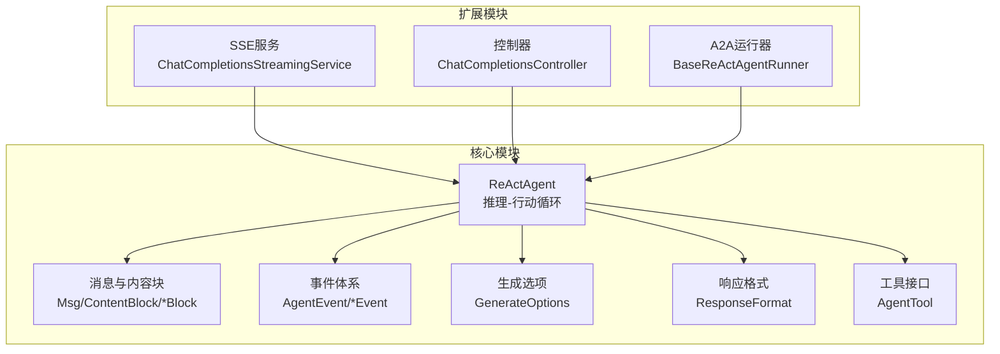
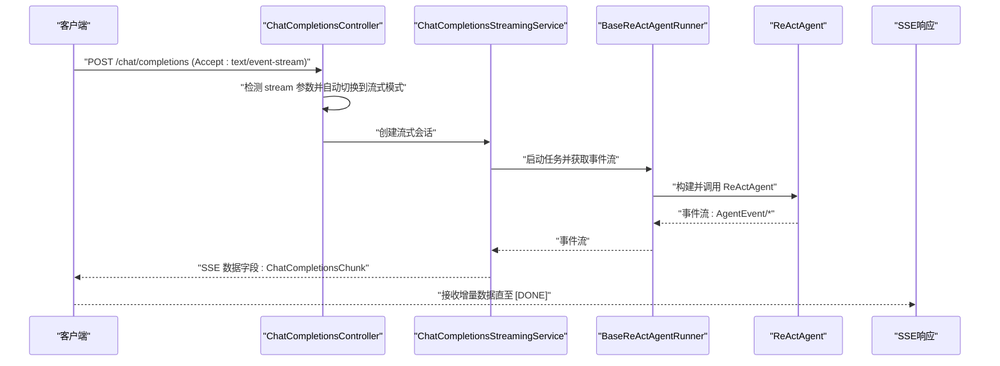
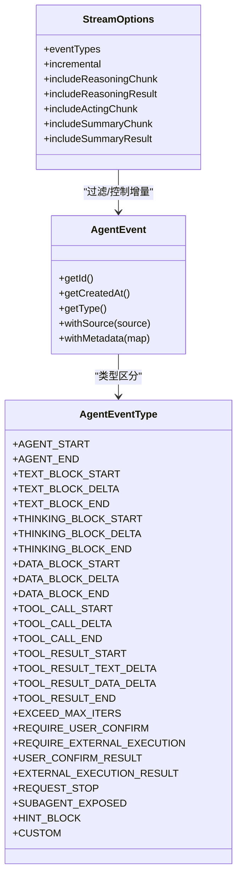
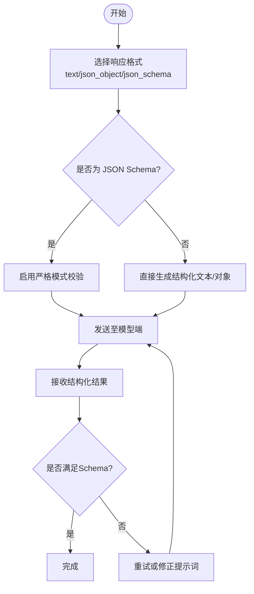
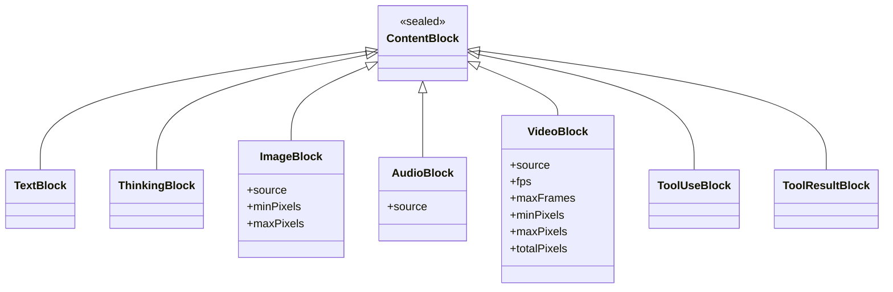
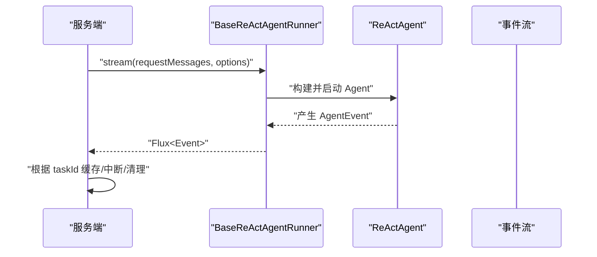
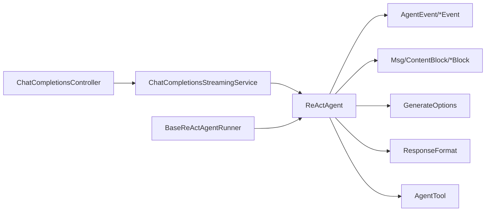

# 高级功能示例

<cite>
**本文引用的文件**
- [ReActAgent.java](file://agentscope-core/src/main/java/io/agentscope/core/ReActAgent.java)
- [StreamableAgent.java](file://agentscope-core/src/main/java/io/agentscope/core/agent/StreamableAgent.java)
- [StreamOptions.java](file://agentscope-core/src/main/java/io/agentscope/core/agent/StreamOptions.java)
- [AgentEvent.java](file://agentscope-core/src/main/java/io/agentscope/core/event/AgentEvent.java)
- [AgentEventType.java](file://agentscope-core/src/main/java/io/agentscope/core/event/AgentEventType.java)
- [ContentBlock.java](file://agentscope-core/src/main/java/io/agentscope/core/message/ContentBlock.java)
- [TextBlock.java](file://agentscope-core/src/main/java/io/agentscope/core/message/TextBlock.java)
- [ThinkingBlock.java](file://agentscope-core/src/main/java/io/agentscope/core/message/ThinkingBlock.java)
- [ImageBlock.java](file://agentscope-core/src/main/java/io/agentscope/core/message/ImageBlock.java)
- [AudioBlock.java](file://agentscope-core/src/main/java/io/agentscope/core/message/AudioBlock.java)
- [VideoBlock.java](file://agentscope-core/src/main/java/io/agentscope/core/message/VideoBlock.java)
- [ResponseFormat.java](file://agentscope-core/src/main/java/io/agentscope/core/formatter/ResponseFormat.java)
- [GenerateOptions.java](file://agentscope-core/src/main/java/io/agentscope/core/model/GenerateOptions.java)
- [AgentTool.java](file://agentscope-core/src/main/java/io/agentscope/core/tool/AgentTool.java)
- [ChatCompletionsStreamingService.java](file://agentscope-extensions/agentscope-spring-boot-starters/agentscope-chat-completions-web-starter/src/main/java/io/agentscope/spring/boot/chat/service/ChatCompletionsStreamingService.java)
- [ChatCompletionsController.java](file://agentscope-extensions/agentscope-spring-boot-starters/agentscope-chat-completions-web-starter/src/main/java/io/agentscope/spring/boot/chat/web/ChatCompletionsController.java)
- [BaseReActAgentRunner.java](file://agentscope-extensions/agentscope-extensions-protocol/agentscope-extensions-a2a/agentscope-extensions-a2a-server/src/main/java/io/agentscope/core/a2a/server/executor/runner/BaseReActAgentRunner.java)
- [SKILL.md](file://SKILL.md)
</cite>

## 目录
1. [引言](#引言)
2. [项目结构](#项目结构)
3. [核心组件](#核心组件)
4. [架构总览](#架构总览)
5. [详细组件分析](#详细组件分析)
6. [依赖分析](#依赖分析)
7. [性能考虑](#性能考虑)
8. [故障排查指南](#故障排查指南)
9. [结论](#结论)
10. [附录](#附录)

## 引言
本教程面向有经验的开发者，系统讲解 AgentScope Java 的高级功能与实践范式，重点覆盖以下能力：
- 流式响应处理：基于细粒度事件模型的实时数据流消费与转换（如 SSE）。
- 结构化输出：通过响应格式与 JSON Schema 实现强约束的结构化结果生成。
- 多模态处理：统一的消息内容块抽象，支持文本、图像、音频、视频与工具调用等。

教程将从架构视角出发，结合源码中的接口与实现，给出可直接参考的示例路径与最佳实践，并提供性能优化与错误处理建议。

## 项目结构
AgentScope Java 的核心能力集中在 agentscope-core 模块，围绕 ReActAgent 提供统一的推理-行动循环；消息与内容块定义在 message 包中；事件体系在 event 包中；模型与工具分别在 model 与 tool 包中；扩展模块（如 Spring Boot Starter）负责将事件流转换为 SSE 等外部协议。

图示来源
- [ReActAgent.java:148-199](file://agentscope-core/src/main/java/io/agentscope/core/ReActAgent.java#L148-L199)
- [ContentBlock.java:22-67](file://agentscope-core/src/main/java/io/agentscope/core/message/ContentBlock.java#L22-L67)
- [AgentEvent.java:27-71](file://agentscope-core/src/main/java/io/agentscope/core/event/AgentEvent.java#L27-L71)
- [GenerateOptions.java:32-98](file://agentscope-core/src/main/java/io/agentscope/core/model/GenerateOptions.java#L32-L98)
- [ResponseFormat.java:50-141](file://agentscope-core/src/main/java/io/agentscope/core/formatter/ResponseFormat.java#L50-L141)
- [AgentTool.java:40-118](file://agentscope-core/src/main/java/io/agentscope/core/tool/AgentTool.java#L40-L118)
- [ChatCompletionsStreamingService.java:79-84](file://agentscope-extensions/agentscope-spring-boot-starters/agentscope-chat-completions-web-starter/src/main/java/io/agentscope/spring/boot/chat/service/ChatCompletionsStreamingService.java#L79-L84)
- [ChatCompletionsController.java:135-144](file://agentscope-extensions/agentscope-spring-boot-starters/agentscope-chat-completions-web-starter/src/main/java/io/agentscope/spring/boot/chat/web/ChatCompletionsController.java#L135-L144)
- [BaseReActAgentRunner.java:52-61](file://agentscope-extensions/agentscope-extensions-protocol/agentscope-extensions-a2a/agentscope-extensions-a2a-server/src/main/java/io/agentscope/core/a2a/server/executor/runner/BaseReActAgentRunner.java#L52-L61)

章节来源
- [ReActAgent.java:148-199](file://agentscope-core/src/main/java/io/agentscope/core/ReActAgent.java#L148-L199)
- [ChatCompletionsController.java:135-144](file://agentscope-extensions/agentscope-spring-boot-starters/agentscope-chat-completions-web-starter/src/main/java/io/agentscope/spring/boot/chat/web/ChatCompletionsController.java#L135-L144)

## 核心组件
- ReActAgent：统一的推理-行动循环实现，支持事件驱动的流式执行与细粒度事件类型。
- 内容块体系：以 ContentBlock 为基类，派生出 TextBlock、ThinkingBlock、ImageBlock、AudioBlock、VideoBlock 等，统一承载多模态内容。
- 事件体系：AgentEvent 及其子类型（如 TEXT_BLOCK_*、THINKING_BLOCK_*、DATA_BLOCK_*、TOOL_CALL_*、TOOL_RESULT_* 等），用于描述执行过程中的增量与最终状态。
- 生成选项与响应格式：GenerateOptions 统一配置请求参数与连接信息；ResponseFormat 支持 text/json_object/json_schema 三种模式，配合 JSON Schema 实现结构化输出。
- 工具接口：AgentTool 定义异步工具调用规范，返回结构化工具结果。

章节来源
- [ReActAgent.java:148-199](file://agentscope-core/src/main/java/io/agentscope/core/ReActAgent.java#L148-L199)
- [ContentBlock.java:22-67](file://agentscope-core/src/main/java/io/agentscope/core/message/ContentBlock.java#L22-L67)
- [AgentEvent.java:27-71](file://agentscope-core/src/main/java/io/agentscope/core/event/AgentEvent.java#L27-L71)
- [AgentEventType.java:40-89](file://agentscope-core/src/main/java/io/agentscope/core/event/AgentEventType.java#L40-L89)
- [GenerateOptions.java:32-98](file://agentscope-core/src/main/java/io/agentscope/core/model/GenerateOptions.java#L32-L98)
- [ResponseFormat.java:50-141](file://agentscope-core/src/main/java/io/agentscope/core/formatter/ResponseFormat.java#L50-L141)
- [AgentTool.java:40-118](file://agentscope-core/src/main/java/io/agentscope/core/tool/AgentTool.java#L40-L118)

## 架构总览
下图展示了从 Web 控制器到 ReActAgent 的端到端流式处理链路，以及事件如何被转换为 SSE 响应：

图示来源
- [ChatCompletionsController.java:135-144](file://agentscope-extensions/agentscope-spring-boot-starters/agentscope-chat-completions-web-starter/src/main/java/io/agentscope/spring/boot/chat/web/ChatCompletionsController.java#L135-L144)
- [ChatCompletionsStreamingService.java:79-84](file://agentscope-extensions/agentscope-spring-boot-starters/agentscope-chat-completions-web-starter/src/main/java/io/agentscope/spring/boot/chat/service/ChatCompletionsStreamingService.java#L79-L84)
- [BaseReActAgentRunner.java:52-61](file://agentscope-extensions/agentscope-extensions-protocol/agentscope-extensions-a2a/agentscope-extensions-a2a-server/src/main/java/io/agentscope/core/a2a/server/executor/runner/BaseReActAgentRunner.java#L52-L61)

## 详细组件分析

### 流式响应处理（事件流与 SSE）
- 事件类型：AgentEvent 抽象了 Agent 生命周期内的所有细粒度事件，涵盖文本块、思考块、数据块、工具调用与结果等。
- 事件过滤与增量模式：通过 StreamOptions 控制事件类型集合、是否增量传输、以及是否包含中间增量与最终结果。
- SSE 转换：ChatCompletionsStreamingService 将内部事件适配为 OpenAI 兼容的 SSE 数据块，最后追加 [DONE] 结束标记。

图示来源
- [AgentEvent.java:72-138](file://agentscope-core/src/main/java/io/agentscope/core/event/AgentEvent.java#L72-L138)
- [AgentEventType.java:40-89](file://agentscope-core/src/main/java/io/agentscope/core/event/AgentEventType.java#L40-L89)
- [StreamOptions.java:62-120](file://agentscope-core/src/main/java/io/agentscope/core/agent/StreamOptions.java#L62-L120)

章节来源
- [AgentEvent.java:27-71](file://agentscope-core/src/main/java/io/agentscope/core/event/AgentEvent.java#L27-L71)
- [AgentEventType.java:22-39](file://agentscope-core/src/main/java/io/agentscope/core/event/AgentEventType.java#L22-L39)
- [StreamOptions.java:24-61](file://agentscope-core/src/main/java/io/agentscope/core/agent/StreamOptions.java#L24-L61)
- [ChatCompletionsStreamingService.java:79-84](file://agentscope-extensions/agentscope-spring-boot-starters/agentscope-chat-completions-web-starter/src/main/java/io/agentscope/spring/boot/chat/service/ChatCompletionsStreamingService.java#L79-L84)

### 结构化输出（JSON Schema 与响应格式）
- 响应格式：ResponseFormat 支持 text、json_object、json_schema 三类；json_schema 可指定严格校验。
- 生成选项：GenerateOptions 中的 responseFormat 字段将格式配置透传给模型端，实现原生结构化输出。
- 使用建议：优先采用 json_schema 并开启严格模式，确保模型输出符合预期结构，减少后处理成本。

图示来源
- [ResponseFormat.java:50-141](file://agentscope-core/src/main/java/io/agentscope/core/formatter/ResponseFormat.java#L50-L141)
- [GenerateOptions.java:348-350](file://agentscope-core/src/main/java/io/agentscope/core/model/GenerateOptions.java#L348-L350)

章节来源
- [ResponseFormat.java:22-47](file://agentscope-core/src/main/java/io/agentscope/core/formatter/ResponseFormat.java#L22-L47)
- [GenerateOptions.java:340-350](file://agentscope-core/src/main/java/io/agentscope/core/model/GenerateOptions.java#L340-L350)

### 多模态处理（内容块与媒体）
- 内容块抽象：ContentBlock 作为密封类，派生出 TextBlock、ThinkingBlock、ImageBlock、AudioBlock、VideoBlock 等，统一序列化与反序列化。
- 多媒体输入：ImageBlock、AudioBlock、VideoBlock 支持 URL 或 Base64 源，部分类型还提供像素、帧率、帧数等参数以控制输入规模。
- 工具调用：通过 ToolUseBlock 触发工具执行，工具结果以 ToolResultBlock 返回，支持文本与二进制数据。

图示来源
- [ContentBlock.java:22-67](file://agentscope-core/src/main/java/io/agentscope/core/message/ContentBlock.java#L22-L67)
- [ImageBlock.java:37-98](file://agentscope-core/src/main/java/io/agentscope/core/message/ImageBlock.java#L37-L98)
- [AudioBlock.java:35-56](file://agentscope-core/src/main/java/io/agentscope/core/message/AudioBlock.java#L35-L56)
- [VideoBlock.java:36-82](file://agentscope-core/src/main/java/io/agentscope/core/message/VideoBlock.java#L36-L82)

章节来源
- [ContentBlock.java:22-45](file://agentscope-core/src/main/java/io/agentscope/core/message/ContentBlock.java#L22-L45)
- [ImageBlock.java:24-34](file://agentscope-core/src/main/java/io/agentscope/core/message/ImageBlock.java#L24-L34)
- [AudioBlock.java:22-33](file://agentscope-core/src/main/java/io/agentscope/core/message/AudioBlock.java#L22-L33)
- [VideoBlock.java:22-33](file://agentscope-core/src/main/java/io/agentscope/core/message/VideoBlock.java#L22-L33)

### 工具与事件流集成（A2A 运行器）
- A2A 场景：BaseReActAgentRunner 在服务端缓存任务与 Agent 实例，按 taskId 管理生命周期，支持中断与清理。
- 事件流：运行器将 ReActAgent 的事件流暴露为通用 Event 流，便于上层适配不同协议（如 SSE）。

图示来源
- [BaseReActAgentRunner.java:52-61](file://agentscope-extensions/agentscope-extensions-protocol/agentscope-extensions-a2a/agentscope-extensions-a2a-server/src/main/java/io/agentscope/core/a2a/server/executor/runner/BaseReActAgentRunner.java#L52-L61)

章节来源
- [BaseReActAgentRunner.java:37-77](file://agentscope-extensions/agentscope-extensions-protocol/agentscope-extensions-a2a/agentscope-extensions-a2a-server/src/main/java/io/agentscope/core/a2a/server/executor/runner/BaseReActAgentRunner.java#L37-L77)

## 依赖分析
- ReActAgent 依赖事件体系、消息与内容块、生成选项与响应格式、工具接口，形成“推理-行动-结果”的闭环。
- 扩展模块通过 ChatCompletionsStreamingService 将内部事件映射为 SSE，控制器负责路由与模式切换。
- A2A 运行器将 ReActAgent 的事件流标准化，便于跨进程/跨服务复用。

图示来源
- [ReActAgent.java:148-199](file://agentscope-core/src/main/java/io/agentscope/core/ReActAgent.java#L148-L199)
- [ChatCompletionsStreamingService.java:79-84](file://agentscope-extensions/agentscope-spring-boot-starters/agentscope-chat-completions-web-starter/src/main/java/io/agentscope/spring/boot/chat/service/ChatCompletionsStreamingService.java#L79-L84)
- [ChatCompletionsController.java:135-144](file://agentscope-extensions/agentscope-spring-boot-starters/agentscope-chat-completions-web-starter/src/main/java/io/agentscope/spring/boot/chat/web/ChatCompletionsController.java#L135-L144)
- [BaseReActAgentRunner.java:52-61](file://agentscope-extensions/agentscope-extensions-protocol/agentscope-extensions-a2a/agentscope-extensions-a2a-server/src/main/java/io/agentscope/core/a2a/server/executor/runner/BaseReActAgentRunner.java#L52-L61)

章节来源
- [ReActAgent.java:148-199](file://agentscope-core/src/main/java/io/agentscope/core/ReActAgent.java#L148-L199)
- [ChatCompletionsController.java:135-144](file://agentscope-extensions/agentscope-spring-boot-starters/agentscope-chat-completions-web-starter/src/main/java/io/agentscope/spring/boot/chat/web/ChatCompletionsController.java#L135-L144)

## 性能考虑
- 合理设置 StreamOptions：仅订阅必要事件类型，关闭不必要的增量与最终结果，降低网络与解析开销。
- 响应格式与结构化输出：优先使用 JSON Schema 并开启严格模式，减少后处理与重试成本。
- 多媒体输入控制：对图像/视频设置合理的像素阈值与帧率/帧数限制，避免超大媒体导致延迟与内存压力。
- SSE 传输：保持长连接稳定性，注意客户端断连重试与幂等性设计。
- 工具并发：合理配置并行工具调用与超时重试策略，避免阻塞主推理回路。

## 故障排查指南
- 事件类型识别：若遇到未知事件类型，检查 AgentEventType 的别名映射与序列化配置。
- SSE 序列化错误：当事件转为 SSE 失败时，服务端会返回错误数据块，需检查事件结构与序列化器。
- A2A 任务冲突：同一 taskId 重复创建会抛出异常，需确保任务生命周期管理正确。
- Hook 示例：可参考示例文档中的 Hook 使用方式，定位推理与行动阶段的问题点。

章节来源
- [AgentEventType.java:112-135](file://agentscope-core/src/main/java/io/agentscope/core/event/AgentEventType.java#L112-L135)
- [ChatCompletionsStreamingService.java:92-101](file://agentscope-extensions/agentscope-spring-boot-starters/agentscope-chat-completions-web-starter/src/main/java/io/agentscope/spring/boot/chat/service/ChatCompletionsStreamingService.java#L92-L101)
- [BaseReActAgentRunner.java:52-61](file://agentscope-extensions/agentscope-extensions-protocol/agentscope-extensions-a2a/agentscope-extensions-a2a-server/src/main/java/io/agentscope/core/a2a/server/executor/runner/BaseReActAgentRunner.java#L52-L61)
- [SKILL.md:426-458](file://SKILL.md#L426-L458)

## 结论
通过事件驱动的细粒度模型、统一的内容块抽象与结构化输出能力，AgentScope Java 能够高效支撑复杂的流式交互与多模态应用。结合 SSE 适配与 A2A 运行器，可在多种部署形态中稳定地提供实时、可观察、可扩展的智能体服务。

## 附录
- 示例路径参考（不展示具体代码内容）：
  - 流式事件过滤与增量模式：[StreamOptions.java:24-61](file://agentscope-core/src/main/java/io/agentscope/core/agent/StreamOptions.java#L24-L61)
  - SSE 事件转换与 DONE 结束：[ChatCompletionsStreamingService.java:79-84](file://agentscope-extensions/agentscope-spring-boot-starters/agentscope-chat-completions-web-starter/src/main/java/io/agentscope/spring/boot/chat/service/ChatCompletionsStreamingService.java#L79-L84)
  - 多模态内容块构建：[ImageBlock.java:105-162](file://agentscope-core/src/main/java/io/agentscope/core/message/ImageBlock.java#L105-L162)、[AudioBlock.java:64-95](file://agentscope-core/src/main/java/io/agentscope/core/message/AudioBlock.java#L64-L95)、[VideoBlock.java:143-239](file://agentscope-core/src/main/java/io/agentscope/core/message/VideoBlock.java#L143-L239)
  - 结构化输出配置：[ResponseFormat.java:50-141](file://agentscope-core/src/main/java/io/agentscope/core/formatter/ResponseFormat.java#L50-L141)、[GenerateOptions.java:340-350](file://agentscope-core/src/main/java/io/agentscope/core/model/GenerateOptions.java#L340-L350)
  - Hook 示例与调试：[SKILL.md:426-458](file://SKILL.md#L426-L458)