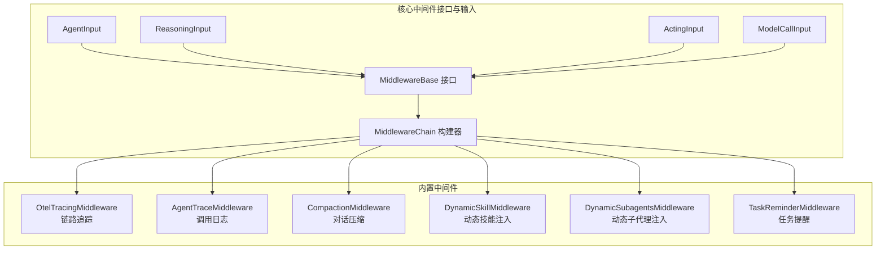
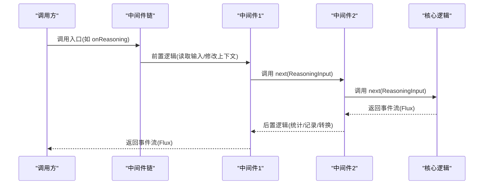
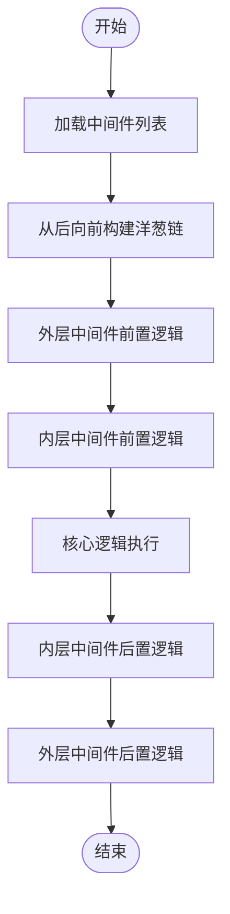
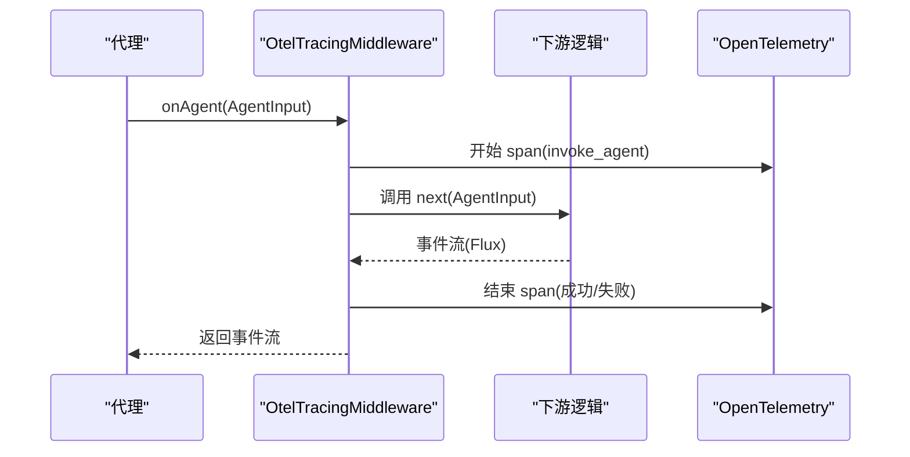
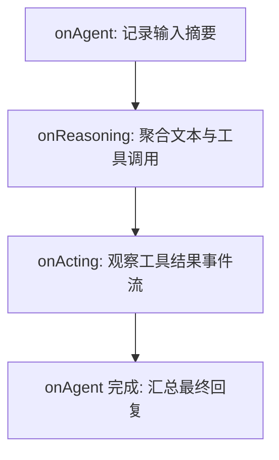
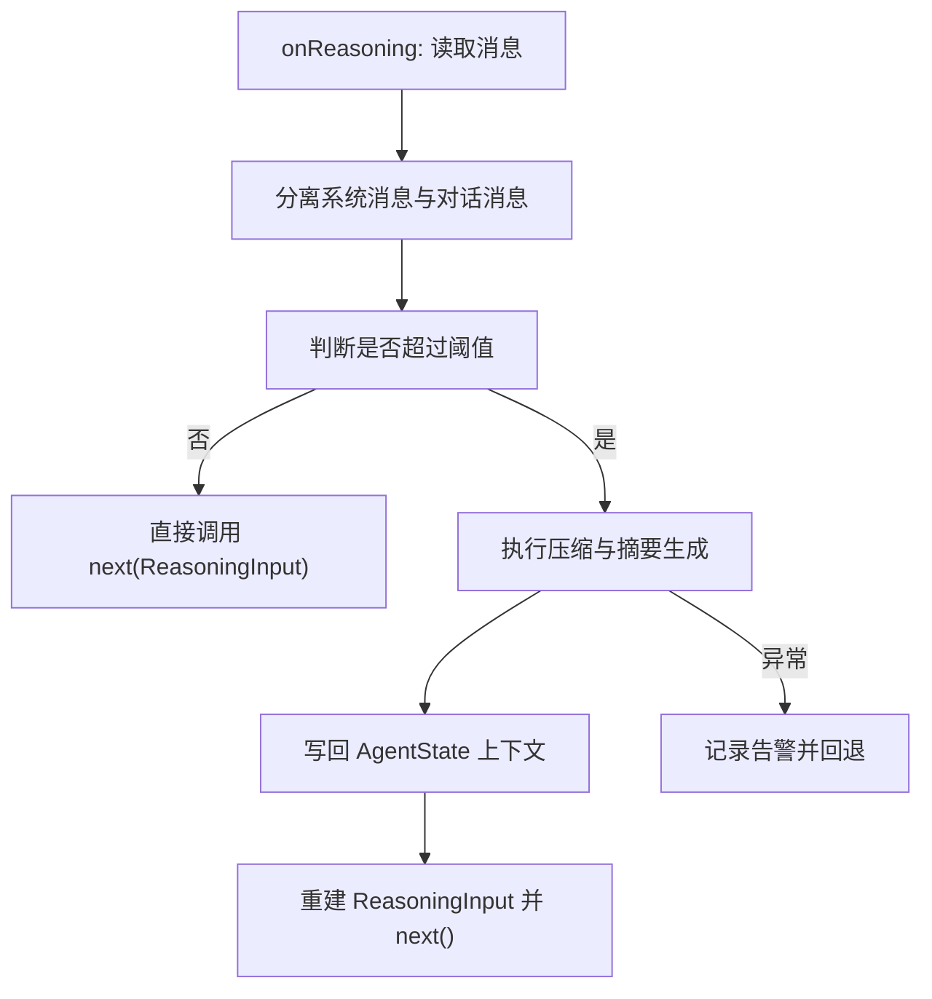
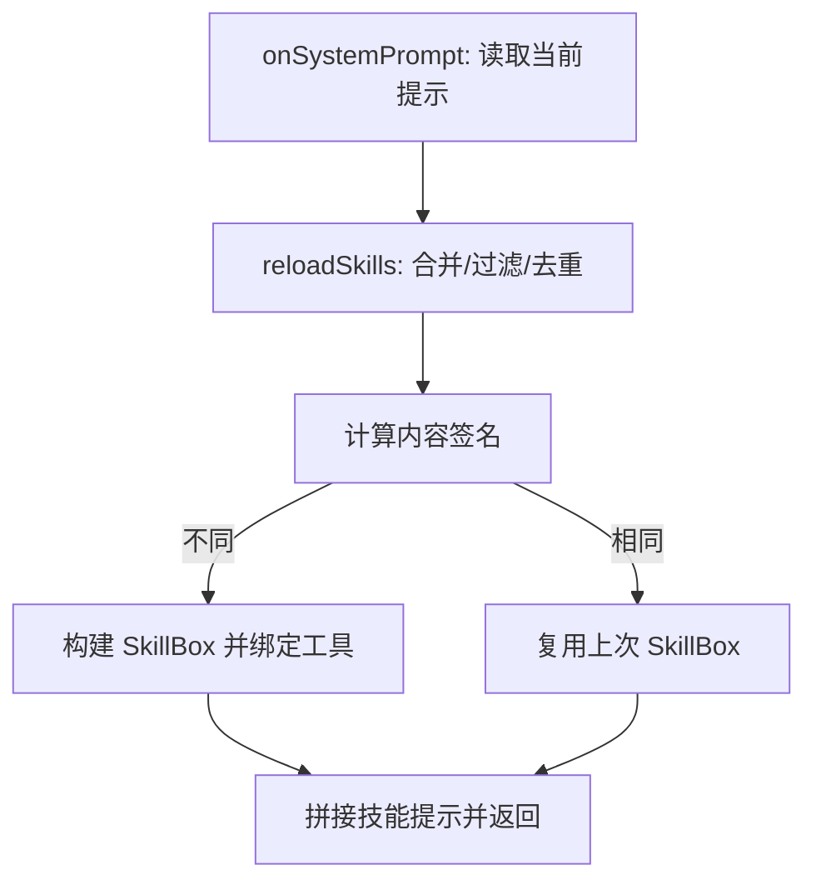
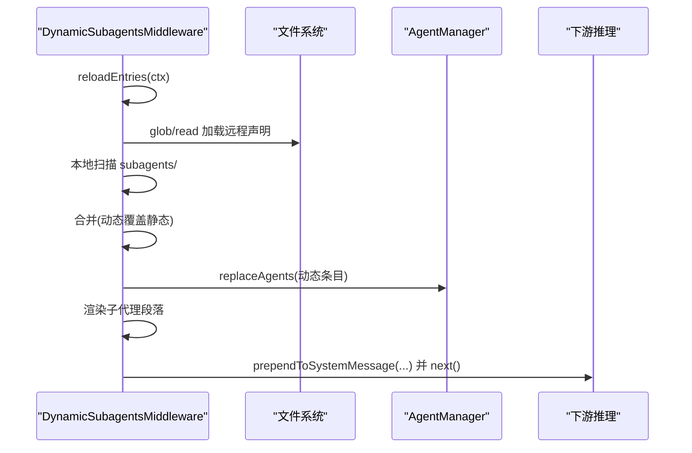
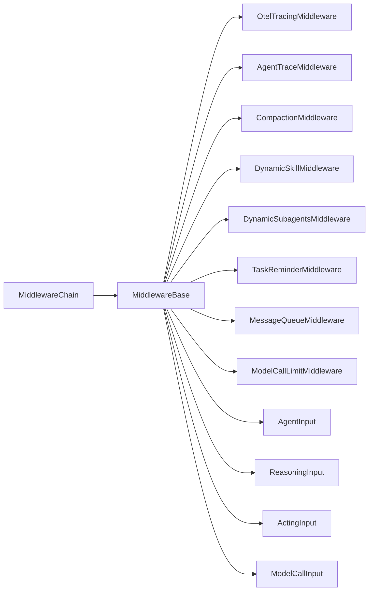

# 中间件系统

<cite>
**本文引用的文件**   
- [MiddlewareChain.java](file://agentscope-core/src/main/java/io/agentscope/core/middleware/MiddlewareChain.java)
- [MiddlewareBase.java](file://agentscope-core/src/main/java/io/agentscope/core/middleware/MiddlewareBase.java)
- [AgentInput.java](file://agentscope-core/src/main/java/io/agentscope/core/middleware/AgentInput.java)
- [ReasoningInput.java](file://agentscope-core/src/main/java/io/agentscope/core/middleware/ReasoningInput.java)
- [ActingInput.java](file://agentscope-core/src/main/java/io/agentscope/core/middleware/ActingInput.java)
- [ModelCallInput.java](file://agentscope-core/src/main/java/io/agentscope/core/middleware/ModelCallInput.java)
- [OtelTracingMiddleware.java](file://agentscope-core/src/main/java/io/agentscope/core/tracing/OtelTracingMiddleware.java)
- [AgentTraceMiddleware.java](file://agentscope-harness/src/main/java/io/agentscope/harness/agent/middleware/AgentTraceMiddleware.java)
- [CompactionMiddleware.java](file://agentscope-harness/src/main/java/io/agentscope/harness/agent/middleware/CompactionMiddleware.java)
- [DynamicSkillMiddleware.java](file://agentscope-core/src/main/java/io/agentscope/core/skill/DynamicSkillMiddleware.java)
- [DynamicSubagentsMiddleware.java](file://agentscope-harness/src/main/java/io/agentscope/harness/agent/middleware/DynamicSubagentsMiddleware.java)
- [TaskReminderMiddleware.java](file://agentscope-core/src/main/java/io/agentscope/core/middleware/TaskReminderMiddleware.java)
- [MessageQueueMiddleware.java](file://agentscope-examples/agents/agentscope-codingagent/src/main/java/io/agentscope/harness/coding/middleware/MessageQueueMiddleware.java)
- [ModelCallLimitMiddleware.java](file://agentscope-examples/agents/agentscope-codingagent/src/main/java/io/agentscope/harness/coding/middleware/ModelCallLimitMiddleware.java)
</cite>

## 目录
1. [简介](#简介)
2. [项目结构](#项目结构)
3. [核心组件](#核心组件)
4. [架构总览](#架构总览)
5. [详细组件分析](#详细组件分析)
6. [依赖分析](#依赖分析)
7. [性能考量](#性能考量)
8. [故障排查指南](#故障排查指南)
9. [结论](#结论)
10. [附录](#附录)

## 简介
本文件面向AgentScope中间件系统，系统性阐述中间件链的设计理念、执行顺序、数据传递与异常处理机制；并逐项解析代理追踪中间件、对话压缩中间件、技能使用中间件、子代理中间件与任务提醒中间件等关键实现。文档同时给出中间件的配置方法（启用条件、参数设置、优先级排序）、自定义中间件的开发指南（接口实现、最佳实践、性能考虑），以及监控与调试技巧。

## 项目结构
中间件体系由核心接口与输入模型、构建链路工具，以及若干内置中间件组成。核心文件位于agentscope-core模块的middleware包，扩展中间件多位于agentscope-harness与examples模块中。

图表来源
- [MiddlewareBase.java:59-144](file://agentscope-core/src/main/java/io/agentscope/core/middleware/MiddlewareBase.java#L59-L144)
- [MiddlewareChain.java:46-62](file://agentscope-core/src/main/java/io/agentscope/core/middleware/MiddlewareChain.java#L46-L62)
- [AgentInput.java:21-26](file://agentscope-core/src/main/java/io/agentscope/core/middleware/AgentInput.java#L21-L26)
- [ReasoningInput.java:23-30](file://agentscope-core/src/main/java/io/agentscope/core/middleware/ReasoningInput.java#L23-L30)
- [ActingInput.java:21-26](file://agentscope-core/src/main/java/io/agentscope/core/middleware/ActingInput.java#L21-L26)
- [ModelCallInput.java:24-33](file://agentscope-core/src/main/java/io/agentscope/core/middleware/ModelCallInput.java#L24-L33)

章节来源
- [MiddlewareBase.java:59-144](file://agentscope-core/src/main/java/io/agentscope/core/middleware/MiddlewareBase.java#L59-L144)
- [MiddlewareChain.java:46-62](file://agentscope-core/src/main/java/io/agentscope/core/middleware/MiddlewareChain.java#L46-L62)

## 核心组件
- 中间件接口：定义五处拦截点（onAgent/onReasoning/onActing/onModelCall）与一处转换管道（onSystemPrompt），默认行为直接透传到next，便于按需覆盖。
- 中间件链构建器：以洋葱模式将多个中间件包装成一个函数式链，支持回溯式构建，确保第一个中间件在外层，最后一个在内层包裹核心逻辑。
- 输入模型：针对不同拦截点提供强类型输入载体，保证中间件可读取上下文信息（消息、工具、生成选项、模型实例等）。

章节来源
- [MiddlewareBase.java:25-44](file://agentscope-core/src/main/java/io/agentscope/core/middleware/MiddlewareBase.java#L25-L44)
- [MiddlewareChain.java:25-30](file://agentscope-core/src/main/java/io/agentscope/core/middleware/MiddlewareChain.java#L25-L30)
- [AgentInput.java:21-26](file://agentscope-core/src/main/java/io/agentscope/core/middleware/AgentInput.java#L21-L26)
- [ReasoningInput.java:23-30](file://agentscope-core/src/main/java/io/agentscope/core/middleware/ReasoningInput.java#L23-L30)
- [ActingInput.java:21-26](file://agentscope-core/src/main/java/io/agentscope/core/middleware/ActingInput.java#L21-L26)
- [ModelCallInput.java:24-33](file://agentscope-core/src/main/java/io/agentscope/core/middleware/ModelCallInput.java#L24-L33)

## 架构总览
中间件链采用“洋葱模式”：外层中间件先于内层执行前置逻辑，再委托给next；当事件流完成或出错时，再依次执行后置逻辑。onSystemPrompt采用单向转换管道，按注册顺序串联应用。

图表来源
- [MiddlewareChain.java:46-62](file://agentscope-core/src/main/java/io/agentscope/core/middleware/MiddlewareChain.java#L46-L62)
- [MiddlewareBase.java:70-127](file://agentscope-core/src/main/java/io/agentscope/core/middleware/MiddlewareBase.java#L70-L127)

## 详细组件分析

### 中间件链与执行顺序
- 构建策略：从列表末尾开始向前迭代，将当前中间件包裹在next之外，形成“外层→内层”的洋葱结构。
- 执行顺序：onAgent/onReasoning/onActing/onModelCall均遵循此顺序；onSystemPrompt则按注册顺序串行转换。
- 数据传递：每个中间件接收当前输入与RuntimeContext，并可选择修改输入（如重建ReasoningInput）后继续传递。
- 异常处理：事件流通过doOnError/doOnComplete进行后置处理，确保资源清理与状态更新。

图表来源
- [MiddlewareChain.java:46-62](file://agentscope-core/src/main/java/io/agentscope/core/middleware/MiddlewareChain.java#L46-L62)

章节来源
- [MiddlewareChain.java:46-62](file://agentscope-core/src/main/java/io/agentscope/core/middleware/MiddlewareChain.java#L46-L62)
- [MiddlewareBase.java:70-142](file://agentscope-core/src/main/java/io/agentscope/core/middleware/MiddlewareBase.java#L70-L142)

### 代理追踪中间件（OtelTracingMiddleware）
- 功能：为代理调用、模型API调用、工具执行分别创建OpenTelemetry跨度，记录关键属性（如回复ID、令牌用量、工具名、调用次数等）。
- 行为：在OTel未配置时短路返回，保持近零开销；在事件流完成/错误时设置状态并结束跨度。
- 使用：作为中间件添加到Agent构建流程中即可生效。

图表来源
- [OtelTracingMiddleware.java:78-124](file://agentscope-core/src/main/java/io/agentscope/core/tracing/OtelTracingMiddleware.java#L78-L124)
- [OtelTracingMiddleware.java:130-177](file://agentscope-core/src/main/java/io/agentscope/core/tracing/OtelTracingMiddleware.java#L130-L177)
- [OtelTracingMiddleware.java:183-236](file://agentscope-core/src/main/java/io/agentscope/core/tracing/OtelTracingMiddleware.java#L183-L236)

章节来源
- [OtelTracingMiddleware.java:40-62](file://agentscope-core/src/main/java/io/agentscope/core/tracing/OtelTracingMiddleware.java#L40-L62)
- [OtelTracingMiddleware.java:78-236](file://agentscope-core/src/main/java/io/agentscope/core/tracing/OtelTracingMiddleware.java#L78-L236)

### 代理调用追踪中间件（AgentTraceMiddleware）
- 功能：在INFO/DEBUG级别输出代理调用前后摘要与细节，包括消息条数、推理文本、工具调用与结果长度、最终回复摘要等。
- 行为：在onAgent阶段记录输入摘要；在onReasoning阶段聚合文本增量与工具调用；在onActing阶段观察工具结果事件流；在onAgent完成后汇总最终回复。
- 适用场景：本地调试、问题定位、行为审计。

图表来源
- [AgentTraceMiddleware.java:56-86](file://agentscope-harness/src/main/java/io/agentscope/harness/agent/middleware/AgentTraceMiddleware.java#L56-L86)
- [AgentTraceMiddleware.java:88-156](file://agentscope-harness/src/main/java/io/agentscope/harness/agent/middleware/AgentTraceMiddleware.java#L88-L156)
- [AgentTraceMiddleware.java:158-220](file://agentscope-harness/src/main/java/io/agentscope/harness/agent/middleware/AgentTraceMiddleware.java#L158-L220)
- [AgentTraceMiddleware.java:222-256](file://agentscope-harness/src/main/java/io/agentscope/harness/agent/middleware/AgentTraceMiddleware.java#L222-L256)

章节来源
- [AgentTraceMiddleware.java:45-52](file://agentscope-harness/src/main/java/io/agentscope/harness/agent/middleware/AgentTraceMiddleware.java#L45-L52)
- [AgentTraceMiddleware.java:56-256](file://agentscope-harness/src/main/java/io/agentscope/harness/agent/middleware/AgentTraceMiddleware.java#L56-L256)

### 对话压缩中间件（CompactionMiddleware）
- 功能：在推理前对长上下文进行压缩，必要时刷新长期记忆、导出会话、生成结构化摘要并替换工作上下文。
- 行为：拆分系统消息与对话消息，触发压缩流程，将结果写回AgentState上下文，并重建ReasoningInput。
- 错误处理：压缩失败时记录告警并回退到不压缩路径继续执行。

图表来源
- [CompactionMiddleware.java:68-139](file://agentscope-harness/src/main/java/io/agentscope/harness/agent/middleware/CompactionMiddleware.java#L68-L139)

章节来源
- [CompactionMiddleware.java:39-52](file://agentscope-harness/src/main/java/io/agentscope/harness/agent/middleware/CompactionMiddleware.java#L39-L52)
- [CompactionMiddleware.java:68-139](file://agentscope-harness/src/main/java/io/agentscope/harness/agent/middleware/CompactionMiddleware.java#L68-L139)

### 动态技能中间件（DynamicSkillMiddleware）
- 功能：基于仓库列表动态合并技能，支持每调用一次重建视图，实现用户隔离与市场集成；可按运行时上下文过滤可见技能。
- 行为：onSystemPrompt阶段拼接技能提示；内部维护签名缓存避免重复重建；可选开启代码执行提示块。
- 参数：仓库列表、工具箱、过滤器、是否启用代码执行、稳定工作目录。

图表来源
- [DynamicSkillMiddleware.java:122-137](file://agentscope-core/src/main/java/io/agentscope/core/skill/DynamicSkillMiddleware.java#L122-L137)
- [DynamicSkillMiddleware.java:160-250](file://agentscope-core/src/main/java/io/agentscope/core/skill/DynamicSkillMiddleware.java#L160-L250)

章节来源
- [DynamicSkillMiddleware.java:39-57](file://agentscope-core/src/main/java/io/agentscope/core/skill/DynamicSkillMiddleware.java#L39-L57)
- [DynamicSkillMiddleware.java:122-250](file://agentscope-core/src/main/java/io/agentscope/core/skill/DynamicSkillMiddleware.java#L122-L250)

### 动态子代理中间件（DynamicSubagentsMiddleware）
- 功能：在每次推理前重新解析子代理集合，支持基于工作区命名空间的用户隔离；两层加载（远程+本地），后者覆盖前者同名项。
- 行为：onReasoning阶段合并静态与动态声明，动态声明优先；将子代理描述注入系统消息；暴露spawn与task工具。
- 集成：可设置网关桥接，使跨节点暴露的子代理可恢复。

图表来源
- [DynamicSubagentsMiddleware.java:144-169](file://agentscope-harness/src/main/java/io/agentscope/harness/agent/middleware/DynamicSubagentsMiddleware.java#L144-L169)
- [DynamicSubagentsMiddleware.java:171-219](file://agentscope-harness/src/main/java/io/agentscope/harness/agent/middleware/DynamicSubagentsMiddleware.java#L171-L219)

章节来源
- [DynamicSubagentsMiddleware.java:47-66](file://agentscope-harness/src/main/java/io/agentscope/harness/agent/middleware/DynamicSubagentsMiddleware.java#L47-L66)
- [DynamicSubagentsMiddleware.java:144-219](file://agentscope-harness/src/main/java/io/agentscope/harness/agent/middleware/DynamicSubagentsMiddleware.java#L144-L219)

### 任务提醒中间件（TaskReminderMiddleware）
- 功能：在每次推理前向系统消息注入当前任务清单快照，确保模型始终看到最新状态；提醒内容标记为合成元数据，不持久化。
- 行为：onSystemPrompt追加一次性使用说明；onReasoning追加临时提醒消息；渲染任务状态与优先级。
- 设计：不同于持久化存储，该中间件仅在推理输入层面临时注入，避免被压缩与持久化。

章节来源
- [TaskReminderMiddleware.java:33-53](file://agentscope-core/src/main/java/io/agentscope/core/middleware/TaskReminderMiddleware.java#L33-L53)
- [TaskReminderMiddleware.java:67-100](file://agentscope-core/src/main/java/io/agentscope/core/middleware/TaskReminderMiddleware.java#L67-L100)
- [TaskReminderMiddleware.java:102-128](file://agentscope-core/src/main/java/io/agentscope/core/middleware/TaskReminderMiddleware.java#L102-L128)

### 示例中间件：消息队列中间件（MessageQueueMiddleware）
- 功能：在推理前将线程级消息队列中的待处理消息注入系统提示，注入后清空队列。
- 行为：通过ThreadLocal携带线程标识，读取远程存储队列并拼接到提示末尾；异常时安全降级。
- 典型用途：异步消息驱动的多轮对话或批处理场景。

章节来源
- [MessageQueueMiddleware.java:28-49](file://agentscope-examples/agents/agentscope-codingagent/src/main/java/io/agentscope/harness/coding/middleware/MessageQueueMiddleware.java#L28-L49)
- [MessageQueueMiddleware.java:66-82](file://agentscope-examples/agents/agentscope-codingagent/src/main/java/io/agentscope/harness/coding/middleware/MessageQueueMiddleware.java#L66-L82)

### 示例中间件：模型调用限制中间件（ModelCallLimitMiddleware）
- 功能：全局限制模型调用次数，超过阈值时中断执行并抛出异常。
- 行为：在onReasoning中递增计数并在超限时终止；提供查询总调用数的方法。
- 典型用途：成本控制、压测保护。

章节来源
- [ModelCallLimitMiddleware.java:29-48](file://agentscope-examples/agents/agentscope-codingagent/src/main/java/io/agentscope/harness/coding/middleware/ModelCallLimitMiddleware.java#L29-L48)
- [ModelCallLimitMiddleware.java:50-72](file://agentscope-examples/agents/agentscope-codingagent/src/main/java/io/agentscope/harness/coding/middleware/ModelCallLimitMiddleware.java#L50-L72)

## 依赖分析
- 组件耦合：中间件通过MiddlewareBase统一接口解耦；MiddlewareChain负责编排，降低各中间件间的相互依赖。
- 外部依赖：追踪中间件依赖OpenTelemetry；动态技能中间件依赖技能仓库与工具箱；动态子代理中间件依赖文件系统与AgentManager；压缩中间件依赖工作区管理与模型实例。
- 循环依赖：中间件链构建时采用函数式包裹，避免显式循环依赖；各中间件仅依赖核心接口与输入模型。

图表来源
- [MiddlewareBase.java:59-144](file://agentscope-core/src/main/java/io/agentscope/core/middleware/MiddlewareBase.java#L59-L144)
- [MiddlewareChain.java:46-62](file://agentscope-core/src/main/java/io/agentscope/core/middleware/MiddlewareChain.java#L46-L62)
- [AgentInput.java:21-26](file://agentscope-core/src/main/java/io/agentscope/core/middleware/AgentInput.java#L21-L26)
- [ReasoningInput.java:23-30](file://agentscope-core/src/main/java/io/agentscope/core/middleware/ReasoningInput.java#L23-L30)
- [ActingInput.java:21-26](file://agentscope-core/src/main/java/io/agentscope/core/middleware/ActingInput.java#L21-L26)
- [ModelCallInput.java:24-33](file://agentscope-core/src/main/java/io/agentscope/core/middleware/ModelCallInput.java#L24-L33)

## 性能考量
- 中间件链构建：洋葱模式为O(n)构建，n为中间件数量；建议按功能拆分中间件，避免单个中间件承担过多职责。
- 事件流处理：使用Flux/Mono进行背压与延迟求值，减少不必要的对象分配；在onAgent/onReasoning/onActing/onModelCall中尽量使用惰性操作。
- 缓存与短路：动态技能中间件通过内容签名缓存避免重复重建；追踪中间件在OTel未配置时短路，避免额外开销。
- I/O与网络：动态子代理与消息队列中间件涉及外部存储访问，应合理设置超时与重试策略；压缩中间件在失败时快速回退，保障主流程可用性。

## 故障排查指南
- 日志级别：使用INFO/DEBUG级别日志区分摘要与详情；AgentTraceMiddleware在INFO级别输出关键摘要，在DEBUG级别输出详细内容。
- 追踪与可观测性：OtelTracingMiddleware为每个关键阶段创建span，结合状态码与异常记录快速定位问题。
- 压缩失败：CompactionMiddleware在失败时记录告警并回退到不压缩路径，检查内存刷新与模型摘要调用是否正常。
- 技能加载：DynamicSkillMiddleware在仓库不可用或过滤异常时降级为透传，检查仓库可达性与过滤逻辑。
- 子代理解析：DynamicSubagentsMiddleware在文件系统glob/read失败时记录调试日志，确认命名空间与权限配置。
- 任务提醒：TaskReminderMiddleware仅注入临时提醒，若发现持久化异常，检查是否误将合成消息持久化。
- 示例中间件：MessageQueueMiddleware需要正确设置ThreadLocal线程ID；ModelCallLimitMiddleware可通过查询总数辅助限流策略验证。

章节来源
- [AgentTraceMiddleware.java:56-86](file://agentscope-harness/src/main/java/io/agentscope/harness/agent/middleware/AgentTraceMiddleware.java#L56-L86)
- [OtelTracingMiddleware.java:78-124](file://agentscope-core/src/main/java/io/agentscope/core/tracing/OtelTracingMiddleware.java#L78-L124)
- [CompactionMiddleware.java:130-138](file://agentscope-harness/src/main/java/io/agentscope/harness/agent/middleware/CompactionMiddleware.java#L130-L138)
- [DynamicSkillMiddleware.java:169-177](file://agentscope-core/src/main/java/io/agentscope/core/skill/DynamicSkillMiddleware.java#L169-L177)
- [DynamicSubagentsMiddleware.java:221-231](file://agentscope-harness/src/main/java/io/agentscope/harness/agent/middleware/DynamicSubagentsMiddleware.java#L221-L231)
- [TaskReminderMiddleware.java:74-100](file://agentscope-core/src/main/java/io/agentscope/core/middleware/TaskReminderMiddleware.java#L74-L100)
- [MessageQueueMiddleware.java:66-82](file://agentscope-examples/agents/agentscope-codingagent/src/main/java/io/agentscope/harness/coding/middleware/MessageQueueMiddleware.java#L66-L82)
- [ModelCallLimitMiddleware.java:50-72](file://agentscope-examples/agents/agentscope-codingagent/src/main/java/io/agentscope/harness/coding/middleware/ModelCallLimitMiddleware.java#L50-L72)

## 结论
AgentScope中间件系统通过统一接口与洋葱链构建，提供了高内聚、低耦合的横切能力组合。内置中间件覆盖了可观测性、上下文压缩、动态技能与子代理注入、任务提醒与示例级限流/队列等典型场景。通过合理的中间件排序与参数配置，可在保证性能的同时提升可观测性与可维护性。

## 附录

### 中间件配置方法
- 启用条件
  - 追踪：在Agent构建时添加OtelTracingMiddleware；若未引入OTel SDK，默认短路。
  - 日志：AgentTraceMiddleware默认按日志级别输出，无需额外开关。
  - 压缩：CompactionMiddleware适用于ReActAgent，需提供工作区管理器与模型实例。
  - 技能：DynamicSkillMiddleware需提供仓库列表与工具箱；可选启用代码执行提示块。
  - 子代理：DynamicSubagentsMiddleware需提供文件系统、工作区路径与工厂构造器。
  - 任务提醒：TaskReminderMiddleware自动生效，无需额外配置。
  - 示例中间件：MessageQueueMiddleware需在调用前设置ThreadLocal；ModelCallLimitMiddleware可指定全局上限。
- 参数设置
  - CompactionMiddleware：传入工作区管理器、模型与压缩配置。
  - DynamicSkillMiddleware：仓库列表、工具箱、过滤器、是否启用代码执行、稳定工作目录。
  - DynamicSubagentsMiddleware：静态条目、文件系统、工作区根路径、工厂构造器、AgentManager、任务仓库等。
  - TaskReminderMiddleware：无需参数。
  - 示例中间件：MessageQueueMiddleware传入存储实现；ModelCallLimitMiddleware传入全局上限。
- 优先级排序
  - 洋葱模式：第一个中间件在外层，最后一个在内层包裹核心逻辑；onSystemPrompt按注册顺序串行。
  - 建议：将通用横切逻辑（如追踪、限流）置于外层，业务逻辑（如技能注入、子代理）置于内层，避免互相干扰。

### 自定义中间件开发指南
- 接口实现
  - 实现MiddlewareBase并按需覆盖拦截点（onAgent/onReasoning/onActing/onModelCall）与onSystemPrompt。
  - 在拦截点中读取RuntimeContext与输入模型，必要时重建输入并调用next。
  - 注意：onAgent/onReasoning/onActing/onModelCall返回Flux<AgentEvent>；onSystemPrompt返回Mono<String>。
- 最佳实践
  - 单一职责：每个中间件聚焦单一关注点，避免过度耦合。
  - 惰性与背压：使用Flux/Mono进行延迟求值与背压，减少内存占用。
  - 短路与降级：在外部依赖不可用时快速降级，保证主流程可用。
  - 可观测性：在关键路径记录日志或span，便于问题定位。
- 性能考虑
  - 避免在onReasoning/onActing中进行昂贵的I/O；将I/O移至onAgent或后台任务。
  - 利用缓存与签名短路（如动态技能中间件）减少重复计算。
  - 控制事件流大小，避免过长的事件序列导致内存压力。