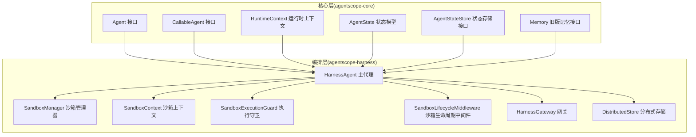
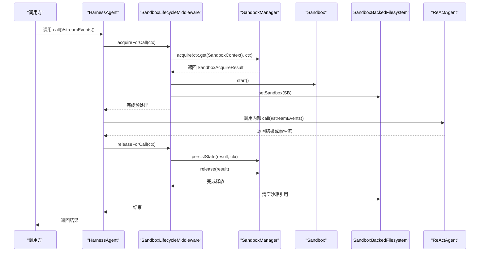
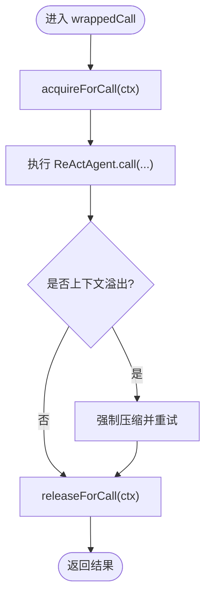
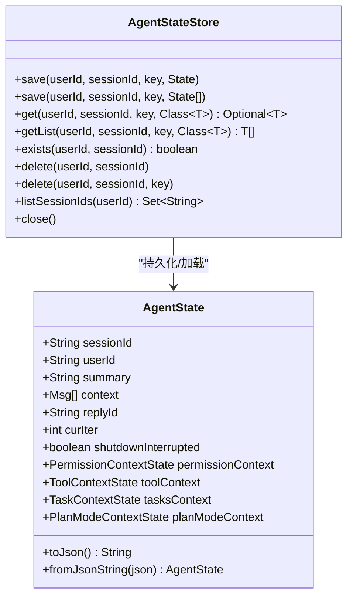
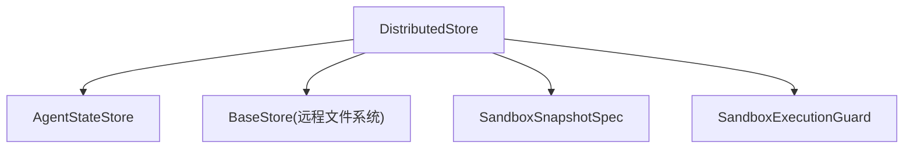
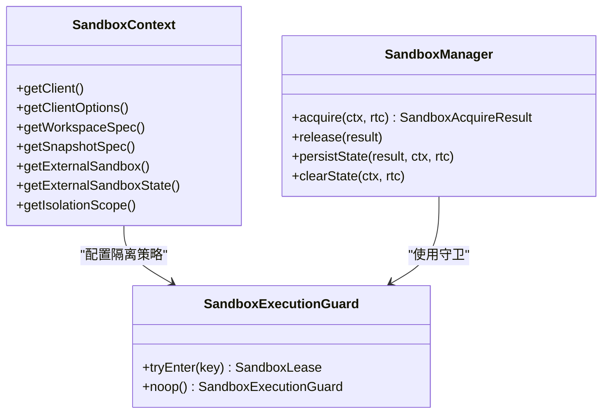
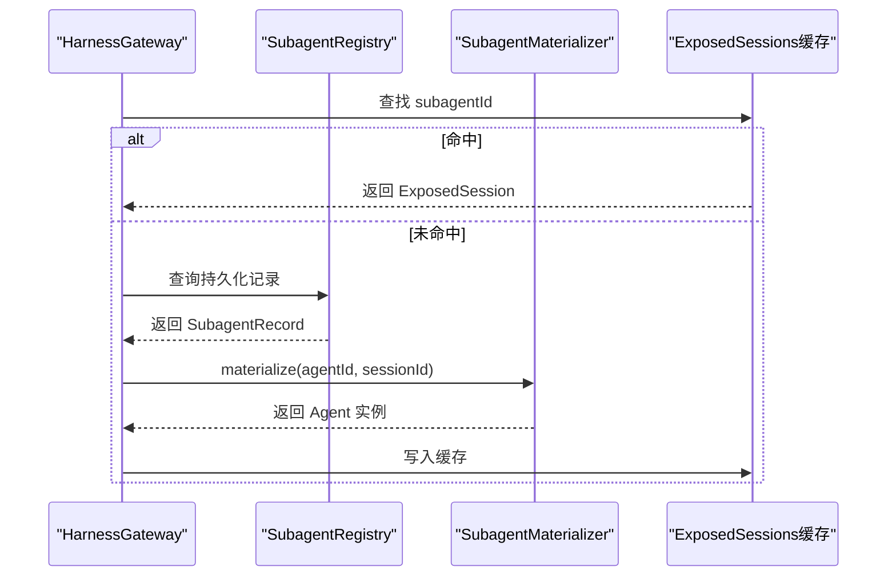
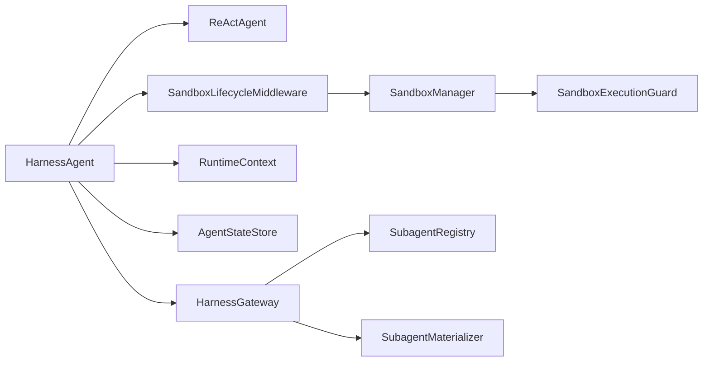

# 代理运行时

<cite>
**本文引用的文件**
- [HarnessAgent.java](file://agentscope-harness/src/main/java/io/agentscope/harness/agent/HarnessAgent.java)
- [Agent.java](file://agentscope-core/src/main/java/io/agentscope/core/agent/Agent.java)
- [CallableAgent.java](file://agentscope-core/src/main/java/io/agentscope/core/agent/CallableAgent.java)
- [RuntimeContext.java](file://agentscope-core/src/main/java/io/agentscope/core/agent/RuntimeContext.java)
- [AgentStateStore.java](file://agentscope-core/src/main/java/io/agentscope/core/state/AgentStateStore.java)
- [AgentState.java](file://agentscope-core/src/main/java/io/agentscope/core/state/AgentState.java)
- [Memory.java](file://agentscope-core/src/main/java/io/agentscope/core/memory/Memory.java)
- [SandboxManager.java](file://agentscope-harness/src/main/java/io/agentscope/harness/agent/sandbox/SandboxManager.java)
- [SandboxContext.java](file://agentscope-harness/src/main/java/io/agentscope/harness/agent/sandbox/SandboxContext.java)
- [SandboxExecutionGuard.java](file://agentscope-harness/src/main/java/io/agentscope/harness/agent/sandbox/SandboxExecutionGuard.java)
- [SandboxLifecycleMiddleware.java](file://agentscope-harness/src/main/java/io/agentscope/harness/agent/middleware/SandboxLifecycleMiddleware.java)
- [HarnessGateway.java](file://agentscope-harness/src/main/java/io/agentscope/harness/agent/gateway/HarnessGateway.java)
- [DistributedStore.java](file://agentscope-harness/src/main/java/io/agentscope/harness/agent/DistributedStore.java)
</cite>

## 目录
1. [引言](#引言)
2. [项目结构](#项目结构)
3. [核心组件](#核心组件)
4. [架构总览](#架构总览)
5. [详细组件分析](#详细组件分析)
6. [依赖分析](#依赖分析)
7. [性能考虑](#性能考虑)
8. [故障排查指南](#故障排查指南)
9. [结论](#结论)
10. [附录：配置与最佳实践](#附录配置与最佳实践)

## 引言
本文件面向 AgentScope 的代理运行时系统，聚焦于 HarnessAgent 的设计与实现，系统性阐述其代理生命周期管理、状态维护与资源调度；同时深入解析分布式存储接口的设计（状态同步、一致性与故障恢复）、隔离作用域的实现（进程隔离、网络隔离与资源限制），并给出配置项、性能调优参数与监控指标建议及实践指南。

## 项目结构
- 运行时核心位于 agentscope-core，定义了通用代理接口、运行时上下文、状态模型与内存接口。
- 运行时编排与扩展位于 agentscope-harness，围绕 ReActAgent 提供工作区、文件系统、沙箱、子代理、技能治理、计划模式等能力，并通过网关统一接入。

图表来源
- [HarnessAgent.java:121-146](file://agentscope-harness/src/main/java/io/agentscope/harness/agent/HarnessAgent.java#L121-L146)
- [Agent.java:21-47](file://agentscope-core/src/main/java/io/agentscope/core/agent/Agent.java#L21-L47)
- [CallableAgent.java:23-35](file://agentscope-core/src/main/java/io/agentscope/core/agent/CallableAgent.java#L23-L35)
- [RuntimeContext.java:26-33](file://agentscope-core/src/main/java/io/agentscope/core/agent/RuntimeContext.java#L26-L33)
- [AgentState.java:31-46](file://agentscope-core/src/main/java/io/agentscope/core/state/AgentState.java#L31-L46)
- [AgentStateStore.java:22-30](file://agentscope-core/src/main/java/io/agentscope/core/state/AgentStateStore.java#L22-L30)
- [Memory.java:22-30](file://agentscope-core/src/main/java/io/agentscope/core/memory/Memory.java#L22-L30)
- [SandboxManager.java:24-40](file://agentscope-harness/src/main/java/io/agentscope/harness/agent/sandbox/SandboxManager.java#L24-L40)
- [SandboxContext.java:21-27](file://agentscope-harness/src/main/java/io/agentscope/harness/agent/sandbox/SandboxContext.java#L21-L27)
- [SandboxExecutionGuard.java:20-27](file://agentscope-harness/src/main/java/io/agentscope/harness/agent/sandbox/SandboxExecutionGuard.java#L20-L27)
- [SandboxLifecycleMiddleware.java:29-32](file://agentscope-harness/src/main/java/io/agentscope/harness/agent/middleware/SandboxLifecycleMiddleware.java#L29-L32)
- [HarnessGateway.java:40-53](file://agentscope-harness/src/main/java/io/agentscope/harness/agent/gateway/HarnessGateway.java#L40-L53)
- [DistributedStore.java](file://agentscope-harness/src/main/java/io/agentscope/harness/agent/DistributedStore.java)

章节来源
- [HarnessAgent.java:121-146](file://agentscope-harness/src/main/java/io/agentscope/harness/agent/HarnessAgent.java#L121-L146)
- [Agent.java:21-47](file://agentscope-core/src/main/java/io/agentscope/core/agent/Agent.java#L21-L47)
- [CallableAgent.java:23-35](file://agentscope-core/src/main/java/io/agentscope/core/agent/CallableAgent.java#L23-L35)
- [RuntimeContext.java:26-33](file://agentscope-core/src/main/java/io/agentscope/core/agent/RuntimeContext.java#L26-L33)
- [AgentState.java:31-46](file://agentscope-core/src/main/java/io/agentscope/core/state/AgentState.java#L31-L46)
- [AgentStateStore.java:22-30](file://agentscope-core/src/main/java/io/agentscope/core/state/AgentStateStore.java#L22-L30)
- [Memory.java:22-30](file://agentscope-core/src/main/java/io/agentscope/core/memory/Memory.java#L22-L30)
- [SandboxManager.java:24-40](file://agentscope-harness/src/main/java/io/agentscope/harness/agent/sandbox/SandboxManager.java#L24-L40)
- [SandboxContext.java:21-27](file://agentscope-harness/src/main/java/io/agentscope/harness/agent/sandbox/SandboxContext.java#L21-L27)
- [SandboxExecutionGuard.java:20-27](file://agentscope-harness/src/main/java/io/agentscope/harness/agent/sandbox/SandboxExecutionGuard.java#L20-L27)
- [SandboxLifecycleMiddleware.java:29-32](file://agentscope-harness/src/main/java/io/agentscope/harness/agent/middleware/SandboxLifecycleMiddleware.java#L29-L32)
- [HarnessGateway.java:40-53](file://agentscope-harness/src/main/java/io/agentscope/harness/agent/gateway/HarnessGateway.java#L40-L53)

## 核心组件
- HarnessAgent：对外的编排主代理，封装 ReActAgent 并注入工作区、文件系统、沙箱、子代理、技能、计划模式与工具配置等能力，提供事件流与阻塞调用两种执行路径。
- RuntimeContext：单次调用的元数据载体，包含会话标识、用户标识、可变属性与工具上下文，确保并发安全的状态访问。
- AgentState/AgentStateStore：会话级状态模型与持久化接口，支持按 (userId, sessionId) 维度保存/加载/删除/列举。
- SandboxManager/SandboxContext/SandboxExecutionGuard/SandboxLifecycleMiddleware：沙箱生命周期管理与隔离控制，覆盖获取/启动/持久化/释放全流程。
- HarnessGateway：多代理注册、稳定会话映射、并发回合串行化与暴露子代理路由。
- DistributedStore：分布式存储抽象，统一提供状态、文件系统后端、沙箱快照与执行守卫等能力。

章节来源
- [HarnessAgent.java:146-217](file://agentscope-harness/src/main/java/io/agentscope/harness/agent/HarnessAgent.java#L146-L217)
- [RuntimeContext.java:33-128](file://agentscope-core/src/main/java/io/agentscope/core/agent/RuntimeContext.java#L33-L128)
- [AgentState.java:59-103](file://agentscope-core/src/main/java/io/agentscope/core/state/AgentState.java#L59-L103)
- [AgentStateStore.java:61-167](file://agentscope-core/src/main/java/io/agentscope/core/state/AgentStateStore.java#L61-L167)
- [SandboxManager.java:40-65](file://agentscope-harness/src/main/java/io/agentscope/harness/agent/sandbox/SandboxManager.java#L40-L65)
- [SandboxContext.java:27-46](file://agentscope-harness/src/main/java/io/agentscope/harness/agent/sandbox/SandboxContext.java#L27-L46)
- [SandboxExecutionGuard.java:58-72](file://agentscope-harness/src/main/java/io/agentscope/harness/agent/sandbox/SandboxExecutionGuard.java#L58-L72)
- [SandboxLifecycleMiddleware.java:51-65](file://agentscope-harness/src/main/java/io/agentscope/harness/agent/middleware/SandboxLifecycleMiddleware.java#L51-L65)
- [HarnessGateway.java:54-93](file://agentscope-harness/src/main/java/io/agentscope/harness/agent/gateway/HarnessGateway.java#L54-L93)
- [DistributedStore.java](file://agentscope-harness/src/main/java/io/agentscope/harness/agent/DistributedStore.java)

## 架构总览
下图展示 HarnessAgent 在一次调用中的关键交互：从 RuntimeContext 注入会话与沙箱上下文，到 SandboxLifecycleMiddleware 获取/启动沙箱，再到 ReActAgent 执行推理与工具调用，最终在 doFinally 阶段完成状态持久化与沙箱释放。

图表来源
- [SandboxLifecycleMiddleware.java:73-108](file://agentscope-harness/src/main/java/io/agentscope/harness/agent/middleware/SandboxLifecycleMiddleware.java#L73-L108)
- [SandboxManager.java:66-140](file://agentscope-harness/src/main/java/io/agentscope/harness/agent/sandbox/SandboxManager.java#L66-L140)
- [HarnessAgent.java:731-795](file://agentscope-harness/src/main/java/io/agentscope/harness/agent/HarnessAgent.java#L731-L795)

## 详细组件分析

### 组件一：HarnessAgent 生命周期与事件流
- 生命周期管理
  - 会话默认值注入：当 RuntimeContext 缺失 sessionId 或 SandboxContext 时，自动填充默认值并注入到新构建的 RuntimeContext 中，确保每次调用的上下文一致性。
  - 沙箱生命周期钩子：在 wrappedCall/wrappedStreamEvents 中使用 Mono.using 包裹，确保 acquire/release 成功配对，避免泄漏。
  - 上下文溢出应急压缩：检测到“上下文长度超限”类错误时，触发强制压缩并重试，保障长对话的稳定性。
- 事件流对齐：streamEvents 返回细粒度 AgentEvent 流，与 Python 2.0 的 agent.reply_stream 对齐，便于前端实时渲染与调试。
- 线程安全与并发：HarnessAgent 声明为无状态单例，基于 (userId, sessionId) 隔离状态；不同会话并发执行，同一会话串行化。

图表来源
- [HarnessAgent.java:731-795](file://agentscope-harness/src/main/java/io/agentscope/harness/agent/HarnessAgent.java#L731-L795)
- [HarnessAgent.java:837-892](file://agentscope-harness/src/main/java/io/agentscope/harness/agent/HarnessAgent.java#L837-L892)

章节来源
- [HarnessAgent.java:542-713](file://agentscope-harness/src/main/java/io/agentscope/harness/agent/HarnessAgent.java#L542-L713)
- [HarnessAgent.java:731-795](file://agentscope-harness/src/main/java/io/agentscope/harness/agent/HarnessAgent.java#L731-L795)
- [HarnessAgent.java:837-892](file://agentscope-harness/src/main/java/io/agentscope/harness/agent/HarnessAgent.java#L837-L892)

### 组件二：状态模型与持久化（AgentState/AgentStateStore）
- AgentState
  - 会话级可变状态：包含摘要、消息上下文、回复标识、当前迭代次数、关闭中断标记、权限/工具/任务/计划模式上下文。
  - 可序列化：提供 JSON 序列化/反序列化方法，适配外部存储。
- AgentStateStore
  - 键空间：以 (userId, sessionId, key) 三元组组织，支持单值/列表保存、存在性检查、删除、列出会话等操作。
  - 实现策略：不同实现可采用增量追加或全量替换，调用方传入完整列表由实现决定存储策略。
- 兼容性：旧版 Memory 接口保留用于 v1 兼容写入，v2 推荐直接使用 AgentState。

图表来源
- [AgentState.java:59-103](file://agentscope-core/src/main/java/io/agentscope/core/state/AgentState.java#L59-L103)
- [AgentState.java:279-288](file://agentscope-core/src/main/java/io/agentscope/core/state/AgentState.java#L279-L288)
- [AgentStateStore.java:61-167](file://agentscope-core/src/main/java/io/agentscope/core/state/AgentStateStore.java#L61-L167)

章节来源
- [AgentState.java:59-103](file://agentscope-core/src/main/java/io/agentscope/core/state/AgentState.java#L59-L103)
- [AgentState.java:279-288](file://agentscope-core/src/main/java/io/agentscope/core/state/AgentState.java#L279-L288)
- [AgentStateStore.java:61-167](file://agentscope-core/src/main/java/io/agentscope/core/state/AgentStateStore.java#L61-L167)
- [Memory.java:22-30](file://agentscope-core/src/main/java/io/agentscope/core/memory/Memory.java#L22-L30)

### 组件三：分布式存储接口与一致性
- 设计目标
  - 提供统一的分布式能力：AgentStateStore、远程文件系统后端、沙箱快照与执行守卫。
  - 当显式配置 stateStore/filesystem 等组件时优先使用显式设置，否则回退到分布式存储提供的默认实现。
- 一致性与故障恢复
  - 会话状态持久化：SandboxManager 在 release 前尝试持久化，失败仅记录日志不回滚主流程。
  - 子代理暴露与跨节点恢复：HarnessGateway 支持本地缓存 + 持久化注册表（StoreBackedSubagentRegistry）实现跨节点/重启恢复。
- 本地/分布式部署识别：提供 isLocalSession 判定，用于在分布式场景中拒绝不兼容的本地会话配置。

图表来源
- [DistributedStore.java](file://agentscope-harness/src/main/java/io/agentscope/harness/agent/DistributedStore.java)
- [HarnessAgent.java:1307-1321](file://agentscope-harness/src/main/java/io/agentscope/harness/agent/HarnessAgent.java#L1307-L1321)
- [SandboxManager.java:172-210](file://agentscope-harness/src/main/java/io/agentscope/harness/agent/sandbox/SandboxManager.java#L172-L210)
- [HarnessGateway.java:279-294](file://agentscope-harness/src/main/java/io/agentscope/harness/agent/gateway/HarnessGateway.java#L279-L294)

章节来源
- [HarnessAgent.java:1307-1321](file://agentscope-harness/src/main/java/io/agentscope/harness/agent/HarnessAgent.java#L1307-L1321)
- [SandboxManager.java:172-210](file://agentscope-harness/src/main/java/io/agentscope/harness/agent/sandbox/SandboxManager.java#L172-L210)
- [HarnessGateway.java:279-294](file://agentscope-harness/src/main/java/io/agentscope/harness/agent/gateway/HarnessGateway.java#L279-L294)

### 组件四：隔离作用域与资源调度
- 隔离作用域
  - 用户级隔离：IsolationScope.USER，避免多并发用户在同一槽位竞争。
  - 代理级隔离：IsolationScope.AGENT，避免多并发代理实例共享槽位。
  - 全局隔离：IsolationScope.GLOBAL，严格串行化。
- 执行守卫
  - SandboxExecutionGuard 提供可插拔的并发控制，支持 Redis、数据库等后端，生命周期覆盖 acquire → start → call → stop → release → lease.close。
- 沙箱生命周期中间件
  - 在 pre-next 与 doFinally 钩子中分别完成沙箱启动与持久化/释放，确保异常场景也能正确回收。

图表来源
- [SandboxContext.java:27-73](file://agentscope-harness/src/main/java/io/agentscope/harness/agent/sandbox/SandboxContext.java#L27-L73)
- [SandboxExecutionGuard.java:58-94](file://agentscope-harness/src/main/java/io/agentscope/harness/agent/sandbox/SandboxExecutionGuard.java#L58-L94)
- [SandboxManager.java:66-140](file://agentscope-harness/src/main/java/io/agentscope/harness/agent/sandbox/SandboxManager.java#L66-L140)

章节来源
- [SandboxContext.java:27-73](file://agentscope-harness/src/main/java/io/agentscope/harness/agent/sandbox/SandboxContext.java#L27-L73)
- [SandboxExecutionGuard.java:58-94](file://agentscope-harness/src/main/java/io/agentscope/harness/agent/sandbox/SandboxExecutionGuard.java#L58-L94)
- [SandboxLifecycleMiddleware.java:51-65](file://agentscope-harness/src/main/java/io/agentscope/harness/agent/middleware/SandboxLifecycleMiddleware.java#L51-L65)
- [SandboxManager.java:66-140](file://agentscope-harness/src/main/java/io/agentscope/harness/agent/sandbox/SandboxManager.java#L66-L140)

### 组件五：网关与子代理路由
- 多代理注册与默认代理：支持 mainAgent 与多 agentId 注册，未指定时回退到默认代理。
- 稳定会话映射：canonicalKey → sessionId，确保同一逻辑会话拥有独立记忆。
- 并发回合串行化：SessionTurnGate 保证同一 gateKey 下的回合互斥。
- 子代理暴露与恢复：暴露子代理生成 subagentId，持久化注册表支持跨节点重建；本地缓存命中优先，否则通过 Materializer 重建。

图表来源
- [HarnessGateway.java:292-337](file://agentscope-harness/src/main/java/io/agentscope/harness/agent/gateway/HarnessGateway.java#L292-L337)

章节来源
- [HarnessGateway.java:54-93](file://agentscope-harness/src/main/java/io/agentscope/harness/agent/gateway/HarnessGateway.java#L54-L93)
- [HarnessGateway.java:134-204](file://agentscope-harness/src/main/java/io/agentscope/harness/agent/gateway/HarnessGateway.java#L134-L204)
- [HarnessGateway.java:292-337](file://agentscope-harness/src/main/java/io/agentscope/harness/agent/gateway/HarnessGateway.java#L292-L337)

## 依赖分析
- 组件耦合
  - HarnessAgent 依赖 ReActAgent 作为内核，同时组合 Workspace/文件系统/沙箱/子代理/技能/计划模式等编排组件。
  - SandboxLifecycleMiddleware 与 SandboxManager 强耦合，负责沙箱生命周期的获取/启动/持久化/释放。
  - RuntimeContext 作为横切数据载体贯穿所有中间件与工具，确保并发安全的状态访问。
- 外部依赖
  - 分布式存储（Redis/数据库/对象存储）通过 DistributedStore 抽象注入，实现状态与文件系统后端的统一。
  - 网关通道（Channel）通过 OutboundAddress 支持主动推送。

图表来源
- [HarnessAgent.java:150-217](file://agentscope-harness/src/main/java/io/agentscope/harness/agent/HarnessAgent.java#L150-L217)
- [SandboxLifecycleMiddleware.java:51-65](file://agentscope-harness/src/main/java/io/agentscope/harness/agent/middleware/SandboxLifecycleMiddleware.java#L51-L65)
- [SandboxManager.java:40-65](file://agentscope-harness/src/main/java/io/agentscope/harness/agent/sandbox/SandboxManager.java#L40-L65)
- [RuntimeContext.java:33-128](file://agentscope-core/src/main/java/io/agentscope/core/agent/RuntimeContext.java#L33-L128)
- [HarnessGateway.java:77-84](file://agentscope-harness/src/main/java/io/agentscope/harness/agent/gateway/HarnessGateway.java#L77-L84)

章节来源
- [HarnessAgent.java:150-217](file://agentscope-harness/src/main/java/io/agentscope/harness/agent/HarnessAgent.java#L150-L217)
- [SandboxLifecycleMiddleware.java:51-65](file://agentscope-harness/src/main/java/io/agentscope/harness/agent/middleware/SandboxLifecycleMiddleware.java#L51-L65)
- [SandboxManager.java:40-65](file://agentscope-harness/src/main/java/io/agentscope/harness/agent/sandbox/SandboxManager.java#L40-L65)
- [RuntimeContext.java:33-128](file://agentscope-core/src/main/java/io/agentscope/core/agent/RuntimeContext.java#L33-L128)
- [HarnessGateway.java:77-84](file://agentscope-harness/src/main/java/io/agentscope/harness/agent/gateway/HarnessGateway.java#L77-L84)

## 性能考虑
- 会话并发控制
  - 使用 SessionTurnGate 对同一 gateKey 的回合进行串行化，避免高并发下的状态竞争与抖动。
- 沙箱生命周期优化
  - 通过 SandboxExecutionGuard 限制并发槽位，结合持久化与释放时机，降低资源争用与冷启动开销。
- 应急压缩
  - 检测到上下文溢出时自动触发压缩并重试，减少因上下文过长导致的失败率。
- 工具与中间件链
  - 合理配置中间件顺序与过滤器，避免重复计算与无效 IO；必要时启用工具结果淘汰中间件以控制内存占用。

## 故障排查指南
- 上下文溢出
  - 现象：报错信息包含“context_length_exceeded”、“maximum context”等关键词。
  - 处理：启用 CompactionMiddleware 并配置合适的触发阈值；若未配置则会直接报错。
- 沙箱获取失败
  - 现象：acquire/start 失败或执行守卫阻塞。
  - 处理：检查 IsolationScope 与执行守卫实现；确认资源池容量与租约释放逻辑。
- 状态持久化失败
  - 现象：persistState 失败但不影响主流程返回。
  - 处理：关注日志告警，排查分布式存储可用性与权限；必要时降级为本地存储验证问题。
- 子代理恢复失败
  - 现象：跨节点/重启后无法解析 subagentId。
  - 处理：确认 StoreBackedSubagentRegistry 是否启用以及 Materializer 是否正确实现。

章节来源
- [HarnessAgent.java:894-907](file://agentscope-harness/src/main/java/io/agentscope/harness/agent/HarnessAgent.java#L894-L907)
- [SandboxManager.java:135-139](file://agentscope-harness/src/main/java/io/agentscope/harness/agent/sandbox/SandboxManager.java#L135-L139)
- [SandboxLifecycleMiddleware.java:122-133](file://agentscope-harness/src/main/java/io/agentscope/harness/agent/middleware/SandboxLifecycleMiddleware.java#L122-L133)
- [HarnessGateway.java:279-294](file://agentscope-harness/src/main/java/io/agentscope/harness/agent/gateway/HarnessGateway.java#L279-L294)

## 结论
HarnessAgent 将 ReActAgent 与工作区、文件系统、沙箱、子代理、技能治理与计划模式等能力整合为统一的运行时编排层，通过 RuntimeContext 实现会话级并发隔离，借助 SandboxLifecycleMiddleware 与 SandboxManager 完成沙箱生命周期管理，并通过 DistributedStore 与网关实现分布式状态同步与跨节点恢复。该架构在保证安全性与隔离性的前提下，提供了良好的扩展性与可观测性，适合在生产环境中承载复杂多代理协作场景。

## 附录：配置与最佳实践

### 代理运行时配置要点
- 会话与上下文
  - 使用 RuntimeContext.builder().sessionId(...).userId(...) 显式绑定会话身份。
  - 通过 ensureSessionDefaults 自动填充默认 sessionId 与 SandboxContext。
- 沙箱与隔离
  - 设置 IsolationScope（USER/AGENT/GLOBAL）与执行守卫，避免槽位竞争。
  - 优先使用外部沙箱或外部沙箱状态，减少自管沙箱的创建/销毁成本。
- 记忆与压缩
  - 启用 CompactionMiddleware 并合理设置触发阈值，避免上下文溢出。
  - 配置 MemoryConfig 与 ToolResultEvictionMiddleware 控制长期记忆与工具结果占用。
- 网关与子代理
  - 通过 HarnessGateway.bindMainAgent 注册主代理；暴露子代理时记录 OutboundAddress 以便主动推送。
  - 在分布式部署中启用 StoreBackedSubagentRegistry 与 Materializer，确保跨节点恢复。

章节来源
- [HarnessAgent.java:803-835](file://agentscope-harness/src/main/java/io/agentscope/harness/agent/HarnessAgent.java#L803-L835)
- [SandboxContext.java:121-123](file://agentscope-harness/src/main/java/io/agentscope/harness/agent/sandbox/SandboxContext.java#L121-L123)
- [SandboxExecutionGuard.java:78-80](file://agentscope-harness/src/main/java/io/agentscope/harness/agent/sandbox/SandboxExecutionGuard.java#L78-L80)
- [SandboxLifecycleMiddleware.java:73-108](file://agentscope-harness/src/main/java/io/agentscope/harness/agent/middleware/SandboxLifecycleMiddleware.java#L73-L108)
- [HarnessGateway.java:109-170](file://agentscope-harness/src/main/java/io/agentscope/harness/agent/gateway/HarnessGateway.java#L109-L170)

### 性能调优参数建议
- 并发控制
  - IsolationScope 选择：高并发用户场景优先 USER；全局严格串行场景选择 GLOBAL。
  - 执行守卫：根据后端能力选择 Redis/数据库实现，设置合理的租约时长与超时。
- 记忆与压缩
  - 上下文预算：maxContextTokens 控制工作区上下文最大令牌数。
  - 压缩策略：CompactionConfig.triggerMessages 设置为较小值以提前干预。
  - 工具结果淘汰：ToolResultEvictionConfig 控制工具输出上限，降低内存峰值。
- 沙箱生命周期
  - 复用策略：优先复用外部沙箱或外部状态，减少创建/销毁开销。
  - 快照策略：合理配置 SnapshotSpec，平衡恢复速度与存储成本。

章节来源
- [HarnessAgent.java:1479-1483](file://agentscope-harness/src/main/java/io/agentscope/harness/agent/HarnessAgent.java#L1479-L1483)
- [HarnessAgent.java:1498-1502](file://agentscope-harness/src/main/java/io/agentscope/harness/agent/HarnessAgent.java#L1498-L1502)
- [SandboxContext.java:106-108](file://agentscope-harness/src/main/java/io/agentscope/harness/agent/sandbox/SandboxContext.java#L106-L108)

### 监控指标建议
- 会话级
  - 会话数量、活跃会话、平均回合时延、失败率（含上下文溢出、沙箱获取失败）。
- 沙箱级
  - 沙箱创建/销毁次数、启动耗时、持久化耗时、租约获取等待时间。
- 记忆与压缩
  - 上下文长度分布、压缩触发次数、压缩后上下文长度、工具结果淘汰数量。
- 网关与子代理
  - 会话回合排队时延、子代理暴露/撤销次数、跨节点恢复成功率。

章节来源
- [SandboxManager.java:135-140](file://agentscope-harness/src/main/java/io/agentscope/harness/agent/sandbox/SandboxManager.java#L135-L140)
- [SandboxLifecycleMiddleware.java:122-133](file://agentscope-harness/src/main/java/io/agentscope/harness/agent/middleware/SandboxLifecycleMiddleware.java#L122-L133)
- [HarnessGateway.java:422-464](file://agentscope-harness/src/main/java/io/agentscope/harness/agent/gateway/HarnessGateway.java#L422-L464)