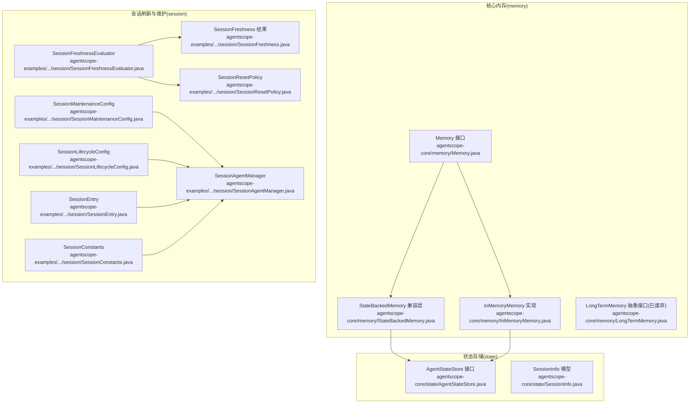
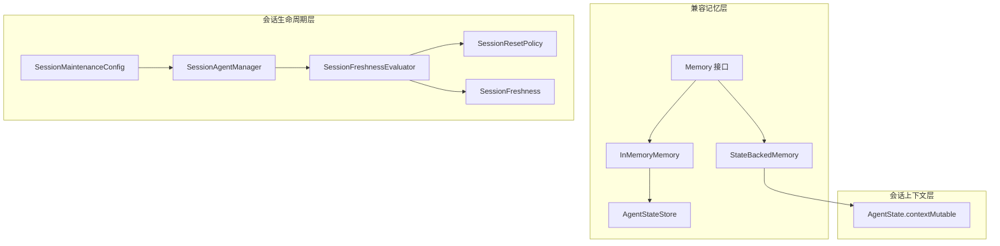
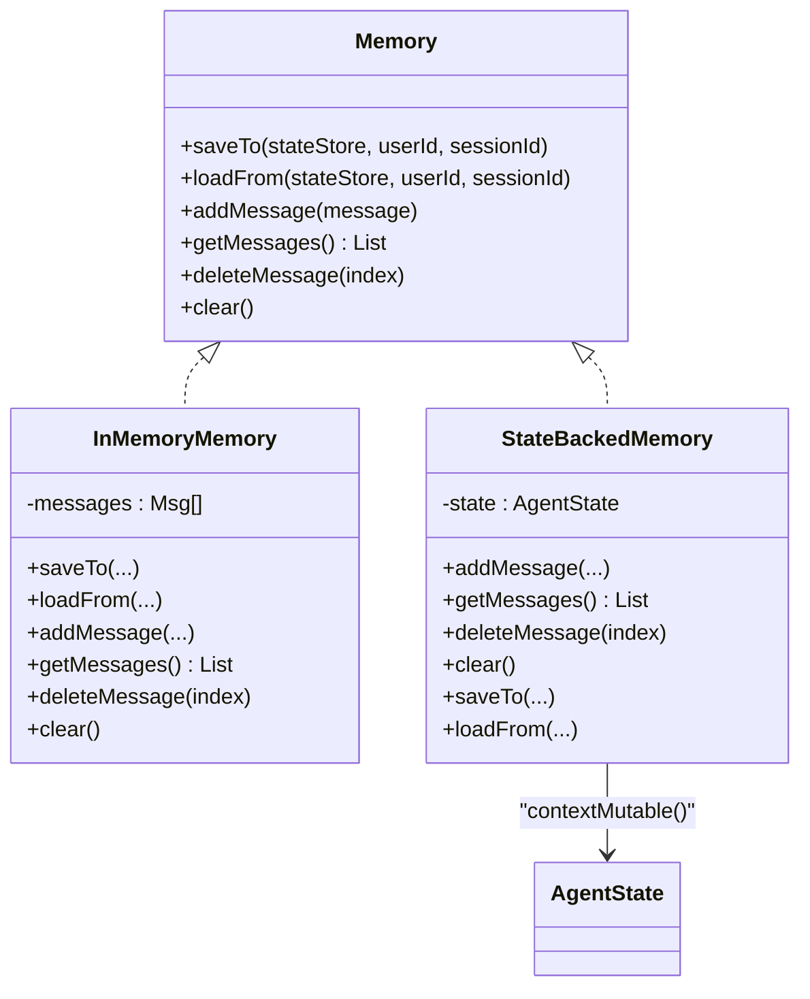
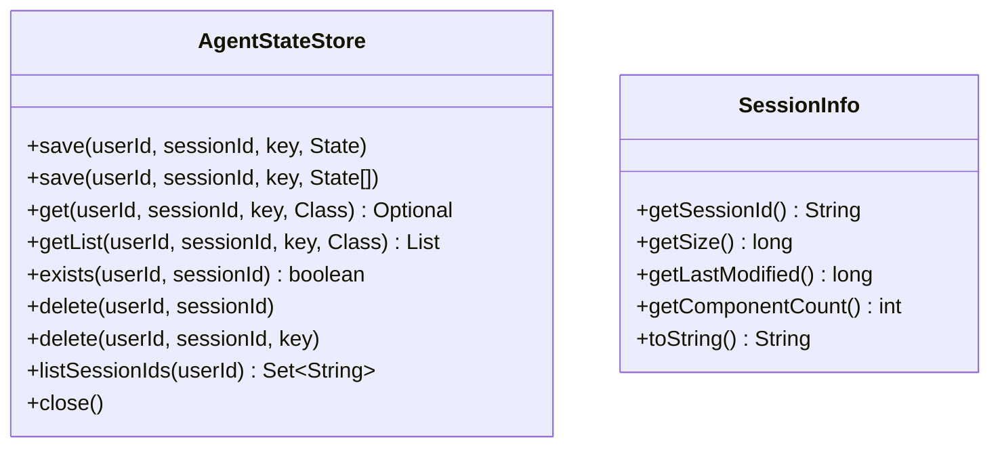
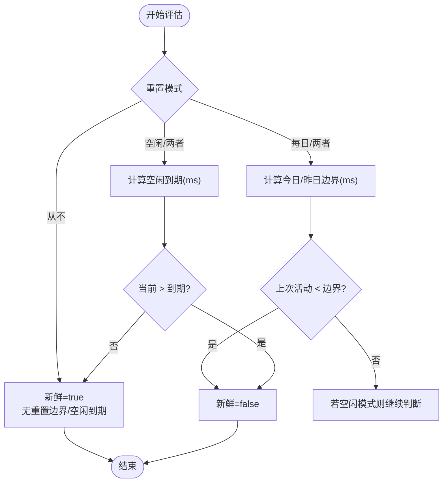
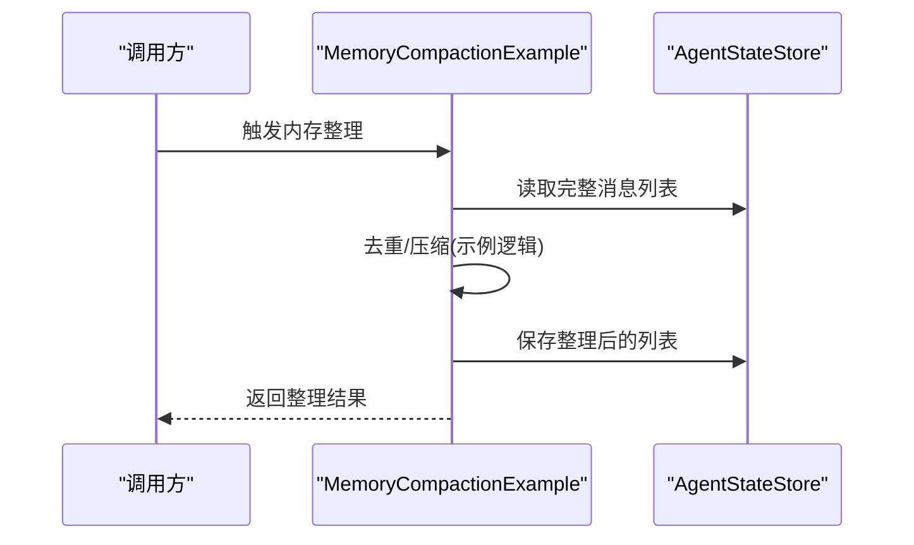
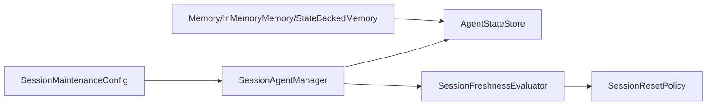

# 内存与会话

<cite>
**本文引用的文件**
- [Memory.java](file://agentscope-core/src/main/java/io/agentscope/core/memory/Memory.java)
- [InMemoryMemory.java](file://agentscope-core/src/main/java/io/agentscope/core/memory/InMemoryMemory.java)
- [LongTermMemory.java](file://agentscope-core/src/main/java/io/agentscope/core/memory/LongTermMemory.java)
- [StateBackedMemory.java](file://agentscope-core/src/main/java/io/agentscope/core/memory/StateBackedMemory.java)
- [AgentStateStore.java](file://agentscope-core/src/main/java/io/agentscope/core/state/AgentStateStore.java)
- [SessionInfo.java](file://agentscope-core/src/main/java/io/agentscope/core/state/SessionInfo.java)
- [SessionFreshness.java](file://agentscope-examples/agents/agentscope-builder/src/main/java/io/agentscope/builder/runtime/session/SessionFreshness.java)
- [SessionFreshnessEvaluator.java](file://agentscope-examples/agents/agentscope-builder/src/main/java/io/agentscope/builder/runtime/session/SessionFreshnessEvaluator.java)
- [SessionMaintenanceConfig.java](file://agentscope-examples/agents/agentscope-builder/src/main/java/io/agentscope/builder/runtime/session/SessionMaintenanceConfig.java)
- [SessionAgentManager.java](file://agentscope-examples/agents/agentscope-builder/src/main/java/io/agentscope/builder/runtime/session/SessionAgentManager.java)
- [SessionLifecycleConfig.java](file://agentscope-examples/agents/agentscope-builder/src/main/java/io/agentscope/builder/runtime/config/SessionLifecycleConfig.java)
- [SessionResetPolicy.java](file://agentscope-examples/agents/agentscope-builder/src/main/java/io/agentscope/builder/runtime/session/SessionResetPolicy.java)
- [SessionEntry.java](file://agentscope-examples/agents/agentscope-builder/src/main/java/io/agentscope/builder/runtime/session/SessionEntry.java)
- [SessionConstants.java](file://agentscope-examples/agents/agentscope-builder/src/main/java/io/agentscope/builder/runtime/session/SessionConstants.java)
- [MemoryCompactionExample.java](file://agentscope-examples/documentation/src/main/java/io/agentscope/examples/documentation2/harness/memory/MemoryCompactionExample.java)
</cite>

## 目录
1. [引言](#引言)
2. [项目结构](#项目结构)
3. [核心组件](#核心组件)
4. [架构总览](#架构总览)
5. [详细组件分析](#详细组件分析)
6. [依赖分析](#依赖分析)
7. [性能考虑](#性能考虑)
8. [故障排除指南](#故障排除指南)
9. [结论](#结论)
10. [附录](#附录)

## 引言
本技术文档聚焦于 AgentScope 的“内存与会话”系统，面向两类关键能力：会话上下文的记忆与管理，以及会话的生命周期与维护策略。根据仓库代码，框架在 2.0 版本后已将“对话记忆”迁移至 AgentState 上下文，同时保留兼容层以适配旧版用法；会话层面则通过状态存储接口与会话评估/维护工具实现生命周期管理与资源控制。

## 项目结构
围绕“内存与会话”的核心代码主要分布在以下模块：
- 核心内存接口与兼容实现：agentscope-core/memory
- 状态存储接口与会话信息模型：agentscope-core/state
- 会话刷新与维护策略示例：agentscope-examples/.../session

图表来源
- [Memory.java:1-79](file://agentscope-core/src/main/java/io/agentscope/core/memory/Memory.java#L1-L79)
- [InMemoryMemory.java:1-135](file://agentscope-core/src/main/java/io/agentscope/core/memory/InMemoryMemory.java#L1-L135)
- [StateBackedMemory.java:1-80](file://agentscope-core/src/main/java/io/agentscope/core/memory/StateBackedMemory.java#L1-L80)
- [LongTermMemory.java:1-112](file://agentscope-core/src/main/java/io/agentscope/core/memory/LongTermMemory.java#L1-L112)
- [AgentStateStore.java:1-167](file://agentscope-core/src/main/java/io/agentscope/core/state/AgentStateStore.java#L1-L167)
- [SessionInfo.java:1-94](file://agentscope-core/src/main/java/io/agentscope/core/state/SessionInfo.java#L1-L94)
- [SessionFreshnessEvaluator.java:1-93](file://agentscope-examples/agents/agentscope-builder/src/main/java/io/agentscope/builder/runtime/session/SessionFreshnessEvaluator.java#L1-L93)
- [SessionFreshness.java:1-26](file://agentscope-examples/agents/agentscope-builder/src/main/java/io/agentscope/builder/runtime/session/SessionFreshness.java#L1-L26)
- [SessionMaintenanceConfig.java:1-42](file://agentscope-examples/agents/agentscope-builder/src/main/java/io/agentscope/builder/runtime/session/SessionMaintenanceConfig.java#L1-L42)
- [SessionAgentManager.java](file://agentscope-examples/agents/agentscope-builder/src/main/java/io/agentscope/builder/runtime/session/SessionAgentManager.java)

章节来源
- [Memory.java:1-79](file://agentscope-core/src/main/java/io/agentscope/core/memory/Memory.java#L1-L79)
- [InMemoryMemory.java:1-135](file://agentscope-core/src/main/java/io/agentscope/core/memory/InMemoryMemory.java#L1-L135)
- [StateBackedMemory.java:1-80](file://agentscope-core/src/main/java/io/agentscope/core/memory/StateBackedMemory.java#L1-L80)
- [LongTermMemory.java:1-112](file://agentscope-core/src/main/java/io/agentscope/core/memory/LongTermMemory.java#L1-L112)
- [AgentStateStore.java:1-167](file://agentscope-core/src/main/java/io/agentscope/core/state/AgentStateStore.java#L1-L167)
- [SessionInfo.java:1-94](file://agentscope-core/src/main/java/io/agentscope/core/state/SessionInfo.java#L1-L94)
- [SessionFreshnessEvaluator.java:1-93](file://agentscope-examples/agents/agentscope-builder/src/main/java/io/agentscope/builder/runtime/session/SessionFreshnessEvaluator.java#L1-L93)
- [SessionFreshness.java:1-26](file://agentscope-examples/agents/agentscope-builder/src/main/java/io/agentscope/builder/runtime/session/SessionFreshness.java#L1-L26)
- [SessionMaintenanceConfig.java:1-42](file://agentscope-examples/agents/agentscope-builder/src/main/java/io/agentscope/builder/runtime/session/SessionMaintenanceConfig.java#L1-L42)
- [SessionAgentManager.java](file://agentscope-examples/agents/agentscope-builder/src/main/java/io/agentscope/builder/runtime/session/SessionAgentManager.java)

## 核心组件
- 记忆接口与兼容实现
  - Memory：定义消息增删改查与持久化入口（v1 兼容），现已标记废弃。
  - InMemoryMemory：基于线程安全列表的内存实现，并支持与 AgentStateStore 的序列化交互。
  - StateBackedMemory：将 Memory 调用桥接至 AgentState.contextMutable，作为 2.0 的兼容层。
  - LongTermMemory：跨会话长期记忆抽象（已废弃）。
- 状态存储与会话信息
  - AgentStateStore：统一的状态持久化接口，支持保存/加载/删除/列举会话键值。
  - SessionInfo：会话元信息（大小、修改时间、组件数）。
- 会话刷新与维护
  - SessionFreshnessEvaluator：按“每日重置边界”和“空闲超时”评估会话新鲜度。
  - SessionFreshness：评估结果封装。
  - SessionMaintenanceConfig：会话维护开关、过期清理阈值、最大条目上限。
  - SessionResetPolicy：会话重置模式（从不/每日/空闲/两者）。
  - SessionAgentManager：会话生命周期与维护策略的协调者（示例实现）。

章节来源
- [Memory.java:22-79](file://agentscope-core/src/main/java/io/agentscope/core/memory/Memory.java#L22-L79)
- [InMemoryMemory.java:26-135](file://agentscope-core/src/main/java/io/agentscope/core/memory/InMemoryMemory.java#L26-L135)
- [StateBackedMemory.java:24-80](file://agentscope-core/src/main/java/io/agentscope/core/memory/StateBackedMemory.java#L24-L80)
- [LongTermMemory.java:22-112](file://agentscope-core/src/main/java/io/agentscope/core/memory/LongTermMemory.java#L22-L112)
- [AgentStateStore.java:22-167](file://agentscope-core/src/main/java/io/agentscope/core/state/AgentStateStore.java#L22-L167)
- [SessionInfo.java:19-94](file://agentscope-core/src/main/java/io/agentscope/core/state/SessionInfo.java#L19-L94)
- [SessionFreshnessEvaluator.java:23-93](file://agentscope-examples/agents/agentscope-builder/src/main/java/io/agentscope/builder/runtime/session/SessionFreshnessEvaluator.java#L23-L93)
- [SessionFreshness.java:18-26](file://agentscope-examples/agents/agentscope-builder/src/main/java/io/agentscope/builder/runtime/session/SessionFreshness.java#L18-L26)
- [SessionMaintenanceConfig.java:18-42](file://agentscope-examples/agents/agentscope-builder/src/main/java/io/agentscope/builder/runtime/session/SessionMaintenanceConfig.java#L18-L42)
- [SessionResetPolicy.java](file://agentscope-examples/agents/agentscope-builder/src/main/java/io/agentscope/builder/runtime/session/SessionResetPolicy.java)

## 架构总览
AgentScope 的“内存与会话”体系由三层构成：
- 会话上下文层：AgentState.contextMutable 提供当前会话的对话历史容器。
- 兼容记忆层：Memory/InMemoryMemory/StateBackedMemory 为旧版代码提供兼容路径。
- 会话生命周期层：通过 Freshness/Evaluator/Maintenance 策略控制会话的新鲜度与资源占用。

图表来源
- [StateBackedMemory.java:24-80](file://agentscope-core/src/main/java/io/agentscope/core/memory/StateBackedMemory.java#L24-L80)
- [InMemoryMemory.java:26-135](file://agentscope-core/src/main/java/io/agentscope/core/memory/InMemoryMemory.java#L26-L135)
- [AgentStateStore.java:22-167](file://agentscope-core/src/main/java/io/agentscope/core/state/AgentStateStore.java#L22-L167)
- [SessionFreshnessEvaluator.java:23-93](file://agentscope-examples/agents/agentscope-builder/src/main/java/io/agentscope/builder/runtime/session/SessionFreshnessEvaluator.java#L23-L93)
- [SessionFreshness.java:18-26](file://agentscope-examples/agents/agentscope-builder/src/main/java/io/agentscope/builder/runtime/session/SessionFreshness.java#L18-L26)
- [SessionMaintenanceConfig.java:18-42](file://agentscope-examples/agents/agentscope-builder/src/main/java/io/agentscope/builder/runtime/session/SessionMaintenanceConfig.java#L18-L42)
- [SessionAgentManager.java](file://agentscope-examples/agents/agentscope-builder/src/main/java/io/agentscope/builder/runtime/session/SessionAgentManager.java)

## 详细组件分析

### 组件一：记忆接口与兼容实现
- 设计要点
  - Memory 接口提供消息增删改查与持久化入口，标注废弃，仅用于 v1 兼容。
  - InMemoryMemory 使用线程安全列表存储消息，并通过 AgentStateStore 支持增量/全量写入策略。
  - StateBackedMemory 将所有操作桥接到 AgentState.contextMutable，确保新代码直接使用上下文。
- 数据结构与复杂度
  - 基于 CopyOnWriteArrayList 的消息列表，读多写少场景具备良好并发性；删除/插入为 O(n)。
  - 保存/加载通过 AgentStateStore 的 save/getList 完成，具体写入策略由实现决定（如 JsonFileAgentStateStore 的增量追加）。
- 并发与错误处理
  - 删除/清空等操作对越界采用“无操作”策略，避免异常传播。
  - 读取时过滤空元素并返回副本，保证调用方隔离。
- 性能影响
  - 大会话消息累积可能导致内存膨胀，需结合会话维护策略与定期清理。

图表来源
- [Memory.java:22-79](file://agentscope-core/src/main/java/io/agentscope/core/memory/Memory.java#L22-L79)
- [InMemoryMemory.java:26-135](file://agentscope-core/src/main/java/io/agentscope/core/memory/InMemoryMemory.java#L26-L135)
- [StateBackedMemory.java:24-80](file://agentscope-core/src/main/java/io/agentscope/core/memory/StateBackedMemory.java#L24-L80)

章节来源
- [Memory.java:22-79](file://agentscope-core/src/main/java/io/agentscope/core/memory/Memory.java#L22-L79)
- [InMemoryMemory.java:26-135](file://agentscope-core/src/main/java/io/agentscope/core/memory/InMemoryMemory.java#L26-L135)
- [StateBackedMemory.java:24-80](file://agentscope-core/src/main/java/io/agentscope/core/memory/StateBackedMemory.java#L24-L80)

### 组件二：状态存储与会话信息
- 设计要点
  - AgentStateStore 定义了以 (userId, sessionId, key) 三元组为索引的统一持久化接口，支持保存单值/列表、查询、存在性检查、删除、会话枚举等。
  - SessionInfo 提供会话维度的元信息（大小、最后修改时间、组件数量），便于监控与维护。
- 存储策略差异
  - 不同实现可采用不同策略：例如 JsonFileAgentStateStore 可进行增量追加，InMemoryAgentStateStore 则全量替换。
- 并发与一致性
  - 接口未强制并发控制语义，具体实现需自行保证线程安全与原子性。

图表来源
- [AgentStateStore.java:22-167](file://agentscope-core/src/main/java/io/agentscope/core/state/AgentStateStore.java#L22-L167)
- [SessionInfo.java:19-94](file://agentscope-core/src/main/java/io/agentscope/core/state/SessionInfo.java#L19-L94)

章节来源
- [AgentStateStore.java:22-167](file://agentscope-core/src/main/java/io/agentscope/core/state/AgentStateStore.java#L22-L167)
- [SessionInfo.java:19-94](file://agentscope-core/src/main/java/io/agentscope/core/state/SessionInfo.java#L19-L94)

### 组件三：会话刷新与维护策略
- 设计要点
  - SessionFreshnessEvaluator 基于“每日重置边界”和“空闲超时”两个维度评估会话是否仍“新鲜”，并输出边界时间戳。
  - SessionResetPolicy 定义重置模式（从不/每日/空闲/两者），驱动刷新评估。
  - SessionMaintenanceConfig 控制是否启用维护、过期阈值与最大条目数，配合 SessionAgentManager 执行清理与滚动。
- 刷新流程
  - 评估当前时间与上次活动时间，计算每日边界或空闲到期时间，判定 fresh=false 即触发会话重置/滚动。
- 维护流程
  - 在会话创建/触达时执行维护：清理过期会话、按条目上限裁剪，优先淘汰最老会话。

图表来源
- [SessionFreshnessEvaluator.java:40-93](file://agentscope-examples/agents/agentscope-builder/src/main/java/io/agentscope/builder/runtime/session/SessionFreshnessEvaluator.java#L40-L93)
- [SessionResetPolicy.java](file://agentscope-examples/agents/agentscope-builder/src/main/java/io/agentscope/builder/runtime/session/SessionResetPolicy.java)

章节来源
- [SessionFreshnessEvaluator.java:23-93](file://agentscope-examples/agents/agentscope-builder/src/main/java/io/agentscope/builder/runtime/session/SessionFreshnessEvaluator.java#L23-L93)
- [SessionFreshness.java:18-26](file://agentscope-examples/agents/agentscope-builder/src/main/java/io/agentscope/builder/runtime/session/SessionFreshness.java#L18-L26)
- [SessionMaintenanceConfig.java:18-42](file://agentscope-examples/agents/agentscope-builder/src/main/java/io/agentscope/builder/runtime/session/SessionMaintenanceConfig.java#L18-L42)
- [SessionAgentManager.java](file://agentscope-examples/agents/agentscope-builder/src/main/java/io/agentscope/builder/runtime/session/SessionAgentManager.java)

### 组件四：内存整合与压缩（示例）
- 设计要点
  - 示例展示了如何对消息列表进行“去重/压缩”处理，以减少存储体积与传输开销。
- 实践建议
  - 压缩策略应与消息内容稳定性匹配：对高频重复文本可采用哈希去重；对多媒体/大对象可采用外部引用。
  - 去重需考虑时间窗口与角色差异，避免误删有效上下文。

图表来源
- [MemoryCompactionExample.java](file://agentscope-examples/documentation/src/main/java/io/agentscope/examples/documentation2/harness/memory/MemoryCompactionExample.java)

章节来源
- [MemoryCompactionExample.java](file://agentscope-examples/documentation/src/main/java/io/agentscope/examples/documentation2/harness/memory/MemoryCompactionExample.java)

## 依赖分析
- 组件耦合
  - Memory/InMemoryMemory/StateBackedMemory 与 AgentStateStore 存在运行时耦合，但接口清晰，可通过替换实现解耦存储后端。
  - 会话刷新与维护策略独立于核心内存实现，通过 SessionAgentManager 协调，降低耦合度。
- 外部依赖
  - 长期记忆接口 LongTermMemory 已废弃，不再引入外部扩展。
  - 会话维护示例依赖 Java 时间与时区 API，无第三方框架强绑定。

图表来源
- [AgentStateStore.java:22-167](file://agentscope-core/src/main/java/io/agentscope/core/state/AgentStateStore.java#L22-L167)
- [SessionFreshnessEvaluator.java:23-93](file://agentscope-examples/agents/agentscope-builder/src/main/java/io/agentscope/builder/runtime/session/SessionFreshnessEvaluator.java#L23-L93)
- [SessionMaintenanceConfig.java:18-42](file://agentscope-examples/agents/agentscope-builder/src/main/java/io/agentscope/builder/runtime/session/SessionMaintenanceConfig.java#L18-L42)
- [SessionAgentManager.java](file://agentscope-examples/agents/agentscope-builder/src/main/java/io/agentscope/builder/runtime/session/SessionAgentManager.java)

章节来源
- [AgentStateStore.java:22-167](file://agentscope-core/src/main/java/io/agentscope/core/state/AgentStateStore.java#L22-L167)
- [SessionFreshnessEvaluator.java:23-93](file://agentscope-examples/agents/agentscope-builder/src/main/java/io/agentscope/builder/runtime/session/SessionFreshnessEvaluator.java#L23-L93)
- [SessionMaintenanceConfig.java:18-42](file://agentscope-examples/agents/agentscope-builder/src/main/java/io/agentscope/builder/runtime/session/SessionMaintenanceConfig.java#L18-L42)
- [SessionAgentManager.java](file://agentscope-examples/agents/agentscope-builder/src/main/java/io/agentscope/builder/runtime/session/SessionAgentManager.java)

## 性能考虑
- 内存与存储
  - 使用线程安全集合承载消息，适合高并发读取场景；频繁写入建议结合会话维护策略与定期清理。
  - 增量写入策略可显著降低磁盘写放大（JsonFileAgentStateStore），但需注意读取合并成本。
- 会话新鲜度
  - 合理设置每日重置小时与空闲分钟，平衡上下文连续性与资源占用。
  - 过期阈值与最大条目数应结合业务峰值与硬件资源设定。
- 压缩与去重
  - 对重复指令/提示词进行去重；对长文本采用哈希索引与外部引用。
  - 压缩前先评估收益：对已压缩媒体内容的二次压缩可能得不偿失。

## 故障排除指南
- 会话为空或丢失
  - 检查 AgentStateStore 的 exists/listSessionIds 行为，确认 userId/sessionId 组合正确。
  - 若使用增量写入实现，确认写入顺序与幂等性。
- 新鲜度误判
  - 校验系统时区与每日重置边界计算逻辑，避免跨日边界导致的误判。
  - 空闲超时应基于实际活动时间而非系统启动时间。
- 清理策略失效
  - 确认 SessionMaintenanceConfig.enabled 已启用，pruneAfterMs 与 maxEntries 设置合理。
  - 检查 SessionAgentManager 的调度频率与执行上下文权限。

章节来源
- [AgentStateStore.java:119-167](file://agentscope-core/src/main/java/io/agentscope/core/state/AgentStateStore.java#L119-L167)
- [SessionFreshnessEvaluator.java:78-93](file://agentscope-examples/agents/agentscope-builder/src/main/java/io/agentscope/builder/runtime/session/SessionFreshnessEvaluator.java#L78-L93)
- [SessionMaintenanceConfig.java:26-42](file://agentscope-examples/agents/agentscope-builder/src/main/java/io/agentscope/builder/runtime/session/SessionMaintenanceConfig.java#L26-L42)
- [SessionAgentManager.java](file://agentscope-examples/agents/agentscope-builder/src/main/java/io/agentscope/builder/runtime/session/SessionAgentManager.java)

## 结论
AgentScope 的“内存与会话”体系在 2.0 版本后将对话记忆迁移至 AgentState 上下文，同时保留兼容层以保障平滑升级。会话层面通过 Freshness/Evaluator/Maintenance 策略实现可控的新鲜度与资源占用，配合灵活的状态存储接口，可在多种后端上实现一致的行为。建议在生产环境中结合业务特征配置合理的维护参数与压缩策略，以获得更佳的性能与稳定性。

## 附录
- 最佳实践
  - 优先使用 AgentState.contextMutable 访问上下文，避免直接依赖 Memory 接口。
  - 启用增量写入（如 JsonFileAgentStateStore）以降低写放大。
  - 合理设置每日重置与空闲超时，兼顾上下文连贯性与资源回收。
  - 对高频重复内容进行去重/压缩，减少存储与网络开销。
- 性能调优
  - 监控 SessionInfo 中的 size 与 componentCount，识别异常增长。
  - 调整会话维护阈值，避免过度清理导致上下文频繁丢失。
- 故障排查清单
  - 确认 userId/sessionId 组合与存储后端键空间映射一致。
  - 校验系统时区与边界计算逻辑。
  - 检查维护策略是否启用及参数是否合理。