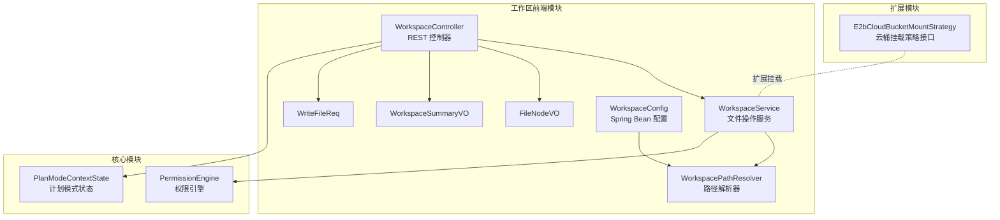
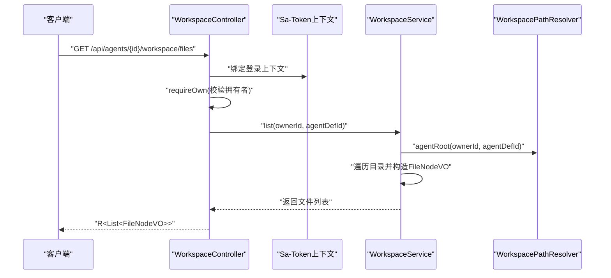
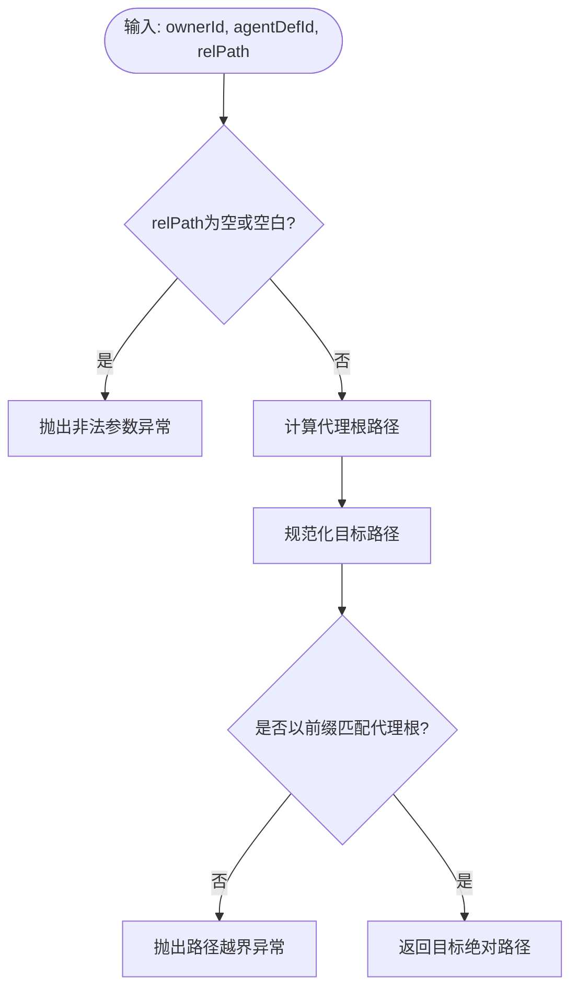
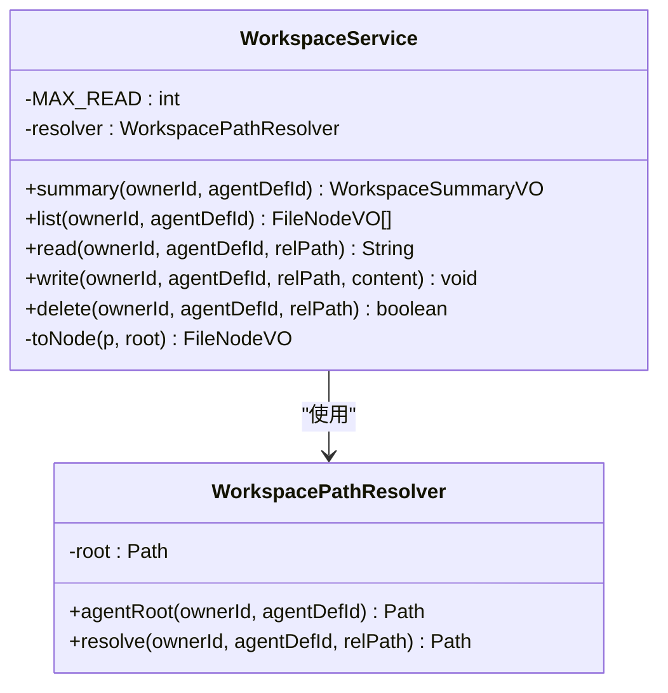
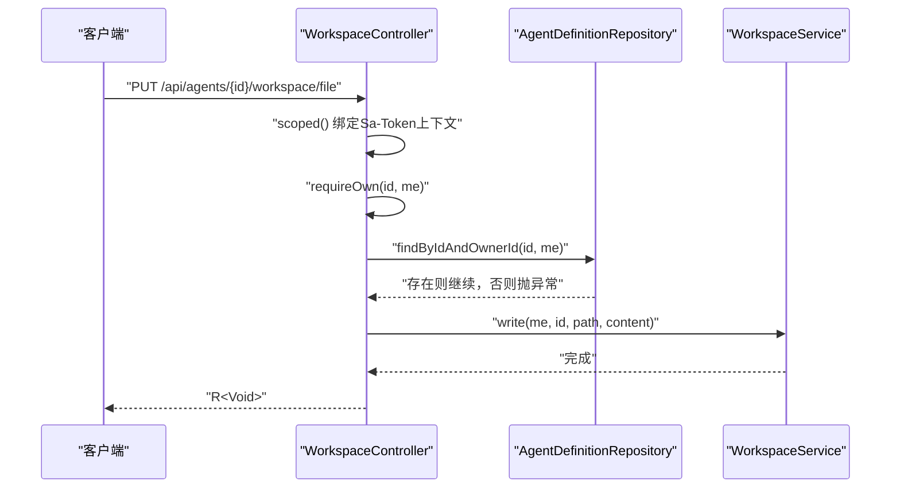
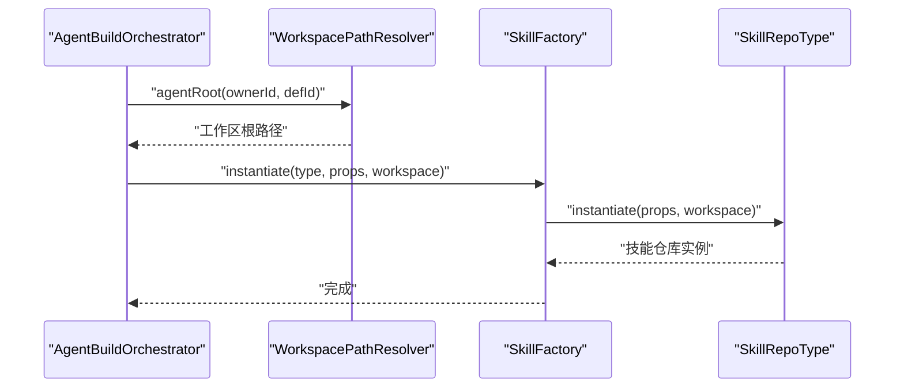
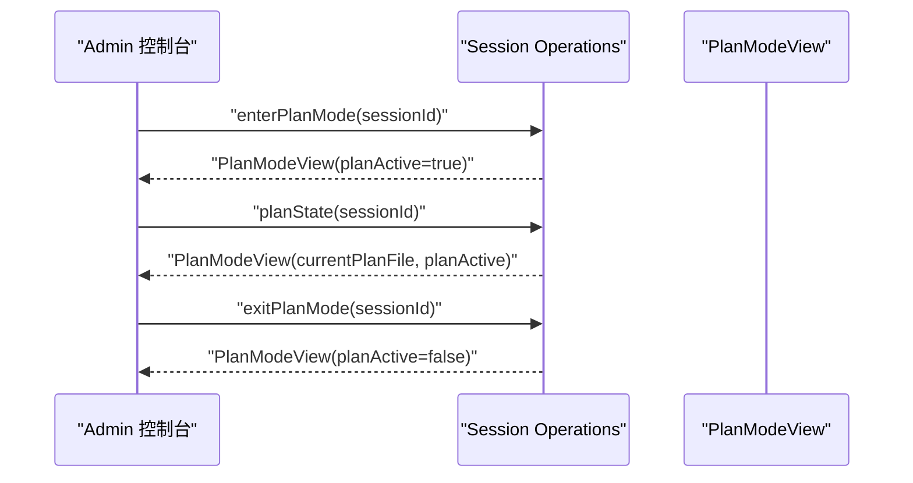
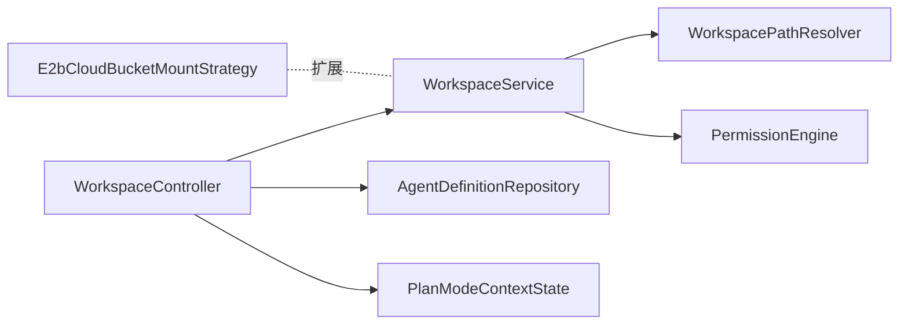

# 工作区管理

<cite>
**本文引用的文件**   
- [WorkspacePathResolver.java](file://agentscope-builder-saton/src/main/java/io/agentscope/builder/saton/workspace/WorkspacePathResolver.java)
- [WorkspaceService.java](file://agentscope-builder-saton/src/main/java/io/agentscope/builder/saton/workspace/WorkspaceService.java)
- [WorkspaceConfig.java](file://agentscope-builder-saton/src/main/java/io/agentscope/builder/saton/workspace/WorkspaceConfig.java)
- [WorkspaceController.java](file://agentscope-builder-saton/src/main/java/io/agentscope/builder/saton/workspace/WorkspaceController.java)
- [FileNodeVO.java](file://agentscope-builder-saton/src/main/java/io/agentscope/builder/saton/workspace/dto/FileNodeVO.java)
- [WorkspaceSummaryVO.java](file://agentscope-builder-saton/src/main/java/io/agentscope/builder/saton/workspace/dto/WorkspaceSummaryVO.java)
- [WriteFileReq.java](file://agentscope-builder-saton/src/main/java/io/agentscope/builder/saton/workspace/dto/WriteFileReq.java)
- [WorkspaceServiceTest.java](file://agentscope-builder-saton/src/test/java/io/agentscope/builder/saton/workspace/WorkspaceServiceTest.java)
- [WorkspacePathResolverTest.java](file://agentscope-builder-saton/src/test/java/io/agentscope/builder/saton/workspace/WorkspacePathResolverTest.java)
- [E2bCloudBucketMountStrategy.java](file://agentscope-extensions/agentscope-extensions-sandbox/agentscope-extensions-sandbox-e2b/src/main/java/io/agentscope/extensions/sandbox/e2b/mounts/E2bCloudBucketMountStrategy.java)
- [PlanModeView.java](file://agentscope-extensions/agentscope-spring-boot-starters/agentscope-admin-spring-boot-starter/src/main/java/io/agentscope/spring/boot/admin/dto/PlanModeView.java)
- [AgentscopePermissionsEndpoint.java](file://agentscope-extensions/agentscope-spring-boot-starters/agentscope-admin-spring-boot-starter/src/main/java/io/agentscope/spring/boot/admin/endpoint/AgentscopePermissionsEndpoint.java)
- [AgentBuildOrchestrator.java](file://agentscope-builder-saton/src/main/java/io/agentscope/builder/saton/agent/runtime/AgentBuildOrchestrator.java)
- [SkillFactory.java](file://agentscope-builder-saton/src/main/java/io/agentscope/builder/saton/factory/skill/SkillFactory.java)
- [SkillRepoType.java](file://agentscope-builder-saton/src/main/java/io/agentscope/builder/saton/factory/skill/SkillRepoType.java)
- [GitSkillRepoType.java](file://agentscope-builder-saton/src/main/java/io/agentscope/builder/saton/factory/skill/impl/GitSkillRepoType.java)
- [LocalSkillRepoType.java](file://agentscope-builder-saton/src/main/java/io/agentscope/builder/saton/factory/skill/impl/LocalSkillRepoType.java)
- [PermissionEngine.java](file://agentscope-core/src/main/java/io/agentscope/core/permission/PermissionEngine.java)
- [PermissionRule.java](file://agentscope-core/src/main/java/io/agentscope/core/permission/PermissionRule.java)
- [PermissionMode.java](file://agentscope-core/src/main/java/io/agentscope/core/permission/PermissionMode.java)
- [PermissionBehavior.java](file://agentscope-core/src/main/java/io/agentscope/core/permission/PermissionBehavior.java)
- [AdditionalWorkingDirectory.java](file://agentscope-core/src/main/java/io/agentscope/core/permission/AdditionalWorkingDirectory.java)
- [PlanModeContextState.java](file://agentscope-core/src/main/java/io/agentscope/core/state/PlanModeContextState.java)
</cite>

## 目录
1. [简介](#简介)
2. [项目结构](#项目结构)
3. [核心组件](#核心组件)
4. [架构总览](#架构总览)
5. [组件详解](#组件详解)
6. [依赖关系分析](#依赖关系分析)
7. [性能考量](#性能考量)
8. [故障排查指南](#故障排查指南)
9. [结论](#结论)
10. [附录](#附录)

## 简介
本文件面向AgentScope的工作区管理系统，系统性阐述以下主题：
- 工作区规格设计：文件系统抽象、权限控制与访问策略
- 工作区应用器实现：规格解析、变更检测与应用逻辑
- 工作区挂载支持：本地挂载、远程挂载与动态挂载
- 工作区计划系统：规划生成、执行跟踪与回滚机制
- 配置示例、最佳实践与常见问题解决方案

工作区管理以“隔离、安全、可控”为核心目标，通过严格的路径解析与越界校验确保多租户隔离；通过权限引擎与计划模式实现访问控制与执行约束；通过挂载策略扩展本地与远程资源的可用性。

## 项目结构
工作区相关代码主要位于构建前端模块的workspace包，配合控制器、服务、路径解析器与配置类共同构成完整的文件系统抽象层。同时，权限系统与计划模式在核心模块中提供支撑。

图表来源
- [WorkspaceController.java:1-98](file://agentscope-builder-saton/src/main/java/io/agentscope/builder/saton/workspace/WorkspaceController.java#L1-L98)
- [WorkspaceService.java:1-110](file://agentscope-builder-saton/src/main/java/io/agentscope/builder/saton/workspace/WorkspaceService.java#L1-L110)
- [WorkspacePathResolver.java:1-37](file://agentscope-builder-saton/src/main/java/io/agentscope/builder/saton/workspace/WorkspacePathResolver.java#L1-L37)
- [WorkspaceConfig.java:1-19](file://agentscope-builder-saton/src/main/java/io/agentscope/builder/saton/workspace/WorkspaceConfig.java#L1-L19)
- [FileNodeVO.java:1-5](file://agentscope-builder-saton/src/main/java/io/agentscope/builder/saton/workspace/dto/FileNodeVO.java#L1-L5)
- [WorkspaceSummaryVO.java:1-4](file://agentscope-builder-saton/src/main/java/io/agentscope/builder/saton/workspace/dto/WorkspaceSummaryVO.java#L1-L4)
- [WriteFileReq.java:1-5](file://agentscope-builder-saton/src/main/java/io/agentscope/builder/saton/workspace/dto/WriteFileReq.java#L1-L5)
- [PermissionEngine.java](file://agentscope-core/src/main/java/io/agentscope/core/permission/PermissionEngine.java)
- [PlanModeContextState.java](file://agentscope-core/src/main/java/io/agentscope/core/state/PlanModeContextState.java)
- [E2bCloudBucketMountStrategy.java:1-23](file://agentscope-extensions/agentscope-extensions-sandbox/agentscope-extensions-sandbox-e2b/src/main/java/io/agentscope/extensions/sandbox/e2b/mounts/E2bCloudBucketMountStrategy.java#L1-L23)

章节来源
- [WorkspaceController.java:1-98](file://agentscope-builder-saton/src/main/java/io/agentscope/builder/saton/workspace/WorkspaceController.java#L1-L98)
- [WorkspaceService.java:1-110](file://agentscope-builder-saton/src/main/java/io/agentscope/builder/saton/workspace/WorkspaceService.java#L1-L110)
- [WorkspacePathResolver.java:1-37](file://agentscope-builder-saton/src/main/java/io/agentscope/builder/saton/workspace/WorkspacePathResolver.java#L1-L37)
- [WorkspaceConfig.java:1-19](file://agentscope-builder-saton/src/main/java/io/agentscope/builder/saton/workspace/WorkspaceConfig.java#L1-L19)

## 核心组件
- 路径解析器：将(ownerId, agentDefId, relPath)解析为受控的绝对路径，严格禁止越界访问
- 工作区服务：提供摘要、列表、读取、写入、删除等文件操作，并内置大小限制与错误处理
- 控制器：基于Sa-Token进行鉴权与作用域绑定，暴露REST接口
- 配置类：从应用配置加载工作区根目录并注入解析器
- DTO：文件节点视图、工作区摘要、写入请求体
- 权限引擎与计划模式：在核心模块中提供访问控制与执行约束能力
- 挂载策略：扩展本地与远程资源挂载能力

章节来源
- [WorkspacePathResolver.java:1-37](file://agentscope-builder-saton/src/main/java/io/agentscope/builder/saton/workspace/WorkspacePathResolver.java#L1-L37)
- [WorkspaceService.java:1-110](file://agentscope-builder-saton/src/main/java/io/agentscope/builder/saton/workspace/WorkspaceService.java#L1-L110)
- [WorkspaceController.java:1-98](file://agentscope-builder-saton/src/main/java/io/agentscope/builder/saton/workspace/WorkspaceController.java#L1-L98)
- [WorkspaceConfig.java:1-19](file://agentscope-builder-saton/src/main/java/io/agentscope/builder/saton/workspace/WorkspaceConfig.java#L1-L19)
- [FileNodeVO.java:1-5](file://agentscope-builder-saton/src/main/java/io/agentscope/builder/saton/workspace/dto/FileNodeVO.java#L1-L5)
- [WorkspaceSummaryVO.java:1-4](file://agentscope-builder-saton/src/main/java/io/agentscope/builder/saton/workspace/dto/WorkspaceSummaryVO.java#L1-L4)
- [WriteFileReq.java:1-5](file://agentscope-builder-saton/src/main/java/io/agentscope/builder/saton/workspace/dto/WriteFileReq.java#L1-L5)

## 架构总览
工作区管理采用分层架构：
- 表现层：REST控制器负责鉴权与请求转发
- 应用层：工作区服务封装文件系统操作
- 基础设施层：路径解析器提供安全的路径解析与越界校验
- 外部集成：权限引擎与计划模式提供访问控制与执行约束；挂载策略扩展资源接入

图表来源
- [WorkspaceController.java:38-44](file://agentscope-builder-saton/src/main/java/io/agentscope/builder/saton/workspace/WorkspaceController.java#L38-L44)
- [WorkspaceService.java:51-62](file://agentscope-builder-saton/src/main/java/io/agentscope/builder/saton/workspace/WorkspaceService.java#L51-L62)
- [WorkspacePathResolver.java:19-22](file://agentscope-builder-saton/src/main/java/io/agentscope/builder/saton/workspace/WorkspacePathResolver.java#L19-L22)

## 组件详解

### 路径解析器（WorkspacePathResolver）
- 设计理念
  - 每个代理拥有独立工作区根目录，路径格式为：<root>/<ownerId>/<agentDefId>/files/
  - 对所有相对路径进行规范化与越界校验，拒绝绝对路径、空路径与越界访问
- 关键行为
  - 生成代理根路径
  - 将相对路径解析为绝对路径并校验是否位于代理根目录之下
- 安全要点
  - 规范化后比较前缀，防止路径穿越
  - 显式拒绝空路径与绝对路径

图表来源
- [WorkspacePathResolver.java:24-35](file://agentscope-builder-saton/src/main/java/io/agentscope/builder/saton/workspace/WorkspacePathResolver.java#L24-L35)

章节来源
- [WorkspacePathResolver.java:1-37](file://agentscope-builder-saton/src/main/java/io/agentscope/builder/saton/workspace/WorkspacePathResolver.java#L1-L37)
- [WorkspacePathResolverTest.java:1-50](file://agentscope-builder-saton/src/test/java/io/agentscope/builder/saton/workspace/WorkspacePathResolverTest.java#L1-L50)

### 工作区服务（WorkspaceService）
- 功能职责
  - 摘要统计：统计工作区内文件数量
  - 列表展示：列出文件与目录节点
  - 文件读取：限制最大读取大小，过大文件返回提示
  - 文件写入：自动创建父目录
  - 文件删除：按需删除
- 错误处理
  - 读取失败抛运行时异常
  - 删除失败抛运行时异常
  - 越界解析抛非法参数异常
- 并发与一致性
  - 单文件操作，无并发原子性保证（适用于单人视角）

图表来源
- [WorkspaceService.java:18-110](file://agentscope-builder-saton/src/main/java/io/agentscope/builder/saton/workspace/WorkspaceService.java#L18-L110)
- [WorkspacePathResolver.java:11-36](file://agentscope-builder-saton/src/main/java/io/agentscope/builder/saton/workspace/WorkspacePathResolver.java#L11-L36)

章节来源
- [WorkspaceService.java:1-110](file://agentscope-builder-saton/src/main/java/io/agentscope/builder/saton/workspace/WorkspaceService.java#L1-L110)
- [WorkspaceServiceTest.java:1-35](file://agentscope-builder-saton/src/test/java/io/agentscope/builder/saton/workspace/WorkspaceServiceTest.java#L1-L35)

### 控制器（WorkspaceController）
- 认证与授权
  - 使用Sa-Token绑定/清理上下文
  - requireOwn方法校验当前登录用户是否拥有指定代理定义
- 接口设计
  - GET /api/agents/{id}/workspace：工作区摘要
  - GET /api/agents/{id}/workspace/files：文件列表
  - GET /api/agents/{id}/workspace/file：读取文件（纯文本）
  - PUT /api/agents/{id}/workspace/file：写入文件
  - DELETE /api/agents/{id}/workspace/file：删除文件

图表来源
- [WorkspaceController.java:57-67](file://agentscope-builder-saton/src/main/java/io/agentscope/builder/saton/workspace/WorkspaceController.java#L57-L67)
- [WorkspaceController.java:79-83](file://agentscope-builder-saton/src/main/java/io/agentscope/builder/saton/workspace/WorkspaceController.java#L79-L83)

章节来源
- [WorkspaceController.java:1-98](file://agentscope-builder-saton/src/main/java/io/agentscope/builder/saton/workspace/WorkspaceController.java#L1-L98)

### 配置（WorkspaceConfig）
- 通过Spring Bean暴露WorkspacePathResolver
- 从配置app.workspace.root加载工作区根目录，默认值为./data/workspaces
- 自动规范化为绝对路径

章节来源
- [WorkspaceConfig.java:1-19](file://agentscope-builder-saton/src/main/java/io/agentscope/builder/saton/workspace/WorkspaceConfig.java#L1-L19)

### DTO模型
- FileNodeVO：文件/目录名称、相对路径、类型与大小
- WorkspaceSummaryVO：工作区根路径与文件数量
- WriteFileReq：写入请求体，包含content字段

章节来源
- [FileNodeVO.java:1-5](file://agentscope-builder-saton/src/main/java/io/agentscope/builder/saton/workspace/dto/FileNodeVO.java#L1-L5)
- [WorkspaceSummaryVO.java:1-4](file://agentscope-builder-saton/src/main/java/io/agentscope/builder/saton/workspace/dto/WorkspaceSummaryVO.java#L1-L4)
- [WriteFileReq.java:1-5](file://agentscope-builder-saton/src/main/java/io/agentscope/builder/saton/workspace/dto/WriteFileReq.java#L1-L5)

### 权限控制与访问策略
- 权限引擎与规则
  - PermissionEngine：统一的权限决策引擎
  - PermissionRule：权限规则条目
  - PermissionMode：权限模式（如允许/拒绝/询问）
  - PermissionBehavior：权限行为（如允许、拒绝、询问）
  - AdditionalWorkingDirectory：额外工作目录配置
- 在工作区中的应用
  - 控制对工作区文件的读写权限
  - 结合计划模式在只读链路中强制执行

章节来源
- [PermissionEngine.java](file://agentscope-core/src/main/java/io/agentscope/core/permission/PermissionEngine.java)
- [PermissionRule.java](file://agentscope-core/src/main/java/io/agentscope/core/permission/PermissionRule.java)
- [PermissionMode.java](file://agentscope-core/src/main/java/io/agentscope/core/permission/PermissionMode.java)
- [PermissionBehavior.java](file://agentscope-core/src/main/java/io/agentscope/core/permission/PermissionBehavior.java)
- [AdditionalWorkingDirectory.java](file://agentscope-core/src/main/java/io/agentscope/core/permission/AdditionalWorkingDirectory.java)

### 工作区挂载支持
- 本地挂载
  - 通过技能仓库类型LocalSkillRepoType在工作区相对路径下建立本地仓库
- 远程挂载
  - 通过GitSkillRepoType在工作区相对路径下克隆远程仓库
- 动态挂载
  - 通过E2bCloudBucketMountStrategy预留云桶挂载扩展点，结合工作区规格在运行时挂载

章节来源
- [LocalSkillRepoType.java:1-33](file://agentscope-builder-saton/src/main/java/io/agentscope/builder/saton/factory/skill/impl/LocalSkillRepoType.java#L1-L33)
- [GitSkillRepoType.java:47-62](file://agentscope-builder-saton/src/main/java/io/agentscope/builder/saton/factory/skill/impl/GitSkillRepoType.java#L47-L62)
- [E2bCloudBucketMountStrategy.java:1-23](file://agentscope-extensions/agentscope-extensions-sandbox/agentscope-extensions-sandbox-e2b/src/main/java/io/agentscope/extensions/sandbox/e2b/mounts/E2bCloudBucketMountStrategy.java#L1-L23)

### 工作区应用器与规格解析
- 应用器职责
  - 在构建阶段为技能与中间件注入工作区根路径
  - 通过AgentBuildOrchestrator创建工作区目录并传递给各组件
- 规格解析
  - 技能工厂与仓库类型在实例化时接收工作区根路径，用于解析相对路径
- 变更检测与应用
  - 通过工作区文件系统的变化触发应用器重新加载或刷新

图表来源
- [AgentBuildOrchestrator.java:87-120](file://agentscope-builder-saton/src/main/java/io/agentscope/builder/saton/agent/runtime/AgentBuildOrchestrator.java#L87-L120)
- [SkillFactory.java:13-37](file://agentscope-builder-saton/src/main/java/io/agentscope/builder/saton/factory/skill/SkillFactory.java#L13-L37)
- [SkillRepoType.java:12-18](file://agentscope-builder-saton/src/main/java/io/agentscope/builder/saton/factory/skill/SkillRepoType.java#L12-L18)

章节来源
- [AgentBuildOrchestrator.java:1-120](file://agentscope-builder-saton/src/main/java/io/agentscope/builder/saton/agent/runtime/AgentBuildOrchestrator.java#L1-L120)
- [SkillFactory.java:1-37](file://agentscope-builder-saton/src/main/java/io/agentscope/builder/saton/factory/skill/SkillFactory.java#L1-L37)
- [SkillRepoType.java:1-18](file://agentscope-builder-saton/src/main/java/io/agentscope/builder/saton/factory/skill/SkillRepoType.java#L1-L18)

### 工作区计划系统
- 规划生成
  - 通过Admin端PlanModeView查询与进入计划模式
- 执行跟踪
  - 计划模式激活后，结合权限引擎形成只读链路
- 回滚机制
  - Admin端提供会话级重做/撤销能力（与工作区文件变更相关）

图表来源
- [PlanModeView.java:29-43](file://agentscope-extensions/agentscope-spring-boot-starters/agentscope-admin-spring-boot-starter/src/main/java/io/agentscope/spring/boot/admin/dto/PlanModeView.java#L29-L43)

章节来源
- [PlanModeView.java:1-43](file://agentscope-extensions/agentscope-spring-boot-starters/agentscope-admin-spring-boot-starter/src/main/java/io/agentscope/spring/boot/admin/dto/PlanModeView.java#L1-L43)
- [AgentscopePermissionsEndpoint.java:73-113](file://agentscope-extensions/agentscope-spring-boot-starters/agentscope-admin-spring-boot-starter/src/main/java/io/agentscope/spring/boot/admin/endpoint/AgentscopePermissionsEndpoint.java#L73-L113)

## 依赖关系分析
- 控制器依赖服务与代理定义仓储，服务依赖路径解析器
- 路径解析器仅依赖JDK NIO，低耦合
- 权限引擎与计划模式在核心模块，为工作区提供访问控制与执行约束
- 挂载策略作为扩展接口，与工作区规格解耦

图表来源
- [WorkspaceController.java:22-28](file://agentscope-builder-saton/src/main/java/io/agentscope/builder/saton/workspace/WorkspaceController.java#L22-L28)
- [WorkspaceService.java:32-36](file://agentscope-builder-saton/src/main/java/io/agentscope/builder/saton/workspace/WorkspaceService.java#L32-L36)
- [WorkspacePathResolver.java:13-17](file://agentscope-builder-saton/src/main/java/io/agentscope/builder/saton/workspace/WorkspacePathResolver.java#L13-L17)
- [PermissionEngine.java](file://agentscope-core/src/main/java/io/agentscope/core/permission/PermissionEngine.java)
- [PlanModeContextState.java](file://agentscope-core/src/main/java/io/agentscope/core/state/PlanModeContextState.java)
- [E2bCloudBucketMountStrategy.java:21-23](file://agentscope-extensions/agentscope-extensions-sandbox/agentscope-extensions-sandbox-e2b/src/main/java/io/agentscope/extensions/sandbox/e2b/mounts/E2bCloudBucketMountStrategy.java#L21-L23)

章节来源
- [WorkspaceController.java:1-98](file://agentscope-builder-saton/src/main/java/io/agentscope/builder/saton/workspace/WorkspaceController.java#L1-L98)
- [WorkspaceService.java:1-110](file://agentscope-builder-saton/src/main/java/io/agentscope/builder/saton/workspace/WorkspaceService.java#L1-L110)
- [WorkspacePathResolver.java:1-37](file://agentscope-builder-saton/src/main/java/io/agentscope/builder/saton/workspace/WorkspacePathResolver.java#L1-L37)

## 性能考量
- 文件遍历与统计
  - 摘要统计使用递归遍历，建议在大目录场景下限制扫描范围或增加缓存
- 读取大小限制
  - 单文件读取上限为512KB，避免大文件阻塞UI与网络传输
- 写入与删除
  - 写入前自动创建父目录，删除按需返回布尔结果
- 并发与锁
  - 当前实现不保证并发原子性，建议在上层引入分布式锁或序列化写入

## 故障排查指南
- 路径越界异常
  - 现象：抛出非法参数异常，提示路径越界
  - 原因：相对路径包含..或绝对路径
  - 处理：检查relPath是否合法，使用相对路径且不包含越界片段
- 文件不存在
  - 现象：读取时抛出“文件未找到”
  - 原因：目标路径非常规文件或不存在
  - 处理：确认文件存在且为常规文件
- 写入失败
  - 现象：抛出运行时异常
  - 原因：磁盘权限不足或父目录无法创建
  - 处理：检查工作区根目录权限与磁盘空间
- 删除失败
  - 现象：抛出运行时异常
  - 原因：文件被占用或权限不足
  - 处理：关闭占用进程或提升权限
- 权限拒绝
  - 现象：计划模式下写入被拒绝
  - 原因：权限引擎处于只读链路
  - 处理：退出计划模式或调整权限规则

章节来源
- [WorkspacePathResolver.java:24-35](file://agentscope-builder-saton/src/main/java/io/agentscope/builder/saton/workspace/WorkspacePathResolver.java#L24-L35)
- [WorkspaceService.java:64-98](file://agentscope-builder-saton/src/main/java/io/agentscope/builder/saton/workspace/WorkspaceService.java#L64-L98)
- [AgentscopePermissionsEndpoint.java:73-113](file://agentscope-extensions/agentscope-spring-boot-starters/agentscope-admin-spring-boot-starter/src/main/java/io/agentscope/spring/boot/admin/endpoint/AgentscopePermissionsEndpoint.java#L73-L113)

## 结论
工作区管理系统通过严格的路径解析与越界校验实现了多租户隔离，结合权限引擎与计划模式提供了细粒度的访问控制与执行约束。挂载策略扩展了本地与远程资源的可用性，满足多样化的应用场景。建议在生产环境中配合分布式锁与缓存策略，进一步提升性能与可靠性。

## 附录

### 配置示例
- 工作区根目录配置
  - 属性名：app.workspace.root
  - 默认值：./data/workspaces
  - 作用：决定所有代理工作区的根路径

章节来源
- [WorkspaceConfig.java:13-17](file://agentscope-builder-saton/src/main/java/io/agentscope/builder/saton/workspace/WorkspaceConfig.java#L13-L17)

### 最佳实践
- 路径规范
  - 始终使用相对路径，避免绝对路径与..穿越
- 文件大小
  - 大文件建议通过外部存储或流式传输
- 权限策略
  - 在计划模式下默认启用只读链路，谨慎放行写操作
- 挂载策略
  - 本地仓库优先使用工作区相对路径，远程仓库注意网络与认证

### 常见问题
- Q：如何验证路径解析正确？
  - A：参考单元测试用例，覆盖相对路径、子目录、越界与绝对路径场景
- Q：如何在构建阶段注入工作区路径？
  - A：通过AgentBuildOrchestrator与SkillFactory向技能仓库传递工作区根路径

章节来源
- [WorkspacePathResolverTest.java:21-50](file://agentscope-builder-saton/src/test/java/io/agentscope/builder/saton/workspace/WorkspacePathResolverTest.java#L21-L50)
- [WorkspaceServiceTest.java:24-35](file://agentscope-builder-saton/src/test/java/io/agentscope/builder/saton/workspace/WorkspaceServiceTest.java#L24-L35)
- [AgentBuildOrchestrator.java:87-120](file://agentscope-builder-saton/src/main/java/io/agentscope/builder/saton/agent/runtime/AgentBuildOrchestrator.java#L87-L120)
- [SkillFactory.java:13-37](file://agentscope-builder-saton/src/main/java/io/agentscope/builder/saton/factory/skill/SkillFactory.java#L13-L37)