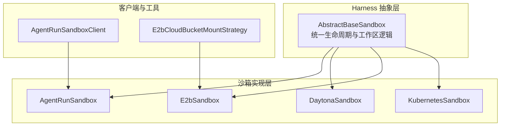
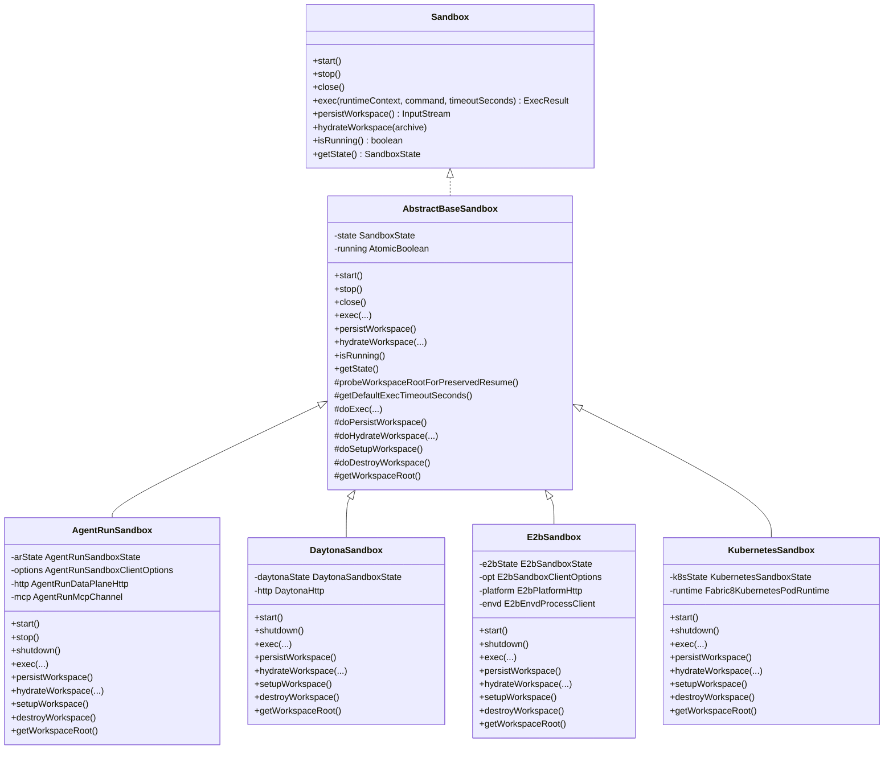
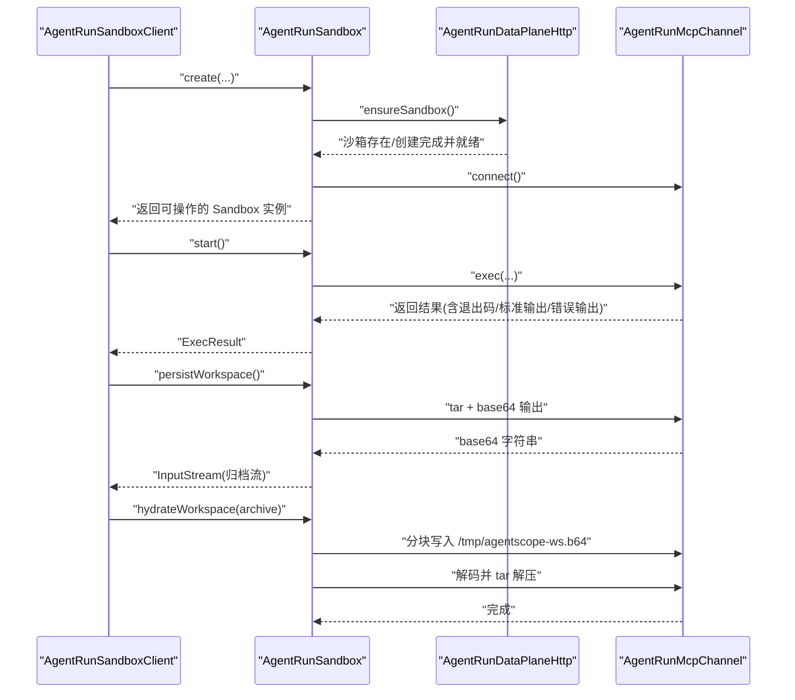
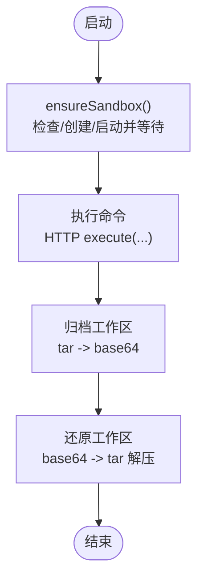
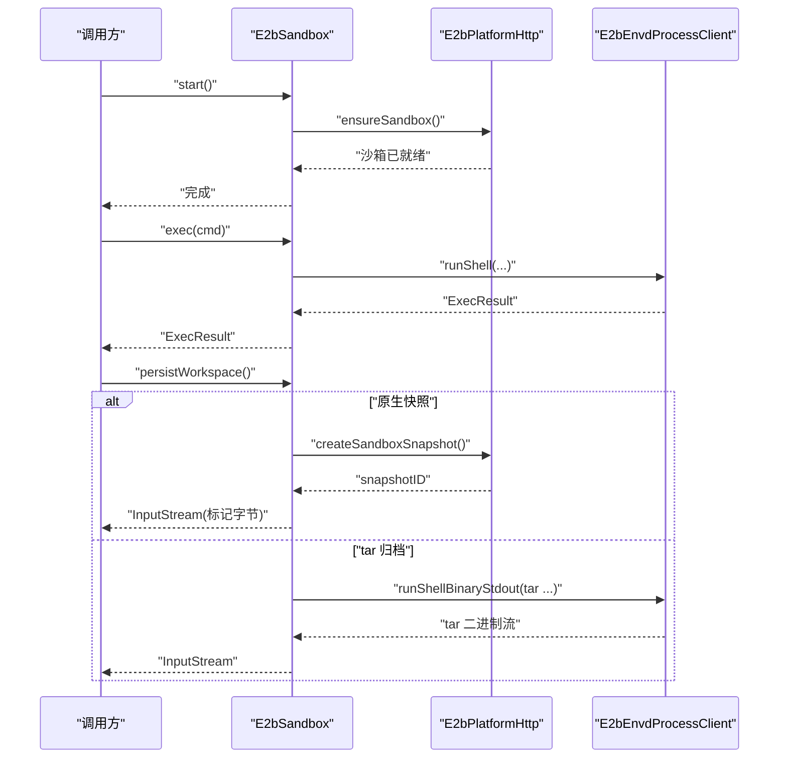
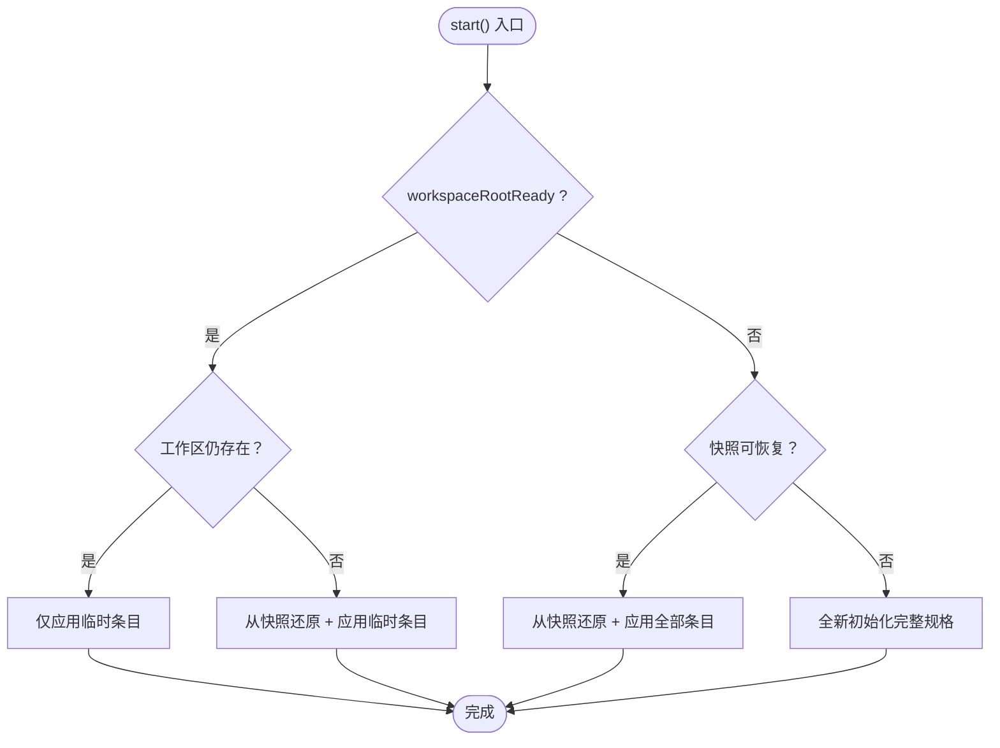
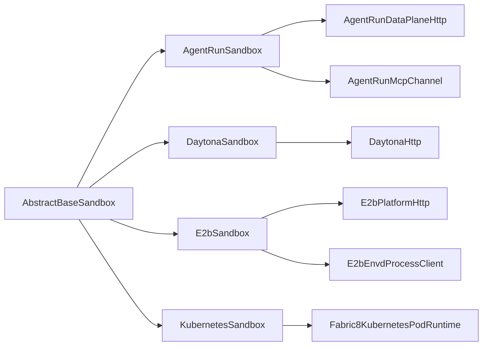

# 沙箱隔离

<cite>
**本文引用的文件**   
- [AbstractBaseSandbox.java](file://agentscope-harness/src/main/java/io/agentscope/harness/agent/sandbox/AbstractBaseSandbox.java)
- [AgentRunSandbox.java](file://agentscope-extensions/agentscope-extensions-sandbox/agentscope-extensions-sandbox-agentrun/src/main/java/io/agentscope/extensions/sandbox/agentrun/AgentRunSandbox.java)
- [AgentRunSandboxClient.java](file://agentscope-extensions/agentscope-extensions-sandbox/agentscope-extensions-sandbox-agentrun/src/main/java/io/agentscope/extensions/sandbox/agentrun/AgentRunSandboxClient.java)
- [DaytonaSandbox.java](file://agentscope-extensions/agentscope-extensions-sandbox/agentscope-extensions-sandbox-daytona/src/main/java/io/agentscope/extensions/sandbox/daytona/DaytonaSandbox.java)
- [E2bSandbox.java](file://agentscope-extensions/agentscope-extensions-sandbox/agentscope-extensions-sandbox-e2b/src/main/java/io/agentscope/extensions/sandbox/e2b/E2bSandbox.java)
- [KubernetesSandbox.java](file://agentscope-extensions/agentscope-extensions-sandbox/agentscope-extensions-sandbox-kubernetes/src/main/java/io/agentscope/extensions/sandbox/kubernetes/KubernetesSandbox.java)
- [E2bCloudBucketMountStrategy.java](file://agentscope-extensions/agentscope-extensions-sandbox/agentscope-extensions-sandbox-e2b/src/main/java/io/agentscope/extensions/sandbox/e2b/mounts/E2bCloudBucketMountStrategy.java)
</cite>

## 目录
1. [引言](#引言)
2. [项目结构](#项目结构)
3. [核心组件](#核心组件)
4. [架构总览](#架构总览)
5. [详细组件分析](#详细组件分析)
6. [依赖关系分析](#依赖关系分析)
7. [性能考量](#性能考量)
8. [故障排除指南](#故障排除指南)
9. [结论](#结论)
10. [附录](#附录)

## 引言
本技术文档围绕 AgentScope 的沙箱隔离系统展开，系统通过统一的沙箱抽象与多后端实现，为智能体提供安全、可恢复、可扩展的执行环境。本文重点覆盖以下方面：
- 沙箱管理器设计：生命周期管理、资源分配与负载均衡策略
- 不同类型沙箱实现：阿里云 AgentRun、Daytona、E2B、Kubernetes 等
- 安全隔离机制：命名空间隔离、资源限制与网络策略
- 沙箱客户端：连接管理、命令执行与结果返回
- 配置最佳实践、性能优化与故障排除

## 项目结构
沙箱相关代码主要分布在以下模块：
- harness 层：定义通用沙箱抽象与生命周期控制（AbstractBaseSandbox）
- 扩展沙箱模块：针对不同后端的具体实现（AgentRun、Daytona、E2B、Kubernetes）
- 挂载与存储策略：如 E2B 云桶挂载策略接口

图表来源
- [AbstractBaseSandbox.java:1-289](file://agentscope-harness/src/main/java/io/agentscope/harness/agent/sandbox/AbstractBaseSandbox.java#L1-L289)
- [AgentRunSandbox.java:1-267](file://agentscope-extensions/agentscope-extensions-sandbox/agentscope-extensions-sandbox-agentrun/src/main/java/io/agentscope/extensions/sandbox/agentrun/AgentRunSandbox.java#L1-L267)
- [DaytonaSandbox.java:1-209](file://agentscope-extensions/agentscope-extensions-sandbox/agentscope-extensions-sandbox-daytona/src/main/java/io/agentscope/extensions/sandbox/daytona/DaytonaSandbox.java#L1-L209)
- [E2bSandbox.java:1-241](file://agentscope-extensions/agentscope-extensions-sandbox/agentscope-extensions-sandbox-e2b/src/main/java/io/agentscope/extensions/sandbox/e2b/E2bSandbox.java#L1-L241)
- [KubernetesSandbox.java:1-80](file://agentscope-extensions/agentscope-extensions-sandbox/agentscope-extensions-sandbox-kubernetes/src/main/java/io/agentscope/extensions/sandbox/kubernetes/KubernetesSandbox.java#L1-L80)
- [E2bCloudBucketMountStrategy.java:1-23](file://agentscope-extensions/agentscope-extensions-sandbox/agentscope-extensions-sandbox-e2b/src/main/java/io/agentscope/extensions/sandbox/e2b/mounts/E2bCloudBucketMountStrategy.java#L1-L23)

章节来源
- [AbstractBaseSandbox.java:1-289](file://agentscope-harness/src/main/java/io/agentscope/harness/agent/sandbox/AbstractBaseSandbox.java#L1-L289)
- [AgentRunSandbox.java:1-267](file://agentscope-extensions/agentscope-extensions-sandbox/agentscope-extensions-sandbox-agentrun/src/main/java/io/agentscope/extensions/sandbox/agentrun/AgentRunSandbox.java#L1-L267)
- [DaytonaSandbox.java:1-209](file://agentscope-extensions/agentscope-extensions-sandbox/agentscope-extensions-sandbox-daytona/src/main/java/io/agentscope/extensions/sandbox/daytona/DaytonaSandbox.java#L1-L209)
- [E2bSandbox.java:1-241](file://agentscope-extensions/agentscope-extensions-sandbox/agentscope-extensions-sandbox-e2b/src/main/java/io/agentscope/extensions/sandbox/e2b/E2bSandbox.java#L1-L241)
- [KubernetesSandbox.java:1-80](file://agentscope-extensions/agentscope-extensions-sandbox/agentscope-extensions-sandbox-kubernetes/src/main/java/io/agentscope/extensions/sandbox/kubernetes/KubernetesSandbox.java#L1-L80)
- [E2bCloudBucketMountStrategy.java:1-23](file://agentscope-extensions/agentscope-extensions-sandbox/agentscope-extensions-sandbox-e2b/src/main/java/io/agentscope/extensions/sandbox/e2b/mounts/E2bCloudBucketMountStrategy.java#L1-L23)

## 核心组件
- 统一抽象与生命周期
  - AbstractBaseSandbox 提供统一的生命周期与工作区恢复逻辑，包含“四分支启动流程”（按工作区是否已就绪与快照是否可恢复进行分支选择），并封装了执行、持久化、反序列化与清理等抽象方法。
- 后端沙箱实现
  - AgentRunSandbox：基于阿里云 AgentRun 数据面与 MCP 通道，支持 NAS/OSS 挂载与 tar 压缩归档；在 NAS 场景下持久化由挂载层处理。
  - DaytonaSandbox：基于 Daytona 平台 HTTP 接口执行命令与归档，使用 tar + base64 流式传输。
  - E2bSandbox：基于 E2B 平台与 envd 进程通道，支持原生快照与 tar 归档两种持久化模式。
  - KubernetesSandbox：基于 Kubernetes Pod 的运行时，通过 Fabric8 客户端管理 Pod 生命周期与命令执行。
- 客户端与状态
  - AgentRunSandboxClient：负责创建/恢复沙箱、序列化/反序列化状态、合并配置选项，并生成确定性沙箱 ID。

章节来源
- [AbstractBaseSandbox.java:27-124](file://agentscope-harness/src/main/java/io/agentscope/harness/agent/sandbox/AbstractBaseSandbox.java#L27-L124)
- [AgentRunSandbox.java:30-130](file://agentscope-extensions/agentscope-extensions-sandbox/agentscope-extensions-sandbox-agentrun/src/main/java/io/agentscope/extensions/sandbox/agentrun/AgentRunSandbox.java#L30-L130)
- [DaytonaSandbox.java:32-92](file://agentscope-extensions/agentscope-extensions-sandbox/agentscope-extensions-sandbox-daytona/src/main/java/io/agentscope/extensions/sandbox/daytona/DaytonaSandbox.java#L32-L92)
- [E2bSandbox.java:32-85](file://agentscope-extensions/agentscope-extensions-sandbox/agentscope-extensions-sandbox-e2b/src/main/java/io/agentscope/extensions/sandbox/e2b/E2bSandbox.java#L32-L85)
- [KubernetesSandbox.java:23-53](file://agentscope-extensions/agentscope-extensions-sandbox/agentscope-extensions-sandbox-kubernetes/src/main/java/io/agentscope/extensions/sandbox/kubernetes/KubernetesSandbox.java#L23-L53)
- [AgentRunSandboxClient.java:32-144](file://agentscope-extensions/agentscope-extensions-sandbox/agentscope-extensions-sandbox-agentrun/src/main/java/io/agentscope/extensions/sandbox/agentrun/AgentRunSandboxClient.java#L32-L144)

## 架构总览
沙箱系统采用“抽象 + 多后端”的分层设计。上层通过统一接口调用，下层对接具体平台或容器运行时，形成可插拔的沙箱管理器。

图表来源
- [AbstractBaseSandbox.java:48-289](file://agentscope-harness/src/main/java/io/agentscope/harness/agent/sandbox/AbstractBaseSandbox.java#L48-L289)
- [AgentRunSandbox.java:39-267](file://agentscope-extensions/agentscope-extensions-sandbox/agentscope-extensions-sandbox-agentrun/src/main/java/io/agentscope/extensions/sandbox/agentrun/AgentRunSandbox.java#L39-L267)
- [DaytonaSandbox.java:33-209](file://agentscope-extensions/agentscope-extensions-sandbox/agentscope-extensions-sandbox-daytona/src/main/java/io/agentscope/extensions/sandbox/daytona/DaytonaSandbox.java#L33-L209)
- [E2bSandbox.java:40-241](file://agentscope-extensions/agentscope-extensions-sandbox/agentscope-extensions-sandbox-e2b/src/main/java/io/agentscope/extensions/sandbox/e2b/E2bSandbox.java#L40-L241)
- [KubernetesSandbox.java:24-80](file://agentscope-extensions/agentscope-extensions-sandbox/agentscope-extensions-sandbox-kubernetes/src/main/java/io/agentscope/extensions/sandbox/kubernetes/KubernetesSandbox.java#L24-L80)

## 详细组件分析

### AgentRun 沙箱
- 设计要点
  - 使用数据面 HTTP 与 MCP 通道进行生命周期与命令执行；当工作区位于 NAS/OSS 挂载时，持久化由挂载层处理，无需 tar 归档。
  - 支持工作区归档/还原的分块 base64 传输，避免大对象一次性内存压力。
  - 通过确定性 ID 保证“同一会话可恢复到相同沙箱实例”。
- 关键流程
  - 创建/确保沙箱存在并等待就绪
  - 启动阶段建立 MCP 连接
  - 执行命令并截断超长输出
  - 归档/还原工作区时进行 base64 分块写入与解码提取

图表来源
- [AgentRunSandbox.java:65-150](file://agentscope-extensions/agentscope-extensions-sandbox/agentscope-extensions-sandbox-agentrun/src/main/java/io/agentscope/extensions/sandbox/agentrun/AgentRunSandbox.java#L65-L150)
- [AgentRunSandboxClient.java:63-97](file://agentscope-extensions/agentscope-extensions-sandbox/agentscope-extensions-sandbox-agentrun/src/main/java/io/agentscope/extensions/sandbox/agentrun/AgentRunSandboxClient.java#L63-L97)

章节来源
- [AgentRunSandbox.java:30-130](file://agentscope-extensions/agentscope-extensions-sandbox/agentscope-extensions-sandbox-agentrun/src/main/java/io/agentscope/extensions/sandbox/agentrun/AgentRunSandbox.java#L30-L130)
- [AgentRunSandbox.java:132-210](file://agentscope-extensions/agentscope-extensions-sandbox/agentscope-extensions-sandbox-agentrun/src/main/java/io/agentscope/extensions/sandbox/agentrun/AgentRunSandbox.java#L132-L210)
- [AgentRunSandboxClient.java:32-144](file://agentscope-extensions/agentscope-extensions-sandbox/agentscope-extensions-sandbox-agentrun/src/main/java/io/agentscope/extensions/sandbox/agentrun/AgentRunSandboxClient.java#L32-L144)

### Daytona 沙箱
- 设计要点
  - 通过 HTTP 接口执行命令与归档，使用 tar + base64 方案；支持相对路径工作区根。
  - 在启动阶段尝试复用现有沙箱，若不可用则重新创建并等待启动完成。
- 关键流程
  - ensureSandbox：检查/创建/启动并等待沙箱可用
  - 执行命令与归档均通过 HTTP 调用返回 JSON 结果

图表来源
- [DaytonaSandbox.java:50-196](file://agentscope-extensions/agentscope-extensions-sandbox/agentscope-extensions-sandbox-daytona/src/main/java/io/agentscope/extensions/sandbox/daytona/DaytonaSandbox.java#L50-L196)

章节来源
- [DaytonaSandbox.java:32-175](file://agentscope-extensions/agentscope-extensions-sandbox/agentscope-extensions-sandbox-daytona/src/main/java/io/agentscope/extensions/sandbox/daytona/DaytonaSandbox.java#L32-L175)

### E2B 沙箱
- 设计要点
  - 使用平台 HTTP 与 envd 进程客户端通信；支持原生快照与 tar 两种持久化模式。
  - 当使用原生快照时，归档流以标记字节表示快照 ID，还原时直接基于模板重建沙箱。
  - 对 bind mount 的路径进行 tar 排除，避免主机路径泄漏。
- 关键流程
  - ensureSandbox：连接或创建沙箱并应用默认域
  - runShell/runShellBinaryStdout 执行命令与二进制 stdout
  - 基于快照模板重建沙箱并清理旧实例

图表来源
- [E2bSandbox.java:59-222](file://agentscope-extensions/agentscope-extensions-sandbox/agentscope-extensions-sandbox-e2b/src/main/java/io/agentscope/extensions/sandbox/e2b/E2bSandbox.java#L59-L222)

章节来源
- [E2bSandbox.java:32-170](file://agentscope-extensions/agentscope-extensions-sandbox/agentscope-extensions-sandbox-e2b/src/main/java/io/agentscope/extensions/sandbox/e2b/E2bSandbox.java#L32-L170)

### Kubernetes 沙箱
- 设计要点
  - 基于 Kubernetes Pod 的运行时，通过 Fabric8 客户端确保 Pod 就绪、执行命令、归档/还原工作区。
  - 生命周期管理：start 创建/等待 Pod 就绪；shutdown 可删除 Owned Pod。
- 关键流程
  - start：确保 Pod 就绪后进入运行态
  - exec：委托运行时执行命令
  - 归档/还原：通过 tar 工具在 Pod 内部进行

章节来源
- [KubernetesSandbox.java:23-79](file://agentscope-extensions/agentscope-extensions-sandbox/agentscope-extensions-sandbox-kubernetes/src/main/java/io/agentscope/extensions/sandbox/kubernetes/KubernetesSandbox.java#L23-L79)

### 沙箱生命周期与工作区恢复（四分支）
AbstractBaseSandbox 定义了统一的四分支启动逻辑，依据工作区是否已就绪以及快照是否可恢复，自动选择最优初始化路径。

图表来源
- [AbstractBaseSandbox.java:69-124](file://agentscope-harness/src/main/java/io/agentscope/harness/agent/sandbox/AbstractBaseSandbox.java#L69-L124)

章节来源
- [AbstractBaseSandbox.java:27-124](file://agentscope-harness/src/main/java/io/agentscope/harness/agent/sandbox/AbstractBaseSandbox.java#L27-L124)

## 依赖关系分析
- 组件耦合
  - 各后端沙箱均继承自 AbstractBaseSandbox，复用统一的生命周期与工作区恢复逻辑，降低重复实现。
  - AgentRun 依赖数据面 HTTP 与 MCP 通道；Daytona 依赖平台 HTTP；E2B 依赖平台 HTTP 与 envd 进程客户端；Kubernetes 依赖 Fabric8 运行时。
- 外部依赖与集成点
  - AgentRun：需要数据面地址、模板名、MCP 地址等配置项；支持 NAS/OSS 挂载检测。
  - E2B：需要模板 ID、超时参数、域名默认值；支持原生快照与 tar 归档。
  - Kubernetes：需要集群访问权限与 Pod 规格；通过运行时管理生命周期。
- 循环依赖
  - 没有发现循环依赖；各模块职责清晰，接口单向依赖。

图表来源
- [AbstractBaseSandbox.java:48-289](file://agentscope-harness/src/main/java/io/agentscope/harness/agent/sandbox/AbstractBaseSandbox.java#L48-L289)
- [AgentRunSandbox.java:48-63](file://agentscope-extensions/agentscope-extensions-sandbox/agentscope-extensions-sandbox-agentrun/src/main/java/io/agentscope/extensions/sandbox/agentrun/AgentRunSandbox.java#L48-L63)
- [DaytonaSandbox.java:42-47](file://agentscope-extensions/agentscope-extensions-sandbox/agentscope-extensions-sandbox-daytona/src/main/java/io/agentscope/extensions/sandbox/daytona/DaytonaSandbox.java#L42-L47)
- [E2bSandbox.java:48-57](file://agentscope-extensions/agentscope-extensions-sandbox/agentscope-extensions-sandbox-e2b/src/main/java/io/agentscope/extensions/sandbox/e2b/E2bSandbox.java#L48-L57)
- [KubernetesSandbox.java:26-33](file://agentscope-extensions/agentscope-extensions-sandbox/agentscope-extensions-sandbox-kubernetes/src/main/java/io/agentscope/extensions/sandbox/kubernetes/KubernetesSandbox.java#L26-L33)

章节来源
- [AgentRunSandbox.java:39-103](file://agentscope-extensions/agentscope-extensions-sandbox/agentscope-extensions-sandbox-agentrun/src/main/java/io/agentscope/extensions/sandbox/agentrun/AgentRunSandbox.java#L39-L103)
- [DaytonaSandbox.java:33-70](file://agentscope-extensions/agentscope-extensions-sandbox/agentscope-extensions-sandbox-daytona/src/main/java/io/agentscope/extensions/sandbox/daytona/DaytonaSandbox.java#L33-L70)
- [E2bSandbox.java:40-80](file://agentscope-extensions/agentscope-extensions-sandbox/agentscope-extensions-sandbox-e2b/src/main/java/io/agentscope/extensions/sandbox/e2b/E2bSandbox.java#L40-L80)
- [KubernetesSandbox.java:24-48](file://agentscope-extensions/agentscope-extensions-sandbox/agentscope-extensions-sandbox-kubernetes/src/main/java/io/agentscope/extensions/sandbox/kubernetes/KubernetesSandbox.java#L24-L48)

## 性能考量
- 命令执行超时与输出截断
  - 各后端在执行命令时设置合理超时时间，并对输出进行截断，避免超大输出导致内存压力。
- 归档/还原的分块传输
  - AgentRun 与 Daytona 使用 base64 分块写入，减少一次性大对象内存占用。
- 原生快照优先
  - E2B 支持原生快照，相比 tar 归档具有更快的恢复速度与更少的 CPU 开销。
- 工作区探测与最小化 IO
  - AbstractBaseSandbox 通过探测命令判断工作区是否存在，避免不必要的 IO。
- 资源与网络
  - 建议在 Kubernetes 中为 Pod 设置资源配额与限制；在云平台沙箱中启用最小权限与网络隔离策略。

## 故障排除指南
- AgentRun
  - 现象：沙箱不存在或状态异常
  - 处理：确认数据面地址、模板名与 MCP 地址；检查 NAS/OSS 挂载配置；必要时重新创建沙箱并等待就绪。
  - 现象：归档/还原失败
  - 处理：检查 tar 命令与 base64 编解码链路；关注分块写入的错误日志。
- Daytona
  - 现象：命令执行返回非零退出码
  - 处理：查看返回结果中的错误信息；确认工作区根路径相对化处理。
- E2B
  - 现象：envd 进程连接失败
  - 处理：检查模板 ID 与超时参数；尝试重建沙箱；确认原生快照 ID 是否有效。
- Kubernetes
  - 现象：Pod 无法就绪或命令执行失败
  - 处理：检查集群权限与 Pod 日志；确认工作区目录权限与 tar 工具可用性。
- 通用
  - 现象：工作区恢复失败
  - 处理：确认快照是否可恢复；必要时降级为全新初始化；检查工作区探测命令是否成功。

章节来源
- [AgentRunSandbox.java:65-103](file://agentscope-extensions/agentscope-extensions-sandbox/agentscope-extensions-sandbox-agentrun/src/main/java/io/agentscope/extensions/sandbox/agentrun/AgentRunSandbox.java#L65-L103)
- [DaytonaSandbox.java:72-92](file://agentscope-extensions/agentscope-extensions-sandbox/agentscope-extensions-sandbox-daytona/src/main/java/io/agentscope/extensions/sandbox/daytona/DaytonaSandbox.java#L72-L92)
- [E2bSandbox.java:81-142](file://agentscope-extensions/agentscope-extensions-sandbox/agentscope-extensions-sandbox-e2b/src/main/java/io/agentscope/extensions/sandbox/e2b/E2bSandbox.java#L81-L142)
- [KubernetesSandbox.java:35-79](file://agentscope-extensions/agentscope-extensions-sandbox/agentscope-extensions-sandbox-kubernetes/src/main/java/io/agentscope/extensions/sandbox/kubernetes/KubernetesSandbox.java#L35-L79)
- [AbstractBaseSandbox.java:197-207](file://agentscope-harness/src/main/java/io/agentscope/harness/agent/sandbox/AbstractBaseSandbox.java#L197-L207)

## 结论
AgentScope 的沙箱隔离系统通过统一抽象与多后端实现，提供了高内聚、低耦合的执行环境管理能力。结合四分支工作区恢复逻辑与多种持久化策略，系统在安全性、可靠性与性能之间取得平衡。建议在生产环境中结合业务需求选择合适的后端，并遵循配置与安全最佳实践。

## 附录
- 配置最佳实践
  - 选择后端：根据部署环境与合规要求选择 AgentRun、Daytona、E2B 或 Kubernetes。
  - 快照策略：优先使用原生快照（如 E2B）以提升恢复效率；否则采用 tar 归档。
  - 挂载策略：NAS/OSS 挂载适用于需要持久化的工作区；注意路径前缀匹配与只读配置。
  - 超时与重试：为命令执行与沙箱等待设置合理超时；对网络不稳定场景增加重试次数。
- 安全建议
  - 命名空间隔离：在容器或 Pod 中启用独立用户与最小权限。
  - 资源限制：为 CPU、内存与磁盘设置限额，防止资源滥用。
  - 网络策略：限制出站访问与入站连接，仅开放必要的端口与服务。
- 故障排查清单
  - 检查后端可达性与认证信息
  - 校验工作区路径与挂载配置
  - 查看命令执行与归档/还原的日志
  - 验证快照可用性与恢复路径