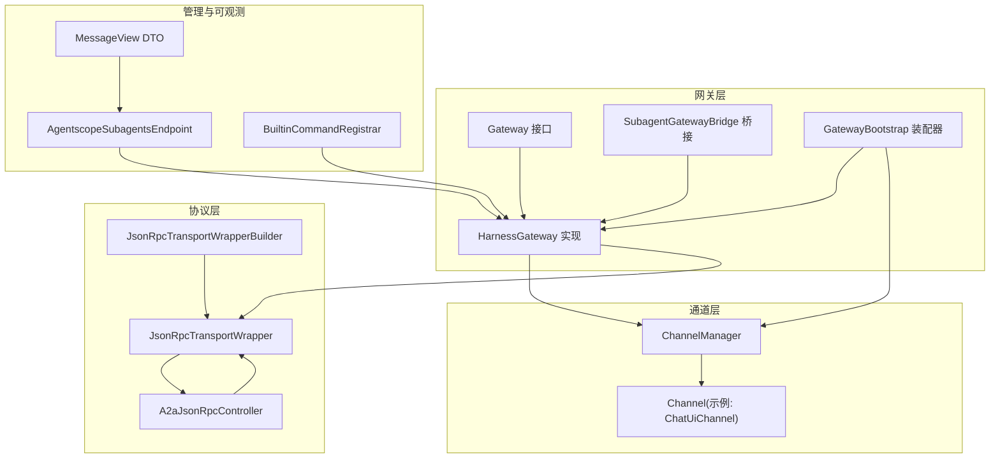
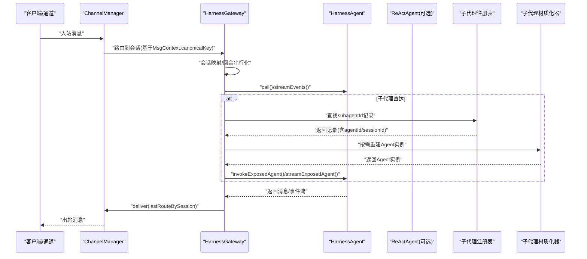
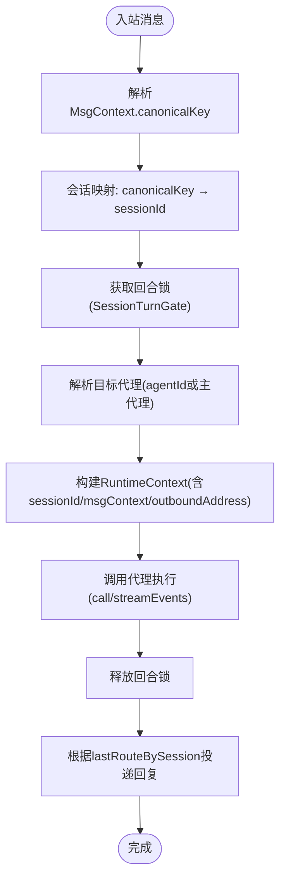
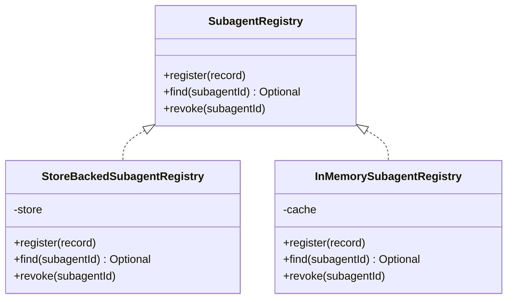
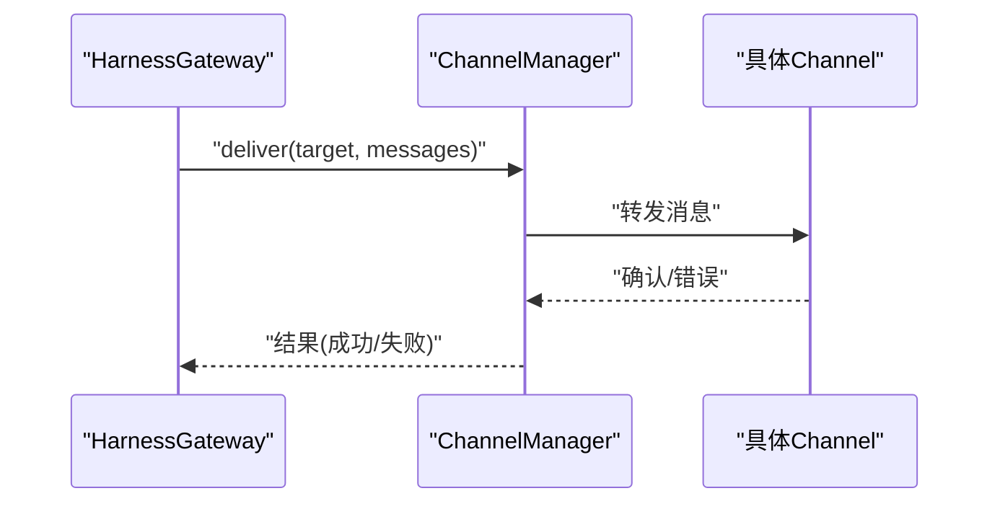
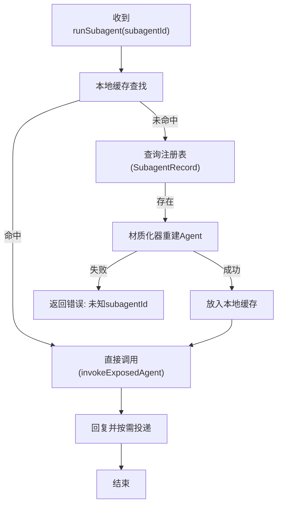
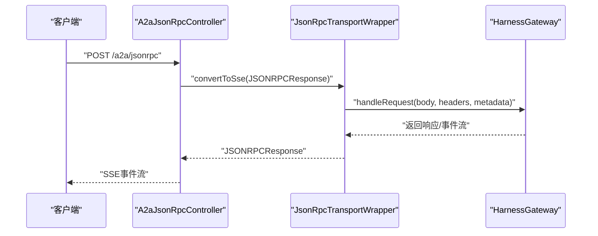
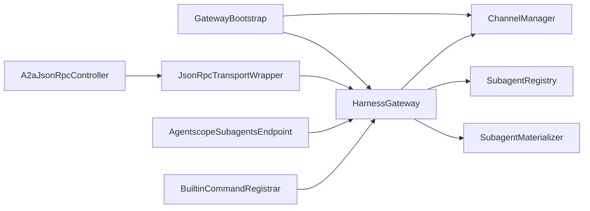

# 网关系统

<cite>
**本文引用的文件**
- [Gateway.java](file://agentscope-harness/src/main/java/io/agentscope/harness/agent/gateway/Gateway.java)
- [HarnessGateway.java](file://agentscope-harness/src/main/java/io/agentscope/harness/agent/gateway/HarnessGateway.java)
- [SubagentGatewayBridge.java](file://agentscope-harness/src/main/java/io/agentscope/harness/agent/gateway/SubagentGatewayBridge.java)
- [GatewayBootstrap.java](file://agentscope-harness/src/main/java/io/agentscope/harness/agent/gateway/GatewayBootstrap.java)
- [JsonRpcTransportWrapper.java](file://agentscope-extensions/agentscope-extensions-protocol/agentscope-extensions-a2a/agentscope-extensions-a2a-server/src/main/java/io/agentscope/core/a2a/server/transport/jsonrpc/JsonRpcTransportWrapper.java)
- [JsonRpcTransportWrapperBuilder.java](file://agentscope-extensions/agentscope-extensions-protocol/agentscope-extensions-a2a/agentscope-extensions-a2a-server/src/main/java/io/agentscope/core/a2a/server/transport/jsonrpc/JsonRpcTransportWrapperBuilder.java)
- [A2aJsonRpcController.java](file://agentscope-extensions/agentscope-spring-boot-starters/agentscope-a2a-spring-boot-starter/src/main/java/io/agentscope/spring/boot/a2a/controller/A2aJsonRpcController.java)
- [AgentscopeSubagentsEndpoint.java](file://agentscope-extensions/agentscope-spring-boot-starters/agentscope-admin-spring-boot-starter/src/main/java/io/agentscope/spring/boot/admin/endpoint/AgentscopeSubagentsEndpoint.java)
- [BuiltinCommandRegistrar.java](file://agentscope-extensions/agentscope-spring-boot-starters/agentscope-admin-spring-boot-starter/src/main/java/io/agentscope/spring/boot/admin/command/BuiltinCommandRegistrar.java)
- [MessageView.java](file://agentscope-extensions/agentscope-spring-boot-starters/agentscope-admin-spring-boot-starter/src/main/java/io/agentscope/spring/boot/admin/dto/MessageView.java)
</cite>

## 目录
1. [引言](#引言)
2. [项目结构](#项目结构)
3. [核心组件](#核心组件)
4. [架构总览](#架构总览)
5. [详细组件分析](#详细组件分析)
6. [依赖分析](#依赖分析)
7. [性能考虑](#性能考虑)
8. [故障排查指南](#故障排查指南)
9. [结论](#结论)
10. [附录](#附录)

## 引言
本文件面向AgentScope的网关系统，围绕消息路由、协议转换与负载均衡、子代理注册表、通道管理器、子代理材质化与生命周期管理等主题，提供从架构到实现细节的完整技术文档。目标读者既包括需要快速上手的开发者，也包括希望深入理解系统内部机制的架构师。

## 项目结构
网关系统位于agentscope-harness模块中，围绕Gateway接口与HarnessGateway默认实现展开，并通过GatewayBootstrap进行装配；同时，协议层（A2A JSON-RPC）与通道层（ChannelManager/Channel）共同构成端到端的消息流转闭环。Admin Starter提供运行时可观测性与运维能力。

图示来源
- [HarnessGateway.java:54-466](file://agentscope-harness/src/main/java/io/agentscope/harness/agent/gateway/HarnessGateway.java#L54-L466)
- [GatewayBootstrap.java:84-317](file://agentscope-harness/src/main/java/io/agentscope/harness/agent/gateway/GatewayBootstrap.java#L84-L317)
- [JsonRpcTransportWrapper.java:150-188](file://agentscope-extensions/agentscope-extensions-protocol/agentscope-extensions-a2a/agentscope-extensions-a2a-server/src/main/java/io/agentscope/core/a2a/server/transport/jsonrpc/JsonRpcTransportWrapper.java#L150-L188)
- [JsonRpcTransportWrapperBuilder.java:32-48](file://agentscope-extensions/agentscope-extensions-protocol/agentscope-extensions-a2a/agentscope-extensions-a2a-server/src/main/java/io/agentscope/core/a2a/server/transport/jsonrpc/JsonRpcTransportWrapperBuilder.java#L32-L48)
- [A2aJsonRpcController.java:77-94](file://agentscope-extensions/agentscope-spring-boot-starters/agentscope-a2a-spring-boot-starter/src/main/java/io/agentscope/spring/boot/a2a/controller/A2aJsonRpcController.java#L77-L94)

章节来源
- [Gateway.java:26-96](file://agentscope-harness/src/main/java/io/agentscope/harness/agent/gateway/Gateway.java#L26-L96)
- [HarnessGateway.java:40-97](file://agentscope-harness/src/main/java/io/agentscope/harness/agent/gateway/HarnessGateway.java#L40-L97)
- [GatewayBootstrap.java:34-83](file://agentscope-harness/src/main/java/io/agentscope/harness/agent/gateway/GatewayBootstrap.java#L34-L83)

## 核心组件
- Gateway接口：定义网关入口、会话绑定、多路路由、流式事件输出、子代理直达调用等能力。
- HarnessGateway：默认实现，负责会话稳定映射、并发回合串行化、主/备代理选择、子代理暴露与恢复、通道投递。
- SubagentGatewayBridge：子代理暴露桥接，屏蔽工具层与网关实现细节。
- GatewayBootstrap：装配器，负责构建网关、通道管理器、注册代理、启用跨节点子代理恢复。
- 协议层（A2A JSON-RPC）：封装请求解析、流式/非流式分发、SSE响应转换。
- 通道层：ChannelManager统一管理通道，按会话记录最后出站地址以支持主动推送。
- 管理与可观测：Actuator端点与内置命令用于枚举子代理、查询任务状态、查看消息摘要。

章节来源
- [Gateway.java:33-96](file://agentscope-harness/src/main/java/io/agentscope/harness/agent/gateway/Gateway.java#L33-L96)
- [HarnessGateway.java:54-466](file://agentscope-harness/src/main/java/io/agentscope/harness/agent/gateway/HarnessGateway.java#L54-L466)
- [SubagentGatewayBridge.java:29-50](file://agentscope-harness/src/main/java/io/agentscope/harness/agent/gateway/SubagentGatewayBridge.java#L29-L50)
- [GatewayBootstrap.java:84-317](file://agentscope-harness/src/main/java/io/agentscope/harness/agent/gateway/GatewayBootstrap.java#L84-L317)

## 架构总览
下图展示从外部通道或协议接入，到网关路由、并发控制、代理执行、再到通道回推的全链路：

图示来源
- [HarnessGateway.java:139-204](file://agentscope-harness/src/main/java/io/agentscope/harness/agent/gateway/HarnessGateway.java#L139-L204)
- [HarnessGateway.java:244-358](file://agentscope-harness/src/main/java/io/agentscope/harness/agent/gateway/HarnessGateway.java#L244-L358)
- [HarnessGateway.java:302-337](file://agentscope-harness/src/main/java/io/agentscope/harness/agent/gateway/HarnessGateway.java#L302-L337)

## 详细组件分析

### 组件一：消息路由与会话管理（Gateway/HarnessGateway）
- 会话键与稳定映射：使用MsgContext.canonicalKey生成稳定会话ID，确保同一逻辑会话拥有独立内存与状态。
- 并发回合串行化：通过SessionTurnGate对同一gateKey进行互斥，避免并发回合竞争。
- 主/备代理选择：优先按MsgContext.extra中的agentId解析，否则回退至已绑定的主代理。
- 出站地址追踪：记录每个会话的最后出站地址，支持主动推送（如子代理公告）。

图示来源
- [HarnessGateway.java:139-170](file://agentscope-harness/src/main/java/io/agentscope/harness/agent/gateway/HarnessGateway.java#L139-L170)
- [HarnessGateway.java:172-204](file://agentscope-harness/src/main/java/io/agentscope/harness/agent/gateway/HarnessGateway.java#L172-L204)
- [HarnessGateway.java:206-221](file://agentscope-harness/src/main/java/io/agentscope/harness/agent/gateway/HarnessGateway.java#L206-L221)

章节来源
- [Gateway.java:35-62](file://agentscope-harness/src/main/java/io/agentscope/harness/agent/gateway/Gateway.java#L35-L62)
- [HarnessGateway.java:134-170](file://agentscope-harness/src/main/java/io/agentscope/harness/agent/gateway/HarnessGateway.java#L134-L170)
- [HarnessGateway.java:172-204](file://agentscope-harness/src/main/java/io/agentscope/harness/agent/gateway/HarnessGateway.java#L172-L204)

### 组件二：子代理注册表与发现（SubagentRegistry/StoreBackedSubagentRegistry）
- 注册机制：ExposeSubagent时写入注册表，记录subagentId、agentId、sessionId、时间戳等元数据。
- 发现算法：按subagentId查询，若本地缓存缺失则尝试通过材质化器重建实例。
- 健康检查：当前实现未显式提供健康探测，但可通过“未知subagentId”错误与材质化失败日志进行间接观测。

图示来源
- [HarnessGateway.java:77-77](file://agentscope-harness/src/main/java/io/agentscope/harness/agent/gateway/HarnessGateway.java#L77-L77)
- [HarnessGateway.java:251-257](file://agentscope-harness/src/main/java/io/agentscope/harness/agent/gateway/HarnessGateway.java#L251-L257)
- [HarnessGateway.java:311-315](file://agentscope-harness/src/main/java/io/agentscope/harness/agent/gateway/HarnessGateway.java#L311-L315)

章节来源
- [HarnessGateway.java:244-276](file://agentscope-harness/src/main/java/io/agentscope/harness/agent/gateway/HarnessGateway.java#L244-L276)
- [HarnessGateway.java:282-294](file://agentscope-harness/src/main/java/io/agentscope/harness/agent/gateway/HarnessGateway.java#L282-L294)
- [HarnessGateway.java:302-337](file://agentscope-harness/src/main/java/io/agentscope/harness/agent/gateway/HarnessGateway.java#L302-L337)

### 组件三：通道管理器与消息转发（ChannelManager/Channel）
- 渠道连接：ChannelManager统一注册与启动外部通道（如Slack、Telegram），并注入网关实例。
- 消息转发：根据会话记录的最后出站地址，将网关侧的主动消息回推给用户通道。
- 错误处理：当无可用路由或通道管理器未配置时，返回false并记录调试日志。

图示来源
- [HarnessGateway.java:210-221](file://agentscope-harness/src/main/java/io/agentscope/harness/agent/gateway/HarnessGateway.java#L210-L221)
- [GatewayBootstrap.java:267-271](file://agentscope-harness/src/main/java/io/agentscope/harness/agent/gateway/GatewayBootstrap.java#L267-L271)

章节来源
- [HarnessGateway.java:206-221](file://agentscope-harness/src/main/java/io/agentscope/harness/agent/gateway/HarnessGateway.java#L206-L221)
- [GatewayBootstrap.java:267-271](file://agentscope-harness/src/main/java/io/agentscope/harness/agent/gateway/GatewayBootstrap.java#L267-L271)

### 组件四：子代理材质化与生命周期（SubagentMaterializer/ExposedSession）
- 材质化过程：当本地缓存缺失时，依据注册表记录的agentId与sessionId，通过材质化器在任意节点重建Agent实例。
- 生命周期管理：暴露后加入本地缓存，撤销时移除；注册表持久化支持跨节点/重启恢复。
- 调用方式：对HarnessAgent与ReActAgent分别走不同调用路径，其他类型Agent走通用call。

图示来源
- [HarnessGateway.java:340-358](file://agentscope-harness/src/main/java/io/agentscope/harness/agent/gateway/HarnessGateway.java#L340-L358)
- [HarnessGateway.java:302-337](file://agentscope-harness/src/main/java/io/agentscope/harness/agent/gateway/HarnessGateway.java#L302-L337)
- [HarnessGateway.java:360-368](file://agentscope-harness/src/main/java/io/agentscope/harness/agent/gateway/HarnessGateway.java#L360-L368)

章节来源
- [HarnessGateway.java:289-294](file://agentscope-harness/src/main/java/io/agentscope/harness/agent/gateway/HarnessGateway.java#L289-L294)
- [HarnessGateway.java:340-358](file://agentscope-harness/src/main/java/io/agentscope/harness/agent/gateway/HarnessGateway.java#L340-L358)
- [HarnessGateway.java:360-368](file://agentscope-harness/src/main/java/io/agentscope/harness/agent/gateway/HarnessGateway.java#L360-L368)

### 组件五：协议转换与负载均衡（A2A JSON-RPC）
- 请求处理：区分流式与非流式请求，分别进入onMessageSendStream/onMessageSend或对应处理器。
- 响应转换：将JSON-RPC响应转换为Server-Sent Events，便于前端实时接收。
- 负载均衡：通过通道层的多通道注册与启动，结合会话键的稳定映射实现天然的会话内均衡。

图示来源
- [A2aJsonRpcController.java:77-94](file://agentscope-extensions/agentscope-spring-boot-starters/agentscope-a2a-spring-boot-starter/src/main/java/io/agentscope/spring/boot/a2a/controller/A2aJsonRpcController.java#L77-L94)
- [JsonRpcTransportWrapper.java:150-188](file://agentscope-extensions/agentscope-extensions-protocol/agentscope-extensions-a2a/agentscope-extensions-a2a-server/src/main/java/io/agentscope/core/a2a/server/transport/jsonrpc/JsonRpcTransportWrapper.java#L150-L188)
- [JsonRpcTransportWrapperBuilder.java:32-48](file://agentscope-extensions/agentscope-extensions-protocol/agentscope-extensions-a2a/agentscope-extensions-a2a-server/src/main/java/io/agentscope/core/a2a/server/transport/jsonrpc/JsonRpcTransportWrapperBuilder.java#L32-L48)

章节来源
- [JsonRpcTransportWrapper.java:150-188](file://agentscope-extensions/agentscope-extensions-protocol/agentscope-extensions-a2a/agentscope-extensions-a2a-server/src/main/java/io/agentscope/core/a2a/server/transport/jsonrpc/JsonRpcTransportWrapper.java#L150-L188)
- [JsonRpcTransportWrapperBuilder.java:32-48](file://agentscope-extensions/agentscope-extensions-protocol/agentscope-extensions-a2a/agentscope-extensions-a2a-server/src/main/java/io/agentscope/core/a2a/server/transport/jsonrpc/JsonRpcTransportWrapperBuilder.java#L32-L48)
- [A2aJsonRpcController.java:77-94](file://agentscope-extensions/agentscope-spring-boot-starters/agentscope-a2a-spring-boot-starter/src/main/java/io/agentscope/spring/boot/a2a/controller/A2aJsonRpcController.java#L77-L94)

### 组件六：管理与可观测（Actuator端点与内置命令）
- 子代理枚举：/actuator/agentscope-subagents列出已暴露的子代理描述。
- 后台任务：内置命令支持列出/获取/取消子代理后台任务，便于运维排障。
- 消息视图：Admin DTO投影消息关键字段，避免泄露内部内容块层次。

章节来源
- [AgentscopeSubagentsEndpoint.java:24-44](file://agentscope-extensions/agentscope-spring-boot-starters/agentscope-admin-spring-boot-starter/src/main/java/io/agentscope/spring/boot/admin/endpoint/AgentscopeSubagentsEndpoint.java#L24-L44)
- [BuiltinCommandRegistrar.java:197-227](file://agentscope-extensions/agentscope-spring-boot-starters/agentscope-admin-spring-boot-starter/src/main/java/io/agentscope/spring/boot/admin/command/BuiltinCommandRegistrar.java#L197-L227)
- [MessageView.java:24-40](file://agentscope-extensions/agentscope-spring-boot-starters/agentscope-admin-spring-boot-starter/src/main/java/io/agentscope/spring/boot/admin/dto/MessageView.java#L24-L40)

## 依赖分析
- 组件耦合：GatewayBootstrap集中装配网关、通道与代理；HarnessGateway依赖ChannelManager与子代理注册表/材质化器；协议层通过控制器与传输包装器对接网关。
- 外部集成：Admin Starter提供运行时端点与命令，便于运维与可观测。

图示来源
- [GatewayBootstrap.java:272-314](file://agentscope-harness/src/main/java/io/agentscope/harness/agent/gateway/GatewayBootstrap.java#L272-L314)
- [HarnessGateway.java:77-84](file://agentscope-harness/src/main/java/io/agentscope/harness/agent/gateway/HarnessGateway.java#L77-L84)
- [A2aJsonRpcController.java:77-94](file://agentscope-extensions/agentscope-spring-boot-starters/agentscope-a2a-spring-boot-starter/src/main/java/io/agentscope/spring/boot/a2a/controller/A2aJsonRpcController.java#L77-L94)

章节来源
- [GatewayBootstrap.java:272-314](file://agentscope-harness/src/main/java/io/agentscope/harness/agent/gateway/GatewayBootstrap.java#L272-L314)
- [HarnessGateway.java:77-84](file://agentscope-harness/src/main/java/io/agentscope/harness/agent/gateway/HarnessGateway.java#L77-L84)

## 性能考虑
- 回合串行化：通过SessionTurnGate保证同一会话内公平串行，避免上下文切换开销；对于高并发场景，建议合理划分会话键与业务域，减少热点会话争用。
- 线程模型：回合执行使用boundedElastic调度器，适合IO密集型；长耗时任务建议拆分为后台任务并通过子代理机制异步推进。
- 序列化与反序列化：协议层采用JSON-RPC，注意消息体大小与复杂度；对大对象建议压缩或分片。
- 缓存与持久化：子代理注册表采用分布式存储时，注意网络延迟与一致性权衡；本地缓存命中率越高，跨节点恢复越少。
- 通道吞吐：多通道注册与启动时，关注资源占用与背压策略；必要时为通道实现限流与重试。

## 故障排查指南
- 无法路由到代理：检查是否先调用bindMainAgent，或MsgContext.extra中agentId是否正确。
- 子代理直达失败：确认subagentId是否有效、注册表是否持久化、材质化器是否能按agentId重建实例。
- 主动推送失败：检查会话是否记录了lastRouteBySession，通道管理器是否已初始化。
- 协议层异常：查看A2A控制器的SSE转换日志与JSON-RPC包装器的请求解析日志。
- 运维观测：通过Actuator端点列举子代理，使用内置命令查询/取消后台任务；利用消息视图快速定位问题。

章节来源
- [HarnessGateway.java:146-150](file://agentscope-harness/src/main/java/io/agentscope/harness/agent/gateway/HarnessGateway.java#L146-L150)
- [HarnessGateway.java:342-344](file://agentscope-harness/src/main/java/io/agentscope/harness/agent/gateway/HarnessGateway.java#L342-L344)
- [HarnessGateway.java:214-218](file://agentscope-harness/src/main/java/io/agentscope/harness/agent/gateway/HarnessGateway.java#L214-L218)
- [A2aJsonRpcController.java:86-92](file://agentscope-extensions/agentscope-spring-boot-starters/agentscope-a2a-spring-boot-starter/src/main/java/io/agentscope/spring/boot/a2a/controller/A2aJsonRpcController.java#L86-L92)
- [AgentscopeSubagentsEndpoint.java:40-43](file://agentscope-extensions/agentscope-spring-boot-starters/agentscope-admin-spring-boot-starter/src/main/java/io/agentscope/spring/boot/admin/endpoint/AgentscopeSubagentsEndpoint.java#L40-L43)
- [BuiltinCommandRegistrar.java:200-222](file://agentscope-extensions/agentscope-spring-boot-starters/agentscope-admin-spring-boot-starter/src/main/java/io/agentscope/spring/boot/admin/command/BuiltinCommandRegistrar.java#L200-L222)

## 结论
AgentScope网关系统以HarnessGateway为核心，默认提供稳定的会话映射、回合串行化、多代理路由与子代理暴露/恢复能力；配合GatewayBootstrap实现装配与跨节点恢复；协议层与通道层分别承担请求转换与消息投递职责；Admin Starter提供可观测性与运维支持。整体设计兼顾易用性与扩展性，适合在多通道、多代理、多会话的复杂场景中稳定运行。

## 附录
- 配置要点
  - 代理注册：通过GatewayBootstrap.builder().agent(...)注册多个代理，设置mainAgent作为回退。
  - 通道管理：通过GatewayBootstrap.builder().channel(...)注册外部通道，调用start()启动。
  - 子代理恢复：配置DistributedStore以启用持久化注册表与跨节点材质化。
  - 协议接入：A2A JSON-RPC控制器提供标准HTTP端点，适配SSE推送。
- 性能调优建议
  - 合理划分会话键，避免热点会话争用。
  - 对长流程任务采用子代理后台任务模式。
  - 控制消息体大小，必要时启用压缩。
  - 为通道实现背压与重试策略。
- 监控方案
  - 使用/actuator/agentscope-subagents查看子代理清单。
  - 通过内置命令查询/取消后台任务。
  - 利用消息视图快速定位消息文本与角色。