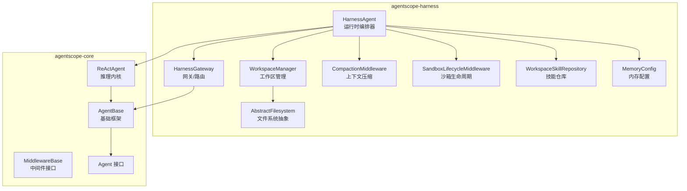
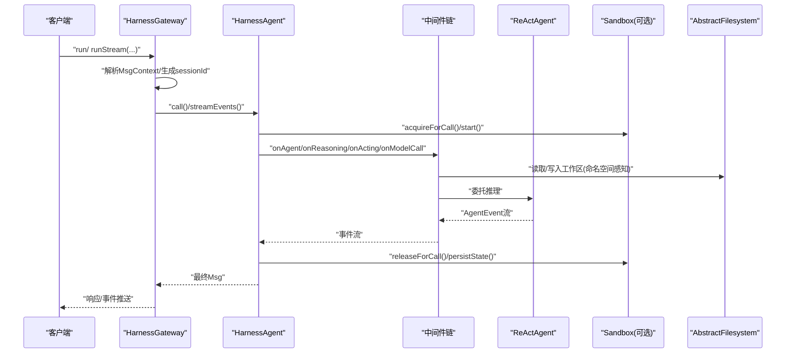
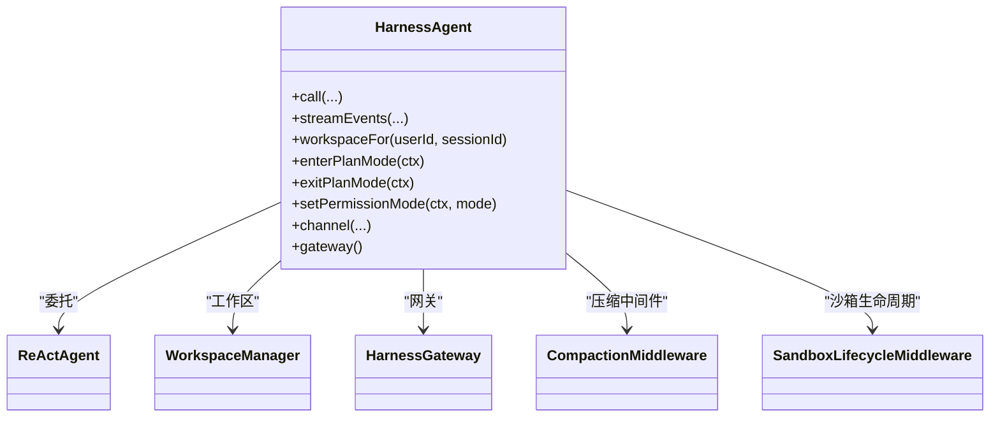
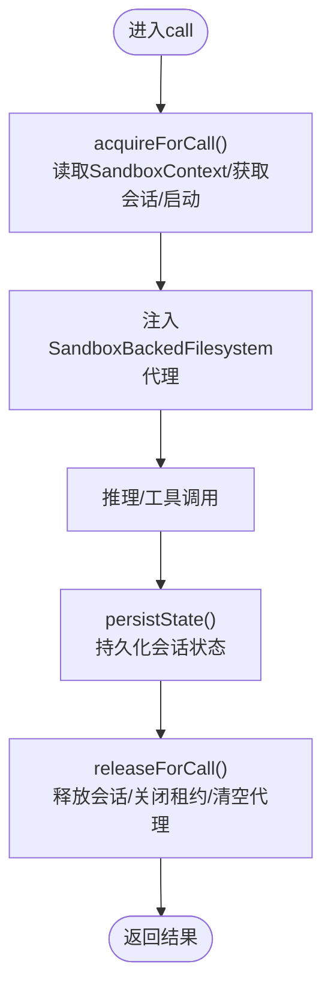
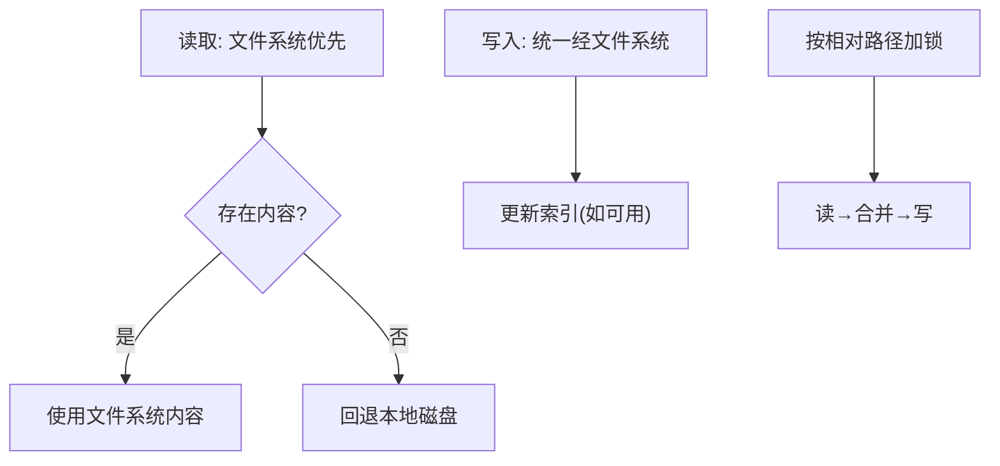
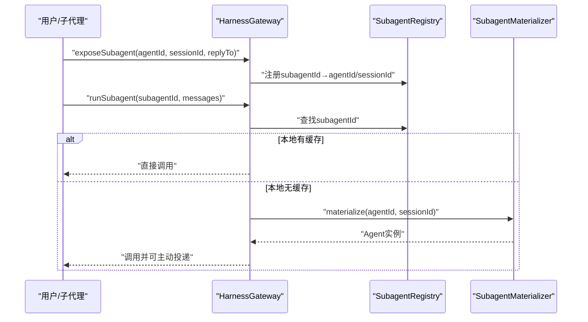
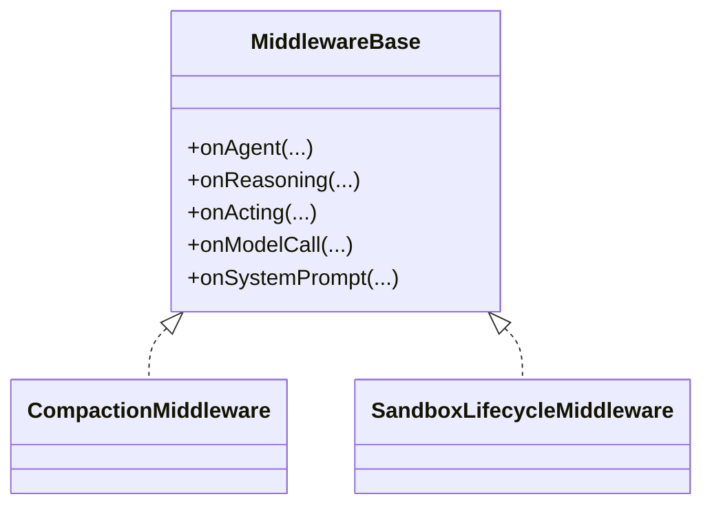
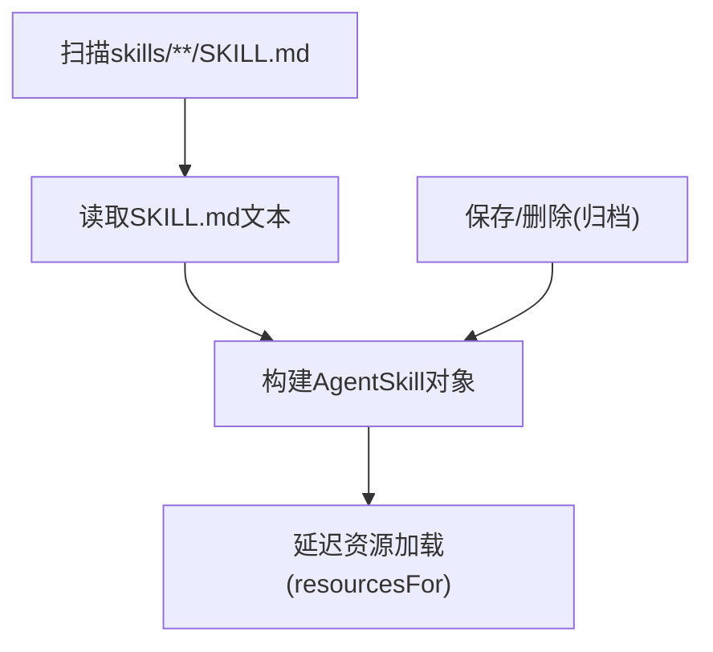
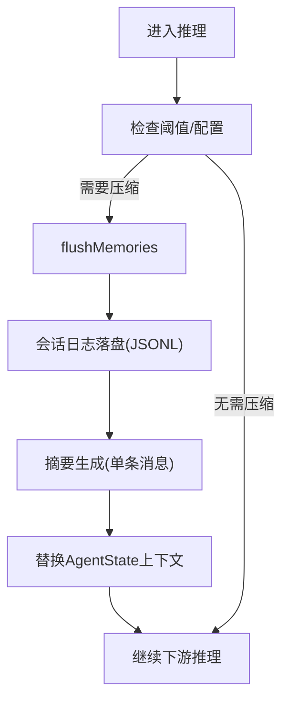
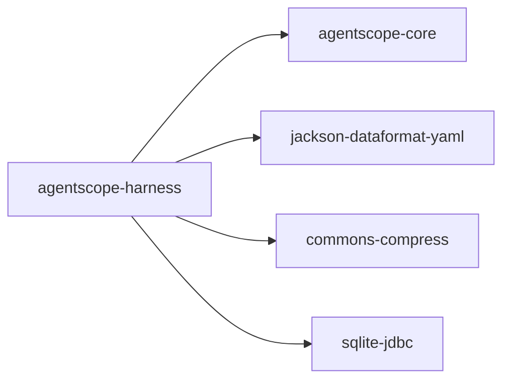

# 运行时环境

<cite>
**本文引用的文件**
- [pom.xml](file://agentscope-harness/pom.xml)
- [HarnessAgent.java](file://agentscope-harness/src/main/java/io/agentscope/harness/agent/HarnessAgent.java)
- [Agent.java](file://agentscope-core/src/main/java/io/agentscope/core/agent/Agent.java)
- [AgentBase.java](file://agentscope-core/src/main/java/io/agentscope/core/agent/AgentBase.java)
- [MiddlewareBase.java](file://agentscope-core/src/main/java/io/agentscope/core/middleware/MiddlewareBase.java)
- [SandboxContext.java](file://agentscope-harness/src/main/java/io/agentscope/harness/agent/sandbox/SandboxContext.java)
- [WorkspaceManager.java](file://agentscope-harness/src/main/java/io/agentscope/harness/agent/workspace/WorkspaceManager.java)
- [HarnessGateway.java](file://agentscope-harness/src/main/java/io/agentscope/harness/agent/gateway/HarnessGateway.java)
- [AbstractFilesystem.java](file://agentscope-harness/src/main/java/io/agentscope/harness/agent/filesystem/AbstractFilesystem.java)
- [CompactionMiddleware.java](file://agentscope-harness/src/main/java/io/agentscope/harness/agent/middleware/CompactionMiddleware.java)
- [SandboxLifecycleMiddleware.java](file://agentscope-harness/src/main/java/io/agentscope/harness/agent/middleware/SandboxLifecycleMiddleware.java)
- [WorkspaceSkillRepository.java](file://agentscope-harness/src/main/java/io/agentscope/harness/agent/skill/WorkspaceSkillRepository.java)
- [MemoryConfig.java](file://agentscope-harness/src/main/java/io/agentscope/harness/agent/memory/MemoryConfig.java)
</cite>

## 目录
1. [引言](#引言)
2. [项目结构](#项目结构)
3. [核心组件](#核心组件)
4. [架构总览](#架构总览)
5. [详细组件分析](#详细组件分析)
6. [依赖分析](#依赖分析)
7. [性能考虑](#性能考虑)
8. [故障排查指南](#故障排查指南)
9. [结论](#结论)
10. [附录](#附录)

## 引言
本文件面向AgentScope Java的运行时环境，聚焦agentscope-harness模块的设计与实现，系统性阐述以下主题：
- 生产级运行时架构：HarnessAgent的设计理念、能力边界与扩展点
- 沙箱隔离机制：沙箱类型、生命周期管理与安全策略
- 工作区管理系统：文件系统抽象、命名空间与持久化策略
- 网关系统：子代理管理、消息路由与并发控制
- 中间件体系：各类中间件职责、装配方式与执行顺序
- 监控与调试：事件流、可观测性与排障建议
- 部署配置与性能优化：内存流水线、压缩与缓存策略

## 项目结构
agentscope-harness作为运行时增强模块，围绕agentscope-core中的ReActAgent提供“工作区+沙箱+子代理+技能+计划模式+MCP”等能力，并通过中间件链路实现横切关注点的解耦。

图示来源
- [HarnessAgent.java:121-146](file://agentscope-harness/src/main/java/io/agentscope/harness/agent/HarnessAgent.java#L121-L146)
- [WorkspaceManager.java:66-96](file://agentscope-harness/src/main/java/io/agentscope/harness/agent/workspace/WorkspaceManager.java#L66-L96)
- [HarnessGateway.java:40-53](file://agentscope-harness/src/main/java/io/agentscope/harness/agent/gateway/HarnessGateway.java#L40-L53)
- [CompactionMiddleware.java:39-52](file://agentscope-harness/src/main/java/io/agentscope/harness/agent/middleware/CompactionMiddleware.java#L39-L52)
- [SandboxLifecycleMiddleware.java:29-50](file://agentscope-harness/src/main/java/io/agentscope/harness/agent/middleware/SandboxLifecycleMiddleware.java#L29-L50)
- [WorkspaceSkillRepository.java:47-66](file://agentscope-harness/src/main/java/io/agentscope/harness/agent/skill/WorkspaceSkillRepository.java#L47-L66)
- [MemoryConfig.java:24-47](file://agentscope-harness/src/main/java/io/agentscope/harness/agent/memory/MemoryConfig.java#L24-L47)

章节来源
- [pom.xml:33-67](file://agentscope-harness/pom.xml#L33-L67)

## 核心组件
- HarnessAgent：对外统一入口，封装ReActAgent并注入工作区、沙箱、子代理、技能、计划模式、MCP等能力；提供事件流、权限模式切换、网关绑定等高级特性。
- WorkspaceManager：两层读取架构（文件系统优先，本地回退）、会话与任务持久化、知识库与技能目录扫描、跨进程锁与索引支持。
- HarnessGateway：多Agent注册、稳定会话映射、并发回合串行化、暴露子代理、跨节点恢复与主动投递。
- AbstractFilesystem：统一的文件操作接口，支持列表、读写、搜索、上传下载、移动删除、存在性检查与路径校验。
- CompactionMiddleware：推理前对话压缩，触发长短期记忆flush、会话日志落盘、摘要生成与上下文替换。
- SandboxLifecycleMiddleware：调用前后沙箱获取/启动/持久化/释放，注入文件系统代理，确保会话隔离。
- WorkspaceSkillRepository：基于文件系统的技能仓库，延迟资源加载、可写/归档、命名空间感知。
- MemoryConfig：长期记忆流水线配置（flush/consolidation/maintenance）与触发策略。

章节来源
- [HarnessAgent.java:121-146](file://agentscope-harness/src/main/java/io/agentscope/harness/agent/HarnessAgent.java#L121-L146)
- [WorkspaceManager.java:66-96](file://agentscope-harness/src/main/java/io/agentscope/harness/agent/workspace/WorkspaceManager.java#L66-L96)
- [HarnessGateway.java:40-53](file://agentscope-harness/src/main/java/io/agentscope/harness/agent/gateway/HarnessGateway.java#L40-L53)
- [AbstractFilesystem.java:32-44](file://agentscope-harness/src/main/java/io/agentscope/harness/agent/filesystem/AbstractFilesystem.java#L32-L44)
- [CompactionMiddleware.java:39-52](file://agentscope-harness/src/main/java/io/agentscope/harness/agent/middleware/CompactionMiddleware.java#L39-L52)
- [SandboxLifecycleMiddleware.java:29-50](file://agentscope-harness/src/main/java/io/agentscope/harness/agent/middleware/SandboxLifecycleMiddleware.java#L29-L50)
- [WorkspaceSkillRepository.java:47-66](file://agentscope-harness/src/main/java/io/agentscope/harness/agent/skill/WorkspaceSkillRepository.java#L47-L66)
- [MemoryConfig.java:24-47](file://agentscope-harness/src/main/java/io/agentscope/harness/agent/memory/MemoryConfig.java#L24-L47)

## 架构总览
下图展示运行时从请求到响应的关键交互路径，涵盖工作区读取、沙箱生命周期、中间件链路、子代理暴露与网关路由。

图示来源
- [HarnessGateway.java:134-204](file://agentscope-harness/src/main/java/io/agentscope/harness/agent/gateway/HarnessGateway.java#L134-L204)
- [HarnessAgent.java:541-713](file://agentscope-harness/src/main/java/io/agentscope/harness/agent/HarnessAgent.java#L541-L713)
- [SandboxLifecycleMiddleware.java:73-134](file://agentscope-harness/src/main/java/io/agentscope/harness/agent/middleware/SandboxLifecycleMiddleware.java#L73-L134)
- [AbstractFilesystem.java:44-187](file://agentscope-harness/src/main/java/io/agentscope/harness/agent/filesystem/AbstractFilesystem.java#L44-L187)

## 详细组件分析

### HarnessAgent 设计与实现
- 职责边界：在ReActAgent之上叠加工作区、沙箱、子代理、技能、计划模式、MCP与内存流水线，提供事件流与权限模式动态切换。
- 并发模型：单实例多会话并发，同一sessionId串行，不同sessionId并行；状态按(userId, sessionId)隔离。
- 关键扩展点：中间件链、工具包、技能仓库、工作区视图工厂、分布式存储与网关桥接。
- 事件流：streamEvents对齐Python 2.0语义，支持子代理事件转发与沙箱生命周期一致性。

图示来源
- [HarnessAgent.java:146-540](file://agentscope-harness/src/main/java/io/agentscope/harness/agent/HarnessAgent.java#L146-L540)

章节来源
- [HarnessAgent.java:121-146](file://agentscope-harness/src/main/java/io/agentscope/harness/agent/HarnessAgent.java#L121-L146)
- [Agent.java:21-47](file://agentscope-core/src/main/java/io/agentscope/core/agent/Agent.java#L21-L47)
- [AgentBase.java:66-90](file://agentscope-core/src/main/java/io/agentscope/core/agent/AgentBase.java#L66-L90)

### 沙箱隔离机制
- SandboxContext：封装沙箱客户端、工作区规格、快照规格、外部沙箱与隔离范围，随RuntimeContext注入。
- 生命周期中间件：在call前后自动acquire/start/persist/release，注入SandboxBackedFilesystem代理，失败时清理租约。
- 安全策略：隔离范围由IsolationScope定义；文件系统代理在acquire阶段注入当前会话，释放阶段清空，避免跨调用污染。

图示来源
- [SandboxLifecycleMiddleware.java:73-134](file://agentscope-harness/src/main/java/io/agentscope/harness/agent/middleware/SandboxLifecycleMiddleware.java#L73-L134)
- [SandboxContext.java:27-73](file://agentscope-harness/src/main/java/io/agentscope/harness/agent/sandbox/SandboxContext.java#L27-L73)

章节来源
- [SandboxLifecycleMiddleware.java:29-50](file://agentscope-harness/src/main/java/io/agentscope/harness/agent/middleware/SandboxLifecycleMiddleware.java#L29-L50)
- [SandboxContext.java:21-73](file://agentscope-harness/src/main/java/io/agentscope/harness/agent/sandbox/SandboxContext.java#L21-L73)

### 工作区管理系统
- 两层读取：文件系统优先，本地回退；写入统一走文件系统；列出合并去重。
- 命名空间：通过NamespaceFactory在运行时注入用户/会话前缀，保证数据隔离。
- 会话与任务：JSONL会话上下文与日志、任务记录持久化、清扫标记与最近窗口扫描。
- 并发控制：按相对路径加锁，保障读→合并→写原子性；远程后端需配合CAS。
- 索引：Best-effort SQLite索引，便于统计与查询。

图示来源
- [WorkspaceManager.java:66-96](file://agentscope-harness/src/main/java/io/agentscope/harness/agent/workspace/WorkspaceManager.java#L66-L96)
- [WorkspaceManager.java:367-394](file://agentscope-harness/src/main/java/io/agentscope/harness/agent/workspace/WorkspaceManager.java#L367-L394)
- [AbstractFilesystem.java:44-187](file://agentscope-harness/src/main/java/io/agentscope/harness/agent/filesystem/AbstractFilesystem.java#L44-L187)

章节来源
- [WorkspaceManager.java:66-188](file://agentscope-harness/src/main/java/io/agentscope/harness/agent/workspace/WorkspaceManager.java#L66-L188)
- [AbstractFilesystem.java:32-44](file://agentscope-harness/src/main/java/io/agentscope/harness/agent/filesystem/AbstractFilesystem.java#L32-L44)

### 网关系统
- 多Agent注册与默认回退；稳定会话映射（canonicalKey→sessionId）；回合串行化防止并发冲突。
- 子代理暴露：生成subagentId，记录到持久化注册表，支持跨节点/重启重建；主动投递通过OutboundAddress完成。
- 路由：根据MsgContext选择Agent或默认主Agent；支持run/runStream与runSubagent。

图示来源
- [HarnessGateway.java:244-358](file://agentscope-harness/src/main/java/io/agentscope/harness/agent/gateway/HarnessGateway.java#L244-L358)

章节来源
- [HarnessGateway.java:40-92](file://agentscope-harness/src/main/java/io/agentscope/harness/agent/gateway/HarnessGateway.java#L40-L92)

### 中间件系统
- 中间件接口：onAgent/onReasoning/onActing/onModelCall/onSystemPrompt五类钩子，默认透传。
- 典型中间件：
  - CompactionMiddleware：推理前压缩，触发flush/offload/摘要生成，替换AgentState上下文。
  - SandboxLifecycleMiddleware：沙箱生命周期管理，注入/释放文件系统代理。
- 执行顺序：以洋葱模型组合，外层先执行，内层后执行；系统钩子与运行时上下文感知。

图示来源
- [MiddlewareBase.java:25-58](file://agentscope-core/src/main/java/io/agentscope/core/middleware/MiddlewareBase.java#L25-L58)
- [CompactionMiddleware.java:39-66](file://agentscope-harness/src/main/java/io/agentscope/harness/agent/middleware/CompactionMiddleware.java#L39-L66)
- [SandboxLifecycleMiddleware.java:29-64](file://agentscope-harness/src/main/java/io/agentscope/harness/agent/middleware/SandboxLifecycleMiddleware.java#L29-L64)

章节来源
- [MiddlewareBase.java:25-144](file://agentscope-core/src/main/java/io/agentscope/core/middleware/MiddlewareBase.java#L25-L144)
- [CompactionMiddleware.java:39-156](file://agentscope-harness/src/main/java/io/agentscope/harness/agent/middleware/CompactionMiddleware.java#L39-L156)
- [SandboxLifecycleMiddleware.java:29-136](file://agentscope-harness/src/main/java/io/agentscope/harness/agent/middleware/SandboxLifecycleMiddleware.java#L29-L136)

### 技能管理与自学习
- WorkspaceSkillRepository：基于文件系统的技能仓库，延迟资源加载，支持保存/删除（归档），命名空间透明。
- 自学习闭环：Draft草稿写入远程后端直达共享层，促进跨副本审批；Promoter/审计日志/使用统计支撑治理。

图示来源
- [WorkspaceSkillRepository.java:135-220](file://agentscope-harness/src/main/java/io/agentscope/harness/agent/skill/WorkspaceSkillRepository.java#L135-L220)

章节来源
- [WorkspaceSkillRepository.java:47-129](file://agentscope-harness/src/main/java/io/agentscope/harness/agent/skill/WorkspaceSkillRepository.java#L47-L129)

### 内存流水线与压缩
- MemoryConfig：统一配置flush/consolidation/maintenance参数，支持模型覆盖与触发策略。
- CompactionMiddleware：在推理前进行上下文压缩，必要时触发flush与摘要生成，降低上下文长度。

图示来源
- [MemoryConfig.java:24-47](file://agentscope-harness/src/main/java/io/agentscope/harness/agent/memory/MemoryConfig.java#L24-L47)
- [CompactionMiddleware.java:68-139](file://agentscope-harness/src/main/java/io/agentscope/harness/agent/middleware/CompactionMiddleware.java#L68-L139)

章节来源
- [MemoryConfig.java:48-349](file://agentscope-harness/src/main/java/io/agentscope/harness/agent/memory/MemoryConfig.java#L48-L349)
- [CompactionMiddleware.java:39-156](file://agentscope-harness/src/main/java/io/agentscope/harness/agent/middleware/CompactionMiddleware.java#L39-L156)

## 依赖分析
- 模块依赖：agentscope-harness依赖agentscope-core；测试依赖core提供的test-jar。
- 第三方依赖：Jackson YAML用于子代理配置解析；Apache Commons Compress用于沙箱安全解压；SQLite JDBC用于最佳努力索引。

图示来源
- [pom.xml:33-67](file://agentscope-harness/pom.xml#L33-L67)

章节来源
- [pom.xml:18-67](file://agentscope-harness/pom.xml#L18-L67)

## 性能考虑
- 上下文压缩：合理配置压缩阈值与摘要提示词，减少推理成本；结合MemoryConfig的flush策略平衡吞吐与成本。
- 文件系统索引：启用best-effort索引以加速读取；在Windows测试场景中注意索引句柄释放。
- 并发与序列化：利用会话级序列化门控避免竞态；子代理暴露采用持久化注册表与材料化器，降低跨节点重建开销。
- 沙箱预热：在高延迟沙箱场景中，通过生命周期中间件的acquire/start提前建立会话，缩短首次调用延迟。
- I/O批量化：批量上传/下载与glob搜索减少往返次数；路径锁粒度控制在相对路径级别，避免全局阻塞。

## 故障排查指南
- 事件流定位：使用streamEvents获取细粒度AgentEvent，结合网关deliverToSession进行主动投递验证。
- 权限与中断：通过setPermissionMode动态调整权限模式；利用AgentBase的中断机制与GracefulShutdownManager进行优雅停机。
- 沙箱问题：检查acquire/start失败日志与租约关闭；确认SandboxBackedFilesystem代理是否正确注入/清空。
- 工作区异常：核对命名空间路径、相对路径规范化与路径锁；远程后端需配合CAS避免竞态。
- 记忆流水线：若压缩失败，中间件会降级继续推理；检查flush/consolidation提示词与模型可用性。

章节来源
- [HarnessAgent.java:541-713](file://agentscope-harness/src/main/java/io/agentscope/harness/agent/HarnessAgent.java#L541-L713)
- [AgentBase.java:470-520](file://agentscope-core/src/main/java/io/agentscope/core/agent/AgentBase.java#L470-L520)
- [SandboxLifecycleMiddleware.java:73-134](file://agentscope-harness/src/main/java/io/agentscope/harness/agent/middleware/SandboxLifecycleMiddleware.java#L73-L134)
- [WorkspaceManager.java:367-394](file://agentscope-harness/src/main/java/io/agentscope/harness/agent/workspace/WorkspaceManager.java#L367-L394)
- [CompactionMiddleware.java:129-138](file://agentscope-harness/src/main/java/io/agentscope/harness/agent/middleware/CompactionMiddleware.java#L129-L138)

## 结论
agentscope-harness通过“运行时编排器+文件系统抽象+中间件链+网关路由”的架构，将工作区、沙箱、子代理、技能与计划模式等能力有机整合，形成可扩展、可观测、可治理的生产级运行时。借助事件流、命名空间与索引、压缩与flush流水线以及沙箱生命周期管理，系统在安全性、隔离性与性能之间取得良好平衡。

## 附录
- 部署建议
  - 使用MemoryConfig的THROTTLED flush策略降低频繁flush带来的成本。
  - 在多节点部署中启用分布式store-backed注册表与材料化器，提升子代理跨节点可用性。
  - 对Windows测试场景，注意关闭WorkspaceIndex以释放SQLite句柄。
- 性能优化
  - 合理设置压缩阈值与摘要提示词，减少上下文长度。
  - 利用best-effort索引与路径锁，避免热点路径阻塞。
  - 沙箱预热与I/O批量化，降低首调延迟与网络往返。